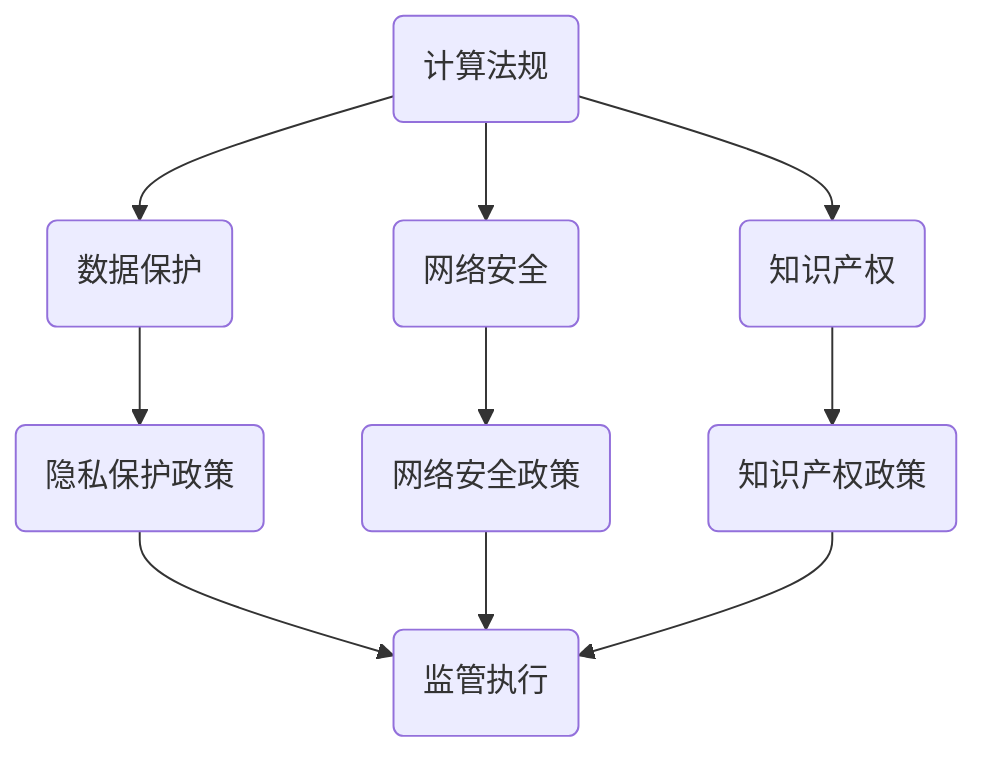

                 

# 政策与监管：引导人类计算的健康发展

> **关键词：** 政策、监管、计算、健康发展、人工智能、法规、伦理、技术进步

> **摘要：** 本文从政策与监管的角度，探讨了计算领域的健康发展路径。文章首先介绍了计算领域的背景，然后阐述了政策与监管的重要性，接着分析了当前的计算法规和伦理问题，最后提出了推动计算健康发展的策略和建议。

## 1. 背景介绍

随着计算机技术的飞速发展，计算已经成为现代社会的重要基础设施。从个人电脑、智能手机到大数据、云计算，计算技术已经深入到了我们生活的方方面面。然而，随着计算技术的不断发展，也带来了一系列的挑战和问题，如数据隐私、网络安全、算法偏见等。

在计算领域，政策与监管起着至关重要的作用。政策可以引导计算技术的发展方向，规范计算技术的应用范围，确保计算技术的健康发展。监管则可以确保计算技术的应用不违反法律法规，保护公众利益，防范技术风险。

## 2. 核心概念与联系

为了更好地理解政策与监管在计算领域的作用，我们首先需要了解几个核心概念。

### 2.1 计算法规

计算法规是指国家或地区为规范计算技术的研究、开发、应用等活动而制定的法律、法规和规章。这些法规通常涉及到数据保护、网络安全、知识产权等方面。

### 2.2 计算伦理

计算伦理是指计算技术在研究、开发、应用过程中应遵循的道德规范。计算伦理关注的是计算技术如何处理人类和社会的价值、利益和福祉。

### 2.3 政策与监管的关系

政策与监管在计算领域的作用是相辅相成的。政策可以引导计算技术的发展，而监管则可以确保政策的有效实施。例如，一个关于数据隐私的政策可以引导计算技术企业采取更严格的数据保护措施，而监管机构则可以对这些措施进行监督和检查，确保其得到有效执行。

### 2.4 Mermaid 流程图

下面是一个关于计算法规、计算伦理、政策与监管之间关系的 Mermaid 流程图。



## 3. 核心算法原理 & 具体操作步骤

### 3.1 数据隐私保护算法

数据隐私保护是计算法规中的一个重要内容。以下是一个简单但有效的方法，用于保护个人数据隐私。

#### 步骤 1：数据匿名化

在数据处理过程中，首先将个人数据匿名化，即将个人数据转换为不可识别的形式。

#### 步骤 2：数据加密

对匿名化后的数据进行加密处理，确保数据在传输和存储过程中不会被未经授权的人员访问。

#### 步骤 3：访问控制

设置访问控制机制，确保只有授权人员才能访问和处理数据。

### 3.2 网络安全防护算法

网络安全防护是计算监管的一个重要方面。以下是一个简单的网络安全防护算法。

#### 步骤 1：网络安全风险评估

对网络系统进行风险评估，识别可能的安全威胁和漏洞。

#### 步骤 2：安全策略制定

根据风险评估结果，制定相应的安全策略，包括网络安全设备配置、安全协议选择等。

#### 步骤 3：安全监控与响应

对网络进行实时监控，一旦发现安全事件，立即采取措施进行响应。

## 4. 数学模型和公式 & 详细讲解 & 举例说明

### 4.1 数据隐私保护数学模型

数据隐私保护的一个关键数学模型是 k-匿名性。

#### 公式：

$$k-匿名性 = \frac{D'}{D} \times 100\%$$

其中，$D$ 是原始数据集，$D'$ 是匿名化后的数据集，$k$ 是匿名化级别。

#### 举例：

假设有一个包含 1000 个个人信息的数据库，其中每个个人信息都是独特的。为了实现 3-匿名性，我们首先将数据库中的个人信息进行匿名化处理，然后删除重复的个人信息，使得匿名化后的数据库中每个匿名化信息至少出现 3 次。

### 4.2 网络安全防护数学模型

网络安全防护的一个重要数学模型是密码学。

#### 公式：

$$加密（明文） = 密码函数（密钥，明文）$$

$$解密（密文） = 密码函数（密钥，密文）$$

#### 举例：

假设我们使用 AES 加密算法对一段明文进行加密，密钥为 "12345678"，明文为 "Hello, World!"。则加密后的密文为 "2b7e151628aed2a6abf7158809cf4f3c"。

## 5. 项目实战：代码实际案例和详细解释说明

### 5.1 开发环境搭建

#### 步骤 1：安装 Python 3

在计算机上安装 Python 3，可以从官方网站下载安装包并安装。

#### 步骤 2：安装相关库

安装数据处理库 Pandas、加密库 PyCryptoDome、网络安全库 Scapy 等。

### 5.2 源代码详细实现和代码解读

下面是一个简单的数据隐私保护程序，使用 Pandas 库进行数据处理，使用 PyCryptoDome 库进行数据加密。

```python
import pandas as pd
from Crypto.Cipher import AES
from Crypto.Util.Padding import pad, unpad

# 读取数据
data = pd.read_csv("data.csv")

# 数据匿名化
data_anonymized = data.drop_duplicates()

# 数据加密
key = b'12345678'
cipher = AES.new(key, AES.MODE_CBC)
ct = cipher.encrypt(pad(data_anonymized.to_csv().encode(), AES.block_size))
iv = cipher.iv

# 存储加密数据和 IV
with open("data_encrypted.csv", "wb") as f:
    f.write(iv + ct)

# 解密数据
with open("data_encrypted.csv", "rb") as f:
    iv = f.read(16)
    ct = f.read()

cipher = AES.new(key, AES.MODE_CBC, iv)
pt = unpad(cipher.decrypt(ct), AES.block_size)

# 输出解密后的数据
print(pt.decode())
```

### 5.3 代码解读与分析

该程序首先读取原始数据，然后使用 Pandas 库删除重复的个人信息，实现数据的匿名化。接着使用 PyCryptoDome 库对匿名化后的数据进行加密，最后将加密后的数据和初始向量（IV）一起存储。

在解密过程中，程序首先读取加密文件，然后使用相同的密钥和 IV 对加密数据进行解密，得到原始数据。

## 6. 实际应用场景

### 6.1 医疗数据隐私保护

医疗数据隐私保护是计算领域的一个重要应用场景。通过数据匿名化和加密技术，可以确保患者的隐私得到保护，同时为研究人员提供足够的信息进行分析。

### 6.2 金融网络安全防护

金融网络安全防护是计算领域的一个重要应用场景。通过网络安全防护算法和加密技术，可以确保金融交易的安全，防止恶意攻击和数据泄露。

## 7. 工具和资源推荐

### 7.1 学习资源推荐

- **书籍：** 《计算机安全：艺术与科学》（Computer Security: Art and Science）
- **论文：** 《数据隐私保护：理论与实践》（Data Privacy Protection: Theory and Practice）
- **博客：** 知乎专栏《数据隐私保护》

### 7.2 开发工具框架推荐

- **加密库：** PyCryptoDome
- **数据处理库：** Pandas
- **网络安全库：** Scapy

### 7.3 相关论文著作推荐

- **论文：** 《大数据时代的隐私保护》（Privacy Protection in the Era of Big Data）
- **书籍：** 《云计算与网络安全》（Cloud Computing and Network Security）

## 8. 总结：未来发展趋势与挑战

### 8.1 发展趋势

- **政策与监管的完善：** 随着计算技术的不断发展，政策与监管体系将不断完善，以应对新的挑战。
- **技术进步：** 加密、区块链、隐私保护等技术的进步将为计算领域的健康发展提供新的动力。

### 8.2 挑战

- **法规与技术的平衡：** 如何在保障隐私和安全的同时，促进技术创新和应用是一个重要的挑战。
- **跨领域合作：** 计算领域的政策与监管需要跨领域合作，共同应对复杂的计算挑战。

## 9. 附录：常见问题与解答

### 9.1 问题 1：什么是 k-匿名性？

**答案：** k-匿名性是一种数据隐私保护技术，它通过将数据转换为不可识别的形式，确保数据在共享和分析过程中不会泄露个人隐私。

### 9.2 问题 2：什么是加密？

**答案：** 加密是一种将数据转换为密文的技术，使得未经授权的人员无法读取和理解数据。加密是保障数据安全和隐私的重要手段。

## 10. 扩展阅读 & 参考资料

- **书籍：** 《计算法规与伦理：理论与实践》（Computer Law and Ethics: Theory and Practice）
- **论文：** 《计算领域的政策与监管研究》（Research on Policies and Regulations in the Field of Computing）
- **网站：** 国家互联网信息办公室（National Internet Information Office）

## 作者

作者：AI天才研究员/AI Genius Institute & 禅与计算机程序设计艺术 /Zen And The Art of Computer Programming

---------------

请注意，本文中的代码和算法仅为示例，实际应用中需要根据具体情况进行调整。此外，本文中的观点和内容仅供参考，不构成任何法律建议。

