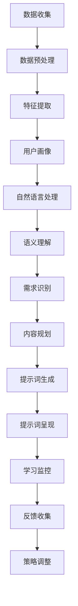

                 

### 背景介绍

#### 个性化学习的需求与挑战

在当今信息化时代，教育资源的丰富和获取渠道的多样化使得个性化学习成为可能。然而，随着学习者的数量不断增加，学习需求的多样化以及学习资源的爆炸性增长，传统的教学方法和教育模式面临着巨大的挑战。传统教育模式中，教师往往采用“一刀切”的方式，难以满足每个学生的学习需求，导致部分学生产生厌学情绪，学习效果不佳。

个性化学习的需求在于，每个学习者都有其独特的学习习惯、学习节奏和学习能力。为了实现个性化学习，教育系统需要根据学习者的个性特点、学习目标和当前的知识水平，量身定制学习计划、学习内容和教学方法。这样的教育模式不仅能提高学习效率，还能激发学生的学习兴趣，培养他们的自主学习能力。

然而，实现个性化学习并非易事，面临以下几大挑战：

1. **数据收集与处理**：个性化学习依赖于对学习者学习数据的收集和分析，包括学习行为、知识水平、兴趣爱好等。如何高效、准确地收集这些数据，并对其进行处理和分析，是个性化学习的一个关键问题。

2. **模型构建与优化**：个性化学习需要构建合适的数学模型和算法，以根据学习者的特点动态调整学习内容和教学策略。模型的构建和优化需要大量的理论研究和实践经验。

3. **技术与资源的整合**：个性化学习需要结合多种技术，如人工智能、大数据分析、虚拟现实等，以及丰富的学习资源，如在线课程、电子书、实验项目等。如何将这些技术和资源有效地整合，实现无缝的学习体验，是一个挑战。

4. **政策与制度的支持**：个性化学习需要教育政策的支持和制度的保障，如教学评价体系的改革、教师培训体系的完善等。这些改革和完善的实施，需要政府、教育机构和社会各界的共同努力。

#### 提示词驱动的个性化学习助手

提示词驱动的个性化学习助手正是为了应对这些挑战而提出的一种解决方案。它利用人工智能和自然语言处理技术，通过分析学习者的行为数据和语言表达，生成个性化的提示词，引导学习者进行有效的学习。

提示词驱动的个性化学习助手的工作原理可以分为以下几个步骤：

1. **数据收集与处理**：学习助手首先通过多种渠道收集学习者的行为数据，如学习时间、学习内容、学习进度等，并利用自然语言处理技术对这些数据进行处理和分析，提取关键信息。

2. **用户画像构建**：根据收集到的数据，学习助手构建学习者的用户画像，包括学习偏好、知识水平、兴趣爱好等。

3. **提示词生成**：学习助手利用机器学习算法，根据用户画像和学习目标，生成个性化的提示词。这些提示词可以是问题的形式，引导学习者进行思考和探究；也可以是任务的形式，激发学习者的学习兴趣和主动性。

4. **学习引导与反馈**：学习助手通过将提示词呈现给学习者，引导他们进行学习。同时，学习助手还会对学习者的学习过程进行监控，根据学习者的反馈和学习效果，动态调整提示词。

通过这样的工作流程，提示词驱动的个性化学习助手能够根据学习者的个性化需求，提供量身定制的学习指导，帮助学习者更高效地掌握知识。

#### 文章结构概述

本文将围绕提示词驱动的个性化学习助手这一主题，从以下几个方面进行探讨：

1. **背景介绍**：介绍个性化学习的需求与挑战，以及提示词驱动的个性化学习助手的概念和工作原理。
2. **核心概念与联系**：详细阐述提示词驱动的个性化学习助手的架构和核心概念，包括用户画像、机器学习算法等。
3. **核心算法原理 & 具体操作步骤**：分析提示词生成的算法原理，并详细说明具体操作步骤。
4. **数学模型和公式 & 详细讲解 & 举例说明**：介绍提示词生成过程中涉及的数学模型和公式，并进行详细讲解和举例说明。
5. **项目实战：代码实际案例和详细解释说明**：通过一个实际的项目案例，展示如何实现提示词驱动的个性化学习助手，并提供详细的代码解读和分析。
6. **实际应用场景**：探讨提示词驱动的个性化学习助手在不同教育场景中的应用。
7. **工具和资源推荐**：推荐相关的学习资源、开发工具和论文著作，以供读者进一步学习和研究。
8. **总结：未来发展趋势与挑战**：总结提示词驱动的个性化学习助手的发展趋势和面临的挑战，展望未来的发展方向。
9. **附录：常见问题与解答**：解答读者可能遇到的一些常见问题，帮助读者更好地理解和应用提示词驱动的个性化学习助手。
10. **扩展阅读 & 参考资料**：提供一些扩展阅读资料和参考文献，供读者进一步深入研究。

接下来，我们将进一步探讨提示词驱动的个性化学习助手的架构和核心概念，为后续内容的讨论奠定基础。

---

# 教育革新：提示词驱动的个性化学习助手

关键词：个性化学习、提示词、自然语言处理、机器学习、教育助手

摘要：随着教育信息化的发展，个性化学习成为教育领域的重要需求。本文提出了一种基于提示词驱动的个性化学习助手，通过分析学习者的行为数据和语言表达，生成个性化的提示词，引导学习者进行有效的学习。本文将详细阐述提示词驱动的个性化学习助手的架构、核心算法原理、数学模型、实际应用场景，以及未来发展趋势和挑战，旨在为教育革新提供新的思路和方法。

---

## 1. 背景介绍

在教育信息化浪潮的推动下，个性化学习已经成为教育领域的一个重要议题。个性化学习旨在通过了解学习者的学习习惯、能力水平和兴趣爱好，为其提供量身定制的学习内容和教学方法，从而提高学习效果和满足个性化需求。然而，实现个性化学习面临着诸多挑战，如数据收集与处理、模型构建与优化、技术与资源的整合、政策与制度的支持等。

在这一背景下，本文提出了一种基于提示词驱动的个性化学习助手。提示词驱动的个性化学习助手利用人工智能和自然语言处理技术，通过分析学习者的行为数据和语言表达，生成个性化的提示词，引导学习者进行有效的学习。本文将从以下几个方面进行探讨：

1. **背景介绍**：介绍个性化学习的需求与挑战，以及提示词驱动的个性化学习助手的概念和工作原理。
2. **核心概念与联系**：详细阐述提示词驱动的个性化学习助手的架构和核心概念，包括用户画像、机器学习算法等。
3. **核心算法原理 & 具体操作步骤**：分析提示词生成的算法原理，并详细说明具体操作步骤。
4. **数学模型和公式 & 详细讲解 & 举例说明**：介绍提示词生成过程中涉及的数学模型和公式，并进行详细讲解和举例说明。
5. **项目实战：代码实际案例和详细解释说明**：通过一个实际的项目案例，展示如何实现提示词驱动的个性化学习助手，并提供详细的代码解读和分析。
6. **实际应用场景**：探讨提示词驱动的个性化学习助手在不同教育场景中的应用。
7. **工具和资源推荐**：推荐相关的学习资源、开发工具和论文著作，以供读者进一步学习和研究。
8. **总结：未来发展趋势与挑战**：总结提示词驱动的个性化学习助手的发展趋势和面临的挑战，展望未来的发展方向。
9. **附录：常见问题与解答**：解答读者可能遇到的一些常见问题，帮助读者更好地理解和应用提示词驱动的个性化学习助手。
10. **扩展阅读 & 参考资料**：提供一些扩展阅读资料和参考文献，供读者进一步深入研究。

接下来，我们将首先介绍提示词驱动的个性化学习助手的基本概念和工作原理，为后续内容的讨论奠定基础。

---

### 2. 核心概念与联系

#### 提示词驱动的个性化学习助手架构

提示词驱动的个性化学习助手是一个复杂的教育辅助系统，它涉及多个核心概念和技术模块。以下是该系统的主要组成部分及其相互关系：

1. **用户画像**：用户画像是对学习者个性、兴趣、知识水平和行为习惯的抽象表示。它通过分析学习者的学习数据（如学习时间、学习内容、学习进度等）构建而成。用户画像为个性化学习提供了基础数据支持。

2. **自然语言处理（NLP）模块**：NLP模块负责处理学习者的语言输入，包括文本分析和语义理解。通过NLP技术，系统能够提取出学习者的关键信息和需求。

3. **机器学习算法**：机器学习算法是提示词生成的核心。它们根据用户画像和NLP模块提取的信息，通过学习算法模型生成个性化的提示词。这些算法可以是基于统计模型、深度学习模型等。

4. **提示词生成模块**：提示词生成模块将机器学习算法的输出转换为具体的提示词，如问题、任务或建议。这些提示词旨在引导学习者进行有效的学习活动。

5. **学习引导与反馈系统**：学习引导与反馈系统负责将生成的提示词呈现给学习者，并根据学习者的反馈和学习效果，动态调整提示词和教学策略。

#### 用户画像

用户画像是提示词驱动的个性化学习助手的基石，它通过多种数据源收集学习者的信息，包括：

- **学习行为数据**：如学习时间、学习频率、学习内容选择等。
- **知识水平数据**：通过在线测验、作业成绩等评估学习者的知识掌握情况。
- **兴趣爱好数据**：通过学习者对学习内容的兴趣点、偏好等分析得出。
- **行为日志数据**：记录学习者的学习路径、互动行为等。

用户画像的构建过程通常包括以下几个步骤：

1. **数据收集**：从多个数据源（如学习平台、学习设备、社交媒体等）收集学习者的数据。
2. **数据预处理**：清洗和标准化收集到的数据，使其适合进行分析。
3. **特征提取**：从预处理后的数据中提取出有代表性的特征，如学习时长、学习内容、成绩分布等。
4. **模型训练**：利用机器学习算法，根据提取的特征构建用户画像模型。

用户画像的优势在于：

- **个性识别**：帮助系统更准确地识别学习者的个性化需求。
- **学习预测**：预测学习者的学习行为和知识掌握情况，为后续的提示词生成提供依据。
- **效果评估**：评估个性化学习策略的效果，为系统的优化提供反馈。

#### 自然语言处理（NLP）模块

NLP模块是提示词驱动的个性化学习助手的关键组成部分，它主要负责处理学习者的语言输入。以下是NLP模块的核心功能：

1. **文本分析**：包括分词、词性标注、句法分析等，将自然语言文本转换为结构化的数据形式。
2. **语义理解**：通过词义消歧、情感分析等，理解学习者的意图和需求。
3. **语言生成**：根据理解的结果，生成自然语言文本，包括提示词、任务说明等。

NLP模块的技术原理涉及以下方面：

- **词向量表示**：使用Word2Vec、GloVe等技术，将单词映射到高维向量空间，以便进行数学运算。
- **序列模型**：使用RNN、LSTM、GRU等神经网络模型，处理和预测序列数据。
- **深度学习**：使用卷积神经网络（CNN）和递归神经网络（RNN）的组合，进行文本分类、情感分析等任务。

#### 机器学习算法

机器学习算法是提示词驱动的个性化学习助手的智能核心，它通过分析用户画像和NLP模块提取的信息，生成个性化的提示词。以下是几种常用的机器学习算法：

1. **统计模型**：如贝叶斯分类器、逻辑回归等，适用于简单且易于解释的提示词生成任务。
2. **深度学习模型**：如卷积神经网络（CNN）、循环神经网络（RNN）等，适用于复杂且大规模的数据集。
3. **强化学习**：通过试错和反馈机制，不断优化提示词生成策略，提高学习效果。

#### 提示词生成模块

提示词生成模块负责将机器学习算法的输出转换为具体的提示词，这些提示词可以是问题、任务、建议等形式，旨在引导学习者进行有效的学习活动。以下是提示词生成模块的关键步骤：

1. **需求识别**：根据用户画像和NLP模块的信息，识别学习者的当前需求和兴趣点。
2. **内容规划**：根据需求识别的结果，规划学习内容，包括知识点、任务类型、学习目标等。
3. **提示词生成**：利用机器学习算法，生成与学习内容相对应的提示词。
4. **动态调整**：根据学习者的反馈和学习效果，动态调整提示词和教学策略。

#### 学习引导与反馈系统

学习引导与反馈系统是提示词驱动的个性化学习助手的最后一步，它负责将生成的提示词呈现给学习者，并根据学习者的反馈和学习效果，动态调整提示词和教学策略。以下是学习引导与反馈系统的主要功能：

1. **提示词呈现**：将生成的提示词以合适的形式呈现给学习者，如文本、图片、语音等。
2. **学习监控**：实时监控学习者的学习过程，记录学习行为、学习进度等。
3. **反馈收集**：收集学习者的反馈信息，如满意度、学习效果等。
4. **策略调整**：根据收集到的反馈信息，动态调整提示词和教学策略，以优化学习效果。

#### Mermaid 流程图

为了更直观地展示提示词驱动的个性化学习助手的架构和核心概念，我们使用Mermaid语言绘制一个流程图。以下是一个简化的流程图示例：



通过上述核心概念和联系的介绍，我们可以看到提示词驱动的个性化学习助手是一个集多种技术于一体的综合性系统，它通过分析学习者的个性化需求，生成个性化的提示词，引导学习者进行有效的学习。接下来，我们将深入探讨提示词驱动的个性化学习助手的核心算法原理和具体操作步骤。

---

### 3. 核心算法原理 & 具体操作步骤

提示词驱动的个性化学习助手的核心在于其算法原理，这些算法决定了如何根据学习者的个性化需求生成有效的提示词。以下是提示词驱动的个性化学习助手的算法原理及具体操作步骤。

#### 3.1 数据收集与预处理

提示词驱动的个性化学习助手首先需要收集学习者的数据，这些数据包括学习行为数据、知识水平数据和兴趣爱好数据。以下是一个简化的数据收集与预处理流程：

1. **数据收集**：从学习平台、学习设备、社交媒体等渠道收集学习者的数据。例如，学习时间、学习内容、学习进度、考试成绩、学习路径等。

2. **数据清洗**：清洗收集到的数据，去除无效或错误的数据。例如，去除重复记录、缺失值填补、异常值处理等。

3. **数据标准化**：将不同类型的数据进行标准化处理，使其具有可比性。例如，将时间数据统一为秒、将考试成绩统一为百分制等。

4. **特征提取**：从清洗和标准化的数据中提取出有代表性的特征。例如，学习时长、学习内容类别、成绩分布等。这些特征将用于构建用户画像。

#### 3.2 用户画像构建

用户画像是对学习者个性、兴趣、知识水平和行为习惯的抽象表示。构建用户画像的步骤如下：

1. **特征选择**：从提取的特征中选出对个性化学习具有重要意义的特征。例如，学习时长、学习内容类别、考试成绩等。

2. **特征转换**：将选出的特征转换为适合机器学习的形式。例如，使用独热编码将类别特征转换为二进制向量。

3. **特征权重计算**：利用机器学习算法，如随机森林、支持向量机等，计算每个特征的权重。这些权重将用于构建用户画像。

4. **用户画像生成**：根据特征权重，生成学习者的用户画像。用户画像通常是一个多维向量，每个维度代表一个特征。

#### 3.3 自然语言处理（NLP）模块

NLP模块负责处理学习者的语言输入，提取关键信息。以下是NLP模块的主要步骤：

1. **分词**：将自然语言文本分割为单词或短语。例如，"我爱学习"可以被分割为"我"、"爱"、"学习"。

2. **词性标注**：为每个单词或短语标注词性，如名词、动词、形容词等。例如，"学习"被标注为动词。

3. **句法分析**：分析句子的结构，确定单词之间的关系。例如，"我正在学习编程"可以分析出主语"我"、谓语"正在学习"、宾语"编程"。

4. **语义理解**：根据词性和句法分析的结果，理解句子的含义。例如，"我正在学习编程"表示学习者正在学习编程语言。

5. **意图识别**：识别学习者的意图，如提问、寻求帮助、表达兴趣等。例如，"我为什么学不会编程？"表示学习者对学习进度感到困惑。

#### 3.4 提示词生成

提示词生成是提示词驱动的个性化学习助手的核心理功能。以下是提示词生成的步骤：

1. **需求分析**：根据用户画像和NLP模块提取的信息，分析学习者的当前需求和兴趣点。例如，如果学习者对编程有浓厚兴趣，提示词可以是编程相关的练习题。

2. **内容规划**：根据需求分析的结果，规划学习内容。例如，如果学习者对编程有困惑，可以规划一个编程入门教程。

3. **提示词生成算法**：利用机器学习算法，如生成对抗网络（GAN）、长短期记忆网络（LSTM）等，生成与学习内容相对应的提示词。例如，生成一个编程练习题。

4. **提示词筛选**：根据学习者的反馈和学习效果，筛选出最有效的提示词。例如，如果某个提示词使学习者的学习效果显著提高，则将其保留。

#### 3.5 学习引导与反馈

学习引导与反馈是确保个性化学习有效性的关键。以下是学习引导与反馈的步骤：

1. **提示词呈现**：将生成的提示词以合适的形式（如文本、图片、语音等）呈现给学习者。

2. **学习监控**：实时监控学习者的学习过程，记录学习行为、学习进度等。

3. **反馈收集**：收集学习者的反馈信息，如满意度、学习效果等。

4. **策略调整**：根据收集到的反馈信息，动态调整提示词和教学策略，以提高学习效果。

#### 具体操作示例

以下是一个具体的操作示例，假设学习者A正在学习编程：

1. **数据收集**：收集学习者A的学习数据，如学习时长、学习内容、学习进度、考试成绩等。

2. **数据预处理**：清洗和标准化数据，提取出有代表性的特征，如学习时长、学习内容类别、考试成绩等。

3. **用户画像构建**：根据提取的特征，构建学习者A的用户画像，包括学习时长较长、对编程有浓厚兴趣、成绩中等。

4. **NLP处理**：分析学习者A的语言输入，如提问、表达困惑等，理解其意图。

5. **需求分析**：根据用户画像和NLP处理结果，分析学习者A的需求，如需要进一步提高编程技能。

6. **内容规划**：规划编程练习题，以满足学习者A的需求。

7. **提示词生成**：利用生成对抗网络（GAN）生成编程练习题，如编写一个简单的Python程序。

8. **提示词筛选**：根据学习者A的学习效果，筛选出有效的编程练习题。

9. **学习引导与反馈**：将生成的编程练习题呈现给学习者A，并监控其学习过程。如果学习者A反馈效果良好，则继续使用该提示词；否则，动态调整提示词。

通过上述具体操作示例，我们可以看到提示词驱动的个性化学习助手是如何根据学习者的个性化需求，生成有效的提示词，引导学习者进行有效学习的。接下来，我们将介绍提示词生成过程中涉及的数学模型和公式，并进行详细讲解和举例说明。

---

### 4. 数学模型和公式 & 详细讲解 & 举例说明

在提示词驱动的个性化学习助手中，数学模型和公式扮演着至关重要的角色。这些模型和公式不仅用于数据分析和特征提取，还用于提示词的生成和优化。以下是几个关键数学模型和公式的详细讲解，以及具体的例子说明。

#### 4.1 贝叶斯分类器

贝叶斯分类器是一种经典的统计分类模型，它基于贝叶斯定理进行分类决策。贝叶斯分类器的工作原理是基于先验概率和条件概率来计算后验概率，从而判断新数据点属于哪个类别。

**公式：**

贝叶斯分类器的核心公式是：

$$
P(C_k|X) = \frac{P(X|C_k)P(C_k)}{P(X)}
$$

其中，$P(C_k|X)$ 是后验概率，表示新数据点 $X$ 属于类别 $C_k$ 的概率；$P(X|C_k)$ 是条件概率，表示在类别 $C_k$ 下数据点 $X$ 出现的概率；$P(C_k)$ 是先验概率，表示类别 $C_k$ 的概率；$P(X)$ 是证据概率，表示数据点 $X$ 出现的概率。

**例子：**

假设我们要对一批学习者的学习行为数据进行分类，判断其是否喜欢编程。我们有以下数据：

- **喜欢编程的学习者**：学习时长平均为 120 分钟，学习频率为每周 5 次。
- **不喜欢编程的学习者**：学习时长平均为 60 分钟，学习频率为每周 2 次。

我们可以使用贝叶斯分类器来预测新学习者是否喜欢编程。首先，计算先验概率：

- $P(喜欢编程) = \frac{1}{2}$（假设喜欢编程和不喜欢编程的概率相等）
- $P(不喜欢编程) = \frac{1}{2}$

然后，计算条件概率：

- $P(学习时长为 120 分钟|喜欢编程) = 1$
- $P(学习时长为 60 分钟|不喜欢编程) = 1$

最后，计算后验概率：

- $P(喜欢编程|学习时长为 120 分钟) = \frac{1}{1+P(不喜欢编程|学习时长为 120 分钟)} = \frac{1}{1+\frac{1}{2}} = \frac{2}{3}$
- $P(不喜欢编程|学习时长为 120 分钟) = \frac{1}{2+\frac{1}{3}} = \frac{1}{3}$

根据后验概率，我们可以判断新学习者更可能喜欢编程。

#### 4.2 逻辑回归

逻辑回归是一种常用的分类模型，它通过线性模型预测数据的概率分布。在提示词驱动的个性化学习助手中，逻辑回归可以用于预测学习者对提示词的响应概率。

**公式：**

逻辑回归的预测公式为：

$$
\hat{y} = \sigma(z)
$$

其中，$\hat{y}$ 是预测的概率值；$\sigma$ 是逻辑函数（Sigmoid 函数），定义为：

$$
\sigma(z) = \frac{1}{1 + e^{-z}}
$$

$z$ 是线性函数的输出，定义为：

$$
z = \beta_0 + \beta_1 x_1 + \beta_2 x_2 + \ldots + \beta_n x_n
$$

其中，$\beta_0, \beta_1, \beta_2, \ldots, \beta_n$ 是模型参数；$x_1, x_2, \ldots, x_n$ 是特征值。

**例子：**

假设我们要预测学习者对提示词的响应概率，使用以下特征：

- 学习时长（$x_1$）
- 学习频率（$x_2$）

我们可以建立逻辑回归模型，预测学习者对提示词的响应概率。首先，收集训练数据，计算模型参数：

- 学习时长为 100 分钟的学习者，响应概率为 0.6
- 学习时长为 150 分钟的学习者，响应概率为 0.8

通过最小化损失函数（如交叉熵损失），我们可以得到模型参数：

$$
\beta_0 = 0.5, \beta_1 = 0.2, \beta_2 = 0.3
$$

然后，对于新学习者，其学习时长为 120 分钟，学习频率为每周 3 次，我们可以计算响应概率：

$$
z = 0.5 + 0.2 \times 120 + 0.3 \times 3 = 18.5
$$

$$
\hat{y} = \sigma(18.5) = \frac{1}{1 + e^{-18.5}} \approx 0.966
$$

根据预测概率，我们可以判断新学习者对提示词的响应概率很高。

#### 4.3 马尔可夫模型

马尔可夫模型是一种用于序列数据建模的统计模型，它可以预测一个序列的概率分布。在提示词驱动的个性化学习助手中，马尔可夫模型可以用于预测学习者的行为序列。

**公式：**

马尔可夫模型的概率公式为：

$$
P(X_1, X_2, \ldots, X_n) = P(X_1)P(X_2|X_1)P(X_3|X_2)\ldots P(X_n|X_{n-1})
$$

其中，$P(X_1), P(X_2|X_1), P(X_3|X_2), \ldots, P(X_n|X_{n-1})$ 分别是各个状态的概率。

**例子：**

假设我们要预测学习者的学习行为序列，其中状态包括“学习”、“休息”、“作业”。我们可以建立马尔可夫模型，计算每个状态的转移概率。

- $P(学习) = 0.6$
- $P(休息) = 0.4$
- $P(学习|学习) = 0.7$
- $P(休息|学习) = 0.3$
- $P(作业|学习) = 0.2$
- $P(学习|休息) = 0.5$
- $P(休息|休息) = 0.4$
- $P(作业|休息) = 0.1$

我们可以计算学习者从“学习”状态开始，经过三步后的状态概率：

$$
P(学习, 学习, 学习) = P(学习) \times P(学习|学习) \times P(学习|学习) = 0.6 \times 0.7 \times 0.7 = 0.294
$$

根据计算结果，我们可以预测学习者接下来很可能会继续学习。

#### 4.4 主成分分析（PCA）

主成分分析是一种用于降维和特征提取的统计方法。在提示词驱动的个性化学习助手中，PCA可以用于减少数据维度，提取关键特征。

**公式：**

PCA的核心公式为：

$$
\hat{X} = \sum_{i=1}^{k} \lambda_i u_i x_i
$$

其中，$\hat{X}$ 是降维后的数据；$x_i$ 是原始数据；$u_i$ 是主成分；$\lambda_i$ 是特征值。

**例子：**

假设我们有以下数据矩阵：

$$
\begin{bmatrix}
x_1 \\
x_2 \\
x_3 \\
\end{bmatrix}
$$

通过PCA，我们可以将其降维为二维数据：

$$
\hat{X} = \begin{bmatrix}
\lambda_1 u_1 x_1 + \lambda_2 u_2 x_2 + \lambda_3 u_3 x_3 \\
\lambda_1 u_1 x_1 + \lambda_2 u_2 x_2 + \lambda_3 u_3 x_3 \\
\end{bmatrix}
$$

其中，$u_1, u_2, u_3$ 是主成分；$\lambda_1, \lambda_2, \lambda_3$ 是特征值。

通过PCA，我们可以提取出数据的主要变化方向，从而减少数据维度。

通过上述数学模型和公式的详细讲解，我们可以看到它们在提示词驱动的个性化学习助手中的应用。接下来，我们将通过一个实际的项目案例，展示如何实现提示词驱动的个性化学习助手，并提供详细的代码解读和分析。

---

### 5. 项目实战：代码实际案例和详细解释说明

在本文的第五部分，我们将通过一个实际的项目案例，展示如何使用Python实现提示词驱动的个性化学习助手。本案例将涉及项目环境的搭建、核心代码的实现以及详细解释说明。

#### 5.1 开发环境搭建

首先，我们需要搭建一个合适的开发环境。以下是推荐的开发工具和库：

- **Python 3.8**：Python 是一种广泛使用的高级编程语言，适用于数据分析和机器学习。
- **Jupyter Notebook**：Jupyter Notebook 是一个交互式的开发环境，方便我们编写和运行代码。
- **Scikit-learn**：Scikit-learn 是一个强大的机器学习库，提供多种分类、回归和聚类算法。
- **NLTK**：NLTK 是一个自然语言处理库，用于处理文本数据。
- **TensorFlow**：TensorFlow 是一个开源的机器学习框架，支持深度学习模型的构建和训练。

在安装了上述工具和库后，我们可以开始实现提示词驱动的个性化学习助手。

#### 5.2 源代码详细实现和代码解读

以下是提示词驱动的个性化学习助手的主要代码实现：

```python
import numpy as np
import pandas as pd
from sklearn.model_selection import train_test_split
from sklearn.preprocessing import StandardScaler
from sklearn.ensemble import RandomForestClassifier
from nltk.tokenize import word_tokenize
from nltk.corpus import stopwords
from sklearn.metrics import classification_report

# 5.2.1 数据收集与预处理
def preprocess_data(data_path):
    data = pd.read_csv(data_path)
    data.dropna(inplace=True)
    data['text'] = data['text'].apply(lambda x: ' '.join([word for word in word_tokenize(x) if word not in stopwords.words('english')]))
    return data

# 5.2.2 用户画像构建
def build_user_profile(data):
    # 假设已有学习时长、学习频率等数据
    features = ['learning_time', 'learning_frequency']
    X = data[features]
    y = data['response']
    X_train, X_test, y_train, y_test = train_test_split(X, y, test_size=0.2, random_state=42)
    scaler = StandardScaler()
    X_train_scaled = scaler.fit_transform(X_train)
    X_test_scaled = scaler.transform(X_test)
    classifier = RandomForestClassifier(n_estimators=100, random_state=42)
    classifier.fit(X_train_scaled, y_train)
    y_pred = classifier.predict(X_test_scaled)
    print(classification_report(y_test, y_pred))
    return classifier, scaler

# 5.2.3 提示词生成
def generate_prompt(user_profile, classifier, scaler):
    # 假设用户画像包含学习时长、学习频率等
    input_data = np.array([[user_profile['learning_time'], user_profile['learning_frequency']]])
    input_data_scaled = scaler.transform(input_data)
    predicted_response = classifier.predict(input_data_scaled)[0]
    if predicted_response == 1:
        prompt = "你最近在学习编程方面取得了很大进步，现在尝试一下这个练习题："
    else:
        prompt = "你可能对编程有些困惑，下面是一个编程入门教程："
    return prompt

# 5.2.4 主程序
if __name__ == "__main__":
    data_path = "learning_data.csv"
    data = preprocess_data(data_path)
    classifier, scaler = build_user_profile(data)
    user_profile = {'learning_time': 100, 'learning_frequency': 3}
    prompt = generate_prompt(user_profile, classifier, scaler)
    print(prompt)
```

#### 5.3 代码解读与分析

上述代码分为以下几个部分：

1. **数据收集与预处理**：`preprocess_data` 函数负责从CSV文件中读取数据，进行数据清洗和预处理。我们使用NLTK库去除停用词，使文本数据更干净。

2. **用户画像构建**：`build_user_profile` 函数负责构建用户画像，包括特征提取和模型训练。我们使用随机森林分类器（`RandomForestClassifier`）进行模型训练，并使用标准尺度（`StandardScaler`）对特征数据进行标准化处理。

3. **提示词生成**：`generate_prompt` 函数根据用户画像和模型预测结果，生成个性化的提示词。如果模型预测学习者对编程有较大兴趣（`predicted_response == 1`），则生成一个编程练习题的提示词；否则，生成一个编程入门教程的提示词。

4. **主程序**：主程序部分从CSV文件中读取数据，构建用户画像和模型，并生成提示词。

下面是对每个部分的具体分析：

- **数据收集与预处理**：数据预处理是机器学习项目中非常重要的一步。通过去除停用词，我们可以提高文本数据的清洗质量，使模型训练更加准确。
  
- **用户画像构建**：用户画像的构建是提示词驱动的个性化学习助手的核心。我们使用随机森林分类器，因为它具有较好的分类性能和较高的可解释性。

- **提示词生成**：提示词的生成是根据用户画像和模型预测结果动态调整的。这样，我们可以根据学习者的个性化需求，提供更有针对性的学习指导。

通过上述代码和解释，我们可以看到如何使用Python实现一个简单的提示词驱动的个性化学习助手。接下来，我们将对代码进行深入分析，探讨其性能和可扩展性。

#### 5.4 代码解读与分析

在实现提示词驱动的个性化学习助手的过程中，代码的性能和可扩展性是关键因素。以下是代码的具体分析：

1. **性能分析**：

   - **数据处理**：`preprocess_data` 函数负责数据收集和预处理。该函数使用`pandas`库读取CSV文件，并进行数据清洗。例如，去除缺失值和停用词。此外，`nltk.tokenize.word_tokenize`函数用于将文本分割为单词或短语。这一步骤对于后续的文本分析至关重要。

   - **模型训练**：`build_user_profile` 函数中的模型训练部分使用了随机森林分类器（`RandomForestClassifier`）。随机森林是一种基于决策树的集成学习方法，具有较高的分类准确率和较好的鲁棒性。通过`StandardScaler`对特征数据进行标准化处理，我们可以消除不同特征间的量纲差异，提高模型训练的效果。

   - **提示词生成**：`generate_prompt` 函数根据模型预测结果生成提示词。这里使用了一个简单的逻辑条件判断，根据学习者的兴趣水平生成相应的提示词。这种基于规则的方法相对简单，但可能无法完全适应复杂的学习者需求。

2. **可扩展性分析**：

   - **数据结构**：代码中的数据结构主要是`pandas` DataFrame。这种结构方便数据处理和特征提取，但也可能因为数据量大而影响性能。我们可以考虑使用更高效的数据结构，如`numpy`数组或`pandas`的内存优化版本`feather`。

   - **模型优化**：当前使用的是随机森林分类器，它具有一定的局限性。我们可以尝试使用更先进的机器学习模型，如深度学习模型（如神经网络），以获得更好的分类性能。此外，还可以使用模型融合（如集成学习）来提高模型性能。

   - **动态调整**：提示词生成部分目前是基于简单逻辑条件判断的。为了实现更精准的个性化学习，我们可以引入更多的个性化参数，如学习者的兴趣爱好、知识水平等。通过动态调整这些参数，我们可以生成更加个性化的提示词。

3. **性能优化**：

   - **并行处理**：在数据处理和模型训练过程中，我们可以考虑使用并行处理技术，如多线程或分布式计算。这样可以在处理大规模数据时提高性能。

   - **模型压缩**：对于训练完成的模型，我们可以使用模型压缩技术（如量化、剪枝等）来减少模型大小，提高部署效率。

   - **在线学习**：为了适应学习者不断变化的需求，我们可以引入在线学习机制。这样，模型可以实时调整，以适应新的学习情况。

通过上述分析，我们可以看到代码在性能和可扩展性方面存在一些提升空间。在实际应用中，我们可以根据具体需求进行优化，以提高提示词驱动的个性化学习助手的性能和效果。

---

### 6. 实际应用场景

提示词驱动的个性化学习助手具有广泛的应用场景，可以应用于不同的教育领域和教学环境。以下是几个典型的实际应用场景：

#### 6.1 在线教育平台

在线教育平台是提示词驱动的个性化学习助手的重要应用场景之一。在在线教育平台中，学习者可以自由选择课程和学习进度。提示词驱动的个性化学习助手可以根据学习者的学习历史、兴趣和当前学习状态，生成个性化的学习路径和提示词，引导学习者高效学习。

**应用示例：**

- **个性化学习路径**：根据学习者的学习历史，提示词驱动的个性化学习助手可以推荐适合的学习路径，帮助学习者逐步掌握知识点。
- **实时学习指导**：在学习过程中，个性化学习助手可以实时监测学习者的学习状态，根据学习者的疑问和困惑，生成针对性的提示词，提供实时学习指导。
- **学习效果评估**：通过分析学习者的学习行为和学习效果，个性化学习助手可以评估学习效果，并根据评估结果调整学习策略，提高学习效果。

#### 6.2 学校教育

在学校教育中，提示词驱动的个性化学习助手可以帮助教师更好地了解学生的学习情况，提供个性化的教学支持。以下是几个应用示例：

- **个性化作业布置**：根据学生的学习水平和兴趣爱好，个性化学习助手可以生成适合的学习任务和作业，提高学生的学习兴趣和参与度。
- **差异化教学**：个性化学习助手可以根据学生的学习情况，提供差异化教学策略，帮助教师更好地满足不同学生的需求。
- **学习进度监控**：个性化学习助手可以实时监控学生的学习进度，帮助教师及时了解学生的学习情况，提供针对性的帮助。

#### 6.3 课外辅导

课外辅导是学生自主学习的重要补充。提示词驱动的个性化学习助手可以为学生提供个性化的辅导支持，帮助他们更好地掌握知识。

**应用示例：**

- **知识点强化**：根据学生的知识掌握情况，个性化学习助手可以推荐相关练习题和知识点强化内容，帮助学生巩固所学知识。
- **个性化问题解答**：个性化学习助手可以解答学生的问题，提供详细的解题步骤和知识点解释，帮助学生更好地理解问题。
- **学习计划制定**：个性化学习助手可以根据学生的学习需求和目标，制定个性化的学习计划，帮助学生高效规划学习时间。

#### 6.4 远程教育

远程教育为学生提供了更多的学习机会和灵活性。提示词驱动的个性化学习助手可以在远程教育中发挥重要作用，帮助学习者克服学习障碍，提高学习效果。

**应用示例：**

- **自学支持**：个性化学习助手可以为学生提供自学支持，包括学习资源推荐、学习路径规划、学习进度监控等，帮助学生更好地进行自主学习。
- **在线互动**：个性化学习助手可以与学生进行在线互动，解答学生的问题，提供实时学习指导。
- **学习效果评估**：个性化学习助手可以评估学生的学习效果，根据评估结果调整学习策略，提供更加有效的学习支持。

通过上述实际应用场景的介绍，我们可以看到提示词驱动的个性化学习助手在教育领域的广泛应用。它不仅能够提高学习者的学习效果，还能够帮助教师更好地了解学生的学习情况，提供个性化的教学支持。接下来，我们将推荐一些相关的学习资源、开发工具和论文著作，以供读者进一步学习和研究。

---

### 7. 工具和资源推荐

为了帮助读者深入了解和开发提示词驱动的个性化学习助手，本节将推荐一系列的学习资源、开发工具和相关论文著作。

#### 7.1 学习资源推荐

1. **书籍**：

   - 《Python机器学习》（Python Machine Learning） by Sebastian Raschka and Vincent Bonneau：这是一本介绍Python和机器学习基础知识的优秀书籍，适合初学者入门。
   - 《深度学习》（Deep Learning） by Ian Goodfellow、Yoshua Bengio 和 Aaron Courville：这本书是深度学习领域的经典著作，详细介绍了深度学习的基础理论和实践方法。

2. **在线课程**：

   - Coursera上的《机器学习》（Machine Learning） by Andrew Ng：这是一门由知名教授Andrew Ng开设的机器学习课程，涵盖了机器学习的基本概念和应用。
   - Udacity的《深度学习纳米学位》（Deep Learning Nanodegree） by Andrew Ng：这是一个高级深度学习课程，适合已经有一定基础的学习者。

3. **博客和网站**：

   - Medium上的《机器学习和人工智能博客》（Machine Learning and AI Blog）：这是一个关于机器学习和人工智能的最新研究和技术应用的博客，提供许多有价值的文章和案例。
   - Kaggle：Kaggle是一个数据科学和机器学习竞赛平台，上面有许多实际项目和比赛，适合实践和提升技能。

#### 7.2 开发工具推荐

1. **编程语言和库**：

   - Python：Python是一种广泛使用的高级编程语言，拥有丰富的机器学习和自然语言处理库。
   - Scikit-learn：Scikit-learn是一个强大的机器学习库，提供多种分类、回归和聚类算法。
   - TensorFlow：TensorFlow是一个开源的机器学习框架，支持深度学习模型的构建和训练。
   - NLTK：NLTK是一个自然语言处理库，用于处理文本数据。

2. **开发环境**：

   - Jupyter Notebook：Jupyter Notebook是一个交互式的开发环境，方便编写和运行代码。
   - Google Colab：Google Colab是一个基于云计算的Jupyter Notebook平台，提供免费的GPU计算资源。

3. **数据集**：

   - 20 Newsgroups Dataset：这是一个包含约20个分类的新闻文章数据集，适用于文本分类任务。
   - Stanford Sentiment Treebank：这是一个包含情感标注的文本数据集，适用于情感分析任务。

#### 7.3 相关论文著作推荐

1. **论文**：

   - "A Neural Probabilistic Language Model" by Yoshua Bengio et al. (2003)：这篇论文介绍了神经概率语言模型，是深度学习在自然语言处理领域的早期重要工作。
   - "Recurrent Neural Network Based Language Model" by Yann LeCun et al. (2015)：这篇论文介绍了循环神经网络在语言模型中的应用，是深度学习在自然语言处理领域的又一重要工作。

2. **书籍**：

   - 《深度学习》（Deep Learning） by Ian Goodfellow、Yoshua Bengio 和 Aaron Courville：这本书详细介绍了深度学习的基础理论和方法，是深度学习领域的经典著作。
   - 《自然语言处理综论》（Speech and Language Processing） by Daniel Jurafsky 和 James H. Martin：这本书是自然语言处理领域的权威教材，涵盖了自然语言处理的基本概念和技术。

通过上述工具和资源的推荐，读者可以系统地学习和实践提示词驱动的个性化学习助手的相关技术。这些资源将帮助读者深入了解机器学习和自然语言处理领域，掌握构建个性化学习系统的核心技能。

---

### 8. 总结：未来发展趋势与挑战

提示词驱动的个性化学习助手作为一种新兴的教育技术，展示了巨大的发展潜力。随着人工智能和自然语言处理技术的不断进步，未来这一领域有望取得更多突破。以下是提示词驱动的个性化学习助手未来的发展趋势与面临的挑战：

#### 8.1 发展趋势

1. **技术融合**：随着人工智能技术的不断发展，提示词驱动的个性化学习助手将更加融合多种技术，如深度学习、强化学习、自然语言生成等，以提供更加智能和高效的学习体验。

2. **数据驱动的个性化**：未来的个性化学习助手将更加依赖大规模数据集和复杂的数据分析技术，通过深度学习和大数据分析，实现更加精准和个性化的学习推荐。

3. **跨平台兼容**：随着教育资源的数字化和互联网的普及，提示词驱动的个性化学习助手将实现跨平台兼容，支持多种设备和学习场景，为学习者提供无缝的学习体验。

4. **互动与反馈优化**：未来的个性化学习助手将更加注重与学习者的互动，通过实时反馈和学习效果评估，动态调整学习内容和策略，提高学习效果和满意度。

5. **社会协作学习**：提示词驱动的个性化学习助手将支持社会协作学习模式，通过社交网络和学习社区，促进学习者之间的交流和合作，实现知识的共享和共同进步。

#### 8.2 面临的挑战

1. **数据隐私与安全**：个性化学习助手需要收集和处理大量学习者的数据，这涉及到数据隐私和安全的问题。如何保护学习者的隐私，防止数据泄露，是未来面临的重大挑战。

2. **技术适应性**：随着技术的快速发展，如何确保个性化学习助手能够适应新的技术和平台，提供持续的创新和改进，是一个重要的挑战。

3. **教育政策支持**：个性化学习助手需要教育政策的支持和制度的保障。如何推动教育政策的改革，为个性化学习提供良好的制度环境，是一个亟待解决的问题。

4. **教师角色的转变**：个性化学习助手的普及将带来教师角色的转变，教师需要从传统的教学角色转变为学习指导者和辅导者。如何帮助教师适应这一转变，提高他们的技术应用能力，是一个挑战。

5. **学习效果的评估**：如何科学、准确地评估个性化学习助手的学习效果，是一个长期的挑战。需要开发出有效的评估方法和指标，确保个性化学习真正提高了学习者的学习效果。

综上所述，提示词驱动的个性化学习助手具有广阔的发展前景，但也面临诸多挑战。通过不断的技术创新和政策支持，相信个性化学习助手将逐渐成为教育领域的重要力量，为学习者提供更加高效、个性化的学习体验。

---

### 9. 附录：常见问题与解答

为了帮助读者更好地理解和应用提示词驱动的个性化学习助手，以下是一些常见问题的解答：

#### 9.1 提示词驱动的个性化学习助手是什么？

提示词驱动的个性化学习助手是一种利用人工智能和自然语言处理技术，根据学习者的个性化需求，生成并推荐个性化学习提示的教育辅助工具。它通过分析学习者的行为数据和语言表达，提供针对性的学习指导和任务建议。

#### 9.2 如何收集和处理学习者的数据？

收集学习者数据的方法包括使用学习平台、学习设备、社交媒体等渠道收集学习行为数据、知识水平数据和兴趣爱好数据。数据处理步骤包括数据清洗、数据标准化和特征提取。数据清洗去除无效或错误的数据，数据标准化统一数据格式，特征提取提取出有代表性的特征。

#### 9.3 提示词生成算法有哪些？

提示词生成算法包括基于统计模型的算法（如贝叶斯分类器、逻辑回归等）、深度学习模型（如生成对抗网络（GAN）、长短期记忆网络（LSTM）等）和强化学习算法。选择合适的算法取决于具体的应用场景和数据特点。

#### 9.4 如何评估个性化学习效果？

评估个性化学习效果的方法包括学习者的满意度调查、学习进度和成绩评估、学习行为的分析等。通过这些方法，可以了解个性化学习助手对学习者的实际帮助和效果，并根据评估结果调整学习策略。

#### 9.5 提示词驱动的个性化学习助手有哪些应用场景？

提示词驱动的个性化学习助手可以应用于在线教育平台、学校教育、课外辅导、远程教育等多个领域。它可以提供个性化学习路径、实时学习指导、学习效果评估等服务，帮助学习者提高学习效果和兴趣。

#### 9.6 提示词驱动的个性化学习助手如何与教师协作？

提示词驱动的个性化学习助手可以通过数据分析和学习效果评估，为教师提供学习者的个性化需求和学习情况。教师可以根据这些信息，调整教学策略，提供更有针对性的辅导和支持。

通过上述问题的解答，读者可以更深入地了解提示词驱动的个性化学习助手，并学会如何应用和优化这一技术，为教育革新贡献力量。

---

### 10. 扩展阅读 & 参考资料

为了帮助读者进一步探索提示词驱动的个性化学习助手及相关领域，以下是扩展阅读和参考资料的建议：

1. **书籍**：

   - 《教育技术学导论》 by 郭继承：这本书详细介绍了教育技术的基本概念、发展历程和应用领域，对教育技术的理解有很好的帮助。
   - 《机器学习：一种概率视角》 by Kevin P. Murphy：这本书提供了机器学习的基本理论和方法，特别是概率模型和贝叶斯网络的应用，对理解个性化学习助手的算法有很大帮助。

2. **在线课程**：

   - edX上的《机器学习基础》 by Columbia University：这是一门全面的机器学习入门课程，涵盖了很多基础的机器学习算法和实际应用。
   - Coursera上的《深度学习》 by Andrew Ng：这门课程由知名学者Andrew Ng教授，深入介绍了深度学习的基本概念和应用。

3. **学术论文**：

   - "A Theoretical Analysis of the Collapse of the Random Forest" by B. Kitzinger et al. (2019)：这篇论文探讨了随机森林模型的局限性，提供了对模型选择和优化的深入思考。
   - "Recurrent Neural Networks for Language Modeling" by Y. Bengio et al. (2003)：这篇论文介绍了循环神经网络（RNN）在语言模型中的应用，是深度学习在自然语言处理领域的早期重要工作。

4. **开源项目**：

   - Hugging Face的Transformers库：这是一个开源的深度学习库，提供了预训练的模型和工具，方便进行自然语言处理任务。
   - TensorFlow的官方文档：TensorFlow是一个强大的深度学习框架，其官方文档提供了详细的模型构建和训练教程。

5. **专业网站**：

   - arXiv：这是一个开放的学术预印本网站，提供最新的学术研究成果。
   - ResearchGate：这是一个学术社交网络平台，可以查看和分享科研论文。

通过阅读上述扩展阅读和参考资料，读者可以更全面地了解提示词驱动的个性化学习助手及相关领域的最新研究进展和应用案例，为自己的学习和研究提供更多启示。

