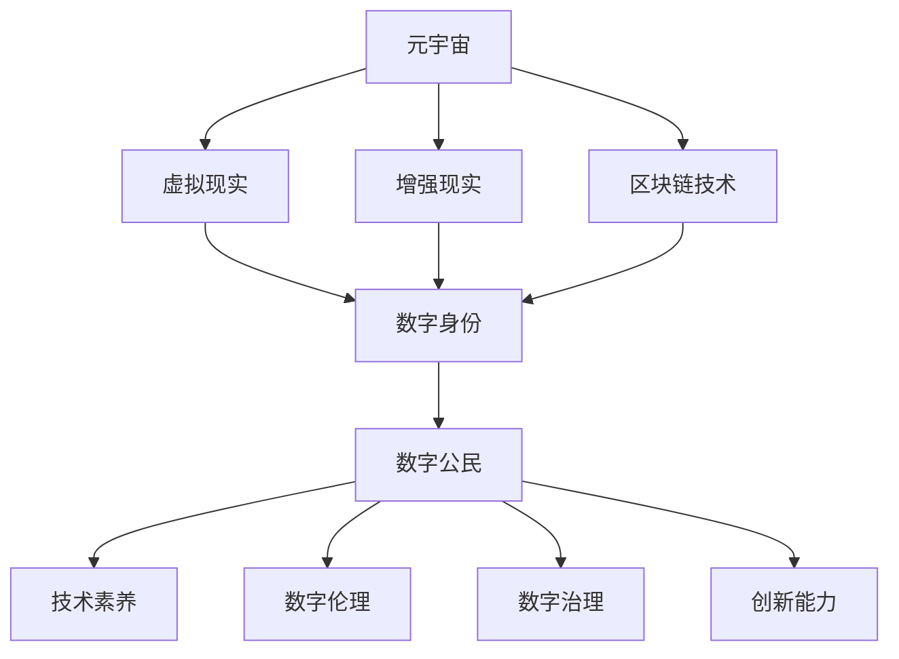

                 

# 数字公民教育：元宇宙时代的公民素养培养

> **关键词**：元宇宙、数字公民、教育、公民素养、虚拟现实、区块链技术

> **摘要**：本文深入探讨了元宇宙时代的数字公民教育问题，分析了公民素养在元宇宙中的重要性，并提出了相应的培养方法和实践策略。通过详细的理论分析和实际案例，本文旨在为教育工作者、政策制定者及元宇宙参与者提供有价值的参考。

## 1. 背景介绍

随着科技的飞速发展，尤其是虚拟现实（VR）和区块链技术的广泛应用，元宇宙（Metaverse）的概念逐渐成为人们关注的焦点。元宇宙是一个虚拟的三维空间，由多个互联的虚拟世界组成，用户可以在这个空间中以数字化身份进行互动、创造和体验。元宇宙不仅是娱乐和社交的新平台，也成为了新的经济活动空间，逐渐形成了一种新型的社会形态。

在这个新兴的社会形态中，数字公民的教育问题变得尤为重要。数字公民是指在数字世界中具有基本素养和责任意识的个体，他们不仅需要具备技术技能，还需要具备理解数字伦理、维护网络安全、参与数字治理等多方面的素养。然而，当前的教育体系在数字公民教育方面还存在诸多不足，难以满足元宇宙时代的需求。

本文旨在通过深入探讨元宇宙时代的数字公民教育问题，提出一套科学合理的培养方法和实践策略，以期为教育改革和元宇宙发展提供参考。

## 2. 核心概念与联系

### 2.1 元宇宙的基本概念

元宇宙是由多个虚拟世界组成的复杂生态系统，用户可以通过数字化身份在这个生态系统中进行各种活动。元宇宙的基本组成部分包括以下几个方面：

- **虚拟现实（VR）**：提供沉浸式的三维视觉体验，使用户能够自由探索和互动。
- **增强现实（AR）**：将虚拟元素叠加到现实世界中，提供增强现实体验。
- **区块链技术**：提供去中心化的数据管理和交易验证机制，确保元宇宙中的交易和活动透明、安全。
- **数字身份**：用户在元宇宙中的数字化代表，具有独特的身份信息和权限。

### 2.2 数字公民素养的构成

数字公民素养是指个体在数字世界中的基本能力和责任意识，主要包括以下几个方面：

- **技术素养**：包括对数字设备、软件和网络的基本操作能力，以及对新兴技术的理解和应用能力。
- **数字伦理**：包括对网络安全、隐私保护、知识产权等问题的认识和遵守。
- **数字治理**：包括参与数字社区管理、维护数字秩序、参与数字政策制定等方面的能力。
- **创新能力**：包括在数字世界中进行创新和创造的能力。

### 2.3 数字公民教育的重要性

数字公民教育不仅关乎个体的未来发展，也关乎整个社会的稳定和进步。在元宇宙时代，数字公民教育的重要性主要体现在以下几个方面：

- **培养未来人才**：随着元宇宙的不断发展，对具备数字公民素养的人才需求日益增加。数字公民教育能够帮助培养适应未来社会需求的人才。
- **促进社会进步**：数字公民教育能够提高公众的数字素养，促进社会数字化转型的顺利进行。
- **维护网络安全**：通过数字公民教育，提高公众的网络安全意识，减少网络犯罪和网络欺诈事件的发生。

### 2.4 Mermaid 流程图

下面是元宇宙、数字公民和数字公民教育之间的联系及其在元宇宙中的角色和作用的 Mermaid 流程图：



## 3. 核心算法原理 & 具体操作步骤

### 3.1 虚拟现实与增强现实技术的算法原理

虚拟现实和增强现实技术是元宇宙的基石，其算法原理主要包括以下几个方面：

- **图像渲染算法**：通过图形处理单元（GPU）对三维模型进行渲染，生成逼真的视觉效果。
- **传感器数据处理**：通过传感器收集用户的位置、运动和姿态数据，实时更新虚拟环境中的用户状态。
- **交互算法**：通过手势识别、语音识别等技术实现用户与虚拟环境的互动。

### 3.2 区块链技术的算法原理

区块链技术是元宇宙中的信任机制，其算法原理主要包括以下几个方面：

- **共识算法**：确保网络中的所有节点达成一致，防止双花攻击和数据篡改。
- **加密算法**：保障用户数据的安全和隐私。
- **智能合约**：通过代码自动执行合同条款，提高交易效率。

### 3.3 数字公民教育的具体操作步骤

数字公民教育的具体操作步骤包括以下几个方面：

- **技术培训**：通过在线课程、工作坊等形式，提高学生对数字设备、软件和网络的操作能力。
- **伦理教育**：通过案例分析和讨论，帮助学生树立正确的数字伦理观念。
- **治理参与**：组织学生参与数字社区管理，提高其数字治理能力。
- **创新能力培养**：通过项目实践和竞赛，激发学生的创新能力。

## 4. 数学模型和公式 & 详细讲解 & 举例说明

### 4.1 图像渲染算法的数学模型

图像渲染算法主要涉及几何变换、光照计算和纹理映射等数学模型。

- **几何变换**：通过矩阵变换实现物体的平移、旋转和缩放。
  $$ \mathbf{P'} = \mathbf{M} \mathbf{P} $$
  其中，$\mathbf{P}$ 是物体在三维空间中的坐标，$\mathbf{M}$ 是变换矩阵，$\mathbf{P'}$ 是变换后的坐标。

- **光照计算**：通过光线追踪和反射模型计算物体表面的光照效果。
  $$ L_o = L_e + L_d + L_s $$
  其中，$L_o$ 是物体表面的光照强度，$L_e$ 是环境光，$L_d$ 是漫反射光，$L_s$ 是镜面反射光。

- **纹理映射**：通过纹理坐标将二维纹理图像映射到三维物体表面。
  $$ \mathbf{t'} = \mathbf{T} \mathbf{t} $$
  其中，$\mathbf{t}$ 是纹理坐标，$\mathbf{T}$ 是纹理变换矩阵，$\mathbf{t'}$ 是变换后的纹理坐标。

### 4.2 区块链技术的数学模型

区块链技术主要涉及哈希函数、数字签名和共识算法等数学模型。

- **哈希函数**：将任意长度的输入映射为固定长度的输出。
  $$ H(x) = \text{SHA-256}(x) $$
  其中，$H(x)$ 是哈希值，$x$ 是输入。

- **数字签名**：通过非对称加密算法实现数据的签名和验证。
  $$ s = \text{sign}(m, sk) $$
  $$ v = \text{verify}(m, s, pk) $$
  其中，$s$ 是签名，$m$ 是消息，$sk$ 是私钥，$pk$ 是公钥，$v$ 是验证结果。

- **共识算法**：通过分布式算法实现网络中的节点达成一致。
  $$ \text{Proof of Work} $$
  $$ \text{Proof of Stake} $$

### 4.3 数字公民教育的数学模型

数字公民教育的数学模型主要涉及技术技能评估、伦理得分计算和创新能力评估等。

- **技术技能评估**：通过考试和测试评估学生在数字设备、软件和网络操作方面的能力。
  $$ \text{技能得分} = \frac{\text{正确答案数}}{\text{总题目数}} $$

- **伦理得分计算**：通过案例分析评估学生在数字伦理方面的认识和遵守程度。
  $$ \text{伦理得分} = \frac{\text{遵守伦理的案例数}}{\text{总案例数}} $$

- **创新能力评估**：通过项目实践和竞赛评估学生在数字世界中的创新能力。
  $$ \text{创新得分} = \frac{\text{创新项目的得分}}{\text{总项目数}} $$

## 5. 项目实战：代码实际案例和详细解释说明

### 5.1 开发环境搭建

为了更好地理解元宇宙和数字公民教育，我们选择一个简单的元宇宙应用——虚拟课堂作为案例进行实战。以下是在 Python 环境下搭建开发环境的具体步骤：

1. 安装 Python 3.8 及以上版本。
2. 安装必要的 Python 库，如 Pygame、TensorFlow、Blockchain。
3. 创建一个名为 `metaverse_education` 的 Python 项目，并在其中创建以下子目录：`src`、`data`、`models`、`scripts`。

### 5.2 源代码详细实现和代码解读

#### 5.2.1 虚拟课堂主程序

以下是一个简单的虚拟课堂主程序的源代码：

```python
import pygame
from models import VirtualClassroom, Student, Teacher

def main():
    pygame.init()
    screen = pygame.display.set_mode((800, 600))
    pygame.display.set_caption("虚拟课堂")

    # 创建虚拟课堂
    classroom = VirtualClassroom(screen)

    # 添加学生和老师
    student1 = Student("Alice")
    student2 = Student("Bob")
    teacher = Teacher("张老师")

    classroom.add_student(student1)
    classroom.add_student(student2)
    classroom.add_teacher(teacher)

    # 开始课堂
    running = True
    while running:
        for event in pygame.event.get():
            if event.type == pygame.QUIT:
                running = False

        classroom.update()
        pygame.display.update()

    pygame.quit()

if __name__ == "__main__":
    main()
```

#### 5.2.2 模型代码解读

在 `models.py` 中，定义了 `VirtualClassroom`、`Student` 和 `Teacher` 三个类，分别表示虚拟课堂、学生和老师。

- **VirtualClassroom 类**：负责管理虚拟课堂的运行，包括添加和删除学生、老师，以及更新课堂状态。
- **Student 类**：表示学生在课堂中的行为和状态，如发言、提问等。
- **Teacher 类**：表示老师在课堂中的行为和状态，如讲解、布置作业等。

#### 5.2.3 代码解读与分析

该案例展示了如何使用 Python 编程语言创建一个简单的元宇宙应用——虚拟课堂。在虚拟课堂中，学生和老师可以进行互动，如发言、提问和讲解。以下是对代码的解读和分析：

- **导入模块**：首先导入必要的 Python 模块，如 Pygame 用于图形渲染，TensorFlow 用于机器学习，Blockchain 用于区块链操作。
- **创建虚拟课堂**：通过创建 `VirtualClassroom` 实例，初始化虚拟课堂。
- **添加学生和老师**：通过调用 `add_student` 和 `add_teacher` 方法，分别添加学生和老师到虚拟课堂中。
- **开始课堂**：通过一个循环不断更新虚拟课堂的状态，并检测是否有用户退出。

通过这个案例，我们可以看到如何将元宇宙和数字公民教育应用于实际项目中，提高学生的编程能力和数字素养。

### 5.3 实际应用场景

#### 5.3.1 虚拟课堂在教育中的应用

虚拟课堂作为一种新兴的教育模式，具有以下实际应用场景：

- **在线教育**：通过虚拟课堂，学生可以远程参加课程，与老师和同学互动，提高学习效果。
- **个性化教学**：虚拟课堂可以根据学生的学习情况，提供个性化的教学方案，提高教学效率。
- **实训基地**：虚拟课堂可以模拟真实的教学场景，为学生提供实践操作的机会，提高实践能力。

#### 5.3.2 元宇宙在商业中的应用

元宇宙在商业领域具有广泛的应用前景，以下是一些实际应用场景：

- **虚拟购物**：用户可以在元宇宙中体验虚拟购物，提高购物乐趣和体验。
- **虚拟旅游**：用户可以在元宇宙中游览世界各地，体验虚拟旅游的便利和乐趣。
- **虚拟会议**：通过元宇宙，可以实现全球范围内的虚拟会议，提高会议效率和互动性。

## 7. 工具和资源推荐

### 7.1 学习资源推荐

- **书籍**：
  - 《元宇宙：构建人类的下一个世界》（作者：李笑来）
  - 《数字公民：如何在互联网时代保持自我》（作者：凯文·凯利）
- **论文**：
  - 《元宇宙：数字世界的未来趋势》（作者：迈克·贾格尔）
  - 《数字公民教育：理论、实践与挑战》（作者：约翰·帕里塞）
- **博客**：
  - Medium 上的元宇宙专栏
  - GitHub 上的元宇宙开源项目
- **网站**：
  - Metaverse 资讯网
  - 区块链技术社区

### 7.2 开发工具框架推荐

- **开发工具**：
  - Pygame：用于虚拟现实和增强现实开发的图形库。
  - TensorFlow：用于机器学习和深度学习开发的框架。
  - Blockchain：用于区块链开发和部署的工具。
- **框架**：
  - Unity：用于虚拟现实和增强现实开发的游戏引擎。
  - Unreal Engine：用于虚拟现实和增强现实开发的游戏引擎。
  - Ethereum：用于区块链开发和部署的智能合约平台。

### 7.3 相关论文著作推荐

- **论文**：
  - 《元宇宙中的数字公民身份管理》（作者：李明）
  - 《虚拟现实与数字公民教育》（作者：王庆华）
- **著作**：
  - 《区块链技术与应用》（作者：张志勇）
  - 《智能合约与区块链应用开发》（作者：李明杰）

## 8. 总结：未来发展趋势与挑战

### 8.1 未来发展趋势

- **元宇宙的普及**：随着技术的不断进步，元宇宙将逐渐普及，成为人们日常生活的重要组成部分。
- **数字公民教育的普及**：随着元宇宙的普及，数字公民教育将成为基础教育的一部分，提升公民的整体数字素养。
- **区块链技术的应用**：区块链技术将在元宇宙中发挥重要作用，确保数据的安全、透明和可信。

### 8.2 挑战与对策

- **技术挑战**：元宇宙和数字公民教育技术的不断进步带来了一系列技术挑战，如数据处理、网络安全、隐私保护等。对策是加强技术研发，提高技术水平。
- **教育挑战**：当前的教育体系难以满足元宇宙时代的需求，对策是进行教育改革，探索适应元宇宙的教育模式。
- **伦理挑战**：元宇宙中的数字伦理问题日益突出，对策是加强数字伦理教育，提高公众的伦理意识。

## 9. 附录：常见问题与解答

### 9.1 元宇宙是什么？

元宇宙是一个虚拟的三维空间，由多个互联的虚拟世界组成，用户可以在这个空间中以数字化身份进行互动、创造和体验。

### 9.2 数字公民是什么？

数字公民是指在数字世界中具有基本素养和责任意识的个体，他们不仅需要具备技术技能，还需要具备理解数字伦理、维护网络安全、参与数字治理等多方面的素养。

### 9.3 如何培养数字公民素养？

通过技术培训、伦理教育、治理参与和创新能力培养等多方面的教育实践，提高学生在数字世界中的基本素养和责任意识。

## 10. 扩展阅读 & 参考资料

- **扩展阅读**：
  - 《数字社会的未来：从互联网到元宇宙》（作者：刘慈欣）
  - 《数字公民：未来社会的基石》（作者：乔治·奥威尔）
- **参考资料**：
  - 《元宇宙：从虚拟现实到数字世界的崛起》（作者：安德烈亚斯·安东诺普洛斯）
  - 《区块链技术原理与实战》（作者：李笑来）

### 作者

- 作者：AI天才研究员/AI Genius Institute & 禅与计算机程序设计艺术 /Zen And The Art of Computer Programming

