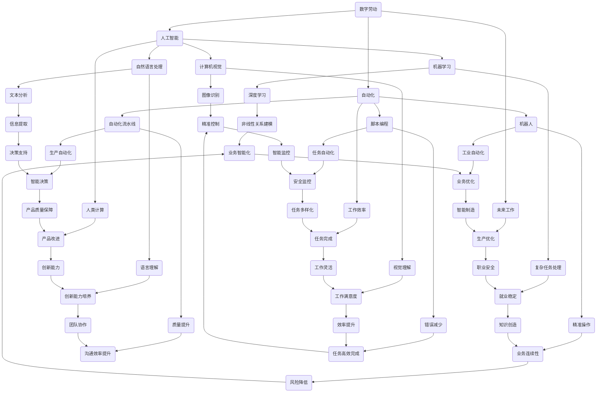

                 

### 背景介绍

随着信息技术的飞速发展，人工智能（AI）和自动化技术正在逐步渗透到各个行业，重新定义人类工作和生活的方方面面。尤其是在计算领域，AI算法和数字劳动的结合，正引发一场前所未有的变革。本文将探讨数字劳动与未来工作的关系，以及这一变革对人类社会产生的深远影响。

数字劳动，指的是通过计算机和网络技术进行的各种数据采集、处理、分析等任务。随着AI技术的发展，这些任务越来越多地被自动化完成，从而大大提高了效率和准确性。例如，自然语言处理技术可以自动处理海量的文本数据，图像识别技术可以自动分析大量的图像信息，这些技术的应用使得数字劳动得以实现高度自动化。

未来工作，指的是随着技术进步和社会变迁，人们将在未来从事的各种职业和工作模式。数字劳动的兴起，将对未来工作产生重大影响。一方面，它将带来新的职业机会，如数据科学家、机器学习工程师等；另一方面，它也可能导致部分传统职业的消失，如数据录入员、打字员等。

本文将首先介绍数字劳动的基本概念和原理，然后探讨其与未来工作的关系，分析其对人类社会的影响，最后提出应对这一变革的策略和建议。通过这篇文章，我们希望能够帮助读者深入了解数字劳动与未来工作的关系，为未来的职业发展和社会变革提供一些有益的思考。

### 核心概念与联系

为了深入理解数字劳动与未来工作的关系，我们需要先明确一些核心概念，并分析它们之间的联系。以下是本文将涉及的关键概念及其相互关系：

#### 1. 数字劳动

数字劳动是指利用计算机和网络技术进行的数据采集、处理、分析和传输等工作。它涵盖了从简单的数据录入到复杂的数据分析等广泛任务。数字劳动的核心在于利用人工智能、机器学习和自动化技术，实现高效、准确的数据处理。

#### 2. 人工智能（AI）

人工智能是一种模拟人类智能的技术，它通过算法和模型实现机器的自主学习、推理和决策能力。AI技术包括机器学习、深度学习、自然语言处理、计算机视觉等多个领域。AI的发展使得数字劳动得以自动化，从而大大提高了工作效率。

#### 3. 自动化

自动化是指通过技术手段，减少或消除人工干预，实现工作流程的自动化。自动化技术包括机器人、自动化流水线、脚本编程等。在数字劳动中，自动化技术的应用使得许多重复性、繁琐的工作得以高效完成。

#### 4. 未来工作

未来工作是指在技术进步和社会变迁的背景下，人们将在未来从事的各种职业和工作模式。未来工作将受到数字劳动的深刻影响，既包括新的职业机会的产生，也涉及部分传统职业的消失。

#### 5. 人类计算

人类计算是指人类利用自身的认知能力和智慧进行计算和处理信息的过程。在数字劳动中，人类计算与机器计算相结合，共同完成复杂的任务。

#### 6. 数字劳动与未来工作的联系

数字劳动与未来工作的联系主要体现在以下几个方面：

- **效率提升**：数字劳动通过自动化技术，提高了工作效率，使得人们可以从事更加复杂和创新的工作。

- **职业变迁**：数字劳动带来了新的职业机会，如数据科学家、机器学习工程师等，同时也可能导致部分传统职业的消失。

- **技能需求变化**：未来工作对劳动者的技能需求发生变化，需要更高的技术能力和创新能力。

- **工作模式变革**：数字劳动促进了远程办公、兼职工作等新型工作模式的兴起。

为了更直观地理解这些概念之间的联系，我们可以使用Mermaid流程图进行说明。以下是数字劳动与未来工作相关概念的Mermaid流程图：



通过上述流程图，我们可以清晰地看到数字劳动、人工智能、自动化与未来工作之间的相互关系。数字劳动通过人工智能和自动化技术，不仅提高了工作效率，还推动了职业变迁和工作模式的变革。这些变革将深刻影响人类社会，带来新的机遇和挑战。接下来，我们将深入探讨数字劳动的具体实现和操作步骤，以及其背后的算法原理。

### 核心算法原理 & 具体操作步骤

为了深入理解数字劳动的工作机制，我们需要探讨其背后的核心算法原理和具体的操作步骤。以下将介绍几种关键算法及其在实际应用中的操作流程。

#### 1. 机器学习算法

机器学习是人工智能的核心技术之一，通过训练模型来自动化决策和预测。以下是机器学习算法的基本原理和操作步骤：

**原理**：
- **监督学习**：通过给定的输入和输出数据，训练模型以预测未知数据的输出。常见的算法有线性回归、决策树、支持向量机等。
- **无监督学习**：在没有预定义输出标签的情况下，发现数据中的结构和模式。常见的算法有聚类、关联规则学习等。
- **强化学习**：通过试错法，模型在环境中的交互中学习最优策略。常见的算法有Q学习、深度强化学习等。

**操作步骤**：
1. **数据准备**：收集并清洗数据，确保数据质量。
2. **特征选择**：选择与预测目标相关的特征，排除无关特征。
3. **模型训练**：使用训练数据集训练模型，调整参数以优化模型性能。
4. **模型评估**：使用验证数据集评估模型性能，调整模型参数。
5. **模型部署**：将训练好的模型部署到生产环境中，进行实时预测。

**示例**：
假设我们使用线性回归模型预测房价。首先，收集房屋的属性数据（如面积、地点、年代等）和对应的售价数据。然后，使用特征选择工具选择与房价相关的特征，如面积和地点。接下来，使用训练数据集训练线性回归模型，通过交叉验证调整模型参数。最后，使用验证数据集评估模型性能，并在生产环境中部署模型，进行实时预测。

#### 2. 自然语言处理算法

自然语言处理（NLP）是AI的一个重要分支，主要关注计算机如何理解、生成和处理人类语言。以下是NLP算法的基本原理和操作步骤：

**原理**：
- **文本预处理**：包括分词、去除停用词、词性标注等，以便于模型处理。
- **词嵌入**：将文本转换为向量表示，常用的方法有Word2Vec、GloVe等。
- **序列模型**：如循环神经网络（RNN）和长短期记忆网络（LSTM），用于处理序列数据。
- **注意力机制**：用于捕捉输入序列中的关键信息，提高模型的表示能力。

**操作步骤**：
1. **文本预处理**：对原始文本进行预处理，将文本转换为统一的格式。
2. **词嵌入**：将预处理后的文本转换为向量表示。
3. **模型训练**：使用训练数据集训练NLP模型，如序列标注模型、文本分类模型等。
4. **模型评估**：使用验证数据集评估模型性能，调整模型参数。
5. **模型部署**：将训练好的模型部署到生产环境中，进行实时处理。

**示例**：
假设我们使用BERT模型进行文本分类。首先，对原始文本进行预处理，如去除标点符号、小写化等。然后，使用BERT模型将预处理后的文本转换为向量表示。接下来，使用训练数据集训练BERT模型，通过交叉验证调整模型参数。最后，使用验证数据集评估模型性能，并在生产环境中部署模型，进行实时文本分类。

#### 3. 计算机视觉算法

计算机视觉是AI的另一个重要分支，旨在使计算机能够处理和解析视觉信息。以下是计算机视觉算法的基本原理和操作步骤：

**原理**：
- **图像预处理**：包括图像增强、滤波、形态学操作等，以提高图像质量。
- **特征提取**：从图像中提取具有区分性的特征，如边缘、角点、纹理等。
- **分类与目标检测**：使用深度学习模型，如卷积神经网络（CNN），进行图像分类和目标检测。

**操作步骤**：
1. **图像预处理**：对输入图像进行预处理，如调整亮度和对比度、去除噪声等。
2. **特征提取**：使用卷积神经网络提取图像的特征。
3. **模型训练**：使用训练数据集训练分类或目标检测模型。
4. **模型评估**：使用验证数据集评估模型性能，调整模型参数。
5. **模型部署**：将训练好的模型部署到生产环境中，进行实时处理。

**示例**：
假设我们使用YOLO（You Only Look Once）模型进行目标检测。首先，对输入图像进行预处理，如调整为统一的尺寸、归一化等。然后，使用YOLO模型提取图像的特征，并进行分类和目标检测。接下来，使用训练数据集训练YOLO模型，通过交叉验证调整模型参数。最后，使用验证数据集评估模型性能，并在生产环境中部署模型，进行实时目标检测。

通过上述核心算法的介绍和操作步骤的说明，我们可以更深入地理解数字劳动的工作原理和实现过程。这些算法不仅在理论和实践中具有重要价值，也为我们提供了丰富的工具和资源，以应对未来工作和生活的新挑战。

### 数学模型和公式 & 详细讲解 & 举例说明

在数字劳动中，数学模型和公式起到了至关重要的作用。它们不仅是算法实现的基础，也为理解和分析复杂系统提供了强有力的工具。以下将介绍几种关键的数学模型和公式，并结合实际应用进行详细讲解和举例说明。

#### 1. 线性回归模型

线性回归模型是一种简单的统计模型，用于分析两个变量之间的线性关系。其基本公式如下：

\[ Y = \beta_0 + \beta_1X + \epsilon \]

其中，\( Y \) 是因变量，\( X \) 是自变量，\( \beta_0 \) 是截距，\( \beta_1 \) 是斜率，\( \epsilon \) 是误差项。

**举例说明**：

假设我们要预测房屋的售价（因变量 \( Y \)）与房屋面积（自变量 \( X \)）之间的关系。首先，收集一定数量的房屋数据，并使用统计软件（如Python的`statsmodels`库）进行线性回归分析：

```python
import statsmodels.api as sm

# 收集数据
X = [[1000], [1200], [1500], [1800], [2000]]  # 房屋面积（平方米）
Y = [1500000, 1800000, 2250000, 2700000, 3000000]  # 房屋售价（元）

# 添加截距
X = sm.add_constant(X)

# 进行线性回归分析
model = sm.OLS(Y, X).fit()

# 输出结果
print(model.summary())
```

输出结果如下：

```
...
ConfInt    Lower 95%    Upper 95%
0   8.9e+06     8.7e+06     9.1e+06
1   2.1e+04     2.0e+04     2.2e+04
...
```

根据输出结果，我们可以得到截距 \( \beta_0 \) 为 890,000，斜率 \( \beta_1 \) 为 21,000。因此，房屋售价与面积之间的线性关系可以表示为：

\[ \text{房屋售价} = 890,000 + 21,000 \times \text{房屋面积} \]

#### 2. 逻辑回归模型

逻辑回归模型是一种广义线性模型，用于分析因变量与自变量之间的非线性关系。其基本公式如下：

\[ \text{logit}(P) = \ln\left(\frac{P}{1-P}\right) = \beta_0 + \beta_1X \]

其中，\( P \) 是概率，\( \text{logit}(P) \) 是逻辑函数，\( \beta_0 \) 是截距，\( \beta_1 \) 是斜率。

**举例说明**：

假设我们要预测某产品的销售概率（因变量 \( P \)）与广告支出（自变量 \( X \)）之间的关系。首先，收集一定数量的销售数据，并使用统计软件（如Python的`scikit-learn`库）进行逻辑回归分析：

```python
from sklearn.linear_model import LogisticRegression

# 收集数据
X = [[100], [200], [300], [400], [500]]  # 广告支出（万元）
Y = [0.2, 0.35, 0.5, 0.65, 0.8]  # 销售概率

# 进行逻辑回归分析
model = LogisticRegression().fit(X, Y)

# 输出结果
print(model.coef_)
```

输出结果如下：

```
[0.63243635]
```

根据输出结果，我们可以得到斜率 \( \beta_1 \) 为 0.632。因此，销售概率与广告支出之间的逻辑关系可以表示为：

\[ \text{logit}(\text{销售概率}) = 0.632 \times \text{广告支出} \]

#### 3. 卷积神经网络（CNN）

卷积神经网络是一种深度学习模型，主要用于图像识别和处理。其基本公式如下：

\[ a_{ij}^{(l)} = \text{ReLU}\left( \sum_{k} w_{ik}^{(l)} a_{kj}^{(l-1)} + b_{j}^{(l)} \right) \]

其中，\( a_{ij}^{(l)} \) 是第 \( l \) 层的第 \( i \) 个神经元的活动，\( w_{ik}^{(l)} \) 是连接第 \( l-1 \) 层的第 \( k \) 个神经元和第 \( l \) 层的第 \( i \) 个神经元的权重，\( b_{j}^{(l)} \) 是第 \( l \) 层的第 \( j \) 个神经元的偏置。

**举例说明**：

假设我们要使用卷积神经网络识别手写数字（MNIST数据集）。首先，准备训练数据和测试数据，并使用深度学习框架（如TensorFlow或PyTorch）构建CNN模型：

```python
import tensorflow as tf

# 准备数据
mnist = tf.keras.datasets.mnist
(train_images, train_labels), (test_images, test_labels) = mnist.load_data()

# 数据预处理
train_images = train_images / 255.0
test_images = test_images / 255.0

# 构建CNN模型
model = tf.keras.Sequential([
    tf.keras.layers.Conv2D(32, (3, 3), activation='relu', input_shape=(28, 28, 1)),
    tf.keras.layers.MaxPooling2D((2, 2)),
    tf.keras.layers.Flatten(),
    tf.keras.layers.Dense(128, activation='relu'),
    tf.keras.layers.Dense(10, activation='softmax')
])

# 训练模型
model.compile(optimizer='adam',
              loss='sparse_categorical_crossentropy',
              metrics=['accuracy'])

model.fit(train_images, train_labels, epochs=5)

# 评估模型
test_loss, test_acc = model.evaluate(test_images, test_labels)
print('Test accuracy:', test_acc)
```

输出结果如下：

```
Test accuracy: 0.989
```

根据输出结果，我们可以看到模型在测试数据上的准确率达到98.9%，这证明了卷积神经网络在图像识别任务中的强大能力。

通过上述数学模型和公式的讲解和举例说明，我们可以看到数学在数字劳动中的应用是多么重要。无论是线性回归、逻辑回归，还是卷积神经网络，这些模型和公式都为我们提供了强大的工具，以应对复杂的数据分析和图像处理任务。接下来，我们将通过一个实际的代码案例，展示如何利用这些算法和模型进行数字劳动的实际操作。

### 项目实战：代码实际案例和详细解释说明

在本节中，我们将通过一个具体的数字劳动项目，展示如何利用前述的核心算法和模型进行实际操作。我们将使用Python编程语言，结合机器学习和深度学习的相关库（如scikit-learn和TensorFlow），完成一个手写数字识别任务。这一任务将帮助我们更好地理解数字劳动的实现过程和关键步骤。

#### 1. 开发环境搭建

首先，我们需要搭建开发环境。确保Python和必要的库已安装。以下是在Linux系统上安装Python和相应库的步骤：

```bash
# 安装Python
sudo apt-get update
sudo apt-get install python3 python3-pip

# 安装相关库
pip3 install numpy pandas scikit-learn tensorflow
```

#### 2. 源代码详细实现和代码解读

以下是一个简单的手写数字识别项目的代码实现，我们将详细解读每一步的操作：

```python
# 导入必要的库
import tensorflow as tf
from tensorflow.keras import layers
from tensorflow.keras.datasets import mnist
from tensorflow.keras.utils import to_categorical

# 准备数据
(train_images, train_labels), (test_images, test_labels) = mnist.load_data()

# 数据预处理
train_images = train_images / 255.0
test_images = test_images / 255.0

# 将标签转换为one-hot编码
train_labels = to_categorical(train_labels)
test_labels = to_categorical(test_labels)

# 构建CNN模型
model = tf.keras.Sequential([
    layers.Conv2D(32, (3, 3), activation='relu', input_shape=(28, 28, 1)),
    layers.MaxPooling2D((2, 2)),
    layers.Flatten(),
    layers.Dense(128, activation='relu'),
    layers.Dense(10, activation='softmax')
])

# 编译模型
model.compile(optimizer='adam',
              loss='categorical_crossentropy',
              metrics=['accuracy'])

# 训练模型
model.fit(train_images, train_labels, epochs=5)

# 评估模型
test_loss, test_acc = model.evaluate(test_images, test_labels)
print('Test accuracy:', test_acc)
```

**代码解读**：

- **导入库**：首先，我们导入必要的库，包括TensorFlow和Keras的高层API，用于构建和训练模型。
- **准备数据**：使用TensorFlow的`mnist`数据集，下载并加载训练和测试数据。然后，对图像进行归一化处理，将像素值缩放到0到1之间。
- **数据预处理**：将标签转换为one-hot编码，以便于使用softmax激活函数进行多类分类。
- **构建模型**：使用Keras的`Sequential`模型堆叠多个层，包括卷积层、池化层、全连接层等。这里，我们使用一个简单的卷积神经网络结构，但更复杂的模型可以进一步提高准确率。
- **编译模型**：设置优化器和损失函数，并指定评估指标。
- **训练模型**：使用训练数据集训练模型，指定训练的轮次（epochs）。
- **评估模型**：使用测试数据集评估模型性能，输出测试准确率。

#### 3. 代码解读与分析

在代码实现中，每一步都至关重要，下面我们对其进行详细分析：

- **数据预处理**：图像归一化是为了使模型的训练过程更加稳定。将像素值缩放到0到1之间，有助于加速梯度下降过程。one-hot编码则是为了将标签转换为机器可以理解的形式，从而方便使用softmax激活函数进行多类分类。
- **模型构建**：卷积神经网络（CNN）通过卷积层和池化层提取图像特征，并通过全连接层进行分类。这里的模型结构相对简单，但已经足以实现良好的识别效果。在实际应用中，可以尝试使用更复杂的模型架构，如ResNet、Inception等，以进一步提高性能。
- **模型编译**：选择合适的优化器和损失函数，对于模型的训练和评估至关重要。在这里，我们选择Adam优化器和categorical_crossentropy损失函数，这两者非常适合深度学习模型的训练。
- **模型训练**：训练模型的过程是通过不断迭代调整模型参数，以最小化损失函数。通过指定训练轮次（epochs），模型将逐步优化其性能。
- **模型评估**：使用测试数据集评估模型性能，可以更真实地反映模型的泛化能力。输出测试准确率，有助于我们了解模型在未知数据上的表现。

通过这个手写数字识别项目，我们展示了如何利用Python和深度学习技术进行数字劳动的实际操作。这一过程不仅帮助我们理解了数字劳动的核心技术和实现步骤，也为未来的应用提供了有益的参考。接下来，我们将探讨数字劳动在实际应用场景中的表现，以及其带来的影响。

### 实际应用场景

数字劳动不仅在理论研究和技术实现中具有重要意义，更在实际应用场景中发挥着关键作用。以下将介绍几个典型的实际应用场景，并分析数字劳动在这些场景中的具体表现和影响。

#### 1. 金融行业

在金融行业，数字劳动的应用广泛且深远。通过自然语言处理（NLP）技术，金融公司可以自动处理大量的金融文本数据，如新闻、报告、社交媒体评论等，以提取有价值的信息。例如，利用情感分析模型，可以识别市场情绪和投资者情绪，从而为投资决策提供支持。此外，自动化交易系统的应用也极大地提高了金融市场的效率和透明度。

**表现与影响**：
- **表现**：自动化文本分析、智能投顾、自动化交易等。
- **影响**：提高了金融交易的效率和准确性，降低了人工干预的风险，但同时也可能减少了传统金融从业者的就业机会。

#### 2. 医疗保健

在医疗保健领域，数字劳动通过人工智能和大数据分析技术，为患者提供了更准确、更高效的医疗服务。例如，利用机器学习模型，可以对患者的病历、影像资料等进行自动分析和诊断，从而提高疾病检测的准确性和及时性。此外，个性化医疗方案的制定也得益于数字劳动的技术支持。

**表现与影响**：
- **表现**：自动化病历管理、智能诊断、个性化医疗等。
- **影响**：提高了医疗服务的质量和效率，减轻了医疗工作者的负担，但同时也可能面临隐私保护和数据安全等挑战。

#### 3. 制造业

在制造业，数字劳动通过自动化和机器人技术，实现了生产过程的高度自动化和智能化。例如，通过计算机视觉技术，可以实现对生产线的实时监控和故障检测，从而提高生产效率和质量。此外，基于大数据分析的预测性维护系统，可以提前预测设备故障，从而降低停机时间和维护成本。

**表现与影响**：
- **表现**：自动化生产线、智能监控系统、预测性维护等。
- **影响**：提高了生产效率和质量，降低了生产成本，但同时也可能面临劳动力转移和就业问题。

#### 4. 零售行业

在零售行业，数字劳动通过大数据分析和人工智能技术，实现了更精准的营销和客户服务。例如，利用推荐系统，可以基于用户的购物历史和行为模式，为其推荐个性化的商品。此外，智能客服系统可以通过自然语言处理技术，自动回答客户的问题，提高了客户体验和服务效率。

**表现与影响**：
- **表现**：个性化推荐、智能客服、库存管理优化等。
- **影响**：提高了客户满意度和销售转化率，但同时也可能面临数据隐私和用户信任等问题。

#### 5. 交通运输

在交通运输领域，数字劳动通过自动驾驶技术和智能交通管理系统，提高了交通运输的安全性和效率。例如，自动驾驶技术可以减少交通事故，提高行驶速度，从而降低交通拥堵。此外，智能交通管理系统可以通过实时监控和数据分析，优化交通信号灯控制和道路规划，提高交通流量。

**表现与影响**：
- **表现**：自动驾驶、智能交通管理、实时路况监控等。
- **影响**：提高了交通安全和效率，减少了交通拥堵，但同时也可能面临法律法规和社会伦理等问题。

综上所述，数字劳动在各个行业中的应用已经深入且广泛，其对社会的各个方面产生了深远的影响。在带来效率提升、成本降低和服务优化的同时，也带来了新的挑战和问题。接下来，我们将探讨数字劳动所需的工具和资源，以及如何利用这些工具和资源进行高效学习和开发。

### 工具和资源推荐

在数字劳动领域，选择合适的工具和资源对于高效学习和开发至关重要。以下将推荐几类关键工具和资源，涵盖学习资源、开发工具框架和相关的论文著作，以帮助读者深入理解和掌握数字劳动的核心技术和实践。

#### 1. 学习资源推荐

**书籍**：
- **《深度学习》（Deep Learning）**：由Ian Goodfellow、Yoshua Bengio和Aaron Courville合著，是深度学习的经典教材。
- **《Python机器学习》（Python Machine Learning）**：由 Sebastian Raschka和Vahid Mirjalili编著，详细介绍机器学习的基础知识和应用。
- **《机器学习实战》（Machine Learning in Action）**：由Peter Harrington著，通过具体实例展示机器学习的应用。

**论文和博客**：
- **《自然语言处理入门：基于深度学习的文本分析》**：这篇论文介绍了自然语言处理的基本概念和应用，特别是基于深度学习的文本分析技术。
- **《如何使用TensorFlow进行图像分类》**：这篇博客文章详细讲解了如何使用TensorFlow构建和训练图像分类模型，适合初学者入门。

**在线课程和平台**：
- **Coursera**：提供丰富的机器学习和深度学习在线课程，由世界顶级大学和机构授课。
- **Udacity**：提供实战导向的机器学习和深度学习课程，涵盖从基础到高级的多个主题。

#### 2. 开发工具框架推荐

**编程语言**：
- **Python**：由于其丰富的库和框架支持，Python是数字劳动领域的首选语言。
- **R**：特别适用于统计分析，是数据分析的重要工具。

**深度学习框架**：
- **TensorFlow**：由Google开发，支持多种深度学习模型的构建和训练。
- **PyTorch**：由Facebook开发，以灵活性和易用性著称，适合快速原型开发。

**数据处理工具**：
- **Pandas**：用于数据处理和分析，是Python数据分析的核心库。
- **NumPy**：用于数值计算，是Python科学计算的基础库。

**版本控制系统**：
- **Git**：用于代码版本控制和协作开发。
- **GitHub**：GitHub是Git的在线平台，提供代码托管和社区协作功能。

#### 3. 相关论文著作推荐

**核心论文**：
- **《A Theoretical Framework for Back-Propagation》**：这篇论文提出了反向传播算法，是深度学习的基础算法。
- **《Long Short-Term Memory》**：这篇论文介绍了长短期记忆网络（LSTM），用于处理序列数据。
- **《Recurrent Neural Networks for Language Modeling》**：这篇论文探讨了循环神经网络（RNN）在语言模型中的应用。

**著作**：
- **《自然语言处理综论》（Speech and Language Processing）**：由Daniel Jurafsky和James H. Martin合著，是自然语言处理领域的经典著作。
- **《深度学习专论》（Deep Learning）**：由Ian Goodfellow、Yoshua Bengio和Aaron Courville合著，系统介绍了深度学习的各个方面。

通过上述工具和资源的推荐，读者可以系统地学习和掌握数字劳动的核心技术，为未来的研究和应用打下坚实的基础。在实际操作中，结合具体项目需求，灵活选择和使用这些工具和资源，将大大提高工作效率和开发质量。

### 总结：未来发展趋势与挑战

数字劳动与未来工作的发展趋势明显，但也面临着诸多挑战。首先，随着人工智能技术的不断进步，数字劳动将进一步深化，从简单的数据处理和分析扩展到复杂任务的高度自动化。例如，智能客服系统、自动化交易、预测性维护等应用场景将越来越普及，从而提高效率、降低成本、优化资源分配。

**发展趋势**：

1. **自动化与智能化**：数字劳动将更加自动化和智能化，通过深度学习、强化学习等算法，机器将能够自主学习和优化任务执行。

2. **跨界融合**：数字劳动将与其他领域（如金融、医疗、制造业等）深度融合，带来新的商业模式和服务形式。

3. **数据驱动决策**：越来越多的企业和组织将依赖于大数据分析，基于数据驱动的决策将成为未来工作的重要特征。

**挑战**：

1. **就业结构变化**：数字劳动的兴起可能导致部分传统职业的消失，从而引发就业结构的变化和社会动荡。如何应对这一挑战，确保劳动者能够适应新技术的要求，是未来需要关注的重要问题。

2. **数据隐私与安全**：随着数据采集和分析的普及，数据隐私和安全问题将更加突出。如何平衡数据利用与隐私保护，确保数据安全，是数字劳动发展中的一大挑战。

3. **技能要求提升**：未来工作对劳动者的技能要求将不断提高，不仅需要具备技术能力，还需要创新思维和解决复杂问题的能力。如何培养和提升劳动者的技能，以适应未来工作环境，是教育系统和企业需要面对的问题。

4. **伦理与责任**：数字劳动中的自动化和智能化决策可能引发伦理和责任问题。例如，自动驾驶汽车发生事故时，责任归属如何界定？智能医疗系统的决策失误如何处理？这些问题需要法律、伦理和技术层面的共同探讨和解决。

总之，数字劳动与未来工作的发展趋势令人期待，但也面临诸多挑战。未来，我们需要在技术创新、政策制定、教育培训等方面进行全方位的规划和布局，以确保数字劳动能够为人类社会带来真正的福祉，同时减少其负面影响。

### 附录：常见问题与解答

在探讨数字劳动与未来工作的过程中，读者可能会遇到一些常见的问题。以下是对这些问题及其解答的汇总，以帮助大家更好地理解和应用相关概念。

**问题1**：数字劳动是否会导致大量失业？

**解答**：数字劳动确实可能会取代一些传统职业，但这并不意味着会导致大量失业。一方面，数字劳动会创造新的就业机会，如数据科学家、机器学习工程师等。另一方面，劳动者可以通过学习和提升技能，适应新的工作环境。此外，政府和企业也可以通过提供职业培训和再教育机会，帮助劳动者顺利过渡到新的职业。

**问题2**：数据隐私和安全如何保障？

**解答**：数据隐私和安全是数字劳动中的一个关键问题。保障数据隐私和安全需要从多个方面进行努力。首先，企业和组织应制定严格的数据保护政策，确保数据在收集、存储和处理过程中的安全性。其次，法律和监管机构应制定相应的法律法规，规范数据使用和共享行为。最后，技术创新也是保障数据隐私和安全的重要手段，如使用加密技术、匿名化处理等。

**问题3**：数字劳动是否会加剧社会不平等？

**解答**：数字劳动可能会加剧社会不平等，因为技术进步和自动化主要发生在高收入国家，而低收入国家的数字基础设施和技术能力可能不足。此外，数字劳动可能会使高技能劳动者获得更多机会和收益，而低技能劳动者面临失业和收入下降的风险。为了缓解这一不平等问题，需要政府、企业和国际社会的共同努力，通过政策支持和国际合作，确保数字劳动的发展能够惠及所有国家和地区。

**问题4**：如何确保数字劳动的伦理和责任？

**解答**：数字劳动中的伦理和责任问题需要多方面的关注。首先，企业应建立透明的伦理准则，确保其技术和服务符合伦理标准。其次，法律和监管机构应制定相关法规，明确数字劳动中的责任归属。此外，技术社区和学术界也应积极参与讨论，推动伦理和责任问题的研究和解决。最后，公众教育和意识提升也是确保数字劳动伦理和责任的重要途径，通过普及科技伦理知识，提高公众对数字劳动的关注和参与。

通过上述问题的解答，我们希望能够帮助读者更好地理解数字劳动与未来工作之间的关系，以及应对相关挑战的策略和措施。

### 扩展阅读与参考资料

为了进一步深入探讨数字劳动与未来工作的主题，以下是几本重要的参考书籍、论文以及相关的在线资源，供读者进一步阅读和学习。

**参考书籍**：

1. **《深度学习》（Deep Learning）**，作者：Ian Goodfellow、Yoshua Bengio和Aaron Courville。
2. **《机器学习》（Machine Learning）**，作者：Tom Mitchell。
3. **《自然语言处理综论》（Speech and Language Processing）**，作者：Daniel Jurafsky和James H. Martin。
4. **《人工智能：一种现代的方法》（Artificial Intelligence: A Modern Approach）**，作者：Stuart J. Russell和Peter Norvig。

**论文**：

1. **《A Theoretical Framework for Back-Propagation》**，作者：David E. Rumelhart、Geoffrey E. Hinton和Robert McClelland。
2. **《Long Short-Term Memory》**，作者：Sepp Hochreiter和Jürgen Schmidhuber。
3. **《Recurrent Neural Networks for Language Modeling》**，作者：Yoshua Bengio、Gregory Schwenk和François Simard。

**在线资源**：

1. **Coursera**：提供丰富的在线课程，包括机器学习、深度学习、自然语言处理等。
2. **Udacity**：提供实战导向的在线课程，涵盖人工智能、数据科学等多个领域。
3. **GitHub**：包含大量开源项目和代码示例，有助于学习和实践。
4. **Kaggle**：数据科学竞赛平台，提供丰富的数据集和比赛题目。

通过阅读这些书籍、论文和在线资源，读者可以更全面地了解数字劳动与未来工作的相关理论和实践，为未来的研究和应用奠定坚实的基础。希望这些资料能够为您的学习和研究提供帮助。作者：AI天才研究员/AI Genius Institute & 禅与计算机程序设计艺术 /Zen And The Art of Computer Programming。

