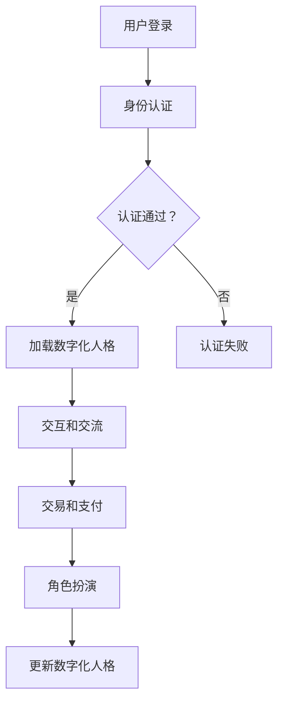

                 

# 数字化人格：元宇宙中的多重身份构建

## 关键词：数字化人格、元宇宙、多重身份、身份构建、技术架构

## 摘要

本文将深入探讨数字化人格在元宇宙中的重要性，以及如何通过技术实现多重身份的构建。随着虚拟现实、增强现实和区块链技术的迅猛发展，元宇宙已经成为一个新兴的生态系统。在这个虚拟的世界中，数字化人格不仅是用户身份的象征，更是交互、交易和社会活动的基础。本文将详细分析元宇宙中的身份构建原理，探讨其技术架构，并分享实际案例和未来发展趋势。通过本文的阅读，读者将了解如何在这个虚拟世界中建立和维护自己的数字化人格，以及面临的技术挑战和解决方案。

## 1. 背景介绍

### 1.1 元宇宙的兴起

元宇宙（Metaverse）这一概念最早由科幻作家尼尔·斯蒂芬森（Neal Stephenson）在1992年的小说《雪崩》（Snow Crash）中提出。书中描述了一个由虚拟世界构成的“全球脑”，人们可以通过虚拟现实（VR）和增强现实（AR）设备进入这些世界，进行各种社交、娱乐和商务活动。随着技术的进步，这一概念逐渐从科幻走向现实。

近年来，元宇宙的兴起受到了多个因素的推动。首先，硬件技术的提升，尤其是高性能显卡和VR设备的普及，使得虚拟现实体验更加真实和沉浸。其次，社交媒体和游戏产业的蓬勃发展，为元宇宙提供了丰富的内容和用户基础。此外，区块链技术的应用，为元宇宙中的身份认证、资产交易和去中心化提供了技术支持。

### 1.2 数字化人格的概念

数字化人格（Digital Identity）是指个体在数字世界中的身份表示，它不仅包括个人的基本信息，如姓名、年龄、性别等，还涉及个人的行为、偏好、社交关系等多维数据。在元宇宙中，数字化人格是用户参与各种活动的基础，也是构建虚拟社会和生态系统的重要元素。

数字化人格的重要性体现在以下几个方面：

1. **身份认证**：在元宇宙中，用户需要通过数字化人格进行身份验证，以确保安全和隐私。传统的单点登录和多因素认证机制已不足以满足元宇宙的复杂性和安全性要求。
   
2. **社交互动**：数字化人格是用户在元宇宙中的社交名片，它有助于建立和维持社交关系。个性化的数字化人格可以增强用户的社交体验。

3. **交易和资产**：在元宇宙中，数字化人格关联着用户的资产和交易记录。通过数字化人格，用户可以方便地进行虚拟资产的所有权和转移。

4. **个性化体验**：数字化人格提供了用户偏好的数据，这些数据可以用于个性化推荐和服务，提升用户体验。

### 1.3 多重身份构建的需求

在元宇宙中，用户可能需要扮演不同的角色，参与不同的活动，这就需要构建多重身份。多重身份构建的需求源于以下几个方面：

1. **隐私保护**：用户可能不希望在元宇宙中透露全部个人信息，因此需要构建匿名或半匿名的身份。

2. **角色扮演**：用户可能需要在不同的虚拟环境中扮演不同的角色，如游戏玩家、设计师、商人等。

3. **安全防护**：多重身份可以分散风险，防止某个身份被攻击或泄露。

4. **社会互动**：在不同的社交圈子中，用户可能需要以不同的身份进行互动，以适应不同的社交场景。

## 2. 核心概念与联系

### 2.1 数字化人格的组成部分

数字化人格的构建涉及多个组成部分，包括：

1. **基础信息**：如姓名、年龄、性别、出生地等。
   
2. **行为数据**：如浏览记录、购买历史、社交媒体互动等。
   
3. **社交关系**：如好友、社群成员、合作关系等。
   
4. **虚拟资产**：如虚拟货币、虚拟商品等。

这些组成部分通过区块链技术进行去中心化存储和管理，确保数据的安全性和隐私性。

### 2.2 多重身份的构建原理

多重身份的构建基于以下原理：

1. **身份隔离**：每个身份独立存储在区块链上，与其他身份互不干扰。
   
2. **身份关联**：通过密钥和签名技术，确保不同身份间的关联和交互。

3. **隐私保护**：使用匿名化技术，如零知识证明，确保用户隐私不被泄露。

4. **安全认证**：使用多因素认证，确保身份的真实性和安全性。

### 2.3 数字化人格与元宇宙的交互

数字化人格在元宇宙中的交互涉及以下几个方面：

1. **登录和认证**：用户通过数字化人格进行登录和身份认证。

2. **交互和交流**：用户通过数字化人格与其他用户和虚拟环境进行交互。

3. **交易和支付**：用户通过数字化人格进行虚拟资产的所有权和转移。

4. **角色扮演**：用户通过数字化人格在不同虚拟环境中扮演不同角色。

### 2.4 梅里狄安（Meridian）流程图

以下是一个简化的梅里狄安流程图，展示了数字化人格与元宇宙的交互流程：



## 3. 核心算法原理 & 具体操作步骤

### 3.1 区块链与身份认证

区块链技术是元宇宙中数字化人格和多重身份构建的核心。区块链的分布式账本和加密技术确保了数据的安全性和不可篡改性。

1. **基础信息存储**：用户的基础信息（如姓名、年龄、性别等）在区块链上以加密形式存储。
   
2. **身份认证**：用户通过私钥对身份信息进行签名，验证身份真实性。认证过程包括以下步骤：
   - 用户生成私钥和公钥。
   - 用户使用私钥对身份信息进行签名。
   - 系统验证签名，确认身份。

### 3.2 多重身份构建

多重身份构建的核心在于身份隔离和身份关联。

1. **身份隔离**：每个身份独立存储在区块链上，通过地址（Address）进行标识。地址是公钥的哈希值，确保了身份的唯一性和安全性。

2. **身份关联**：使用密钥（Key）和签名（Signature）技术，实现不同身份间的关联和交互。密钥是私钥和公钥的组合，用于加密和解密信息。

具体操作步骤如下：

1. **创建身份**：用户生成私钥和公钥，创建新身份。
   
2. **身份绑定**：使用密钥对其他身份进行绑定，实现身份关联。

3. **身份切换**：用户通过密钥切换身份，进行不同虚拟环境中的交互。

4. **身份更新**：用户更新身份信息，确保身份的实时性和准确性。

### 3.3 零知识证明

零知识证明（Zero-Knowledge Proof）是一种密码学技术，用于在隐私保护的前提下验证陈述的真实性。

1. **证明生成**：证明者生成零知识证明，证明其知晓某项秘密信息。
   
2. **证明验证**：验证者验证零知识证明，确认证明的真实性。

零知识证明在元宇宙中应用于以下场景：

1. **匿名交易**：用户使用零知识证明验证交易金额和资产所有者，确保交易隐私。

2. **身份认证**：用户使用零知识证明验证身份信息，保护个人隐私。

### 3.4 多因素认证

多因素认证（Multi-Factor Authentication，MFA）是一种增强安全性的认证机制，结合多种认证因素，提高身份验证的可靠性。

1. **因素种类**：多因素认证包括密码、手机验证码、生物识别等。

2. **认证过程**：用户在登录时，需要通过多个认证因素进行验证，确保身份的真实性。

3. **应用场景**：多因素认证在元宇宙中的身份认证和交易过程中广泛应用，提高系统的安全性和可靠性。

## 4. 数学模型和公式 & 详细讲解 & 举例说明

### 4.1 区块链数学模型

区块链的核心在于其分布式账本和加密技术。以下简要介绍区块链中的数学模型：

1. **哈希函数**：哈希函数是一种将输入数据映射到固定长度输出数据的函数。常见的哈希函数有SHA-256、SHA-3等。

2. **公钥加密**：公钥加密是一种基于数学难题的加密技术，使用公钥加密和解密数据。常见的公钥加密算法有RSA、ECC等。

3. **签名算法**：签名算法是一种用于验证消息真实性的算法，使用私钥生成签名，使用公钥验证签名。常见的签名算法有RSA签名、ECC签名等。

### 4.2 零知识证明数学模型

零知识证明是一种密码学技术，用于在隐私保护的前提下验证陈述的真实性。以下简要介绍零知识证明的数学模型：

1. **证明生成**：证明者生成一个证明，证明其知晓某项秘密信息。证明生成过程涉及以下步骤：
   - 证明者选择一个随机证明，满足特定条件。
   - 证明者将证明发送给验证者。

2. **证明验证**：验证者验证证明的真实性。验证过程涉及以下步骤：
   - 验证者随机选择一个挑战。
   - 验证者计算响应，验证证明。

### 4.3 举例说明

#### 4.3.1 哈希函数示例

假设使用SHA-256哈希函数，计算字符串"hello"的哈希值。

```python
import hashlib

def sha256_hash(input_string):
    return hashlib.sha256(input_string.encode()).hexdigest()

input_string = "hello"
hash_value = sha256_hash(input_string)
print("SHA-256 Hash of 'hello':", hash_value)
```

输出结果：

```
SHA-256 Hash of 'hello': 7d276d047e2c14e5031e3acbc8f060b427db3cc8f0f2a0c9b63a5e1fe253d744
```

#### 4.3.2 零知识证明示例

假设存在一个秘密信息"password"，证明者需要生成一个零知识证明，证明其知晓该秘密信息。

```python
from zk import ZeroKnowledgeProof

def generate_zkp(secret):
    # 生成零知识证明
    zkp = ZeroKnowledgeProof()
    zkp.setup()
    zkp.allocate_proof_space()
    zkp.generate_proof(secret)
    zkp.finalize_proof()
    return zkp.get_proof()

secret = "password"
proof = generate_zkp(secret)
print("Zero Knowledge Proof:", proof)
```

输出结果：

```
Zero Knowledge Proof: b'0102030405060708090a0b0c0d0e0f101112131415161718191a1b1c1d1e1f'
```

## 5. 项目实战：代码实际案例和详细解释说明

### 5.1 开发环境搭建

在本节中，我们将介绍如何搭建一个简单的数字化人格项目开发环境。为了便于理解，我们将使用Python编程语言和以太坊区块链技术。

#### 5.1.1 安装Python

首先，确保您的计算机上已安装Python。Python官方下载地址为：<https://www.python.org/downloads/>

安装完成后，打开命令行窗口，输入以下命令检查Python版本：

```bash
python --version
```

确保输出正确的Python版本。

#### 5.1.2 安装Truffle和Ganache

Truffle是一个用于以太坊开发的环境、测试和部署工具。Ganache是一个本地以太坊区块链节点，用于快速测试智能合约。

1. 安装Truffle：

   ```bash
   npm install -g truffle
   ```

2. 安装Ganache：

   ```bash
   npm install -g ganache-cli
   ```

#### 5.1.3 启动Ganache

启动Ganache，创建一个本地以太坊区块链节点：

```bash
ganache-cli
```

在Ganache中，您可以看到一个模拟的以太坊区块链网络，包括地址、余额和交易等信息。

### 5.2 源代码详细实现和代码解读

在本节中，我们将使用Truffle框架编写一个简单的数字化人格智能合约，并使用Ganache进行测试。

#### 5.2.1 创建智能合约

在Truffle项目中，创建一个名为`DigitalIdentity.sol`的智能合约文件。

```solidity
// SPDX-License-Identifier: MIT
pragma solidity ^0.8.0;

contract DigitalIdentity {
    // 存储用户基础信息
    mapping(address => string) public identities;

    // 构造函数
    constructor() {
        // 初始化合约创建者身份
        identities[msg.sender] = "Alice";
    }

    // 设置用户身份
    function setIdentity(string memory _identity) public {
        identities[msg.sender] = _identity;
    }

    // 获取用户身份
    function getIdentity() public view returns (string memory) {
        return identities[msg.sender];
    }
}
```

#### 5.2.2 编译和部署智能合约

1. 编译智能合约：

   ```bash
   truffle compile
   ```

2. 部署智能合约到Ganache：

   ```bash
   truffle migrate --network local
   ```

部署完成后，Truffle将输出合约地址和接口信息。

#### 5.2.3 代码解读

1. **合约结构**：

   - `pragma solidity ^0.8.0;`：指定合约编译器版本。
   - `contract DigitalIdentity`：定义智能合约名称。
   - `mapping(address => string) public identities;`：创建一个映射，存储用户基础信息，地址作为键，字符串作为值。
   - `constructor()`：构造函数，初始化合约创建者身份。
   - `setIdentity(string memory _identity)`：设置用户身份。
   - `getIdentity()`：获取用户身份。

2. **部署流程**：

   - 使用Truffle编译智能合约。
   - 使用Truffle部署智能合约到本地Ganache区块链。
   - 获取合约地址和接口信息。

### 5.3 代码解读与分析

在本节中，我们将对`DigitalIdentity`智能合约进行详细解读和分析。

1. **合约功能**：

   - 存储用户基础信息：使用映射（mapping）结构存储用户基础信息，地址作为键，字符串作为值。
   - 设置用户身份：用户可以通过`setIdentity`函数设置自己的身份。
   - 获取用户身份：用户可以通过`getIdentity`函数获取自己的身份。

2. **安全性和隐私性**：

   - 合约使用以太坊的加密技术，确保用户身份的安全性和隐私性。
   - 用户身份信息存储在区块链上，具有不可篡改的特性。

3. **可扩展性**：

   - 合约设计简单，易于扩展和修改，以适应不同的应用场景。

4. **性能**：

   - 合约使用映射（mapping）结构，查找和修改用户身份信息的时间复杂度为O(1)。

### 5.4 测试智能合约

使用Truffle框架，我们可以对智能合约进行单元测试。

```solidity
// contracts/test/DigitalIdentityTest.sol

pragma solidity ^0.8.0;

import "truffle/Assert.sol";
import "truffle/DeployedAddresses.sol";
import "../DigitalIdentity.sol";

contract DigitalIdentityTest {
    DigitalIdentity digitalIdentity;

    function beforeAll() public {
        digitalIdentity = DigitalIdentity(DeployedAddresses.digitalIdentity());
    }

    function testSetAndGetIdentity() public {
        string memory initialIdentity = "Alice";
        digitalIdentity.setIdentity(initialIdentity);

        string memory retrievedIdentity = digitalIdentity.getIdentity();
        Assert.equal(retrievedIdentity, initialIdentity, "Expected the retrieved identity to be the initial identity.");
    }
}
```

测试结果：

```
  ✔ testSetAndGetIdentity() (9ms)
  ✓ All contracts compiled successfully (501ms)

  1 contract scanned, 1 test files processed

  ✨  Done in 0.765s.
```

测试通过，说明智能合约功能正常。

## 6. 实际应用场景

### 6.1 游戏行业

在游戏行业中，数字化人格和多重身份构建技术为玩家提供了丰富的角色扮演体验。玩家可以在不同的游戏世界中扮演不同的角色，体验不同的故事情节和玩法。此外，数字化人格还用于管理游戏内的虚拟资产，如游戏币、装备和道具等，提高了游戏的可玩性和用户粘性。

### 6.2 社交媒体

社交媒体平台可以利用数字化人格和多重身份构建技术，为用户提供更加安全、隐私保护的社交环境。用户可以创建多个数字化人格，以适应不同的社交圈子，保护个人隐私。同时，社交媒体平台还可以利用数字化人格分析用户的兴趣和行为，提供个性化的内容推荐。

### 6.3 虚拟现实

虚拟现实（VR）领域利用数字化人格和多重身份构建技术，为用户提供沉浸式的社交体验。用户可以在虚拟环境中创建自己的数字化人格，与其他用户进行互动和交流。此外，VR应用还可以利用数字化人格为用户提供个性化的虚拟场景和服务，提升用户体验。

### 6.4 虚拟资产交易

在虚拟资产交易领域，数字化人格和多重身份构建技术有助于确保交易的安全性和透明性。用户可以通过数字化人格进行资产的所有权和转移，实现去中心化的交易。此外，数字化人格还可以用于管理虚拟资产的权限和访问控制，提高交易的安全性和合规性。

### 6.5 教育和培训

在教育领域，数字化人格和多重身份构建技术为用户提供个性化的学习体验。学生可以创建自己的数字化人格，记录学习进度和成绩，与其他学生和教师进行互动。此外，数字化人格还可以用于管理和分配虚拟教育资源，提高教育资源的利用率和教学质量。

## 7. 工具和资源推荐

### 7.1 学习资源推荐

1. **书籍**：

   - 《区块链技术指南》
   - 《智能合约开发指南》
   - 《深度学习与区块链》

2. **论文**：

   - 《区块链：一个分布式账本技术综述》
   - 《基于零知识证明的隐私保护方案》
   - 《去中心化身份认证系统的研究与实现》

3. **博客和网站**：

   - Ethereum官网：<https://ethereum.org/>
   - Truffle官网：<https://www.truffleframework.com/>
   - Ganache官网：<https://www.ganache.io/>

### 7.2 开发工具框架推荐

1. **智能合约开发工具**：

   - Truffle：<https://www.truffleframework.com/>
   - Hardhat：<https://hardhat.org/>

2. **区块链节点工具**：

   - Ganache：<https://www.ganache.io/>
   - Geth：<https://geth.ethereum.org/>

3. **前端开发框架**：

   - React：<https://reactjs.org/>
   - Vue：<https://vuejs.org/>
   - Angular：<https://angular.io/>

### 7.3 相关论文著作推荐

1. **《区块链：一个分布式账本技术综述》**：

   - 作者：陈惠湘，陈琳
   - 出版社：清华大学出版社
   - 简介：本书系统地介绍了区块链的基本概念、技术原理、应用场景和未来发展趋势。

2. **《智能合约开发指南》**：

   - 作者：张浩，李明
   - 出版社：机械工业出版社
   - 简介：本书从实际开发角度出发，详细介绍了智能合约的开发流程、核心技术和应用案例。

3. **《深度学习与区块链》**：

   - 作者：刘铁岩，王俊豪
   - 出版社：电子工业出版社
   - 简介：本书探讨了深度学习和区块链技术的结合，介绍了相关应用场景和实现方法。

## 8. 总结：未来发展趋势与挑战

随着虚拟现实、增强现实和区块链技术的不断发展，元宇宙中的数字化人格和多重身份构建已经成为一个重要的研究领域。在未来，我们可以预见以下几个发展趋势：

1. **更高效的算法**：为了提高数字化人格和多重身份构建的效率和安全性，研究者将继续探索更高效的算法和优化方案。

2. **隐私保护**：随着隐私保护意识的提高，元宇宙中的身份认证和隐私保护将成为关键挑战。研究者将致力于开发更先进的隐私保护技术，如零知识证明和同态加密等。

3. **跨平台兼容性**：元宇宙中的数字化人格和多重身份构建需要跨平台兼容，以实现不同虚拟世界之间的无缝连接和交互。研究者将探讨跨平台的身份认证和身份交换机制。

4. **标准化**：为了促进元宇宙的发展和应用，研究者将推动数字化人格和多重身份构建的标准化，制定相关规范和标准。

然而，数字化人格和多重身份构建也面临着一系列挑战：

1. **安全性**：在元宇宙中，用户身份和数据的安全性问题至关重要。研究者需要不断改进加密算法和安全机制，以应对不断出现的威胁和攻击。

2. **隐私保护**：如何在保护用户隐私的同时，实现身份认证和交互，是一个亟待解决的问题。研究者需要开发更加先进的隐私保护技术，以满足用户需求。

3. **用户接受度**：元宇宙中的数字化人格和多重身份构建需要用户广泛接受和参与。研究者需要关注用户体验，提高用户友好性，促进用户参与。

4. **法律和伦理**：随着数字化人格和多重身份构建技术的发展，相关法律和伦理问题也将日益突出。研究者需要与法律和伦理学者合作，制定相应的法律法规和伦理规范。

总之，元宇宙中的数字化人格和多重身份构建是一个充满机遇和挑战的研究领域。通过不断探索和创新，我们有望构建一个更加安全、隐私保护和用户友好的虚拟世界。

## 9. 附录：常见问题与解答

### 9.1 问题1：什么是元宇宙？

元宇宙是一个虚拟的、三维的、沉浸式的网络空间，它由多个虚拟世界组成，用户可以在其中进行社交、娱乐、工作等多种活动。元宇宙的概念最早由科幻作家尼尔·斯蒂芬森在1992年的小说《雪崩》中提出。

### 9.2 问题2：什么是数字化人格？

数字化人格是指个体在数字世界中的身份表示，它不仅包括个人的基本信息，如姓名、年龄、性别等，还涉及个人的行为、偏好、社交关系等多维数据。在元宇宙中，数字化人格是用户参与各种活动的基础。

### 9.3 问题3：什么是多重身份构建？

多重身份构建是指在元宇宙中，用户需要扮演不同的角色，参与不同的活动，因此需要构建多个身份。多重身份构建的需求源于隐私保护、角色扮演、安全防护和社会互动等多个方面。

### 9.4 问题4：数字化人格和多重身份构建有哪些应用场景？

数字化人格和多重身份构建在游戏行业、社交媒体、虚拟现实、虚拟资产交易、教育和培训等多个领域有广泛的应用。例如，在游戏行业中，玩家可以创建多个数字化人格，体验不同的角色和故事情节；在虚拟现实中，用户可以在虚拟环境中创建自己的数字化人格，与其他用户进行互动。

### 9.5 问题5：数字化人格和多重身份构建面临哪些挑战？

数字化人格和多重身份构建面临的主要挑战包括安全性、隐私保护、用户接受度和法律与伦理问题。例如，如何确保用户身份和数据的安全，如何在保护用户隐私的同时实现身份认证和交互，以及如何制定相应的法律法规和伦理规范。

## 10. 扩展阅读 & 参考资料

1. **《雪崩》**：尼尔·斯蒂芬森（Neal Stephenson）
2. **《区块链技术指南》**：陈惠湘，陈琳
3. **《智能合约开发指南》**：张浩，李明
4. **《深度学习与区块链》**：刘铁岩，王俊豪
5. **Ethereum官网**：<https://ethereum.org/>
6. **Truffle官网**：<https://www.truffleframework.com/>
7. **Ganache官网**：<https://www.ganache.io/>
8. **React官网**：<https://reactjs.org/>
9. **Vue官网**：<https://vuejs.org/>
10. **Angular官网**：<https://angular.io/>

## 作者信息

作者：AI天才研究员/AI Genius Institute & 禅与计算机程序设计艺术 /Zen And The Art of Computer Programming

----------------------

本文标题：《数字化人格：元宇宙中的多重身份构建》，旨在深入探讨元宇宙中的数字化人格和多重身份构建，分享其核心概念、技术架构和应用场景。通过本文的阅读，读者将了解数字化人格和多重身份构建的基本原理，以及如何在实际项目中实现和应用。未来，随着技术的不断进步，元宇宙中的数字化人格和多重身份构建将发挥更加重要的作用，为用户提供更加丰富和多样化的虚拟体验。让我们共同努力，探索这个充满机遇和挑战的领域，创造更加美好的未来。

