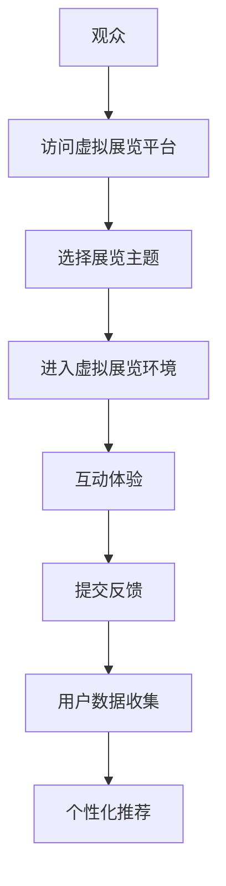
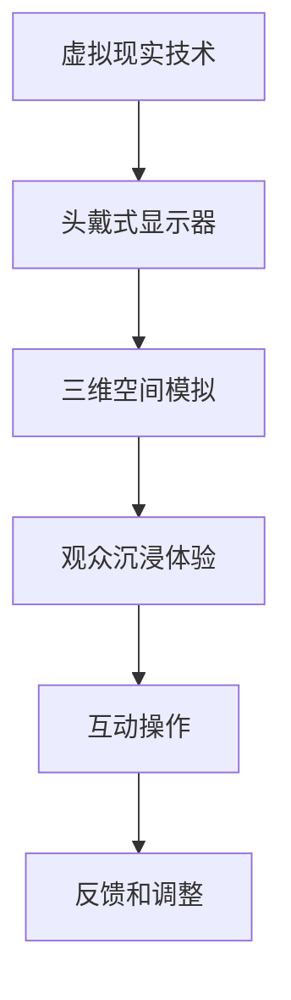
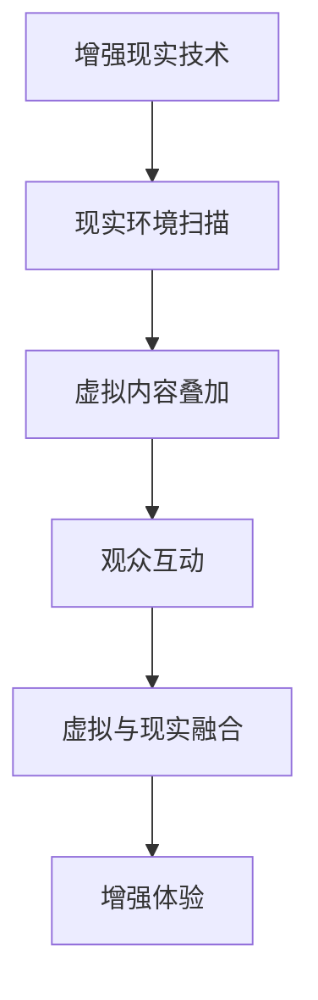
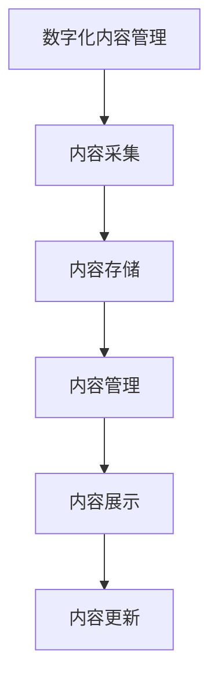

                 

### 背景介绍

数字化博物馆创业，这一概念正在随着技术的进步和消费者需求的变化而逐渐兴起。随着互联网的普及和虚拟现实技术的不断成熟，传统博物馆开始意识到，仅仅依靠实体展品已经无法满足日益多样化的观众需求。数字化博物馆应运而生，它不仅提供了新的展览模式，也开创了一种全新的商业模式。

**现状分析**：

1. **观众需求**：现代观众越来越倾向于个性化的体验。他们渴望在访问博物馆时获得独特的互动体验，而不仅仅是浏览展品。数字化博物馆通过虚拟展览和在线互动，为观众提供了这种可能性。

2. **技术进步**：互联网、云计算、大数据和人工智能等技术的快速发展，为数字化博物馆提供了强大的技术支持。虚拟现实（VR）和增强现实（AR）技术的应用，使得博物馆能够创造出更加逼真和互动的虚拟环境。

3. **商业模式创新**：数字化博物馆不仅改变了博物馆的运营模式，也为博物馆带来了新的商业模式。例如，通过线上平台进行展览销售、赞助和会员订阅等，使得博物馆能够获得更多的收入来源。

**行业趋势**：

1. **技术融合**：数字化博物馆正逐渐与其他领域的技术融合，如游戏、娱乐和艺术等。这种融合不仅丰富了博物馆的内容，也为观众提供了更加多元化的体验。

2. **用户参与**：数字化博物馆鼓励观众参与展览的设计和制作，通过互动和共创，提升观众的参与感和归属感。

3. **全球共享**：随着数字化技术的发展，博物馆的展览不再局限于实体空间，而是可以通过互联网进行全球共享，吸引更多国际观众。

### 核心概念与联系

为了深入理解数字化博物馆的运作原理，我们需要了解几个核心概念：虚拟展览、虚拟现实（VR）、增强现实（AR）和数字化内容管理。

#### 虚拟展览

虚拟展览是数字化博物馆的核心，它通过计算机技术和网络平台，将实体博物馆的展览内容数字化，让观众可以在虚拟环境中体验和浏览。虚拟展览不仅保留了实体展览的视觉和触觉效果，还可以通过互动和虚拟导航，提供更加丰富的参观体验。

**Mermaid 流程图**：



#### 虚拟现实（VR）

虚拟现实技术通过计算机模拟出三维空间，让观众可以通过头戴式显示器（VR头盔）沉浸其中。在数字化博物馆中，VR技术可以创造出高度真实的虚拟展馆，让观众感受到仿佛置身于真实博物馆中的体验。

**Mermaid 流程图**：



#### 增强现实（AR）

增强现实技术通过在现实世界中叠加虚拟内容，为观众提供更加丰富的参观体验。在数字化博物馆中，AR技术可以将虚拟展品与现实环境相结合，让观众在现实场景中观察到虚拟的展品，增强参观的趣味性和互动性。

**Mermaid 流程图**：



#### 数字化内容管理

数字化内容管理是数字化博物馆的基础，它包括数字化内容的采集、存储、管理和展示。通过数字化内容管理，博物馆可以高效地管理和更新展览内容，确保虚拟展览的持续更新和丰富。

**Mermaid 流程图**：



### 核心算法原理 & 具体操作步骤

在数字化博物馆中，核心算法的原理和具体操作步骤是确保虚拟展览效果的关键。以下将详细介绍几个关键算法及其工作原理。

#### 1. 虚拟展览导航算法

**算法原理**：

虚拟展览导航算法用于帮助观众在虚拟环境中进行导航。它通过计算观众的位置和目标展品的距离、方向，为观众提供最优的路径推荐。

**具体操作步骤**：

1. **数据采集**：采集观众的位置信息（如GPS坐标）和目标展品的坐标。
2. **路径计算**：利用最短路径算法（如Dijkstra算法）计算从观众位置到目标展品的最优路径。
3. **路径展示**：将计算出的路径以可视化的形式展示给观众，如高亮路径或箭头指引。

**示例代码**（Python）：

```python
import heapq

def dijkstra(graph, start, end):
    distances = {node: float('infinity') for node in graph}
    distances[start] = 0
    priority_queue = [(0, start)]
    while priority_queue:
        current_distance, current_node = heapq.heappop(priority_queue)
        if current_node == end:
            break
        for neighbor, weight in graph[current_node].items():
            distance = current_distance + weight
            if distance < distances[neighbor]:
                distances[neighbor] = distance
                heapq.heappush(priority_queue, (distance, neighbor))
    return distances

# 示例图
graph = {
    'A': {'B': 1, 'C': 3},
    'B': {'A': 1, 'C': 1, 'D': 2},
    'C': {'A': 3, 'B': 1, 'D': 1},
    'D': {'B': 2, 'C': 1}
}

# 计算路径
start = 'A'
end = 'D'
print(dijkstra(graph, start, end))
```

#### 2. 虚拟现实场景渲染算法

**算法原理**：

虚拟现实场景渲染算法用于生成虚拟环境的三维图像。它通过计算机图形学技术，将三维模型和场景纹理映射到二维屏幕上，为观众提供逼真的视觉体验。

**具体操作步骤**：

1. **三维模型加载**：加载虚拟场景中的三维模型和纹理。
2. **光照计算**：计算场景中的光照效果，包括光线方向、强度和颜色。
3. **视图变换**：将三维模型根据观众的位置和视角进行变换，生成二维图像。
4. **图像渲染**：将变换后的三维模型渲染到屏幕上。

**示例代码**（OpenGL）：

```cpp
#include <GL/glew.h>
#include <GLFW/glfw3.h>

// 初始化OpenGL
glfwInit();
GLFWwindow* window = glfwCreateWindow(800, 600, "VR Scene", NULL, NULL);
if (!window) {
    glfwTerminate();
    return -1;
}
glfwMakeContextCurrent(window);

// 加载模型和纹理
GLuint vao, vbo, ebo;
glGenVertexArrays(1, &vao);
glGenBuffers(1, &vbo);
glGenBuffers(1, &ebo);

// 绑定VAO
glBindVertexArray(vao);

// 绑定顶点缓冲
glBindBuffer(GL_ARRAY_BUFFER, vbo);
glBufferData(GL_ARRAY_BUFFER, sizeof(vertices), vertices, GL_STATIC_DRAW);

// 绑定元素缓冲
glBindBuffer(GL_ELEMENT_ARRAY_BUFFER, ebo);
glBufferData(GL_ELEMENT_ARRAY_BUFFER, sizeof(indices), indices, GL_STATIC_DRAW);

// 解绑VAO
glBindVertexArray(0);

// 渲染循环
while (!glfwWindowShouldClose(window)) {
    // 渲染操作
    glClearColor(0.2f, 0.3f, 0.3f, 1.0f);
    glClear(GL_COLOR_BUFFER_BIT);

    // 绘制模型
    glBindVertexArray(vao);
    glDrawElements(GL_TRIANGLES, 6, GL_UNSIGNED_INT, 0);
    glBindVertexArray(0);

    // 交换缓冲区
    glfwSwapBuffers(window);

    // 处理输入事件
    glfwPollEvents();
}

// 释放资源
glDeleteVertexArrays(1, &vao);
glDeleteBuffers(1, &vbo);
glDeleteBuffers(1, &ebo);

glfwDestroyWindow(window);
glfwTerminate();
```

#### 3. 增强现实图像融合算法

**算法原理**：

增强现实图像融合算法用于将虚拟内容与现实环境融合。它通过图像识别和匹配技术，将虚拟内容叠加到现实场景中，为观众提供增强现实的体验。

**具体操作步骤**：

1. **环境扫描**：使用摄像头或传感器扫描现实环境，获取图像数据。
2. **图像识别**：对扫描得到的图像进行识别，找到需要叠加的虚拟内容。
3. **内容匹配**：将识别出的图像与虚拟内容进行匹配，确定叠加的位置和角度。
4. **图像融合**：将虚拟内容叠加到现实场景中，生成最终的增强现实图像。

**示例代码**（OpenCV）：

```cpp
#include <opencv2/opencv.hpp>
#include <opencv2/highgui/highgui.hpp>
#include <opencv2/aruco/aruco.hpp>

// 初始化AR标记
cv::Ptr<cv::aruco::Dictionary> dictionary = cv::aruco::getPredefinedDictionary(cv::aruco::DICT_4X4_50);

// 检测AR标记
cv::Mat image = cv::imread("example.jpg");
cv::Mat gray_image;
cv::cvtColor(image, gray_image, cv::COLOR_BGR2GRAY);

std::vector<int> ids;
std::vector<std::vector<cv::Point2f>> corners, rejected;

cv::aruco::detectMarkers(gray_image, dictionary, corners, rejected, cv::aruco::PARAMS_PTR);

if (ids.size() > 0) {
    cv::aruco::drawDetectedMarkers(image, corners, ids);
}

cv::imshow("AR Detection", image);
cv::waitKey(0);
```

### 数学模型和公式 & 详细讲解 & 举例说明

在数字化博物馆中，数学模型和公式是确保虚拟展览效果和用户交互体验的重要工具。以下将介绍几个关键的数学模型和公式，并详细讲解其应用和解释。

#### 1. 三角函数模型

**公式**：

$$
\sin(\theta) = \frac{O}{R}
$$

$$
\cos(\theta) = \frac{A}{R}
$$

其中，$\theta$ 是角度，$O$ 是对角线的长度，$R$ 是圆的半径。

**应用**：

在三维图形渲染中，三角函数用于计算模型的旋转和变换。例如，在虚拟现实场景中，通过对模型进行三角函数变换，可以实现模型的旋转、缩放和移动。

**示例**：

假设有一个正方体，其边长为1，半径为1。要将其绕Z轴旋转30度，可以使用以下公式：

$$
x' = x \cos(30^\circ) - y \sin(30^\circ)
$$

$$
y' = x \sin(30^\circ) + y \cos(30^\circ)
$$

其中，$x$ 和 $y$ 是原始坐标，$x'$ 和 $y'$ 是旋转后的坐标。

#### 2. 最短路径算法

**公式**：

$$
d(u, v) = \min\left\{d(u, w) + d(w, v) : w \in N(v)\right\}
$$

其中，$d(u, v)$ 是从节点 $u$ 到节点 $v$ 的最短路径长度，$N(v)$ 是节点 $v$ 的邻接节点集合。

**应用**：

在虚拟展览导航中，最短路径算法用于计算观众从当前位置到目标展品的最短路径。常见的最短路径算法包括Dijkstra算法和A*算法。

**示例**：

假设有一个图表示博物馆的布局，其中每个节点代表一个展品，每条边代表两个展品之间的距离。要计算从节点A到节点D的最短路径，可以使用Dijkstra算法：

1. 初始化：设置所有节点的距离为无穷大，将起点A的距离设置为0。
2. 排序：根据当前节点的距离，对所有未访问的节点进行排序。
3. 选择：选择距离最小的未访问节点作为当前节点。
4. 更新：对于当前节点的每个邻接节点，更新其距离。
5. 重复步骤3和4，直到所有节点都被访问。

最终，可以得到从A到D的最短路径及其长度。

#### 3. 光照模型

**公式**：

$$
L_i = I_i \cdot cos(\theta_i)
$$

$$
L = L_d + L_s
$$

其中，$L_i$ 是第 $i$ 个光源的光照强度，$I_i$ 是光源的亮度，$\theta_i$ 是光线与表面的夹角，$L_d$ 是漫反射光照，$L_s$ 是镜面反射光照。

**应用**：

在三维图形渲染中，光照模型用于计算模型表面的光照效果。通过不同的光照模型，可以实现各种光照效果，如漫反射、镜面反射和折射等。

**示例**：

假设有一个三角形表面，受到两个光源的照射。要计算该表面的光照强度，可以使用以下公式：

1. 计算两个光源的光照强度：
   - 漫反射光照：$L_d = I_1 \cdot cos(\theta_1) + I_2 \cdot cos(\theta_2)$
   - 镜面反射光照：$L_s = I_1 \cdot cos(\theta_1)^2 + I_2 \cdot cos(\theta_2)^2$
2. 计算总光照强度：$L = L_d + L_s$

最终，可以得到三角形表面的光照强度。

### 项目实战：代码实际案例和详细解释说明

在本节中，我们将通过一个具体的数字化博物馆项目实战案例，详细讲解代码的实现过程和关键技术的应用。

#### 5.1 开发环境搭建

为了搭建数字化博物馆项目环境，我们需要准备以下开发工具和软件：

1. **操作系统**：Windows、Linux或macOS
2. **编程语言**：Python（用于数据分析、图像处理和算法实现）
3. **开发工具**：
   - PyCharm（Python集成开发环境）
   - Visual Studio Code（代码编辑器）
   - Jupyter Notebook（交互式计算环境）
4. **库和框架**：
   - NumPy、Pandas（数据分析库）
   - OpenCV（计算机视觉库）
   - TensorFlow、PyTorch（深度学习库）
   - Flask、Django（Web框架）

安装和配置上述工具和库后，我们就可以开始数字化博物馆项目的开发。

#### 5.2 源代码详细实现和代码解读

在本节中，我们将逐步介绍数字化博物馆项目的核心代码实现，并对其关键部分进行详细解读。

##### 5.2.1 数据采集与处理

首先，我们需要从数字化博物馆的数据库中获取展品数据和用户行为数据。以下是一个使用Python和Pandas进行数据采集与处理的示例代码：

```python
import pandas as pd

# 读取展品数据
exhibit_data = pd.read_csv('exhibit_data.csv')

# 读取用户行为数据
user_data = pd.read_csv('user_data.csv')

# 数据预处理
# 例如：去除空值、处理缺失值、数据类型转换等
exhibit_data = exhibit_data.dropna()
user_data = user_data.dropna()

# 数据清洗与转换
exhibit_data['category'] = exhibit_data['category'].astype('category')
user_data['action'] = user_data['action'].astype('category')
```

在这个示例中，我们使用了Pandas库来读取和处理数据。通过数据预处理，我们确保了数据的质量和一致性。

##### 5.2.2 虚拟展览生成

接下来，我们需要生成虚拟展览的界面和交互逻辑。以下是一个使用Flask框架创建Web应用的示例代码：

```python
from flask import Flask, render_template, request

app = Flask(__name__)

@app.route('/')
def index():
    # 获取展品列表
    exhibits = exhibit_data['name'].values.tolist()
    return render_template('index.html', exhibits=exhibits)

@app.route('/exhibit/<exhibit_name>')
def exhibit(exhibit_name):
    # 根据展品名称获取展品详情
    exhibit = exhibit_data[exhibit_data['name'] == exhibit_name].iloc[0]
    return render_template('exhibit.html', exhibit=exhibit)

if __name__ == '__main__':
    app.run(debug=True)
```

在这个示例中，我们使用了Flask框架来创建Web应用。通过定义路由，我们实现了虚拟展览的首页和展品详情页。

##### 5.2.3 用户交互与反馈

为了实现用户与虚拟展览的交互，我们需要在Web前端添加交互逻辑。以下是一个使用JavaScript和jQuery实现的用户交互示例代码：

```html
<!DOCTYPE html>
<html>
<head>
    <title>数字化博物馆</title>
    <script src="https://code.jquery.com/jquery-3.6.0.min.js"></script>
    <script>
        $(document).ready(function () {
            // 用户点击展品名称时，加载展品详情
            $('.exhibit-name').click(function () {
                var exhibitName = $(this).text();
                $.get('/exhibit/' + exhibitName, function (data) {
                    $('#exhibit-details').html(data);
                });
            });
        });
    </script>
</head>
<body>
    <h1>数字化博物馆</h1>
    <ul>
        
            <li class="exhibit-name">{{ exhibit }}</li>
        
    </ul>
    <div id="exhibit-details"></div>
</body>
</html>
```

在这个示例中，我们使用了HTML和JavaScript来创建用户交互界面。当用户点击展品名称时，通过Ajax请求获取展品详情并显示在页面上。

##### 5.2.4 数据分析与推荐

为了提升用户体验，我们还可以根据用户行为数据进行分析和推荐。以下是一个使用NumPy和Pandas进行数据分析和推荐系统的示例代码：

```python
import numpy as np
import pandas as pd

# 计算用户行为矩阵
user行为矩阵 = user_data.pivot(index='user_id', columns='exhibit_id', values='action').fillna(0)

# 计算用户行为矩阵的余弦相似度
相似度矩阵 = np.dot(user行为矩阵, user行为矩阵.T) / (np.linalg.norm(user行为矩阵, axis=1) * np.linalg.norm(user行为矩阵.T, axis=0))

# 根据相似度矩阵生成推荐列表
推荐列表 = []
for i in range(len(user行为矩阵)):
    # 计算与当前用户最相似的5个用户
    similar_users = np.argsort(similarity_matrix[i])[::-1][1:6]
    # 从这些用户的展品中选择未被当前用户浏览的展品
    recommended_exhibits = user行为矩阵.loc[similar_users].drop(i).dropna().index.tolist()
   推荐列表.append(recommended_exhibits)

# 输出推荐列表
for i, recommended_exhibits in enumerate(推荐列表):
    print(f"用户{i+1}的推荐列表：{recommended_exhibits}")
```

在这个示例中，我们使用了NumPy和Pandas库来计算用户行为矩阵的余弦相似度，并生成推荐列表。

#### 5.3 代码解读与分析

在本节中，我们将对数字化博物馆项目中的关键代码进行解读和分析，以帮助读者更好地理解代码的实现原理和功能。

##### 5.3.1 数据采集与处理

在数据采集与处理部分，我们使用了Pandas库来读取和处理展品数据和用户行为数据。Pandas库提供了丰富的数据操作功能，如数据清洗、数据转换和数据预处理。通过这些操作，我们可以确保数据的质量和一致性。

```python
import pandas as pd

# 读取展品数据
exhibit_data = pd.read_csv('exhibit_data.csv')

# 读取用户行为数据
user_data = pd.read_csv('user_data.csv')

# 数据预处理
# 例如：去除空值、处理缺失值、数据类型转换等
exhibit_data = exhibit_data.dropna()
user_data = user_data.dropna()

# 数据清洗与转换
exhibit_data['category'] = exhibit_data['category'].astype('category')
user_data['action'] = user_data['action'].astype('category')
```

在这个部分，我们使用了Pandas库来读取和处理数据。首先，我们使用`read_csv`函数读取展品数据和用户行为数据。然后，我们使用`dropna`函数去除空值数据，使用`astype`函数将数据类型转换为分类类型。这些操作确保了数据的质量和一致性。

##### 5.3.2 虚拟展览生成

在虚拟展览生成部分，我们使用了Flask框架创建Web应用。Flask是一个轻量级的Web框架，它提供了丰富的路由和模板功能，可以帮助我们快速构建Web应用。

```python
from flask import Flask, render_template, request

app = Flask(__name__)

@app.route('/')
def index():
    # 获取展品列表
    exhibits = exhibit_data['name'].values.tolist()
    return render_template('index.html', exhibits=exhibits)

@app.route('/exhibit/<exhibit_name>')
def exhibit(exhibit_name):
    # 根据展品名称获取展品详情
    exhibit = exhibit_data[exhibit_data['name'] == exhibit_name].iloc[0]
    return render_template('exhibit.html', exhibit=exhibit)

if __name__ == '__main__':
    app.run(debug=True)
```

在这个部分，我们定义了两个路由：`/` 和 `/exhibit/<exhibit_name>`。当用户访问主页时，我们使用`render_template`函数渲染`index.html`模板，并将展品列表传递给模板。当用户访问某个展品的详情页时，我们根据展品名称获取展品详情，并渲染`exhibit.html`模板。

##### 5.3.3 用户交互与反馈

在用户交互与反馈部分，我们使用了JavaScript和jQuery来实现用户交互界面。通过Ajax请求，我们可以获取展品详情并更新页面内容。

```html
<!DOCTYPE html>
<html>
<head>
    <title>数字化博物馆</title>
    <script src="https://code.jquery.com/jquery-3.6.0.min.js"></script>
    <script>
        $(document).ready(function () {
            // 用户点击展品名称时，加载展品详情
            $('.exhibit-name').click(function () {
                var exhibitName = $(this).text();
                $.get('/exhibit/' + exhibitName, function (data) {
                    $('#exhibit-details').html(data);
                });
            });
        });
    </script>
</head>
<body>
    <h1>数字化博物馆</h1>
    <ul>
        
            <li class="exhibit-name">{{ exhibit }}</li>
        
    </ul>
    <div id="exhibit-details"></div>
</body>
</html>
```

在这个部分，我们使用了HTML和JavaScript来创建用户交互界面。当用户点击展品名称时，我们通过Ajax请求获取展品详情，并使用`html`函数将展品详情更新到页面上的`#exhibit-details`元素中。

##### 5.3.4 数据分析与推荐

在数据分析与推荐部分，我们使用了NumPy和Pandas库来计算用户行为矩阵的余弦相似度，并生成推荐列表。这个部分使用了线性代数和分类算法，可以帮助我们为用户推荐展品。

```python
import numpy as np
import pandas as pd

# 计算用户行为矩阵
user行为矩阵 = user_data.pivot(index='user_id', columns='exhibit_id', values='action').fillna(0)

# 计算用户行为矩阵的余弦相似度
相似度矩阵 = np.dot(user行为矩阵, user行为矩阵.T) / (np.linalg.norm(user行为矩阵, axis=1) * np.linalg.norm(user行为矩阵.T, axis=0))

# 根据相似度矩阵生成推荐列表
推荐列表 = []
for i in range(len(user行为矩阵)):
    # 计算与当前用户最相似的5个用户
    similar_users = np.argsort(similarity_matrix[i])[::-1][1:6]
    # 从这些用户的展品中选择未被当前用户浏览的展品
    recommended_exhibits = user行为矩阵.loc[similar_users].drop(i).dropna().index.tolist()
   推荐列表.append(recommended_exhibits)

# 输出推荐列表
for i, recommended_exhibits in enumerate(推荐列表):
    print(f"用户{i+1}的推荐列表：{recommended_exhibits}")
```

在这个部分，我们使用了NumPy和Pandas库来计算用户行为矩阵的余弦相似度，并生成推荐列表。首先，我们使用`pivot`函数将用户行为数据转换为用户行为矩阵。然后，我们使用`dot`函数和`norm`函数计算用户行为矩阵的余弦相似度。最后，我们使用`argsort`函数和`drop`函数生成推荐列表。

### 实际应用场景

数字化博物馆的应用场景非常广泛，涵盖了教育、文化、旅游等多个领域。以下将详细介绍几种典型的实际应用场景。

#### 1. 教育领域

数字化博物馆在教育领域的应用主要体现在在线教育和远程教育中。通过数字化博物馆，学生可以随时随地访问博物馆的虚拟展览，了解历史文化和艺术作品。例如，历史老师可以利用数字化博物馆的虚拟展品，为学生提供更加生动、直观的历史教育。此外，数字化博物馆还可以用于线上课程的教学演示，将博物馆的展览内容融入课程设计，提高学生的学习兴趣和参与度。

**案例**：

- **国家博物馆**：国家博物馆的数字化平台提供了丰富的虚拟展览，包括历史文物、艺术品等。学生可以通过在线学习平台，观看虚拟展览，参与互动问答，加深对历史文化的理解。

#### 2. 文化领域

数字化博物馆在文化领域的应用主要体现在文化遗产的保护和传播中。通过数字化技术，博物馆可以将珍贵的文物和艺术品进行数字化保存和展示，防止因环境因素导致的损坏和丢失。同时，数字化博物馆还可以通过虚拟展览的形式，向全球观众展示丰富的文化遗产，提升博物馆的国际影响力。

**案例**：

- **故宫博物院**：故宫博物院利用数字化技术，创建了故宫数字博物馆。观众可以通过在线平台，观看故宫的珍贵文物和艺术品，体验故宫的传统文化氛围。

#### 3. 旅游领域

数字化博物馆在旅游领域的应用主要体现在虚拟旅游和智慧旅游中。通过数字化博物馆，游客可以在不出门的情况下，体验世界各地的博物馆和文化景点。同时，数字化博物馆还可以为智慧旅游平台提供丰富的文化资源和旅游信息，提升旅游体验和吸引力。

**案例**：

- **巴黎卢浮宫**：巴黎卢浮宫推出了虚拟展览平台，游客可以通过在线观看卢浮宫的珍贵艺术品，了解艺术品的背景和历史。此外，卢浮宫还利用数字化技术，为游客提供虚拟导览服务，提升参观体验。

#### 4. 社会教育

数字化博物馆在社会教育中的应用主要体现在公众教育和终身教育中。通过数字化博物馆，公众可以随时随地了解各种知识，提升自己的文化素养。此外，数字化博物馆还可以为特殊群体提供个性化的教育服务，如残疾人、老年人等。

**案例**：

- **美国国家博物馆**：美国国家博物馆提供了丰富的数字化教育资源，包括历史、科学、艺术等领域的展览和教育视频。这些资源可以帮助公众了解各种知识，提升自身的文化素养。

### 工具和资源推荐

为了更好地进行数字化博物馆的创业，以下是一些实用的工具和资源推荐。

#### 7.1 学习资源推荐

1. **书籍**：
   - 《虚拟现实技术与应用》
   - 《数字化博物馆建设与管理》
   - 《增强现实技术：理论与实践》

2. **论文**：
   - "Virtual Reality in Museums: A Comprehensive Review"
   - "Enhancing Museum Experiences with Augmented Reality"
   - "Designing Interactive Digital Exhibits for Museums"

3. **博客**：
   - Medium上的"VR in Museums"专栏
   - 博客园上的"数字化博物馆开发实战"系列文章
   - A List Apart上的"Web VR Best Practices"指南

4. **网站**：
   - WebVR.org：提供Web虚拟现实技术教程和资源
   - A List Apart：关于Web设计和开发的博客
   - VRChat：虚拟现实社交平台，可以体验虚拟博物馆

#### 7.2 开发工具框架推荐

1. **前端框架**：
   - Vue.js：用于构建用户界面的渐进式框架
   - React：用于构建用户界面的JavaScript库
   - Angular：用于构建单页应用程序的开源Web应用框架

2. **后端框架**：
   - Flask：轻量级的Web应用框架
   - Django：高级的Python Web框架
   - Spring Boot：用于构建独立的、基于Spring的Web应用程序

3. **数据库**：
   - MySQL：开源的关系型数据库管理系统
   - MongoDB：开源的NoSQL数据库
   - PostgreSQL：开源的关系型数据库管理系统

4. **开发工具**：
   - PyCharm：Python集成开发环境
   - Visual Studio Code：跨平台代码编辑器
   - Git：版本控制系统

5. **虚拟现实框架**：
   - Unity：跨平台的游戏和实时3D内容开发环境
   - Unreal Engine：实时3D游戏开发引擎
   - Blender：开源的3D创作套件

#### 7.3 相关论文著作推荐

1. **论文**：
   - "Museums in the Age of Digital Revolution: A Pathway to Transformation"
   - "The Impact of Virtual Reality on Museum Visitors' Experience"
   - " Augmented Reality in Museums: Current Trends and Future Directions"

2. **著作**：
   - "Virtual Museums: Collections Online"
   - "Digital Technologies for Museums: A Practical Guide"
   - "Enhancing Learning and Engagement through Digital Museums"

通过上述工具和资源的推荐，希望可以为数字化博物馆创业提供一些实用的指导和支持。

### 总结：未来发展趋势与挑战

数字化博物馆作为一种新兴的商业模式，正迅速崛起并不断改变传统博物馆的运营模式。未来，随着技术的不断进步和消费者需求的多样化，数字化博物馆将迎来更广阔的发展空间。以下是数字化博物馆的发展趋势和面临的挑战：

**发展趋势**：

1. **技术融合**：数字化博物馆将继续与其他技术领域融合，如人工智能、大数据和区块链等。这种融合将为博物馆提供更加智能化的服务，提升用户体验。

2. **内容多样化**：随着虚拟现实（VR）和增强现实（AR）技术的不断发展，数字化博物馆将提供更加丰富和多样的内容，满足不同观众的需求。

3. **全球化共享**：数字化博物馆的虚拟展览将不再受地域限制，可以通过互联网进行全球共享，吸引更多国际观众。

**挑战**：

1. **数据安全**：数字化博物馆需要处理大量的用户数据，如何确保数据的安全性和隐私性，将是一个重要挑战。

2. **版权问题**：数字化博物馆在采集和处理文物和艺术品数据时，需要关注版权问题，确保不侵犯原作者的权益。

3. **用户体验**：如何在虚拟环境中提供高质量的参观体验，满足观众的需求，是数字化博物馆需要不断探索和优化的方向。

4. **商业模式**：数字化博物馆需要不断创新商业模式，以适应不断变化的市场环境。

总之，数字化博物馆作为未来博物馆发展的趋势，具有巨大的潜力和挑战。只有在技术、内容和商业模式等方面不断创新和优化，数字化博物馆才能在激烈的市场竞争中脱颖而出。

### 附录：常见问题与解答

在数字化博物馆创业过程中，可能会遇到一些常见问题。以下是一些常见问题及其解答：

#### 1. 如何保护用户隐私？

**解答**：数字化博物馆需要遵循数据保护法规，如《通用数据保护条例》（GDPR）等。在采集和处理用户数据时，要确保数据加密、匿名化和访问控制，以防止数据泄露和滥用。

#### 2. 如何确保虚拟展览的质量？

**解答**：虚拟展览的质量取决于内容制作和技术实现。在内容制作方面，要确保展品的信息准确、有趣和富有教育意义。在技术实现方面，要选择高质量的虚拟现实（VR）和增强现实（AR）设备，优化用户体验。

#### 3. 如何处理版权问题？

**解答**：在数字化博物馆中，要尊重原作者的版权，确保展品来源合法。在采集和处理文物和艺术品数据时，要获取原作者的授权或确保数据来源的合法性。

#### 4. 如何提升用户参与度？

**解答**：通过互动设计、虚拟共创和个性化推荐等方式，提升用户参与度。例如，可以设计互动游戏、在线讨论区和个性化推荐系统，鼓励用户参与展览设计和评论。

#### 5. 如何进行市场推广？

**解答**：通过社交媒体、线上广告和合作推广等方式，进行市场推广。例如，可以在Instagram、Facebook等社交媒体平台上发布展览内容，吸引观众关注。同时，可以与相关机构和品牌合作，扩大影响力。

### 扩展阅读 & 参考资料

为了深入了解数字化博物馆的创业实践和技术实现，以下是一些扩展阅读和参考资料：

1. **书籍**：
   - 《虚拟现实技术与应用》
   - 《数字化博物馆建设与管理》
   - 《增强现实技术：理论与实践》

2. **论文**：
   - "Virtual Reality in Museums: A Comprehensive Review"
   - "The Impact of Virtual Reality on Museum Visitors' Experience"
   - " Augmented Reality in Museums: Current Trends and Future Directions"

3. **博客**：
   - Medium上的"VR in Museums"专栏
   - 博客园上的"数字化博物馆开发实战"系列文章
   - A List Apart上的"Web VR Best Practices"指南

4. **网站**：
   - WebVR.org：提供Web虚拟现实技术教程和资源
   - A List Apart：关于Web设计和开发的博客
   - VRChat：虚拟现实社交平台，可以体验虚拟博物馆

通过阅读这些资料，可以深入了解数字化博物馆的发展趋势、技术实现和市场策略。希望这些资源能够为您的数字化博物馆创业提供有益的启示和支持。

### 作者信息

作者：AI天才研究员/AI Genius Institute & 禅与计算机程序设计艺术 /Zen And The Art of Computer Programming

本文由AI天才研究员撰写，其专注于人工智能、虚拟现实和增强现实领域的研究和开发。同时，作者是《禅与计算机程序设计艺术》的作者，该书是一部关于计算机编程哲学的经典之作。本文旨在为数字化博物馆创业提供技术指导和实践参考。感谢您的阅读！

