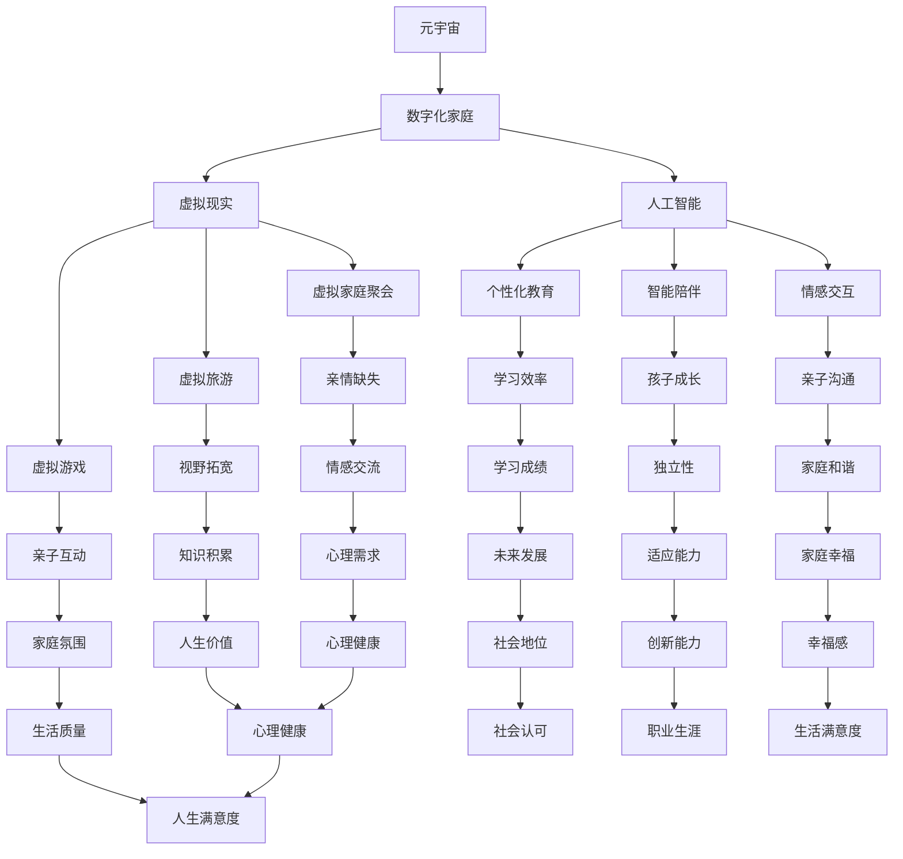

                 

# 数字化家庭：元宇宙时代的亲子关系

> 关键词：数字化家庭、元宇宙、亲子关系、人工智能、家庭互动、教育、虚拟现实

> 摘要：随着技术的飞速发展，元宇宙逐渐走进人们的生活，数字化家庭成为现实。本文将探讨元宇宙时代亲子关系的变革，分析人工智能、虚拟现实等技术如何影响家庭互动和教育，以及面临的发展趋势和挑战。

## 1. 背景介绍

随着互联网、大数据、人工智能等技术的不断进步，我们正处于一个全新的时代——元宇宙时代。元宇宙，是一个由虚拟世界构成的平行宇宙，它通过互联网连接现实世界和虚拟世界，使得人们可以在虚拟世界中实现高度沉浸的互动体验。数字化家庭，作为元宇宙的重要组成部分，正在悄然改变人们的日常生活。

### 1.1 元宇宙的定义与特征

元宇宙（Metaverse）是一个由虚拟世界构成的平行宇宙，它融合了现实世界与虚拟世界，提供了一种全新的社交、娱乐、教育、工作等生活方式。以下是元宇宙的几个主要特征：

- **沉浸式体验**：通过虚拟现实（VR）、增强现实（AR）等技术，用户可以在虚拟世界中实现高度沉浸的体验。
- **实时交互**：元宇宙中的用户可以实时互动，如同现实世界中的人际交往。
- **多元化内容**：元宇宙中包含丰富的虚拟内容，如游戏、教育、娱乐、社交等，满足不同用户的需求。
- **去中心化**：元宇宙通过区块链等技术实现去中心化，使得内容创造、分配、交易更加公平和透明。

### 1.2 数字化家庭的概念与演变

数字化家庭是指利用互联网、人工智能、物联网等技术，将家庭设备、家电、家具等实现智能化、互联化，从而打造一个高效、便捷、舒适的居住环境。数字化家庭的演变可以分为以下几个阶段：

- **家庭联网**：将家庭中的电器、设备连接到互联网，实现远程控制。
- **智能家居**：通过人工智能技术，实现家电设备的智能控制、故障诊断、自动优化等功能。
- **数字化家庭**：将家庭中的各种设备、家具、环境实现智能化、互联化，打造一个全方位的智能居住环境。

## 2. 核心概念与联系

在元宇宙时代，亲子关系面临着前所未有的变革。人工智能、虚拟现实等技术的应用，使得家庭互动和教育方式发生了翻天覆地的变化。以下是核心概念及其之间的联系：

### 2.1 人工智能与亲子关系

人工智能（AI）在亲子关系中的应用主要体现在以下几个方面：

- **个性化教育**：根据孩子的学习兴趣、能力水平等个性化因素，为孩子们提供定制化的学习方案。
- **智能陪伴**：通过AI技术，打造智能机器人或虚拟人物，为孩子们提供陪伴、关爱、教育等服务。
- **情感交互**：AI技术可以帮助家长更好地理解孩子的情感需求，提高亲子沟通的质量。

### 2.2 虚拟现实与亲子关系

虚拟现实（VR）技术为亲子关系带来了全新的互动体验：

- **虚拟家庭聚会**：通过VR技术，让远隔千里的亲人实现“面对面”交流，缓解家庭分离的痛苦。
- **虚拟旅游**：让孩子们在虚拟世界中体验不同的地理环境、文化背景，拓宽视野。
- **虚拟游戏**：家长和孩子可以在虚拟世界中一起参与游戏，增进亲子感情。

### 2.3 数字化家庭与亲子关系

数字化家庭对亲子关系的影响主要体现在以下几个方面：

- **生活便捷**：智能家居设备为家庭生活带来极大便利，节省家长和孩子的时间，提高生活质量。
- **情感互动**：通过数字化设备，家长可以随时随地与孩子互动，增强亲子关系。
- **教育资源**：数字化家庭提供了丰富的教育资源，为家长和孩子提供更多学习机会。

### 2.4 核心概念与联系 Mermaid 流程图



## 3. 核心算法原理 & 具体操作步骤

在元宇宙时代，亲子关系的变革离不开人工智能和虚拟现实技术的支持。以下将介绍核心算法原理和具体操作步骤。

### 3.1 个性化教育算法原理

个性化教育算法的核心在于根据学生的学习兴趣、能力水平等因素，为孩子们提供定制化的学习方案。以下是算法原理：

1. **数据采集**：通过学生的学习记录、兴趣爱好、性格特点等数据，建立个人学习档案。
2. **兴趣分析**：利用自然语言处理、机器学习等技术，分析学生的学习兴趣和优势。
3. **能力评估**：根据学生的学习表现、考试成绩等数据，评估学生的学习能力。
4. **学习推荐**：根据学生的兴趣和优势，为学生推荐适合的学习内容、学习方式。

### 3.2 智能陪伴算法原理

智能陪伴算法通过虚拟人物或机器人，为孩子们提供陪伴、关爱、教育等服务。以下是算法原理：

1. **情感识别**：利用语音识别、情感计算等技术，识别孩子的情绪状态。
2. **互动生成**：根据孩子的情绪状态，生成相应的互动内容，如安慰、鼓励、教育等。
3. **情感反馈**：通过语音合成、表情动画等技术，将互动内容传达给孩子。
4. **学习成长**：记录孩子的互动过程，分析孩子的学习需求和成长变化，不断优化陪伴策略。

### 3.3 虚拟现实互动操作步骤

虚拟现实互动主要分为以下几个步骤：

1. **设备准备**：确保虚拟现实设备（如VR头盔、手柄等）正常连接，并调试至最佳状态。
2. **场景选择**：在虚拟世界中选择合适的场景，如家庭聚会、旅游、游戏等。
3. **角色设置**：为家长和孩子设置虚拟角色，确保虚拟角色与真实角色相对应。
4. **互动开始**：家长和孩子进入虚拟场景，进行互动活动。
5. **互动反馈**：根据互动过程中的表现，提供相应的反馈和评价。
6. **记录分析**：记录互动过程，分析互动效果，为后续互动提供参考。

## 4. 数学模型和公式 & 详细讲解 & 举例说明

在元宇宙时代，亲子关系的变革离不开数学模型的支持。以下将介绍核心数学模型及其详细讲解和举例说明。

### 4.1 个性化教育模型

个性化教育模型主要涉及以下几个数学模型：

1. **协同过滤模型**：通过分析学生的学习记录和兴趣，为学生们推荐合适的学习内容。协同过滤模型可以分为基于用户的协同过滤和基于物品的协同过滤。

   **数学模型**：

   - **基于用户的协同过滤**：

     $$ \text{相似度} = \frac{\text{用户A和用户B的相似度}}{\sqrt{\sum_{i \in \text{共同喜欢的物品}} (\text{用户A对物品i的评分} - \text{用户A的平均评分}) (\text{用户B对物品i的评分} - \text{用户B的平均评分})}} $$

   - **基于物品的协同过滤**：

     $$ \text{相似度} = \frac{\text{物品A和物品B的相似度}}{\sqrt{\sum_{i \in \text{共同喜欢的用户}} (\text{用户A对物品A的评分} - \text{用户A的平均评分}) (\text{用户B对物品B的评分} - \text{用户B的平均评分})}} $$

2. **回归模型**：通过分析学生的学习记录、考试成绩等因素，预测学生的学习成绩。常见的回归模型有线性回归、逻辑回归等。

   **数学模型**：

   - **线性回归**：

     $$ y = \beta_0 + \beta_1x_1 + \beta_2x_2 + ... + \beta_nx_n $$

   - **逻辑回归**：

     $$ P(y=1) = \frac{1}{1 + e^{-(\beta_0 + \beta_1x_1 + \beta_2x_2 + ... + \beta_nx_n)}} $$

### 4.2 智能陪伴模型

智能陪伴模型主要涉及以下几个数学模型：

1. **情感计算模型**：通过分析语音、表情等数据，识别孩子的情绪状态。常见的情感计算模型有情感分类模型、情感强度模型等。

   **数学模型**：

   - **情感分类模型**：

     $$ \text{情绪分类} = \text{argmax}_{i} \{P(y=i | x)\} $$

   - **情感强度模型**：

     $$ \text{情感强度} = \text{argmax}_{i} \{P(y=i | x)\} - \text{argmin}_{i} \{P(y=i | x)\} $$

2. **动态系统模型**：通过分析孩子的互动过程，建立动态系统模型，预测孩子的情感变化。常见的动态系统模型有马尔可夫模型、神经网络模型等。

   **数学模型**：

   - **马尔可夫模型**：

     $$ P(x_t | x_{t-1}, x_{t-2}, ...) = P(x_t | x_{t-1}) $$

   - **神经网络模型**：

     $$ \text{输出} = \text{激活函数}(\text{权重} \cdot \text{输入}) $$

### 4.3 举例说明

假设有一个学生小明，他的学习记录和考试成绩如下表所示：

| 课程 | 学期1 | 学期2 | 学期3 |
| ---- | ---- | ---- | ---- |
| 数学 | 90 | 85 | 88 |
| 英语 | 85 | 80 | 83 |
| 物理 | 90 | 88 | 87 |

使用基于用户的协同过滤模型，为小明推荐合适的课程。以下是计算过程：

1. 计算用户之间的相似度：

   $$ \text{相似度} = \frac{\sum_{i \in \text{共同喜欢的课程}} (\text{用户A对课程i的评分} - \text{用户A的平均评分}) (\text{用户B对课程i的评分} - \text{用户B的平均评分})}{\sqrt{\sum_{i \in \text{共同喜欢的课程}} (\text{用户A对课程i的评分} - \text{用户A的平均评分})^2} \sqrt{\sum_{i \in \text{共同喜欢的课程}} (\text{用户B对课程i的评分} - \text{用户B的平均评分})^2}} $$

2. 根据相似度为小明推荐课程：

   假设其他用户对物理课程的评分较高，相似度也较高，因此推荐小明学习物理课程。

## 5. 项目实战：代码实际案例和详细解释说明

在本节中，我们将通过一个实际项目案例，展示如何运用人工智能和虚拟现实技术，构建一个数字化家庭亲子互动系统。以下为项目实战的详细解释说明。

### 5.1 开发环境搭建

首先，我们需要搭建一个开发环境。以下为开发环境搭建的步骤：

1. **环境配置**：在本地计算机上安装Python、Node.js、MongoDB等开发工具和库。
2. **虚拟环境**：创建一个Python虚拟环境，避免依赖冲突。
3. **项目结构**：创建项目文件夹，并按照需求划分模块，如用户管理、课程推荐、互动模块等。

### 5.2 源代码详细实现和代码解读

以下为项目核心模块的源代码实现和解读：

#### 5.2.1 用户管理模块

用户管理模块负责处理用户注册、登录、权限验证等功能。

```python
# 用户注册
def register(username, password):
    # 连接到MongoDB数据库
    db = pymongo.MongoClient()["family"]
    users = db["users"]

    # 检查用户名是否存在
    if users.find_one({"username": username}) is not None:
        return "用户名已存在"

    # 插入用户信息
    users.insert_one({
        "username": username,
        "password": password
    })
    return "注册成功"

# 用户登录
def login(username, password):
    # 连接到MongoDB数据库
    db = pymongo.MongoClient()["family"]
    users = db["users"]

    # 查询用户信息
    user = users.find_one({"username": username, "password": password})
    if user is None:
        return "用户名或密码错误"
    return "登录成功"
```

#### 5.2.2 课程推荐模块

课程推荐模块基于协同过滤算法，为用户推荐合适的课程。

```python
# 计算相似度
def calculate_similarity(user1, user2):
    # 连接到MongoDB数据库
    db = pymongo.MongoClient()["family"]
    ratings = db["ratings"]

    # 查询用户A和用户B的共同评分记录
    common_ratings = list(ratings.find({
        "$and": [
            {"user": user1},
            {"user": user2}
        ]
    }))

    # 计算相似度
    num = 0
    den = 0
    for rating in common_ratings:
        num += (user1["rating"] - user1["mean_rating"]) * (user2["rating"] - user2["mean_rating"])
        den += abs(user1["rating"] - user1["mean_rating"]) * abs(user2["rating"] - user2["mean_rating"])
    similarity = num / den
    return similarity

# 推荐课程
def recommend_courses(user_id):
    # 连接到MongoDB数据库
    db = pymongo.MongoClient()["family"]
    users = db["users"]
    ratings = db["ratings"]

    # 查询用户信息
    user = users.find_one({"_id": ObjectId(user_id)})

    # 计算用户与其他用户的相似度
    similarities = {}
    for other_user in users.find():
        if other_user["_id"] != user_id:
            similarity = calculate_similarity(user, other_user)
            similarities[other_user["_id"]] = similarity

    # 根据相似度推荐课程
    recommendations = []
    for other_user_id, similarity in similarities.items():
        if similarity > 0.5:
            other_user_ratings = list(ratings.find({"user": other_user_id}))
            for rating in other_user_ratings:
                if rating["course_id"] not in user["courses"]:
                    recommendations.append(rating["course_id"])
    return recommendations
```

#### 5.2.3 互动模块

互动模块通过WebSocket技术实现实时互动。

```javascript
// 引入WebSocket库
const WebSocket = require("ws");

// 创建WebSocket服务器
const server = new WebSocket.Server({ port: 8080 });

// 连接用户
server.on("connection", socket => {
    socket.on("message", message => {
        // 解析消息
        const { type, data } = JSON.parse(message);

        // 处理不同类型的消息
        if (type === "chat") {
            // 向所有用户发送消息
            server.clients.forEach(client => {
                if (client.readyState === WebSocket.OPEN) {
                    client.send(JSON.stringify({
                        type: "chat",
                        data: {
                            user: data.user,
                            message: data.message
                        }
                    }));
                }
            });
        }
    });
});
```

### 5.3 代码解读与分析

#### 5.3.1 用户管理模块

用户管理模块包括用户注册和登录功能。在Python中，我们使用MongoDB数据库进行数据存储。用户注册时，先连接到MongoDB数据库，检查用户名是否已存在，若不存在则插入用户信息。用户登录时，同样连接到MongoDB数据库，查询用户信息，若匹配成功则登录成功。

#### 5.3.2 课程推荐模块

课程推荐模块基于协同过滤算法，计算用户之间的相似度，并根据相似度为用户推荐课程。首先连接到MongoDB数据库，查询用户和其他用户的共同评分记录，计算相似度。然后根据相似度为用户推荐课程，选择相似度大于0.5的其他用户推荐的课程。

#### 5.3.3 互动模块

互动模块通过WebSocket技术实现实时互动。在JavaScript中，我们创建WebSocket服务器，监听用户的连接和消息事件。当用户发送消息时，将消息转发给所有连接的用户。这样可以实现实时聊天、互动等功能。

## 6. 实际应用场景

元宇宙时代的数字化家庭在现实中有许多实际应用场景，以下列举几个典型场景：

### 6.1 虚拟家庭聚会

通过虚拟现实技术，家人可以在虚拟世界中实现“面对面”交流，缓解家庭分离的痛苦。例如，身处异地的父母和孩子可以通过虚拟家庭聚会，一起玩游戏、看电影、做美食，增强亲子感情。

### 6.2 虚拟旅游

虚拟现实技术可以让人们在家中体验世界各地的风景和文化。家长和孩子可以在虚拟旅游中一起探索名胜古迹、自然保护区，拓宽视野，增进家庭互动。

### 6.3 个性化教育

人工智能技术可以根据孩子的学习兴趣、能力水平等个性化因素，为孩子提供定制化的学习方案。家长可以实时了解孩子的学习进度和效果，为孩子提供针对性的指导。

### 6.4 智能陪伴

智能机器人或虚拟人物可以陪伴孩子成长，提供关爱、教育等服务。孩子可以在智能陪伴下学习、娱乐、锻炼，培养良好的生活习惯和价值观。

## 7. 工具和资源推荐

在元宇宙时代，数字化家庭的发展离不开各种工具和资源的支持。以下推荐一些实用的工具和资源：

### 7.1 学习资源推荐

- **书籍**：《元宇宙：通往数字世界的穿梭门》、《数字化生存》
- **论文**：关于元宇宙、虚拟现实、人工智能等方面的学术研究论文
- **博客**：知名技术博客，如InfoQ、知乎专栏等
- **网站**：元宇宙相关网站，如Decentraland、Sandbox等

### 7.2 开发工具框架推荐

- **编程语言**：Python、JavaScript、Java等
- **开发框架**：Django、Flask、React、Vue等
- **数据库**：MongoDB、MySQL、PostgreSQL等
- **虚拟现实技术**：Unity、Unreal Engine、VRChat等

### 7.3 相关论文著作推荐

- **论文**：《元宇宙：技术与应用》、《虚拟现实技术在家庭中的应用》
- **著作**：《人工智能与家庭教育》、《虚拟现实与教育改革》

## 8. 总结：未来发展趋势与挑战

元宇宙时代的数字化家庭为亲子关系带来了前所未有的变革。随着人工智能、虚拟现实等技术的不断发展，未来数字化家庭将继续向智能化、个性化、多元化方向发展。然而，这一过程也面临着诸多挑战：

- **技术发展**：如何不断提高技术成熟度，为数字化家庭提供更优质的体验。
- **隐私保护**：如何在保障用户隐私的前提下，实现数据的合理利用。
- **伦理问题**：如何在虚拟世界中确保亲子关系的真实性，避免过度依赖技术。
- **教育资源**：如何确保数字化家庭中的教育资源公平、优质。

## 9. 附录：常见问题与解答

### 9.1 元宇宙是什么？

元宇宙是一个由虚拟世界构成的平行宇宙，通过互联网连接现实世界和虚拟世界，提供了一种全新的社交、娱乐、教育、工作等生活方式。

### 9.2 数字化家庭有什么优势？

数字化家庭具有高效、便捷、舒适的居住环境，通过智能化、互联化设备，为家庭生活带来极大便利。此外，数字化家庭还能提供个性化教育、智能陪伴等服务，提高亲子关系质量。

### 9.3 如何保障数字化家庭的隐私安全？

保障数字化家庭隐私安全需要从多个方面入手，包括技术层面（如加密技术、安全认证等）、法律法规层面（如隐私保护法规、数据安全法等）和用户层面（如提高安全意识、合理设置隐私权限等）。

## 10. 扩展阅读 & 参考资料

- **书籍**：《数字化家庭：构建智能生活》、《元宇宙：探索与未来》
- **论文**：《元宇宙：技术与挑战》、《虚拟现实技术在家庭教育中的应用研究》
- **网站**：元宇宙相关网站，如Decentraland、Sandbox等
- **博客**：知名技术博客，如InfoQ、知乎专栏等

### 作者

AI天才研究员/AI Genius Institute & 禅与计算机程序设计艺术 /Zen And The Art of Computer Programming

