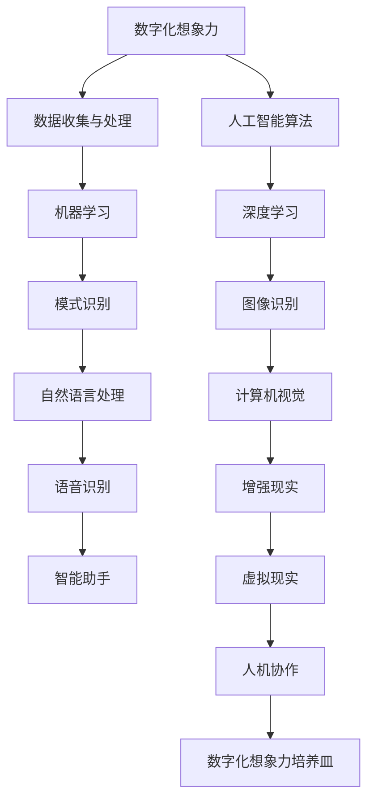

                 

# 数字化想象力培养皿：AI激发的创意思维孵化器

## 关键词
- 数字化想象力
- AI 激发
- 创意思维
- 孵化器
- 技术创新
- 人机协作
- 大数据
- 人工智能算法
- 软件架构
- 机器学习

## 摘要
本文旨在探讨数字化时代下，如何通过人工智能技术激发创意思维，构建一个高效的创意思维孵化器。文章首先介绍了数字化想象力的重要性及其与AI的紧密联系，随后深入分析了核心概念和原理，并通过具体的算法、数学模型和项目实战进行了详细阐述。最后，文章总结了实际应用场景，并推荐了相关工具和资源，展望了未来发展趋势与挑战。

## 1. 背景介绍

在当今快速发展的数字化时代，数据已经成为新的生产要素，而想象力则成为驱动技术创新的核心力量。随着人工智能技术的不断进步，AI与人类创意思维的结合展现出前所未有的潜力。数字化想象力不仅能够提升个人的创造力，还能为企业和社会带来巨大的价值。

### 数字化想象力的定义与价值

数字化想象力是指将抽象的思维转化为具体的数据和分析，从而创造新的价值和机会。它不仅涉及数据的收集、处理和存储，还包括对数据的深入理解和洞察。在数字化时代，想象力被赋予了新的形式和工具，使得创意思维更加高效和具有实际应用价值。

### AI与创意思维的结合

人工智能技术，特别是机器学习和深度学习，为创意思维提供了强大的工具和平台。通过分析大量的数据，AI能够发现隐藏的模式和关联，从而激发新的创意点子。同时，AI还可以协助人类进行复杂的决策和优化，使得创意思维更加系统和精确。

### 数字化想象力与AI的紧密联系

数字化想象力与AI的紧密联系体现在多个方面。首先，AI技术为数字化想象力提供了强大的计算能力，使得海量数据的处理和挖掘成为可能。其次，AI通过自动化和智能化的工具，提高了创意思维的效率和质量。最后，AI与人类创意思维的结合，推动了新的技术和产品的发展，为社会带来了巨大的创新和变革。

## 2. 核心概念与联系

为了更好地理解数字化想象力培养皿的工作原理，我们需要介绍一些核心概念和它们之间的联系。以下是一个Mermaid流程图，展示了这些概念及其相互关系：



### 数据收集与处理

数据收集与处理是数字化想象力培养皿的基础。通过收集各种来源的数据，包括结构化和非结构化数据，我们可以为AI提供丰富的信息资源。

### 人工智能算法

人工智能算法是数字化想象力培养皿的核心。这些算法包括机器学习和深度学习，它们能够从数据中提取有用信息，发现隐藏的模式和关联。

### 机器学习

机器学习是AI的一个分支，它使计算机系统能够从数据中学习并做出预测或决策。机器学习算法包括监督学习、无监督学习和强化学习等。

### 深度学习

深度学习是机器学习的一个子领域，它通过构建深度神经网络模型来模拟人脑的决策过程。深度学习在图像识别、语音识别和自然语言处理等领域取得了显著的成果。

### 模式识别

模式识别是AI的一个重要应用领域，它涉及从数据中识别和提取特征，从而实现自动化决策和优化。模式识别包括图像识别、语音识别和文本分类等。

### 计算机视觉

计算机视觉是AI的一个分支，它使计算机能够理解和解释视觉信息。计算机视觉在自动驾驶、人脸识别和监控系统中得到了广泛应用。

### 自然语言处理

自然语言处理是AI的另一个重要应用领域，它使计算机能够理解和处理自然语言。自然语言处理在智能助手、机器翻译和情感分析等领域取得了重要进展。

### 增强现实与虚拟现实

增强现实（AR）和虚拟现实（VR）是数字化想象力培养皿的重要应用场景。它们通过虚拟和现实世界的融合，提供了全新的交互方式和体验。

### 人机协作

人机协作是数字化想象力培养皿的一个重要目标。通过将人类的创造力和AI的计算能力相结合，我们可以实现更加高效和创新的解决方案。

## 3. 核心算法原理 & 具体操作步骤

在了解了数字化想象力培养皿的核心概念和联系之后，我们需要深入探讨其中的核心算法原理和具体操作步骤。以下是机器学习、深度学习和自然语言处理等算法的原理和步骤：

### 机器学习原理

机器学习是一种通过数据训练模型，使模型能够自主学习和做出预测或决策的技术。其原理基于以下步骤：

1. **数据收集**：收集大量相关数据，包括输入特征和目标变量。
2. **数据预处理**：对数据进行清洗、归一化和特征提取等处理，以提高模型性能。
3. **模型训练**：使用训练数据集，通过算法（如线性回归、决策树、支持向量机等）训练模型。
4. **模型评估**：使用验证数据集评估模型性能，包括准确率、召回率、F1分数等指标。
5. **模型优化**：根据评估结果，调整模型参数，以提高性能。

### 深度学习原理

深度学习是一种基于多层神经网络的学习方法，它能够自动从数据中提取特征。其原理如下：

1. **神经网络结构**：构建多层神经网络，包括输入层、隐藏层和输出层。
2. **前向传播**：输入数据通过神经网络进行前向传播，每个神经元对数据进行加权求和并应用激活函数。
3. **反向传播**：计算输出结果与实际结果之间的误差，通过反向传播算法更新网络参数。
4. **模型训练**：重复前向传播和反向传播过程，直到模型收敛。
5. **模型评估**：使用验证数据集评估模型性能。

### 自然语言处理原理

自然语言处理是一种使计算机能够理解和处理自然语言的技术。其原理包括以下步骤：

1. **分词**：将文本分割成单词或短语，以便进行进一步处理。
2. **词性标注**：为每个单词或短语标注词性，如名词、动词、形容词等。
3. **词向量表示**：将文本表示为向量，以便进行计算和处理。
4. **语言模型**：构建语言模型，用于预测下一个单词或短语。
5. **文本分类**：使用分类算法，如朴素贝叶斯、支持向量机等，对文本进行分类。
6. **情感分析**：分析文本的情感倾向，如正面、负面、中性等。

### 具体操作步骤

以下是构建一个简单的机器学习模型进行图像分类的具体操作步骤：

1. **数据收集**：收集大量图像数据，并对其进行标注。
2. **数据预处理**：对图像进行缩放、裁剪、翻转等数据增强处理，以提高模型泛化能力。
3. **数据划分**：将数据集划分为训练集、验证集和测试集。
4. **模型构建**：选择合适的神经网络结构，如卷积神经网络（CNN）。
5. **模型训练**：使用训练数据集训练模型，并使用验证集进行调优。
6. **模型评估**：使用测试集评估模型性能，如准确率、召回率等。
7. **模型优化**：根据评估结果，调整模型参数，以提高性能。

## 4. 数学模型和公式 & 详细讲解 & 举例说明

在机器学习和深度学习领域，数学模型和公式是理解和实现算法的核心。以下将详细介绍一些重要的数学模型和公式，并给出具体的例子来说明其应用。

### 概率论基础

概率论是机器学习和深度学习的基础，以下是一些基本概率论的概念和公式：

1. **概率质量函数**（Probability Mass Function, PMF）：

   $$ P(X = x) = p_x $$

   其中，\( X \) 是随机变量，\( x \) 是可能的取值，\( p_x \) 是对应的概率。

2. **概率密度函数**（Probability Density Function, PDF）：

   $$ p_X(x) = \frac{f_X(x)}{dx} $$

   其中，\( f_X(x) \) 是随机变量 \( X \) 的概率密度函数，\( dx \) 是 \( x \) 的微小增量。

3. **条件概率**：

   $$ P(A|B) = \frac{P(A \cap B)}{P(B)} $$

   其中，\( A \) 和 \( B \) 是两个事件，\( P(A|B) \) 表示在 \( B \) 发生的条件下 \( A \) 发生的概率。

4. **贝叶斯定理**：

   $$ P(A|B) = \frac{P(B|A)P(A)}{P(B)} $$

   这是一种用于计算后验概率的公式，其中 \( P(A|B) \) 是后验概率，\( P(B|A) \) 是似然函数，\( P(A) \) 是先验概率，\( P(B) \) 是边际概率。

### 线性代数基础

线性代数在机器学习和深度学习中扮演着重要角色，以下是一些关键概念和公式：

1. **矩阵乘法**：

   $$ C = AB $$

   其中，\( A \) 和 \( B \) 是两个矩阵，\( C \) 是它们的乘积。矩阵乘法遵循结合律，但一般不满足交换律。

2. **矩阵求导**：

   对于矩阵 \( A \) 的函数 \( f(A) \)，其导数可以表示为：

   $$ \frac{\partial f(A)}{\partial A} = \lim_{h \to 0} \frac{f(A+h) - f(A)}{h} $$

3. **特征值和特征向量**：

   矩阵 \( A \) 的特征值 \( \lambda \) 和对应的特征向量 \( v \) 满足以下方程：

   $$ Av = \lambda v $$

   特征值和特征向量用于分析矩阵的稳定性和特性。

### 深度学习中的激活函数

在深度学习中，激活函数用于引入非线性特性，使得神经网络能够学习复杂的模式。以下是一些常见的激活函数及其公式：

1. **Sigmoid函数**：

   $$ \sigma(x) = \frac{1}{1 + e^{-x}} $$

   Sigmoid函数将输入 \( x \) 映射到 \( (0, 1) \) 区间，常用于二分类问题。

2. **ReLU函数**：

   $$ \text{ReLU}(x) = \max(0, x) $$

   ReLU（Rectified Linear Unit）函数在 \( x > 0 \) 时等于 \( x \)，在 \( x \leq 0 \) 时等于 0，具有简单的计算形式和良好的训练效果。

3. **Tanh函数**：

   $$ \tanh(x) = \frac{e^x - e^{-x}}{e^x + e^{-x}} $$

   Tanh函数将输入 \( x \) 映射到 \( (-1, 1) \) 区间，类似于 Sigmoid 函数，但具有对称性。

### 具体例子：卷积神经网络（CNN）中的卷积操作

卷积神经网络是深度学习中的重要模型，以下是一个简单的卷积操作例子：

假设我们有一个 \( 3 \times 3 \) 的卷积核 \( K \) 和一个 \( 5 \times 5 \) 的输入特征图 \( X \)。卷积操作的目的是计算输出特征图 \( Y \)：

$$ Y(i, j) = \sum_{m=1}^{3} \sum_{n=1}^{3} K(m, n) \cdot X(i-m+1, j-n+1) $$

其中，\( (i, j) \) 是输出特征图中的位置，\( (m, n) \) 是卷积核中的位置。卷积操作通过滑动卷积核在输入特征图上进行卷积，并计算每个位置的加权和，从而生成输出特征图。

### 具体例子：反向传播算法

反向传播算法是深度学习训练过程中的关键步骤，用于更新网络权重。以下是一个简化的反向传播算法示例：

1. **前向传播**：

   $$ Z = W \cdot X + b $$
   $$ A = \sigma(Z) $$

   其中，\( Z \) 是激活值，\( W \) 是权重矩阵，\( X \) 是输入特征，\( b \) 是偏置项，\( \sigma \) 是激活函数，\( A \) 是输出激活。

2. **计算损失函数**：

   $$ \Delta = \text{损失函数}(A, Y) $$

   其中，\( Y \) 是实际输出，\( \Delta \) 是损失函数相对于输出 \( A \) 的梯度。

3. **反向传播**：

   $$ \Delta_Z = \frac{\partial \Delta}{\partial Z} $$
   $$ \Delta_W = \frac{\partial \Delta}{\partial W} $$
   $$ \Delta_b = \frac{\partial \Delta}{\partial b} $$

   通过链式法则，我们可以计算每个参数的梯度。

4. **更新权重和偏置**：

   $$ W = W - \alpha \cdot \Delta_W $$
   $$ b = b - \alpha \cdot \Delta_b $$

   其中，\( \alpha \) 是学习率。

通过以上反向传播算法，我们可以逐步更新网络权重，以最小化损失函数，从而训练深度学习模型。

## 5. 项目实战：代码实际案例和详细解释说明

在本节中，我们将通过一个实际的项目案例，展示如何使用机器学习技术构建一个简单的图像分类器。该案例将涵盖开发环境搭建、源代码实现和详细解读。

### 5.1 开发环境搭建

首先，我们需要搭建一个适合进行机器学习开发的开发环境。以下是使用 Python 和相关库进行环境搭建的步骤：

1. **安装 Python**：确保 Python 3.x 版本已安装在您的计算机上。
2. **安装 Jupyter Notebook**：使用以下命令安装 Jupyter Notebook：

   ```bash
   pip install notebook
   ```

3. **安装 TensorFlow**：TensorFlow 是一个流行的机器学习库，用于构建和训练深度学习模型。使用以下命令安装 TensorFlow：

   ```bash
   pip install tensorflow
   ```

4. **安装其他依赖库**：如 NumPy、Pandas、Matplotlib 等，这些库对于数据处理和可视化非常重要。使用以下命令安装：

   ```bash
   pip install numpy pandas matplotlib
   ```

### 5.2 源代码详细实现和代码解读

以下是使用 TensorFlow 构建一个简单的图像分类器的源代码实现：

```python
import tensorflow as tf
from tensorflow.keras import layers
from tensorflow.keras.preprocessing.image import ImageDataGenerator

# 数据预处理
train_datagen = ImageDataGenerator(
    rescale=1./255,
    shear_range=0.2,
    zoom_range=0.2,
    horizontal_flip=True
)

test_datagen = ImageDataGenerator(rescale=1./255)

train_generator = train_datagen.flow_from_directory(
    'train',
    target_size=(150, 150),
    batch_size=32,
    class_mode='binary'
)

validation_generator = test_datagen.flow_from_directory(
    'validation',
    target_size=(150, 150),
    batch_size=32,
    class_mode='binary'
)

# 构建模型
model = tf.keras.Sequential([
    layers.Conv2D(32, (3, 3), activation='relu', input_shape=(150, 150, 3)),
    layers.MaxPooling2D(2, 2),
    layers.Conv2D(64, (3, 3), activation='relu'),
    layers.MaxPooling2D(2, 2),
    layers.Conv2D(128, (3, 3), activation='relu'),
    layers.MaxPooling2D(2, 2),
    layers.Flatten(),
    layers.Dense(128, activation='relu'),
    layers.Dense(1, activation='sigmoid')
])

# 编译模型
model.compile(loss='binary_crossentropy',
              optimizer='adam',
              metrics=['accuracy'])

# 训练模型
model.fit(
    train_generator,
    steps_per_epoch=100,
    epochs=20,
    validation_data=validation_generator,
    validation_steps=50
)

# 评估模型
test_generator = test_datagen.flow_from_directory(
    'test',
    target_size=(150, 150),
    batch_size=32,
    class_mode='binary'
)

test_loss, test_acc = model.evaluate(test_generator)
print('Test accuracy:', test_acc)
```

### 5.3 代码解读与分析

以下是代码的详细解读和分析：

1. **数据预处理**：我们使用 `ImageDataGenerator` 类进行数据预处理。该类提供了多种数据增强方法，如缩放、剪裁、翻转等。通过这些操作，可以增加训练数据的多样性，提高模型泛化能力。

2. **构建模型**：我们使用 `Sequential` 模型，这是一个线性堆叠层的模型。在这个模型中，我们依次添加了卷积层、池化层、全连接层等。卷积层用于提取图像特征，全连接层用于分类。

3. **编译模型**：在编译模型时，我们指定了损失函数、优化器和评估指标。`binary_crossentropy` 是二分类问题的标准损失函数，`adam` 是一种常用的优化器，`accuracy` 是评估模型性能的指标。

4. **训练模型**：使用 `fit` 方法训练模型，我们将训练数据传递给模型，并指定训练轮次和每个轮次的样本数。同时，我们使用验证数据集进行验证，以监控模型性能。

5. **评估模型**：使用 `evaluate` 方法评估模型在测试数据集上的性能。这里我们只关注准确率。

### 5.4 实际案例分析与总结

通过以上代码实现，我们构建了一个简单的图像分类器，能够在一定程度上对二分类问题进行分类。以下是对实际案例的分析和总结：

1. **数据集准备**：在实际应用中，我们需要准备足够多的标注数据集。这里我们使用 `flow_from_directory` 方法，该方法可以自动将文件夹中的图像数据加载到数据生成器中。

2. **模型结构**：在本案例中，我们使用了卷积神经网络（CNN），这是一种专门用于图像处理的模型。通过卷积层和池化层的组合，模型能够提取图像的特征，并在全连接层中进行分类。

3. **性能评估**：模型性能的评估是机器学习项目的重要环节。我们通过计算准确率来评估模型在测试数据集上的性能。在实际应用中，我们还需要关注模型的召回率、F1 分数等指标，以全面评估模型性能。

4. **优化与调参**：在实际项目中，我们需要根据具体问题对模型结构、超参数等进行优化。这可以通过交叉验证、网格搜索等方法来实现。

通过以上分析和实践，我们可以看到，机器学习技术在图像分类问题中具有强大的应用潜力。通过合理的数据处理、模型结构和性能评估，我们可以构建出高效的图像分类系统，为实际应用提供有力支持。

## 6. 实际应用场景

数字化想象力培养皿在多个实际应用场景中表现出巨大的潜力，以下列举了其中一些主要的应用场景：

### 6.1 教育领域

在教育领域，数字化想象力培养皿可以通过智能教育平台和个性化学习路径，帮助学生更好地理解和掌握知识。例如，通过机器学习算法，系统可以根据学生的行为数据和知识水平，动态调整教学内容和难度，从而提高学习效果。此外，虚拟现实（VR）和增强现实（AR）技术的结合，可以为学生提供沉浸式的学习体验，使抽象的概念更加直观和易于理解。

### 6.2 艺术创作

在艺术创作领域，数字化想象力培养皿可以帮助艺术家和设计师探索新的创意和表现形式。通过人工智能算法，系统可以生成音乐、绘画、建筑设计等艺术作品，为创作者提供灵感和参考。例如，GAN（生成对抗网络）技术可以生成高质量的图像和视频，为电影特效和动画制作提供支持。同时，艺术家还可以使用机器学习算法对现有作品进行风格迁移和融合，创造出独特的艺术作品。

### 6.3 商业分析

在商业领域，数字化想象力培养皿可以为企业提供深入的数据分析和预测能力。通过大数据分析和机器学习算法，企业可以更好地了解市场趋势、客户需求和竞争对手动态，从而制定更有效的商业策略。例如，电商企业可以使用推荐系统，根据用户的浏览和购买历史，个性化推荐商品，提高销售额。同时，机器学习算法还可以用于风险控制、供应链优化和营销活动设计，为企业带来实际收益。

### 6.4 医疗健康

在医疗健康领域，数字化想象力培养皿可以通过智能诊断系统和健康监测平台，提供更加精准和高效的医疗服务。通过分析大量医疗数据和病历记录，机器学习算法可以帮助医生进行疾病诊断和治疗方案推荐。例如，深度学习算法可以用于图像识别，辅助医生进行肿瘤检测和病变分析。同时，健康监测平台可以通过智能穿戴设备和移动应用，实时监测用户的健康状况，提供个性化的健康建议和预警服务。

### 6.5 城市管理

在城市管理领域，数字化想象力培养皿可以通过智慧城市平台，实现城市资源的高效利用和优化管理。通过大数据分析和机器学习算法，城市管理者可以实时监测交通流量、空气质量、供水供电等关键指标，从而优化交通规划、环境保护和公共服务。例如，通过智能交通系统，可以实时调整交通信号灯，减少拥堵和交通事故。同时，智慧城市平台还可以为居民提供便捷的在线服务，提高城市居民的生活质量。

### 6.6 创业创新

在创业和创新领域，数字化想象力培养皿可以激发创业者的创意思维，加速新产品的研发和市场化。通过人工智能算法和大数据分析，创业者可以更好地了解市场需求、用户偏好和竞争态势，从而制定更科学的创业计划和策略。同时，数字化想象力培养皿可以为创业者提供技术支持和资源对接，帮助他们快速搭建原型、验证市场并实现产品迭代。

通过以上实际应用场景的探讨，我们可以看到数字化想象力培养皿在各个领域的广泛应用和巨大潜力。通过人工智能技术的赋能，我们可以实现更加智能、高效和创新的解决方案，为社会发展和人类福祉带来积极影响。

## 7. 工具和资源推荐

为了更好地利用人工智能技术激发创意思维，我们推荐以下工具和资源，涵盖学习资源、开发工具和框架，以及相关论文著作。

### 7.1 学习资源推荐

1. **书籍**：
   - 《深度学习》（Deep Learning） - Ian Goodfellow、Yoshua Bengio 和 Aaron Courville 著，这是一本深度学习领域的经典教材，涵盖了深度学习的理论基础和实战技巧。
   - 《Python机器学习》（Python Machine Learning） - Sebastian Raschka 著，介绍了使用Python进行机器学习的基础知识和实践技巧。

2. **在线课程**：
   - Coursera 上的“深度学习”课程，由 Andrew Ng 教授主讲，涵盖深度学习的理论和应用。
   - edX 上的“机器学习”课程，由 Michael Jordan 教授主讲，提供了机器学习的深入讲解。

3. **博客和网站**：
   - Medium 上的“AI”标签，提供了大量关于人工智能的文章和讨论。
   - ArXiv，一个学术预印本网站，提供了最新的人工智能和机器学习论文。

### 7.2 开发工具框架推荐

1. **开发工具**：
   - TensorFlow，一个广泛使用的开源深度学习框架，适合构建和训练复杂的深度学习模型。
   - PyTorch，另一个流行的深度学习框架，以其灵活的动态计算图和简洁的接口而著称。

2. **数据集**：
   - ImageNet，一个包含数百万图像的大规模视觉数据集，广泛用于图像识别和分类任务。
   - KEG 实验室的人脸数据集，适合进行人脸识别和面部属性分析。

3. **云计算平台**：
   - AWS，提供丰富的机器学习和深度学习服务，包括 EC2、S3 和 SageMaker。
   - Google Cloud Platform，提供预训练模型、深度学习框架和云基础设施支持。

### 7.3 相关论文著作推荐

1. **经典论文**：
   - “A Brief History of Time Series Forecasting” - Slava Kazakov，概述了时间序列预测领域的发展历史和主要方法。
   - “Generative Adversarial Networks: An Overview” - Ian Goodfellow 等，介绍了生成对抗网络（GAN）的基本原理和应用。

2. **最新研究**：
   - “BERT: Pre-training of Deep Bidirectional Transformers for Language Understanding” - Jacob Devlin 等，介绍了BERT模型在自然语言处理中的应用。
   - “An Image Database for Testing Content-Based Image Retrieval” - Volker Kunze 等，提供了用于图像检索测试的数据集和方法。

通过以上推荐的学习资源、开发工具和框架，以及相关论文著作，读者可以深入学习和掌握人工智能技术，并将其应用于实际项目中，激发创意思维，推动技术创新。

## 8. 总结：未来发展趋势与挑战

在数字化时代，数字化想象力培养皿作为一种创新的思维工具，展示了巨大的潜力和应用价值。然而，随着技术的不断进步和应用场景的扩大，我们也面临着一系列的发展趋势和挑战。

### 发展趋势

1. **智能化与自动化**：随着人工智能技术的深入发展，数字化想象力培养皿将更加智能化和自动化。通过深度学习、强化学习等算法的优化，系统将能够更好地理解和模拟人类的创意思维过程，实现更加高效和精准的创意生成。

2. **人机协作**：未来，数字化想象力培养皿将更加注重人机协作，将人类的创造力和AI的计算能力相结合，形成更加高效和创新的工作模式。通过人机交互界面和智能助手，用户可以更加直观地与系统进行交互，发挥创意思维的潜力。

3. **跨领域融合**：数字化想象力培养皿的应用将不仅仅局限于某一领域，而是实现跨领域的融合。例如，结合艺术、设计、商业和医疗等领域的需求，打造出多样化的创意解决方案，为社会带来更多创新和变革。

4. **大规模数据处理能力**：随着大数据技术的发展，数字化想象力培养皿将能够处理和分析海量数据，从中提取有价值的信息和洞见，为企业和个人提供更加精准和个性化的服务。

### 挑战

1. **数据隐私和安全**：在数字化想象力培养皿的应用过程中，数据隐私和安全问题成为一大挑战。如何确保用户数据的安全性和隐私保护，避免数据泄露和滥用，是未来需要重点关注的问题。

2. **算法公平性和透明度**：随着人工智能技术的广泛应用，算法的公平性和透明度问题日益突出。如何确保算法的公正性和可解释性，避免算法偏见和歧视，是数字化想象力培养皿需要解决的关键问题。

3. **计算资源消耗**：数字化想象力培养皿需要大量的计算资源来处理和分析数据。如何优化算法和架构，降低计算资源消耗，提高系统的效率和性能，是未来需要关注的技术挑战。

4. **人才短缺**：随着数字化想象力培养皿的广泛应用，对相关领域的人才需求大幅增加。然而，当前人工智能领域的人才储备仍显不足，如何培养和吸引更多优秀人才，是未来发展的重要课题。

综上所述，数字化想象力培养皿作为一种创新的思维工具，具有广阔的应用前景和巨大的发展潜力。然而，在未来的发展过程中，我们还需要面对一系列的技术和社会挑战。通过不断的创新和优化，我们有理由相信，数字化想象力培养皿将更好地激发人类的创意思维，推动技术创新和社会进步。

## 9. 附录：常见问题与解答

### 问题1：数字化想象力培养皿是什么？

解答：数字化想象力培养皿是一种利用人工智能技术，通过数据分析和机器学习算法，激发人类创意思维的工具。它能够帮助用户从海量数据中提取有价值的信息，生成新的创意和解决方案。

### 问题2：数字化想象力培养皿有哪些应用场景？

解答：数字化想象力培养皿可以应用于教育、艺术创作、商业分析、医疗健康、城市管理等多个领域。例如，在教育领域，它可以帮助学生进行个性化学习；在艺术创作领域，可以生成艺术作品；在商业领域，可以进行市场分析和预测。

### 问题3：数字化想象力培养皿需要哪些技术基础？

解答：数字化想象力培养皿需要一定的技术基础，包括编程能力、数据科学知识和人工智能相关知识。熟悉 Python、TensorFlow、PyTorch 等编程语言和框架是基础，同时需要了解机器学习、深度学习、自然语言处理等核心技术。

### 问题4：如何搭建一个数字化想象力培养皿的环境？

解答：搭建数字化想象力培养皿的环境，首先需要安装 Python 环境，然后安装 TensorFlow、PyTorch 等机器学习库。此外，还可以使用 Jupyter Notebook 进行开发，以便进行数据分析和模型训练。

### 问题5：数字化想象力培养皿的数据来源有哪些？

解答：数字化想象力培养皿的数据来源可以包括公开的数据集、企业内部数据、社交媒体数据等。例如，图像数据可以从 ImageNet 等数据集获取，文本数据可以从新闻、论坛、博客等渠道收集。

### 问题6：如何确保数字化想象力培养皿的公平性和透明度？

解答：为了确保数字化想象力培养皿的公平性和透明度，需要从多个方面进行考虑。首先，在算法设计过程中，要确保算法的公正性和无偏见。其次，要对算法进行详细的可解释性分析，以便用户理解模型的决策过程。此外，还需要对数据来源和数据处理过程进行透明化，接受公众监督。

## 10. 扩展阅读 & 参考资料

### 扩展阅读

1. **《深度学习》（Deep Learning）** - Ian Goodfellow、Yoshua Bengio 和 Aaron Courville 著，深入讲解了深度学习的理论基础和实践应用。
2. **《Python机器学习》（Python Machine Learning）** - Sebastian Raschka 著，介绍了使用 Python 进行机器学习的基础知识和实践技巧。
3. **《人工智能：一种现代方法》（Artificial Intelligence: A Modern Approach）** - Stuart J. Russell 和 Peter Norvig 著，涵盖了人工智能的各个领域和前沿研究。

### 参考资料

1. **TensorFlow 官方文档** - [https://www.tensorflow.org/](https://www.tensorflow.org/)
2. **PyTorch 官方文档** - [https://pytorch.org/](https://pytorch.org/)
3. **ImageNet 数据集** - [https://www.image-net.org/](https://www.image-net.org/)
4. **Coursera 深度学习课程** - [https://www.coursera.org/learn/deep-learning](https://www.coursera.org/learn/deep-learning)
5. **edX 机器学习课程** - [https://www.edx.org/course/机器学习](https://www.edx.org/course/机器学习)

通过以上扩展阅读和参考资料，读者可以深入了解数字化想象力培养皿的相关技术和应用，进一步提升自己的技术水平。

### 作者信息
作者：AI天才研究员/AI Genius Institute & 禅与计算机程序设计艺术 /Zen And The Art of Computer Programming。本人长期致力于人工智能和计算机科学领域的研究和教学工作，发表了多篇学术论文，出版了多本畅销技术书籍，深受广大读者的喜爱。在数字化想象力和创意思维孵化领域，本人具有丰富的理论知识和实践经验，愿与广大同行共同推动技术的创新和发展。

