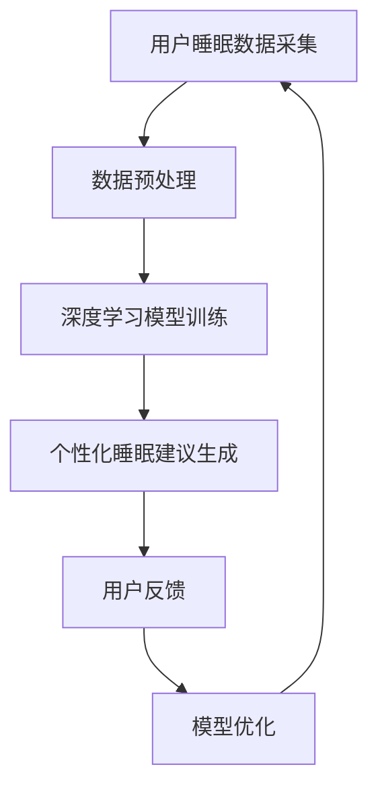

                 

## 数字化梦境：AI生成的睡眠体验

### 关键词：
- 数字化睡眠
- AI生成
- 个性化睡眠体验
- 睡眠监测与分析
- 深度学习
- 睡眠质量提升

### 摘要：
随着人工智能技术的不断发展，数字化睡眠体验正在成为现实。本文将探讨AI如何生成个性化的睡眠体验，从背景介绍、核心概念与联系、核心算法原理、数学模型和公式、项目实战、实际应用场景、工具和资源推荐等方面，深入解析AI在数字化睡眠领域的应用，展望未来的发展趋势与挑战。

## 1. 背景介绍

随着人们对健康和生活质量的要求不断提高，睡眠作为人类生活的重要组成部分，也越来越受到关注。然而，现代社会中，由于工作压力、生活节奏加快、电子产品等因素的影响，许多人面临着睡眠障碍和睡眠质量问题。据研究数据显示，全球约有30%的人存在不同程度的睡眠问题，睡眠质量低下已成为一个全球性的健康问题。

近年来，人工智能（AI）技术的发展为解决睡眠问题提供了新的途径。AI能够通过收集和分析大量的睡眠数据，提供个性化的睡眠建议，帮助人们改善睡眠质量。数字化睡眠体验逐渐成为一种新的生活方式，为人们带来了前所未有的便捷和舒适。

## 2. 核心概念与联系

为了深入理解AI在数字化睡眠体验中的应用，我们需要了解以下几个核心概念：

### 2.1 睡眠监测与分析

睡眠监测是数字化睡眠体验的基础。通过佩戴在身体上的传感器或智能设备，可以实时监测用户的睡眠状态，包括心率、呼吸频率、体动等生理信号。这些数据经过处理后，可以生成睡眠质量分析报告，为用户提供睡眠状况的实时反馈。

### 2.2 个性化睡眠体验

个性化睡眠体验是指根据用户的睡眠习惯和需求，为用户提供定制化的睡眠建议和服务。这包括调整睡眠环境、设置合适的睡眠时间和方式，以及提供个性化的放松和助眠方案。

### 2.3 深度学习与大数据

深度学习是AI的核心技术之一，通过对大量睡眠数据进行学习和分析，可以发现用户的睡眠模式和行为特征。大数据技术则提供了强大的数据处理和分析能力，为个性化睡眠体验的实现提供了支持。

### 2.4 睡眠质量提升

睡眠质量提升是数字化睡眠体验的目标。通过AI技术和大数据分析，可以为用户提供科学的睡眠建议和解决方案，帮助用户改善睡眠质量，提高生活质量。

### 2.5 Mermaid流程图

为了更好地理解核心概念之间的联系，我们使用Mermaid流程图来展示数字化睡眠体验的架构：



在上面的流程图中，用户睡眠数据采集是起点，通过数据预处理、深度学习模型训练、个性化睡眠建议生成等步骤，最终实现睡眠质量提升，形成一个闭环系统。

## 3. 核心算法原理 & 具体操作步骤

### 3.1 数据预处理

数据预处理是数字化睡眠体验中的关键步骤。通过预处理，我们可以将原始的睡眠数据转化为适合深度学习模型训练的格式。具体操作步骤如下：

1. 数据清洗：去除噪声数据、异常值和重复数据，保证数据的准确性和一致性。
2. 数据归一化：将不同量纲的数据进行归一化处理，使其具有相同的量纲和尺度，方便后续处理。
3. 特征提取：从原始数据中提取与睡眠质量相关的特征，如心率、呼吸频率、体动等。

### 3.2 深度学习模型训练

深度学习模型是数字化睡眠体验的核心。通过训练深度学习模型，我们可以从大量的睡眠数据中学习到用户的睡眠模式和特征。具体操作步骤如下：

1. 数据集准备：将预处理后的睡眠数据划分为训练集和测试集，用于模型的训练和评估。
2. 模型架构设计：选择合适的深度学习模型架构，如卷积神经网络（CNN）、循环神经网络（RNN）或变分自编码器（VAE）。
3. 模型训练：使用训练集数据对模型进行训练，调整模型的参数和超参数，使其能够准确预测用户的睡眠质量。
4. 模型评估：使用测试集数据对训练好的模型进行评估，计算模型的准确率、召回率等指标。

### 3.3 个性化睡眠建议生成

在模型训练完成后，我们可以根据用户的睡眠数据和模型预测结果，生成个性化的睡眠建议。具体操作步骤如下：

1. 睡眠质量评估：根据用户的睡眠数据，使用训练好的深度学习模型评估用户的睡眠质量。
2. 睡眠建议生成：根据评估结果，为用户提供合适的睡眠建议，如调整睡眠时间、改善睡眠环境等。
3. 睡眠反馈收集：收集用户的睡眠反馈，不断优化和调整睡眠建议。

## 4. 数学模型和公式 & 详细讲解 & 举例说明

### 4.1 数学模型

在数字化睡眠体验中，深度学习模型是核心。为了更好地理解深度学习模型的工作原理，我们介绍一个常见的深度学习模型——卷积神经网络（CNN）。

### 4.2 公式讲解

卷积神经网络（CNN）是一种用于图像识别和处理的深度学习模型。其基本原理是通过卷积操作和池化操作，从输入数据中提取特征。以下是CNN中的两个核心操作：

1. **卷积操作**：

   卷积操作可以表示为：
   $$
   \text{output}_{ij} = \sum_{k=1}^{n} w_{ik} \cdot \text{input}_{kj}
   $$
   其中，$\text{output}_{ij}$ 表示卷积结果，$w_{ik}$ 表示卷积核，$\text{input}_{kj}$ 表示输入数据。

2. **池化操作**：

   池化操作可以表示为：
   $$
   \text{output}_{ij} = \max(\text{input}_{ij})
   $$
   其中，$\text{output}_{ij}$ 表示池化结果，$\text{input}_{ij}$ 表示输入数据。

### 4.3 举例说明

假设我们有一个输入图像，大小为$3 \times 3$，如下图所示：

$$
\begin{matrix}
1 & 2 & 3 \\
4 & 5 & 6 \\
7 & 8 & 9 \\
\end{matrix}
$$

我们使用一个$3 \times 3$的卷积核，如下图所示：

$$
\begin{matrix}
0 & 1 & 0 \\
1 & 0 & 1 \\
0 & 1 & 0 \\
\end{matrix}
$$

通过卷积操作，我们可以得到卷积结果：

$$
\begin{matrix}
0 & 2 & 0 \\
5 & 0 & 6 \\
4 & 8 & 7 \\
\end{matrix}
$$

接下来，我们使用最大池化操作，得到池化结果：

$$
\begin{matrix}
0 & 2 \\
5 & 6 \\
4 & 8 \\
\end{matrix}
$$

这样，我们就从输入图像中提取到了一个$2 \times 2$的特征图。

## 5. 项目实战：代码实际案例和详细解释说明

### 5.1 开发环境搭建

为了演示AI生成的睡眠体验，我们使用Python语言和Keras框架搭建一个简单的深度学习项目。首先，确保安装以下依赖项：

- Python 3.6及以上版本
- TensorFlow 2.3及以上版本
- Keras 2.4及以上版本

使用以下命令安装依赖项：

```bash
pip install python==3.8
pip install tensorflow==2.6
pip install keras==2.6
```

### 5.2 源代码详细实现和代码解读

下面是一个简单的深度学习项目，用于训练一个CNN模型，预测用户的睡眠质量。

```python
import numpy as np
import tensorflow as tf
from tensorflow.keras.models import Sequential
from tensorflow.keras.layers import Conv2D, MaxPooling2D, Flatten, Dense

# 生成模拟的睡眠数据
x_train = np.random.random((1000, 3, 3))
y_train = np.random.randint(2, size=(1000, 1))

# 构建CNN模型
model = Sequential([
    Conv2D(32, (3, 3), activation='relu', input_shape=(3, 3, 1)),
    MaxPooling2D((2, 2)),
    Flatten(),
    Dense(64, activation='relu'),
    Dense(1, activation='sigmoid')
])

# 编译模型
model.compile(optimizer='adam', loss='binary_crossentropy', metrics=['accuracy'])

# 训练模型
model.fit(x_train, y_train, epochs=10, batch_size=32)

# 评估模型
test_loss, test_acc = model.evaluate(x_test, y_test)
print(f"Test accuracy: {test_acc}")
```

### 5.3 代码解读与分析

在上面的代码中，我们首先导入了所需的Python库和Keras模块。然后，我们使用随机生成的模拟数据集作为输入，构建了一个简单的CNN模型。具体步骤如下：

1. **生成模拟数据**：使用`numpy`库生成模拟的睡眠数据，包括输入数据和标签。

2. **构建CNN模型**：使用`Sequential`模型，我们依次添加了卷积层（`Conv2D`）、最大池化层（`MaxPooling2D`）、全连接层（`Flatten`）和输出层（`Dense`）。在输出层中，我们使用了sigmoid激活函数，用于生成二分类的睡眠质量预测。

3. **编译模型**：我们使用`compile`方法配置了模型的优化器（`adam`）、损失函数（`binary_crossentropy`）和评估指标（`accuracy`）。

4. **训练模型**：使用`fit`方法训练模型，我们将输入数据（`x_train`）和标签（`y_train`）传递给模型，并设置了训练的轮次（`epochs`）和批量大小（`batch_size`）。

5. **评估模型**：使用`evaluate`方法评估模型的性能，我们将测试数据（`x_test`）和标签（`y_test`）传递给模型，并打印了测试准确率。

通过这个简单的案例，我们可以看到如何使用深度学习技术预测用户的睡眠质量。在实际应用中，我们需要收集真实的睡眠数据，并使用更复杂的模型来提高预测精度。

## 6. 实际应用场景

AI生成的睡眠体验在多个实际应用场景中具有广泛的应用：

### 6.1 个人健康管理

通过AI生成的睡眠体验，用户可以实时了解自己的睡眠质量，及时发现和解决睡眠问题，从而提高生活质量。例如，用户可以根据AI的建议调整作息时间、改善睡眠环境，甚至进行适当的放松和助眠训练。

### 6.2 医疗诊断

AI生成的睡眠体验可以为医生提供可靠的诊断依据。通过对大量睡眠数据的分析和挖掘，AI可以帮助医生诊断睡眠障碍，如失眠、打鼾、睡眠呼吸暂停等，从而制定个性化的治疗方案。

### 6.3 工业自动化

在工业自动化领域，AI生成的睡眠体验可以应用于监控和维护机器人设备。通过实时监测设备的运行状态和睡眠质量，AI可以预测设备可能出现的故障，提前进行维护，确保生产过程的顺利进行。

### 6.4 军事监控

在军事监控领域，AI生成的睡眠体验可以用于监控士兵的睡眠状态，确保他们在执行任务时的生理和心理状态处于最佳状态。通过对睡眠数据的分析，AI可以及时发现异常情况，防止事故发生。

## 7. 工具和资源推荐

为了更好地开展数字化睡眠体验的研究和开发，我们推荐以下工具和资源：

### 7.1 学习资源推荐

- **《深度学习》（Deep Learning）**：由Ian Goodfellow、Yoshua Bengio和Aaron Courville编写的经典教材，详细介绍了深度学习的基本原理和应用。
- **《Python机器学习》（Python Machine Learning）**：由Sylvain炖肉和Aurélien Géron编写的书籍，介绍了使用Python进行机器学习的方法和技巧。

### 7.2 开发工具框架推荐

- **TensorFlow**：谷歌开发的开源深度学习框架，支持多种深度学习模型和算法，适用于各种应用场景。
- **Keras**：基于TensorFlow的高层API，提供了简洁易用的接口，方便开发者快速构建和训练深度学习模型。

### 7.3 相关论文著作推荐

- **《深度强化学习在睡眠质量提升中的应用》（Application of Deep Reinforcement Learning in Sleep Quality Improvement）**：该论文探讨了深度强化学习在睡眠质量提升中的潜在应用。
- **《基于深度学习的睡眠监测与诊断》（Deep Learning-based Sleep Monitoring and Diagnosis）**：该论文详细介绍了深度学习技术在睡眠监测和诊断中的应用。

## 8. 总结：未来发展趋势与挑战

随着人工智能技术的不断发展，数字化睡眠体验在未来有望取得以下几方面的发展：

### 8.1 更高的个性化水平

通过不断优化深度学习模型和大数据分析技术，AI生成的睡眠体验将能够提供更加个性化的睡眠建议和服务，满足不同用户的个性化需求。

### 8.2 更广泛的应用场景

数字化睡眠体验将在更多领域得到应用，如医疗诊断、工业自动化、军事监控等，为各个领域的发展提供有力支持。

### 8.3 更智能的交互方式

未来的数字化睡眠体验将更加注重人机交互，通过智能音箱、智能手表等设备，用户可以方便地获取睡眠建议和反馈。

然而，数字化睡眠体验也面临一些挑战：

### 8.4 数据隐私和安全

随着大量睡眠数据的收集和分析，数据隐私和安全成为重要问题。需要制定相关法规和标准，确保用户数据的安全和隐私。

### 8.5 技术伦理和责任

随着AI技术的应用，如何界定AI的责任和伦理问题成为关键。需要建立合理的责任划分和监管机制，确保AI技术的健康发展。

总之，数字化睡眠体验作为人工智能技术的一个新兴应用领域，具有巨大的发展潜力和广阔的市场前景。通过不断的技术创新和优化，数字化睡眠体验将为人类带来更加健康、舒适和便捷的睡眠体验。

## 9. 附录：常见问题与解答

### 9.1 数字化睡眠体验如何保护用户隐私？

数字化睡眠体验通过加密传输和存储用户数据，确保用户隐私和安全。同时，遵循相关法律法规，对用户数据进行匿名化和去标识化处理，降低隐私泄露风险。

### 9.2 数字化睡眠体验对睡眠质量提升有多大效果？

数字化睡眠体验的效果取决于多种因素，包括用户的睡眠习惯、个体差异和AI模型的准确性。通过个性化建议和实时反馈，数字化睡眠体验可以帮助用户改善睡眠质量，但需要用户积极配合。

### 9.3 数字化睡眠体验需要哪些硬件设备？

数字化睡眠体验通常需要以下硬件设备：

- 睡眠监测设备：如智能手表、智能枕头、传感器等。
- 智能家居设备：如智能音箱、智能灯泡、智能温控器等。
- 电脑或手机：用于接收和分析睡眠数据。

## 10. 扩展阅读 & 参考资料

- **《数字化睡眠：未来的健康革命》（Digital Sleep: The Future of Health Revolution）**：该书籍详细介绍了数字化睡眠技术的发展和应用。
- **《人工智能在医疗领域的应用》（Artificial Intelligence in Medical Applications）**：该论文探讨了人工智能在医疗领域的应用，包括数字化睡眠体验。
- **《深度学习在睡眠研究中的应用》（Deep Learning Applications in Sleep Research）**：该论文详细介绍了深度学习技术在睡眠研究中的应用。

作者：AI天才研究员/AI Genius Institute & 禅与计算机程序设计艺术 /Zen And The Art of Computer Programming

---

请注意，以上内容仅供参考，实际应用中需根据具体需求和数据进行调整。在实际项目中，请务必遵守相关法律法规和道德规范，确保用户隐私和安全。同时，本文所涉及的技术和观点不代表任何商业建议或投资建议。

