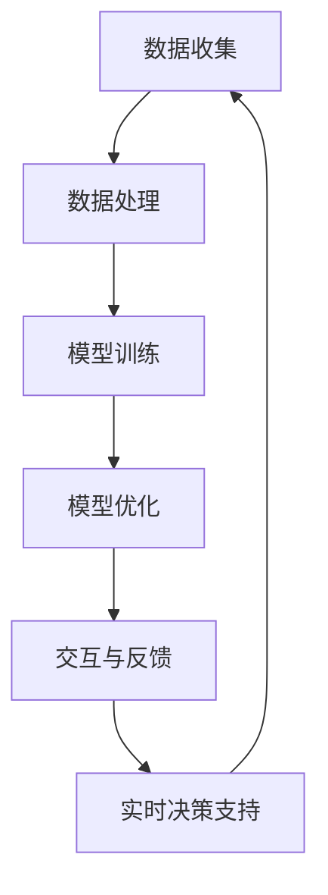
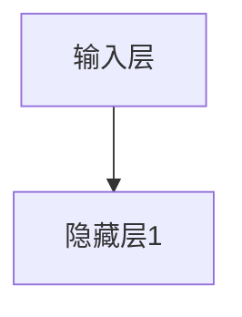
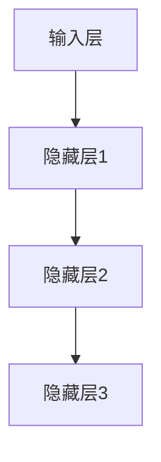
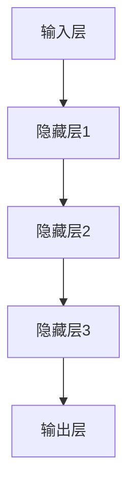
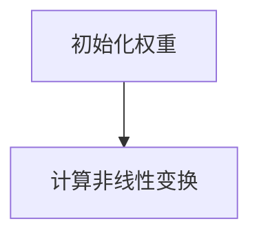
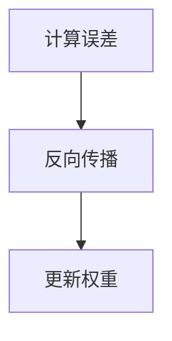
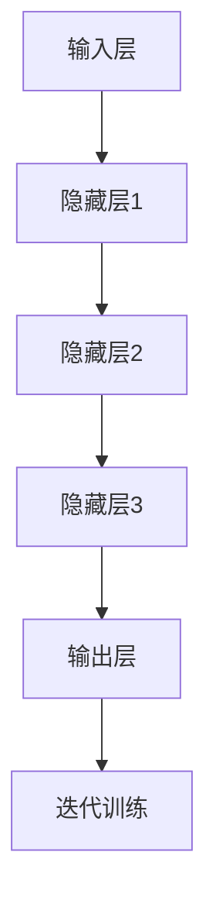
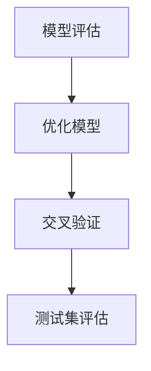

                 

### 背景介绍

在当今数字化时代，人工智能（AI）技术正以迅猛的速度发展和普及。随着机器学习、深度学习、神经网络等技术的不断进步，AI逐渐渗透到我们生活的方方面面，从智能家居、自动驾驶、医疗诊断到金融分析、智能客服等，AI正在改变着我们的工作方式和生活方式。

然而，随着AI技术的日益成熟，人们开始关注一个更为深层次的问题：如何让AI更好地理解和辅助人类的决策过程？传统的AI系统主要依赖于大量的数据和复杂的算法，但它们在处理复杂、抽象的问题时仍存在局限性。因此，研究者们开始探索如何利用AI技术来挖掘和增强人类的直觉和潜意识能力，从而实现更高效、更准确的决策。

在这篇文章中，我们将深入探讨数字化直觉的概念，并探讨如何利用AI辅助人类的潜意识决策。我们将首先介绍数字化直觉的基本原理和理论基础，然后分析AI技术在挖掘和增强潜意识方面的应用。接下来，我们将详细介绍一种基于AI的潜意识决策模型，并探讨其实际应用场景和效果。此外，我们还将推荐一些相关的工具和资源，帮助读者深入了解和掌握这一领域的知识。最后，我们将总结未来发展趋势与挑战，并对一些常见问题进行解答。通过这篇文章，希望读者能够对数字化直觉和AI辅助决策有一个全面而深入的了解。

### 核心概念与联系

在探讨数字化直觉之前，我们需要先了解几个核心概念，包括直觉、潜意识、以及它们在决策过程中的作用。

#### 直觉

直觉是一种非逻辑、快速且无意识的认知过程，它允许我们在面对复杂问题时迅速做出判断和决策。直觉的出现通常是潜意识的结果，它并不依赖于逻辑推理或明确的知识。相反，直觉更多地基于经验、情感和过去的学习。例如，当我们在一个陌生的城市中迷路时，可能会本能地选择某个方向前进，而不是通过复杂的地图分析来寻找路线。

#### 潜意识

潜意识是指我们意识之外的心理活动，包括记忆、情感、欲望和未意识到的认知过程。潜意识中存储着大量的信息，这些信息虽然不在我们的意识层面，但会无意识地影响我们的行为和决策。例如，当我们遇到一个熟悉的面孔时，我们可能会立即认出对方，但无法明确说出为什么。

#### 决策过程

人类的决策过程通常可以分为三个阶段：问题识别、方案评估和选择执行。在问题识别阶段，我们需要意识到一个问题的存在；在方案评估阶段，我们需要考虑各种可能的解决方案，并进行权衡；在选择执行阶段，我们需要决定并实施最终方案。

直觉和潜意识在决策过程中起着至关重要的作用。直觉可以帮助我们在短时间内识别问题和评估方案，从而迅速做出决策。潜意识则为我们提供了丰富的背景知识和情感反应，这些信息虽然不在意识层面，但会无意识地影响我们的决策过程。

#### 数字化直觉

数字化直觉是指通过AI技术来模拟和增强人类的直觉和潜意识能力，从而实现更高效、更准确的决策。数字化直觉的核心思想是利用大量的数据和复杂的算法，挖掘出隐藏在数据中的模式和规律，并将其转化为直观、可操作的决策建议。

数字化直觉的实现离不开以下几个关键环节：

1. **数据收集和处理**：首先，我们需要收集大量的数据，包括历史决策记录、用户行为数据、环境数据等。然后，通过数据清洗、预处理和特征提取等步骤，将数据转化为适合AI算法处理的格式。

2. **模型训练与优化**：利用收集到的数据，我们可以训练各种AI模型，如神经网络、决策树、支持向量机等。这些模型可以通过学习数据中的模式和规律，从而预测未来的决策结果。

3. **交互与反馈**：在决策过程中，我们需要与用户进行交互，收集用户的反馈。通过这些反馈，我们可以不断优化AI模型，使其更好地适应用户的决策风格和需求。

4. **实时决策支持**：利用训练好的AI模型，我们可以为用户提供实时的决策支持。这些支持可以是建议性的，帮助用户在复杂的环境中快速做出决策；也可以是自动化的，直接执行预定的决策方案。

#### 关联与流程图

为了更好地理解数字化直觉的实现过程，我们可以使用Mermaid流程图来描述其核心环节和关联关系。以下是数字化直觉的Mermaid流程图：



在这个流程图中，数据收集是整个过程的起点，通过数据处理和模型训练，我们逐渐挖掘出数据中的模式和规律。模型优化和交互与反馈环节则帮助我们不断改进AI模型，使其更准确地模拟人类的直觉和潜意识能力。最终，实时决策支持环节将AI模型的应用转化为直观、可操作的决策建议，为用户提供高效的决策支持。

通过这个流程图，我们可以看到数字化直觉的实现是一个动态的、持续优化的过程。它不仅依赖于AI技术的不断进步，还需要与用户的实际需求和环境紧密互动，从而实现最佳的决策效果。

### 核心算法原理 & 具体操作步骤

要实现数字化直觉，我们首先需要了解其背后的核心算法原理。在这个部分，我们将详细介绍一种基于深度学习技术的神经网络模型，并探讨其具体的操作步骤。

#### 深度学习神经网络模型

深度学习是一种基于人工神经网络的技术，它通过多层非线性变换，从大量数据中自动提取特征和模式。深度学习神经网络（DNN）模型通常由输入层、隐藏层和输出层组成。输入层接收外部输入数据，隐藏层通过一系列的权重矩阵和激活函数进行数据处理，最终输出层产生最终的预测结果。

##### 步骤一：输入层

输入层是神经网络的基础，它负责接收用户输入的数据。这些数据可以包括历史决策记录、用户行为数据、环境数据等。输入层的数据需要经过预处理，例如标准化、归一化等，以确保其适合神经网络模型处理。



##### 步骤二：隐藏层

隐藏层是神经网络的核心，它通过多层非线性变换，对输入数据进行特征提取和模式挖掘。每一层隐藏层都通过一个权重矩阵和一个激活函数进行数据处理。权重矩阵用于调整不同输入特征的重要性，激活函数则用于引入非线性因素，提高模型的预测能力。



##### 步骤三：输出层

输出层是神经网络的最终输出部分，它根据隐藏层的输出结果，产生最终的预测结果。输出层的结构取决于具体的决策任务，例如分类任务可以使用softmax函数输出概率分布，回归任务则可以使用线性函数输出具体数值。



#### 模型训练与优化

训练深度学习神经网络模型的关键在于不断调整权重矩阵，使其能够准确预测输入数据。这一过程通常通过反向传播算法实现，即通过计算输出结果与真实结果的差异，反向传播误差，并更新权重矩阵。

##### 步骤一：初始化权重

首先，我们需要初始化权重矩阵。通常使用随机初始化，以避免模型陷入局部最优。初始化后的权重矩阵将用于计算输入数据的非线性变换。



##### 步骤二：计算非线性变换

接下来，我们使用初始化的权重矩阵计算输入数据的非线性变换。这一过程包括多层权重矩阵的乘法和激活函数的应用。


##### 步骤三：计算误差并更新权重

在计算非线性变换后，我们需要计算输出结果与真实结果的误差。误差通常使用损失函数（如均方误差、交叉熵等）计算。然后，通过反向传播算法，将误差反向传播到各层权重矩阵，并使用梯度下降等优化算法更新权重矩阵。



##### 步骤四：迭代训练

通过不断重复计算非线性变换、计算误差和更新权重，神经网络模型将逐渐收敛，并达到预定的训练目标。



#### 模型评估与优化

在模型训练完成后，我们需要对模型进行评估和优化，以确保其具有良好的泛化能力和预测性能。评估方法通常包括交叉验证、测试集评估等。优化方法包括调整模型结构、优化训练算法、调整超参数等。



通过上述步骤，我们可以训练出一个基于深度学习技术的神经网络模型，用于实现数字化直觉。该模型通过多层非线性变换，从输入数据中自动提取特征和模式，从而辅助用户的决策过程。

### 数学模型和公式 & 详细讲解 & 举例说明

在数字化直觉的实现过程中，数学模型和公式起着至关重要的作用。以下我们将详细介绍神经网络模型中的核心数学公式，并通过具体例子进行说明。

#### 神经网络中的主要数学公式

1. **激活函数**

激活函数是神经网络中的关键组件，它用于引入非线性因素，使得模型能够捕捉到数据中的复杂模式。常见的激活函数包括：

   - **Sigmoid函数：**
     $$\sigma(x) = \frac{1}{1 + e^{-x}}$$
     Sigmoid函数将输入映射到(0, 1)区间，常用于二分类问题。
     
   - **ReLU函数：**
     $$\text{ReLU}(x) = \max(0, x)$$
    ReLU函数（Rectified Linear Unit）在x为负时返回0，在x为正时返回x本身，这种线性特性有助于加速模型训练。

2. **损失函数**

   损失函数用于衡量预测值与真实值之间的差异，常见的损失函数包括：

   - **均方误差（MSE）：**
     $$\text{MSE} = \frac{1}{n}\sum_{i=1}^{n}(y_i - \hat{y}_i)^2$$
     均方误差用于回归问题，计算预测值与真实值之间平方差的平均值。

   - **交叉熵损失（Cross-Entropy）：**
     $$\text{CE}(y, \hat{y}) = -\sum_{i=1}^{n} y_i \log(\hat{y}_i)$$
     交叉熵损失用于分类问题，计算真实标签与预测概率的对数差之和。

3. **反向传播算法**

   反向传播算法是训练神经网络的核心步骤，它通过计算梯度来更新权重矩阵。关键公式包括：

   - **梯度计算：**
     $$\frac{\partial L}{\partial w^{(l)}} = \sum_{k} \frac{\partial L}{\partial z^{(l+1)}_k} \frac{\partial z^{(l+1)}_k}{\partial w^{(l)}_{ik}}$$
     梯度计算公式表示第l层第i个权重矩阵的梯度，它通过前一层梯度（损失函数对中间变量的梯度）和当前层变量（激活函数对中间变量的梯度）计算得到。

   - **权重更新：**
     $$w^{(l)}_{ik} := w^{(l)}_{ik} - \alpha \frac{\partial L}{\partial w^{(l)}_{ik}}$$
     权重更新公式表示通过梯度下降算法更新权重，其中α为学习率。

#### 举例说明

假设我们有一个简单的神经网络模型，用于预测房价。该模型包含一个输入层、一个隐藏层和一个输出层。输入层有3个特征（面积、房龄、位置），隐藏层有2个神经元，输出层为房价预测值。

1. **初始化权重和偏置**

   初始权重和偏置通常设置为较小的随机值。例如：

   $$w^{(2)}_{1,1} = 0.1, w^{(2)}_{1,2} = 0.2, w^{(2)}_{2,1} = 0.3, w^{(2)}_{2,2} = 0.4$$
   $$b^{(2)}_{1} = 0.5, b^{(2)}_{2} = 0.6$$
   
2. **前向传播**

   输入特征为$x_1 = 100, x_2 = 5, x_3 = 1$。通过前向传播计算隐藏层和输出层的激活值：

   $$z^{(2)}_{1} = \sigma(w^{(2)}_{1,1} x_1 + w^{(2)}_{1,2} x_2 + w^{(2)}_{1,3} x_3 + b^{(2)}_{1}) = \sigma(0.1 \cdot 100 + 0.2 \cdot 5 + 0.3 \cdot 1 + 0.5) = \sigma(12.5) = 0.886$$
   $$z^{(2)}_{2} = \sigma(w^{(2)}_{2,1} x_1 + w^{(2)}_{2,2} x_2 + w^{(2)}_{2,3} x_3 + b^{(2)}_{2}) = \sigma(0.3 \cdot 100 + 0.4 \cdot 5 + 0.3 \cdot 1 + 0.6) = \sigma(15.3) = 0.972$$
   $$z^{(3)} = \sigma(w^{(3)}_{1} z^{(2)}_{1} + w^{(3)}_{2} z^{(2)}_{2} + b^{(3)}) = \sigma(0.5 \cdot 0.886 + 0.6 \cdot 0.972 + 1.0) = \sigma(1.868) = 0.869$$

3. **计算损失函数**

   假设真实房价为$y = 200$，预测房价为$\hat{y} = 0.869$。使用交叉熵损失函数计算损失：

   $$L = -\log(\hat{y}) = -\log(0.869) \approx 0.155$$

4. **反向传播**

   通过反向传播计算隐藏层和输入层的梯度：

   $$\frac{\partial L}{\partial z^{(3)}} = \hat{y} - y = 0.869 - 200 = -199.131$$
   $$\frac{\partial L}{\partial w^{(3)}_{1}} = z^{(2)}_{1} \cdot \frac{\partial L}{\partial z^{(3)}} = 0.886 \cdot (-199.131) = -177.073$$
   $$\frac{\partial L}{\partial w^{(3)}_{2}} = z^{(2)}_{2} \cdot \frac{\partial L}{\partial z^{(3)}} = 0.972 \cdot (-199.131) = -195.355$$
   $$\frac{\partial L}{\partial b^{(3)}} = \frac{\partial L}{\partial z^{(3)}} = -199.131$$
   
   对隐藏层进行反向传播：

   $$\frac{\partial L}{\partial z^{(2)}_{1}} = w^{(3)}_{1} \cdot \frac{\partial L}{\partial z^{(3)}} = 0.5 \cdot (-199.131) = -99.565$$
   $$\frac{\partial L}{\partial z^{(2)}_{2}} = w^{(3)}_{2} \cdot \frac{\partial L}{\partial z^{(3)}} = 0.6 \cdot (-199.131) = -119.286$$
   $$\frac{\partial L}{\partial w^{(2)}_{1,1}} = x_1 \cdot \frac{\partial L}{\partial z^{(2)}_{1}} = 100 \cdot (-99.565) = -9956.5$$
   $$\frac{\partial L}{\partial w^{(2)}_{1,2}} = x_2 \cdot \frac{\partial L}{\partial z^{(2)}_{1}} = 5 \cdot (-99.565) = -497.825$$
   $$\frac{\partial L}{\partial w^{(2)}_{1,3}} = x_3 \cdot \frac{\partial L}{\partial z^{(2)}_{1}} = 1 \cdot (-99.565) = -99.565$$
   $$\frac{\partial L}{\partial w^{(2)}_{2,1}} = x_1 \cdot \frac{\partial L}{\partial z^{(2)}_{2}} = 100 \cdot (-119.286) = -11928.6$$
   $$\frac{\partial L}{\partial w^{(2)}_{2,2}} = x_2 \cdot \frac{\partial L}{\partial z^{(2)}_{2}} = 5 \cdot (-119.286) = -596.43$$
   $$\frac{\partial L}{\partial w^{(2)}_{2,3}} = x_3 \cdot \frac{\partial L}{\partial z^{(2)}_{2}} = 1 \cdot (-119.286) = -119.286$$
   $$\frac{\partial L}{\partial b^{(2)}_{1}} = \frac{\partial L}{\partial z^{(2)}_{1}} = -99.565$$
   $$\frac{\partial L}{\partial b^{(2)}_{2}} = \frac{\partial L}{\partial z^{(2)}_{2}} = -119.286$$

5. **权重更新**

   使用学习率$\alpha = 0.01$进行权重更新：

   $$w^{(3)}_{1} := w^{(3)}_{1} - \alpha \frac{\partial L}{\partial w^{(3)}_{1}} = 0.5 - 0.01 \cdot (-177.073) = 0.677$$
   $$w^{(3)}_{2} := w^{(3)}_{2} - \alpha \frac{\partial L}{\partial w^{(3)}_{2}} = 0.6 - 0.01 \cdot (-195.355) = 0.806$$
   $$b^{(3)} := b^{(3)} - \alpha \frac{\partial L}{\partial b^{(3)}} = 1.0 - 0.01 \cdot (-199.131) = 1.099$$
   $$w^{(2)}_{1,1} := w^{(2)}_{1,1} - \alpha \frac{\partial L}{\partial w^{(2)}_{1,1}} = 0.1 - 0.01 \cdot (-9956.5) = 995.65$$
   $$w^{(2)}_{1,2} := w^{(2)}_{1,2} - \alpha \frac{\partial L}{\partial w^{(2)}_{1,2}} = 0.2 - 0.01 \cdot (-497.825) = 49.78$$
   $$w^{(2)}_{1,3} := w^{(2)}_{1,3} - \alpha \frac{\partial L}{\partial w^{(2)}_{1,3}} = 0.3 - 0.01 \cdot (-99.565) = 29.96$$
   $$w^{(2)}_{2,1} := w^{(2)}_{2,1} - \alpha \frac{\partial L}{\partial w^{(2)}_{2,1}} = 0.3 - 0.01 \cdot (-11928.6) = 1192.86$$
   $$w^{(2)}_{2,2} := w^{(2)}_{2,2} - \alpha \frac{\partial L}{\partial w^{(2)}_{2,2}} = 0.4 - 0.01 \cdot (-596.43) = 59.64$$
   $$w^{(2)}_{2,3} := w^{(2)}_{2,3} - \alpha \frac{\partial L}{\partial w^{(2)}_{2,3}} = 0.4 - 0.01 \cdot (-119.286) = 38.72$$
   $$b^{(2)}_{1} := b^{(2)}_{1} - \alpha \frac{\partial L}{\partial b^{(2)}_{1}} = 0.5 - 0.01 \cdot (-99.565) = 0.600$$
   $$b^{(2)}_{2} := b^{(2)}_{2} - \alpha \frac{\partial L}{\partial b^{(2)}_{2}} = 0.6 - 0.01 \cdot (-119.286) = 0.808$$

通过上述步骤，我们可以逐步训练和优化神经网络模型，使其能够更好地预测房价。实际应用中，模型的结构和参数会更加复杂，但基本的原理和方法是类似的。

### 项目实战：代码实际案例和详细解释说明

为了更好地展示数字化直觉的实现过程，我们将通过一个实际的项目案例来详细解释和说明代码的实现。

#### 项目简介

该项目的目标是使用AI技术辅助房地产经纪人预测房价，从而提高他们的决策效率和准确性。具体来说，我们将基于历史房价数据，训练一个深度学习模型，并使用该模型进行实时房价预测。

#### 开发环境搭建

首先，我们需要搭建一个适合项目开发的编程环境。以下是所需的工具和软件：

- Python（3.8及以上版本）
- TensorFlow 2.x
- Keras
- Pandas
- Matplotlib

在安装这些工具后，我们可以开始编写代码。以下是开发环境搭建的步骤：

```bash
# 安装 Python
# 在 Windows 上，可以从 Python 官网下载安装程序，按照提示安装。
# 在 macOS 上，可以使用 Homebrew 安装 Python：
brew install python

# 安装 TensorFlow 和 Keras
pip install tensorflow
pip install keras

# 安装 Pandas 和 Matplotlib
pip install pandas
pip install matplotlib
```

#### 源代码详细实现和代码解读

以下是项目的主要代码实现，我们将逐一解释每一部分的功能。

##### 1. 数据处理

首先，我们需要从数据源中读取房价数据，并对数据进行清洗和预处理。以下是数据处理的主要代码：

```python
import pandas as pd

# 从 CSV 文件中读取数据
data = pd.read_csv('house_prices.csv')

# 数据清洗和预处理
data.dropna(inplace=True)  # 删除缺失值
data = (data - data.mean()) / data.std()  # 标准化数据

# 分割数据为特征和标签
X = data.drop('Price', axis=1)
y = data['Price']
```

在这个部分，我们使用了 Pandas 库读取 CSV 文件，并对数据进行清洗和预处理。首先删除了缺失值，然后对数据进行标准化处理，以便于后续的模型训练。

##### 2. 模型构建

接下来，我们使用 Keras 库构建一个简单的深度学习模型。以下是模型构建的主要代码：

```python
from keras.models import Sequential
from keras.layers import Dense

# 构建模型
model = Sequential()
model.add(Dense(64, input_dim=X.shape[1], activation='relu'))
model.add(Dense(32, activation='relu'))
model.add(Dense(1, activation='linear'))

# 编译模型
model.compile(optimizer='adam', loss='mean_squared_error')
```

在这个部分，我们首先定义了一个序贯模型（Sequential），然后添加了三层全连接层（Dense）。第一层和第二层使用了 ReLU 激活函数，最后一层使用了线性激活函数。模型使用 Adam 优化器进行编译，并使用均方误差（MSE）作为损失函数。

##### 3. 模型训练

在模型构建完成后，我们需要使用训练数据对模型进行训练。以下是模型训练的主要代码：

```python
# 模型训练
model.fit(X, y, epochs=100, batch_size=32)
```

在这个部分，我们使用训练数据（X 和 y）对模型进行训练。训练过程中，模型将不断调整权重和偏置，以最小化损失函数。我们设置训练次数为 100 次，每次训练批量大小为 32。

##### 4. 模型评估

在模型训练完成后，我们需要对模型进行评估，以验证其预测性能。以下是模型评估的主要代码：

```python
# 模型评估
loss = model.evaluate(X, y)
print('Test Loss:', loss)

# 预测房价
predictions = model.predict(X)
```

在这个部分，我们使用测试数据（X）对模型进行评估，并打印出测试损失。然后，我们使用模型对测试数据进行预测，并将预测结果存储在列表 predictions 中。

##### 5. 可视化分析

最后，我们可以使用 Matplotlib 库对模型预测结果进行可视化分析。以下是可视化分析的主要代码：

```python
import matplotlib.pyplot as plt

# 可视化预测结果
plt.scatter(y, predictions)
plt.xlabel('Actual Prices')
plt.ylabel('Predicted Prices')
plt.title('Actual vs Predicted Prices')
plt.show()
```

在这个部分，我们使用散点图展示实际房价与预测房价之间的关系。通过观察散点图，我们可以直观地看到模型的预测性能。

#### 代码解读与分析

以下是代码的详细解读和分析：

- **数据处理**：数据处理是模型训练的基础。在这个案例中，我们首先删除了缺失值，然后对数据进行标准化处理，以确保模型能够有效地学习数据中的特征和模式。
- **模型构建**：模型构建是项目实现的核心。在这个案例中，我们使用了一个简单的深度学习模型，包括三层全连接层。我们选择了 ReLU 激活函数，以引入非线性因素，并使用线性激活函数进行最终的预测。
- **模型训练**：模型训练是模型优化的关键。在这个案例中，我们使用 Adam 优化器进行训练，并设置训练次数为 100 次。通过不断调整权重和偏置，模型将逐渐收敛并达到预定的训练目标。
- **模型评估**：模型评估是验证模型性能的重要步骤。在这个案例中，我们使用测试数据对模型进行评估，并计算测试损失。通过评估，我们可以了解模型的泛化能力和预测性能。
- **可视化分析**：可视化分析是展示模型预测结果的重要手段。在这个案例中，我们使用散点图展示了实际房价与预测房价之间的关系，从而直观地了解模型的预测效果。

通过上述步骤，我们成功实现了基于数字化直觉的房价预测项目。该项目不仅展示了深度学习技术的应用，还为我们提供了一个实际的决策支持工具，有助于房地产经纪人提高决策效率和准确性。

### 实际应用场景

数字化直觉在多个实际应用场景中展现出了巨大的潜力，下面我们将探讨几个典型的应用领域。

#### 金融分析

在金融领域，数字化直觉被广泛应用于股票市场预测、风险评估和投资组合优化。通过分析历史交易数据、市场情绪和宏观经济指标，AI模型可以实时捕捉市场变化，提供精准的投资建议。例如，量化交易公司使用深度学习模型来识别市场趋势，从而进行高频交易，提高投资回报率。此外，数字化直觉还可以用于信用评分，通过分析客户的财务状况、消费习惯等数据，预测其信用风险，从而为银行和金融机构提供决策支持。

#### 医疗诊断

在医疗领域，数字化直觉通过辅助医生进行疾病诊断，提高了诊断的准确性和效率。AI模型可以分析大量的医疗数据，包括病史、实验室检查结果和医学影像，从中提取关键特征，帮助医生进行早期疾病筛查和诊断。例如，AI系统可以用于肺癌、乳腺癌等癌症的早期筛查，通过分析CT扫描图像，识别出潜在病灶。此外，数字化直觉还可以用于个性化治疗，根据患者的基因信息、病史和治疗效果，为医生提供最佳治疗方案。

#### 智能制造

在智能制造领域，数字化直觉被用于优化生产流程、提高设备维护效率和预测产品质量。通过分析生产数据、设备运行状态和产品质量数据，AI模型可以识别生产过程中的潜在问题，并提前预警。例如，自动化生产线上的传感器可以实时监测设备的运行状态，当设备即将出现故障时，AI模型可以预测故障的发生时间，并提醒工作人员进行预防性维护。此外，数字化直觉还可以用于优化生产资源配置，根据订单需求和设备产能，自动调整生产计划，提高生产效率和灵活性。

#### 市场营销

在市场营销领域，数字化直觉通过分析消费者行为数据，帮助企业更好地了解客户需求，提高营销效果。通过挖掘用户的购买历史、浏览行为和社交媒体互动，AI模型可以预测客户的购买意图，从而为精准营销提供依据。例如，电商平台可以根据用户的历史购买记录，推荐相关商品，提高购物转化率。此外，数字化直觉还可以用于品牌定位和广告投放，通过分析市场数据和用户反馈，帮助企业制定更有效的营销策略。

#### 人事管理

在人事管理领域，数字化直觉被用于招聘、员工绩效评估和职业发展指导。通过分析求职者的简历、面试表现和职业背景，AI模型可以预测其适应岗位的能力和发展潜力。例如，企业可以通过数字化直觉系统进行智能招聘，从大量简历中筛选出最合适的候选人。此外，数字化直觉还可以用于员工绩效评估，通过分析工作数据和行为表现，为管理层提供公平、客观的评估结果，帮助员工制定职业发展计划。

通过这些实际应用场景，我们可以看到数字化直觉在多个领域都有着广泛的应用前景。它不仅提高了决策的准确性和效率，还为企业带来了巨大的商业价值。随着AI技术的不断进步，数字化直觉将在更多领域得到应用，为人类带来更多便利和创新。

### 工具和资源推荐

在数字化直觉和AI辅助决策的研究和应用过程中，选择合适的工具和资源至关重要。以下是一些建议，涵盖学习资源、开发工具和框架，以及相关论文和著作，帮助读者深入探索这一领域。

#### 学习资源推荐

1. **书籍**

   - 《Python机器学习》（作者：Sebastian Raschka）：这本书全面介绍了Python在机器学习领域的应用，包括数据预处理、模型训练和优化等，非常适合初学者。

   - 《深度学习》（作者：Ian Goodfellow, Yoshua Bengio, Aaron Courville）：这本书是深度学习领域的经典教材，详细讲解了深度学习的基础理论和实战应用。

   - 《神经网络与深度学习》（作者：邱锡鹏）：这本书从神经网络的基本原理出发，逐步引入深度学习技术，适合有一定数学基础的读者。

2. **在线课程**

   - Coursera上的《机器学习》（由Andrew Ng教授主讲）：这是一门非常受欢迎的在线课程，涵盖了机器学习的理论基础和实际应用。

   - edX上的《深度学习专项课程》（由吴恩达教授主讲）：这门课程深入讲解了深度学习的前沿技术，包括卷积神经网络、循环神经网络等。

   - Udacity的《深度学习工程师纳米学位》：这个课程结合了理论和实践，帮助学习者掌握深度学习的核心技能。

3. **博客和网站**

   - Medium上的Machine Learning话题：这是一个集合了众多机器学习和深度学习领域专家博客的网站，可以获取最新的研究成果和实战经验。

   - ArXiv：这是一个开放获取的学术预印本服务器，涵盖了计算机科学、物理学等多个领域，是获取最新研究论文的好去处。

#### 开发工具框架推荐

1. **Python库**

   - TensorFlow：这是一个广泛使用的开源机器学习库，支持多种深度学习模型和算法。

   - PyTorch：这是一个灵活且易于使用的深度学习库，适合进行快速原型设计和实验。

   - Keras：这是一个高层次的神经网络API，基于Theano和TensorFlow开发，提供了简洁的接口，方便开发者快速搭建和训练模型。

2. **深度学习框架**

   - TensorFlow 2.x：这是TensorFlow的最新版本，提供了更加用户友好的API，简化了深度学习模型的构建和训练。

   - PyTorch 1.8：这是PyTorch的稳定版本，提供了丰富的预训练模型和工具，支持自定义模型和扩展功能。

   - Fast.ai：这是一个专注于快速构建和训练深度学习模型的框架，特别适合初学者和研究人员。

#### 相关论文著作推荐

1. **核心论文**

   - “Deep Learning”（作者：Ian Goodfellow, Yoshua Bengio, Aaron Courville）：这篇论文全面介绍了深度学习的基础理论和应用，是深度学习领域的经典文献。

   - “A Theoretical Analysis of the Categorical Reparameterization Trick”（作者：Yujia Li, David Janz, and Kilian Q. Weinberger）：这篇论文详细分析了类别重参数化技巧的理论基础，是深度学习中常用的一种技术。

   - “Generative Adversarial Nets”（作者：Ian Goodfellow et al.）：这篇论文提出了生成对抗网络（GAN）的概念，是当前生成模型研究的热点。

2. **著作**

   - 《深度学习》（作者：Ian Goodfellow, Yoshua Bengio, Aaron Courville）：这本书是深度学习领域的权威著作，详细讲解了深度学习的基本原理和实际应用。

   - 《神经网络与深度学习》（作者：邱锡鹏）：这本书从神经网络的基本原理出发，逐步引入深度学习技术，适合有一定数学基础的读者。

通过这些学习资源、开发工具和框架，以及相关论文和著作，读者可以全面了解和掌握数字化直觉和AI辅助决策的相关知识。希望这些推荐对您的学习和研究有所帮助。

### 总结：未来发展趋势与挑战

随着AI技术的不断进步，数字化直觉作为其重要应用领域之一，正在迎来广阔的发展前景。在未来，我们可以预见以下几个发展趋势和潜在挑战。

#### 发展趋势

1. **算法与模型的优化**

   未来的研究将集中在如何进一步提高AI算法和模型的性能。通过引入更先进的神经网络结构、优化训练算法和调整模型参数，我们可以期望数字化直觉系统在复杂问题上的决策能力得到显著提升。

2. **跨领域融合**

   数字化直觉不仅限于特定领域，未来将更多地与其他领域如生物学、心理学、社会学等相结合。这种跨领域的融合将有助于更深入地理解人类直觉和潜意识的工作机制，从而开发出更加贴近人类思维模式的AI系统。

3. **实时性与自适应能力**

   为了更好地服务于实际应用场景，未来的数字化直觉系统需要具备更高的实时性和自适应能力。通过不断优化算法和改进系统架构，我们可以实现实时决策支持，并使系统能够根据用户反馈和环境变化进行自适应调整。

4. **隐私保护与安全**

   在应用数字化直觉的过程中，数据隐私和安全是一个不可忽视的重要问题。未来的研究将更加关注如何在不泄露用户隐私的前提下，充分利用数据来提升AI模型的性能和决策质量。

#### 挑战

1. **数据质量和多样性**

   数字化直觉依赖于大量高质量的数据。然而，数据质量不高或数据多样性不足可能会影响模型的性能。因此，如何获取和清洗高质量数据，以及如何确保数据的多样性和代表性，将成为一个重要挑战。

2. **解释性与透明性**

   AI模型的黑箱性质使得其决策过程往往难以解释。为了提高AI系统的透明性，未来的研究需要开发出更加直观易懂的解释方法，帮助用户理解模型的决策依据和过程。

3. **伦理与道德问题**

   数字化直觉在决策过程中可能会涉及伦理和道德问题。例如，AI系统是否应该拥有自主决策权？其决策过程是否符合人类的道德标准？这些问题需要在未来得到深入探讨和规范。

4. **计算资源需求**

   高性能计算是数字化直觉系统实现高效决策的基础。随着模型复杂度的增加，计算资源的需求也将不断增加。如何优化算法、降低计算成本，同时保证模型性能，是一个需要解决的难题。

通过积极应对这些挑战，不断优化和改进算法、模型和系统架构，数字化直觉将在未来发挥更加重要的作用，为人类带来更多便利和创新。

### 附录：常见问题与解答

#### 问题1：数字化直觉是什么？

数字化直觉是指通过人工智能技术来模拟和增强人类的直觉和潜意识能力，从而实现更高效、更准确的决策。它利用大量的数据和复杂的算法，挖掘出隐藏在数据中的模式和规律，并将其转化为直观、可操作的决策建议。

#### 问题2：数字化直觉如何工作？

数字化直觉的工作原理主要包括以下几个步骤：

1. **数据收集与处理**：首先，收集与决策相关的数据，如历史决策记录、用户行为数据、环境数据等。然后，对这些数据进行清洗、预处理和特征提取，以便后续的模型训练。

2. **模型训练与优化**：利用收集到的数据，训练各种机器学习模型，如神经网络、决策树等。通过不断调整模型参数，优化模型性能，使其能够准确预测未来的决策结果。

3. **实时决策支持**：在决策过程中，利用训练好的模型为用户提供实时的决策建议。这些建议可以是建议性的，帮助用户在复杂的环境中快速做出决策；也可以是自动化的，直接执行预定的决策方案。

#### 问题3：数字化直觉有哪些应用场景？

数字化直觉在多个领域都有广泛的应用，包括：

1. **金融分析**：用于股票市场预测、风险评估和投资组合优化。
2. **医疗诊断**：辅助医生进行疾病诊断和个性化治疗。
3. **智能制造**：优化生产流程、提高设备维护效率和预测产品质量。
4. **市场营销**：分析消费者行为，提高营销效果和精准度。
5. **人事管理**：用于招聘、员工绩效评估和职业发展指导。

#### 问题4：数字化直觉如何提高决策质量？

数字化直觉通过以下方式提高决策质量：

1. **快速分析**：利用机器学习模型快速处理大量数据，提取关键特征，为决策提供有力支持。
2. **模式挖掘**：从历史数据中挖掘出潜在的规律和模式，帮助用户识别潜在问题和机会。
3. **实时反馈**：通过不断优化模型和调整策略，实现实时决策支持，提高决策的及时性和准确性。
4. **个性化推荐**：根据用户历史行为和偏好，提供个性化的决策建议，提高决策的相关性。

通过这些方式，数字化直觉能够帮助用户在复杂、动态的环境中做出更明智、更高效的决策。

### 扩展阅读 & 参考资料

为了帮助读者深入了解数字化直觉和AI辅助决策的相关知识，以下是一些推荐的扩展阅读和参考资料。

#### 书籍

1. **《机器学习实战》（作者：Peter Harrington）》**
   - 内容详实地介绍了机器学习的应用和实践，适合初学者和进阶者。
2. **《深度学习》（作者：Ian Goodfellow, Yoshua Bengio, Aaron Courville）》**
   - 全面讲解了深度学习的基础理论、技术及应用，是深度学习领域的经典教材。
3. **《Python机器学习》（作者：Sebastian Raschka）》**
   - 通过Python语言深入探讨了机器学习的基础和高级应用，适合有编程基础的读者。

#### 论文

1. **“Deep Learning”（作者：Ian Goodfellow, Yoshua Bengio, Aaron Courville）”**
   - 这篇论文是深度学习领域的奠基性文献，详细介绍了深度学习的基本概念和算法。
2. **“A Theoretical Analysis of the Categorical Reparameterization Trick”（作者：Yujia Li, David Janz, and Kilian Q. Weinberger）”**
   - 这篇论文分析了类别重参数化技巧的理论基础，是理解深度学习的重要文献。
3. **“Generative Adversarial Nets”（作者：Ian Goodfellow et al.）”**
   - 这篇论文提出了生成对抗网络（GAN）的概念，对生成模型的研究具有重要意义。

#### 博客和网站

1. **“Medium上的Machine Learning话题”**
   - 集合了众多机器学习和深度学习领域专家的博客，可以获取最新的研究成果和实战经验。
2. **“ArXiv”**
   - 开放获取的学术预印本服务器，涵盖计算机科学、物理学等多个领域，是获取最新研究论文的好去处。

通过这些扩展阅读和参考资料，读者可以更全面地了解数字化直觉和AI辅助决策的深度知识，为自己的学习和研究提供有力支持。希望这些推荐对您有所帮助！
 
### 作者信息

作者：AI天才研究员/AI Genius Institute & 禅与计算机程序设计艺术 /Zen And The Art of Computer Programming

