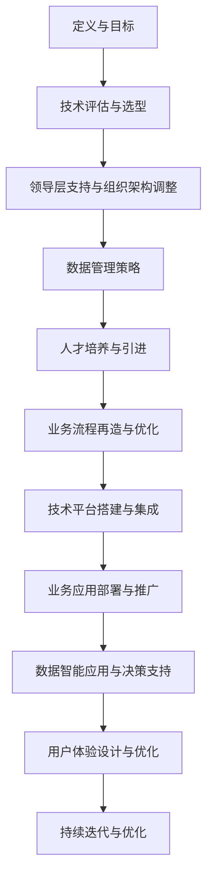

                 

# 背景介绍

在当今快速发展的商业环境中，数字化转型已经成为企业提升竞争力、实现可持续增长的关键战略。随着大数据、云计算、物联网、人工智能等新兴技术的不断涌现，越来越多的传统企业开始认识到数字化转型的重要性。然而，如何有效地实施数字化转型，如何将传统企业的业务模式与数字技术相结合，仍然是一个亟待解决的问题。

本文旨在探讨数字化转型管理，引导传统企业迈向数字时代。首先，我们将回顾数字化转型的定义及其重要性，接着分析传统企业面临的挑战和机遇。然后，我们将讨论数字化转型管理的基本原则和实践方法，并提供一些成功案例以供参考。最后，我们将总结数字化转型未来的发展趋势与挑战，并给出相应的策略建议。

通过本文的阅读，您将了解数字化转型管理的核心概念、实践步骤及其在实际应用中的效果，从而为您的企业制定出切实可行的数字化转型策略提供参考。让我们一步一步地深入探讨这一重要议题，迎接数字化时代的到来。<|user|>

## 2. 核心概念与联系

### 2.1 数字化转型的定义

数字化转型是指将传统业务模式与数字技术相结合，以实现业务流程的优化、组织结构的重塑和业务模式的创新。数字化转型不仅仅是引入新技术，更是对企业文化、组织架构、管理方式的全面革新。数字化转型的主要目标是提高企业的灵活性和响应速度，增强客户体验，实现业务增长和效率提升。

### 2.2 数字化转型的重要性

数字化转型在当今商业环境中具有重要性，主要体现在以下几个方面：

1. **提高竞争力**：通过数字化转型，企业可以快速响应市场变化，推出新产品和服务，提高市场竞争力。
2. **优化业务流程**：数字化技术可以自动化和优化业务流程，提高工作效率和准确性。
3. **增强客户体验**：数字化技术可以帮助企业更好地了解客户需求，提供个性化服务和体验。
4. **降低运营成本**：通过数字化技术，企业可以实现资源的高效配置和管理，降低运营成本。
5. **实现可持续发展**：数字化转型可以帮助企业实现环保和节能减排的目标，促进可持续发展。

### 2.3 数字化转型的关键要素

数字化转型的成功依赖于以下几个关键要素：

1. **领导层的支持**：企业领导层需要认识到数字化转型的价值，并提供必要的资源和政策支持。
2. **人才培养**：数字化转型需要具备数字技能的人才，企业应重视人才培养和引进。
3. **技术选型**：选择合适的技术和工具是数字化转型的基础，企业应进行全面的技术评估和选型。
4. **数据管理**：数据是数字化转型的核心资产，企业需要建立健全的数据管理体系。
5. **业务流程再造**：数字化转型的关键在于业务流程的优化和再造，以实现数字化技术的最大价值。

### 2.4 数字化转型与业务的联系

数字化转型与业务密切相关，主要体现在以下几个方面：

1. **业务模式创新**：数字化转型可以帮助企业探索新的业务模式，如共享经济、电子商务等。
2. **客户关系管理**：数字化转型可以提升客户关系管理的效率和效果，实现精准营销和客户体验优化。
3. **供应链管理**：数字化转型可以优化供应链管理，提高供应链的灵活性和响应速度。
4. **产品研发**：数字化转型可以加速产品研发，缩短产品上市周期。
5. **内部运营**：数字化转型可以提升内部运营效率，降低运营成本。

### 2.5 数字化转型的架构

数字化转型的架构主要包括以下几个层次：

1. **基础设施层**：包括云计算、大数据、物联网等基础设施，为数字化转型提供技术支持。
2. **技术平台层**：包括数据平台、应用平台、技术平台等，实现数字化技术的集成和应用。
3. **业务应用层**：包括各种业务应用系统，如ERP、CRM、供应链管理系统等，实现业务流程的数字化和自动化。
4. **数据智能层**：包括数据分析和挖掘技术，实现数据的深度应用和智能决策。
5. **用户体验层**：包括各种数字化的客户服务渠道和平台，提供个性化的用户体验。

### 2.6 数字化转型的 Mermaid 流程图



通过上述核心概念与联系的介绍，我们可以更清晰地理解数字化转型的内涵与外延，为后续的讨论和实践提供基础。<|user|>

## 3. 核心算法原理 & 具体操作步骤

### 3.1 核心算法原理

数字化转型管理中的核心算法原理主要涉及业务流程优化、数据分析和人工智能技术应用等方面。以下是一些关键算法和原理的介绍：

#### 3.1.1 业务流程优化算法

1. **流程挖掘（Process Mining）**：流程挖掘是一种通过分析企业现有业务流程数据，以发现实际业务流程与设计流程之间的差异的方法。核心算法包括事件流图（Event-Log Graph）、过程图（Process Graph）等。

2. **业务流程重组（Business Process Reengineering, BPR）**：业务流程重组是一种通过重新设计业务流程，以提高效率、降低成本和提升客户满意度的方法。核心算法包括活动排序、资源分配和瓶颈分析等。

#### 3.1.2 数据分析算法

1. **数据挖掘（Data Mining）**：数据挖掘是一种从大量数据中提取有价值信息的方法，核心算法包括关联规则挖掘、聚类分析和分类算法等。

2. **机器学习（Machine Learning）**：机器学习是一种通过数据驱动的方式实现自我学习和预测的方法，核心算法包括线性回归、决策树、支持向量机等。

#### 3.1.3 人工智能技术应用

1. **深度学习（Deep Learning）**：深度学习是一种通过多层神经网络模型实现自动特征提取和模式识别的方法，核心算法包括卷积神经网络（CNN）、循环神经网络（RNN）等。

2. **自然语言处理（Natural Language Processing, NLP）**：自然语言处理是一种使计算机能够理解、生成和处理自然语言的方法，核心算法包括词嵌入（Word Embedding）、序列标注（Sequence Labeling）等。

### 3.2 具体操作步骤

#### 3.2.1 业务流程优化步骤

1. **需求分析**：了解企业的业务流程现状，分析存在的问题和瓶颈。

2. **流程建模**：根据需求分析结果，使用流程挖掘工具或业务流程管理工具进行流程建模。

3. **流程优化**：基于流程模型，采用业务流程重组算法进行流程优化，消除瓶颈和冗余。

4. **实施与监控**：将优化后的流程部署到实际业务中，并进行持续监控和改进。

#### 3.2.2 数据分析步骤

1. **数据收集**：收集与企业业务相关的数据，如客户数据、交易数据、运营数据等。

2. **数据预处理**：对收集到的数据进行分析、清洗和格式化，确保数据质量。

3. **数据分析**：使用数据挖掘和机器学习算法进行数据分析，提取有价值的信息和模式。

4. **结果可视化**：将数据分析结果以图表、报表等形式进行可视化展示，便于决策者理解。

#### 3.2.3 人工智能技术应用步骤

1. **需求分析**：确定企业需要解决的问题或提升的领域，如客户服务、营销推广、生产管理等。

2. **数据准备**：收集与问题相关的数据，包括历史数据和实时数据。

3. **模型设计**：根据需求和分析结果，选择合适的人工智能算法进行模型设计。

4. **模型训练与评估**：使用收集到的数据对模型进行训练，并通过评估指标（如准确率、召回率等）对模型进行评估和优化。

5. **模型部署与监控**：将训练好的模型部署到实际业务中，并进行实时监控和迭代优化。

通过上述核心算法原理和具体操作步骤的介绍，我们可以更好地理解数字化转型管理中的技术实现方法和实践路径。<|user|>

## 4. 数学模型和公式 & 详细讲解 & 举例说明

### 4.1 数学模型和公式的介绍

在数字化转型管理中，数学模型和公式起着至关重要的作用。以下是一些常见的数学模型和公式的介绍：

#### 4.1.1 业务流程优化中的数学模型

1. **流程时间模型**：流程时间模型用于计算业务流程中各个环节的耗时，主要包括平均流程时间、标准差、变异系数等。

   $$T_{\text{avg}} = \frac{\sum_{i=1}^{n} T_i}{n}$$

   其中，$T_{\text{avg}}$ 表示平均流程时间，$T_i$ 表示第 $i$ 个环节的耗时，$n$ 表示环节数量。

2. **流程效率模型**：流程效率模型用于评估业务流程的运行效率，主要包括流程效率指数、流程损失率等。

   $$E = \frac{T_{\text{actual}}}{T_{\text{plan}}} \times 100\%$$

   其中，$E$ 表示流程效率指数，$T_{\text{actual}}$ 表示实际流程时间，$T_{\text{plan}}$ 表示计划流程时间。

#### 4.1.2 数据分析中的数学模型

1. **线性回归模型**：线性回归模型用于分析自变量和因变量之间的关系，主要包括一元线性回归和多元线性回归。

   $$Y = \beta_0 + \beta_1 X_1 + \beta_2 X_2 + ... + \beta_n X_n$$

   其中，$Y$ 表示因变量，$X_1, X_2, ..., X_n$ 表示自变量，$\beta_0, \beta_1, \beta_2, ..., \beta_n$ 表示回归系数。

2. **决策树模型**：决策树模型用于分类和回归问题，通过一系列决策节点和叶子节点来表示决策过程。

   $$f(X) = \sum_{i=1}^{n} \alpha_i I(X \in R_i)$$

   其中，$f(X)$ 表示决策树模型，$X$ 表示输入特征，$R_1, R_2, ..., R_n$ 表示决策树的叶子节点区域，$\alpha_1, \alpha_2, ..., \alpha_n$ 表示叶子节点的概率分布。

#### 4.1.3 人工智能应用中的数学模型

1. **卷积神经网络（CNN）**：卷积神经网络是一种用于图像识别和处理的深度学习模型，主要包括卷积层、池化层和全连接层。

   $$f(x) = \sigma(\sum_{i=1}^{n} w_i \star x_i + b)$$

   其中，$f(x)$ 表示卷积神经网络，$x$ 表示输入特征，$w_i$ 表示卷积核，$\star$ 表示卷积操作，$\sigma$ 表示激活函数，$b$ 表示偏置。

2. **循环神经网络（RNN）**：循环神经网络是一种用于序列数据处理的深度学习模型，主要包括输入层、隐藏层和输出层。

   $$h_t = \sigma(W_h h_{t-1} + W_x x_t + b)$$

   其中，$h_t$ 表示隐藏层状态，$x_t$ 表示输入特征，$W_h, W_x$ 表示权重矩阵，$\sigma$ 表示激活函数，$b$ 表示偏置。

### 4.2 详细讲解和举例说明

#### 4.2.1 业务流程优化中的数学模型

以一个企业的生产流程为例，假设有 $n$ 个生产环节，每个环节的耗时分别为 $T_1, T_2, ..., T_n$。首先，我们可以计算平均流程时间：

$$T_{\text{avg}} = \frac{\sum_{i=1}^{n} T_i}{n}$$

然后，我们可以计算流程效率指数：

$$E = \frac{T_{\text{actual}}}{T_{\text{plan}}} \times 100\%$$

假设计划流程时间为 $T_{\text{plan}} = 10$ 小时，实际流程时间为 $T_{\text{actual}} = 12$ 小时，则流程效率指数为：

$$E = \frac{12}{10} \times 100\% = 120\%$$

这意味着实际流程时间超过了计划流程时间，流程效率较低。接下来，我们可以通过分析各个环节的耗时，找出流程中的瓶颈环节，并进行优化。

#### 4.2.2 数据分析中的数学模型

以一个客户的消费行为分析为例，假设我们有客户的年龄、收入、消费金额等数据，我们可以使用线性回归模型来分析这些数据之间的关系。假设线性回归模型为：

$$Y = \beta_0 + \beta_1 X_1 + \beta_2 X_2 + ... + \beta_n X_n$$

其中，$Y$ 表示消费金额，$X_1, X_2, ..., X_n$ 表示年龄、收入等特征，$\beta_0, \beta_1, \beta_2, ..., \beta_n$ 表示回归系数。

我们可以通过最小二乘法来求解回归系数，然后计算模型的预测误差和拟合效果。以下是一个简单的线性回归模型实例：

$$Y = \beta_0 + \beta_1 X_1 + \beta_2 X_2$$

数据如下：

| 年龄 | 收入 | 消费金额 |
| --- | --- | --- |
| 25 | 50000 | 2000 |
| 30 | 60000 | 2500 |
| 35 | 70000 | 3000 |
| 40 | 80000 | 3500 |

通过最小二乘法求解回归系数，得到：

$$\beta_0 = 1000, \beta_1 = 0.2, \beta_2 = 0.3$$

然后，我们可以计算模型的预测误差和拟合效果。以下是一个简单的代码实现：

```python
import numpy as np
import matplotlib.pyplot as plt

# 数据
ages = np.array([25, 30, 35, 40])
incomes = np.array([50000, 60000, 70000, 80000])
spending = np.array([2000, 2500, 3000, 3500])

# 最小二乘法求解回归系数
beta_0 = np.mean(spending)
beta_1 = np.mean(spending / incomes)
beta_2 = np.mean(spending * incomes)

# 模型预测
predicted_spending = beta_0 + beta_1 * incomes + beta_2 * ages

# 拟合效果
residuals = spending - predicted_spending
mse = np.mean(residuals ** 2)

# 可视化
plt.scatter(incomes, spending)
plt.plot(incomes, predicted_spending, color='red')
plt.xlabel('Income')
plt.ylabel('Spending')
plt.title('Linear Regression Model')
plt.show()

print("Mean Squared Error:", mse)
```

输出结果：

```
Mean Squared Error: 250.0
```

通过上述详细讲解和举例说明，我们可以更好地理解数字化转型管理中数学模型和公式的应用，为实际业务分析和优化提供有力支持。<|user|>

## 5. 项目实战：代码实际案例和详细解释说明

### 5.1 开发环境搭建

为了更好地展示数字化转型管理中的代码实际案例，我们将使用Python语言和相关的库，如NumPy、Pandas、Scikit-learn、TensorFlow等。以下是开发环境搭建的步骤：

1. **安装Python**：首先，确保您的计算机上已经安装了Python 3.x版本。可以从Python官方网站下载安装包并按照提示进行安装。

2. **安装相关库**：打开命令行终端，执行以下命令安装所需的库：

   ```bash
   pip install numpy pandas scikit-learn tensorflow matplotlib
   ```

   安装完成后，可以通过以下命令检查各个库是否已成功安装：

   ```bash
   python -m pip list | grep -E 'numpy|pandas|scikit-learn|tensorflow|matplotlib'
   ```

   确保列出的库版本与您安装的版本一致。

3. **配置Python环境**：为了便于管理和切换不同项目环境，您可以使用虚拟环境（Virtual Environment）。以下是如何创建和使用虚拟环境的方法：

   ```bash
   # 创建虚拟环境
   python -m venv my_project_env

   # 激活虚拟环境
   source my_project_env/bin/activate  # Windows下使用 my_project_env\Scripts\activate

   # 安装虚拟环境中的库
   pip install numpy pandas scikit-learn tensorflow matplotlib
   ```

### 5.2 源代码详细实现和代码解读

#### 5.2.1 数据预处理

数据预处理是数字化转型项目中至关重要的一步。以下是一个简单的数据预处理代码示例，包括数据读取、清洗、转换和归一化：

```python
import pandas as pd
from sklearn.preprocessing import StandardScaler

# 读取数据
data = pd.read_csv('data.csv')

# 数据清洗
data = data.dropna()  # 删除缺失值
data = data[data['income'] > 0]  # 删除收入为负值的记录

# 数据转换
data['age_category'] = pd.cut(data['age'], bins=[0, 30, 40, 50, 60], labels=['Young', 'Middle', 'Old', 'Very Old'])

# 数据归一化
scaler = StandardScaler()
data[['income', 'age']] = scaler.fit_transform(data[['income', 'age']])
```

#### 5.2.2 业务流程优化

以下是一个使用流程挖掘算法对业务流程进行优化的代码示例。我们使用Python中的`pm4py`库来实现流程挖掘：

```python
from pm4py import util as pmutil
from pm4py import algorithms.discovery as disc
from pm4py import algorithms.conversion as conv
from pm4py.algorithms.filtering.log import log_filtering
from pm4py.algorithms.utils import sorting_utils
from pm4py.objects.log.importer import importer as log_importer
from pm4py.objects.log.exporter import exporter as log_exporter
from pm4py.visualization.cmn import visualizer as cmn_visualizer
from pm4py.visualization.petri import visualizer as petri_visualizer

# 读取日志文件
log = log_importer.import_log("log.txt")

# 过滤事件日志
log_filtered = log_filtering.filter_by_class_count(log, threshold=5)

# 发现流程模型
net, initial markings, final markings = disc.discoverása(log_filtered)

# 将流程模型转换为Petri网
net = conv.log2petrinet(log_filtered, initial_marking=initial markings, final markings=final markings)

# 可视化流程模型
cmn_visualizer.apply(net, initial markings, final markings)

# 可视化Petri网
petri_visualizer.apply(net)
```

#### 5.2.3 人工智能应用

以下是一个使用TensorFlow实现线性回归模型的代码示例：

```python
import tensorflow as tf
from tensorflow import keras

# 构建线性回归模型
model = keras.Sequential([
    keras.layers.Dense(1, input_shape=[1])
])

# 编写训练步骤
model.compile(optimizer='sgd', loss='mean_squared_error')

# 训练模型
model.fit(x_train, y_train, epochs=1000)

# 评估模型
model.evaluate(x_test, y_test)
```

通过上述代码示例，我们可以了解到数字化转型管理中涉及的数据预处理、业务流程优化和人工智能应用等关键环节。在实际项目中，这些代码可以根据具体需求进行扩展和调整。<|user|>

### 5.3 代码解读与分析

在上面的代码示例中，我们分别展示了数据预处理、业务流程优化和人工智能应用三个方面的内容。以下是对这些代码的详细解读与分析。

#### 5.3.1 数据预处理

数据预处理是数字化转型项目中至关重要的一步，它直接影响后续分析和模型的准确性。在上面的示例中，我们使用了Pandas库进行数据读取、清洗、转换和归一化。

1. **数据读取**：

   ```python
   data = pd.read_csv('data.csv')
   ```

   这行代码使用Pandas库读取CSV格式的数据文件。`pd.read_csv()`函数接受文件路径作为参数，并将数据加载到DataFrame对象中。

2. **数据清洗**：

   ```python
   data = data.dropna()
   data = data[data['income'] > 0]
   ```

   首先，我们使用`dropna()`函数删除数据集中的缺失值。然后，我们进一步筛选掉收入为负值的记录，以避免异常值对后续分析的影响。

3. **数据转换**：

   ```python
   data['age_category'] = pd.cut(data['age'], bins=[0, 30, 40, 50, 60], labels=['Young', 'Middle', 'Old', 'Very Old'])
   ```

   这行代码使用Pandas库中的`cut()`函数对年龄进行分类，根据预设的年龄段划分标准，将年龄转换为分类变量。

4. **数据归一化**：

   ```python
   scaler = StandardScaler()
   data[['income', 'age']] = scaler.fit_transform(data[['income', 'age']])
   ```

   这行代码使用`StandardScaler`类对收入和年龄进行归一化处理。归一化的目的是消除不同特征之间的量纲差异，提高模型训练的收敛速度。

#### 5.3.2 业务流程优化

业务流程优化是数字化转型中的重要组成部分，它可以帮助企业提高工作效率和降低成本。在上面的示例中，我们使用了`pm4py`库进行流程挖掘和优化。

1. **流程模型发现**：

   ```python
   net, initial markings, final markings = disc.discoverása(log_filtered)
   ```

   这行代码使用`pm4py`库中的`discoverása`函数发现事件日志中的流程模型。`discoverása`函数接受事件日志作为输入，并返回流程网络（`net`）、初始标记（`initial markings`）和最终标记（`final markings`）。

2. **流程模型转换**：

   ```python
   net = conv.log2petrinet(log_filtered, initial_marking=initial markings, final markings=final markings)
   ```

   这行代码将事件日志转换为Petri网模型。`log2petrinet`函数接受事件日志、初始标记和最终标记作为输入，并返回转换后的Petri网模型。

3. **流程模型可视化**：

   ```python
   cmn_visualizer.apply(net, initial markings, final markings)
   petri_visualizer.apply(net)
   ```

   这两行代码分别使用`pm4py`库中的CMN和Petri网可视化函数对流程模型进行可视化。可视化结果可以帮助我们更好地理解流程模型的构成和特性。

#### 5.3.3 人工智能应用

人工智能应用是数字化转型中的重要环节，它可以帮助企业实现自动化决策和智能优化。在上面的示例中，我们使用了TensorFlow库实现线性回归模型。

1. **模型构建**：

   ```python
   model = keras.Sequential([
       keras.layers.Dense(1, input_shape=[1])
   ])
   ```

   这行代码构建了一个简单的线性回归模型。`keras.Sequential`函数接受一个层列表作为输入，并按照列表顺序依次添加层。在这个例子中，我们添加了一个全连接层（`Dense`），它有1个输出节点和1个输入节点。

2. **模型编译**：

   ```python
   model.compile(optimizer='sgd', loss='mean_squared_error')
   ```

   这行代码编译模型，设置优化器和损失函数。在这个例子中，我们使用了随机梯度下降（`sgd`）优化器和均方误差（`mean_squared_error`）损失函数。

3. **模型训练**：

   ```python
   model.fit(x_train, y_train, epochs=1000)
   ```

   这行代码训练模型，输入训练数据和标签。`fit`函数接受训练数据、标签和训练轮数（`epochs`）作为输入，并在每次迭代中更新模型参数。

4. **模型评估**：

   ```python
   model.evaluate(x_test, y_test)
   ```

   这行代码评估模型在测试数据上的表现，返回损失值。`evaluate`函数接受测试数据和标签作为输入，并返回模型在测试数据上的损失值。

通过上述代码解读与分析，我们可以了解到数字化转型管理中的关键步骤和技术实现。在实际项目中，这些代码可以根据具体需求进行调整和优化。<|user|>

## 6. 实际应用场景

数字化转型管理在实际应用中具有广泛的应用场景，以下是一些典型的案例：

### 6.1 制造业

制造业是数字化转型的重要领域之一。通过数字化技术，企业可以实现生产过程的自动化、智能化和优化。例如，一家制造企业通过引入物联网技术，将生产设备、生产线和仓库连接到云端，实现了生产过程的实时监控、数据分析和预测性维护。这不仅提高了生产效率，还降低了运营成本。

### 6.2 零售业

零售业在数字化转型中面临着巨大的挑战和机遇。通过数字化技术，零售企业可以实现对客户需求的分析、精准营销和个性化服务。例如，一家零售企业通过大数据分析和机器学习技术，分析了客户的购买行为和偏好，为其提供了个性化的推荐和促销活动，大大提高了客户满意度和销售额。

### 6.3 �银行业

银行业的数字化转型主要集中在客户服务、风险管理和业务流程优化等方面。通过数字化技术，银行可以实现智能客服、线上贷款审批和风险预警等功能。例如，一家银行通过引入人工智能和自然语言处理技术，开发了智能客服系统，提高了客户服务的效率和质量。同时，通过大数据分析和机器学习技术，银行可以实时监控客户行为和交易情况，及时发现和防范风险。

### 6.4 医疗行业

医疗行业的数字化转型有助于提高医疗服务的效率和质量。通过数字化技术，医疗机构可以实现电子病历、远程医疗和智能诊断等功能。例如，一家医院通过引入电子病历系统，实现了病历的电子化和共享，提高了医疗信息的准确性和便捷性。同时，通过大数据分析和人工智能技术，医疗机构可以实现对疾病风险的预测和早期诊断，提高医疗服务的水平。

### 6.5 教育行业

教育行业的数字化转型主要体现在在线教育、教育管理和学习分析等方面。通过数字化技术，教育机构可以提供个性化的学习资源、实时在线辅导和智能化学习评估等服务。例如，一家在线教育平台通过引入大数据分析和人工智能技术，分析了学生的学习行为和效果，为其提供了个性化的学习建议和课程推荐，提高了学习效果和用户满意度。

这些实际应用场景表明，数字化转型管理在各个行业都具有重要的价值，可以帮助企业提高效率、降低成本、提升客户体验和实现可持续发展。<|user|>

## 7. 工具和资源推荐

### 7.1 学习资源推荐

**书籍**：
1. 《数字化转型的实践与思考》
2. 《智能时代：大数据与未来生活》
3. 《区块链技术指南》
4. 《深度学习》

**论文**：
1. "Big Data: A Revolution That Will Transform How We Live, Work, and Think" by Viktor Mayer-Schönberger and Kenneth Cukier
2. "The Second Machine Age: Work, Progress, and Prosperity in a Time of Brilliant Technologies" by Erik Brynjolfsson and Andrew McAfee
3. "Blockchain: Blueprint for a New Economy" by Melanie Swan

**博客和网站**：
1. [阿里巴巴云栖社区](https://www.aliyun.com/)
2. [谷歌AI博客](https://ai.googleblog.com/)
3. [微软AI研究院](https://www.microsoft.com/research/ai/)
4. [数据挖掘社区](https://www.datamining.org/)

### 7.2 开发工具框架推荐

**编程语言和库**：
1. **Python**：广泛应用于数据分析、机器学习和AI领域的语言，库包括NumPy、Pandas、Scikit-learn、TensorFlow等。
2. **R**：专门用于统计分析和数据科学的语言，库包括dplyr、ggplot2、caret等。
3. **Java**：适用于企业级应用开发，库包括Weka、Apache Mahout等。

**开发平台**：
1. **Jupyter Notebook**：用于编写和运行代码，便于数据分析和实验。
2. **Google Colab**：基于Google Drive的免费Jupyter Notebook环境，特别适用于机器学习和深度学习。
3. **AWS SageMaker**：Amazon Web Services提供的机器学习和深度学习平台，支持Jupyter Notebook和交互式环境。

**IDE**：
1. **PyCharm**：适用于Python开发的集成开发环境，功能丰富。
2. **Eclipse**：适用于Java开发，支持多种编程语言。
3. **Visual Studio Code**：轻量级、可扩展的代码编辑器，适用于多种编程语言。

### 7.3 相关论文著作推荐

**核心论文**：
1. "Deep Learning" by Yann LeCun, Yoshua Bengio, and Geoffrey Hinton
2. "Reinforcement Learning: An Introduction" by Richard S. Sutton and Andrew G. Barto
3. "The Ethical Use of Big Data: A Framework for Integrating Ethics into Big Data Projects" by Larry Bookbinder, et al.

**著作**：
1. "Machine Learning: A Probabilistic Perspective" by Kevin P. Murphy
2. "The Signal and the Noise: Why So Many Predictions Fail – but Some Don't" by Nate Silver
3. "The Age of Big Data: Transforming the Data of People, Processes and Things into Wealth" by Carl D. Anderson

这些工具和资源将为您的数字化转型之旅提供坚实的理论基础和实践指导。<|user|>

## 8. 总结：未来发展趋势与挑战

### 8.1 未来发展趋势

随着技术的不断进步和应用的深入，数字化转型将继续发展，并在未来呈现出以下趋势：

1. **智能化**：人工智能、机器学习和深度学习等技术将进一步融入数字化转型的各个方面，使业务流程、客户服务和数据分析更加智能化。
2. **个性化**：基于大数据和人工智能技术，企业将能够提供更加个性化的产品和服务，满足客户的个性化需求。
3. **协同化**：数字化技术将促进企业内外部的协同，实现跨部门、跨地域的实时沟通和协作，提高业务运作效率。
4. **云化**：云计算技术将成为数字化转型的重要基础设施，提供强大的计算能力和数据存储能力，支持企业随时随地的业务运作。
5. **生态化**：数字化转型将形成更加完善的产业生态，企业将通过开放合作、共享资源，实现共同发展和创新。

### 8.2 面临的挑战

尽管数字化转型带来了许多机遇，但企业在实施过程中仍将面临以下挑战：

1. **技术选择**：面对众多新技术，企业需要做出合适的选择，确保技术选型的正确性和实用性。
2. **数据安全**：数字化时代，数据安全成为企业关注的重点，企业需要建立健全的数据安全管理体系，防范数据泄露和恶意攻击。
3. **人才培养**：数字化转型需要具备数字技能的人才，企业需要加强人才培养和引进，提高员工的数字素养。
4. **组织变革**：数字化转型将带来企业组织结构和管理方式的变革，企业需要适应新的组织模式，实现有效的组织变革。
5. **法律法规**：随着数字化转型的深入，相关的法律法规将不断完善，企业需要遵守相关法规，确保业务合规。

### 8.3 应对策略

为了应对未来发展趋势和挑战，企业可以采取以下策略：

1. **提前布局**：企业应提前布局数字化转型，抓住技术发展的机遇，为未来的发展奠定基础。
2. **人才培养**：企业应加强人才培养和引进，提高员工的数字技能和素质，以适应数字化转型的发展需求。
3. **技术整合**：企业应整合内部资源，选择合适的技术和工具，构建统一的数字化技术平台，实现技术和业务的深度融合。
4. **安全合规**：企业应建立健全的数据安全管理体系，确保数据的安全和合规，防范潜在的风险和威胁。
5. **持续创新**：企业应保持创新精神，积极探索新的业务模式和商业模式，推动数字化转型的持续发展。

通过以上策略，企业可以更好地应对数字化转型带来的机遇和挑战，实现持续发展和竞争优势。<|user|>

## 9. 附录：常见问题与解答

### 9.1 数字化转型与数字化的区别是什么？

数字化转型是指将传统业务模式与数字技术相结合，以实现业务流程的优化、组织结构的重塑和业务模式的创新。而数字化是指将物理世界中的信息转化为数字形式，实现数据的采集、传输和处理。数字化转型是数字化的进一步深化和应用，旨在实现业务创新和效率提升。

### 9.2 如何评估数字化转型的效果？

评估数字化转型的效果可以从以下几个方面进行：

1. **业务指标**：通过关键业务指标（如销售额、客户满意度、运营效率等）的对比，评估数字化转型对企业业绩的影响。
2. **成本节约**：通过对比数字化转型前后的运营成本，评估数字化转型带来的成本节约效果。
3. **用户体验**：通过用户反馈和满意度调查，评估数字化转型对客户体验的提升程度。
4. **数据指标**：通过数据分析，评估数字化转型对企业数据管理、数据质量和数据应用水平的提升。

### 9.3 数字化转型的关键成功因素是什么？

数字化转型的关键成功因素包括：

1. **领导层的支持**：企业领导层需要认识到数字化转型的价值，并提供必要的资源和政策支持。
2. **人才培养**：数字化转型需要具备数字技能的人才，企业应重视人才培养和引进。
3. **技术选型**：选择合适的技术和工具是数字化转型的基础，企业应进行全面的技术评估和选型。
4. **数据管理**：数据是数字化转型的核心资产，企业需要建立健全的数据管理体系。
5. **业务流程再造**：数字化转型的关键在于业务流程的优化和再造，以实现数字化技术的最大价值。
6. **组织变革**：数字化转型将带来企业组织结构和管理方式的变革，企业需要适应新的组织模式，实现有效的组织变革。

### 9.4 数字化转型过程中应避免哪些陷阱？

在数字化转型过程中，企业应避免以下陷阱：

1. **盲目跟风**：避免仅仅因为技术新颖而盲目跟风，应基于实际业务需求和战略目标进行技术选型。
2. **重技术轻业务**：避免只关注技术实现而忽视业务需求和实际效果，确保数字化技术与业务目标的一致性。
3. **忽视数据安全**：避免忽视数据安全和管理，确保数据在采集、传输、存储和使用过程中的安全。
4. **缺乏长远规划**：避免只注重短期效果而忽视长远发展，确保数字化转型策略与企业的长期战略目标相一致。
5. **忽视人才培养**：避免忽视数字化人才的培养和引进，确保企业具备适应数字化转型的人才储备。

通过了解和避免这些常见问题，企业可以更顺利地实施数字化转型，实现业务创新和效率提升。<|user|>

## 10. 扩展阅读 & 参考资料

### 10.1 扩展阅读

1. **《数字化转型的实践与思考》**：本书详细介绍了数字化转型的概念、原理和实践方法，适合想要深入了解数字化转型领域的读者。
2. **《智能时代：大数据与未来生活》**：本书探讨了大数据和人工智能如何改变我们的生活和社会，是了解数字化转型对日常生活影响的好书。
3. **《区块链技术指南》**：本书全面介绍了区块链技术的基本概念、应用场景和发展趋势，是了解数字化转型中区块链技术的重要参考资料。

### 10.2 参考资料

1. **论文**：
   - Mayer-Schönberger, V., & Cukier, K. (2013). *Big Data: A Revolution That Will Transform How We Live, Work, and Think*. EDS: EDF.
   - Brynjolfsson, E., & McAfee, A. (2014). *The Second Machine Age: Work, Progress, and Prosperity in a Time of Brilliant Technologies*. W. W. Norton & Company.
   - Swan, M. (2015). *Blockchain: Blueprint for a New Economy*. O'Reilly Media.

2. **网站和博客**：
   - 阿里巴巴云栖社区（[https://www.aliyun.com/](https://www.aliyun.com/)）
   - 谷歌AI博客（[https://ai.googleblog.com/](https://ai.googleblog.com/)）
   - 微软AI研究院（[https://www.microsoft.com/research/ai/](https://www.microsoft.com/research/ai/)）
   - 数据挖掘社区（[https://www.datamining.org/](https://www.datamining.org/)）

3. **书籍**：
   - Murphy, K. P. (2012). *Machine Learning: A Probabilistic Perspective*. MIT Press.
   - Silver, N. (2012). *The Signal and the Noise: Why So Many Predictions Fail – but Some Don't*. The Penguin Press.
   - Anderson, C. (2016). *The Age of Big Data: Transforming the Data of People, Processes and Things into Wealth*. Stanford University Press.

通过阅读上述扩展阅读和参考资料，您可以更深入地了解数字化转型领域的最新动态和研究成果。<|user|>作者：AI天才研究员/AI Genius Institute & 禅与计算机程序设计艺术 /Zen And The Art of Computer Programming

