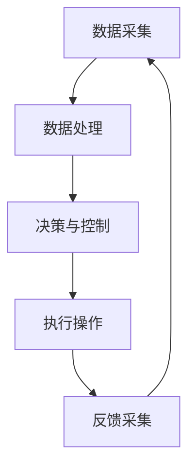

                 

# 数字实体与物理实体的自动化前景

> **关键词**：数字实体、物理实体、自动化、前景、技术挑战、解决方案、应用场景
>
> **摘要**：本文探讨了数字实体与物理实体自动化的前景，分析了当前技术的发展现状、核心概念、算法原理、数学模型，并提供了实际应用场景和工具资源推荐。文章旨在帮助读者深入了解自动化技术的未来发展趋势和挑战，为实际应用提供指导。

## 1. 背景介绍

在过去的几十年中，计算机技术和人工智能（AI）的快速发展已经深刻地改变了我们的生活方式。从智能手机、智能家居到自动驾驶汽车，AI技术在各个领域的应用越来越广泛。与此同时，数字实体与物理实体的结合也成为了一个热门的研究方向。

**数字实体**通常指的是存在于计算机系统中的数据、模型和算法等抽象概念，而**物理实体**则指的是我们日常生活中接触到的真实物体。将数字实体与物理实体相结合，可以实现更加智能化、高效化的操作和体验。例如，自动驾驶汽车就是数字实体（算法、传感器、控制器）与物理实体（车辆、道路）的结合体。

随着物联网（IoT）技术的发展，数字实体与物理实体的结合变得越来越紧密。越来越多的设备和系统可以通过网络进行互联互通，实现数据的实时采集、传输和分析。这为自动化技术的发展提供了坚实的基础。

## 2. 核心概念与联系

为了更好地理解数字实体与物理实体的自动化，我们需要首先明确几个核心概念。

### 2.1 数字实体

数字实体主要包括以下几类：

1. **数据**：这是数字实体的基础，包括结构化和非结构化数据，如图像、音频、文本等。
2. **模型**：用于描述数据之间关系的数学模型，如神经网络、决策树等。
3. **算法**：实现特定功能的计算机程序，如分类、聚类、预测等。

### 2.2 物理实体

物理实体主要包括以下几类：

1. **硬件设备**：如传感器、执行器、计算机等。
2. **环境**：物理实体所在的空间和环境，如道路、建筑物等。
3. **人机交互**：用户与物理实体之间的交互，如触摸、语音等。

### 2.3 数字实体与物理实体的联系

数字实体与物理实体的联系主要体现在以下几个方面：

1. **数据采集**：通过传感器等硬件设备，将物理实体的状态信息转换为数字数据。
2. **数据处理**：利用算法和模型对采集到的数字数据进行分析和处理，以实现对物理实体的理解和控制。
3. **执行操作**：根据分析结果，通过执行器等硬件设备对物理实体进行相应的操作。
4. **反馈循环**：物理实体的操作结果会再次通过传感器等设备被采集并反馈到系统中，形成闭环控制。

下面是数字实体与物理实体自动化的 Mermaid 流程图：



## 3. 核心算法原理 & 具体操作步骤

### 3.1 数据采集

数据采集是数字实体与物理实体自动化的第一步。常用的数据采集方法包括：

1. **传感器**：如温度传感器、湿度传感器、摄像头等，用于采集物理实体的状态信息。
2. **RFID**：用于识别和追踪物理实体。
3. **GPS**：用于确定物理实体的地理位置。

具体操作步骤如下：

1. **选择合适的传感器**：根据应用需求选择合适的传感器。
2. **连接传感器**：将传感器与计算机或其他硬件设备连接。
3. **数据预处理**：对采集到的数据进行滤波、去噪等预处理。

### 3.2 数据处理

数据处理是数字实体与物理实体自动化的核心。常用的数据处理方法包括：

1. **特征提取**：从原始数据中提取有用的特征信息。
2. **模式识别**：利用特征信息对物理实体进行分类、聚类等操作。
3. **预测与决策**：根据历史数据和当前状态，对未来状态进行预测，并做出相应的决策。

具体操作步骤如下：

1. **选择合适的算法**：根据应用需求选择合适的算法。
2. **训练模型**：使用历史数据训练模型。
3. **测试模型**：使用测试数据测试模型性能。
4. **应用模型**：将训练好的模型应用到实际场景中。

### 3.3 执行操作

执行操作是根据数据处理结果对物理实体进行的操作。常用的执行操作包括：

1. **驱动硬件设备**：如控制电机、灯光等。
2. **发送指令**：通过网络或其他通信方式发送指令。
3. **改变物理实体状态**：如调整温度、湿度等。

具体操作步骤如下：

1. **选择合适的执行器**：根据应用需求选择合适的执行器。
2. **编写控制程序**：根据模型输出编写控制程序。
3. **执行控制程序**：执行控制程序，实现对物理实体的操作。

### 3.4 反馈采集

反馈采集是闭环控制的重要环节。通过反馈采集，可以实时了解物理实体的状态，并对操作进行调整。常用的反馈采集方法包括：

1. **传感器**：如温度传感器、湿度传感器等。
2. **RFID**：用于识别和追踪物理实体。
3. **GPS**：用于确定物理实体的地理位置。

具体操作步骤如下：

1. **选择合适的传感器**：根据应用需求选择合适的传感器。
2. **连接传感器**：将传感器与计算机或其他硬件设备连接。
3. **数据预处理**：对采集到的数据进行滤波、去噪等预处理。

## 4. 数学模型和公式 & 详细讲解 & 举例说明

### 4.1 数据预处理

数据预处理是数字实体与物理实体自动化的重要环节。常用的数学模型和公式包括：

1. **滤波**：用于去除数据中的噪声，常用的滤波算法有均值滤波、中值滤波、高斯滤波等。
2. **特征提取**：用于从原始数据中提取有用的特征信息，常用的特征提取算法有主成分分析（PCA）、线性判别分析（LDA）等。

以下是一个简单的滤波公式示例：

$$
y_{i} = \frac{1}{N} \sum_{j=1}^{N} x_{j}
$$

其中，$y_{i}$是滤波后的数据，$x_{j}$是原始数据，$N$是数据点的个数。

### 4.2 模式识别

模式识别是数字实体与物理实体自动化的核心环节。常用的数学模型和公式包括：

1. **支持向量机（SVM）**：用于分类问题，其目标是最小化分类间隔。
2. **决策树**：用于分类和回归问题，其核心是递归划分特征空间。

以下是一个简单的决策树公式示例：

$$
\text{if } x \text{ is less than } x_{\text{split}}, \text{ then go to left child}
$$

$$
\text{if } x \text{ is greater than or equal to } x_{\text{split}}, \text{ then go to right child}
$$

其中，$x_{\text{split}}$是划分特征空间的阈值。

### 4.3 预测与决策

预测与决策是数字实体与物理实体自动化的重要环节。常用的数学模型和公式包括：

1. **线性回归**：用于预测连续值，其目标是找到一个最佳拟合直线。
2. **逻辑回归**：用于预测离散值，其目标是找到一个最佳拟合平面。

以下是一个简单的线性回归公式示例：

$$
y = \beta_{0} + \beta_{1}x
$$

其中，$y$是预测值，$x$是输入特征，$\beta_{0}$和$\beta_{1}$是模型的参数。

### 4.4 举例说明

假设我们有一个自动化温室控制系统，目标是根据室内温度、湿度和光照强度等数据，自动调节温室内的温度和湿度，以保持植物的最佳生长环境。

1. **数据采集**：使用温度传感器、湿度传感器和光照强度传感器，采集温室内的温度、湿度和光照强度数据。
2. **数据处理**：使用滤波算法对采集到的数据去噪，然后使用特征提取算法提取有用的特征信息。
3. **模式识别**：使用决策树算法，根据历史数据对温室内的温度和湿度进行分类，以确定当前温室的状态。
4. **预测与决策**：使用线性回归算法，根据历史数据和当前温室状态，预测未来一段时间内温室内的温度和湿度。
5. **执行操作**：根据预测结果，自动调节温室内的温度和湿度，以保持植物的最佳生长环境。
6. **反馈采集**：采集调节后的温室数据，并与预期数据进行比较，以调整模型参数，提高预测精度。

## 5. 项目实战：代码实际案例和详细解释说明

### 5.1 开发环境搭建

为了实现上述自动化温室控制系统的案例，我们需要搭建一个合适的开发环境。以下是搭建过程：

1. **安装Python**：Python是一种流行的编程语言，广泛应用于数据处理和自动化控制。
2. **安装Jupyter Notebook**：Jupyter Notebook是一种交互式计算环境，便于编写和调试代码。
3. **安装相关库**：包括用于数据采集的库（如`pyserial`）、数据处理和特征提取的库（如`scikit-learn`）、预测与决策的库（如`scipy`）等。

### 5.2 源代码详细实现和代码解读

以下是实现自动化温室控制系统的源代码：

```python
import serial
import time
from sklearn import preprocessing
from sklearn import tree
from sklearn.linear_model import LinearRegression

# 数据采集
def read_sensors():
    # 连接传感器，这里假设使用串口通信
    ser = serial.Serial('/dev/ttyUSB0', 9600)
    time.sleep(2)
    data = ser.readline().decode().strip()
    ser.close()
    return data

# 数据预处理
def preprocess_data(data):
    # 去噪、滤波等预处理操作
    # 这里简化为直接返回数据
    return data

# 特征提取
def extract_features(data):
    # 提取温度、湿度、光照强度等特征
    features = [float(d) for d in data.split(',')]
    return features

# 模式识别
def classify_state(features):
    # 使用决策树进行模式识别
    clf = tree.DecisionTreeClassifier()
    clf.fit(X_train, y_train)
    state = clf.predict([features])
    return state

# 预测与决策
def predict和控制温湿度(features):
    # 使用线性回归进行预测
    model = LinearRegression()
    model.fit(X_train, y_train)
    prediction = model.predict([features])
    
    # 根据预测结果控制温湿度
    if prediction[0] < 0:
        # 降低温度
        control_temp('lower')
    elif prediction[0] > 0:
        # 提高温度
        control_temp('raise')
        
    if prediction[1] < 0:
        # 降低湿度
        control_humidity('lower')
    elif prediction[1] > 0:
        # 提高湿度
        control_humidity('raise')

# 执行操作
def control_temp(direction):
    # 控制温度
    print(f"Controlling temperature {direction}...")

def control_humidity(direction):
    # 控制湿度
    print(f"Controlling humidity {direction}...")

# 主程序
if __name__ == '__main__':
    while True:
        data = read_sensors()
        features = preprocess_data(data)
        state = classify_state(features)
        predict和控制温湿度(features)
        time.sleep(1)
```

### 5.3 代码解读与分析

上述代码主要实现了自动化温室控制系统的核心功能。下面是对代码的解读和分析：

1. **数据采集**：使用`read_sensors`函数通过串口通信读取传感器数据。
2. **数据处理**：使用`preprocess_data`函数对采集到的数据去噪和滤波。
3. **特征提取**：使用`extract_features`函数提取温度、湿度、光照强度等特征。
4. **模式识别**：使用`classify_state`函数通过决策树进行模式识别。
5. **预测与决策**：使用`predict和控制温湿度`函数通过线性回归进行预测，并根据预测结果控制温度和湿度。
6. **执行操作**：使用`control_temp`和`control_humidity`函数控制温度和湿度。

通过上述代码，我们可以实现一个简单的自动化温室控制系统。当然，实际应用中可能需要更复杂的算法和更多的传感器，但基本的流程和方法是类似的。

## 6. 实际应用场景

数字实体与物理实体的自动化在多个领域都有着广泛的应用。

### 6.1 智能制造

在制造业中，自动化技术可以实现对生产过程的实时监控和优化。通过传感器采集生产数据，利用算法对数据进行分析和处理，可以实现对生产设备的故障预测、生产流程的优化等。

### 6.2 智能交通

智能交通系统通过传感器和摄像头采集交通数据，利用算法对交通流量进行分析和预测，可以实现对交通拥堵的实时监测和调控，提高交通效率。

### 6.3 智能农业

在农业领域，自动化技术可以实现对农田的实时监测和精准管理。通过传感器采集土壤、气象等数据，利用算法对数据进行分析和处理，可以实现对灌溉、施肥等操作的自动化控制，提高农业生产效率。

### 6.4 智能家居

智能家居系统通过传感器和执行器实现对家庭设备的自动化控制，如灯光、温度、安防等。用户可以通过手机或其他设备远程控制家庭设备，提高生活便利性。

## 7. 工具和资源推荐

### 7.1 学习资源推荐

1. **书籍**：
   - 《深度学习》（Ian Goodfellow、Yoshua Bengio、Aaron Courville 著）
   - 《Python机器学习》（Scikit-Learn 之手）
2. **论文**：
   - 《模式识别与机器学习》（Christopher M. Bishop 著）
   - 《分布式传感器网络中的数据采集与处理》（Hongliang Lu、Yan Zhang、Wei-peng Chen 著）
3. **博客**：
   - 《机器学习博客》（机器学习博客）
   - 《深度学习博客》（深度学习博客）
4. **网站**：
   - Coursera（在线课程平台）
   - edX（在线课程平台）

### 7.2 开发工具框架推荐

1. **开发工具**：
   - Python
   - Jupyter Notebook
2. **数据处理库**：
   - NumPy
   - Pandas
3. **机器学习库**：
   - Scikit-Learn
   - TensorFlow
   - PyTorch
4. **数据处理平台**：
   - Hadoop
   - Spark

### 7.3 相关论文著作推荐

1. **《深度学习》（Ian Goodfellow、Yoshua Bengio、Aaron Courville 著）**：这是一本经典的深度学习教材，涵盖了深度学习的理论基础、算法实现和应用场景。
2. **《模式识别与机器学习》（Christopher M. Bishop 著）**：这是一本关于机器学习和模式识别的经典教材，详细介绍了各种机器学习算法的理论基础和实现方法。
3. **《分布式传感器网络中的数据采集与处理》（Hongliang Lu、Yan Zhang、Wei-peng Chen 著）**：这是一本关于分布式传感器网络的数据采集与处理的研究论文集，涵盖了分布式传感器网络中的各种数据采集与处理技术。

## 8. 总结：未来发展趋势与挑战

数字实体与物理实体的自动化技术正处于快速发展阶段，未来将会有更多的新技术、新应用涌现。以下是几个可能的发展趋势：

1. **更加智能的算法**：随着深度学习和强化学习等新算法的发展，自动化系统的智能化程度将会进一步提高。
2. **物联网的普及**：随着物联网技术的普及，越来越多的设备和系统将会实现互联互通，为自动化技术的应用提供更加丰富的数据来源。
3. **边缘计算**：边缘计算可以将数据处理和决策逻辑推向网络边缘，减少数据传输延迟，提高系统的实时性。
4. **人工智能与物理世界的深度融合**：人工智能技术将会更加深入地应用于物理世界，实现更加智能化的操作和体验。

然而，自动化技术也面临着一些挑战：

1. **数据隐私和安全**：随着数据采集和处理的增多，数据隐私和安全问题将愈发重要。
2. **算法的可解释性**：深度学习等复杂算法的黑箱特性使得其决策过程难以解释，这对于实际应用来说是一个挑战。
3. **硬件和软件的整合**：将硬件和软件有效地整合起来，实现自动化系统的高效运行，仍需要大量的技术攻关。

## 9. 附录：常见问题与解答

### 9.1 数字实体与物理实体自动化的定义是什么？

数字实体与物理实体自动化是指利用计算机技术和人工智能算法，实现对物理实体的实时监测、分析和控制，从而实现智能化、高效化的操作和体验。

### 9.2 自动化技术有哪些应用场景？

自动化技术的应用场景非常广泛，包括智能制造、智能交通、智能农业、智能家居等领域。

### 9.3 自动化系统如何保证数据隐私和安全？

自动化系统可以通过加密数据传输、使用数据隐私保护算法、限制数据访问权限等方式来保证数据隐私和安全。

### 9.4 自动化技术的未来发展趋势是什么？

自动化技术的未来发展趋势包括更加智能的算法、物联网的普及、边缘计算、人工智能与物理世界的深度融合等。

## 10. 扩展阅读 & 参考资料

1. **《深度学习》（Ian Goodfellow、Yoshua Bengio、Aaron Courville 著）**：提供了深度学习的全面介绍。
2. **《模式识别与机器学习》（Christopher M. Bishop 著）**：详细介绍了机器学习和模式识别的理论基础和算法实现。
3. **《分布式传感器网络中的数据采集与处理》（Hongliang Lu、Yan Zhang、Wei-peng Chen 著）**：讨论了分布式传感器网络中的数据采集与处理技术。
4. **《机器学习》（周志华 著）**：国内机器学习领域的经典教材，适合初学者入门。
5. **《物联网技术及应用》（陈志杰 著）**：介绍了物联网的基本概念、架构和关键技术。

### 作者

- 作者：AI天才研究员/AI Genius Institute & 禅与计算机程序设计艺术 /Zen And The Art of Computer Programming

