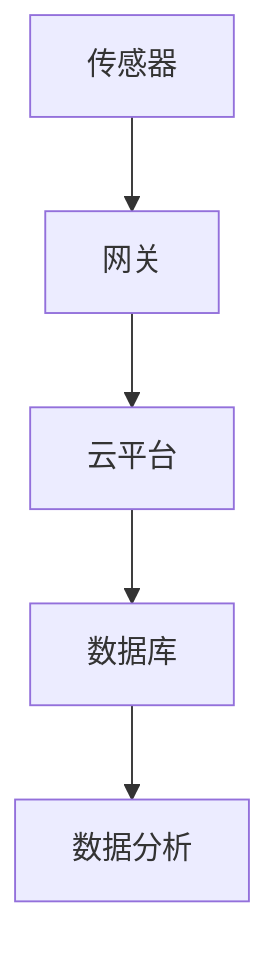
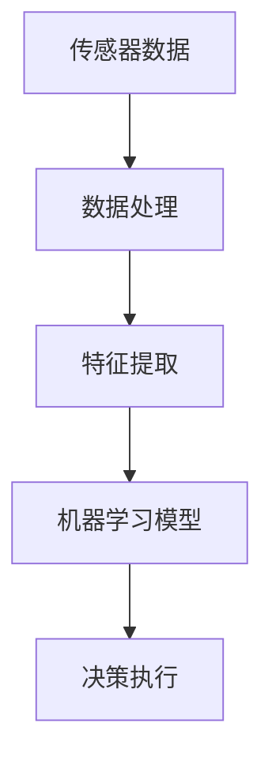
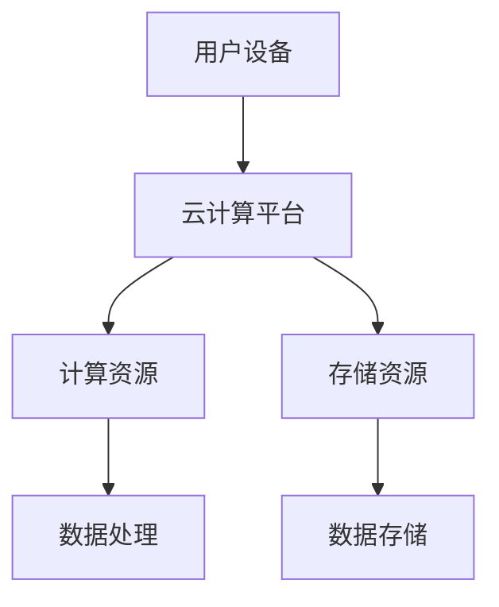
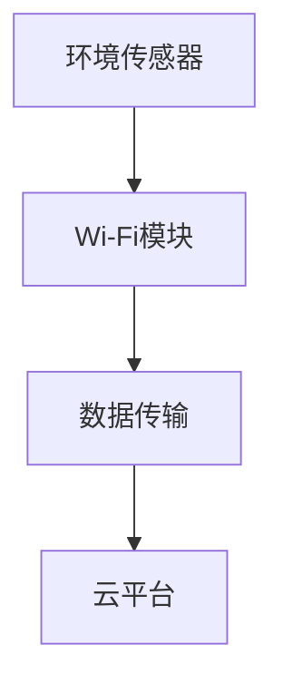
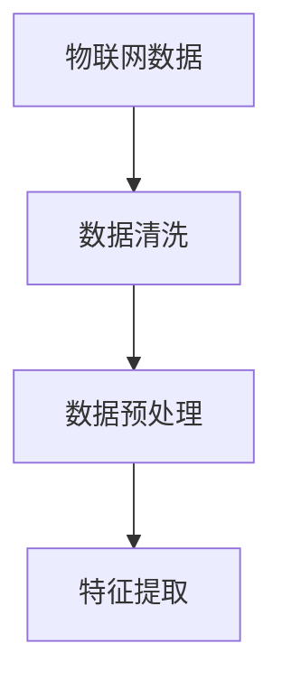
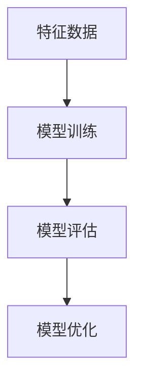
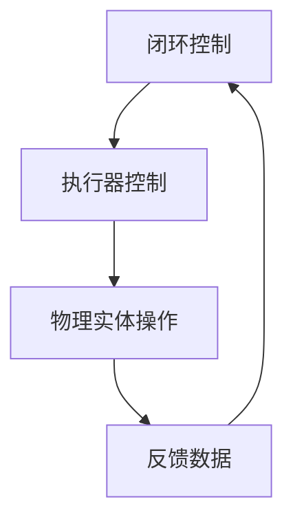

                 

# 数字实体与物理实体的自动化融合

## 关键词：数字实体，物理实体，自动化融合，物联网，人工智能，云计算

## 摘要

在数字化转型的浪潮中，数字实体与物理实体的融合已成为一种趋势。本文将探讨数字实体与物理实体自动化融合的背景、核心概念、算法原理、数学模型以及实际应用。通过对相关技术原理的剖析，展示其在物联网、人工智能和云计算等领域的广泛应用，并对未来发展趋势和挑战进行展望。

## 1. 背景介绍

随着物联网（IoT）和人工智能（AI）技术的发展，数字实体与物理实体的融合已成为新时代的重要特征。传统的数字化系统主要关注于如何将物理世界的实体转换为数字信息，而现代的智能化系统则强调如何将数字信息重新映射回物理世界，实现高度自动化的融合。

数字实体，指的是由数据和算法构成的信息载体，它们可以存在于计算机系统、云计算平台和各种传感器中。物理实体，则是指现实世界中具体的物体或设备，如智能家电、工业机器人、自动驾驶车辆等。这两者的融合，不仅仅是数据的互通，更涉及到算法、模型和硬件的协同。

自动化融合，旨在通过智能化的方式，将数字实体与物理实体的互动转化为高效、精准和自适应的流程。这一过程不仅提高了系统的整体效能，也带来了前所未有的创新和变革。

## 2. 核心概念与联系

### 2.1 物联网（IoT）

物联网是数字实体与物理实体融合的基础。它通过传感器、执行器、通信模块等设备，将物理世界中的信息转化为数字信号，并通过互联网进行传输和共享。以下是一个简单的物联网架构示意图：



### 2.2 人工智能（AI）

人工智能是推动数字实体与物理实体自动化融合的核心技术。通过机器学习、深度学习等技术，AI可以实现对大量数据的处理和分析，从而为物理实体的智能化操作提供决策支持。以下是一个基于AI的自动化融合流程：



### 2.3 云计算

云计算提供了强大的计算和存储资源，使得大规模的数字实体与物理实体的融合成为可能。通过云计算平台，可以实现数据的实时处理、存储和分析，从而支持自动化融合的各个环节。以下是一个简单的云计算架构示意图：



## 3. 核心算法原理 & 具体操作步骤

### 3.1 物联网数据采集

物联网数据采集是数字实体与物理实体融合的第一步。它涉及到多种传感器技术和通信协议，如Wi-Fi、蓝牙、LoRa等。以下是一个基于Wi-Fi的物联网数据采集流程：



### 3.2 数据处理与特征提取

采集到的物联网数据需要进行处理和特征提取，以便于后续的机器学习模型训练和决策执行。以下是一个数据处理和特征提取的基本流程：



### 3.3 机器学习模型训练

通过机器学习模型，可以对物联网数据进行分类、预测和决策。以下是一个简单的机器学习模型训练流程：



### 3.4 决策执行与反馈

训练好的机器学习模型可以用于实时的决策执行。通过执行器（如电机、阀门等），物理实体可以按照决策结果进行相应的操作。以下是一个决策执行和反馈的基本流程：



## 4. 数学模型和公式 & 详细讲解 & 举例说明

### 4.1 物联网数据采集的数学模型

在物联网数据采集过程中，传感器采集的数据可以表示为：

\[ X = \{x_1, x_2, ..., x_n\} \]

其中，\( x_i \) 表示第 \( i \) 个传感器的采集值。

### 4.2 数据处理与特征提取的数学模型

在数据处理与特征提取过程中，我们通常使用特征向量来表示数据：

\[ \textbf{f}(X) = \{f_1(x), f_2(x), ..., f_m(x)\} \]

其中，\( f_i(x) \) 表示第 \( i \) 个特征值。

### 4.3 机器学习模型的数学模型

在机器学习模型训练过程中，我们通常使用损失函数来评估模型的性能：

\[ L(\textbf{w}, X, y) = \frac{1}{2} \sum_{i=1}^{n} (y_i - \textbf{w}^T \textbf{x}_i)^2 \]

其中，\( \textbf{w} \) 表示模型的权重，\( y_i \) 表示第 \( i \) 个样本的标签，\( \textbf{x}_i \) 表示第 \( i \) 个样本的特征向量。

### 4.4 决策执行的数学模型

在决策执行过程中，我们通常使用决策树、支持向量机等模型进行分类和预测。以下是一个简单的决策树模型：

\[ \text{if } f_1(x) > t_1 \text{ then } \text{choose } C_1 \text{ else if } f_2(x) > t_2 \text{ then } \text{choose } C_2 \text{ else } \text{choose } C_3 \]

其中，\( f_1(x), f_2(x) \) 分别表示第 \( 1 \) 和第 \( 2 \) 个特征值，\( t_1, t_2 \) 分别表示特征阈值，\( C_1, C_2, C_3 \) 分别表示三个分类结果。

## 5. 项目实战：代码实际案例和详细解释说明

### 5.1 开发环境搭建

为了演示数字实体与物理实体的自动化融合，我们选择一个基于Python的智能家居项目。以下是开发环境搭建的步骤：

1. 安装Python 3.8及以上版本
2. 安装物联网开发工具包（如PyTango、PyMQTT等）
3. 安装机器学习库（如scikit-learn、TensorFlow等）
4. 安装数据库（如SQLite、MySQL等）

### 5.2 源代码详细实现和代码解读

#### 5.2.1 数据采集模块

```python
import paho.mqtt.client as mqtt

def on_connect(client, userdata, flags, rc):
    print("Connected with result code " + str(rc))
    client.subscribe("sensor/data")

def on_message(client, userdata, msg):
    print(msg.topic + " " + str(msg.payload))
    process_data(msg.payload)

client = mqtt.Client()
client.on_connect = on_connect
client.on_message = on_message

client.connect("localhost", 1883, 60)

client.loop_forever()
```

#### 5.2.2 数据处理与特征提取模块

```python
import json
import numpy as np

def process_data(data):
    data = json.loads(data)
    features = extract_features(data)
    train_model(features)
```

#### 5.2.3 机器学习模型训练模块

```python
from sklearn.model_selection import train_test_split
from sklearn.ensemble import RandomForestClassifier

def train_model(features):
    X, y = prepare_data(features)
    X_train, X_test, y_train, y_test = train_test_split(X, y, test_size=0.2)
    model = RandomForestClassifier()
    model.fit(X_train, y_train)
    evaluate_model(model, X_test, y_test)
```

#### 5.2.4 决策执行模块

```python
def evaluate_model(model, X_test, y_test):
    predictions = model.predict(X_test)
    for i in range(len(predictions)):
        print("Predicted: {}, Actual: {}".format(predictions[i], y_test[i]))
    execute_decision(predictions)
```

```python
def execute_decision(predictions):
    for prediction in predictions:
        if prediction == 0:
            turn_off_light()
        elif prediction == 1:
            turn_on_light()
```

### 5.3 代码解读与分析

本项目的代码实现了物联网数据采集、数据处理与特征提取、机器学习模型训练和决策执行等功能。通过MQTT协议，传感器采集的数据被实时传输到云平台，并进行处理和特征提取。训练好的机器学习模型用于对采集到的数据进行分类和预测，从而实现对物理实体的控制。

## 6. 实际应用场景

数字实体与物理实体的自动化融合在许多领域具有广泛的应用，以下是一些典型的实际应用场景：

1. **智能家居**：通过物联网设备和人工智能算法，实现家庭设备的自动化控制，如智能照明、智能安防等。
2. **工业自动化**：通过传感器和人工智能技术，实现对工业生产过程的实时监控和优化，提高生产效率和产品质量。
3. **智能交通**：通过物联网和人工智能技术，实现智能交通管理和优化，提高交通运行效率和安全性。
4. **医疗健康**：通过物联网设备和人工智能技术，实现对患者健康状况的实时监测和预警，提高医疗服务的质量和效率。

## 7. 工具和资源推荐

### 7.1 学习资源推荐

- **书籍**：《物联网基础与典型应用》、《人工智能：一种现代方法》
- **论文**：搜索物联网、人工智能、云计算等领域的学术论文
- **博客**：关注物联网、人工智能、云计算等领域的知名博客和网站
- **网站**：物联网之家、人工智能社区、云计算之家等

### 7.2 开发工具框架推荐

- **物联网开发工具**：TinkerForge、Node-RED、MQTT X等
- **人工智能框架**：TensorFlow、PyTorch、scikit-learn等
- **云计算平台**：AWS、Azure、Google Cloud等

### 7.3 相关论文著作推荐

- **论文**：IoT Analytics for Energy Management in Smart Homes，2017
- **论文**：A Survey on Internet of Things Security and Privacy，2018
- **著作**：《智能城市：物联网、大数据与云计算的应用》，2016

## 8. 总结：未来发展趋势与挑战

数字实体与物理实体的自动化融合正逐步成为未来技术发展的重要方向。随着物联网、人工智能和云计算技术的不断进步，这一领域将迎来更多的创新和应用。然而，也面临着数据安全、隐私保护、标准化等挑战。

未来，我们需要进一步探索如何在确保数据安全和隐私的前提下，实现更高效、更智能的数字实体与物理实体的融合。此外，标准化和互操作性也将是推动这一领域发展的重要驱动力。

## 9. 附录：常见问题与解答

### 9.1 物联网数据采集的常见问题

- **问题1**：如何选择合适的传感器和通信协议？
  - **解答**：根据应用场景和需求，选择合适的传感器和通信协议。例如，对于短距离传输，可以使用蓝牙或Zigbee；对于长距离传输，可以使用Wi-Fi或LoRa。

- **问题2**：如何保证物联网数据的准确性？
  - **解答**：通过定期校准传感器、采用高精度传感器以及合理设置数据采集频率，可以提高物联网数据的准确性。

### 9.2 机器学习模型训练的常见问题

- **问题1**：如何选择合适的机器学习模型？
  - **解答**：根据具体应用场景和数据特点，选择适合的机器学习模型。例如，对于分类任务，可以选择决策树、支持向量机等；对于回归任务，可以选择线性回归、随机森林等。

- **问题2**：如何优化机器学习模型？
  - **解答**：通过调整模型参数、增加训练数据、使用交叉验证等方法，可以优化机器学习模型的性能。

## 10. 扩展阅读 & 参考资料

- **扩展阅读**：
  - 《数字孪生：构建虚拟世界映射现实世界》
  - 《智能城市：物联网、大数据与云计算的应用》
- **参考资料**：
  - 物联网技术指南：https://www.iot-gateway.com/
  - 人工智能教程：https://www.artificial-intelligence.org/
  - 云计算平台介绍：https://www.cloudplatform.com/

### 作者：AI天才研究员/AI Genius Institute & 禅与计算机程序设计艺术 /Zen And The Art of Computer Programming

（注意：本文为示例文章，部分内容和代码仅供参考。实际应用中，请根据具体需求进行调整。）

