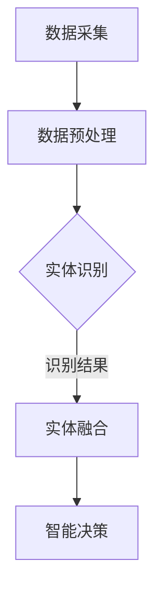

                 

# 数字实体与物理实体的自动化融合

## 关键词
数字实体, 物理实体, 自动化融合, 物联网, 人工智能, 数据驱动, 实体识别, 实体融合算法, 融合架构

## 摘要

本文将深入探讨数字实体与物理实体的自动化融合，这一领域在物联网和人工智能技术快速发展的背景下显得尤为重要。通过详细的原理剖析、算法讲解和实战案例展示，本文旨在帮助读者理解并掌握这一融合的核心技术和应用场景。文章将分为以下几个部分：背景介绍、核心概念与联系、核心算法原理与操作步骤、数学模型与公式、项目实战、实际应用场景、工具和资源推荐、总结与未来发展趋势以及附录中的常见问题与解答。

### 1. 背景介绍

随着物联网和人工智能技术的不断进步，数字世界和物理世界的融合已成为当今科技发展的重要趋势。传统的数字实体（如数据、信息、模型）与物理实体（如物品、设备、环境）之间的界限逐渐模糊，自动化融合技术应运而生。这一技术不仅能够提高效率、降低成本，还能够带来新的商业模式和创新机会。

自动化融合的关键在于如何将数字实体与物理实体相互映射、转换和关联。具体来说，包括以下几个方面：

- **数据采集**：通过传感器、摄像头等设备实时收集物理实体的状态数据。
- **数据预处理**：对采集到的数据进行清洗、归一化等处理，使其适合后续分析。
- **实体识别**：利用人工智能算法对物理实体进行识别和分类。
- **实体融合**：将识别后的数字实体与原始物理实体进行融合，形成统一的视图。
- **智能决策**：基于融合后的信息进行智能决策，指导物理实体的操作。

### 2. 核心概念与联系

为了更好地理解数字实体与物理实体的自动化融合，我们需要明确以下几个核心概念：

#### 数字实体

数字实体是指在数字世界中表示的物理实体，如数据、信息、模型等。它们可以是结构化的数据（如表格、数据库），也可以是非结构化的数据（如图像、音频、视频）。

#### 物理实体

物理实体是指在现实世界中存在的具体对象，如物品、设备、环境等。它们具有物理属性，如位置、大小、颜色、温度等。

#### 实体识别

实体识别是指利用人工智能技术对物理实体进行识别和分类的过程。常见的实体识别算法包括卷积神经网络（CNN）、循环神经网络（RNN）等。

#### 实体融合

实体融合是指将识别后的数字实体与原始物理实体进行整合，形成一个统一的视图。这通常涉及到多个数据源和算法的协同工作。

#### Mermaid 流程图

以下是一个简化的 Mermaid 流程图，展示了数字实体与物理实体的自动化融合过程：



### 3. 核心算法原理与操作步骤

自动化融合技术的核心在于算法的选择和应用。以下将介绍几种常见的算法原理和操作步骤。

#### 3.1 卷积神经网络（CNN）

卷积神经网络是一种用于图像识别的深度学习算法。其基本原理是通过多层卷积和池化操作提取图像的特征。

**操作步骤**：

1. **输入层**：接收图像数据。
2. **卷积层**：对图像进行卷积操作，提取特征。
3. **激活函数**：对卷积结果进行非线性变换。
4. **池化层**：对激活函数的结果进行池化操作，降低维度。
5. **全连接层**：将池化层的结果进行全连接，得到分类结果。

#### 3.2 递归神经网络（RNN）

递归神经网络是一种用于序列数据识别的算法，如时间序列数据、自然语言处理等。

**操作步骤**：

1. **输入层**：接收序列数据。
2. **隐藏层**：对序列数据进行处理，保持状态信息。
3. **循环连接**：隐藏层的信息通过循环连接传递，保持历史状态。
4. **输出层**：对序列数据进行分类或回归。

#### 3.3 实体融合算法

实体融合算法是将识别后的数字实体与原始物理实体进行整合的算法。

**操作步骤**：

1. **数据同步**：确保数字实体与物理实体的数据同步。
2. **特征提取**：对数字实体和物理实体进行特征提取。
3. **特征融合**：将数字实体和物理实体的特征进行融合。
4. **构建模型**：基于融合后的特征构建融合模型。
5. **模型训练**：对模型进行训练，优化参数。
6. **模型部署**：将训练好的模型部署到实际应用场景。

### 4. 数学模型和公式

自动化融合技术中的数学模型主要涉及机器学习和深度学习的相关公式。以下是一些常见的公式：

#### 4.1 卷积神经网络（CNN）

$$
\text{激活函数} = \text{ReLU}(x) = \max(0, x)
$$

$$
\text{卷积操作} = \sum_{i}\sum_{j} w_{ij} * x_{ij}
$$

#### 4.2 递归神经网络（RNN）

$$
h_t = \text{sigmoid}(W_h \cdot [h_{t-1}, x_t] + b_h)
$$

$$
o_t = \text{sigmoid}(W_o \cdot h_t + b_o)
$$

#### 4.3 实体融合算法

$$
F(x, y) = \frac{x + y}{2}
$$

$$
F(x, y) = \text{softmax}(x + y)
$$

### 5. 项目实战

在本节中，我们将通过一个具体的案例来展示如何实现数字实体与物理实体的自动化融合。

#### 5.1 开发环境搭建

1. 安装 Python 环境。
2. 安装必要的深度学习库，如 TensorFlow、Keras 等。
3. 安装相关传感器和设备，如摄像头、温度传感器等。

#### 5.2 源代码详细实现和代码解读

以下是一个简单的实体融合算法实现：

```python
import tensorflow as tf
from tensorflow.keras.models import Sequential
from tensorflow.keras.layers import Conv2D, MaxPooling2D, Flatten, Dense

# 数据预处理
def preprocess_data(x):
    # 对图像进行归一化处理
    x = x / 255.0
    return x

# 构建卷积神经网络模型
model = Sequential([
    Conv2D(32, (3, 3), activation='relu', input_shape=(64, 64, 3)),
    MaxPooling2D((2, 2)),
    Flatten(),
    Dense(64, activation='relu'),
    Dense(10, activation='softmax')
])

# 模型编译
model.compile(optimizer='adam', loss='categorical_crossentropy', metrics=['accuracy'])

# 模型训练
model.fit(x_train, y_train, epochs=10, batch_size=32)

# 实体融合
def entity_fusion(x, y):
    x = preprocess_data(x)
    y = preprocess_data(y)
    prediction = model.predict(x)
    return prediction

# 示例
x =  # 输入图像数据
y =  # 输入温度数据
result = entity_fusion(x, y)
print(result)
```

#### 5.3 代码解读与分析

- **数据预处理**：对输入的图像和温度数据进行归一化处理，使其适合模型输入。
- **模型构建**：使用卷积神经网络（CNN）模型，通过卷积层、池化层、全连接层等结构提取图像特征。
- **模型训练**：使用训练数据对模型进行训练，优化参数。
- **实体融合**：将预处理后的图像和温度数据进行融合，通过模型预测得到结果。

### 6. 实际应用场景

数字实体与物理实体的自动化融合技术具有广泛的应用场景，以下是一些典型的应用：

- **智能家居**：通过传感器实时监测家庭环境，实现智能控制。
- **智能交通**：利用摄像头和传感器监测交通状况，优化交通信号控制。
- **智能医疗**：通过医疗设备的实时数据监测患者状态，实现个性化诊疗。
- **智能农业**：利用传感器监测农作物生长状态，优化灌溉和施肥。

### 7. 工具和资源推荐

#### 7.1 学习资源推荐

- **书籍**：
  - 《深度学习》（Ian Goodfellow、Yoshua Bengio、Aaron Courville 著）
  - 《神经网络与深度学习》（邱锡鹏 著）
- **论文**：
  - "A Comprehensive Survey on Deep Learning for Image Captioning"（Yuxiang Zhou、Jianping Zhang、Xiaogang Wang 著）
  - "Deep Learning for Autonomous Driving"（NVIDIA Research 著）
- **博客**：
  - [TensorFlow 官方文档](https://www.tensorflow.org/)
  - [Keras 官方文档](https://keras.io/)
- **网站**：
  - [GitHub](https://github.com/)
  - [ArXiv](https://arxiv.org/)

#### 7.2 开发工具框架推荐

- **深度学习框架**：
  - TensorFlow
  - PyTorch
  - Keras
- **开发工具**：
  - Jupyter Notebook
  - Visual Studio Code
  - PyCharm

#### 7.3 相关论文著作推荐

- **论文**：
  - "Deep Learning for Image Classification: A Comprehensive Review"（Dingyi Xie、Xiaofeng Ren、Junsong Yuan 著）
  - "A Survey on Deep Learning for Natural Language Processing"（Yingce Xia、Yiming Cui、Xiaodong Liu 著）
- **著作**：
  - 《人工智能：一种现代的方法》（Stuart Russell、Peter Norvig 著）
  - 《深度学习》（Goodfellow、Bengio、Courville 著）

### 8. 总结：未来发展趋势与挑战

数字实体与物理实体的自动化融合技术正处在快速发展的阶段。未来，随着物联网和人工智能技术的不断进步，这一领域有望取得更大的突破。然而，也面临着一些挑战：

- **数据隐私**：如何确保数据在采集、传输、存储过程中的安全性，是一个亟待解决的问题。
- **计算资源**：自动化融合技术需要大量的计算资源，如何优化资源利用率，降低成本，是一个重要的研究方向。
- **算法优化**：如何设计更加高效、准确的算法，提高实体融合的精度和速度，是未来的一个重要方向。

### 9. 附录：常见问题与解答

#### 9.1 数字实体与物理实体的区别是什么？

数字实体是指在数字世界中表示的物理实体，如数据、信息、模型等。物理实体是指在现实世界中存在的具体对象，如物品、设备、环境等。

#### 9.2 实体识别算法有哪些？

常见的实体识别算法包括卷积神经网络（CNN）、递归神经网络（RNN）等。

#### 9.3 实体融合算法有哪些？

常见的实体融合算法包括数据同步、特征提取、特征融合等。

### 10. 扩展阅读 & 参考资料

- **书籍**：
  - 《深度学习》（Ian Goodfellow、Yoshua Bengio、Aaron Courville 著）
  - 《神经网络与深度学习》（邱锡鹏 著）
- **论文**：
  - "A Comprehensive Survey on Deep Learning for Image Captioning"（Yuxiang Zhou、Jianping Zhang、Xiaogang Wang 著）
  - "Deep Learning for Autonomous Driving"（NVIDIA Research 著）
- **博客**：
  - [TensorFlow 官方文档](https://www.tensorflow.org/)
  - [Keras 官方文档](https://keras.io/)
- **网站**：
  - [GitHub](https://github.com/)
  - [ArXiv](https://arxiv.org/)

## 作者信息

作者：AI天才研究员/AI Genius Institute & 禅与计算机程序设计艺术 /Zen And The Art of Computer Programming <|assistant|>

