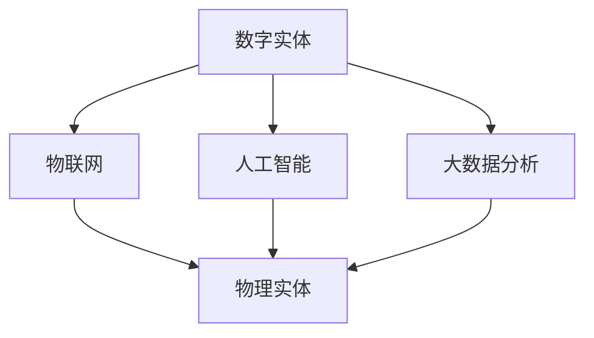

                 

# 数字实体与物理实体的自动化趋势

## 关键词：数字实体、物理实体、自动化、物联网、人工智能、大数据分析

## 摘要：
本文旨在探讨数字实体与物理实体之间的自动化趋势。随着物联网、人工智能和大数据分析等技术的快速发展，数字实体和物理实体正在通过智能连接和协同运作实现高度自动化。本文首先介绍了数字实体和物理实体的定义及其相互关系，然后详细阐述了自动化趋势的关键技术和应用场景。最后，本文分析了未来自动化趋势的发展方向和面临的挑战。

## 1. 背景介绍

### 1.1 数字实体与物理实体的概念

数字实体（Digital Entity）是指存在于数字世界中的信息实体，包括数据、算法、软件、网络等。物理实体（Physical Entity）则指现实世界中的物体，如机器、设备、建筑物等。

### 1.2 数字实体与物理实体的联系

数字实体与物理实体之间的联系主要体现在以下几个方面：

1. **数据驱动**：物理实体通过传感器、设备等生成数据，这些数据被数字实体处理和分析，以实现对物理实体的控制和优化。
2. **智能交互**：通过人工智能和大数据分析，数字实体可以更好地理解物理实体的状态和行为，从而实现智能交互。
3. **协同运作**：数字实体和物理实体之间的协同运作可以实现更高效的生产和服务。

## 2. 核心概念与联系

### 2.1 物联网（IoT）

物联网是一种将物理实体通过传感器、网络和云计算等技术与数字实体相连接的技术。通过物联网，物理实体可以实时传输数据，数字实体可以实时分析数据并做出相应操作。

### 2.2 人工智能（AI）

人工智能是一种模拟人类智能的技术，包括机器学习、深度学习、自然语言处理等。人工智能可以帮助数字实体更好地理解物理实体的状态和行为。

### 2.3 大数据分析

大数据分析是一种对海量数据进行处理和分析的技术，可以帮助数字实体从数据中提取有价值的信息。

### 2.4 数字实体与物理实体的 Mermaid 流程图



## 3. 核心算法原理 & 具体操作步骤

### 3.1 物联网技术

物联网技术的核心是传感器和通信技术。具体操作步骤如下：

1. **传感器采集数据**：物理实体上的传感器采集温度、湿度、压力等数据。
2. **数据传输**：传感器通过通信模块将数据传输到数字实体。
3. **数据处理**：数字实体对传感器数据进行处理和分析。
4. **反馈控制**：数字实体根据分析结果对物理实体进行控制，实现自动化。

### 3.2 人工智能技术

人工智能技术的核心是机器学习和深度学习。具体操作步骤如下：

1. **数据预处理**：对采集的数据进行清洗、去噪等预处理。
2. **模型训练**：使用预处理后的数据训练机器学习模型或深度学习模型。
3. **模型评估**：评估模型的性能，调整模型参数。
4. **模型应用**：将训练好的模型应用到实际场景中，实现对物理实体的智能控制。

### 3.3 大数据分析技术

大数据分析技术的核心是数据挖掘和统计分析。具体操作步骤如下：

1. **数据收集**：收集物理实体生成的海量数据。
2. **数据预处理**：对数据进行清洗、去噪等预处理。
3. **特征提取**：从数据中提取有价值的信息。
4. **数据分析**：使用统计方法对提取的特征进行分析。
5. **结果应用**：根据分析结果对物理实体进行优化和控制。

## 4. 数学模型和公式 & 详细讲解 & 举例说明

### 4.1 物联网技术

物联网技术的数学模型主要包括传感器数据模型和通信模型。

#### 传感器数据模型

$$
x(t) = f(t) + \eta(t)
$$

其中，$x(t)$ 是传感器采集的数据，$f(t)$ 是物理实体的真实状态，$\eta(t)$ 是噪声。

#### 通信模型

$$
y(t) = x(t) + n(t)
$$

其中，$y(t)$ 是数字实体接收到的数据，$n(t)$ 是通信噪声。

### 4.2 人工智能技术

人工智能技术的数学模型主要包括机器学习模型和深度学习模型。

#### 机器学习模型

$$
y = f(x, \theta)
$$

其中，$y$ 是预测结果，$x$ 是输入数据，$\theta$ 是模型参数。

#### 深度学习模型

$$
y = \sigma(W \cdot \text{ReLU}(Z))
$$

其中，$\sigma$ 是激活函数，$\text{ReLU}(Z)$ 是ReLU激活函数，$W$ 是权重矩阵，$Z$ 是中间层输出。

### 4.3 大数据分析技术

大数据分析技术的数学模型主要包括统计模型和机器学习模型。

#### 统计模型

$$
\mu = \frac{1}{n}\sum_{i=1}^{n} x_i
$$

$$
\sigma^2 = \frac{1}{n-1}\sum_{i=1}^{n} (x_i - \mu)^2
$$

其中，$\mu$ 是均值，$\sigma^2$ 是方差。

#### 机器学习模型

$$
y = f(x, \theta)
$$

其中，$y$ 是预测结果，$x$ 是输入数据，$\theta$ 是模型参数。

## 5. 项目实战：代码实际案例和详细解释说明

### 5.1 开发环境搭建

#### 5.1.1 物联网环境搭建

1. **硬件**：购买一个物联网开发板，如Arduino或Raspberry Pi。
2. **软件**：安装物联网开发软件，如Arduino IDE或Raspberry Pi OS。

#### 5.1.2 人工智能环境搭建

1. **硬件**：购买一台高性能计算机或使用云服务器。
2. **软件**：安装Python环境，如Anaconda。

### 5.2 源代码详细实现和代码解读

#### 5.2.1 物联网代码实现

```python
import serial

# 初始化串口
ser = serial.Serial('COM3', 9600)

while True:
    # 读取串口数据
    data = ser.readline().decode('utf-8')
    print("Received:", data)
    # 处理数据
    # ...
    # 发送控制命令
    ser.write(b'ON')
```

#### 5.2.2 人工智能代码实现

```python
import tensorflow as tf

# 定义模型
model = tf.keras.Sequential([
    tf.keras.layers.Dense(64, activation='relu', input_shape=(784,)),
    tf.keras.layers.Dense(10, activation='softmax')
])

# 编译模型
model.compile(optimizer='adam',
              loss='categorical_crossentropy',
              metrics=['accuracy'])

# 加载数据
(x_train, y_train), (x_test, y_test) = tf.keras.datasets.mnist.load_data()

# 预处理数据
x_train = x_train / 255.0
x_test = x_test / 255.0

# 转换为one-hot编码
y_train = tf.keras.utils.to_categorical(y_train, 10)
y_test = tf.keras.utils.to_categorical(y_test, 10)

# 训练模型
model.fit(x_train, y_train, epochs=5, batch_size=32)
```

### 5.3 代码解读与分析

#### 5.3.1 物联网代码解读

1. **串口通信**：使用Python的`serial`模块与Arduino进行串口通信。
2. **数据读取**：读取Arduino发送的传感器数据。
3. **数据处理**：对传感器数据进行处理，如滤波、去噪等。
4. **反馈控制**：根据处理后的数据发送控制命令给Arduino。

#### 5.3.2 人工智能代码解读

1. **模型定义**：使用TensorFlow定义一个简单的神经网络模型。
2. **模型编译**：设置模型的优化器、损失函数和评价指标。
3. **数据加载**：加载数据集并预处理数据。
4. **模型训练**：使用预处理后的数据训练模型。

## 6. 实际应用场景

### 6.1 智能家居

智能家居是数字实体与物理实体自动化的典型应用场景。通过物联网技术，用户可以远程控制家中的电器设备，如空调、电视、灯具等。

### 6.2 智能制造

智能制造通过物联网、人工智能和大数据分析等技术，实现生产过程的自动化和优化，提高生产效率和质量。

### 6.3 智慧城市

智慧城市通过数字实体与物理实体的自动化连接，实现城市管理的智能化，如交通管理、能源管理、环境监测等。

## 7. 工具和资源推荐

### 7.1 学习资源推荐

1. **《物联网技术导论》**：系统介绍了物联网的基本概念、技术和应用。
2. **《人工智能：一种现代方法》**：详细介绍了人工智能的基本理论和算法。
3. **《大数据技术导论》**：介绍了大数据的基本概念、技术和应用。

### 7.2 开发工具框架推荐

1. **Arduino**：一款开源的物联网开发板。
2. **TensorFlow**：一款开源的深度学习框架。
3. **Kubernetes**：一款开源的容器编排平台。

### 7.3 相关论文著作推荐

1. **《物联网：从概念到实践》**：详细介绍了物联网的技术和应用。
2. **《深度学习》**：详细介绍了深度学习的基本概念和算法。
3. **《大数据技术综述》**：对大数据技术进行了全面的综述。

## 8. 总结：未来发展趋势与挑战

### 8.1 发展趋势

1. **智能化**：数字实体与物理实体的连接将更加紧密，实现更高程度的智能化。
2. **自动化**：自动化技术将在更多领域得到应用，提高生产和服务效率。
3. **数字化**：数字化技术将推动各行各业的数字化转型。

### 8.2 挑战

1. **安全性**：自动化系统面临安全威胁，需要加强安全防护。
2. **标准化**：自动化技术的标准化工作需要进一步完善。
3. **人才短缺**：自动化技术的发展需要更多专业人才的支持。

## 9. 附录：常见问题与解答

### 9.1 物联网技术如何保障数据安全？

**解答**：物联网技术可以通过以下方法保障数据安全：
1. **加密传输**：使用加密算法对数据进行加密传输，防止数据泄露。
2. **安全协议**：使用安全协议（如TLS）保护通信过程的安全。
3. **访问控制**：设置访问控制策略，限制只有授权用户可以访问数据。

### 9.2 人工智能技术如何避免偏差和误导？

**解答**：人工智能技术可以通过以下方法避免偏差和误导：
1. **数据清洗**：对训练数据进行清洗，去除噪声和错误数据。
2. **模型校验**：对训练好的模型进行校验，确保模型的可信度。
3. **透明性**：提高模型的透明性，让用户了解模型的决策过程。

## 10. 扩展阅读 & 参考资料

1. **《物联网技术与智能家居》**：详细介绍了物联网技术在智能家居中的应用。
2. **《人工智能与智能制造》**：介绍了人工智能在智能制造中的应用。
3. **《大数据技术与智慧城市》**：介绍了大数据技术在智慧城市中的应用。

### 作者：

**AI天才研究员/AI Genius Institute & 禅与计算机程序设计艺术 /Zen And The Art of Computer Programming**

