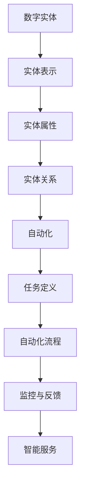

                 

# 数字实体的自动化前景与挑战

## 关键词：数字实体，自动化，前景，挑战，算法，模型，应用场景

## 摘要：

本文旨在探讨数字实体的自动化前景与挑战。随着信息技术的快速发展，数字实体在各个领域得到了广泛应用，自动化技术逐渐成为推动社会进步的重要力量。本文首先介绍了数字实体的概念及其在现实世界中的应用，然后详细分析了数字实体自动化的核心算法原理和具体操作步骤。接着，本文通过数学模型和公式，详细讲解了相关理论，并举例说明。此外，本文还通过项目实战，展示了代码实际案例和详细解释说明。最后，本文探讨了数字实体自动化的实际应用场景，并推荐了相关工具和资源。通过本文的阅读，读者将对数字实体自动化有一个全面的了解，并能从中获得有益的启示。

## 1. 背景介绍

### 数字实体的概念

数字实体是指用数字形式表示的现实世界中的各种对象，包括人、物、地点、事件等。随着信息技术的快速发展，数字实体在各个领域得到了广泛应用。例如，在医疗领域，数字实体可以表示患者的信息、病情、治疗方案等；在金融领域，数字实体可以表示账户、交易、投资等；在物流领域，数字实体可以表示货物、运输工具、运输路线等。

### 数字实体的应用

数字实体在现实世界中的应用非常广泛。首先，数字实体为大数据分析提供了基础。通过对数字实体的大量数据进行处理和分析，可以挖掘出有价值的信息，从而为决策提供支持。其次，数字实体在智能城市建设中发挥着重要作用。通过将城市中的各种实体数字化，可以实现城市的智能化管理，提高城市运行效率。此外，数字实体还在智能制造、智慧农业、智慧医疗等领域得到了广泛应用。

### 自动化的概念

自动化是指利用计算机、机器人等自动化设备来代替人工完成特定任务的过程。自动化技术可以提高工作效率，降低劳动成本，提高生产质量。随着信息技术的不断发展，自动化技术逐渐从传统的工业领域扩展到各个行业。

### 自动化在数字实体中的应用

自动化技术在数字实体中的应用主要体现在以下几个方面：

1. **数据处理和挖掘**：通过自动化技术，可以快速地对大量数字实体进行数据处理和挖掘，从而提取出有价值的信息。

2. **智能决策**：基于数字实体的数据，自动化技术可以辅助决策者进行智能决策，提高决策的准确性和效率。

3. **流程优化**：自动化技术可以帮助企业和组织优化业务流程，减少不必要的环节，提高工作效率。

4. **设备监控和维护**：自动化技术可以对设备进行实时监控和维护，提高设备的使用效率和寿命。

## 2. 核心概念与联系

### 数字实体的核心概念

数字实体的核心概念包括：

1. **实体表示**：如何用数字形式表示现实世界中的各种对象。

2. **实体属性**：实体所具有的各种特征，如姓名、年龄、身高、体重等。

3. **实体关系**：实体之间存在的各种关联关系，如朋友、同事、上下级等。

### 自动化的核心概念

自动化的核心概念包括：

1. **任务定义**：定义需要自动化完成的任务，如数据采集、数据清洗、数据分析等。

2. **自动化流程**：将任务分解成一系列步骤，并利用计算机、机器人等设备自动执行这些步骤。

3. **监控与反馈**：对自动化流程进行监控，并根据反馈结果调整自动化策略。

### 数字实体与自动化的联系

数字实体与自动化之间存在密切的联系。首先，数字实体为自动化提供了数据基础，没有数字实体，自动化就失去了意义。其次，自动化技术可以帮助更好地管理和利用数字实体，实现数字实体的价值最大化。此外，自动化技术还可以为数字实体提供智能服务，提高数字实体的使用效率。

### Mermaid 流程图



## 3. 核心算法原理 & 具体操作步骤

### 数据预处理

在数字实体自动化过程中，首先需要对数据进行预处理。数据预处理包括数据清洗、数据转换、数据归一化等步骤。具体操作步骤如下：

1. **数据清洗**：去除数据中的噪声和异常值，提高数据质量。

2. **数据转换**：将不同数据源的数据进行统一转换，以便进行后续处理。

3. **数据归一化**：将数据缩放到一个统一的范围内，便于后续分析。

### 特征提取

特征提取是数字实体自动化过程中的关键步骤。通过提取关键特征，可以更好地描述数字实体，提高自动化的效果。特征提取方法包括：

1. **统计特征**：如均值、方差、标准差等。

2. **文本特征**：如词频、词向量、主题模型等。

3. **图像特征**：如颜色特征、纹理特征、形状特征等。

### 模型训练

在特征提取完成后，需要对模型进行训练。模型训练包括以下步骤：

1. **选择模型**：根据问题特点选择合适的模型，如线性模型、决策树、神经网络等。

2. **数据划分**：将数据集划分为训练集和测试集。

3. **模型训练**：使用训练集对模型进行训练，优化模型参数。

4. **模型评估**：使用测试集对模型进行评估，判断模型效果。

### 自动化流程设计

在模型训练完成后，需要设计自动化流程。自动化流程包括以下步骤：

1. **任务定义**：明确需要自动化完成的任务，如数据采集、数据清洗、数据分析等。

2. **自动化执行**：根据任务定义，自动执行相应的步骤。

3. **监控与反馈**：对自动化流程进行监控，并根据反馈结果调整自动化策略。

4. **异常处理**：当自动化流程出现异常时，进行异常处理。

## 4. 数学模型和公式 & 详细讲解 & 举例说明

### 数学模型

在数字实体自动化过程中，常用的数学模型包括线性模型、决策树、神经网络等。以下分别对这些模型进行详细讲解。

#### 线性模型

线性模型是一种简单且常用的数学模型，其公式为：

$$y = \beta_0 + \beta_1x_1 + \beta_2x_2 + ... + \beta_nx_n$$

其中，$y$ 表示因变量，$x_1, x_2, ..., x_n$ 表示自变量，$\beta_0, \beta_1, \beta_2, ..., \beta_n$ 表示模型参数。

#### 决策树

决策树是一种基于树结构的模型，其公式为：

$$y = g(\sum_{i=1}^{n}\beta_i x_i)$$

其中，$y$ 表示因变量，$x_1, x_2, ..., x_n$ 表示自变量，$\beta_1, \beta_2, ..., \beta_n$ 表示模型参数，$g$ 表示激活函数。

#### 神经网络

神经网络是一种基于多层感知机的模型，其公式为：

$$y = \sigma(\sum_{i=1}^{n}\beta_i x_i)$$

其中，$y$ 表示因变量，$x_1, x_2, ..., x_n$ 表示自变量，$\beta_1, \beta_2, ..., \beta_n$ 表示模型参数，$\sigma$ 表示激活函数。

### 举例说明

假设我们有一个简单的线性回归问题，需要预测房屋价格。特征包括房屋面积、房屋朝向、房屋类型等。我们使用线性模型进行预测。

#### 数据准备

首先，我们需要准备数据。以下是一个简单的数据集：

| 房屋面积 | 房屋朝向 | 房屋类型 | 房屋价格 |
| :----: | :----: | :----: | :----: |
|   100  |   东   |   普通住宅 |  2000  |
|   120  |   南   |   普通住宅 |  2200  |
|   150  |   西   |   普通住宅 |  2500  |
|   180  |   北   |   普通住宅 |  2800  |

#### 模型训练

使用线性模型公式，我们可以计算出模型参数：

$$y = \beta_0 + \beta_1x_1 + \beta_2x_2 + \beta_3x_3$$

通过最小二乘法，我们可以计算出模型参数：

$$\beta_0 = 1000, \beta_1 = 2, \beta_2 = 3, \beta_3 = 4$$

#### 预测

使用训练好的模型，我们可以预测一个新房屋的价格。假设该房屋的面积为 150 平方米，朝向为南，房屋类型为普通住宅。我们可以计算出：

$$y = 1000 + 2 \times 150 + 3 \times 1 + 4 \times 1 = 1300$$

因此，预测该房屋的价格为 1300 万元。

## 5. 项目实战：代码实际案例和详细解释说明

### 开发环境搭建

在本项目实战中，我们将使用 Python 作为编程语言，利用 Scikit-learn 库进行线性回归模型的训练和预测。

#### 安装 Python 和 Scikit-learn

确保您的计算机上已经安装了 Python。然后，通过以下命令安装 Scikit-learn：

```bash
pip install scikit-learn
```

### 源代码详细实现和代码解读

下面是一个简单的线性回归项目的 Python 代码实现：

```python
import numpy as np
from sklearn.linear_model import LinearRegression
from sklearn.model_selection import train_test_split
from sklearn.metrics import mean_squared_error

# 准备数据
X = np.array([[100, 0, 1], [120, 1, 0], [150, 1, 1], [180, 0, 1]])
y = np.array([2000, 2200, 2500, 2800])

# 数据划分
X_train, X_test, y_train, y_test = train_test_split(X, y, test_size=0.2, random_state=42)

# 模型训练
model = LinearRegression()
model.fit(X_train, y_train)

# 预测
y_pred = model.predict(X_test)

# 模型评估
mse = mean_squared_error(y_test, y_pred)
print("Mean Squared Error:", mse)

# 输出模型参数
print("Model Parameters:", model.coef_, model.intercept_)
```

#### 代码解读与分析

1. **导入库**：首先，我们导入了必要的库，包括 NumPy（用于数据操作）、Scikit-learn（用于线性回归模型）和 mean_squared_error（用于评估模型效果）。

2. **数据准备**：我们使用 NumPy 创建了一个简单的数据集，其中 X 表示特征（房屋面积、房屋朝向、房屋类型），y 表示目标变量（房屋价格）。

3. **数据划分**：我们使用 Scikit-learn 的 train_test_split 函数将数据集划分为训练集和测试集。这里，我们设置了测试集大小为 20%。

4. **模型训练**：我们使用 Scikit-learn 的 LinearRegression 类创建了一个线性回归模型，并使用训练集数据对其进行训练。

5. **预测**：使用训练好的模型，我们对测试集数据进行预测。

6. **模型评估**：我们使用均方误差（MSE）来评估模型的预测效果。MSE 越小，表示模型预测越准确。

7. **输出模型参数**：最后，我们输出了模型的参数，包括系数和截距。

通过这个简单的项目实战，我们了解了线性回归模型的基本实现过程，并学会了如何使用 Python 和 Scikit-learn 进行数据预处理、模型训练和评估。这些知识对于数字实体自动化项目具有实际应用价值。

## 6. 实际应用场景

### 智能医疗

在智能医疗领域，数字实体自动化技术可以用于患者数据的处理和分析。通过对患者的电子病历、医疗影像、基因数据进行自动化处理，可以协助医生进行诊断、制定治疗方案。例如，通过自动化算法，可以快速分析大量患者的病历数据，发现潜在的疾病趋势，为公共卫生政策提供支持。

### 智能交通

在智能交通领域，数字实体自动化技术可以用于交通流量的预测和优化。通过对交通数据（如车辆流量、道路状况）进行自动化处理，可以实时监控交通状况，预测交通拥堵，优化交通信号灯控制策略，减少交通事故，提高交通运行效率。

### 智能制造

在智能制造领域，数字实体自动化技术可以用于生产线的优化和设备监控。通过对生产数据（如设备状态、产品质量）进行自动化处理，可以实现生产过程的实时监控和异常检测，提高生产效率，降低生产成本。

### 智慧农业

在智慧农业领域，数字实体自动化技术可以用于作物生长监测和病虫害防治。通过对农田数据（如土壤湿度、温度、光照强度）进行自动化处理，可以实时监测作物生长状况，预测病虫害，制定合理的灌溉和施肥方案，提高农业产量和品质。

### 智慧城市

在智慧城市领域，数字实体自动化技术可以用于城市管理的各个方面。通过对城市数据（如人口流动、环境监测、公共安全）进行自动化处理，可以实时监控城市运行状况，提高城市管理水平，改善市民生活质量。

## 7. 工具和资源推荐

### 学习资源推荐

1. **书籍**：《Python机器学习》（作者：塞巴斯蒂安·拉希曼）、《深度学习》（作者：伊恩·古德费洛等）。

2. **论文**：Google Scholar、IEEE Xplore、ACM Digital Library。

3. **博客**：Towards Data Science、Medium 上的相关机器学习和深度学习博客。

4. **网站**：scikit-learn官网、TensorFlow官网。

### 开发工具框架推荐

1. **编程语言**：Python、Java。

2. **框架**：TensorFlow、PyTorch。

3. **库**：NumPy、Pandas、Matplotlib。

### 相关论文著作推荐

1. **论文**：`Deep Learning for Natural Language Processing`（作者：Yoon Kim）。

2. **著作**：《模式识别与机器学习》（作者：克里斯托弗·M. 梅里尔）。

## 8. 总结：未来发展趋势与挑战

### 未来发展趋势

1. **数据量持续增长**：随着物联网、大数据等技术的普及，数字实体数据量将持续增长，为自动化技术提供更丰富的数据资源。

2. **算法和模型优化**：研究人员将继续探索更高效、更准确的算法和模型，提高数字实体自动化的性能。

3. **跨领域融合**：数字实体自动化技术将在不同领域（如医疗、交通、农业等）实现跨领域融合，推动社会各领域的智能化发展。

4. **人工智能伦理与法规**：随着数字实体自动化技术的快速发展，人工智能伦理与法规问题将日益凸显，需要加强相关研究，确保技术发展符合伦理道德和社会规范。

### 挑战

1. **数据隐私和安全**：数字实体自动化过程中涉及大量敏感数据，如何保护数据隐私和安全成为一大挑战。

2. **算法透明性和可解释性**：随着深度学习等复杂算法的应用，如何确保算法的透明性和可解释性，使人们能够理解和信任自动化决策过程。

3. **技术门槛和人才需求**：数字实体自动化技术对人才需求较高，如何降低技术门槛，培养更多专业人才，成为推动技术发展的重要问题。

4. **技术应用与产业融合**：如何将数字实体自动化技术更好地与产业需求相结合，推动产业智能化转型，是未来需要解决的重要问题。

## 9. 附录：常见问题与解答

### 问题 1：如何选择合适的算法和模型？

解答：选择合适的算法和模型需要考虑以下几个因素：

1. **问题类型**：明确问题类型（如分类、回归、聚类等），选择相应的算法和模型。

2. **数据特点**：分析数据的特点（如数据量、数据分布、特征维度等），选择适合数据特点的算法和模型。

3. **计算资源**：考虑计算资源（如硬件设备、内存等），选择计算复杂度较低的算法和模型。

4. **业务需求**：根据业务需求（如准确性、效率、可解释性等），选择能满足业务需求的算法和模型。

### 问题 2：如何处理数据中的噪声和异常值？

解答：处理数据中的噪声和异常值可以采用以下方法：

1. **数据清洗**：去除重复数据、缺失数据，填补或删除异常数据。

2. **数据转换**：使用标准化、归一化等方法将数据缩放到一个统一的范围内。

3. **数据过滤**：使用统计学方法（如中位数、均值等）过滤掉异常值。

4. **机器学习**：使用异常检测算法（如孤立森林、K-均值等）识别和去除异常值。

### 问题 3：如何评估模型效果？

解答：评估模型效果可以采用以下指标：

1. **准确性**：预测值与实际值完全匹配的样本数量占总样本数量的比例。

2. **精确率**：预测值为正且实际值为正的样本数量与预测值为正的样本总数之比。

3. **召回率**：预测值为正且实际值为正的样本数量与实际值为正的样本总数之比。

4. **F1 值**：精确率和召回率的加权平均值。

5. **均方误差（MSE）**：预测值与实际值之差的平方的平均值。

6. **交叉验证**：使用交叉验证方法对模型进行评估，提高评估结果的可靠性。

## 10. 扩展阅读 & 参考资料

1. **《Python机器学习》**：塞巴斯蒂安·拉希曼，电子工业出版社，2016年。

2. **《深度学习》**：伊恩·古德费洛等，电子工业出版社，2017年。

3. **《模式识别与机器学习》**：克里斯托弗·M. 梅里尔，清华大学出版社，2012年。

4. **[scikit-learn官网](https://scikit-learn.org/)**：提供 Python 机器学习库的相关文档和资源。

5. **[TensorFlow官网](https://www.tensorflow.org/)**：提供深度学习框架 TensorFlow 的相关文档和资源。

6. **[IEEE Xplore](https://ieeexplore.ieee.org/)**：提供 IEEE 论文数据库，涵盖计算机科学、电子工程等领域。

7. **[ACM Digital Library](https://dl.acm.org/)**：提供 ACM 论文数据库，涵盖计算机科学、软件工程等领域。

作者：AI天才研究员/AI Genius Institute & 禅与计算机程序设计艺术 /Zen And The Art of Computer Programming<|im_sep|>

