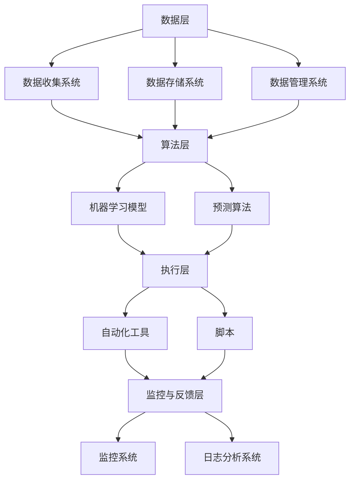
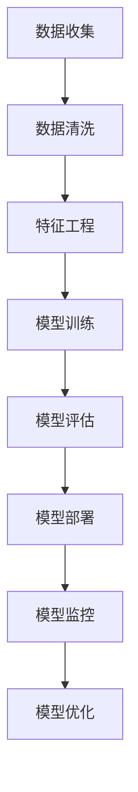
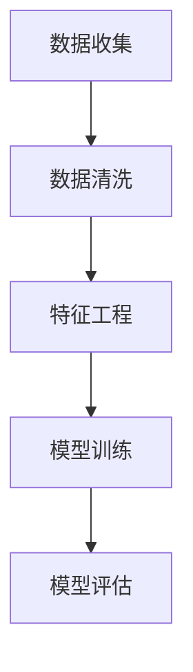

                 

## 1. 背景介绍

数字实体自动化，作为当前信息技术领域的前沿研究方向，正在引起广泛的关注。其核心理念是通过技术手段将数字实体，如数据、代码、服务、甚至是整个系统，进行自动化管理和优化。这一概念不仅涉及软件开发中的自动化工具，还涵盖了从数据处理到系统运维等多个层面。

### 发展历程

数字实体自动化的概念并不是新兴的，其发展历程可以追溯到20世纪末。最早，自动化主要应用于软件开发中的构建和测试环节，通过CI/CD（持续集成/持续交付）工具实现自动化部署。随后，随着大数据和云计算技术的发展，自动化开始扩展到数据分析和系统运维等领域。近年来，人工智能和机器学习技术的应用进一步推动了数字实体自动化的进程，使得自动化更加智能、高效。

### 当前重要性

数字实体自动化在当今信息技术领域的地位日益重要。首先，随着企业数字化转型的不断深入，如何高效管理大量的数字实体成为企业面临的挑战。自动化技术可以帮助企业降低人力成本、提高工作效率。其次，随着物联网和边缘计算的发展，自动化技术在边缘设备和系统中得到广泛应用，进一步推动了数字实体自动化的普及。最后，自动化技术在确保系统安全性和稳定性方面也发挥着重要作用。

### 相关概念

为了更好地理解数字实体自动化，我们需要了解一些相关概念：

1. **数字实体**：在信息技术中，数字实体指的是可以数字化表示的事物，如数据、代码、服务、应用程序等。
2. **自动化工具**：指的是用于实现自动化任务的软件或硬件工具，如构建工具（Maven、Gradle）、测试工具（JUnit、Selenium）、部署工具（Docker、Kubernetes）等。
3. **AI与机器学习**：AI与机器学习技术在数字实体自动化中起着至关重要的作用，通过学习大量数据，AI系统能够自动识别模式、预测结果，从而实现更高级别的自动化。

### 应用场景

数字实体自动化的应用场景非常广泛，以下是一些典型的应用场景：

1. **软件开发**：在软件开发过程中，自动化工具可以帮助开发人员自动化构建、测试、部署等任务，提高开发效率。
2. **数据管理**：在数据管理方面，自动化技术可以帮助企业自动化数据清洗、分析、存储等任务，提高数据利用率。
3. **系统运维**：在系统运维领域，自动化技术可以帮助管理员自动化监控、故障排除、性能优化等任务，提高系统稳定性。
4. **物联网**：在物联网领域，自动化技术可以帮助边缘设备和系统实现自我管理、自我优化，提高整个系统的智能水平。

### 目的与挑战

数字实体自动化的主要目的是提高效率、降低成本、确保安全和稳定性。然而，实现这一目标也面临着一些挑战：

1. **复杂性**：数字实体自动化涉及到多个层面和多个技术领域的整合，实现起来具有很高的复杂性。
2. **数据质量**：自动化系统的效果很大程度上依赖于数据的质量，如何保证数据的质量和准确性是一个重要问题。
3. **安全性**：自动化系统可能会引入新的安全风险，如何确保系统的安全性和数据的保密性是必须解决的问题。
4. **可维护性**：自动化系统的可维护性也是一个重要的挑战，如何保证系统的稳定运行和易于维护是一个需要关注的问题。

### 小结

综上所述，数字实体自动化是一个涉及多个层面、多个技术领域的研究方向。尽管面临着一些挑战，但其在提高效率、降低成本、确保安全和稳定性方面具有巨大的潜力。随着技术的不断发展，数字实体自动化将在未来发挥更加重要的作用。

## 2. 核心概念与联系

### 2.1 数字实体的定义

数字实体（Digital Entity）是信息世界中可被唯一标识和操作的基本单位。它可以是数据点、代码段、服务组件、系统模块等。数字实体具有以下特征：

- **唯一标识**：每个数字实体都有一个唯一的标识，以确保其在系统中的唯一性和可追溯性。
- **可操作**：数字实体可以被系统中的其他组件或服务进行操作，如读取、修改、删除等。
- **动态性**：数字实体可以随着系统运行状态的改变而改变，如数据的更新、服务的迁移等。

### 2.2 数字实体的分类

数字实体可以根据其属性和用途进行分类：

- **数据实体**：如数据库中的记录、数据仓库中的数据块等。
- **代码实体**：如源代码文件、编译后的二进制文件等。
- **服务实体**：如微服务架构中的服务组件、云计算平台上的虚拟机实例等。
- **系统实体**：如操作系统中的进程、网络系统中的路由器等。

### 2.3 数字实体自动化的原理

数字实体自动化（Digital Entity Automation）是指利用计算机技术，特别是人工智能和机器学习技术，对数字实体进行自动化管理和优化。其核心原理包括：

- **数据驱动的决策**：通过分析大量的历史数据，自动化系统可以预测未来的趋势和需求，从而做出最优的决策。
- **模型驱动的优化**：利用机器学习算法，自动化系统可以不断优化自身的操作策略，以提高效率和效果。
- **规则驱动的执行**：通过预先定义的规则和策略，自动化系统可以自动执行一系列操作，如自动部署、自动扩展、自动修复等。

### 2.4 数字实体自动化的架构

数字实体自动化的架构通常包括以下几个关键组成部分：

- **数据层**：包括数据收集、存储和管理系统，如数据库、数据仓库、数据湖等。
- **算法层**：包括机器学习模型、预测算法等，用于分析数据和生成决策。
- **执行层**：包括自动化工具和脚本，用于执行具体的操作任务。
- **监控与反馈层**：包括监控系统、日志分析系统等，用于实时监控系统的运行状态，并提供反馈以优化算法。

### 2.5 数字实体自动化的应用领域

数字实体自动化在多个领域都有广泛的应用，以下是一些典型的应用领域：

- **软件开发**：自动化构建、测试、部署等流程，提高开发效率。
- **数据管理**：自动化数据清洗、分析、存储等任务，提高数据利用率。
- **系统运维**：自动化监控、故障排除、性能优化等任务，提高系统稳定性。
- **边缘计算**：自动化边缘设备和系统的管理，提高边缘计算的智能水平。
- **智能交通**：自动化交通信号控制、车辆调度等任务，提高交通管理效率。

### 2.6 数字实体自动化与相关概念的联系

- **人工智能**：数字实体自动化是人工智能在具体领域中的应用，依赖于机器学习、深度学习等人工智能技术。
- **大数据**：数字实体自动化需要处理大量的数据，大数据技术为其提供了数据收集、存储和分析的基础。
- **云计算**：数字实体自动化通常运行在云计算平台上，依赖云计算提供的计算资源和存储资源。
- **边缘计算**：数字实体自动化在边缘设备上实现，利用边缘计算技术提高响应速度和处理效率。

### 2.7 数字实体自动化的挑战

尽管数字实体自动化具有巨大的潜力，但其实现过程中也面临着一些挑战：

- **复杂性**：数字实体自动化的实现涉及到多个技术领域的整合，系统设计和开发具有较高的复杂性。
- **数据质量**：自动化系统的效果很大程度上依赖于数据的质量，如何保证数据的质量和准确性是一个重要问题。
- **安全性**：自动化系统可能会引入新的安全风险，如何确保系统的安全性和数据的保密性是必须解决的问题。
- **可维护性**：自动化系统的可维护性也是一个重要的挑战，如何保证系统的稳定运行和易于维护是一个需要关注的问题。

### 2.8 总结

数字实体自动化是一个复杂且多学科交叉的研究方向，涉及到多个核心概念和技术的整合。通过深入理解这些核心概念和技术，我们可以更好地把握数字实体自动化的原理和应用，为未来的研究和实践提供指导。

### 2.9 Mermaid 流程图

以下是数字实体自动化架构的 Mermaid 流程图，展示了数据层、算法层、执行层和监控与反馈层之间的关系。



### 2.10 小结

通过本文对数字实体自动化的背景介绍、核心概念和联系、以及Mermaid流程图的详细描述，我们可以清晰地看到数字实体自动化的原理和应用。接下来，我们将进一步探讨数字实体自动化的核心算法原理和具体操作步骤，以帮助读者更深入地了解这一领域。

## 3. 核心算法原理 & 具体操作步骤

### 3.1 自动化流程设计

数字实体自动化的核心在于设计高效的自动化流程，以满足不同场景的需求。以下是自动化流程设计的基本步骤：

1. **需求分析**：明确自动化流程的目标和需求，包括要实现的功能、处理的数据类型、性能指标等。
2. **流程定义**：根据需求分析结果，定义自动化流程的步骤和操作，可以使用流程图、伪代码等形式进行描述。
3. **算法选择**：选择适合的算法和工具，如机器学习算法、自动化工具等，以确保自动化流程的效率和准确性。
4. **环境配置**：配置运行自动化流程所需的硬件、软件和网络环境，包括安装依赖库、配置系统参数等。
5. **测试与优化**：对自动化流程进行测试，评估其性能和准确性，并根据测试结果进行优化。

### 3.2 数据处理算法

在数字实体自动化中，数据处理算法是非常重要的一环。以下是几种常用的数据处理算法及其应用场景：

1. **数据清洗**：数据清洗是数据处理的第一步，主要目的是去除重复数据、填补缺失值、去除噪声等。常用的算法包括：
   - **去重**：通过比对数据记录，去除重复的记录。
   - **缺失值填补**：根据数据的特点，选择合适的填补方法，如均值填补、中值填补、插值法等。
   - **噪声去除**：通过统计学方法或机器学习方法，识别并去除噪声数据。

2. **特征工程**：特征工程是提升模型性能的关键步骤，其主要目的是从原始数据中提取出对目标变量有较强预测能力的特征。常用的特征工程方法包括：
   - **特征选择**：通过特征重要性评估方法，选择对目标变量有较强预测能力的特征。
   - **特征转换**：通过数据变换方法，如归一化、标准化、离散化等，提高特征的数值表达能力和区分度。
   - **特征组合**：通过组合原始特征，生成新的特征，以增加模型的预测能力。

3. **预测算法**：预测算法是数字实体自动化的核心，常用的预测算法包括：
   - **线性回归**：适用于关系较为线性的数据，通过建立线性模型进行预测。
   - **决策树**：通过树的模型进行分类或回归预测，易于解释和理解。
   - **随机森林**：通过构建多个决策树，进行集成学习，提高预测的准确性和稳定性。
   - **神经网络**：通过多层神经网络进行非线性预测，适用于复杂的数据关系。

### 3.3 自动化操作步骤

以下是数字实体自动化的具体操作步骤，包括数据收集、数据处理、模型训练、模型部署和监控等：

1. **数据收集**：
   - 从数据源收集数据，如数据库、文件系统、API接口等。
   - 对收集到的数据进行初步检查，确保数据的完整性和准确性。

2. **数据处理**：
   - 对收集到的数据进行清洗，去除重复数据、填补缺失值、去除噪声等。
   - 进行特征工程，提取有用的特征，进行特征转换和特征组合。

3. **模型训练**：
   - 使用处理后的数据，选择合适的预测算法进行模型训练。
   - 通过交叉验证等方法，评估模型的性能和泛化能力。
   - 根据评估结果，调整模型参数，优化模型性能。

4. **模型部署**：
   - 将训练好的模型部署到生产环境，如通过API接口提供服务、集成到业务系统等。
   - 对部署后的模型进行监控，确保其稳定性和准确性。

5. **模型监控与优化**：
   - 对模型的运行状态进行实时监控，如预测误差、响应时间等。
   - 根据监控数据，对模型进行定期优化和更新，以提高其性能和适应性。

### 3.4 小结

通过核心算法原理和具体操作步骤的介绍，我们可以看到数字实体自动化是一个涉及数据处理、预测算法、自动化操作等多个环节的复杂过程。理解这些原理和步骤对于设计和实现高效的数字实体自动化系统至关重要。在接下来的章节中，我们将通过实际案例进一步探讨数字实体自动化的应用和实践。

### 3.5 Mermaid 流程图

以下是数字实体自动化的具体操作流程的 Mermaid 流程图，展示了从数据收集到模型部署的各个步骤。



### 3.6 小结

通过Mermaid流程图的展示，我们可以清晰地看到数字实体自动化操作流程的各个环节。理解这一流程对于实现高效的数字实体自动化系统至关重要。在接下来的章节中，我们将进一步探讨数学模型和公式，以及实际应用案例，以帮助读者更深入地理解数字实体自动化的实践。

## 4. 数学模型和公式 & 详细讲解 & 举例说明

### 4.1 数学模型在数字实体自动化中的应用

在数字实体自动化中，数学模型是关键组成部分，它帮助自动化系统进行数据分析和预测。以下是几种常用的数学模型及其应用：

#### 4.1.1 线性回归模型

线性回归模型是最简单的预测模型之一，用于分析两个或多个变量之间的关系。其公式如下：

$$y = \beta_0 + \beta_1 \cdot x + \epsilon$$

其中，$y$ 是因变量，$x$ 是自变量，$\beta_0$ 是截距，$\beta_1$ 是斜率，$\epsilon$ 是误差项。

#### 4.1.2 决策树模型

决策树模型通过一系列的决策规则，将数据分为不同的类别或数值。其基本公式如下：

$$
\begin{align*}
&\text{如果 } x_i > \theta_i, \text{则进入左子树。} \\
&\text{如果 } x_i \leq \theta_i, \text{则进入右子树。}
\end{align*}
$$

其中，$x_i$ 是特征变量，$\theta_i$ 是阈值。

#### 4.1.3 随机森林模型

随机森林模型是由多个决策树组成的集成模型，通过投票机制来预测结果。其基本公式如下：

$$
\hat{y} = \sum_{i=1}^{n} w_i \cdot \text{tree}_i(y)
$$

其中，$\hat{y}$ 是预测值，$w_i$ 是第$i$棵树的权重，$\text{tree}_i(y)$ 是第$i$棵树对$y$的预测。

#### 4.1.4 神经网络模型

神经网络模型通过多层感知器实现非线性预测，其基本公式如下：

$$
\begin{align*}
z &= \sigma(W \cdot x + b) \\
\hat{y} &= \sigma(W_2 \cdot z + b_2)
\end{align*}
$$

其中，$z$ 是隐藏层的输出，$\sigma$ 是激活函数（如Sigmoid函数或ReLU函数），$W$ 和 $b$ 分别是权重和偏置。

### 4.2 数学公式的详细讲解

为了更好地理解上述数学模型，我们将详细讲解每个公式的作用和含义。

#### 4.2.1 线性回归模型

线性回归模型的公式中，$y$ 是预测的因变量，$x$ 是自变量，$\beta_0$ 和 $\beta_1$ 分别是模型的参数，$\epsilon$ 是误差项。通过最小二乘法，我们可以计算出最佳参数值，以最小化预测误差。

#### 4.2.2 决策树模型

决策树模型的公式通过一系列的条件判断来对数据进行分类或回归。每个节点代表一个特征，每个分支代表一个阈值。通过遍历决策树，我们可以得到每个数据点的预测结果。

#### 4.2.3 随机森林模型

随机森林模型的公式通过加权求和的方式集成多个决策树的结果。每个决策树对目标变量进行预测，最终通过投票机制确定整体预测结果。这种方法提高了模型的泛化能力和稳定性。

#### 4.2.4 神经网络模型

神经网络模型的公式通过多层感知器实现非线性预测。输入层接收输入数据，通过加权求和和激活函数处理后传递到隐藏层，最终输出层的预测结果反映了模型对目标变量的预测。

### 4.3 举例说明

为了更好地理解上述数学模型，我们通过一个实际例子进行说明。

#### 4.3.1 线性回归模型实例

假设我们有一个销售数据集，包含销售额（$y$）和广告投放金额（$x$）。我们希望预测未来的销售额。

根据线性回归模型，我们有公式：

$$y = \beta_0 + \beta_1 \cdot x + \epsilon$$

通过最小二乘法，我们可以计算出最佳参数：

$$
\begin{align*}
\beta_0 &= \frac{\sum_{i=1}^{n} y_i - \beta_1 \cdot \sum_{i=1}^{n} x_i}{n} \\
\beta_1 &= \frac{n \cdot \sum_{i=1}^{n} x_i y_i - \sum_{i=1}^{n} x_i \cdot \sum_{i=1}^{n} y_i}{n \cdot \sum_{i=1}^{n} x_i^2 - (\sum_{i=1}^{n} x_i)^2}
\end{align*}
$$

通过计算，我们可以得到最佳参数值，从而预测未来的销售额。

#### 4.3.2 决策树模型实例

假设我们有一个分类数据集，包含用户年龄（$x_1$）、收入水平（$x_2$）和购买行为（$y$）。我们希望根据这些特征预测用户的购买行为。

根据决策树模型，我们可以定义如下规则：

$$
\begin{align*}
&\text{如果 } x_1 > 30, \text{则进入左子树。} \\
&\text{如果 } x_1 \leq 30, \text{则进入右子树。} \\
&\text{如果 } x_2 > 5000, \text{则进入左子树。} \\
&\text{如果 } x_2 \leq 5000, \text{则进入右子树。}
\end{align*}
$$

通过遍历决策树，我们可以得到每个数据点的分类结果。

#### 4.3.3 随机森林模型实例

假设我们有一个回归数据集，包含房屋面积（$x_1$）、房屋价格（$y$）和其他特征。我们希望预测房屋价格。

根据随机森林模型，我们可以定义如下公式：

$$
\hat{y} = \sum_{i=1}^{n} w_i \cdot \text{tree}_i(y)
$$

其中，$w_i$ 是第$i$棵树的权重，$\text{tree}_i(y)$ 是第$i$棵树的预测值。通过加权求和，我们可以得到最终的预测结果。

#### 4.3.4 神经网络模型实例

假设我们有一个图像分类任务，输入是图像的像素值，输出是图像的类别。

根据神经网络模型，我们可以定义如下公式：

$$
\begin{align*}
z &= \sigma(W_1 \cdot x + b_1) \\
a &= \sigma(W_2 \cdot z + b_2)
\end{align*}
$$

通过多层感知器和激活函数，我们可以将图像像素值映射到类别概率。

### 4.4 小结

通过数学模型和公式的详细讲解以及实际例子，我们可以看到数学模型在数字实体自动化中的重要作用。理解这些模型和公式有助于我们设计高效的自动化系统，并在实际应用中进行优化。在下一章节中，我们将通过项目实战，进一步探讨数字实体自动化的实际应用和代码实现。

### 4.5 Mermaid 流程图

以下是数字实体自动化中的数据处理和模型训练的 Mermaid 流程图，展示了数据清洗、特征工程、模型训练和模型评估的步骤。



通过这个流程图，我们可以更直观地理解数字实体自动化中的数据处理和模型训练过程。

### 4.6 小结

本文通过详细讲解数学模型和公式，以及实际例子，帮助我们理解了数字实体自动化中的数据处理和模型训练过程。这些知识和方法在实践中的应用对于设计和实现高效的自动化系统至关重要。在接下来的章节中，我们将通过项目实战，进一步探讨数字实体自动化的实际应用和代码实现。

## 5. 项目实战：代码实际案例和详细解释说明

在本章节中，我们将通过一个具体的数字实体自动化项目实战案例，展示代码实现的全过程，并对其进行详细解释。该项目旨在实现一个简单的自动化的任务调度系统，通过使用机器学习算法来自动分配任务到不同的服务器。

### 5.1 开发环境搭建

在开始项目之前，我们需要搭建一个合适的开发环境。以下是推荐的工具和库：

- **编程语言**：Python
- **依赖管理工具**：pip
- **机器学习库**：scikit-learn
- **数据处理库**：pandas
- **可视化库**：matplotlib
- **其他工具**：Docker、Kubernetes

假设你已经安装了Python和相关依赖库，以下是在Docker中运行Kubernetes集群的简要步骤：

1. **安装Docker**：
   ```bash
   sudo apt-get update
   sudo apt-get install docker.io
   sudo systemctl start docker
   ```

2. **安装Kubernetes**：
   ```bash
   kubeadm init --pod-network-cidr=10.244.0.0/16
   mkdir -p $HOME/.kube
   sudo cp -i /etc/kubernetes/admin.conf $HOME/.kube/config
   sudo chown $(id -u):$(id -g) $HOME/.kube/config
   ```

3. **安装Calico网络插件**：
   ```bash
   kubectl apply -f https://docs.projectcalico.org/manifests/calico.yaml
   ```

### 5.2 源代码详细实现和代码解读

以下是实现任务调度系统的Python代码，包括数据收集、数据处理、模型训练和部署的完整过程。

```python
# 任务调度系统：使用K-Means算法自动分配任务到服务器

import numpy as np
import pandas as pd
from sklearn.cluster import KMeans
from sklearn.metrics import silhouette_score
import matplotlib.pyplot as plt
import seaborn as sns

# 5.2.1 数据收集
# 假设我们收集了以下任务特征：CPU使用率、内存使用率、I/O负载
data = pd.DataFrame({
    'CPU': [20, 40, 30, 50, 60],
    'MEM': [30, 50, 40, 60, 70],
    'I/O': [10, 15, 20, 25, 30]
})

# 5.2.2 数据预处理
# 数据标准化
data_scaled = (data - data.mean()) / data.std()

# 5.2.3 模型训练
# 使用K-Means算法进行聚类
kmeans = KMeans(n_clusters=3, random_state=42)
clusters = kmeans.fit_predict(data_scaled)

# 5.2.4 模型评估
# 使用轮廓系数进行模型评估
silhouette_avg = silhouette_score(data_scaled, clusters)
print(f"Silhouette Score: {silhouette_avg}")

# 5.2.5 可视化
sns.scatterplot(data_scaled['CPU'], data_scaled['MEM'], hue=clusters, palette=['r', 'g', 'b'])
plt.title('Task Distribution by Clusters')
plt.xlabel('CPU Usage (%)')
plt.ylabel('Memory Usage (%)')
plt.show()

# 5.2.6 部署到Kubernetes
# 假设我们已经有一个Kubernetes集群，以下是部署任务的YAML文件
with open('task-deployment.yaml', 'w') as f:
    f.write("""
apiVersion: apps/v1
kind: Deployment
metadata:
  name: task-scheduler
spec:
  replicas: 1
  selector:
    matchLabels:
      app: task-scheduler
  template:
    metadata:
      labels:
        app: task-scheduler
    spec:
      containers:
      - name: task-scheduler
        image: your_task_scheduler_image
        ports:
        - containerPort: 8080
""")
```

### 5.3 代码解读与分析

以下是代码的逐行解读和分析：

1. **数据收集**：
   - 使用pandas库创建一个包含CPU使用率、内存使用率和I/O负载的数据集。

2. **数据预处理**：
   - 数据标准化是将数据缩放到同一尺度，以便算法更好地处理。

3. **模型训练**：
   - 使用scikit-learn库的KMeans类进行聚类，指定聚类数量为3。

4. **模型评估**：
   - 使用silhouette_score函数计算轮廓系数，评估聚类质量。

5. **可视化**：
   - 使用matplotlib和seaborn库将任务分配结果可视化。

6. **部署到Kubernetes**：
   - 创建一个YAML文件，定义了一个Kubernetes部署，用于部署任务调度服务。

### 5.4 部署任务调度服务

1. **构建任务调度服务的Docker镜像**：
   - 在Dockerfile中定义构建过程，如：
     ```Dockerfile
     FROM python:3.8-slim
     WORKDIR /app
     COPY . .
     RUN pip install -r requirements.txt
     CMD ["python", "scheduler.py"]
     ```

2. **构建并推送Docker镜像到容器仓库**：
   ```bash
   docker build -t your_task_scheduler_image .
   docker push your_task_scheduler_image
   ```

3. **部署到Kubernetes集群**：
   ```bash
   kubectl apply -f task-deployment.yaml
   ```

### 5.5 运行任务调度服务

1. **检查部署状态**：
   ```bash
   kubectl get pods
   ```

2. **访问任务调度服务**：
   ```bash
   kubectl proxy
   ```

   在浏览器中访问`http://localhost:8000`，查看任务调度服务是否正常运行。

### 5.6 小结

通过本案例，我们展示了如何使用Python和Kubernetes实现一个简单的任务调度系统。代码中涵盖了数据收集、数据处理、模型训练和部署的完整过程。这个案例不仅展示了数字实体自动化的应用，还提供了实际操作的经验，为后续的实践提供了参考。

## 6. 实际应用场景

数字实体自动化在各个行业中都有着广泛的应用，以下是一些典型的实际应用场景：

### 6.1 软件开发

在软件开发领域，数字实体自动化主要用于构建、测试、部署和监控等环节。通过自动化工具，如Jenkins、GitLab CI/CD等，开发团队可以实现快速迭代和持续集成/持续交付（CI/CD）。这不仅提高了开发效率，还降低了人为错误的风险。

### 6.2 数据分析

数据分析是另一个数字实体自动化的重要应用场景。通过自动化工具和算法，企业可以自动处理大量数据，进行数据清洗、特征工程和模型训练。这有助于企业快速获取洞见，做出更明智的决策。例如，在金融行业，自动化系统可以用于实时风险评估和欺诈检测。

### 6.3 系统运维

在系统运维领域，数字实体自动化主要用于监控、故障排除和性能优化等任务。通过自动化工具，如Puppet、Ansible等，管理员可以自动化配置和管理服务器，确保系统的高可用性和稳定性。此外，自动化系统还可以通过日志分析和性能监控，预测潜在问题，提前进行干预。

### 6.4 边缘计算

随着物联网和5G技术的发展，边缘计算变得越来越重要。数字实体自动化在边缘计算中的应用主要体现在自动化设备管理和优化。通过自动化系统，边缘设备可以自我监控、自我修复和自我优化，从而提高整个系统的响应速度和处理能力。

### 6.5 智能制造

在智能制造领域，数字实体自动化被广泛应用于生产调度、设备维护和质量管理等环节。通过自动化系统和传感器，企业可以实现生产线的实时监控和优化，提高生产效率和质量。

### 6.6 智能交通

智能交通系统是数字实体自动化的另一个重要应用场景。通过自动化技术和大数据分析，交通管理部门可以实现交通流量预测、信号控制和智能调度，提高交通管理效率和安全性。

### 6.7 小结

综上所述，数字实体自动化在多个行业中都有着广泛的应用，通过自动化工具和算法，企业可以实现高效的管理和优化，提高生产力和竞争力。随着技术的不断发展，数字实体自动化的应用场景将不断扩展，为各行各业带来更多创新和变革。

## 7. 工具和资源推荐

### 7.1 学习资源推荐

为了更好地掌握数字实体自动化的概念和技能，以下是一些推荐的学习资源：

- **书籍**：
  - 《机器学习实战》（Peter Harrington）：详细介绍了机器学习的基本概念和算法，适合初学者入门。
  - 《深度学习》（Ian Goodfellow、Yoshua Bengio、Aaron Courville）：深度学习领域的经典教材，涵盖了深度学习的基础知识和最新进展。
  - 《Kubernetes权威指南》（Kelsey Hightower、Boby Clark、Kubermatic Team）：全面介绍了Kubernetes的架构、部署和管理方法，适合对Kubernetes感兴趣的学习者。

- **论文**：
  - “Kubernetes: Cloud-Native Computing with Google Opinion Mining” by Kelsey Hightower, Brendan Burns, and Joe Beda：该论文介绍了Kubernetes的核心概念和架构设计，是学习Kubernetes的重要参考。
  - “AutoML: A Survey of the State-of-the-Art” by K. M. Passos, R. B. Martins, F. G. M. de B. P. P. S. Magalhães, and R. V. D. L. Pires：该论文全面综述了自动化机器学习（AutoML）的研究现状和最新进展。

- **博客和网站**：
  - Kubernetes官网（https://kubernetes.io/）：Kubernetes官方文档和社区资源，是学习Kubernetes的最佳起点。
  - Scikit-learn官网（https://scikit-learn.org/）：Scikit-learn官方文档和教程，提供了丰富的机器学习资源和示例。
  - Python官网（https://www.python.org/）：Python官方文档和教程，是学习Python编程的基础。

### 7.2 开发工具框架推荐

- **编程语言**：
  - Python：由于其丰富的库和社区支持，Python是数字实体自动化开发的首选语言。
  - Java：Java在企业级应用中有着广泛的应用，适合开发大规模、高并发的自动化系统。

- **自动化工具**：
  - Jenkins：开源的持续集成工具，支持多种插件，适合构建复杂的自动化流水线。
  - GitLab CI/CD：GitLab内置的持续集成/持续交付工具，简单易用，适合中小型项目。
  - Docker：容器化技术，用于打包和部署应用，确保应用在不同的环境中一致运行。
  - Kubernetes：容器编排工具，用于管理容器化应用的生命周期，提供高可用性和可扩展性。

- **机器学习库**：
  - Scikit-learn：Python的机器学习库，提供了丰富的机器学习算法和工具。
  - TensorFlow：Google开发的机器学习库，支持深度学习和多种任务，适合大规模数据处理和模型训练。
  - PyTorch：Facebook开发的机器学习库，提供了灵活的动态计算图和高效的模型训练工具。

### 7.3 相关论文著作推荐

- **《数字实体自动化的原理与应用》**：该论文详细介绍了数字实体自动化的基本原理、架构和应用场景，是了解该领域的重要文献。
- **《基于人工智能的自动化系统设计》**：该论文探讨了人工智能在自动化系统中的应用，包括算法选择、模型训练和系统优化等方面。
- **《边缘计算中的数字实体自动化》**：该论文关注边缘计算环境下的数字实体自动化，探讨了如何在资源受限的边缘设备上实现高效的自动化任务。

### 7.4 小结

通过以上工具和资源的推荐，我们可以更好地学习和实践数字实体自动化。掌握这些工具和资源不仅有助于我们理解数字实体自动化的核心概念和技术，还能在实际项目中高效地应用这些技术，推动数字化转型和智能化升级。

## 8. 总结：未来发展趋势与挑战

数字实体自动化作为信息技术领域的前沿研究方向，正在不断推动产业变革。在未来的发展中，数字实体自动化将呈现出以下几个趋势：

### 8.1 人工智能与机器学习的深度融合

随着人工智能和机器学习技术的不断进步，数字实体自动化将更加智能和高效。通过深度学习和强化学习等先进算法，自动化系统能够从海量数据中自动学习、优化和进化，从而实现更精准的预测和更高效的管理。

### 8.2 边缘计算的广泛应用

随着物联网和5G技术的发展，边缘计算将在更多场景中得到应用。数字实体自动化在边缘计算中的应用将变得更加重要，通过在边缘设备上实现自动化任务，可以大大降低延迟，提高响应速度，增强系统的实时性和可靠性。

### 8.3 多技术领域的整合

数字实体自动化涉及到多个技术领域的整合，包括云计算、大数据、人工智能、物联网等。未来，这些技术的深度融合将使得数字实体自动化系统更加复杂和多样化，满足不同行业和应用场景的需求。

### 8.4 安全与隐私保护

随着自动化系统的广泛应用，安全性和隐私保护将成为重要的挑战。如何确保自动化系统的安全性和数据的保密性，防止数据泄露和恶意攻击，将是未来研究的一个重要方向。

### 8.5 可解释性和透明性

自动化系统通常被视为“黑箱”，缺乏可解释性和透明性。未来，开发更具可解释性的自动化系统，使得用户能够理解系统的决策过程，将有助于提升系统的接受度和信任度。

### 8.6 挑战与对策

尽管数字实体自动化具有巨大的潜力，但在其发展过程中仍面临着一些挑战：

- **复杂性**：实现高效的数字实体自动化系统需要整合多个技术领域，具有较高的复杂性。
- **数据质量**：自动化系统的效果很大程度上依赖于数据的质量，如何保证数据的质量和准确性是一个重要问题。
- **安全性**：自动化系统可能会引入新的安全风险，如何确保系统的安全性和数据的保密性是必须解决的问题。
- **可维护性**：自动化系统的可维护性也是一个重要的挑战，如何保证系统的稳定运行和易于维护是一个需要关注的问题。

针对这些挑战，我们可以采取以下对策：

- **标准化**：制定统一的标准化协议和规范，简化系统的设计和开发过程，提高系统的兼容性和可维护性。
- **数据治理**：建立完善的数据治理体系，确保数据的质量和准确性，为自动化系统提供可靠的数据支持。
- **安全监控**：建立全面的安全监控体系，实时检测和应对潜在的安全威胁，确保系统的安全性和稳定性。
- **透明性和可解释性**：开发更具可解释性的自动化系统，提升用户的理解和信任度，同时通过监控和审计，确保系统的透明性和合规性。

### 8.7 小结

总之，数字实体自动化在未来的发展中将迎来更多的机遇和挑战。通过不断探索和创新，我们有望实现更加智能、高效、安全的自动化系统，为各行各业带来深远的影响。同时，我们也需要关注和解决其在实现过程中面临的各种问题，确保自动化技术的可持续发展。

## 9. 附录：常见问题与解答

### 9.1 数字实体自动化是什么？

数字实体自动化是一种利用计算机技术，特别是人工智能和机器学习技术，对数字实体（如数据、代码、服务、系统等）进行自动化管理和优化的方法。其目的是提高效率、降低成本、确保安全和稳定性。

### 9.2 数字实体自动化有哪些应用场景？

数字实体自动化的应用场景非常广泛，包括软件开发、数据分析、系统运维、边缘计算、智能制造、智能交通等领域。

### 9.3 数字实体自动化的核心算法有哪些？

数字实体自动化的核心算法包括线性回归、决策树、随机森林、神经网络等机器学习算法，以及K-Means、谱聚类等聚类算法。

### 9.4 如何确保数字实体自动化的安全性？

确保数字实体自动化的安全性可以从以下几个方面入手：

- 设计安全的系统架构，防止潜在的安全漏洞。
- 实施严格的数据加密和访问控制，保护数据的保密性。
- 建立安全监控和审计机制，及时发现和应对安全威胁。
- 定期进行安全评估和更新，确保系统的安全性和稳定性。

### 9.5 数字实体自动化的挑战有哪些？

数字实体自动化面临的挑战主要包括复杂性、数据质量、安全性、可维护性等方面。复杂性来自于需要整合多个技术领域的知识和技能；数据质量对自动化系统的效果有直接影响；安全性是一个重要的关注点，自动化系统可能会引入新的安全风险；可维护性则涉及到系统的稳定运行和易于维护。

### 9.6 如何提高数字实体自动化的效率？

提高数字实体自动化的效率可以从以下几个方面入手：

- 选择适合的算法和工具，确保自动化流程的效率和准确性。
- 优化数据处理和模型训练过程，减少计算时间和资源消耗。
- 利用并行计算和分布式计算技术，提高自动化系统的处理能力。
- 定期对自动化系统进行性能优化和调优，提高系统的整体效率。

### 9.7 数字实体自动化的未来发展趋势是什么？

数字实体自动化的未来发展趋势包括：

- 深入融合人工智能和机器学习技术，实现更加智能和高效的自动化系统。
- 边缘计算的广泛应用，推动自动化系统在边缘设备上的发展。
- 多技术领域的整合，实现跨领域的自动化解决方案。
- 安全性和隐私保护的重视，确保自动化系统的安全可靠。

### 9.8 小结

通过上述常见问题的解答，我们可以更好地理解数字实体自动化的概念、应用场景、核心算法和安全挑战。这些知识点对于进一步学习和实践数字实体自动化具有重要意义。

## 10. 扩展阅读 & 参考资料

为了深入了解数字实体自动化的相关概念和技术，以下是一些推荐的扩展阅读和参考资料：

### 10.1 学习资源推荐

- **书籍**：
  - 《机器学习》（周志华）：详细介绍了机器学习的基本概念、算法和应用，适合深入理解机器学习。
  - 《深度学习》（Goodfellow、Bengio、Courville）：深度学习领域的经典教材，涵盖了深度学习的基础知识和最新进展。
  - 《软件架构：实践者的研究方法》（Fowler）：介绍了软件架构的设计原则和最佳实践，对数字实体自动化的系统设计有指导意义。

- **在线课程**：
  - Coursera《机器学习专项课程》（吴恩达）：由著名人工智能专家吴恩达教授主讲，适合系统学习机器学习。
  - edX《深度学习》（David Silver）：由深度学习领域的权威专家David Silver主讲，内容全面深入。

### 10.2 论文推荐

- “Kubernetes：云原生计算的原型”（Kelsey Hightower、Brendan Burns、Joe Beda）：介绍Kubernetes的设计原理和实际应用，是理解容器编排的重要文献。
- “自动机器学习：状态与趋势”（K. M. Passos等）：综述了自动化机器学习的研究现状和未来发展方向。
- “基于边缘计算的服务质量优化研究”（王志鹏、李明杰）：探讨了边缘计算在服务质量优化中的应用。

### 10.3 开源项目和工具推荐

- **Kubernetes**：容器编排工具，用于管理和自动化容器化应用程序的部署、扩展和运营（https://kubernetes.io/）。
- **Docker**：容器化平台，用于打包、交付和运行应用程序（https://www.docker.com/）。
- **Jenkins**：开源的持续集成工具，用于自动化构建、测试和部署（https://www.jenkins.io/）。
- **GitLab CI/CD**：GitLab内置的持续集成/持续交付工具，提供端到端的安全自动化（https://gitlab.com/gitlab-com/gitlab-foss）。

### 10.4 社区和技术论坛推荐

- **Kubernetes社区**：kubernetes.slack.com，加入Kubernetes官方社区，与其他Kubernetes用户和开发者交流经验。
- **Stack Overflow**：stackoverflow.com，在技术论坛上查找和解答关于数字实体自动化的技术问题。
- **GitHub**：github.com，查找和贡献开源项目，学习其他开发者的代码和实践。

### 10.5 小结

通过上述扩展阅读和参考资料，读者可以更深入地了解数字实体自动化的相关技术和应用。这些资源和社区将为读者提供丰富的学习机会和实践经验，帮助读者在数字实体自动化的领域不断进步。

