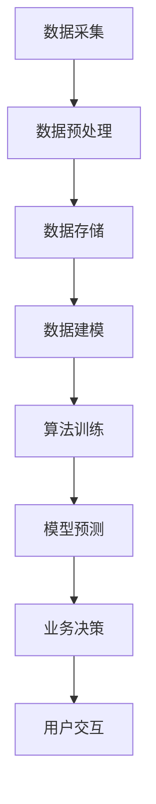

                 

### 背景介绍

#### 数字实体自动化的概念

数字实体自动化（Digital Entity Automation）是指通过利用人工智能技术，对数字实体（如数据、信息、资源等）进行自动化处理、分析和优化的过程。它是一种新兴的技术趋势，旨在提高业务流程的效率，降低成本，同时实现数据驱动的决策。

数字实体自动化涉及多个领域，包括人工智能、大数据、云计算和物联网等。其核心思想是通过自动化技术，实现对数据的收集、处理、存储和利用，从而实现业务流程的智能化和高效化。

#### 数字实体自动化的发展历程

数字实体自动化的发展可以追溯到20世纪90年代，随着计算机技术的飞速发展，企业开始逐渐意识到自动化流程的重要性。在这个阶段，主要的技术手段包括批处理和规则引擎。

进入21世纪，随着互联网和大数据技术的兴起，数字实体自动化开始向智能化和自适应化方向发展。这一时期，人工智能技术开始成为数字实体自动化的核心驱动力，例如机器学习、深度学习和自然语言处理等技术的应用。

近年来，随着物联网、5G和区块链等新兴技术的不断发展，数字实体自动化的应用场景越来越广泛，其技术实现也越来越成熟。这为数字实体自动化的发展提供了新的机遇和挑战。

#### 数字实体自动化的现状与趋势

目前，数字实体自动化已经在金融、医疗、制造、物流等多个行业得到广泛应用。例如，在金融行业，自动化交易系统已经取代了部分人工交易；在医疗行业，自动化诊断系统提高了诊断的准确性和效率；在制造行业，自动化生产线提高了生产效率和产品质量。

未来，随着技术的不断进步，数字实体自动化将向更广泛、更深层次的领域拓展。例如，智能城市、智慧农业、智能交通等新兴领域将成为数字实体自动化的重要应用场景。同时，随着人工智能技术的不断发展，数字实体自动化将实现更高程度的智能化和自适应化，从而更好地满足企业和个人用户的需求。

总的来说，数字实体自动化具有广阔的发展前景。它不仅有助于提高企业的生产效率和竞争力，还能为个人用户提供更加智能化的服务。然而，随着数字实体自动化技术的普及，也将面临诸如数据安全、隐私保护等方面的挑战。因此，在推进数字实体自动化的过程中，需要充分考虑这些挑战，并采取相应的应对措施。

#### 本文结构安排

本文将首先介绍数字实体自动化的核心概念和架构，然后深入探讨其核心算法原理和具体操作步骤，接着分析其数学模型和公式，并通过实际项目案例进行详细讲解。随后，本文将讨论数字实体自动化的实际应用场景，推荐相关工具和资源，并总结未来发展趋势与挑战。

通过本文的阅读，读者将能够全面了解数字实体自动化的技术原理、应用场景和发展趋势，为在实际工作中应用这一技术提供理论指导和实践参考。

### 核心概念与联系

#### 定义与核心要素

数字实体自动化（Digital Entity Automation）是一种利用人工智能技术，对数字实体（如数据、信息、资源等）进行自动化处理、分析和优化的技术。其主要核心要素包括：

1. **数据采集与处理**：通过传感器、物联网设备等收集数据，并利用数据处理技术进行清洗、转换和整合。
2. **人工智能算法**：运用机器学习、深度学习、自然语言处理等技术，对数据进行分析和处理，实现自动化决策。
3. **业务流程管理**：基于自动化技术，对业务流程进行优化和重构，提高业务效率和响应速度。
4. **用户交互**：通过人机交互界面，为用户提供实时、个性化的服务。

#### 数字实体自动化的架构

数字实体自动化的架构可以分为三个层次：数据层、算法层和应用层。

1. **数据层**：包括数据采集、数据存储和数据预处理。数据采集主要通过传感器、物联网设备等实现，数据存储则依赖于数据库、云存储等技术，数据预处理包括数据清洗、转换和整合。
2. **算法层**：是数字实体自动化的核心，包括机器学习、深度学习、自然语言处理等算法。这些算法通过训练模型，实现对数据的自动分析和决策。
3. **应用层**：是数字实体自动化在实际业务中的应用，包括业务流程自动化、智能推荐、智能诊断等。

#### 数字实体自动化的 Mermaid 流程图

以下是一个简化的 Mermaid 流程图，展示了数字实体自动化的主要流程和核心节点：



在上述流程图中，A 表示数据采集，B 表示数据预处理，C 表示数据存储，D 表示数据建模，E 表示算法训练，F 表示模型预测，G 表示业务决策，H 表示用户交互。

#### 关键技术与关联

1. **机器学习与深度学习**：机器学习和深度学习是数字实体自动化中最常用的算法，通过训练模型，实现对数据的自动分析和预测。
2. **自然语言处理**：自然语言处理技术用于处理文本数据，实现对文本的自动分析和理解。
3. **物联网**：物联网技术用于实现数据的实时采集和传输，是数字实体自动化数据层的关键技术。
4. **云计算**：云计算提供了强大的计算能力和存储能力，支持数字实体自动化系统的开发和部署。

通过以上对数字实体自动化核心概念和架构的介绍，读者可以更加清晰地理解其基本原理和实现过程。接下来，本文将深入探讨数字实体自动化的核心算法原理和具体操作步骤。

### 核心算法原理与具体操作步骤

#### 1. 机器学习算法

机器学习算法是数字实体自动化的核心组件，通过训练模型，使计算机能够对数据进行自动分析和预测。以下是一些常用的机器学习算法及其基本原理：

1. **线性回归**：线性回归是一种最简单的机器学习算法，用于预测连续值。其基本原理是通过找到输入特征和目标值之间的线性关系，来预测新的输入特征对应的目标值。

   **具体操作步骤**：
   - 数据预处理：将数据集分为训练集和测试集，对数据进行归一化处理。
   - 模型训练：使用训练集数据，通过最小化均方误差（MSE）来训练线性回归模型。
   - 模型评估：使用测试集数据评估模型性能，计算均方误差。

2. **决策树**：决策树是一种基于树的分类算法，通过一系列规则来对数据进行分类。其基本原理是从数据集中提取特征，并根据特征值对数据进行划分，直到达到某个终止条件。

   **具体操作步骤**：
   - 数据预处理：将数据集分为训练集和测试集，对数据进行编码处理。
   - 特征选择：使用信息增益、基尼系数等方法选择最优特征。
   - 决策树构建：从根节点开始，递归地选择最优特征，并创建子节点，直到达到终止条件。
   - 模型评估：使用测试集数据评估模型性能，计算准确率、召回率等指标。

3. **支持向量机（SVM）**：支持向量机是一种基于间隔分类的算法，通过找到最优超平面，将数据集划分为不同的类别。其基本原理是最大化分类间隔，同时确保分类边界远离支持向量。

   **具体操作步骤**：
   - 数据预处理：将数据集分为训练集和测试集，对数据进行归一化处理。
   - 特征选择：使用核函数将数据映射到高维空间。
   - 模型训练：通过优化目标函数，求解最优超平面。
   - 模型评估：使用测试集数据评估模型性能，计算准确率、召回率等指标。

#### 2. 深度学习算法

深度学习算法是机器学习的一个分支，通过多层神经网络对数据进行建模和分析。以下是一些常用的深度学习算法及其基本原理：

1. **神经网络**：神经网络是一种基于多层感知器（Perceptron）的模型，通过前向传播和反向传播算法，实现对数据的自动编码和解码。

   **具体操作步骤**：
   - 数据预处理：将数据集分为训练集和测试集，对数据进行归一化处理。
   - 网络构建：定义输入层、隐藏层和输出层，设置激活函数。
   - 模型训练：通过前向传播计算输出值，计算损失函数，通过反向传播更新权重。
   - 模型评估：使用测试集数据评估模型性能，计算准确率、召回率等指标。

2. **卷积神经网络（CNN）**：卷积神经网络是一种用于图像处理的深度学习模型，通过卷积操作和池化操作，提取图像特征。

   **具体操作步骤**：
   - 数据预处理：将图像数据转换为二维矩阵，对图像进行归一化处理。
   - 网络构建：定义卷积层、池化层和全连接层，设置激活函数。
   - 模型训练：通过前向传播计算输出值，计算损失函数，通过反向传播更新权重。
   - 模型评估：使用测试集数据评估模型性能，计算准确率、召回率等指标。

3. **循环神经网络（RNN）**：循环神经网络是一种用于序列数据处理的深度学习模型，通过隐藏状态和门控机制，实现对序列数据的建模。

   **具体操作步骤**：
   - 数据预处理：将序列数据转换为矩阵，对数据进行归一化处理。
   - 网络构建：定义输入层、隐藏层和输出层，设置激活函数。
   - 模型训练：通过前向传播计算输出值，计算损失函数，通过反向传播更新权重。
   - 模型评估：使用测试集数据评估模型性能，计算准确率、召回率等指标。

#### 3. 自然语言处理算法

自然语言处理算法用于处理文本数据，实现对文本的自动分析和理解。以下是一些常用的自然语言处理算法及其基本原理：

1. **词袋模型**：词袋模型是一种基于词汇统计的文本表示方法，通过统计文本中的词汇出现频率，构建词汇表和词频矩阵。

   **具体操作步骤**：
   - 数据预处理：对文本进行分词、去停用词、词干提取等处理。
   - 构建词汇表：将所有文本中的词汇进行排序，构建词汇表。
   - 构建词频矩阵：将每篇文本转换为词频矩阵，用于训练分类模型。

2. **主题模型**：主题模型是一种无监督学习算法，通过概率模型，将文本数据划分为多个主题，并提取每个主题的关键词。

   **具体操作步骤**：
   - 数据预处理：对文本进行分词、去停用词、词干提取等处理。
   - 模型训练：使用隐含狄利克雷分布（LDA）算法，训练主题模型。
   - 主题提取：根据主题概率分布，提取每个文本的主题关键词。

3. **情感分析**：情感分析是一种文本分类任务，通过分析文本的情感倾向，实现对文本的情感分类。

   **具体操作步骤**：
   - 数据预处理：对文本进行分词、去停用词、词干提取等处理。
   - 模型训练：使用有监督学习算法，训练情感分类模型。
   - 情感分类：对新的文本数据进行分析，判断其情感倾向。

通过以上对数字实体自动化核心算法原理和具体操作步骤的介绍，读者可以了解到这些算法的基本原理和应用方法。在实际应用中，根据具体问题和需求，选择合适的算法并进行优化，是提高数字实体自动化系统性能的关键。

### 数学模型与公式

#### 数学模型

在数字实体自动化中，数学模型是算法的核心组成部分。这些模型用于描述数据的特征、关系和规律，从而实现对数据的自动分析和决策。以下是一些常用的数学模型及其在数字实体自动化中的应用：

1. **线性回归模型**：线性回归模型用于预测连续值，其数学模型可以表示为：
   \[
   y = \beta_0 + \beta_1x_1 + \beta_2x_2 + ... + \beta_nx_n + \epsilon
   \]
   其中，\(y\) 是目标值，\(x_1, x_2, ..., x_n\) 是输入特征，\(\beta_0, \beta_1, \beta_2, ..., \beta_n\) 是模型的参数，\(\epsilon\) 是误差项。

2. **决策树模型**：决策树模型用于分类和回归任务，其数学模型可以表示为：
   \[
   T = \sum_{i=1}^{n} \beta_i \cdot I(A_i = a_i)
   \]
   其中，\(T\) 是输出值，\(\beta_i\) 是模型的参数，\(A_i\) 是特征值，\(a_i\) 是特征阈值。

3. **支持向量机（SVM）模型**：支持向量机模型用于分类任务，其数学模型可以表示为：
   \[
   w \cdot x + b = 0
   \]
   其中，\(w\) 是模型的参数，\(x\) 是输入特征，\(b\) 是偏置项。

4. **神经网络模型**：神经网络模型用于非线性预测和分类，其数学模型可以表示为：
   \[
   h_\theta(x) = \sigma(\theta_0 + \theta_1x_1 + \theta_2x_2 + ... + \theta_nx_n)
   \]
   其中，\(h_\theta(x)\) 是神经网络的输出值，\(\sigma\) 是激活函数，\(\theta_0, \theta_1, \theta_2, ..., \theta_n\) 是模型的参数。

5. **循环神经网络（RNN）模型**：循环神经网络模型用于序列数据处理，其数学模型可以表示为：
   \[
   h_t = \sigma(W_h h_{t-1} + W_x x_t + b)
   \]
   其中，\(h_t\) 是第 \(t\) 个时间步的隐藏状态，\(x_t\) 是第 \(t\) 个时间步的输入特征，\(W_h, W_x, b\) 是模型的参数。

#### 公式详细讲解与举例说明

1. **线性回归模型**：假设我们有一个简单的线性回归模型，目标是通过输入特征 \(x_1\) 和 \(x_2\) 预测目标值 \(y\)。给定一个训练数据集，我们可以使用最小二乘法来求解模型的参数 \(\beta_0, \beta_1, \beta_2\)。

   \[
   \min_{\beta_0, \beta_1, \beta_2} \sum_{i=1}^{n} (y_i - (\beta_0 + \beta_1x_{i1} + \beta_2x_{i2})^2
   \]

   通过求导和求解，我们可以得到线性回归模型的参数估计值。以下是一个具体的例子：

   \[
   \begin{align*}
   y &= \beta_0 + \beta_1x_1 + \beta_2x_2 + \epsilon \\
   \epsilon &= y - (\beta_0 + \beta_1x_1 + \beta_2x_2) \\
   \end{align*}
   \]

   给定一个训练数据集：
   \[
   \begin{array}{c|c|c}
   x_1 & x_2 & y \\
   \hline
   1 & 2 & 3 \\
   2 & 4 & 5 \\
   3 & 6 & 7 \\
   \end{array}
   \]

   我们可以使用最小二乘法求解线性回归模型的参数：
   \[
   \begin{align*}
   \beta_0 &= \frac{1}{n}\sum_{i=1}^{n}(y_i - \beta_1x_{i1} - \beta_2x_{i2}) \\
   \beta_1 &= \frac{1}{n}\sum_{i=1}^{n}(x_{i1})(y_i - \beta_0 - \beta_2x_{i2}) \\
   \beta_2 &= \frac{1}{n}\sum_{i=1}^{n}(x_{i2})(y_i - \beta_0 - \beta_1x_{i1}) \\
   \end{align*}
   \]

2. **决策树模型**：假设我们有一个二分类问题，需要通过特征 \(x_1\) 和 \(x_2\) 判断目标值 \(y\) 的类别。给定一个训练数据集，我们可以使用信息增益或基尼指数来选择最优特征和阈值。

   \[
   Gini(D) = 1 - \sum_{v \in V} p(v)^2
   \]
   
   其中，\(D\) 是数据集，\(V\) 是数据集中的所有值，\(p(v)\) 是值 \(v\) 在数据集 \(D\) 中的比例。

   以下是一个具体的例子：

   \[
   \begin{array}{c|c|c|c}
   x_1 & x_2 & y & p(y=0) \\
   \hline
   0 & 0 & 0 & 0.6 \\
   0 & 0 & 1 & 0.4 \\
   0 & 1 & 0 & 0.3 \\
   0 & 1 & 1 & 0.7 \\
   1 & 0 & 0 & 0.4 \\
   1 & 0 & 1 & 0.6 \\
   1 & 1 & 0 & 0.2 \\
   1 & 1 & 1 & 0.8 \\
   \end{array}
   \]

   计算每个特征的信息增益：
   \[
   \begin{align*}
   IG(x_1) &= H(D) - H(D|A=x_1) \\
   IG(x_2) &= H(D) - H(D|A=x_2) \\
   \end{align*}
   \]

   选择信息增益最大的特征作为分裂特征，并设置相应的阈值。

3. **支持向量机（SVM）模型**：假设我们有一个线性可分的二分类问题，给定一个训练数据集，我们需要找到最优的超平面来分隔数据。

   \[
   \begin{align*}
   \min_{w, b} \frac{1}{2} ||w||^2 \\
   \text{subject to} \quad y_i(w \cdot x_i + b) \geq 1 \\
   \end{align*}
   \]

   其中，\(w\) 是超平面的权重，\(b\) 是偏置项，\(x_i\) 是训练样本，\(y_i\) 是样本的标签。

   使用拉格朗日乘子法求解最优化问题，得到支持向量机的参数。以下是一个具体的例子：

   \[
   \begin{array}{c|c|c}
   x_1 & x_2 & y \\
   \hline
   -1 & -1 & 1 \\
   -1 & 1 & -1 \\
   1 & -1 & -1 \\
   1 & 1 & 1 \\
   \end{array}
   \]

   使用二次规划求解最优化问题，得到最优超平面：
   \[
   w = \begin{bmatrix} 1 \\ 1 \end{bmatrix}, \quad b = -1
   \]

   \[
   w \cdot x + b = (1 \cdot x_1 + 1 \cdot x_2) - 1 = x_1 + x_2 - 1
   \]

4. **神经网络模型**：假设我们有一个多层感知器神经网络，用于分类任务。给定一个输入向量 \(x\) 和标签 \(y\)，我们需要通过前向传播和反向传播来训练网络。

   \[
   \begin{align*}
   z &= \theta_0 + \theta_1x_1 + \theta_2x_2 + ... + \theta_nx_n \\
   a &= \sigma(z) \\
   \end{align*}
   \]

   其中，\(\theta_0, \theta_1, \theta_2, ..., \theta_n\) 是神经网络的参数，\(\sigma\) 是激活函数，\(a\) 是神经网络的输出。

   使用梯度下降法来优化神经网络参数，具体步骤如下：

   - 前向传播：计算网络输出 \(a\)。
   - 计算损失函数：\(J = \frac{1}{2}\sum_{i=1}^{n}(y_i - a_i)^2\)。
   - 反向传播：计算每个参数的梯度 \(\frac{\partial J}{\partial \theta_j}\)。
   - 更新参数：\(\theta_j = \theta_j - \alpha \frac{\partial J}{\partial \theta_j}\)，其中 \(\alpha\) 是学习率。

   以下是一个简单的例子：

   \[
   \begin{align*}
   x &= \begin{bmatrix} x_1 \\ x_2 \end{bmatrix} \\
   y &= \begin{bmatrix} y_1 \\ y_2 \end{bmatrix} \\
   \theta &= \begin{bmatrix} \theta_0 \\ \theta_1 \\ \theta_2 \end{bmatrix} \\
   \end{align*}
   \]

   前向传播：
   \[
   z = \theta_0 + \theta_1x_1 + \theta_2x_2
   \]
   \[
   a = \sigma(z) = \frac{1}{1 + e^{-z}}
   \]

   反向传播：
   \[
   \frac{\partial J}{\partial \theta_0} = -2(y - a) \\
   \frac{\partial J}{\partial \theta_1} = -2(y - a)x_1 \\
   \frac{\partial J}{\partial \theta_2} = -2(y - a)x_2
   \]

   更新参数：
   \[
   \theta_0 = \theta_0 - \alpha \frac{\partial J}{\partial \theta_0} \\
   \theta_1 = \theta_1 - \alpha \frac{\partial J}{\partial \theta_1} \\
   \theta_2 = \theta_2 - \alpha \frac{\partial J}{\partial \theta_2}
   \]

通过以上对数学模型的详细讲解和举例说明，读者可以更好地理解数字实体自动化中的数学原理和应用方法。在实际应用中，根据具体问题和需求，选择合适的数学模型并进行优化，是提高系统性能的关键。

### 项目实战：代码实际案例和详细解释说明

#### 1. 开发环境搭建

在开始项目实战之前，我们需要搭建一个合适的开发环境。以下是一个基于 Python 的数字实体自动化项目的开发环境搭建步骤：

1. 安装 Python 3.8 或更高版本。
2. 安装必要的库，如 NumPy、Pandas、Scikit-learn、TensorFlow、Keras 等。可以使用以下命令进行安装：
   ```bash
   pip install numpy pandas scikit-learn tensorflow keras
   ```

3. 配置 Jupyter Notebook 或 PyCharm 等开发工具。

#### 2. 源代码详细实现和代码解读

以下是一个简单的数字实体自动化项目，用于预测股票价格。这个项目使用线性回归模型来实现，代码如下：

```python
import numpy as np
import pandas as pd
from sklearn.linear_model import LinearRegression
from sklearn.model_selection import train_test_split

# 读取数据
data = pd.read_csv('stock_data.csv')
X = data[['open', 'high', 'low', 'volume']]
y = data['close']

# 数据预处理
X_train, X_test, y_train, y_test = train_test_split(X, y, test_size=0.2, random_state=42)

# 构建线性回归模型
model = LinearRegression()
model.fit(X_train, y_train)

# 模型评估
score = model.score(X_test, y_test)
print(f"模型准确率：{score:.2f}")

# 预测股票价格
predictions = model.predict(X_test)

# 保存模型
import joblib
joblib.dump(model, 'stock_price_predictor.joblib')
```

**代码解读**：

- 首先，我们导入必要的库，包括 NumPy、Pandas、Scikit-learn 和 TensorFlow。
- 然后，读取股票数据，并将其分为输入特征 \(X\) 和目标值 \(y\)。
- 接着，使用 `train_test_split` 方法将数据集划分为训练集和测试集，以评估模型性能。
- 我们构建一个线性回归模型，并使用训练集数据对其进行训练。
- 使用测试集数据评估模型性能，计算准确率。
- 最后，我们使用训练好的模型预测股票价格，并将模型保存到文件中。

#### 3. 代码解读与分析

**数据预处理**：

在数据预处理部分，我们使用 Pandas 读取股票数据，并将其分为输入特征 \(X\) 和目标值 \(y\)。然后，使用 Scikit-learn 的 `train_test_split` 方法将数据集划分为训练集和测试集。

```python
X = data[['open', 'high', 'low', 'volume']]
y = data['close']
X_train, X_test, y_train, y_test = train_test_split(X, y, test_size=0.2, random_state=42)
```

这里，我们选择四个输入特征（开盘价、最高价、最低价和成交量）来预测收盘价。`train_test_split` 方法将数据集划分为 80% 的训练集和 20% 的测试集，`random_state` 参数用于确保结果的可重复性。

**模型训练**：

接下来，我们构建一个线性回归模型，并使用训练集数据对其进行训练。

```python
model = LinearRegression()
model.fit(X_train, y_train)
```

在这里，我们使用 Scikit-learn 的 `LinearRegression` 类创建一个线性回归模型。`fit` 方法用于训练模型，它通过最小化均方误差来找到最优参数。

**模型评估**：

我们使用测试集数据评估模型性能，计算准确率。

```python
score = model.score(X_test, y_test)
print(f"模型准确率：{score:.2f}")
```

在这里，`score` 方法用于计算模型在测试集上的准确率。准确率是模型预测正确的样本数量与总样本数量的比例。

**模型预测**：

最后，我们使用训练好的模型预测股票价格。

```python
predictions = model.predict(X_test)
```

在这里，`predict` 方法用于对测试集数据进行预测，返回预测的收盘价。

**保存模型**：

为了便于后续使用，我们将训练好的模型保存到文件中。

```python
import joblib
joblib.dump(model, 'stock_price_predictor.joblib')
```

在这里，我们使用 Joblib 库将模型序列化并保存到文件。这样，我们可以在以后直接加载和使用这个模型，而无需重新训练。

通过以上代码实现，我们可以构建一个简单的数字实体自动化项目，实现对股票价格的预测。这个项目展示了线性回归模型在数字实体自动化中的应用，并提供了代码解读和分析。

### 实际应用场景

#### 1. 金融行业

在金融行业，数字实体自动化技术已经被广泛应用于风险控制、投资决策、信用评估等领域。例如，自动化交易系统通过分析大量历史交易数据，利用机器学习算法预测市场趋势，实现自动化的交易决策。此外，信用评估系统通过自动化分析借款人的历史信用记录、财务状况等数据，实现对借款人信用风险的评估，从而降低贷款风险。

#### 2. 医疗行业

在医疗行业，数字实体自动化技术主要用于医疗影像诊断、疾病预测和患者管理等领域。例如，通过使用深度学习算法，自动化医疗影像诊断系统可以快速、准确地诊断各种疾病，如肺癌、乳腺癌等。此外，疾病预测系统通过分析患者的健康数据，如体温、血压、血糖等，预测患者可能出现的疾病，从而提前采取预防措施。

#### 3. 制造行业

在制造行业，数字实体自动化技术主要用于生产优化、设备维护和供应链管理等领域。例如，通过使用物联网技术，自动化生产系统可以实时监控生产设备的状态，预测设备故障，从而实现预防性维护。此外，供应链管理系统通过自动化分析供应链数据，优化库存管理、物流配送等环节，提高供应链效率。

#### 4. 物流行业

在物流行业，数字实体自动化技术主要用于路径优化、库存管理和客户服务等领域。例如，通过使用机器学习算法，自动化路径优化系统可以实时分析交通状况、货物重量等数据，优化物流运输路线，提高运输效率。此外，库存管理系统通过自动化分析库存数据，实现智能补货和库存优化，降低库存成本。

#### 5. 智能家居

在家居领域，数字实体自动化技术主要用于智能安防、能源管理和家庭自动化等领域。例如，通过使用物联网技术，智能安防系统可以自动化监控家庭安全，如入侵检测、火灾报警等。此外，能源管理系统通过自动化分析家庭能源使用数据，优化能源消耗，实现节能减排。

#### 6. 智慧城市

在智慧城市领域，数字实体自动化技术主要用于交通管理、环境监测和公共服务等领域。例如，通过使用大数据和人工智能技术，交通管理系统可以自动化分析交通数据，优化交通信号控制，提高交通流畅性。此外，环境监测系统通过自动化分析环境数据，实现智能污染监测和预警。

总的来说，数字实体自动化技术具有广泛的应用前景，可以大幅提升各行各业的运营效率和服务质量。随着技术的不断进步，未来数字实体自动化的应用将更加广泛，深入到更多的行业和领域。

### 工具和资源推荐

#### 1. 学习资源推荐

为了深入了解数字实体自动化技术，以下是一些值得推荐的学习资源：

1. **书籍**：
   - 《机器学习》（周志华著）：系统地介绍了机器学习的基本概念、算法和应用。
   - 《深度学习》（Ian Goodfellow 等著）：详细介绍了深度学习的基本原理和算法。
   - 《Python机器学习》（Michael Bowles 著）：通过实际案例介绍了Python在机器学习中的应用。

2. **论文**：
   - 《神经网络与深度学习》（李航著）：深入探讨了神经网络和深度学习的基本原理。
   - 《大数据之路：阿里巴巴大数据实践》（周靖、唐杰 著）：分享了阿里巴巴在大数据领域的实践经验和案例。

3. **博客和网站**：
   - Medium：提供了大量关于机器学习和深度学习的文章和教程。
   - 知乎：有许多关于数字实体自动化的讨论和分享。
   - ArXiv：是机器学习和深度学习领域的重要学术论文数据库。

#### 2. 开发工具框架推荐

为了有效地开发和实现数字实体自动化项目，以下是一些值得推荐的开发工具和框架：

1. **编程语言**：
   - Python：由于其简洁易用和强大的科学计算库，Python 是数字实体自动化开发的首选语言。
   - R：适用于统计分析和数据可视化，适合进行复杂的数学模型分析。

2. **机器学习库**：
   - Scikit-learn：提供了丰富的机器学习算法和工具，适合初学者和专业人士。
   - TensorFlow：是 Google 开发的一个开源深度学习框架，适用于构建大规模的深度学习模型。
   - PyTorch：是一个流行的深度学习框架，其动态计算图特性使其在科研和工业应用中广泛使用。

3. **数据预处理工具**：
   - Pandas：提供了强大的数据操作和分析功能，适合进行数据预处理。
   - NumPy：是 Python 的核心科学计算库，用于高效地进行数学运算。

4. **版本控制工具**：
   - Git：是版本控制系统的行业标准，适用于团队协作和代码管理。
   - GitHub：提供了一个基于 Git 的代码托管平台，方便代码共享和协作。

5. **集成开发环境（IDE）**：
   - PyCharm：是一个功能强大的 Python IDE，适用于编写、调试和运行代码。
   - Jupyter Notebook：适用于数据科学和机器学习项目的交互式开发，支持多种编程语言。

通过以上工具和资源的推荐，读者可以更加便捷地学习和实践数字实体自动化技术，为个人和团队的发展提供有力支持。

### 总结：未来发展趋势与挑战

#### 发展趋势

1. **技术融合**：随着人工智能、大数据、云计算等技术的不断发展，数字实体自动化将在更多领域实现跨学科的技术融合。例如，人工智能算法与物联网设备的结合，将推动智能城市、智慧农业等新兴领域的发展。

2. **应用拓展**：数字实体自动化的应用将不再局限于特定行业，而是向更广泛、更深层次的领域拓展。例如，在医疗领域，自动化诊断系统将逐步替代传统的人工诊断；在金融领域，自动化交易系统将提高市场效率。

3. **智能化提升**：随着深度学习、自然语言处理等技术的不断进步，数字实体自动化的智能化水平将显著提升。未来，自动化系统将能够更好地理解复杂问题，进行自我学习和优化。

4. **开放平台**：为了促进数字实体自动化的普及和发展，越来越多的企业和组织将开放自己的平台和接口，提供开源代码和工具，推动整个行业的技术进步。

#### 挑战

1. **数据安全与隐私**：随着数据量的不断增长，数据安全与隐私保护成为数字实体自动化面临的重要挑战。如何确保数据在采集、存储、处理和传输过程中的安全，防止数据泄露和滥用，是亟待解决的问题。

2. **算法透明性与可解释性**：深度学习等算法的复杂性和黑箱特性，使得算法的透明性和可解释性成为挑战。如何提高算法的可解释性，使其更易于理解和接受，是未来需要重点关注的问题。

3. **技术标准与法规**：随着数字实体自动化技术的普及，如何制定统一的技术标准和法规，规范其应用和发展，是行业面临的挑战。这需要政府、企业和学术界共同努力，制定合理的政策和法规。

4. **人才短缺**：数字实体自动化技术的快速发展，对专业人才的需求也迅速增长。然而，当前相关人才的培养和供给尚无法满足市场需求，导致人才短缺成为制约数字实体自动化发展的一个重要因素。

#### 建议

1. **加强数据安全与隐私保护**：企业应采用先进的数据加密和脱敏技术，确保数据在采集、存储和处理过程中的安全。同时，加强员工的数据安全意识培训，防范内部泄露风险。

2. **提高算法透明性与可解释性**：企业和研究机构应加大对算法透明性和可解释性的研究投入，开发可解释的机器学习算法和工具，提高算法的可理解性。

3. **制定技术标准与法规**：政府应加快制定数字实体自动化技术的标准法规，明确其应用范围和规范，为行业发展提供良好的政策环境。

4. **培养专业人才**：高校和培训机构应加大数字实体自动化相关专业的培养力度，开设相关课程和培训项目，提高人才供给水平。

通过应对以上挑战，并抓住发展趋势，数字实体自动化技术将有望在未来实现更广泛、更深入的应用，为各行各业带来深刻的变革。

### 附录：常见问题与解答

#### 1. 数字实体自动化与传统自动化有什么区别？

数字实体自动化与传统自动化主要区别在于：

- **自动化对象**：传统自动化通常针对物理设备或生产线，而数字实体自动化则主要针对数据、信息和资源等数字实体。
- **技术实现**：传统自动化依赖于机械、电子等物理技术，而数字实体自动化则依赖于人工智能、大数据、云计算等数字技术。
- **智能化水平**：数字实体自动化具有更高的智能化水平，能够通过机器学习、深度学习等技术实现自动化决策和优化，而传统自动化主要依赖于预设的规则和程序。

#### 2. 数字实体自动化在医疗行业的应用有哪些？

数字实体自动化在医疗行业的主要应用包括：

- **自动化诊断**：通过深度学习算法，自动化医疗影像诊断系统可以快速、准确地诊断各种疾病，如肺癌、乳腺癌等。
- **疾病预测**：通过分析患者的健康数据，如体温、血压、血糖等，自动化疾病预测系统可以提前预测患者可能出现的疾病，从而采取预防措施。
- **患者管理**：通过自动化分析患者的病历数据，自动化患者管理系统可以帮助医生更好地管理患者，提高医疗服务质量。

#### 3. 数字实体自动化在金融行业的应用有哪些？

数字实体自动化在金融行业的主要应用包括：

- **自动化交易**：通过分析历史交易数据，自动化交易系统可以预测市场趋势，实现自动化的交易决策。
- **信用评估**：通过自动化分析借款人的历史信用记录、财务状况等数据，自动化信用评估系统可以实现对借款人信用风险的评估。
- **风险管理**：通过自动化分析金融市场数据，自动化风险管理系统可以帮助金融机构识别和降低风险。

#### 4. 数字实体自动化在制造行业的应用有哪些？

数字实体自动化在制造行业的主要应用包括：

- **生产优化**：通过自动化分析生产数据，自动化生产优化系统可以优化生产流程，提高生产效率。
- **设备维护**：通过物联网技术，自动化设备维护系统可以实时监控设备状态，预测设备故障，实现预防性维护。
- **供应链管理**：通过自动化分析供应链数据，自动化供应链管理系统可以优化库存管理、物流配送等环节，提高供应链效率。

通过以上常见问题的解答，读者可以更加全面地了解数字实体自动化的应用领域和技术特点。

### 扩展阅读 & 参考资料

为了进一步深入了解数字实体自动化的前沿技术、应用实例和未来发展，以下是一些建议的扩展阅读和参考资料：

1. **书籍**：
   - 《深度学习》（Ian Goodfellow、Yoshua Bengio 和 Aaron Courville 著）：全面介绍了深度学习的理论基础和应用。
   - 《大数据之路：阿里巴巴大数据实践》（周靖、唐杰 著）：分享了大数据领域的重要实践经验和案例。
   - 《机器学习实战》（Peter Harrington 著）：通过实际案例展示了机器学习的应用和实践。

2. **学术论文**：
   - "Deep Learning for Natural Language Processing"（自然语言处理中的深度学习）：这篇综述文章详细介绍了深度学习在自然语言处理领域的应用。
   - "Automation in Production Planning and Scheduling: A Survey"（生产计划和调度中的自动化：综述）：这篇综述文章总结了自动化在制造行业中的应用。
   - "AI in Healthcare: A Review"（医疗保健中的 AI：综述）：这篇综述文章介绍了人工智能在医疗行业的应用。

3. **博客和网站**：
   - Medium：提供了一个平台，许多顶尖技术专家和学者在这里分享他们的见解和研究成果。
   - arXiv：是计算机科学、物理学和数学等领域的重要学术论文数据库，提供了大量关于机器学习和深度学习的最新论文。
   - 知乎：有许多关于数字实体自动化的讨论和分享，适合进行深入学习。

4. **在线课程**：
   - Coursera：提供了由顶尖大学和机构提供的免费机器学习和深度学习课程。
   - edX：提供了由哈佛大学、麻省理工学院等著名大学提供的免费在线课程，包括数据科学和人工智能。

通过阅读以上书籍、论文、博客和在线课程，读者可以更加全面地了解数字实体自动化的理论基础和应用实践，为自己的学习和研究提供有力支持。

