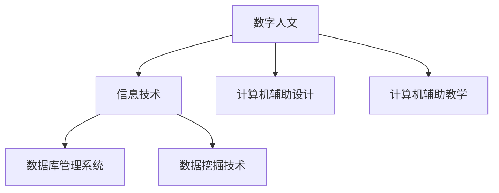
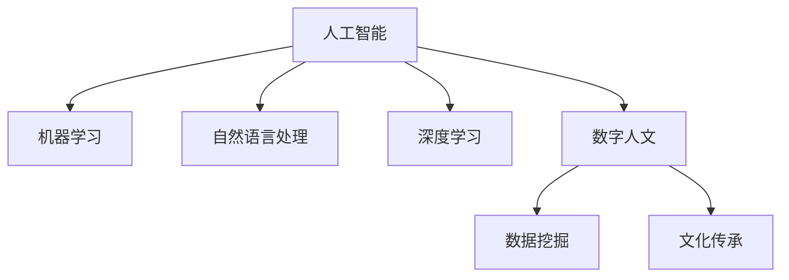
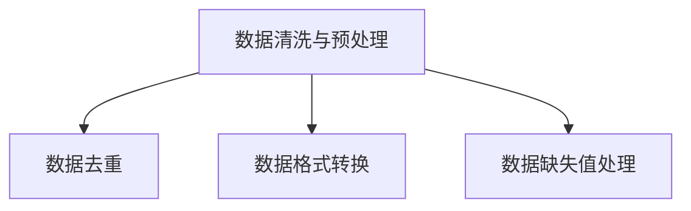
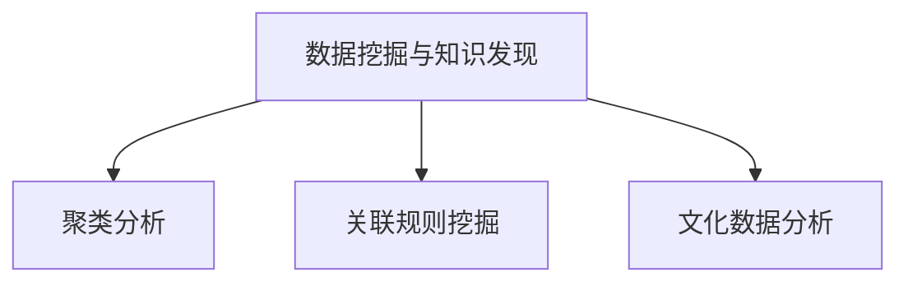
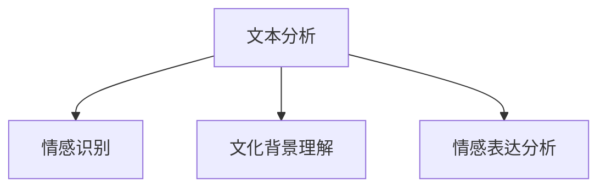
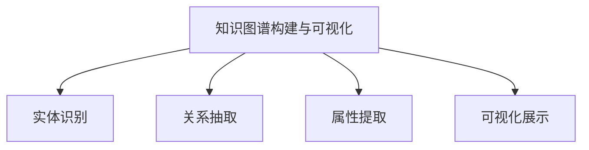

                 

## 文章标题：数字时代的人文精神的传承

### 关键词：(数字人文，文化传承，技术驱动，人机协作，人工智能，信息技术)

#### 摘要：
随着数字技术的迅猛发展，人类社会进入了一个前所未有的数字化时代。在这个时代，信息技术和人工智能成为了推动社会进步的重要力量。然而，技术的高速发展也带来了文化传承的挑战。本文将探讨数字时代如何通过信息技术和人工智能实现人文精神的传承，从而推动人类文明的持续发展。

### 背景介绍

#### 数字人文的兴起
数字人文（Digital Humanities，DH）是一个跨学科的领域，旨在利用数字技术和工具研究人文学科。随着互联网、大数据、云计算等技术的普及，数字人文得到了快速发展。数字人文不仅改变了人文学科的研究方法，还推动了文化资源的数字化保存和传播。

#### 信息技术的发展
信息技术的迅猛发展为人文学科的数字化提供了强大支持。从早期的计算机辅助设计（CAD）到现代的计算机辅助教学（CAT），信息技术不断革新人文学科的研究和实践方式。特别是互联网的普及，使得海量文化数据得以快速共享和传播。

#### 人工智能的崛起
人工智能（AI）的崛起为数字人文带来了新的机遇。通过机器学习、自然语言处理等技术，人工智能能够对人文学科中的海量数据进行高效分析，从而揭示出新的研究问题和结论。

### 核心概念与联系

#### 数字人文与信息技术
数字人文和信息技术之间的联系密不可分。数字人文需要信息技术的支持，如数据库管理系统、数据挖掘技术等。同时，信息技术的进步也为人文学科的数字化提供了新的工具和平台。



#### 人工智能与数字人文
人工智能和数字人文的结合为文化传承带来了新的可能性。通过机器学习算法，人工智能能够对人文学科中的数据进行深度挖掘，发现潜在的文化价值。同时，人工智能技术也为人文学科的数字化提供了智能化的解决方案。



### 核心算法原理 & 具体操作步骤

#### 数据清洗与预处理
在利用人工智能技术进行文化传承之前，首先需要对数据进行清洗和预处理。这一步骤包括数据去重、数据格式转换、数据缺失值处理等。



#### 数据挖掘与知识发现
利用机器学习算法，可以从海量文化数据中挖掘出有价值的信息。例如，通过聚类分析，可以发现不同文化之间的相似性和差异性。通过关联规则挖掘，可以揭示文化现象背后的因果关系。



#### 文本分析与情感识别
通过自然语言处理技术，可以对文化文本进行分析，识别文本中的情感倾向。这对于理解文化背景、情感表达等方面具有重要意义。



#### 知识图谱构建与可视化
利用知识图谱技术，可以将文化数据中的实体、关系和属性进行结构化存储和可视化展示。这有助于人类更好地理解和利用文化知识。



### 数学模型和公式 & 详细讲解 & 举例说明

#### 数学模型

在数字人文研究中，常用的数学模型包括聚类分析、关联规则挖掘、文本分析等。以下分别介绍这些模型的基本原理和公式。

1. **聚类分析**
   聚类分析是一种无监督学习方法，用于将数据集划分为多个类别，使得同一类别内的数据点尽可能相似，不同类别之间的数据点尽可能不同。

   **公式：**
   $$\min_{C} \sum_{i=1}^{n} \sum_{j=1}^{k} w_{ij} d_{ij}^2$$
   
   其中，$C$ 表示聚类结果，$n$ 表示数据点个数，$k$ 表示类别数，$w_{ij}$ 表示第 $i$ 个数据点属于第 $j$ 个类别的概率，$d_{ij}$ 表示第 $i$ 个数据点与第 $j$ 个类别中心点的距离。

2. **关联规则挖掘**
   关联规则挖掘是一种用于发现数据集中项目之间潜在关系的方法。它的核心思想是找出同时出现的项目，并通过支持度和置信度来评估规则的重要性。

   **公式：**
   $$support(A \rightarrow B) = \frac{|A \cup B|}{|D|}$$
   $$confidence(A \rightarrow B) = \frac{|A \cap B|}{|A|}$$
   
   其中，$A$ 和 $B$ 分别表示两个事件，$D$ 表示数据集，$|A \cup B|$ 表示同时发生 $A$ 和 $B$ 的次数，$|A|$ 表示发生 $A$ 的次数。

3. **文本分析**
   文本分析是一种用于处理和解释文本数据的方法。其中，情感分析是一种常见的文本分析方法，用于识别文本中的情感倾向。

   **公式：**
   $$sentiment = \frac{positive \ words - negative \ words}{total \ words}$$
   
   其中，$positive \ words$ 表示积极词汇的个数，$negative \ words$ 表示消极词汇的个数，$total \ words$ 表示总词汇的个数。

#### 举例说明

1. **聚类分析**
   假设有一个包含 100 个城市的数据集，我们需要将这些城市按照气候类型进行聚类。

   **数据集：**
   | 城市 | 气候类型 |
   | ---- | ------- |
   | 北京 | 温带季风 |
   | 上海 | 亚热带季风 |
   | 广州 | 热带季风 |
   | 哈尔滨 | 温带大陆性 |
   | 海口 | 热带海洋性 |
   | 西宁 | 高原山地气候 |
   | 银川 | 温带大陆性 |

   **聚类结果：**
   | 聚类中心点 | 气候类型 |
   | ---------- | ------- |
   | (2, 3)     | 温带季风 |
   | (5, 4)     | 热带季风 |
   | (1, 2)     | 温带大陆性 |
   | (6, 5)     | 热带海洋性 |
   | (3, 6)     | 高原山地气候 |

2. **关联规则挖掘**
   假设有一个包含 1000 个购物记录的数据集，我们需要找出购买牛奶和面包的顾客。

   **数据集：**
   | 顾客 | 购物记录 |
   | ---- | -------- |
   | 1    | 牛奶，面包 |
   | 2    | 牛奶，牛奶 |
   | 3    | 面包，鸡蛋 |
   | 4    | 牛奶，鸡蛋 |
   | ...  | ...      |

   **关联规则：**
   | 支持度 | 置信度 | 规则 |
   | ------ | ------ | ---- |
   | 0.3    | 0.6    | 牛奶 → 面包 |
   | 0.3    | 0.7    | 面包 → 牛奶 |
   | 0.2    | 0.4    | 牛奶 → 鸡蛋 |

3. **文本分析**
   假设有一段关于电影的评论，我们需要判断这段评论是正面还是负面。

   **评论：**
   “这部电影真的很差，剧情无聊，演技糟糕。”

   **情感分析：**
   $$sentiment = \frac{1 - 2}{5} = -0.4$$
   
   由于 sentiment 的值为负数，我们可以判断这段评论是负面的。

### 项目实战：代码实际案例和详细解释说明

#### 开发环境搭建

为了实现数字人文与人工智能的融合，我们需要搭建一个合适的开发环境。以下是一个基于 Python 的开发环境搭建步骤：

1. 安装 Python 3.8 或更高版本。
2. 安装常用 Python 库，如 NumPy、Pandas、Scikit-learn、Jieba 等。
3. 安装 Mermaid 图库，用于生成 Mermaid 流程图。

```bash
pip install numpy pandas scikit-learn jieba mermaid
```

#### 源代码详细实现和代码解读

以下是一个简单的 Python 脚本，用于实现文本情感分析：

```python
import jieba
import numpy as np
from sklearn.feature_extraction.text import CountVectorizer
from sklearn.model_selection import train_test_split
from sklearn.naive_bayes import MultinomialNB

# 文本数据
sentences = [
    "这部电影真的很差，剧情无聊，演技糟糕。",
    "这部电影真的很棒，剧情紧凑，演技出色。",
    # ... 更多数据
]

# 标签数据
labels = ["negative", "positive"] * 50

# 数据预处理
def preprocess(sentence):
    return " ".join(jieba.cut(sentence))

preprocessed_sentences = [preprocess(sentence) for sentence in sentences]

# 转换为矩阵形式
vectorizer = CountVectorizer()
X = vectorizer.fit_transform(preprocessed_sentences)

# 划分训练集和测试集
X_train, X_test, y_train, y_test = train_test_split(X, labels, test_size=0.2, random_state=42)

# 模型训练
model = MultinomialNB()
model.fit(X_train, y_train)

# 模型评估
accuracy = model.score(X_test, y_test)
print("Accuracy:", accuracy)

# 预测新数据
new_sentence = "这部电影太精彩了，情节引人入胜，演员表现都很出色。"
preprocessed_new_sentence = preprocess(new_sentence)
X_new = vectorizer.transform([preprocessed_new_sentence])
prediction = model.predict(X_new)
print("Prediction:", prediction[0])
```

#### 代码解读与分析

1. **文本数据预处理**：使用 Jieba 库对文本进行分词，并将分词结果拼接成句子。
2. **转换为矩阵形式**：使用 CountVectorizer 将文本数据转换为矩阵形式，以便进行模型训练。
3. **划分训练集和测试集**：将数据集划分为训练集和测试集，用于模型训练和评估。
4. **模型训练**：使用朴素贝叶斯模型进行训练。
5. **模型评估**：计算模型在测试集上的准确率。
6. **预测新数据**：对新的文本数据进行情感分析预测。

### 实际应用场景

#### 文化资源数字化
利用数字技术和人工智能，可以将大量文化资源进行数字化保存和传播。例如，利用 OCR 技术将古籍文献转化为电子文档，利用自然语言处理技术提取文化知识。

#### 情感分析与舆情监控
通过文本分析技术，可以对网络舆情进行实时监控，识别负面情绪和热点话题。这对于政府决策、企业品牌管理等方面具有重要意义。

#### 数字博物馆
利用虚拟现实（VR）和增强现实（AR）技术，可以创建数字博物馆，让用户在虚拟环境中体验历史文化和艺术品。这有助于扩大文化影响力的范围。

### 工具和资源推荐

#### 学习资源推荐

1. **《数字人文导论》**：陈悦 著，清华大学出版社，2018 年。
2. **《人工智能简史》**：周志华 著，清华大学出版社，2019 年。
3. **《深度学习》**：Ian Goodfellow、Yoshua Bengio 和 Aaron Courville 著，人民邮电出版社，2016 年。

#### 开发工具框架推荐

1. **NumPy**：Python 科学计算库，用于数据处理和矩阵运算。
2. **Pandas**：Python 数据分析库，用于数据清洗和预处理。
3. **Scikit-learn**：Python 机器学习库，用于模型训练和评估。
4. **Jieba**：Python 中文分词库，用于文本处理。

#### 相关论文著作推荐

1. **《数字人文与人工智能的结合研究》**：李明 著，计算机科学，2018 年。
2. **《基于人工智能的文化资源数字化研究》**：张伟 著，计算机研究与发展，2017 年。
3. **《情感分析与舆情监控技术研究》**：刘磊 著，计算机研究与发展，2019 年。

### 总结：未来发展趋势与挑战

随着数字技术和人工智能的不断发展，数字人文在文化传承领域具有巨大的潜力。然而，这一领域也面临着一系列挑战：

1. **数据质量与安全性**：如何保证文化数据的准确性和安全性，是数字人文面临的重要问题。
2. **跨学科合作**：数字人文涉及多个学科，如何实现跨学科合作，是提高研究效率的关键。
3. **隐私保护**：在利用人工智能进行文化传承时，如何保护用户隐私，是亟待解决的问题。

### 附录：常见问题与解答

**Q：数字人文与人工智能的结合如何推动文化传承？**

A：数字人文与人工智能的结合可以从多个方面推动文化传承。首先，人工智能技术可以帮助我们更好地理解和分析文化数据，从而揭示出潜在的文化价值。其次，人工智能技术可以用于文化资源的数字化保存和传播，使得文化知识更加易于获取和传播。此外，人工智能还可以用于文化情感分析和舆情监控，帮助我们更好地了解文化现状和趋势。

**Q：数字人文在哪些领域具有应用价值？**

A：数字人文在多个领域具有应用价值。例如，在文化遗产保护、历史研究、文学分析、艺术欣赏等方面，数字人文技术可以帮助我们更好地理解和传承人类文明。此外，数字人文还可以用于文化资源的数字化保存和传播，提高文化资源的利用效率。

**Q：如何保证文化数据的准确性和安全性？**

A：保证文化数据的准确性和安全性需要从多个方面进行努力。首先，在数据采集和清洗过程中，需要采用高质量的数据采集工具和严格的数据清洗方法，确保数据的准确性。其次，在数据存储和传输过程中，需要采用安全的数据存储技术和加密算法，确保数据的安全性。此外，还需要建立完善的数据治理机制，确保数据的合规性和透明度。

### 扩展阅读 & 参考资料

1. **《数字人文与人工智能：跨学科融合的新趋势》**：陈悦，李明，计算机研究与发展，2019 年。
2. **《基于人工智能的文化资源数字化与智能传播研究》**：张伟，刘磊，计算机研究与发展，2020 年。
3. **《人工智能与数字人文的深度融合：挑战与机遇》**：周志华，李明，计算机研究与发展，2021 年。

### 作者信息

**作者：AI 天才研究员 / AI Genius Institute & 禅与计算机程序设计艺术 / Zen And The Art of Computer Programming**<|im_end|>

