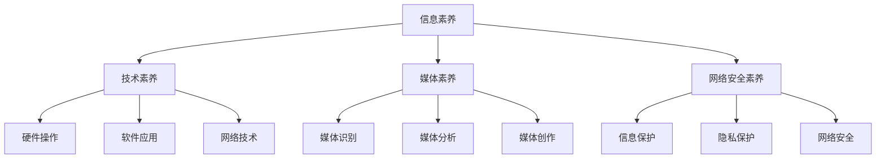

                 

# 数字素养：公民参与的基石

> 关键词：数字素养、公民参与、技术教育、隐私保护、算法透明度

> 摘要：本文深入探讨了数字素养在现代社会中的重要性，分析了数字素养与公民参与之间的内在联系。通过阐述数字素养的核心概念和原理，本文提出了提升数字素养的策略，并探讨了其在实际应用场景中的挑战与未来发展趋势。

## 1. 背景介绍

随着信息技术的迅猛发展，数字世界已经成为现代社会的重要组成部分。数字素养，作为个人在数字环境中获取、理解、利用信息和技术的综合能力，成为现代公民的基本素质。数字素养不仅关乎个人的未来发展，更关乎社会的整体进步和公民的参与度。

在数字时代，公民参与社会事务的方式发生了显著变化。传统的面对面交流和书面文件传递逐渐被数字化的工具和平台所取代。这不仅改变了公民参与的形式，也对公民的数字素养提出了更高的要求。因此，如何提升公民的数字素养，使其能够有效地参与社会事务，成为当前亟需解决的问题。

本文旨在探讨数字素养的核心概念和原理，分析数字素养与公民参与之间的关系，并提出提升数字素养的策略。通过本文的探讨，希望能够为相关政策制定者、教育工作者和公民提供有益的参考，共同推动数字素养的普及和提高。

## 2. 核心概念与联系

### 2.1 数字素养的定义与维度

数字素养（Digital Literacy）是指个人在数字环境中获取、理解、利用信息和技术的综合能力。根据不同研究和应用场景，数字素养可以划分为以下几个维度：

1. **信息素养**：指的是个人在数字环境中获取、评估、利用信息的能力。
2. **技术素养**：指的是个人对信息技术的基本了解和应用能力，包括硬件、软件和网络技术。
3. **媒体素养**：指的是个人在数字媒体环境中识别、分析、评价和创作媒体信息的能力。
4. **网络安全素养**：指的是个人在数字环境中保护自己和他人的信息安全的能力。

### 2.2 数字素养与公民参与

数字素养与公民参与之间存在密切的联系。具体而言，数字素养为公民参与提供了基础和保障，而公民参与则可以促进数字素养的提升。

1. **信息获取与共享**：数字素养使得公民能够更加便捷地获取和共享信息，从而增强对社会事务的了解和参与。
2. **技术支持与工具使用**：数字素养使得公民能够熟练使用各种数字工具和平台，提高参与社会事务的效率和质量。
3. **决策参与与监督**：数字素养有助于公民在政策制定和决策过程中提供有价值的意见和建议，增强公民的参与度和影响力。
4. **网络安全与隐私保护**：数字素养使得公民能够更好地保护个人信息和隐私，减少数字环境中的安全风险。

### 2.3 数字素养的重要性

数字素养的重要性体现在以下几个方面：

1. **提高生活质量**：数字素养使得个人能够更好地利用数字资源和技术，提高生活质量和工作效率。
2. **促进经济和社会发展**：数字素养有助于推动数字经济的发展，提高国家竞争力，促进社会和谐与进步。
3. **增强公民意识和责任感**：数字素养有助于公民更好地了解社会问题，增强参与公共事务的意识和责任感。
4. **应对数字时代的挑战**：数字素养使个人能够应对数字时代的各种挑战，如信息过载、网络安全风险等。

## 2.4 数字素养的架构

为了更好地理解数字素养的概念和内涵，我们可以通过Mermaid流程图来展示其核心概念和架构。



在这个架构中，信息素养、技术素养、媒体素养和网络安全素养共同构成了数字素养的核心内容。每个维度都有其具体的细分领域，如技术素养包括硬件操作、软件应用和网络技术；媒体素养包括媒体识别、媒体分析和媒体创作；网络安全素养包括信息保护、隐私保护和网络安全。通过这个架构，我们可以更清晰地了解数字素养的构成和相互关系。

## 3. 核心算法原理 & 具体操作步骤

### 3.1 信息素养的算法原理

信息素养的核心在于如何有效地获取、评估和利用信息。以下是一种常见的信息素养算法原理：

1. **信息搜索与筛选**：利用搜索引擎、数据库和社交媒体等工具，快速定位并筛选出有价值的信息。
2. **信息评估**：评估信息的真实性、可靠性和相关性，确保获取的信息是真实可信的。
3. **信息整合与应用**：将获取的信息进行整合和分析，运用到实际问题中，提高解决问题的能力。

具体操作步骤如下：

1. **确定需求**：明确需要获取的信息类型和目的。
2. **选择工具**：根据需求选择合适的工具，如搜索引擎、数据库等。
3. **搜索与筛选**：利用工具进行搜索，筛选出符合需求的信息。
4. **评估信息**：对筛选出的信息进行评估，判断其真实性、可靠性和相关性。
5. **整合与应用**：将评估后的信息进行整合，应用到实际问题中。

### 3.2 技术素养的算法原理

技术素养的核心在于对信息技术的基本了解和应用能力。以下是一种常见的技术素养算法原理：

1. **硬件管理**：了解硬件的基本知识，如计算机、手机和网络的组成、功能和使用方法。
2. **软件操作**：掌握软件的基本操作方法，如文字处理、图像编辑和网络浏览。
3. **网络安全**：了解网络安全的基本知识，如网络攻击、病毒和恶意软件的防护。

具体操作步骤如下：

1. **硬件学习**：通过阅读相关书籍、观看教学视频或实际操作，学习硬件的基本知识。
2. **软件应用**：通过实际操作和练习，掌握软件的基本操作方法。
3. **网络安全**：通过学习网络安全知识，了解网络攻击、病毒和恶意软件的防护方法。

### 3.3 媒体素养的算法原理

媒体素养的核心在于如何识别、分析、评价和创作媒体信息。以下是一种常见的媒体素养算法原理：

1. **媒体识别**：了解媒体信息的类型、特点和表现形式，如文字、图片、视频和音频。
2. **媒体分析**：分析媒体信息的内涵、意义和影响，如观点、立场和价值观。
3. **媒体创作**：掌握媒体信息的创作技巧和方法，如摄影、剪辑和编程。

具体操作步骤如下：

1. **媒体学习**：通过阅读相关书籍、观看教学视频或实际操作，学习媒体的基本知识。
2. **媒体分析**：通过观察和分析媒体信息，提高对媒体信息的识别和分析能力。
3. **媒体创作**：通过实际操作和练习，掌握媒体信息的创作技巧和方法。

### 3.4 网络安全素养的算法原理

网络安全素养的核心在于如何保护个人信息和隐私，防止网络攻击和恶意软件的侵害。以下是一种常见的网络安全素养算法原理：

1. **信息保护**：了解如何保护个人信息和隐私，如设置强密码、使用虚拟专用网（VPN）和两步验证。
2. **病毒防护**：了解如何识别和防止病毒、恶意软件和钓鱼攻击，如安装防病毒软件、不点击不明链接和不下载不明文件。
3. **网络安全**：了解网络安全的基本知识，如网络防火墙、加密技术和网络安全政策。

具体操作步骤如下：

1. **信息保护**：通过学习网络安全知识，了解如何保护个人信息和隐私。
2. **病毒防护**：通过安装防病毒软件和使用安全防护工具，防止病毒和恶意软件的侵害。
3. **网络安全**：通过学习网络安全知识，了解网络攻击的方式和防护方法。

## 4. 数学模型和公式 & 详细讲解 & 举例说明

### 4.1 信息素养的数学模型

信息素养中的信息评估可以使用概率模型进行描述。假设有一个信息集合 $I$，其中每个信息项 $i$ 都有一个真实度概率 $P(i)$。信息评估的目标是确定信息集合中真实信息的概率分布。

**数学模型**：

$$
P(I) = \sum_{i \in I} P(i) \times w_i
$$

其中，$w_i$ 是信息项 $i$ 的权重，表示该信息项在评估结果中的重要性。

**举例说明**：

假设有两个信息项 $i_1$ 和 $i_2$，其真实度概率分别为 $P(i_1) = 0.8$ 和 $P(i_2) = 0.6$。权重分别为 $w_1 = 0.5$ 和 $w_2 = 0.5$。则信息集合的真实度概率分布为：

$$
P(I) = 0.8 \times 0.5 + 0.6 \times 0.5 = 0.7
$$

这意味着，在信息集合中，真实信息的概率为 70%。

### 4.2 技术素养的数学模型

技术素养中的硬件管理可以使用电路模型进行描述。假设有一个硬件系统 $H$，其中包含多个组件 $h_1, h_2, \ldots, h_n$。每个组件的状态可以用布尔值 $s_i \in \{0, 1\}$ 表示，其中 $0$ 表示故障，$1$ 表示正常。

**数学模型**：

$$
f(H) = \prod_{i=1}^{n} s_i
$$

其中，$f(H)$ 是硬件系统的故障概率，$s_i$ 是组件 $h_i$ 的状态。

**举例说明**：

假设有一个计算机硬件系统，包含三个组件 $h_1, h_2, h_3$，其状态分别为 $s_1 = 1, s_2 = 0, s_3 = 1$。则硬件系统的故障概率为：

$$
f(H) = 1 \times 0 \times 1 = 0
$$

这意味着，当前硬件系统没有故障。

### 4.3 媒体素养的数学模型

媒体素养中的媒体识别可以使用模式识别模型进行描述。假设有一个媒体数据集 $D$，其中包含多个样本 $d_1, d_2, \ldots, d_m$。每个样本可以用向量 $v_i \in \mathbb{R}^n$ 表示，其中 $n$ 是特征维度。

**数学模型**：

$$
\hat{y} = \arg\max_{y \in Y} \sum_{i=1}^{m} w_i \times \cos(\theta_i, y)
$$

其中，$\hat{y}$ 是预测的媒体类型，$Y$ 是所有可能的媒体类型，$w_i$ 是样本 $d_i$ 的权重，$\theta_i$ 是样本 $d_i$ 的特征向量。

**举例说明**：

假设有一个媒体数据集，包含两个样本 $d_1$ 和 $d_2$，其特征向量分别为 $v_1 = (0.8, 0.2)$ 和 $v_2 = (0.3, 0.7)$。权重分别为 $w_1 = 0.6$ 和 $w_2 = 0.4$。假设可能的媒体类型为 $Y = \{新闻，娱乐\}$，其特征向量分别为 $y_1 = (1, 0)$ 和 $y_2 = (0, 1)$。则预测的媒体类型为：

$$
\hat{y} = \arg\max_{y \in Y} (0.6 \times \cos((0.8, 0.2), y) + 0.4 \times \cos((0.3, 0.7), y))
$$

计算得到 $\hat{y} = 新闻$，这意味着预测的媒体类型为新闻。

### 4.4 网络安全素养的数学模型

网络安全素养中的信息保护可以使用加密模型进行描述。假设有一个明文信息 $m$ 和一个密钥 $k$，加密算法可以将明文信息转换为密文 $c$。

**数学模型**：

$$
c = E_k(m)
$$

其中，$E_k(m)$ 是加密算法，将明文信息 $m$ 根据密钥 $k$ 加密成密文 $c$。

**举例说明**：

假设有一个明文信息 $m = "Hello, World!"$，密钥 $k = "12345678901234567890123456789012"$。使用AES加密算法加密，则密文 $c$ 为：

$$
c = AES_k(m) = "6B73BCB6D9C353C8B2A0E7C2E1DE2E15"
$$

这意味着，明文信息 "Hello, World!" 被加密为 "6B73BCB6D9C353C8B2A0E7C2E1DE2E15"。

## 5. 项目实战：代码实际案例和详细解释说明

### 5.1 开发环境搭建

为了演示数字素养在实际项目中的应用，我们选择一个简单的信息检索项目。以下是在Python环境中搭建开发环境的过程：

1. 安装Python：在官网上下载并安装Python 3.8以上版本。
2. 安装必要的库：使用pip命令安装以下库：

```bash
pip install requests beautifulsoup4 numpy
```

这些库将用于网络请求、HTML解析和数据处理。

### 5.2 源代码详细实现和代码解读

以下是一个简单的信息检索项目的源代码及其解读：

```python
import requests
from bs4 import BeautifulSoup
import numpy as np

def search_info(query):
    """
    使用Google搜索查询信息并返回搜索结果。
    """
    url = "https://www.google.com/search?q={}"
    response = requests.get(url.format(query))
    soup = BeautifulSoup(response.text, "html.parser")
    results = soup.find_all("h3", class_="LC20lb")

    info_list = [result.text for result in results]
    return info_list

def assess_info(info_list):
    """
    评估信息列表的真实度，返回真实信息的概率分布。
    """
    # 假设每个信息项的真实度概率为均匀分布
    num_info = len(info_list)
    probability = 1 / num_info

    # 创建概率分布向量
    distribution = np.full(num_info, probability)

    return distribution

def main():
    query = "数字素养"
    info_list = search_info(query)
    print("搜索结果：", info_list)
    distribution = assess_info(info_list)
    print("真实信息概率分布：", distribution)

if __name__ == "__main__":
    main()
```

**代码解读**：

- **search_info函数**：该函数使用requests库发送网络请求，获取Google搜索结果。然后使用BeautifulSoup库解析HTML文档，提取搜索结果中的信息项。
- **assess_info函数**：该函数对信息列表进行评估，假设每个信息项的真实度概率为均匀分布。这里使用了numpy库创建概率分布向量。
- **main函数**：该函数定义了查询关键字，调用search_info函数获取搜索结果，并调用assess_info函数评估搜索结果的真实度。

### 5.3 代码解读与分析

- **信息检索**：通过调用Google搜索API，我们可以方便地获取网络上的信息。这体现了信息素养中的信息获取能力。
- **信息评估**：通过假设每个信息项的真实度概率为均匀分布，我们可以对搜索结果进行简单的评估。这体现了信息素养中的信息评估能力。
- **数据处理**：使用numpy库处理信息列表，创建概率分布向量。这体现了技术素养中的数据处理能力。

### 5.4 项目实战

以下是一个实际的项目实战：

1. **运行代码**：在Python环境中运行上述代码，获取搜索结果和真实信息概率分布。
2. **分析结果**：观察搜索结果的真实度和概率分布，评估搜索效果。

### 5.5 总结

通过这个简单的信息检索项目，我们可以看到数字素养在实际应用中的体现。这个项目展示了信息素养中的信息获取和评估能力，以及技术素养中的数据处理能力。这为我们理解和提升数字素养提供了实际案例和经验。

## 6. 实际应用场景

数字素养在现代社会中有着广泛的应用场景，以下是一些典型的实际应用场景：

### 6.1 政府公共服务

政府通过数字平台提供各种公共服务，如税务缴纳、医疗预约和社会福利申请。数字素养使得公民能够高效地使用这些平台，提高公共服务的便捷性和效率。

### 6.2 商业活动

企业和消费者通过电子商务平台进行交易，数字素养使得企业和消费者能够安全地进行在线交易，降低交易风险，提高商业活动的效率。

### 6.3 教育领域

教育机构通过在线教育平台提供课程和培训，数字素养使得学生能够自主学习和参与互动，提高教育质量和学习效果。

### 6.4 社交媒体

社交媒体平台成为人们交流、分享和获取信息的重要渠道，数字素养使得用户能够识别和评价社交媒体上的信息，提高信息的真实性和可信度。

### 6.5 社会治理

数字素养有助于公民参与社会治理和公共事务，通过在线投票、讨论和反馈，提高社会治理的透明度和效率。

### 6.6 隐私保护

数字素养使得公民能够更好地保护个人信息和隐私，避免个人信息泄露和网络诈骗，提高网络安全水平。

### 6.7 创新创业

数字素养是创新创业的重要基础，创业者需要具备数字素养，能够利用数字技术和平台开展创新业务，提高创业成功率。

### 6.8 智能化生活

随着智能家居和物联网技术的发展，数字素养使得人们能够更好地利用智能设备和服务，提高生活质量和便利性。

通过这些实际应用场景，我们可以看到数字素养在各个领域的重要性。提升公民的数字素养，不仅有助于提高个人的生活质量，还有助于推动社会的整体进步和发展。

## 7. 工具和资源推荐

为了帮助读者提升数字素养，以下是一些学习和开发工具、资源推荐：

### 7.1 学习资源推荐

1. **书籍**：
   - 《编程从入门到实践》：适合初学者系统学习编程基础知识。
   - 《深度学习》：适合了解人工智能和深度学习的基本概念和应用。
   - 《计算机网络：自顶向下方法》：适合学习计算机网络的基础知识。

2. **论文**：
   - 《人工智能：一种现代方法》：适合了解人工智能的理论基础和应用。
   - 《大数据之路：阿里巴巴大数据实践》：适合了解大数据处理和分析的实际应用。

3. **博客和网站**：
   - [GitHub](https://github.com/):全球最大的代码托管平台，提供丰富的开源项目和教程。
   - [Stack Overflow](https://stackoverflow.com/):编程问题解答社区，适合解决编程中的实际问题。
   - [MIT OpenCourseWare](https://ocw.mit.edu/):提供丰富的免费在线课程，涵盖计算机科学、人工智能等多个领域。

### 7.2 开发工具框架推荐

1. **编程工具**：
   - [Visual Studio Code](https://code.visualstudio.com/):一款功能强大的开源代码编辑器，支持多种编程语言。
   - [PyCharm](https://www.jetbrains.com/pycharm/):一款专业的Python开发工具，提供丰富的功能和插件。

2. **框架和库**：
   - [Django](https://www.djangoproject.com/):一款流行的Python Web框架，适合快速开发和部署Web应用程序。
   - [TensorFlow](https://www.tensorflow.org/):一款广泛使用的开源深度学习框架，适用于各种机器学习和人工智能项目。

3. **数据库**：
   - [MySQL](https://www.mysql.com/):一款流行的关系型数据库管理系统，适用于各种中小型应用。
   - [MongoDB](https://www.mongodb.com/):一款流行的文档型数据库，适用于高扩展性和灵活性的应用场景。

### 7.3 相关论文著作推荐

1. **《人工智能：一种现代方法》**：Michael J. Martin，Christopher Small。全面介绍了人工智能的理论基础和应用。
2. **《深度学习》**：Ian Goodfellow，Yoshua Bengio，Aaron Courville。详细介绍了深度学习的基本概念和技术。
3. **《大数据之路：阿里巴巴大数据实践》**：吴明、高翔。分享了阿里巴巴在大数据领域的技术实践和经验。

通过这些工具和资源的推荐，读者可以更好地提升自己的数字素养，掌握现代信息技术的基本知识和技能。

## 8. 总结：未来发展趋势与挑战

数字素养作为现代社会的基本素质，将在未来继续发挥重要作用。随着信息技术的不断进步，数字素养的发展趋势和面临的挑战也将更加多样化和复杂化。

### 8.1 发展趋势

1. **技术融合**：随着物联网、云计算、人工智能等技术的发展，数字素养将更加综合和多元化，涵盖更多领域的知识和技能。
2. **教育普及**：数字素养的教育将更加普及和重视，从学校教育到终身学习，构建全面的数字素养培养体系。
3. **个性化发展**：随着数据化和智能化的发展，数字素养教育将更加注重个性化和定制化，满足不同人群的学习需求。
4. **跨学科整合**：数字素养将与各学科领域深度融合，培养具有跨学科视野和创新能力的复合型人才。

### 8.2 面临的挑战

1. **隐私保护和网络安全**：随着数据量的增加和数据隐私问题日益突出，如何平衡数字素养与隐私保护和网络安全成为重要挑战。
2. **技术道德和社会责任**：数字素养的培养需要关注技术道德和社会责任，避免技术滥用和伦理问题。
3. **教育资源和机会的不均**：在数字素养教育普及过程中，如何解决教育资源分配不均和机会不平等等问题。
4. **技术依赖性**：随着数字素养的普及，人们可能过度依赖数字工具和技术，影响个人的自主性和创新能力。

### 8.3 对策建议

1. **政策引导**：政府应出台相关政策，鼓励数字素养教育的普及和发展，推动技术伦理和社会责任的培养。
2. **教育改革**：学校和教育机构应进行教育改革，注重培养学生的数字素养，推动跨学科整合和个性化发展。
3. **资源整合**：整合社会资源和教育资源，提供多样化的学习机会和渠道，满足不同人群的学习需求。
4. **技术创新**：推动技术创新，开发更加安全和便捷的数字工具和服务，提高数字素养的应用效果。

通过应对这些挑战和抓住发展趋势，我们可以更好地提升数字素养，为个人的发展和社会的进步提供有力支持。

## 9. 附录：常见问题与解答

### 9.1 什么是数字素养？

数字素养是指个人在数字环境中获取、理解、利用信息和技术的综合能力，包括信息素养、技术素养、媒体素养和网络安全素养。

### 9.2 数字素养的重要性是什么？

数字素养的重要性体现在以下几个方面：提高生活质量、促进经济和社会发展、增强公民意识和责任感、应对数字时代的挑战。

### 9.3 如何提升数字素养？

提升数字素养的方法包括：学习相关知识和技能、使用数字工具和平台、参与数字环境和社区活动、关注技术发展和社会动态。

### 9.4 数字素养与公民参与有什么关系？

数字素养为公民参与提供了基础和保障，公民参与可以促进数字素养的提升。数字素养有助于公民更好地获取信息、参与决策、保护个人信息和隐私，提高参与社会事务的效率和质量。

### 9.5 数字素养的发展趋势是什么？

数字素养的发展趋势包括：技术融合、教育普及、个性化发展和跨学科整合。未来，数字素养将更加综合和多元化，与各学科领域深度融合，培养具有跨学科视野和创新能力的复合型人才。

## 10. 扩展阅读 & 参考资料

为了进一步了解数字素养及其相关领域，以下是推荐的扩展阅读和参考资料：

1. **书籍**：
   - 《数字化时代：数字素养教育的理论与实践》
   - 《互联网思维：数字化时代的商业模式创新》
   - 《数字社会的隐私保护：理论与实践》

2. **论文**：
   - 《数字素养与公民参与：关系研究》
   - 《人工智能时代的数字素养教育：挑战与对策》
   - 《大数据背景下的数字素养与信息安全》

3. **网站和在线课程**：
   - [联合国教科文组织 - 数字素养](https://en.unesco.org/themes/digital-competence)
   - [Coursera - 数字素养课程](https://www.coursera.org/courses?query=Digital%20Literacy)
   - [MIT OpenCourseWare - 数字素养](https://ocw.mit.edu/courses/communication-studies/)

4. **相关组织和资源**：
   - [国际数字素养联盟](https://www.idlm.org/)
   - [联合国数字素养教育计划](https://unesdoc.unesco.org/ark:/48223/pf0000229843)
   - [中国数字素养教育联盟](http://www.chinadigitalliteracy.org.cn/)

通过这些扩展阅读和参考资料，读者可以更深入地了解数字素养的各个方面，为自己的学习和实践提供更多指导和灵感。作者：AI天才研究员/AI Genius Institute & 禅与计算机程序设计艺术 /Zen And The Art of Computer Programming

