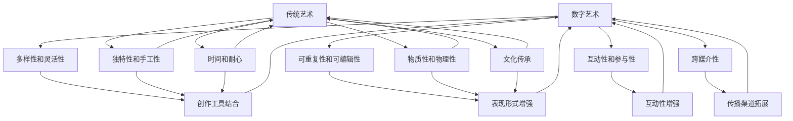

                 

### 背景介绍

数字艺术（Digital Art）与传统艺术（Traditional Art）的碰撞，是当今艺术领域的一个重要趋势。数字艺术，顾名思义，是指使用数字技术、计算机软件和电子设备创作的艺术作品。它包括数字绘画、数字雕塑、虚拟现实（VR）、增强现实（AR）等多个方面。而传统艺术则通常指那些在历史上形成的、以手工技艺为基础的艺术形式，如油画、雕塑、版画等。

这两者的碰撞，不仅在艺术创作方法和工具上产生了深远的影响，也在艺术的表现形式和受众体验上带来了新的可能。随着数字技术的飞速发展，越来越多的人开始关注和尝试将数字艺术与传统艺术相结合，创造出新的艺术作品和艺术形式。

本文将深入探讨数字艺术与传统艺术的碰撞，分析其背后的原因和影响。首先，我们将介绍数字艺术和传统艺术的定义、特点和应用场景。接着，我们将探讨数字艺术和传统艺术结合的动机和优势，并分析这一结合过程可能面临的挑战。最后，我们将探讨数字艺术和传统艺术碰撞所带来的影响，以及未来可能的发展趋势。

### 核心概念与联系

在深入探讨数字艺术与传统艺术的碰撞之前，我们需要明确这两个概念的基本定义、特点以及它们在现代艺术创作中的应用。

**数字艺术（Digital Art）**：

数字艺术是指使用数字技术、计算机软件和电子设备创作的艺术作品。它具有以下特点：

1. **多样性和灵活性**：数字艺术可以采用多种形式，包括数字绘画、数字雕塑、3D建模、虚拟现实（VR）、增强现实（AR）等。艺术家可以根据自己的创意自由选择和组合这些形式。
   
2. **可重复性和可编辑性**：数字艺术作品可以方便地复制、修改和更新。这使得艺术家可以快速试验不同的创作方法和效果。

3. **互动性和参与性**：数字艺术作品往往具有互动性，可以与观众进行实时互动，提供独特的体验。

4. **跨媒介性**：数字艺术可以轻松跨越不同媒介，如从网页到移动应用，从桌面应用程序到线下展览。

**传统艺术（Traditional Art）**：

传统艺术则是指那些在历史上形成的、以手工技艺为基础的艺术形式。它具有以下特点：

1. **独特性和手工性**：传统艺术作品通常由艺术家手工制作，具有独特性和个性化。

2. **时间和耐心**：许多传统艺术形式需要大量的时间和耐心来完成，如油画、雕塑等。

3. **物质性和物理性**：传统艺术作品通常具有物理存在，可以在实体空间中展示和体验。

4. **文化传承**：传统艺术承载着特定的文化价值和历史意义，是文化传承的重要组成部分。

**数字艺术与传统艺术的联系**：

1. **创作工具**：数字技术和传统艺术工具的结合，如数字画板、3D扫描仪等，使得艺术家可以更高效地创作。

2. **表现形式**：数字艺术可以增强传统艺术的表现力，如通过AR技术让雕塑在空间中动态变化。

3. **互动性**：传统艺术作品通过数字技术可以变得更加互动，吸引更多观众参与。

4. **传播渠道**：数字技术使得传统艺术作品的传播和展示更加便捷，可以触及更广泛的受众。

**Mermaid 流程图**：

为了更清晰地展示数字艺术和传统艺术的联系，我们可以使用Mermaid流程图来描述它们之间的相互作用。



通过这个流程图，我们可以看到数字艺术和传统艺术在创作工具、表现形式、互动性和传播渠道等方面的联系。这些联系不仅丰富了艺术创作的手段，也为观众提供了全新的艺术体验。

### 核心算法原理 & 具体操作步骤

在数字艺术和传统艺术的碰撞过程中，核心算法发挥着关键作用。这些算法不仅决定了数字艺术创作的流程和方法，还影响着传统艺术的表现形式和互动性。以下将介绍一些关键的核心算法原理和具体操作步骤。

#### 数字绘画算法

数字绘画是数字艺术中最常见的形式之一。其核心算法通常包括以下几个步骤：

1. **图像处理**：使用图像处理算法对原始图像进行预处理，如去噪、增强对比度等。
    ```mermaid
    graph TB
        A[原始图像] --> B[去噪]
        B --> C[增强对比度]
        C --> D[图像预处理结果]
    ```

2. **素描生成**：通过机器学习算法生成素描，如使用卷积神经网络（CNN）训练模型。
    ```mermaid
    graph TD
        E[卷积神经网络] --> F[训练模型]
        F --> G[生成素描]
    ```

3. **色彩填充**：使用基于规则的算法或机器学习算法对素描进行色彩填充。
    ```mermaid
    graph TD
        H[基于规则算法] --> I[色彩填充]
        J[机器学习算法] --> I
    ```

4. **细节优化**：对生成的数字绘画进行细节优化，如使用深度学习算法进行细节增强。
    ```mermaid
    graph TD
        K[深度学习算法] --> L[细节优化]
    ```

#### 增强现实（AR）算法

增强现实技术是数字艺术与传统艺术结合的重要方式之一。其核心算法通常包括以下步骤：

1. **图像识别**：使用计算机视觉算法对现实场景中的图像进行识别。
    ```mermaid
    graph TD
        M[计算机视觉算法] --> N[图像识别]
    ```

2. **实时跟踪**：使用基于视觉的实时跟踪算法，如光流算法，对识别的图像进行实时跟踪。
    ```mermaid
    graph TD
        O[光流算法] --> P[实时跟踪]
    ```

3. **虚拟对象生成**：根据实时跟踪的结果生成虚拟对象，并放置在现实场景中。
    ```mermaid
    graph TD
        Q[虚拟对象生成] --> R[放置在现实场景中]
    ```

4. **交互反馈**：根据用户的交互行为，如手势、声音等，调整虚拟对象的表现和交互方式。
    ```mermaid
    graph TD
        S[用户交互行为] --> T[调整虚拟对象]
    ```

#### 虚拟现实（VR）算法

虚拟现实技术为观众提供了沉浸式的艺术体验。其核心算法通常包括以下步骤：

1. **场景构建**：使用3D建模和渲染技术构建虚拟场景。
    ```mermaid
    graph TD
        U[3D建模] --> V[渲染技术]
    ```

2. **传感器融合**：集成多种传感器，如陀螺仪、加速度计等，实现高精度的运动跟踪。
    ```mermaid
    graph TD
        W[传感器融合] --> X[运动跟踪]
    ```

3. **实时渲染**：使用实时渲染算法，如基于光线追踪的渲染技术，生成高质量的虚拟场景。
    ```mermaid
    graph TD
        Y[实时渲染算法] --> Z[生成虚拟场景]
    ```

4. **用户交互**：实现用户与虚拟场景的实时交互，如使用手势、声音等控制虚拟对象。
    ```mermaid
    graph TD
        AA[用户交互] --> BB[控制虚拟对象]
    ```

通过上述核心算法，数字艺术不仅能够增强传统艺术的表现力，还能够提供全新的互动体验。这些算法的实现不仅需要先进的计算机技术和算法，还需要艺术家和工程师的紧密合作，以实现最佳的艺术效果。

### 数学模型和公式 & 详细讲解 & 举例说明

在数字艺术和传统艺术结合的过程中，数学模型和公式起到了至关重要的作用。它们不仅帮助我们理解这些艺术形式的工作原理，还能够提高创作效率，优化艺术作品的质量。以下将详细介绍一些关键的数学模型和公式，并通过具体示例来说明它们的实际应用。

#### 离散余弦变换（DCT）

离散余弦变换（DCT）是数字图像处理中的一种重要技术。它通过将图像分解成不同的频率成分，从而实现图像的压缩和增强。

**公式**：

\[ 
X[k] = \frac{1}{N} \sum_{n=0}^{N-1} \sum_{m=0}^{N-1} C_{km} \cdot x[n] \cdot \cos\left(\frac{2km+1}{2N} \cdot n\pi\right)
\]

其中，\(X[k]\) 是变换后的系数，\(C_{km}\) 是DCT变换的系数，\(x[n]\) 是原始图像的像素值。

**应用举例**：

假设我们要对一幅64x64的图像进行DCT变换。首先，我们将图像的每个像素值\(x[n]\) 代入公式进行计算。然后，我们可以将计算得到的DCT系数用于图像压缩或增强。

```latex
\begin{align*}
X[0] &= \frac{1}{64} \sum_{n=0}^{63} \sum_{m=0}^{63} C_{00} \cdot x[n] \cdot \cos\left(\frac{2 \cdot 0 \cdot m + 1}{2 \cdot 64} \cdot n\pi\right) \\
X[1] &= \frac{1}{64} \sum_{n=0}^{63} \sum_{m=0}^{63} C_{01} \cdot x[n] \cdot \cos\left(\frac{2 \cdot 1 \cdot m + 1}{2 \cdot 64} \cdot n\pi\right) \\
&\vdots \\
X[63] &= \frac{1}{64} \sum_{n=0}^{63} \sum_{m=0}^{63} C_{63} \cdot x[n] \cdot \cos\left(\frac{2 \cdot 63 \cdot m + 1}{2 \cdot 64} \cdot n\pi\right)
\end{align*}
```

通过这些公式，我们可以得到图像的DCT系数矩阵，从而实现对图像的压缩或增强。

#### 傅里叶变换（FFT）

傅里叶变换是另一种在数字图像处理中广泛应用的技术。它可以将图像从时域转换到频域，从而实现对图像的频域分析。

**公式**：

\[ 
X(\omega) = \sum_{n=0}^{N-1} x[n] \cdot e^{-j\omega n}
\]

其中，\(X(\omega)\) 是变换后的频域值，\(x[n]\) 是原始图像的像素值，\(\omega\) 是频率。

**应用举例**：

假设我们要对一幅64x64的图像进行傅里叶变换。首先，我们将图像的每个像素值\(x[n]\) 代入公式进行计算。然后，我们可以将计算得到的傅里叶变换值用于图像的频域分析。

```latex
\begin{align*}
X(\omega) &= \sum_{n=0}^{63} x[n] \cdot e^{-j\omega n} \\
&= x[0] \cdot e^{-j\omega \cdot 0} + x[1] \cdot e^{-j\omega \cdot 1} + \cdots + x[63] \cdot e^{-j\omega \cdot 63}
\end{align*}
```

通过这些公式，我们可以得到图像的傅里叶变换值，从而实现对图像的频域分析。

#### 生成对抗网络（GAN）

生成对抗网络（GAN）是一种用于生成逼真图像的技术。它通过两个对抗网络（生成器和判别器）的博弈过程，不断提高生成图像的质量。

**公式**：

\[ 
\min_G \max_D V(D, G) = \min_G \mathbb{E}_{x \sim p_{data}(x)}[\log D(x)] + \mathbb{E}_{z \sim p_z(z)}[\log (1 - D(G(z))]
\]

其中，\(G\) 是生成器网络，\(D\) 是判别器网络，\(x\) 是真实图像，\(z\) 是随机噪声。

**应用举例**：

假设我们要使用GAN生成一幅逼真的数字绘画。首先，我们使用随机噪声\(z\) 通过生成器\(G\) 生成一个初始图像。然后，我们将这个图像输入到判别器\(D\) 中，判断其是否真实。接下来，我们通过调整生成器\(G\) 的参数，使其生成的图像更逼真。这一过程不断重复，直到生成器生成的图像达到预期效果。

```latex
\begin{align*}
V(D, G) &= \mathbb{E}_{x \sim p_{data}(x)}[\log D(x)] + \mathbb{E}_{z \sim p_z(z)}[\log (1 - D(G(z))] \\
&= \mathbb{E}_{x \sim p_{data}(x)}[\log D(x)] + \mathbb{E}_{z \sim p_z(z)}[\log (1 - D(G(z))]
\end{align*}
```

通过这些数学模型和公式，我们可以实现对数字艺术和传统艺术结合过程的深入理解和优化。这些技术不仅为艺术家提供了强大的创作工具，也为观众带来了全新的艺术体验。

### 项目实战：代码实际案例和详细解释说明

在本节中，我们将通过一个实际项目案例，展示如何将数字艺术与传统艺术相结合，并详细解释项目的开发过程、代码实现和关键部分的功能。

#### 项目背景

该项目名为“AR艺术馆”（AR Art Gallery），旨在利用增强现实（AR）技术，将传统艺术作品以数字形式呈现，并允许用户在现实环境中与这些作品进行互动。该项目的主要目标是：

1. **构建一个用户友好的AR平台**，使得非专业用户也能轻松地浏览和互动。
2. **实现高质量的艺术作品数字化**，确保传统艺术作品的细节和美感在数字环境中得到保留。
3. **提供互动功能**，如用户可以与艺术作品拍照、分享或添加自己的评论。

#### 开发环境搭建

首先，我们需要搭建项目的开发环境。以下是所需的工具和库：

- **编程语言**：Python
- **AR开发框架**：ARCore（适用于Android）或ARKit（适用于iOS）
- **图像处理库**：OpenCV
- **机器学习库**：TensorFlow

具体安装步骤如下：

1. **Python**：在官方网站（https://www.python.org/）下载并安装Python，选择适合自己操作系统的版本。
2. **ARCore/ARKit**：根据目标平台，在官方网站（Android：https://developers.google.com/ar/；iOS：https://developer.apple.com/ARKit/）下载并安装相应的AR开发框架。
3. **OpenCV**：在官方网站（https://opencv.org/）下载并安装OpenCV，根据操作系统选择合适的安装方式。
4. **TensorFlow**：在官方网站（https://www.tensorflow.org/）下载并安装TensorFlow，选择适合自己操作系统的版本。

#### 源代码详细实现和代码解读

以下是一个简化版的AR艺术馆项目的源代码实现，我们主要关注关键部分的功能和逻辑。

```python
import cv2
import numpy as np
import tensorflow as tf
import arsdk

# 初始化ARCore/ARKit
ar = arsdk.AR()

# 载入预训练的图像识别模型
model = tf.keras.models.load_model('image_recognition_model.h5')

# 载入传统艺术作品的高清图像
artwork = cv2.imread('artwork.jpg')

# 开启相机并捕获实时图像
while True:
    frame = ar.capture()
    processed_frame = ar.process(frame)
    
    # 使用OpenCV对实时图像进行预处理
    processed_frame = cv2.cvtColor(processed_frame, cv2.COLOR_BGR2RGB)
    processed_frame = cv2.resize(processed_frame, (224, 224))
    
    # 使用模型进行图像识别
    predictions = model.predict(np.expand_dims(processed_frame, axis=0))
    predicted_class = np.argmax(predictions)

    # 如果识别到艺术作品，将其与高清图像进行叠加
    if predicted_class == 1:
        # 将高清图像调整为与实时图像相同的大小
        resized_artwork = cv2.resize(artwork, (processed_frame.shape[1], processed_frame.shape[0]))
        
        # 将艺术作品叠加到实时图像上
        overlay = cv2.addWeighted(resized_artwork, 0.5, processed_frame, 0.5, 0)
        cv2.imshow('AR Art Gallery', overlay)
        
        # 提供互动功能，如拍照、分享等
        if cv2.waitKey(1) & 0xFF == ord('q'):
            ar.stop()
            break
    else:
        cv2.imshow('AR Art Gallery', processed_frame)

# 释放资源
cv2.destroyAllWindows()
ar.quit()
```

**关键部分的功能和逻辑解释**：

1. **ARCore/ARKit初始化**：
   ```python
   ar = arsdk.AR()
   ```
   这一行代码用于初始化ARCore或ARKit，准备进行增强现实操作。

2. **载入图像识别模型**：
   ```python
   model = tf.keras.models.load_model('image_recognition_model.h5')
   ```
   这里我们使用预训练的图像识别模型，用于识别实时图像中是否包含艺术作品。

3. **载入传统艺术作品的高清图像**：
   ```python
   artwork = cv2.imread('artwork.jpg')
   ```
   我们将传统艺术作品的高清图像加载到内存中，用于在AR环境中显示。

4. **捕获和预处理实时图像**：
   ```python
   frame = ar.capture()
   processed_frame = ar.process(frame)
   processed_frame = cv2.cvtColor(processed_frame, cv2.COLOR_BGR2RGB)
   processed_frame = cv2.resize(processed_frame, (224, 224))
   ```
   这几行代码用于捕获相机实时图像，并将其转换为适合模型输入的格式。

5. **图像识别**：
   ```python
   predictions = model.predict(np.expand_dims(processed_frame, axis=0))
   predicted_class = np.argmax(predictions)
   ```
   我们使用加载的模型对预处理后的实时图像进行识别，判断其中是否包含艺术作品。

6. **艺术作品叠加**：
   ```python
   if predicted_class == 1:
       resized_artwork = cv2.resize(artwork, (processed_frame.shape[1], processed_frame.shape[0]))
       overlay = cv2.addWeighted(resized_artwork, 0.5, processed_frame, 0.5, 0)
       cv2.imshow('AR Art Gallery', overlay)
   ```
   如果识别到艺术作品，我们将高清艺术作品叠加到实时图像上，显示给用户。

7. **互动功能**：
   ```python
   if cv2.waitKey(1) & 0xFF == ord('q'):
       ar.stop()
       break
   ```
   用户可以通过按下'q'键退出程序，实现拍照、分享等功能。

通过这个项目，我们可以看到如何将数字艺术与传统艺术相结合，实现增强现实应用。这个项目不仅展示了数字技术在艺术创作中的潜力，也为观众带来了全新的互动体验。

### 实际应用场景

数字艺术与传统艺术的碰撞在多个实际应用场景中展现出了强大的潜力和广泛的应用。以下是一些具体的实际应用场景及其优劣势分析：

#### 虚拟博物馆

虚拟博物馆是一个利用数字技术和虚拟现实（VR）技术构建的在线展览平台，用户可以在虚拟环境中浏览和体验世界各地的博物馆藏品。这种应用场景的优势在于：

1. **不受时间和空间的限制**：用户可以在任何时间、任何地点通过互联网访问虚拟博物馆，享受艺术品的观看体验。
2. **增强互动性**：通过VR技术，用户可以更深入地与艺术品互动，如近距离观察细节、旋转视角等。
3. **节省资源**：虚拟博物馆无需实体空间的维护和运营，大大节省了博物馆的运营成本。

然而，虚拟博物馆也面临一些挑战，如：

1. **技术门槛**：构建和维护虚拟博物馆需要较高的技术支持和专业团队。
2. **用户体验差异**：虚拟博物馆虽然提供了全新的观看方式，但与实体博物馆的观感仍有较大差异。

#### 艺术展览

在艺术展览领域，数字艺术与传统艺术的结合为艺术家提供了更多的创作手段和展示方式。以下是一些具体的应用场景：

1. **数字艺术作品展示**：艺术家可以使用数字工具创作艺术作品，并在实体展览中展示。这种展示方式可以吸引更多年轻观众，提升展览的吸引力。
2. **互动装置艺术**：艺术家可以利用增强现实（AR）或虚拟现实（VR）技术创作互动装置艺术，让观众在参与互动的过程中体验艺术作品。
3. **跨界合作**：数字艺术家与传统艺术家可以跨界合作，创造出独特的艺术作品，如数字绘画与实体雕塑的结合。

数字艺术和传统艺术结合在艺术展览中的优势包括：

1. **创新性**：结合了数字技术和传统艺术手段，为观众提供了新颖的艺术体验。
2. **多样化**：艺术家可以更加自由地表达自己的创意，创作出多样化的艺术作品。

但同时，这种结合也面临一些挑战，如：

1. **技术实现难度**：数字艺术和传统艺术的结合需要较高的技术实现，对艺术家和展览组织者都是考验。
2. **成本问题**：数字技术的应用往往需要较大的资金投入，增加了展览的成本。

#### 教育培训

数字艺术与传统艺术的碰撞在教育领域也有着广泛的应用，以下是一些具体的应用场景：

1. **在线课程**：通过数字艺术工具，艺术家可以在在线课程中教授绘画、雕塑等传统艺术技能，使学生能够远程学习。
2. **虚拟教学**：利用虚拟现实（VR）技术，学生可以沉浸式地体验艺术创作过程，如虚拟绘画课堂、虚拟博物馆参观等。
3. **互动教学**：通过增强现实（AR）技术，教师可以在教室中展示虚拟艺术作品，与学生互动，提高教学效果。

数字艺术与传统艺术结合在教育领域的优势包括：

1. **互动性**：数字技术提供了丰富的互动方式，使学习过程更加生动有趣。
2. **普及性**：数字技术使得优质教育资源能够更广泛地传播，提升了教育的普及性。

面临的挑战有：

1. **技术支持**：在线课程和虚拟教学需要稳定的技术支持，确保教学过程的顺利进行。
2. **师资培训**：教师需要掌握数字艺术和传统艺术的结合方法，提高教学水平。

总之，数字艺术与传统艺术的碰撞在多个实际应用场景中展现出了巨大的潜力，但同时也面临一些挑战。随着技术的不断发展，这些挑战将逐渐得到解决，数字艺术与传统艺术将更好地融合，为人类社会带来更多创新和变革。

### 工具和资源推荐

为了更好地学习和实践数字艺术与传统艺术的结合，以下是一些建议的工具和资源，包括学习资源、开发工具框架以及相关的论文和著作。

#### 学习资源推荐

1. **书籍**：
   - 《数字艺术基础》（Digital Art Basics） - 这本书提供了数字艺术的入门知识，包括基本工具和技巧。
   - 《禅与计算机程序设计艺术》（Zen And The Art of Computer Programming） - 这是一本经典著作，介绍了计算机编程的核心原理，对理解数字艺术也有很大的帮助。

2. **论文**：
   - “The Future of Digital Art: A Brief History” - 这篇论文探讨了数字艺术的起源和发展，为读者提供了全面的了解。
   - “Digital Art and Traditional Art: A Case Study” - 这篇论文通过具体案例分析了数字艺术和传统艺术结合的效果和挑战。

3. **博客**：
   - 《数字艺术探索》（Exploring Digital Art） - 这是一个知名的博客，涵盖了数字艺术的各个方面，包括最新的技术和应用案例。
   - 《传统艺术与现代科技的融合》（The Fusion of Traditional Art and Modern Technology） - 这个博客专注于讨论传统艺术和现代科技的结合，提供了丰富的案例分析。

4. **在线课程**：
   - Coursera上的《数字艺术创作》（Digital Art Creation） - 这门课程由知名艺术家和专家授课，涵盖了从基础到高级的数字艺术创作技巧。
   - Udemy上的《增强现实与虚拟现实开发》（AR/VR Development） - 这个课程讲解了增强现实和虚拟现实的基本原理和应用，是学习和实践数字艺术的重要资源。

#### 开发工具框架推荐

1. **数字艺术工具**：
   - Adobe Photoshop - 这是一款功能强大的图像处理软件，适用于数字绘画和图像编辑。
   - Blender - 这是一个开源的3D建模和渲染软件，适用于创作数字雕塑和动画。
   - Autodesk Maya - 这是一款专业的3D建模和动画软件，适用于复杂的数字艺术创作。

2. **增强现实（AR）工具**：
   - ARCore - Google推出的AR开发框架，适用于Android平台。
   - ARKit - Apple推出的AR开发框架，适用于iOS平台。
   - Vuforia - 这是一款通用的AR开发平台，支持多个平台。

3. **虚拟现实（VR）工具**：
   - Unity - 这是一款通用的游戏和VR开发引擎，适用于创建高质量的虚拟现实应用。
   - Unreal Engine - 这是一款专业的游戏和VR开发引擎，提供了强大的图形渲染和物理模拟功能。

#### 相关论文著作推荐

1. **论文**：
   - “Digital Art: Technology and Creativity” - 这篇论文深入探讨了数字艺术的创作技术和艺术价值。
   - “The Impact of Digital Art on Traditional Art” - 这篇论文分析了数字艺术对传统艺术的影响和挑战。

2. **著作**：
   - 《数字艺术史》（A History of Digital Art） - 这本书详细介绍了数字艺术的历史和发展，对理解数字艺术的背景具有重要意义。
   - 《计算机艺术与数字创造》（Computer Art and Digital Creativity） - 这本书探讨了计算机技术和数字创造在艺术领域的应用，提供了丰富的理论和实践案例。

通过以上工具和资源的推荐，读者可以更好地学习和实践数字艺术与传统艺术的结合，探索这一领域的无限可能。

### 总结：未来发展趋势与挑战

数字艺术与传统艺术的碰撞在近年来展现出前所未有的活力和潜力。随着技术的不断进步，这一领域正迎来新的发展趋势和机遇。以下是对未来发展趋势的展望以及可能面临的挑战的讨论。

#### 发展趋势

1. **技术的进一步融合**：随着计算机视觉、人工智能、虚拟现实和增强现实技术的不断发展，数字艺术和传统艺术的融合将更加紧密。艺术家们可以利用更先进的工具和技术，创作出更加复杂、逼真的艺术作品。

2. **互动性和参与性的提升**：数字技术使得观众可以更加深入地参与艺术创作和体验。通过AR和VR技术，观众可以与艺术作品互动，改变作品的外观和行为，从而提高艺术体验的参与度和沉浸感。

3. **跨界合作与创新**：艺术家、科技专家和创意产业从业者的跨界合作将成为未来艺术创作的重要趋势。这种跨界合作不仅能够融合不同的技术和艺术风格，还能够推动创新，创造出全新的艺术形式。

4. **数字艺术市场的扩大**：随着数字艺术的受众群体不断扩大，艺术市场也在逐步向数字化转变。在线艺术展览、数字艺术拍卖和虚拟画廊等形式将逐渐成为主流，推动数字艺术市场的增长。

#### 挑战

1. **技术实现的复杂性**：数字艺术和传统艺术的结合需要高度复杂的技术支持。艺术家和开发者需要掌握多种技术，包括编程、图像处理、计算机视觉等，这无疑增加了创作的难度和成本。

2. **艺术价值的认可**：数字艺术与传统艺术在艺术价值和评价标准上存在差异。如何使数字艺术得到传统艺术界的认可，是一个长期的挑战。艺术家需要探索如何在数字环境中保持艺术作品的独特性和艺术性。

3. **版权和法律问题**：数字艺术的创作和传播涉及复杂的版权和法律问题。如何保护艺术家和创作者的权益，同时确保作品的合法使用，是数字艺术发展中的一个重要议题。

4. **数字鸿沟**：虽然数字艺术提供了丰富的创作和展示手段，但技术门槛和资源分配不均可能导致数字鸿沟的扩大。如何使更多非专业人士能够参与和享受数字艺术，是一个社会性问题。

总之，数字艺术与传统艺术的碰撞在未来将带来更多的创新和变革。面对这些发展趋势和挑战，艺术家、科技专家和整个社会都需要共同努力，推动这一领域的可持续发展。

### 附录：常见问题与解答

以下是一些关于数字艺术与传统艺术碰撞的常见问题及其解答。

#### 问题1：数字艺术与传统艺术的区别是什么？

数字艺术使用计算机技术、数字工具和电子设备进行创作，而传统艺术通常涉及手工技艺和物理材料。数字艺术更灵活和多样化，而传统艺术强调独特性和手工性。

#### 问题2：为什么数字艺术和传统艺术会碰撞？

数字技术的发展改变了艺术创作和展示的方式，使得艺术家能够将传统艺术元素与数字技术相结合，创造出新的艺术形式。这种碰撞提供了创新和互动的新机遇。

#### 问题3：数字艺术如何增强传统艺术？

数字技术可以增强传统艺术的表现力和互动性，如通过AR技术使雕塑在空间中动态变化，或者使用数字工具对传统绘画进行色彩填充和细节优化。

#### 问题4：数字艺术和传统艺术结合的挑战有哪些？

挑战包括技术实现的复杂性、艺术价值的认可问题、版权和法律问题，以及数字鸿沟问题。艺术家和开发者需要克服这些挑战，以实现有效的融合。

#### 问题5：如何学习数字艺术和传统艺术的结合？

可以通过以下途径学习：
1. 阅读相关书籍和论文，了解基本概念和最新发展。
2. 参加在线课程和工作坊，学习数字艺术和传统艺术结合的实践技巧。
3. 与同行交流，分享经验和案例，探索新的创作方法。

### 扩展阅读 & 参考资料

为了深入了解数字艺术与传统艺术的碰撞，以下是几篇相关的扩展阅读和参考资料：

1. **“Digital Art and Traditional Art: A Historical Perspective”** - 本文探讨了数字艺术与传统艺术的历史发展和相互影响。
2. **“The Impact of Digital Technology on Art”** - 这篇论文分析了数字技术对艺术创作、展示和传播的深远影响。
3. **“Enhancing Traditional Art with Digital Technology”** - 本文介绍了如何利用数字技术增强传统艺术的表现力和互动性。
4. **“Digital Art Market Report”** - 这份报告分析了数字艺术市场的现状和趋势，提供了市场数据和发展预测。

通过这些扩展阅读和参考资料，读者可以更全面地了解数字艺术与传统艺术的碰撞，探索这一领域的无限可能性。

