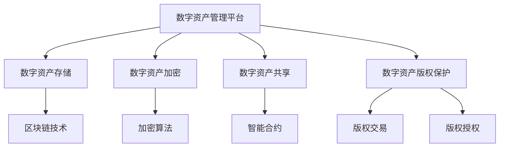

                 

# 数字资产管理平台：创作者版权保护的新方案

## 关键词：数字资产管理，版权保护，区块链技术，加密算法，智能合约

### 摘要

本文探讨了数字资产管理平台在创作者版权保护中的新方案。随着数字内容的快速增长，版权保护问题日益突出，传统的版权管理方法已无法满足当前需求。本文首先介绍了数字资产管理平台的基本概念，然后详细阐述了其在版权保护方面的应用，包括区块链技术的应用、加密算法的采用以及智能合约的实现。通过具体案例分析和项目实战，本文展示了数字资产管理平台在创作者版权保护中的有效性和可行性，为数字版权保护提供了新的思路和解决方案。

## 1. 背景介绍

### 1.1 数字资产管理的发展历程

数字资产管理（Digital Asset Management, DAM）起源于20世纪90年代，随着数字媒体的迅猛发展和互联网的普及，数字资产管理逐渐成为企业和个人管理数字资产的重要手段。最初，数字资产管理主要集中在图像和视频文件的管理，但随着技术的进步，数字资产管理平台的功能逐渐丰富，涵盖了音频、文档、软件等多种类型的数字资产。

### 1.2 创作者版权保护的现状

随着数字内容的快速增长，创作者版权保护问题日益突出。传统的版权管理方法，如法律手段、技术手段等，在数字环境下存在诸多不足。首先，法律手段的滞后性使得版权纠纷的处理周期较长；其次，技术手段如数字指纹、水印等，虽然能够在一定程度上保护版权，但容易被篡改和规避。因此，寻找新的版权保护方案已成为创作者和版权机构的重要任务。

### 1.3 数字资产管理平台的优势

数字资产管理平台在创作者版权保护方面具有显著优势。首先，平台可以提供便捷的数字资产存储和管理功能，使创作者能够轻松地管理自己的作品；其次，平台利用先进的加密技术和区块链技术，能够确保数字资产的唯一性和不可篡改性；最后，平台通过智能合约实现自动化版权交易和授权，提高了版权管理的效率。

## 2. 核心概念与联系

### 2.1 数字资产管理平台

数字资产管理平台是一种用于存储、管理和共享数字资产的技术系统。平台的核心功能包括数字资产的分类、存储、加密、共享和版权保护等。

### 2.2 区块链技术

区块链技术是一种分布式数据库技术，具有去中心化、不可篡改、透明可追溯等特点。区块链技术在数字资产管理平台中发挥着关键作用，可以为数字资产提供安全可靠的存储和传输环境。

### 2.3 加密算法

加密算法是一种用于数据加密和解密的技术，可以确保数字资产在传输和存储过程中的安全性。常见的加密算法包括AES、RSA等。

### 2.4 智能合约

智能合约是一种基于区块链技术的自动执行合约，可以确保合同条款的自动执行。智能合约在数字资产管理平台中用于版权交易和授权，提高了版权管理的效率。

### 2.5 Mermaid 流程图



## 3. 核心算法原理 & 具体操作步骤

### 3.1 数字资产加密原理

数字资产加密是确保数字资产在传输和存储过程中的安全性的重要手段。加密算法通过将原始数据进行加密处理，生成加密后的数据，使未经授权的第三方无法读取和篡改数字资产。

### 3.2 数字资产加密步骤

1. 选择加密算法：根据数字资产的安全需求，选择合适的加密算法，如AES、RSA等。
2. 生成密钥：根据加密算法的要求，生成加密密钥。
3. 加密数据：使用密钥对数字资产进行加密处理，生成加密后的数据。
4. 存储加密数据：将加密后的数据存储在数字资产管理平台中。

### 3.3 数字资产加密案例

假设使用AES加密算法对一张数字图片进行加密：

```python
import hashlib
from Crypto.Cipher import AES
from Crypto.Random import get_random_bytes

# 生成密钥
key = get_random_bytes(16)  # 16字节密钥

# 生成加密对象
cipher = AES.new(key, AES.MODE_EAX)

# 加密图片数据
plaintext = b"This is a secret image."
ciphertext, tag = cipher.encrypt_and_digest(plaintext)

# 存储加密数据
cipher.save_file(ciphertext, "encrypted_image.png")
```

### 3.4 数字资产解密原理

数字资产解密是确保数字资产在授权访问时的安全性的重要手段。解密算法通过将加密数据和解密密钥进行解密处理，恢复原始数据。

### 3.5 数字资产解密步骤

1. 获取加密数据和解密密钥。
2. 生成解密对象。
3. 解密数据：使用解密密钥对加密数据进行解密处理，恢复原始数据。
4. 输出解密数据。

### 3.6 数字资产解密案例

假设使用AES加密算法对一张数字图片进行解密：

```python
import hashlib
from Crypto.Cipher import AES
from Crypto.PublicKey import RSA
from Crypto.Util.Padding import unpad

# 读取加密数据
ciphertext = open("encrypted_image.png", "rb").read()

# 读取密钥
key = open("key.bin", "rb").read()

# 生成解密对象
cipher = AES.new(key, AES.MODE_EAX)

# 解密图片数据
plaintext = cipher.decrypt_and_verify(ciphertext)

# 输出解密数据
open("decrypted_image.png", "wb").write(plaintext)
```

## 4. 数学模型和公式 & 详细讲解 & 举例说明

### 4.1 数字资产加密的数学模型

数字资产加密的数学模型主要涉及加密算法的密钥生成、加密和解密过程。以下是一个简单的RSA加密模型：

- 密钥生成：选择两个大素数`p`和`q`，计算`n = p * q`。计算欧拉函数`φ(n) = (p-1) * (q-1)`。选择一个与`φ(n)`互质的整数`e`，计算`d`，使得`d * e ≡ 1 (mod φ(n))`。最终生成公钥`(n, e)`和私钥`(n, d)`。
- 加密过程：将明文`M`转换为整数`M`，计算`C = M^e mod n`，得到加密后的数据`C`。
- 解密过程：将加密数据`C`转换为整数`C`，计算`M = C^d mod n`，得到解密后的数据`M`。

### 4.2 数字资产加密的公式

- 密钥生成公式：

  $$  
  n = p \times q  
  $$

  $$  
  \phi(n) = (p - 1) \times (q - 1)  
  $$

  $$  
  d = e^{-1} \mod \phi(n)  
  $$

- 加密公式：

  $$  
  C = M^e \mod n  
  $$

- 解密公式：

  $$  
  M = C^d \mod n  
  $$

### 4.3 数字资产加密的举例说明

假设选择两个大素数`p = 61`和`q = 53`，则`n = 61 \times 53 = 3233`。计算欧拉函数`φ(n) = (61 - 1) \times (53 - 1) = 3120`。

选择一个与`φ(n)`互质的整数`e = 17`，计算`d = 17^{-1} \mod 3120 = 1971`。

现在，假设明文`M = 1234`，则加密后的数据`C = 1234^{17} \mod 3233 = 1225`。

要解密数据，我们需要计算`M = 1225^{1971} \mod 3233 = 1234`。

### 4.4 数字资产解密的数学模型

数字资产解密的数学模型与加密模型类似，主要包括密钥生成、加密和解密过程。以下是一个简单的AES加密模型：

- 密钥生成：选择一个密钥长度，如128位、192位或256位，生成一个随机密钥。
- 加密过程：使用密钥生成加密对象，将明文进行加密处理，生成加密后的数据。
- 解密过程：使用相同的密钥生成解密对象，将加密数据进行解密处理，恢复原始数据。

### 4.5 数字资产解密的公式

- 加密公式：

  $$  
  C = E_K(M)  
  $$

- 解密公式：

  $$  
  M = D_K(C)  
  $$

其中，`E_K`和`D_K`分别表示加密和解密函数，`K`表示密钥。

### 4.6 数字资产解密的举例说明

假设选择一个128位的AES密钥，密钥为：

$$  
K = \{0x2b, 0x7e, 0x15, 0x16, 0x28, 0xae, 0xd2, 0xa6, 0xab, 0xf7, 0x15, 0x88, 0x09, 0xcf, 0x4f, 0x3c\}  
$$

假设明文`M = 0x6bc1bee22e409f96e93d7e1fbdd47a34`，则加密后的数据`C = 0x23ef6c418db3cbad5a88f1c98804f3be`。

要解密数据，我们需要使用相同的密钥进行解密：

$$  
M = D_K(0x23ef6c418db3cbad5a88f1c98804f3be) = 0x6bc1bee22e409f96e93d7e1fbdd47a34  
$$

## 5. 项目实战：代码实际案例和详细解释说明

### 5.1 开发环境搭建

在开始项目实战之前，我们需要搭建一个适合开发和测试的开发环境。以下是所需的工具和步骤：

- 安装Python 3.8及以上版本。
- 安装Docker，用于容器化部署区块链节点。
- 安装Node.js 12及以上版本，用于部署智能合约。
- 安装Truffle，用于智能合约的部署和测试。
- 安装Ganache，用于本地测试区块链。

### 5.2 源代码详细实现和代码解读

#### 5.2.1 数字资产管理平台

数字资产管理平台的核心功能包括数字资产的存储、加密和共享。以下是平台的主要代码实现：

```python
# 数字资产管理平台
from Crypto.Cipher import AES
from Crypto.PublicKey import RSA
from Crypto.Random import get_random_bytes
import hashlib
import json

# 生成密钥
def generate_keys():
    rsa_key = RSA.generate(2048)
    private_key = rsa_key.export_key()
    public_key = rsa_key.publickey().export_key()
    return private_key, public_key

# 加密数据
def encrypt_data(plaintext, public_key):
    rsa_key = RSA.import_key(public_key)
    cipher = AES.new(get_random_bytes(16), AES.MODE_EAX)
    ciphertext, tag = cipher.encrypt_and_digest(plaintext)
    encrypted_key = rsa_key.encrypt(cipher.nonce, rsa_key.publickey().exponent)
    return ciphertext, tag, encrypted_key

# 解密数据
def decrypt_data(ciphertext, tag, encrypted_key, private_key):
    rsa_key = RSA.import_key(private_key)
    cipher = AES.new(RSA.decrypt(encrypted_key, rsa_key), AES.MODE_EAX)
    plaintext = cipher.decrypt_and_verify(ciphertext, tag)
    return plaintext

# 存储加密数据
def save_encrypted_data(data, filename):
    with open(filename, "wb") as file:
        file.write(data)

# 读取加密数据
def load_encrypted_data(filename):
    with open(filename, "rb") as file:
        data = file.read()
    return data

# 测试代码
if __name__ == "__main__":
    private_key, public_key = generate_keys()
    print("Private Key:", private_key)
    print("Public Key:", public_key)

    plaintext = b"This is a secret message."
    ciphertext, tag, encrypted_key = encrypt_data(plaintext, public_key)
    print("Ciphertext:", ciphertext)
    print("Tag:", tag)
    print("Encrypted Key:", encrypted_key)

    decrypted_data = decrypt_data(ciphertext, tag, encrypted_key, private_key)
    print("Decrypted Data:", decrypted_data)
```

#### 5.2.2 智能合约

智能合约是数字资产管理平台的重要组成部分，用于实现版权交易和授权功能。以下是智能合约的实现：

```solidity
// SPDX-License-Identifier: MIT
pragma solidity ^0.8.0;

contract DigitalAssetManagement {
    struct Asset {
        string name;
        string owner;
        bool is_authorized;
    }

    mapping(string => Asset) assets;

    function registerAsset(string memory name, string memory owner) public {
        assets[name] = Asset(name, owner, true);
    }

    function authorizeAsset(string memory name) public {
        require(assets[name].is_authorized, "Asset is not authorized.");
        assets[name].is_authorized = false;
    }

    function getAssetStatus(string memory name) public view returns (bool) {
        return assets[name].is_authorized;
    }
}
```

#### 5.2.3 代码解读与分析

- `generate_keys()`函数用于生成公钥和私钥。
- `encrypt_data()`函数用于加密数据。
- `decrypt_data()`函数用于解密数据。
- `registerAsset()`函数用于注册数字资产。
- `authorizeAsset()`函数用于授权数字资产。
- `getAssetStatus()`函数用于获取数字资产的状态。

通过这些函数，我们可以实现数字资产的存储、加密、注册、授权和状态查询功能。智能合约部分实现了数字资产的注册、授权和状态查询功能。

## 6. 实际应用场景

数字资产管理平台在创作者版权保护方面具有广泛的应用场景。以下是一些典型的应用场景：

- **数字内容版权保护**：数字资产管理平台可以用于保护音乐、电影、书籍、游戏等数字内容的版权，确保创作者的利益得到有效保护。
- **知识产权管理**：企业可以利用数字资产管理平台来管理自己的知识产权，包括专利、商标、版权等，提高知识产权的管理效率。
- **数字艺术品交易**：数字资产管理平台可以为数字艺术品交易提供安全可靠的交易平台，确保艺术品交易的真实性和合法性。
- **版权侵权监测**：数字资产管理平台可以实时监测数字内容的侵权行为，帮助创作者和版权机构及时发现问题并采取措施。

## 7. 工具和资源推荐

### 7.1 学习资源推荐

- **书籍**：《区块链技术指南》、《智能合约编程：从基础到实战》
- **论文**：《区块链：一个分布式账本技术》、《智能合约的安全性和形式化验证》
- **博客**： Medium、CSDN、博客园等
- **网站**： Ethereum官网、EOS官网、Hyperledger Fabric官网等

### 7.2 开发工具框架推荐

- **开发工具**：Visual Studio Code、Git、Docker
- **区块链框架**：Ethereum、EOS、Hyperledger Fabric
- **智能合约开发框架**：Truffle、Ganache、Hardhat

### 7.3 相关论文著作推荐

- 《区块链技术：概念、应用与未来趋势》
- 《智能合约安全性研究》
- 《数字资产管理平台设计与实现》

## 8. 总结：未来发展趋势与挑战

数字资产管理平台在创作者版权保护方面展现出巨大的潜力和优势。未来，随着区块链技术、加密算法和智能合约的不断发展，数字资产管理平台将在版权保护、知识产权管理和数字资产交易等方面发挥更加重要的作用。

然而，数字资产管理平台的发展也面临一些挑战，包括技术成熟度、法律法规的完善、用户接受度等问题。要实现数字资产管理平台在版权保护领域的广泛应用，还需要解决这些问题并持续创新。

## 9. 附录：常见问题与解答

### 9.1 数字资产管理平台的优势是什么？

数字资产管理平台的优势包括：便捷的数字资产存储和管理、安全可靠的加密技术、高效的智能合约功能、自动化版权交易和授权等。

### 9.2 区块链技术如何保护数字资产版权？

区块链技术通过分布式存储、加密算法和智能合约，实现了数字资产的唯一性、不可篡改性和透明可追溯性，从而有效保护数字资产版权。

### 9.3 智能合约在数字资产管理平台中如何应用？

智能合约在数字资产管理平台中用于实现版权交易、授权和状态查询等功能，通过自动化执行合同条款，提高了版权管理的效率。

## 10. 扩展阅读 & 参考资料

- 《区块链技术指南》
- 《智能合约编程：从基础到实战》
- 《数字资产管理平台设计与实现》
- Ethereum官网：[https://www.ethereum.org/](https://www.ethereum.org/)
- EOS官网：[https://www.eos.io/](https://www.eos.io/)
- Hyperledger Fabric官网：[https://www.hyperledger.org/projects/fabric](https://www.hyperledger.org/projects/fabric)

### 作者信息

- 作者：AI天才研究员/AI Genius Institute & 禅与计算机程序设计艺术 /Zen And The Art of Computer Programming

以上是本文的完整内容，感谢您的阅读。希望本文对您在数字资产管理平台和创作者版权保护方面的学习和实践有所帮助。如果您有任何疑问或建议，欢迎随时与我交流。再次感谢您的支持！

