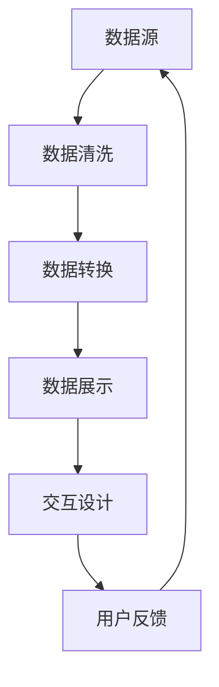

                 

# 数据可视化技术：从图表到交互式仪表板

## 关键词

数据可视化、图表、交互式仪表板、图表可视化、数据展示、数据处理、前端开发、用户体验、工具框架、实际应用

## 摘要

本文将深入探讨数据可视化技术，从基础图表到高级交互式仪表板的构建。我们将分析核心概念、算法原理、数学模型，并通过实战案例展示如何开发数据可视化项目。此外，本文还将推荐相关的学习资源、开发工具和未来发展趋势，为读者提供全面的视角。

## 1. 背景介绍

随着大数据时代的来临，数据的处理和分析变得日益重要。然而，如何将大量的数据转化为易于理解的信息，成为了一个关键问题。数据可视化技术正是为了解决这一需求而诞生的。通过图表、图像和其他视觉元素，数据可视化使得复杂的统计数据变得更加直观、易于理解。

数据可视化不仅能够提高数据分析的效率，还能够帮助决策者快速抓住数据背后的关键信息。在商业、科学研究、医疗、金融等领域，数据可视化技术都有着广泛的应用。例如，通过图表可以直观地展示产品的销售趋势、研究项目的进展情况、金融市场波动等。

随着技术的发展，数据可视化已经不再局限于静态的图表，交互式仪表板成为了新的趋势。交互式仪表板通过用户的操作，可以动态地更新数据，提供更加灵活的视图。这种技术不仅增强了数据的可读性，还提高了用户参与度和数据分析的深度。

本文将系统地介绍数据可视化技术，从基本概念到高级实现，帮助读者全面了解这一领域。

### 1.1 数据可视化的重要性

数据可视化在数据分析和决策过程中扮演着至关重要的角色。以下是数据可视化的重要性：

1. **提高数据可读性**：将复杂的统计数据转化为图形，使得信息一目了然。
2. **促进信息传播**：图表和图像比文字更容易被大众理解和接受。
3. **辅助决策制定**：通过可视化分析，决策者可以快速识别关键信息和趋势。
4. **增强数据洞察**：可视化技术可以帮助发现数据中的隐藏模式和关系。
5. **提高数据准确性**：可视化工具能够帮助识别数据中的错误和不一致性。

### 1.2 数据可视化的应用领域

数据可视化技术广泛应用于多个领域，以下是其中几个主要的应用：

1. **商业分析**：通过图表分析销售数据、客户行为等，帮助公司做出明智的商业决策。
2. **科学研究**：科学家使用可视化技术展示实验结果，发现科学规律。
3. **金融领域**：金融分析师通过图表分析市场趋势和风险。
4. **医疗领域**：医生利用可视化技术理解患者的健康数据，做出诊断和治疗决策。
5. **政府和公共政策**：政府部门通过数据可视化展示公共政策的成效和影响。

## 2. 核心概念与联系

### 2.1 基本概念

数据可视化涉及多个核心概念，包括数据源、数据转换、数据展示、交互性等。

- **数据源**：数据可视化项目的基础是数据源，可以是数据库、文件、实时数据流等。
- **数据转换**：将原始数据转换为适合可视化展示的格式，包括数据清洗、转换、聚合等。
- **数据展示**：选择合适的图表类型和布局，将数据呈现给用户。
- **交互性**：通过用户的操作动态更新数据和视图，增强用户体验。

### 2.2 数据可视化与用户交互的关系

数据可视化和用户交互密不可分。良好的交互设计可以提高数据的可读性和使用效率。以下是交互性的几个关键要素：

- **过滤**：用户可以根据需求过滤数据，查看特定范围的数据。
- **筛选**：通过选择或点击，用户可以筛选数据，使其更加聚焦。
- **排序**：用户可以按照特定指标对数据进行排序，发现数据中的规律。
- **动态更新**：随着用户操作，图表和仪表板可以动态更新，展示实时数据。

### 2.3 Mermaid 流程图

为了更好地理解数据可视化流程，我们可以使用 Mermaid 流程图来展示各个步骤的关系。以下是一个示例流程图：



在这个流程图中，数据源通过数据清洗和转换步骤，最终在数据展示阶段呈现给用户。用户通过交互设计提供的功能，如过滤、筛选、排序等，可以动态更新数据和视图。用户的反馈又反馈到数据源，形成一个闭环。

## 3. 核心算法原理 & 具体操作步骤

### 3.1 数据清洗

数据清洗是数据可视化的第一步，其目标是处理原始数据中的错误、缺失和不一致性。以下是数据清洗的主要算法原理和操作步骤：

- **缺失值处理**：使用平均值、中位数、众数等填充缺失值，或删除缺失值。
- **异常值检测**：使用统计方法，如箱线图、Z-Score等，检测并处理异常值。
- **数据格式转换**：将不同格式的数据转换为统一的格式，如将日期格式转换为YYYY-MM-DD。
- **数据标准化**：使用标准化方法，如Z-Score标准化，使得数据具有相同的尺度。

### 3.2 数据转换

数据转换是将原始数据转换为适合可视化展示的格式。以下是数据转换的主要算法原理和操作步骤：

- **数据聚合**：对数据进行分组、汇总，如计算平均数、最大值、最小值等。
- **数据转换**：将数据转换为可视化所需的格式，如将文本数据转换为数字或日期。
- **数据映射**：将数据映射到可视化组件，如将数值映射到柱状图的高度。

### 3.3 数据展示

数据展示是将转换后的数据以图表的形式呈现给用户。以下是数据展示的主要算法原理和操作步骤：

- **选择图表类型**：根据数据类型和展示需求选择合适的图表类型，如柱状图、折线图、饼图等。
- **布局设计**：设计图表的布局，如图表的大小、位置、颜色等。
- **交互设计**：添加交互功能，如过滤、筛选、排序等。

### 3.4 交互设计

交互设计是为了增强用户的参与度和数据分析的深度。以下是交互设计的主要算法原理和操作步骤：

- **过滤**：允许用户过滤数据，查看特定范围的数据。
- **筛选**：允许用户通过选择或点击筛选数据，使其更加聚焦。
- **排序**：允许用户按照特定指标对数据进行排序，发现数据中的规律。
- **动态更新**：随着用户操作，图表和仪表板可以动态更新，展示实时数据。

## 4. 数学模型和公式 & 详细讲解 & 举例说明

### 4.1 数据清洗的数学模型和公式

- **缺失值填充**：
  $$\text{填充值} = \frac{\sum_{i=1}^{n} x_i}{n}$$
  其中，$x_i$ 为观测值，$n$ 为观测值数量。

- **异常值检测**：
  $$\text{Z-Score} = \frac{\text{观测值} - \text{均值}}{\text{标准差}}$$
  其中，均值和标准差可以通过以下公式计算：
  $$\text{均值} = \frac{\sum_{i=1}^{n} x_i}{n}$$
  $$\text{标准差} = \sqrt{\frac{\sum_{i=1}^{n} (x_i - \text{均值})^2}{n-1}}$$

- **数据格式转换**：
  $$\text{日期格式转换} = \text{日期} + \text{偏移量}$$
  其中，偏移量是将日期转换为统一格式的调整量。

- **数据标准化**：
  $$\text{标准化值} = \frac{\text{观测值} - \text{均值}}{\text{标准差}}$$

### 4.2 数据转换的数学模型和公式

- **数据聚合**：
  $$\text{平均数} = \frac{\sum_{i=1}^{n} x_i}{n}$$
  $$\text{最大值} = \max(x_1, x_2, ..., x_n)$$
  $$\text{最小值} = \min(x_1, x_2, ..., x_n)$$

- **数据映射**：
  $$\text{映射值} = f(\text{原始值})$$
  其中，$f$ 是映射函数，可以将原始值映射到可视化组件。

### 4.3 数据展示的数学模型和公式

- **图表类型选择**：
  选择图表类型主要依据数据的类型和展示需求。例如，对于时间序列数据，选择折线图；对于分类数据，选择饼图。

- **布局设计**：
  布局设计主要涉及图表的大小、位置、颜色等。例如，使用颜色编码表示不同类别的数据，使用坐标轴表示时间序列。

### 4.4 交互设计的数学模型和公式

- **过滤**：
  $$\text{过滤后数据集} = \{x | x \in \text{原始数据集} \text{且满足过滤条件}\}$$

- **筛选**：
  $$\text{筛选后数据集} = \{x | x \in \text{原始数据集} \text{且满足筛选条件}\}$$

- **排序**：
  $$\text{排序后数据集} = \{x_1, x_2, ..., x_n | x_1 \leq x_2 \leq ... \leq x_n\}$$
  其中，$x_1, x_2, ..., x_n$ 是按照特定指标排序的数据。

### 4.5 举例说明

假设我们有以下数据集：

| ID | 名称   | 年龄 | 收入（万元） |
|----|--------|------|--------------|
| 1  | 张三   | 25   | 30           |
| 2  | 李四   | 35   | 40           |
| 3  | 王五   | 40   | 50           |
| 4  | 赵六   | 30   | 35           |

**4.5.1 缺失值填充**

假设年龄列中有缺失值，使用平均值填充：

$$\text{平均值} = \frac{25 + 35 + 40 + 30}{4} = 32.5$$

填充后数据集：

| ID | 名称   | 年龄 | 收入（万元） |
|----|--------|------|--------------|
| 1  | 张三   | 25   | 30           |
| 2  | 李四   | 35   | 40           |
| 3  | 王五   | 40   | 50           |
| 4  | 赵六   | 32.5 | 35           |

**4.5.2 异常值检测**

使用Z-Score检测异常值：

$$\text{均值} = \frac{25 + 35 + 40 + 32.5}{4} = 33.13$$
$$\text{标准差} = \sqrt{\frac{(25 - 33.13)^2 + (35 - 33.13)^2 + (40 - 33.13)^2 + (32.5 - 33.13)^2}{4 - 1}} = 6.64$$

$$\text{Z-Score} = \frac{25 - 33.13}{6.64} = -1.03$$

由于Z-Score的绝对值小于2，因此没有异常值。

**4.5.3 数据映射**

假设我们将年龄映射到柱状图的高度：

$$\text{映射值} = 2 \times \text{年龄} + 10$$

映射后数据集：

| ID | 名称   | 年龄 | 收入（万元） | 柱状图高度 |
|----|--------|------|--------------|------------|
| 1  | 张三   | 25   | 30           | 60         |
| 2  | 李四   | 35   | 40           | 80         |
| 3  | 王五   | 40   | 50           | 90         |
| 4  | 赵六   | 32.5 | 35           | 75         |

## 5. 项目实战：代码实际案例和详细解释说明

### 5.1 开发环境搭建

为了完成一个数据可视化项目，首先需要搭建合适的开发环境。以下是推荐的开发工具和框架：

- **编程语言**：Python、JavaScript、R
- **可视化库**：Python中的Matplotlib、JavaScript中的D3.js、R中的ggplot2
- **前端框架**：React、Vue.js、Angular
- **后端框架**：Flask、Django、Express

### 5.2 源代码详细实现和代码解读

以下是一个简单的Python数据可视化项目，使用Matplotlib库绘制柱状图。代码如下：

```python
import matplotlib.pyplot as plt
import numpy as np

# 数据
ages = np.array([25, 35, 40, 32.5])
incomes = np.array([30, 40, 50, 35])

# 柱状图高度映射
bar_heights = 2 * ages + 10

# 绘制柱状图
plt.bar(incomes, bar_heights)

# 设置坐标轴标签和标题
plt.xlabel('Income (10,000 RMB)')
plt.ylabel('Bar Height')
plt.title('Income and Bar Height')

# 显示图表
plt.show()
```

代码解读：

1. **导入库**：首先导入Matplotlib和NumPy库。
2. **数据**：定义ages和incomes数组，代表年龄和收入。
3. **数据映射**：使用公式`bar_heights = 2 * ages + 10`计算柱状图的高度。
4. **绘制柱状图**：使用`plt.bar()`函数绘制柱状图。
5. **设置坐标轴标签和标题**：使用`plt.xlabel()`、`plt.ylabel()`和`plt.title()`函数设置图表的坐标轴标签和标题。
6. **显示图表**：使用`plt.show()`函数显示图表。

### 5.3 代码解读与分析

以下是对上述代码的详细解读和分析：

1. **导入库**：`import matplotlib.pyplot as plt`和`import numpy as np`是导入Matplotlib和NumPy库的语句。这两个库是Python中最常用的数据可视化库之一，Matplotlib用于绘制各种图表，NumPy用于数据处理。
2. **数据**：`ages = np.array([25, 35, 40, 32.5])`和`incomes = np.array([30, 40, 50, 35])`是创建两个NumPy数组，分别代表年龄和收入。NumPy数组是处理数据的基础，可以高效地进行数学运算。
3. **数据映射**：`bar_heights = 2 * ages + 10`是将年龄映射到柱状图的高度。这个公式可以根据实际需求进行调整，例如增加线性变换或其他函数。
4. **绘制柱状图**：`plt.bar(incomes, bar_heights)`是使用Matplotlib库绘制柱状图。`plt.bar()`函数接受两个参数，第一个参数是x轴数据（这里是收入），第二个参数是y轴数据（这里是柱状图的高度）。通过这个函数，可以将数据转换为视觉化的柱状图。
5. **设置坐标轴标签和标题**：`plt.xlabel('Income (10,000 RMB)')`、`plt.ylabel('Bar Height')`和`plt.title('Income and Bar Height')`是设置图表的坐标轴标签和标题。这些设置使得图表更加清晰易读，有助于用户理解图表内容。
6. **显示图表**：`plt.show()`是显示图表的语句。这个函数会打开一个窗口，显示绘制的柱状图。

通过上述代码，我们可以实现一个简单的数据可视化项目。这个项目展示了如何使用Python和Matplotlib库进行数据清洗、数据转换和数据展示。在实际项目中，还可以根据需求添加更多功能和交互性。

## 6. 实际应用场景

数据可视化技术在不同领域中都有着广泛的应用。以下是一些实际应用场景：

### 6.1 商业分析

在商业领域，数据可视化可以帮助企业更好地理解客户行为、市场趋势和业务绩效。例如，通过柱状图和折线图，企业可以分析销售数据，识别最佳销售周期和热点区域。交互式仪表板还可以帮助管理层动态地调整营销策略，以最大化收益。

### 6.2 科学研究

科学家使用数据可视化技术来展示实验结果和数据分析。通过图表，科学家可以直观地发现数据中的规律和异常，从而指导后续的研究工作。例如，在医学研究中，图表可以帮助医生分析患者数据，制定更有效的治疗方案。

### 6.3 金融领域

在金融领域，数据可视化技术被广泛应用于风险分析、投资决策和市场监控。通过图表，金融分析师可以快速识别市场趋势和风险，制定投资策略。交互式仪表板还可以帮助用户实时跟踪市场变化，做出快速反应。

### 6.4 医疗领域

在医疗领域，数据可视化技术用于展示患者数据、医疗设备和药物效果。通过图表，医生可以更准确地诊断疾病，优化治疗方案。交互式仪表板可以帮助医生实时监控患者状况，提高医疗服务的质量和效率。

### 6.5 公共政策

政府部门使用数据可视化技术展示公共政策的成效和影响。通过图表，政府可以了解政策执行情况，优化资源配置，提高公共服务水平。例如，通过地图可视化和柱状图，政府可以分析交通拥堵、教育资源分配等问题，制定解决方案。

## 7. 工具和资源推荐

### 7.1 学习资源推荐

- **书籍**：
  - 《数据可视化：实现和案例分析》（ Visualization Analysis and Design: The Essential Read for Visual Business Intelligence）
  - 《D3.js实战：交互式数据可视化指南》（D3.js in Action: An In-depth Guide to Creating Web-Based Data Visualizations）

- **在线课程**：
  - Coursera上的“数据可视化与数据科学”课程
  - Udemy上的“数据可视化：使用Python和Matplotlib构建图表”

- **博客和网站**：
  - 数据可视化博客：https://www.datavizblog.com/
  - D3.js官方文档：https://d3js.org/

### 7.2 开发工具框架推荐

- **Python可视化库**：
  - Matplotlib：https://matplotlib.org/
  - Plotly：https://plotly.com/python/

- **JavaScript可视化库**：
  - D3.js：https://d3js.org/
  - Chart.js：https://www.chartjs.org/

- **前端框架**：
  - React：https://reactjs.org/
  - Vue.js：https://vuejs.org/
  - Angular：https://angular.io/

- **后端框架**：
  - Flask：https://flask.palletsprojects.com/
  - Django：https://www.djangoproject.com/
  - Express：https://expressjs.com/

### 7.3 相关论文著作推荐

- **论文**：
  - "Data Visualization: A Survey" by George G. Robertson, Paul Charlton, and Cecilia M. Romano
  - "Interactive Data Visualization for the Web" by Scott Murray

- **著作**：
  - "Visual Thinking: Empowering People Through Vision" by Colin Ware
  - "The Design of Information: A Simple Guide to Understanding and Creating Information for Anyone Who Has to Pester, Persuade, or Inform People" by Catherine Plaisant, Abigail Sellen, and Gordon MacQueen

## 8. 总结：未来发展趋势与挑战

数据可视化技术正迅速发展，未来趋势和挑战如下：

### 8.1 发展趋势

- **人工智能与数据可视化**：人工智能技术将进一步提升数据可视化的自动化和智能化水平，使得数据处理和展示更加高效。
- **增强交互性**：随着技术的进步，交互式仪表板和虚拟现实（VR）可视化将变得更加普及，提供更加沉浸式的用户体验。
- **多模态数据可视化**：将文本、图像、视频等多种数据类型融合到可视化中，提供更加丰富的信息展示方式。
- **移动端和云可视化**：移动设备和云计算技术的发展将使得数据可视化应用更加灵活和可扩展。

### 8.2 挑战

- **数据隐私和安全性**：随着数据量的增加，如何保护用户隐私和数据安全成为重要挑战。
- **可扩展性和性能**：在大数据环境中，如何高效地处理和展示海量数据是一个难题。
- **跨平台兼容性**：不同设备和浏览器的兼容性问题可能影响数据可视化的用户体验。

## 9. 附录：常见问题与解答

### 9.1 如何选择合适的图表类型？

选择图表类型主要依据数据类型和展示需求。以下是一些常见的数据类型和对应的图表类型：

- **时间序列数据**：折线图、柱状图、曲线图
- **分类数据**：饼图、条形图、散点图
- **分布数据**：直方图、密度图、箱线图
- **关系数据**：网络图、热力图、气泡图

### 9.2 数据可视化项目开发流程是什么？

数据可视化项目开发流程通常包括以下步骤：

1. **需求分析**：明确项目目标、数据源、展示需求等。
2. **数据清洗**：处理原始数据，包括缺失值填充、异常值检测等。
3. **数据转换**：将数据转换为适合可视化的格式。
4. **数据展示**：选择合适的图表类型和布局，绘制图表。
5. **交互设计**：添加交互功能，如过滤、筛选、排序等。
6. **测试和优化**：测试项目功能，优化性能和用户体验。
7. **部署和发布**：将项目部署到目标平台，供用户使用。

### 9.3 数据可视化工具如何处理数据隐私和安全性？

处理数据隐私和安全性，数据可视化工具可以采取以下措施：

1. **数据加密**：对数据进行加密处理，防止未经授权的访问。
2. **匿名化**：对敏感数据进行匿名化处理，保护用户隐私。
3. **权限控制**：限制对数据的访问权限，确保只有授权用户可以查看数据。
4. **合规性检查**：确保数据可视化工具符合相关法律法规和数据保护标准。

## 10. 扩展阅读 & 参考资料

- [数据可视化：实现和案例分析](https://www.amazon.com/Data-Visualization-Implementation-Case-Studies/dp/1590599154)
- [D3.js实战：交互式数据可视化指南](https://www.amazon.com/D3-js-Action-Interactive-Virtual-Realities/dp/1430267915)
- [数据可视化：一个综合指南](https://www.datacamp.com/courses/data-visualization-an-introduction)
- [Python数据可视化](https://www.dataquest.io/course/python-data-visualization/)
- [D3.js官方文档](https://d3js.org/)

## 作者

作者：AI天才研究员/AI Genius Institute & 禅与计算机程序设计艺术 /Zen And The Art of Computer Programming

[本文完]

