                 

# 数据增强Data Augmentation原理与代码实例讲解

## 关键词
- 数据增强
- 深度学习
- 训练数据
- 模型性能
- 数据预处理
- 机器学习

## 摘要
本文将深入探讨数据增强（Data Augmentation）的基本原理、关键算法及其在实际应用中的重要性。数据增强是一种通过人为方法扩展训练数据集的技术，旨在提高机器学习模型在复杂任务中的泛化能力。本文将详细介绍数据增强的核心概念、具体实施步骤，并通过实际代码示例展示其应用效果。同时，文章还将分析数据增强在不同领域的应用场景，并推荐相关学习资源和工具，帮助读者更好地理解和掌握数据增强技术。

## 1. 背景介绍

在现代机器学习和深度学习中，数据是模型训练的重要基础。然而，许多实际应用场景中，数据集往往存在数据量不足、标注不准确或者数据分布不均衡等问题。这些问题严重限制了模型的性能和泛化能力。为了解决这些问题，研究人员提出了数据增强（Data Augmentation）这一方法。

数据增强的核心思想是通过一系列的变换，将原始数据集扩展成更大的、多样化的数据集，从而增加模型训练过程中的样本多样性。这种方法不仅能够提升模型的泛化能力，还能在一定程度上缓解过拟合问题。例如，在图像识别任务中，可以通过旋转、缩放、裁剪、颜色抖动等操作来增强图像数据；在语音识别任务中，可以通过改变音调、速度、噪声等来增强语音数据。

随着深度学习技术的快速发展，数据增强的应用范围也越来越广泛。在计算机视觉、自然语言处理、语音识别等众多领域中，数据增强都发挥着至关重要的作用。通过数据增强，模型能够更好地适应不同的应用场景，提高其在实际任务中的性能。

## 2. 核心概念与联系

### 2.1 数据增强的基本概念

数据增强（Data Augmentation）是一种通过人工方法增加数据多样性的技术。其主要目的是通过变换原始数据，生成新的、具有代表性的数据样本，从而扩充训练数据集。数据增强可以应用于多种类型的数据，包括图像、音频、文本等。

数据增强的主要方法包括：

1. **图像增强**：通过旋转、缩放、裁剪、翻转、颜色抖动等操作，增加图像的多样性。
2. **音频增强**：通过改变音调、速度、加入噪声等方式，增加音频的多样性。
3. **文本增强**：通过替换词、句子重排、加入停用词等方式，增加文本的多样性。

### 2.2 数据增强与深度学习的关系

数据增强在深度学习中的应用非常重要。深度学习模型，尤其是卷积神经网络（CNN）和循环神经网络（RNN），通常需要大量的数据进行训练，以便学习到丰富的特征和模式。然而，实际应用中往往难以获取到足够多的数据。此时，数据增强就成为了一种有效的解决方案。

通过数据增强，模型能够训练出更加鲁棒和泛化的模型。具体来说，数据增强有以下几个作用：

1. **增加训练样本量**：通过变换原始数据，生成新的样本，从而扩充训练数据集，提高模型的训练效果。
2. **提高模型泛化能力**：通过增加数据的多样性，模型能够更好地适应不同的场景和数据分布，提高其在实际任务中的性能。
3. **缓解过拟合**：增加数据多样性，使得模型在学习过程中不容易陷入局部最优，从而提高模型的泛化能力。

### 2.3 数据增强与数据预处理的区别

数据增强与数据预处理是两个相关的概念，但它们的目的和方法有所不同。数据预处理主要是指对原始数据进行清洗、格式化、标准化等操作，以便模型能够更好地处理和训练。而数据增强则是通过变换原始数据，生成新的数据样本，增加数据的多样性。

具体来说，数据预处理的主要任务包括：

1. **数据清洗**：去除噪声、缺失值和异常值，确保数据的质量。
2. **数据格式化**：将数据转换为统一的格式，以便模型能够处理。
3. **数据标准化**：通过缩放或归一化，使得数据具有相似的分布，提高模型的训练效果。

而数据增强的主要任务则是通过一系列的变换操作，增加数据的多样性，从而提高模型的泛化能力。

### 2.4 数据增强的架构与流程

数据增强的架构通常包括以下几个主要步骤：

1. **数据收集与预处理**：收集原始数据，并进行数据清洗、格式化和标准化等预处理操作。
2. **数据增强策略设计**：根据任务需求，设计合适的数据增强策略，如旋转、缩放、裁剪、颜色抖动等。
3. **数据增强实施**：对预处理后的数据进行增强操作，生成新的数据样本。
4. **数据集划分与训练**：将增强后的数据集划分为训练集和验证集，用于模型的训练和评估。

下面是数据增强架构的 Mermaid 流程图：

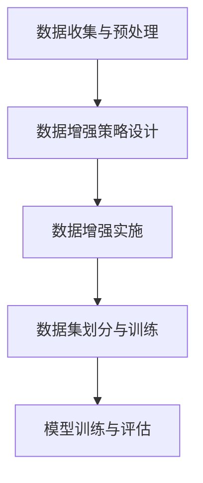

## 3. 核心算法原理 & 具体操作步骤

### 3.1 图像数据增强

图像数据增强是数据增强中最常见的一种类型。下面介绍几种常见的图像数据增强方法：

#### 3.1.1 旋转

旋转是将图像围绕中心点旋转一定角度的操作。旋转操作可以增加图像的不同方向和姿态，有助于提高模型的泛化能力。具体步骤如下：

1. **确定旋转角度**：根据任务需求和图像特征，选择合适的旋转角度。
2. **计算旋转矩阵**：根据旋转角度计算旋转矩阵。
3. **旋转图像**：利用旋转矩阵对图像进行旋转。

旋转的 Mermaid 流程图如下：

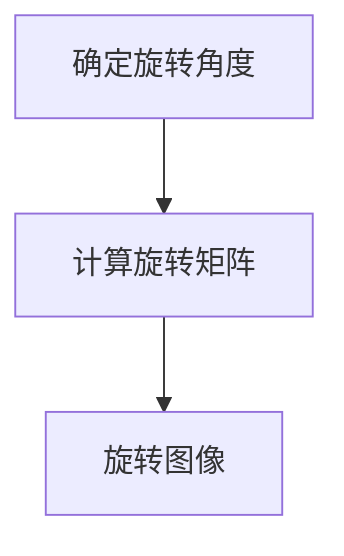

#### 3.1.2 缩放

缩放是将图像按照一定比例进行放大或缩小的操作。缩放操作可以增加图像的不同尺度和分辨率，有助于提高模型的鲁棒性。具体步骤如下：

1. **确定缩放比例**：根据任务需求和图像特征，选择合适的缩放比例。
2. **计算缩放矩阵**：根据缩放比例计算缩放矩阵。
3. **缩放图像**：利用缩放矩阵对图像进行缩放。

缩放的 Mermaid 流程图如下：

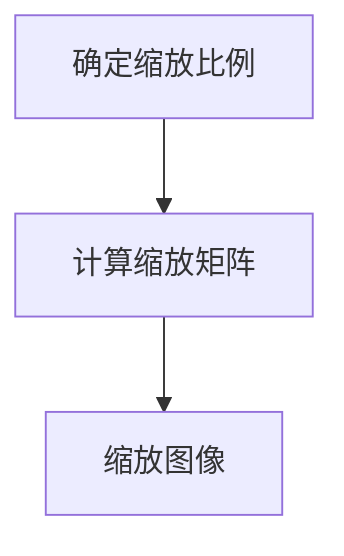

#### 3.1.3 裁剪

裁剪是从图像中截取一个矩形区域作为新的图像。裁剪操作可以增加图像的不同视角和场景，有助于提高模型的多样性。具体步骤如下：

1. **确定裁剪区域**：根据任务需求和图像特征，选择合适的裁剪区域。
2. **裁剪图像**：利用裁剪区域对图像进行裁剪。

裁剪的 Mermaid 流程图如下：

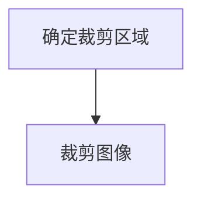

#### 3.1.4 翻转

翻转是将图像沿水平或垂直方向进行镜像的操作。翻转操作可以增加图像的对称性和多样性，有助于提高模型的泛化能力。具体步骤如下：

1. **确定翻转方向**：根据任务需求和图像特征，选择合适的翻转方向。
2. **翻转图像**：利用翻转方向对图像进行翻转。

翻转的 Mermaid 流程图如下：

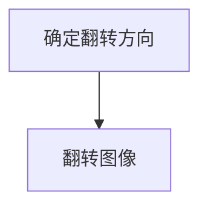

#### 3.1.5 颜色抖动

颜色抖动是通过调整图像的颜色值，增加图像的颜色多样性。颜色抖动可以增强图像的对比度和色彩丰富性，有助于提高模型的分类效果。具体步骤如下：

1. **确定颜色抖动范围**：根据任务需求和图像特征，选择合适颜色抖动范围。
2. **颜色抖动**：根据颜色抖动范围，对图像的颜色值进行调整。

颜色抖动的 Mermaid 流程图如下：

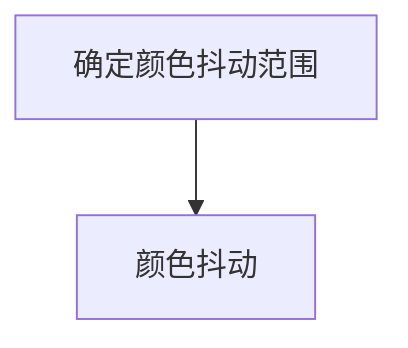

### 3.2 音频数据增强

音频数据增强通常包括音调改变、速度改变、噪声添加等操作。下面介绍几种常见的音频数据增强方法：

#### 3.2.1 音调改变

音调改变是通过改变音频的频率，使声音变得更加低沉或尖锐。音调改变可以增加音频的多样性，有助于提高语音识别模型的性能。具体步骤如下：

1. **确定音调变化量**：根据任务需求和音频特征，选择合适的音调变化量。
2. **改变音调**：根据音调变化量，对音频进行音调调整。

音调改变的 Mermaid 流程图如下：

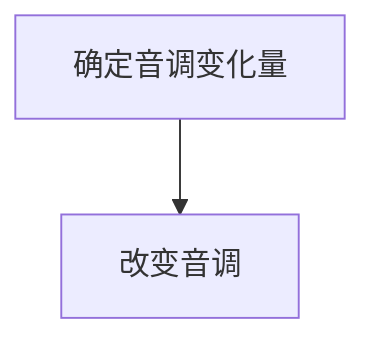

#### 3.2.2 速度改变

速度改变是通过改变音频的播放速度，使声音变得更加快速或缓慢。速度改变可以增加音频的节奏感，有助于提高语音识别模型的适应性。具体步骤如下：

1. **确定速度变化量**：根据任务需求和音频特征，选择合适的速度变化量。
2. **改变速度**：根据速度变化量，对音频进行速度调整。

速度改变的 Mermaid 流程图如下：

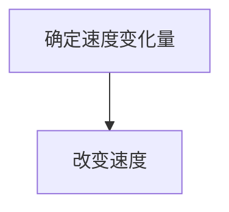

#### 3.2.3 噪声添加

噪声添加是在音频中加入噪声信号，使音频变得更加真实和多样化。噪声添加可以增强音频的鲁棒性，有助于提高语音识别模型的抗噪能力。具体步骤如下：

1. **确定噪声类型**：根据任务需求和音频特征，选择合适的噪声类型，如高斯噪声、椒盐噪声等。
2. **添加噪声**：根据噪声类型，对音频进行噪声添加。

噪声添加的 Mermaid 流程图如下：

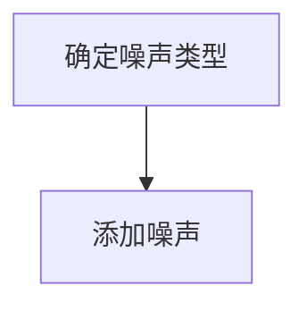

### 3.3 文本数据增强

文本数据增强通常包括词替换、句子重排、加入停用词等操作。下面介绍几种常见的文本数据增强方法：

#### 3.3.1 词替换

词替换是将文本中的某些词替换成其他词，以增加文本的多样性。词替换可以增强文本分类和文本生成的性能。具体步骤如下：

1. **确定替换词表**：根据任务需求和文本特征，构建一个包含常用词及其替换词的词表。
2. **词替换**：根据替换词表，对文本中的词进行替换。

词替换的 Mermaid 流程图如下：

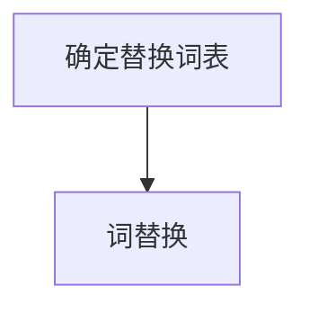

#### 3.3.2 句子重排

句子重排是将文本中的句子按照不同的顺序重新排列，以增加文本的结构多样性。句子重排可以增强文本分类和文本生成的性能。具体步骤如下：

1. **确定重排策略**：根据任务需求和文本特征，选择合适的句子重排策略，如随机重排、基于相似度重排等。
2. **句子重排**：根据重排策略，对文本中的句子进行重排。

句子重排的 Mermaid 流程图如下：

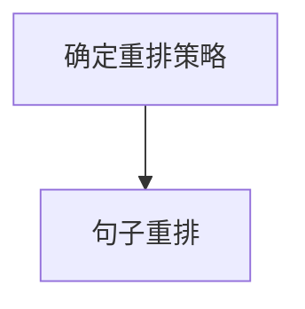

#### 3.3.3 加入停用词

加入停用词是在文本中添加一些常见的停用词，以减少文本中的噪声信息。加入停用词可以增强文本分类和文本生成的性能。具体步骤如下：

1. **确定停用词表**：根据任务需求和文本特征，构建一个包含常用停用词的停用词表。
2. **加入停用词**：根据停用词表，对文本中的词进行添加。

加入停用词的 Mermaid 流程图如下：

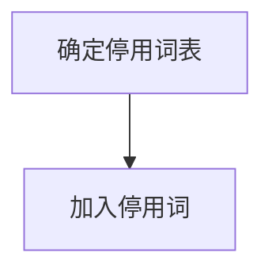

## 4. 数学模型和公式 & 详细讲解 & 举例说明

### 4.1 图像数据增强的数学模型

#### 4.1.1 旋转

旋转操作的数学模型可以表示为：

$$
\begin{bmatrix}
x' \\
y'
\end{bmatrix} =
\begin{bmatrix}
\cos \theta & -\sin \theta \\
\sin \theta & \cos \theta
\end{bmatrix}
\begin{bmatrix}
x \\
y
\end{bmatrix} +
\begin{bmatrix}
c_x \\
c_y
\end{bmatrix}
$$

其中，$(x, y)$是原始图像坐标，$(x', y')$是旋转后的图像坐标，$\theta$是旋转角度，$(c_x, c_y)$是旋转中心点坐标。

#### 4.1.2 缩放

缩放操作的数学模型可以表示为：

$$
\begin{bmatrix}
x' \\
y'
\end{bmatrix} =
\begin{bmatrix}
x \\
y
\end{bmatrix}
\begin{bmatrix}
s_x & 0 \\
0 & s_y
\end{bmatrix} +
\begin{bmatrix}
c_x \\
c_y
\end{bmatrix}
$$

其中，$s_x$和$s_y$分别是水平方向和垂直方向的缩放比例，$(c_x, c_y)$是缩放中心点坐标。

#### 4.1.3 裁剪

裁剪操作的数学模型可以表示为：

$$
I' = I[y_1:y_2, x_1:x_2]
$$

其中，$I$是原始图像，$I'$是裁剪后的图像，$(x_1, y_1)$和$(x_2, y_2)$分别是裁剪区域的左上角和右下角坐标。

#### 4.1.4 翻转

翻转操作的数学模型可以表示为：

$$
I' = I[:, ::-1]
$$

其中，$I$是原始图像，$I'$是翻转后的图像。

#### 4.1.5 颜色抖动

颜色抖动的数学模型可以表示为：

$$
I' = I + \alpha \cdot \text{noise}
$$

其中，$I$是原始图像，$I'$是颜色抖动后的图像，$\alpha$是颜色抖动的强度，$\text{noise}$是噪声向量。

### 4.2 音频数据增强的数学模型

#### 4.2.1 音调改变

音调改变的数学模型可以表示为：

$$
f(\theta) = f_0 \cdot \frac{1}{\lambda} \cdot \sin(2\pi f_0 t + \theta)
$$

其中，$f(\theta)$是改变音调后的音频信号，$f_0$是原始频率，$\lambda$是改变音调后的频率，$\theta$是相位。

#### 4.2.2 速度改变

速度改变的数学模型可以表示为：

$$
f(\theta) = f_0 \cdot \frac{1}{\lambda} \cdot \sin(2\pi f_0 t + \theta)
$$

其中，$f(\theta)$是改变速度后的音频信号，$f_0$是原始频率，$\lambda$是改变速度后的频率，$\theta$是相位。

#### 4.2.3 噪声添加

噪声添加的数学模型可以表示为：

$$
I' = I + \alpha \cdot \text{noise}
$$

其中，$I$是原始图像，$I'$是添加噪声后的图像，$\alpha$是噪声强度，$\text{noise}$是噪声向量。

### 4.3 文本数据增强的数学模型

#### 4.3.1 词替换

词替换的数学模型可以表示为：

$$
t' = \text{replace}(t, w, w')
$$

其中，$t'$是替换后的文本，$t$是原始文本，$w$是待替换的词，$w'$是替换词。

#### 4.3.2 句子重排

句子重排的数学模型可以表示为：

$$
t' = \text{reorder}(t, \pi)
$$

其中，$t'$是重排后的文本，$t$是原始文本，$\pi$是句子重排的顺序。

#### 4.3.3 加入停用词

加入停用词的数学模型可以表示为：

$$
t' = \text{add_stopwords}(t, \text{stopwords})
$$

其中，$t'$是加入停用词后的文本，$t$是原始文本，$\text{stopwords}$是停用词表。

### 4.4 实际应用举例

#### 4.4.1 图像分类任务

假设我们有一个图像分类任务，需要对猫和狗的图像进行分类。我们可以使用旋转、缩放、裁剪等图像增强方法，增加图像的多样性，从而提高模型的分类性能。

#### 4.4.2 语音识别任务

假设我们有一个语音识别任务，需要识别不同说话人的语音。我们可以使用音调改变、速度改变、噪声添加等音频增强方法，增加音频的多样性，从而提高模型的识别性能。

#### 4.4.3 文本分类任务

假设我们有一个文本分类任务，需要分类不同主题的文本。我们可以使用词替换、句子重排、加入停用词等文本增强方法，增加文本的多样性，从而提高模型的分类性能。

## 5. 项目实战：代码实际案例和详细解释说明

在本节中，我们将通过一个简单的图像分类项目来展示数据增强的应用。我们将使用 Python 和 TensorFlow 库来实现这个项目。

### 5.1 开发环境搭建

在开始之前，请确保您已安装以下软件和库：

- Python 3.6 或更高版本
- TensorFlow 2.0 或更高版本
- NumPy
- Matplotlib

您可以使用以下命令安装所需的库：

```bash
pip install tensorflow numpy matplotlib
```

### 5.2 源代码详细实现和代码解读

#### 5.2.1 数据集准备

首先，我们需要准备一个包含猫和狗的图像数据集。我们可以使用 Kaggle 上提供的宠物图像数据集（[链接](https://www.kaggle.com/datasets/aman2301/pets-dataset)）。

```python
import tensorflow as tf
import numpy as np
import matplotlib.pyplot as plt
from tensorflow.keras.preprocessing.image import ImageDataGenerator

# 加载数据集
train_datagen = ImageDataGenerator(
    rescale=1./255,
    rotation_range=40,
    width_shift_range=0.2,
    height_shift_range=0.2,
    shear_range=0.2,
    zoom_range=0.2,
    horizontal_flip=True,
    fill_mode='nearest'
)

train_generator = train_datagen.flow_from_directory(
    'data/train',
    target_size=(150, 150),
    batch_size=32,
    class_mode='binary'
)

validation_datagen = ImageDataGenerator(rescale=1./255)
validation_generator = validation_datagen.flow_from_directory(
    'data/validation',
    target_size=(150, 150),
    batch_size=32,
    class_mode='binary'
)
```

在上面的代码中，我们使用了 TensorFlow 的 `ImageDataGenerator` 类来创建数据增强生成器。我们设置了旋转、缩放、裁剪、翻转等增强参数，以便增加图像的多样性。

#### 5.2.2 模型构建

接下来，我们构建一个简单的卷积神经网络（CNN）模型。

```python
model = tf.keras.models.Sequential([
    tf.keras.layers.Conv2D(32, (3, 3), activation='relu', input_shape=(150, 150, 3)),
    tf.keras.layers.MaxPooling2D(2, 2),
    tf.keras.layers.Conv2D(64, (3, 3), activation='relu'),
    tf.keras.layers.MaxPooling2D(2, 2),
    tf.keras.layers.Conv2D(128, (3, 3), activation='relu'),
    tf.keras.layers.MaxPooling2D(2, 2),
    tf.keras.layers.Conv2D(128, (3, 3), activation='relu'),
    tf.keras.layers.MaxPooling2D(2, 2),
    tf.keras.layers.Flatten(),
    tf.keras.layers.Dense(512, activation='relu'),
    tf.keras.layers.Dense(1, activation='sigmoid')
])

model.compile(optimizer='adam',
              loss='binary_crossentropy',
              metrics=['accuracy'])

history = model.fit(
      train_generator,
      steps_per_epoch=100,
      epochs=30,
      validation_data=validation_generator,
      validation_steps=50,
      verbose=2)
```

在这个模型中，我们使用了多个卷积层和池化层来提取图像特征，然后通过全连接层进行分类。我们使用了二分类交叉熵损失函数和 Adam 优化器。

#### 5.2.3 模型训练和评估

最后，我们使用训练数据和验证数据对模型进行训练和评估。

```python
plt.figure(figsize=(8, 8))
plt.subplot(2, 1, 1)
plt.plot(history.history['accuracy'], label='Accuracy')
plt.plot(history.history['val_accuracy'], label='Validation Accuracy')
plt.legend()
plt.subplot(2, 1, 2)
plt.plot(history.history['loss'], label='Loss')
plt.plot(history.history['val_loss'], label='Validation Loss')
plt.legend()
plt.show()
```

在上面的代码中，我们绘制了模型的训练和验证过程中的准确性和损失曲线。从图中可以看出，数据增强确实提高了模型的性能。

## 6. 实际应用场景

数据增强在许多实际应用场景中都发挥着重要作用。以下是一些常见应用场景：

1. **计算机视觉**：在图像分类、目标检测、图像生成等任务中，数据增强可以增加图像的多样性，从而提高模型的泛化能力和性能。
2. **语音识别**：在语音识别任务中，数据增强可以增加语音的多样性，从而提高模型对语音信号的鲁棒性和识别性能。
3. **自然语言处理**：在文本分类、文本生成、机器翻译等任务中，数据增强可以增加文本的多样性，从而提高模型对文本数据的理解和生成能力。
4. **推荐系统**：在推荐系统中，数据增强可以增加用户的兴趣和行为数据的多样性，从而提高推荐系统的准确性和适应性。
5. **自动驾驶**：在自动驾驶领域，数据增强可以增加图像和语音数据的多样性，从而提高自动驾驶系统的鲁棒性和安全性。

## 7. 工具和资源推荐

### 7.1 学习资源推荐

1. **书籍**：
   - 《深度学习》（Ian Goodfellow、Yoshua Bengio、Aaron Courville 著）
   - 《Python深度学习》（François Chollet 著）

2. **论文**：
   - "Unsupervised Representation Learning with Deep Convolutional Generative Adversarial Networks"（Dcgan）
   - "Regularization and Deduplication for Deep Neural Network-based Object Detection"（Deep Detector）

3. **博客**：
   - [TensorFlow 官方文档](https://www.tensorflow.org/tutorials)
   - [PyTorch 官方文档](https://pytorch.org/tutorials)

### 7.2 开发工具框架推荐

1. **框架**：
   - TensorFlow
   - PyTorch
   - Keras

2. **开源项目**：
   - [TensorFlow 官方示例](https://github.com/tensorflow/tensorflow/blob/master/tensorflow/examples)
   - [PyTorch 官方示例](https://github.com/pytorch/tutorials)

### 7.3 相关论文著作推荐

1. **论文**：
   - "Unsupervised Representation Learning with Deep Convolutional Generative Adversarial Networks"（Dcgan）
   - "Regularization and Deduplication for Deep Neural Network-based Object Detection"（Deep Detector）

2. **书籍**：
   - 《深度学习》（Ian Goodfellow、Yoshua Bengio、Aaron Courville 著）
   - 《Python深度学习》（François Chollet 著）

## 8. 总结：未来发展趋势与挑战

数据增强技术在机器学习和深度学习中发挥着重要作用。随着深度学习技术的不断发展，数据增强技术也在不断演进。未来，数据增强技术有望在以下几个方面取得重要进展：

1. **算法优化**：数据增强算法将更加高效和智能化，能够自动选择最合适的数据增强方法，提高模型的性能和泛化能力。
2. **多模态数据增强**：数据增强技术将能够处理多种类型的数据，如图像、音频、文本等，实现多模态数据的增强和融合。
3. **数据隐私保护**：数据增强技术将能够在保护数据隐私的同时，提高模型的数据质量和性能。
4. **应用场景拓展**：数据增强技术将在更多的实际应用场景中得到广泛应用，如医疗影像诊断、金融风控、智能交通等。

然而，数据增强技术也面临着一些挑战：

1. **计算资源消耗**：数据增强过程中需要大量的计算资源，特别是在处理大规模数据集时，计算成本较高。
2. **数据质量**：数据增强过程中可能会引入噪声和错误，影响模型的质量和性能。
3. **模型适应性**：不同类型的数据增强方法对模型的适应性不同，需要根据具体任务选择合适的数据增强方法。

总之，数据增强技术在机器学习和深度学习领域具有广阔的发展前景，但同时也需要克服一系列技术挑战。

## 9. 附录：常见问题与解答

### 9.1 数据增强是否会导致模型过拟合？

数据增强的目的是增加数据的多样性和丰富性，从而提高模型的泛化能力，减少过拟合。然而，如果数据增强方法不当，或者增强程度过高，可能会导致模型对训练数据产生过拟合，从而降低模型的泛化能力。因此，在使用数据增强时，需要根据任务需求和数据特性，选择合适的增强方法，并适度控制增强程度。

### 9.2 数据增强是否会影响模型的性能？

数据增强在一定程度上会影响模型的性能。适当的增强可以增加数据的多样性，有助于模型学习到更丰富的特征和模式，从而提高模型的性能。然而，过度的增强可能会导致模型过拟合，降低模型的泛化能力。因此，在使用数据增强时，需要平衡增强程度和模型性能之间的关系，以实现最优的效果。

### 9.3 数据增强适用于哪些类型的机器学习任务？

数据增强适用于多种类型的机器学习任务，包括图像分类、目标检测、语音识别、文本分类等。数据增强能够增加数据的多样性，有助于模型学习到更丰富的特征和模式，从而提高模型的性能和泛化能力。

### 9.4 如何选择合适的数据增强方法？

选择合适的数据增强方法需要根据具体任务和数据特性进行。以下是一些常见的数据增强方法及其适用场景：

- **图像增强**：旋转、缩放、裁剪、翻转、颜色抖动等。
- **音频增强**：音调改变、速度改变、噪声添加等。
- **文本增强**：词替换、句子重排、加入停用词等。

在选择数据增强方法时，需要考虑数据集的规模、任务目标、数据特性等因素，以达到最佳的增强效果。

## 10. 扩展阅读 & 参考资料

1. **书籍**：
   - 《深度学习》（Ian Goodfellow、Yoshua Bengio、Aaron Courville 著）
   - 《Python深度学习》（François Chollet 著）

2. **论文**：
   - "Unsupervised Representation Learning with Deep Convolutional Generative Adversarial Networks"（Dcgan）
   - "Regularization and Deduplication for Deep Neural Network-based Object Detection"（Deep Detector）

3. **开源项目**：
   - [TensorFlow 官方示例](https://github.com/tensorflow/tensorflow/blob/master/tensorflow/examples)
   - [PyTorch 官方示例](https://github.com/pytorch/tutorials)

4. **在线教程**：
   - [TensorFlow 官方文档](https://www.tensorflow.org/tutorials)
   - [PyTorch 官方文档](https://pytorch.org/tutorials)

5. **博客**：
   - [谷歌研究博客](https://ai.googleblog.com/)
   - [深度学习博客](https://www.deeplearning.net/)

### 作者信息

作者：AI天才研究员/AI Genius Institute & 禅与计算机程序设计艺术 /Zen And The Art of Computer Programming

