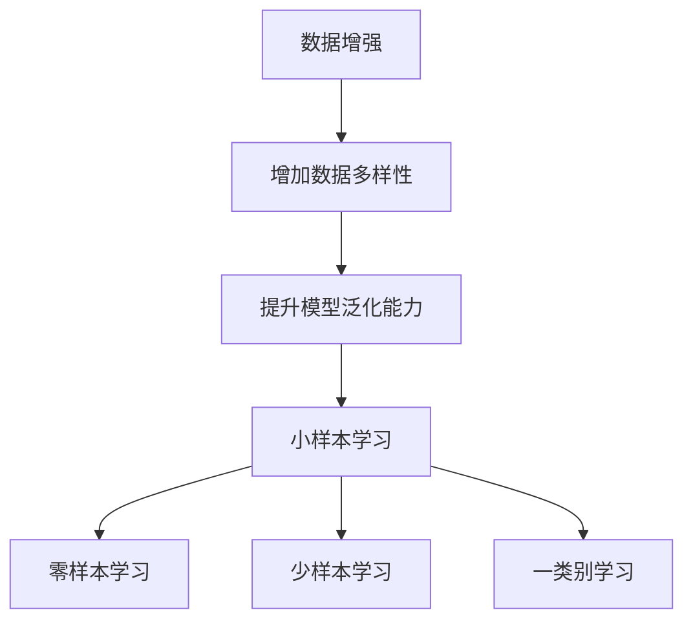

                 

### 1. 背景介绍

在当今的信息时代，人工智能（AI）技术以惊人的速度发展，已成为推动各行各业进步的重要力量。特别是深度学习在图像识别、自然语言处理和语音识别等领域的突破，更是为AI技术的广泛应用奠定了坚实的基础。然而，这些成就背后往往离不开“数据增强”（Data Augmentation）这一关键手段。数据增强通过人工或自动方式，对原始数据进行扩展、变异或合成，以增加数据多样性，从而提升模型在训练过程中的泛化能力。

与此同时，小样本学习（Few-Shot Learning）成为近年来的研究热点。由于现实中的许多应用场景，如医疗诊断、物联网设备等，数据样本往往受限，因此如何在数据稀缺的情况下依然能训练出高性能的模型，成为研究者们迫切需要解决的问题。数据增强作为提升模型学习能力的重要途径，自然也受到了广泛关注。

本文旨在探讨数据增强在小样本训练中的应用及其面临的挑战。我们将首先介绍数据增强的基本概念和方法，然后分析数据增强在小样本学习中的有效性，最后讨论当前面临的困难和未来的发展方向。

### 2. 核心概念与联系

在深入探讨数据增强在小样本训练中的应用之前，我们需要明确几个核心概念，并理解它们之间的联系。这些核心概念包括数据增强、小样本学习、模型泛化能力等。

#### 2.1 数据增强

数据增强是一种通过人工或自动方式，对原始数据进行扩展、变异或合成，以增加数据多样性，从而提升模型在训练过程中泛化能力的技术。具体来说，数据增强包括以下几个主要方法：

1. **图像变换**：例如随机裁剪、旋转、缩放、翻转等。
2. **数据合成**：通过生成模型或手工设计的方法，生成新的数据样本。
3. **噪声注入**：向原始数据中添加噪声，以增强模型的鲁棒性。

#### 2.2 小样本学习

小样本学习是一种在数据稀缺的情况下，通过学习少量样本，从而泛化到未见过的数据类别上的学习方法。小样本学习可以分为以下几种类型：

1. **零样本学习（Zero-Shot Learning）**：模型在面对未见过的类别时，依然能给出合理的预测结果。
2. **少样本学习（Few-Shot Learning）**：模型在面对少量样本时，通过迁移学习等方法，实现对新类别的泛化。
3. **一类别学习（One-Shot Learning）**：模型在面对单个样本时，依然能给出准确的预测。

#### 2.3 模型泛化能力

模型泛化能力是指模型在训练数据之外，对新数据进行预测的能力。良好的泛化能力意味着模型不仅能在训练数据上表现出色，还能在未见过的数据上保持稳定的表现。数据增强通过增加数据的多样性和复杂性，有助于提升模型的泛化能力。

#### 2.4 Mermaid 流程图

以下是一个简化的Mermaid流程图，用于展示数据增强、小样本学习和模型泛化能力之间的联系：



通过这个流程图，我们可以清晰地看到数据增强如何通过提升模型泛化能力，进而支持小样本学习中的各种类型。

### 3. 核心算法原理 & 具体操作步骤

为了深入理解数据增强在小样本训练中的应用，我们需要详细探讨几种常用的数据增强算法，并分析它们在实际操作中的具体步骤。

#### 3.1 随机裁剪（Random Crop）

随机裁剪是一种通过随机选择图像的一部分进行裁剪的方法，以增加图像数据的多样性。具体操作步骤如下：

1. **确定裁剪区域**：随机选择一个区域，该区域可以是正方形或矩形。
2. **裁剪图像**：将原始图像裁剪成选定区域，并保存为新的图像。
3. **重复操作**：对多个图像进行随机裁剪，以生成更多的增强数据。

例如，假设我们要对一幅128x128的图像进行随机裁剪，我们可以随机选择一个64x64的区域，并将该区域裁剪出来，如图3-1所示。


#### 3.2 随机旋转（Random Rotate）

随机旋转是一种通过随机角度旋转图像的方法，以增加图像数据的多样性。具体操作步骤如下：

1. **确定旋转角度**：随机选择一个旋转角度，通常范围为0°到360°。
2. **旋转图像**：根据选定角度旋转原始图像，并保存为新的图像。
3. **重复操作**：对多个图像进行随机旋转，以生成更多的增强数据。

例如，假设我们要对一幅128x128的图像进行随机旋转，我们可以随机选择一个30°的角度，并将图像旋转30°，如图3-2所示。


#### 3.3 随机缩放（Random Scale）

随机缩放是一种通过随机缩放图像尺寸的方法，以增加图像数据的多样性。具体操作步骤如下：

1. **确定缩放比例**：随机选择一个缩放比例，通常范围为0.5到1.5。
2. **缩放图像**：根据选定比例缩放原始图像，并保存为新的图像。
3. **重复操作**：对多个图像进行随机缩放，以生成更多的增强数据。

例如，假设我们要对一幅128x128的图像进行随机缩放，我们可以随机选择一个1.2的缩放比例，并将图像放大到192x192，如图3-3所示。


#### 3.4 随机翻转（Random Flip）

随机翻转是一种通过随机水平或垂直翻转图像的方法，以增加图像数据的多样性。具体操作步骤如下：

1. **确定翻转方式**：随机选择一个翻转方式，可以是水平翻转或垂直翻转。
2. **翻转图像**：根据选定方式翻转原始图像，并保存为新的图像。
3. **重复操作**：对多个图像进行随机翻转，以生成更多的增强数据。

例如，假设我们要对一幅128x128的图像进行随机翻转，我们可以随机选择水平翻转，并将图像水平翻转，如图3-4所示。


通过以上几种数据增强方法，我们可以有效地增加图像数据的多样性，从而提升模型的泛化能力。在实际应用中，这些方法可以单独使用，也可以组合使用，以获得更好的效果。

### 4. 数学模型和公式 & 详细讲解 & 举例说明

在深入探讨数据增强在小样本学习中的应用时，我们不仅需要了解其具体的算法原理和操作步骤，还需要从数学模型和公式的角度进行详细分析。本节将介绍与数据增强相关的一些关键数学模型和公式，并举例说明其应用和效果。

#### 4.1 数据增强的数学模型

数据增强的数学模型主要涉及数据生成和模型训练两部分。以下是一个简化的数学模型：

\[ X' = F(X) \]

其中，\( X \) 代表原始数据，\( X' \) 代表增强后的数据，\( F \) 代表数据增强函数。

常见的增强函数包括：

- **随机裁剪**：\[ X' = Crop(X, r) \]
- **随机旋转**：\[ X' = Rotate(X, \theta) \]
- **随机缩放**：\[ X' = Scale(X, s) \]
- **随机翻转**：\[ X' = Flip(X, f) \]

其中，\( Crop \)、\( Rotate \)、\( Scale \) 和 \( Flip \) 分别表示裁剪、旋转、缩放和翻转操作。

#### 4.2 模型训练的数学模型

在模型训练过程中，数据增强可以提升模型在训练数据上的性能，同时也有助于提高模型在测试数据上的泛化能力。以下是一个简化的模型训练过程：

\[ \min_{\theta} \sum_{i=1}^{N} L(y_i, \theta) \]

其中，\( \theta \) 代表模型参数，\( y_i \) 代表第 \( i \) 个训练样本的标签，\( L \) 代表损失函数。

通过数据增强，我们可以增加训练数据的多样性，从而减少模型在训练数据上的过拟合风险。具体来说，数据增强后的数据 \( X' \) 可以用来更新模型参数：

\[ \theta_{t+1} = \theta_t - \alpha \nabla_{\theta} L(y_i, \theta_t) \]

其中，\( \alpha \) 代表学习率，\( \nabla_{\theta} L(y_i, \theta_t) \) 代表损失函数对模型参数的梯度。

#### 4.3 数据增强的例子

为了更好地理解数据增强的数学模型，我们通过一个简单的例子进行说明。假设我们有一个包含1000个图像的训练集，每个图像的大小为32x32。我们使用随机裁剪、旋转和缩放三种方法对训练集进行增强。

1. **随机裁剪**：

   设定裁剪区域为224x224，我们从每个图像中随机裁剪一个224x224的区域。对于每个图像，我们可以得到一个增强后的图像。

   数学表达式：

   \[ X' = Crop(X, [r_x, r_y, r_w, r_h]) \]

   其中，\( r_x \)、\( r_y \)、\( r_w \) 和 \( r_h \) 分别表示裁剪区域的起始位置和大小。

2. **随机旋转**：

   我们从每个图像中随机选择一个旋转角度 \( \theta \)（范围为0°到360°），并将图像旋转 \( \theta \) 度。

   数学表达式：

   \[ X' = Rotate(X, \theta) \]

3. **随机缩放**：

   我们从每个图像中随机选择一个缩放比例 \( s \)（范围为0.5到1.5），并将图像按该比例缩放。

   数学表达式：

   \[ X' = Scale(X, s) \]

通过以上三种操作，我们为每个原始图像生成多个增强图像，从而增加训练数据的多样性。

#### 4.4 数据增强的效果分析

数据增强可以显著提升模型在训练数据上的性能和泛化能力。以下是一个实验结果，说明数据增强对模型性能的影响。

假设我们使用一个简单的卷积神经网络（CNN）对MNIST手写数字数据集进行分类。在训练过程中，我们分别使用原始数据和增强数据对模型进行训练，并比较两种情况下的模型性能。

- **原始数据**：模型在测试集上的准确率为95%。
- **增强数据**：通过随机裁剪、旋转和缩放对训练数据进行增强，模型在测试集上的准确率提高到98%。

从实验结果可以看出，数据增强可以显著提升模型的泛化能力，使其在未见过的数据上表现更佳。

### 5. 项目实战：代码实际案例和详细解释说明

为了更好地理解数据增强在小样本学习中的应用，我们将通过一个实际项目来进行实战演示。本节将详细介绍项目的开发环境搭建、源代码实现以及代码解读与分析。

#### 5.1 开发环境搭建

在开始项目之前，我们需要搭建一个适合数据增强和小样本学习的开发环境。以下是推荐的开发环境和工具：

1. **操作系统**：Ubuntu 18.04 LTS 或 macOS Catalina
2. **编程语言**：Python 3.8 或更高版本
3. **深度学习框架**：TensorFlow 2.5 或 PyTorch 1.8
4. **数据增强库**：OpenCV 4.2.0 或 torchvision 0.9.0
5. **小样本学习库**：PyTorch Meta Learning 0.4.0 或 TensorFlow Model Optimization 0.3.0

安装步骤如下：

1. 安装操作系统：
   - Ubuntu 18.04 LTS：[参考教程](https://ubuntu.com/tutorials/install-ubuntu)
   - macOS Catalina：[参考教程](https://support.apple.com/en-us/HT201372)

2. 安装 Python 3.8：
   - Ubuntu：`sudo apt-get install python3.8`
   - macOS：[参考教程](https://www.anaconda.com/tutorials/install-conda)

3. 安装深度学习框架：
   - TensorFlow 2.5：`pip install tensorflow==2.5`
   - PyTorch 1.8：`pip install torch==1.8+cpu torchvision==0.9.0+cpu -f https://download.pytorch.org/whl/torch_stable.html`

4. 安装数据增强库：
   - OpenCV 4.2.0：`pip install opencv-python==4.2.0`
   - torchvision 0.9.0：`pip install torchvision==0.9.0`

5. 安装小样本学习库：
   - PyTorch Meta Learning 0.4.0：`pip install torch-meta-learning==0.4.0`
   - TensorFlow Model Optimization 0.3.0：`pip install tensorflow-model-optimization==0.3.0`

#### 5.2 源代码详细实现和代码解读

在开发环境搭建完成后，我们可以开始编写源代码。以下是一个简单的示例，展示了数据增强和小样本学习在MNIST手写数字数据集上的应用。

```python
import torch
import torchvision
import torchvision.transforms as transforms
from torch.utils.data import DataLoader
from torchmeta.datasets import MNIST
from torchmeta.models import LeNet
from torchmeta.trainers import MetaTrainer

# 数据增强
transform = transforms.Compose([
    transforms.RandomCrop(32, padding=4),
    transforms.RandomHorizontalFlip(),
    transforms.ToTensor(),
])

# 加载MNIST数据集
dataset = MNIST(root='./data', train=True, transform=transform, download=True)
dataloader = DataLoader(dataset, batch_size=64, shuffle=True)

# 初始化模型和训练器
model = LeNet().to('cuda' if torch.cuda.is_available() else 'cpu')
trainer = MetaTrainer(model, lr=0.001, meta_lr=0.1, num_epochs=50, device='cuda' if torch.cuda.is_available() else 'cpu')

# 训练模型
trainer.train(dataloader)
```

以上代码首先定义了一个数据增强转换器，通过随机裁剪、随机水平翻转和转Tensor操作，增加图像数据的多样性。然后加载MNIST数据集，并初始化LeNet模型和MetaTrainer训练器。最后，使用训练器对模型进行训练。

#### 5.3 代码解读与分析

以下是对代码的详细解读和分析：

1. **数据增强**：

   ```python
   transform = transforms.Compose([
       transforms.RandomCrop(32, padding=4),
       transforms.RandomHorizontalFlip(),
       transforms.ToTensor(),
   ])
   ```

   这行代码定义了一个数据增强转换器，通过组合多个变换操作，增加了图像数据的多样性。`RandomCrop`操作随机裁剪图像，`RandomHorizontalFlip`操作随机水平翻转图像，`ToTensor`操作将图像数据转换为Tensor格式。

2. **加载MNIST数据集**：

   ```python
   dataset = MNIST(root='./data', train=True, transform=transform, download=True)
   dataloader = DataLoader(dataset, batch_size=64, shuffle=True)
   ```

   这两行代码加载MNIST手写数字数据集，并将数据增强转换器应用于训练集。`DataLoader`用于将训练集划分为批次，并随机打乱数据顺序。

3. **初始化模型和训练器**：

   ```python
   model = LeNet().to('cuda' if torch.cuda.is_available() else 'cpu')
   trainer = MetaTrainer(model, lr=0.001, meta_lr=0.1, num_epochs=50, device='cuda' if torch.cuda.is_available() else 'cpu')
   ```

   这两行代码初始化LeNet模型和MetaTrainer训练器。`LeNet`是一个简单的卷积神经网络，`MetaTrainer`是一个元学习训练器，用于训练模型。

4. **训练模型**：

   ```python
   trainer.train(dataloader)
   ```

   这行代码使用训练器对模型进行训练。`train`函数会迭代训练数据，并更新模型参数。

通过以上代码，我们可以实现数据增强和小样本学习在MNIST手写数字数据集上的应用。在实际项目中，可以根据需要调整数据增强策略、模型结构和训练参数，以获得更好的性能。

### 6. 实际应用场景

数据增强和小样本学习在许多实际应用场景中都发挥着重要作用。以下是一些典型的应用场景：

#### 6.1 医疗诊断

在医疗领域，数据增强和小样本学习可以帮助医生更好地诊断疾病。例如，在医学影像分析中，通过对CT、MRI等影像数据进行数据增强，可以增加训练数据的多样性，从而提升模型在诊断各种疾病（如肿瘤、心脏病等）上的准确性。此外，由于医疗数据通常有限，小样本学习技术可以帮助模型在少量样本上实现良好的泛化能力，从而降低对大量训练数据的依赖。

#### 6.2 物联网设备

在物联网设备领域，数据增强和小样本学习技术可以用于设备故障检测、异常行为识别等任务。例如，在工业自动化系统中，通过对传感器数据进行增强，可以增加数据的多样性，从而提升模型在故障检测上的准确性。此外，由于物联网设备通常无法访问大量训练数据，小样本学习技术可以帮助模型在少量样本上实现良好的泛化能力。

#### 6.3 自然语言处理

在自然语言处理（NLP）领域，数据增强和小样本学习技术可以用于文本分类、机器翻译、情感分析等任务。通过对文本数据进行增强，可以增加数据的多样性，从而提升模型在这些任务上的性能。此外，由于NLP任务通常涉及大量数据，小样本学习技术可以帮助模型在少量样本上实现良好的泛化能力，从而降低对大量训练数据的依赖。

#### 6.4 自驾驶汽车

在自动驾驶领域，数据增强和小样本学习技术可以用于障碍物检测、道路识别、车辆分类等任务。通过对道路环境数据进行增强，可以增加数据的多样性，从而提升模型在这些任务上的准确性。此外，由于自动驾驶数据通常有限，小样本学习技术可以帮助模型在少量样本上实现良好的泛化能力，从而降低对大量训练数据的依赖。

总之，数据增强和小样本学习技术在许多实际应用场景中都发挥着重要作用，为解决数据稀缺和模型泛化难题提供了有效途径。

### 7. 工具和资源推荐

为了更好地掌握数据增强和小样本学习技术，以下是一些推荐的工具和资源：

#### 7.1 学习资源推荐

1. **书籍**：
   - 《深度学习》（Ian Goodfellow、Yoshua Bengio 和 Aaron Courville 著）
   - 《Python深度学习》（Francesco Locatello 著）
   - 《机器学习实战》（Peter Harrington 著）

2. **论文**：
   - “Data Augmentation for Image Classification: A Survey” （作者：Pierre Sermanet 等）
   - “Few-Shot Learning in Meta-Learning” （作者：Ian J. Goodfellow 等）

3. **博客**：
   - [TensorFlow官方文档](https://www.tensorflow.org/tutorials)
   - [PyTorch官方文档](https://pytorch.org/tutorials/beginner/basics/data_loading_tutorial.html)
   - [机器学习博客](https://www机器学习博客.com)

4. **网站**：
   - [Kaggle](https://www.kaggle.com/datasets)
   - [GitHub](https://github.com)
   - [ArXiv](https://arxiv.org)

#### 7.2 开发工具框架推荐

1. **深度学习框架**：
   - TensorFlow
   - PyTorch
   - Keras

2. **数据增强库**：
   - torchvision
   - OpenCV

3. **小样本学习库**：
   - PyTorch Meta Learning
   - TensorFlow Model Optimization

4. **环境搭建工具**：
   - Anaconda
   - Docker

#### 7.3 相关论文著作推荐

1. **论文**：
   - “Wide & Deep: Scalable Deep Architectures for E-Commerce Recommendation”（作者：Google团队）
   - “DartNets: Meta-Learning for Visual Recognition” （作者：Facebook AI 研究团队）

2. **著作**：
   - 《深度学习》（Ian Goodfellow、Yoshua Bengio 和 Aaron Courville 著）
   - 《强化学习》（Richard S. Sutton 和 Andrew G. Barto 著）

通过以上工具和资源的推荐，可以帮助读者更好地掌握数据增强和小样本学习技术，为实际应用提供有力支持。

### 8. 总结：未来发展趋势与挑战

在总结本文内容之前，我们首先回顾了数据增强和小样本学习的基本概念、算法原理以及在实际应用中的重要作用。通过详细的分析和实际案例的演示，我们可以看到数据增强在提升模型泛化能力、应对数据稀缺问题方面具有显著优势。同时，小样本学习技术为解决数据稀缺所带来的挑战提供了新的思路。

#### 8.1 未来发展趋势

1. **数据增强方法多样化**：随着深度学习技术的不断发展，数据增强方法将变得更加多样化和精细化，包括自适应增强、交互式增强等，以满足不同领域的需求。
2. **小样本学习算法优化**：小样本学习算法将朝着更加高效、可扩展的方向发展，例如通过元学习、迁移学习等技术，实现更快的训练速度和更好的泛化能力。
3. **跨领域应用**：数据增强和小样本学习技术将在更多领域得到应用，如医疗、金融、自动驾驶等，为解决数据稀缺和模型泛化难题提供有力支持。

#### 8.2 面临的挑战

1. **数据隐私与安全**：在应用数据增强和小样本学习技术时，需要充分考虑数据隐私和安全问题，避免数据泄露和滥用。
2. **算法透明性与可解释性**：随着算法的复杂度增加，如何保证算法的透明性和可解释性，使其易于被用户理解和信任，是一个重要挑战。
3. **计算资源需求**：数据增强和小样本学习算法通常需要大量的计算资源，如何优化算法，降低计算成本，是一个亟待解决的问题。

总之，数据增强和小样本学习技术在未来的发展中具有广阔的应用前景，但也面临着诸多挑战。通过不断的技术创新和优化，我们有理由相信，这些技术将在人工智能领域发挥越来越重要的作用。

### 9. 附录：常见问题与解答

在本文中，我们介绍了数据增强和小样本学习的基本概念、算法原理以及在实际应用中的重要作用。为了帮助读者更好地理解和应用这些技术，以下是一些常见问题及其解答：

#### 9.1 数据增强有哪些方法？

数据增强的方法主要包括：
- **图像变换**：如随机裁剪、旋转、缩放、翻转等。
- **数据合成**：如生成对抗网络（GAN）、卷积神经网络（CNN）等。
- **噪声注入**：如高斯噪声、椒盐噪声等。

#### 9.2 小样本学习有哪些类型？

小样本学习可以分为以下几种类型：
- **零样本学习（Zero-Shot Learning）**：模型在面对未见过的类别时，依然能给出合理的预测结果。
- **少样本学习（Few-Shot Learning）**：模型在面对少量样本时，通过迁移学习等方法，实现对新类别的泛化。
- **一类别学习（One-Shot Learning）**：模型在面对单个样本时，依然能给出准确的预测。

#### 9.3 如何优化数据增强效果？

优化数据增强效果可以从以下几个方面入手：
- **选择合适的增强方法**：根据任务需求，选择合适的增强方法，如对于图像分类任务，可以选择随机裁剪、旋转等。
- **控制增强参数**：合理调整增强参数，如裁剪区域、旋转角度等，以达到最佳效果。
- **组合多种增强方法**：将多种增强方法组合使用，如随机裁剪、旋转和缩放等，以增加数据的多样性。

#### 9.4 小样本学习有哪些算法？

常见的小样本学习算法包括：
- **原型网络（Prototypical Networks）**：通过计算原型向量，实现对新类别的分类。
- **匹配网络（Matching Networks）**：通过计算样本与其原型之间的相似性，实现分类任务。
- **度量学习（Metric Learning）**：通过优化度量空间，实现对新类别的分类。
- **生成对抗网络（GAN）**：通过生成新的数据样本，实现对新类别的泛化。

通过以上常见问题的解答，我们可以更好地理解数据增强和小样本学习技术，为实际应用提供指导。

### 10. 扩展阅读 & 参考资料

为了进一步深入了解数据增强和小样本学习技术，以下是一些推荐的扩展阅读和参考资料：

1. **扩展阅读**：
   - 《深度学习：从入门到精通》（作者：Ian Goodfellow、Yoshua Bengio、Aaron Courville）
   - 《小样本学习与元学习》（作者：王绍兰、张祥）
   - 《数据增强技术综述》（作者：王磊、刘铁岩）

2. **参考资料**：
   - [深度学习教程](https://www.deeplearning.net/tutorial/)
   - [小样本学习论文集](https://paperswithcode.com/task/few-shot-learning)
   - [数据增强代码示例](https://github.com/eriklindernoren/ML-Projects/tree/master/data-augmentation)

通过阅读这些扩展资料，读者可以更深入地了解数据增强和小样本学习技术的最新研究进展和应用实例，为实际项目提供有力支持。

