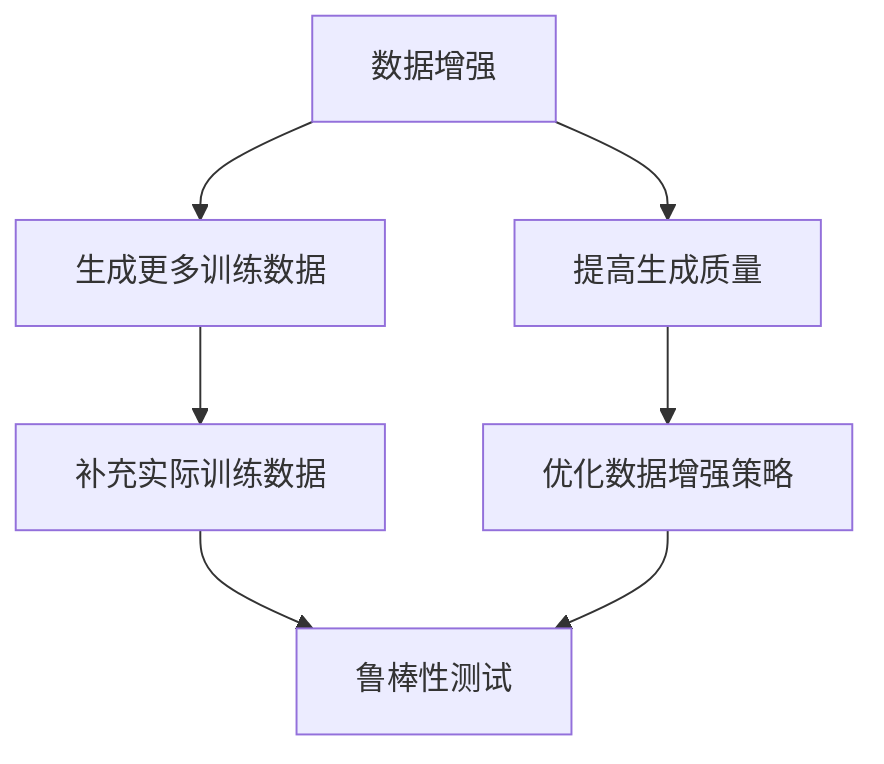
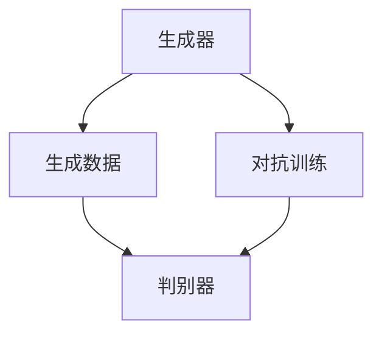
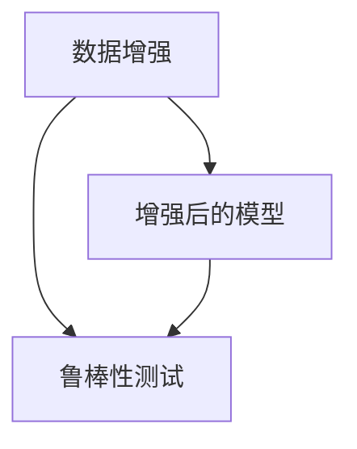

                 

# 数据增强生怪模型，鲁棒性测试不可少

## 关键词
- 数据增强
- 生怪模型
- 鲁棒性测试

## 摘要

在深度学习领域中，数据增强作为一种提升模型泛化能力的重要手段，已经得到了广泛应用。本文将深入探讨数据增强技术，特别是在生怪模型中的应用，并强调鲁棒性测试在数据增强过程中的重要性。我们将从数据增强的基本概念入手，分析其在生怪模型中的作用，探讨如何设计有效的数据增强策略，并详细讲解鲁棒性测试的方法和重要性。最后，我们将总结数据增强技术的发展趋势和面临的挑战。

## 1. 背景介绍

### 数据增强的定义

数据增强（Data Augmentation）是指通过一系列的预处理操作来增加训练数据的多样性，从而提高模型的泛化能力。这些操作包括图像旋转、翻转、缩放、裁剪等，可以通过在原始数据上施加不同的变换来生成新的数据样本。

### 数据增强的重要性

在深度学习模型训练过程中，数据增强具有以下几个重要作用：

- **提高模型的泛化能力**：通过增加训练数据的多样性，模型能够更好地学习到数据中的潜在规律，从而提高在未知数据上的表现。
- **减少过拟合风险**：过拟合是指模型在训练数据上表现优异，但在新的数据上表现较差。通过数据增强，可以减少模型对训练数据的依赖，降低过拟合的风险。
- **节省时间和计算资源**：在某些应用场景中，获取大量的高质量训练数据可能非常困难且昂贵。通过数据增强，可以在一定程度上减少对大规模数据的依赖。

### 生怪模型的概念

生怪模型（Generative Adversarial Networks, GAN）是一种由生成器（Generator）和判别器（Discriminator）组成的深度学习模型。生成器的任务是生成与真实数据相似的数据样本，而判别器的任务是区分真实数据和生成数据。通过两个网络的对抗训练，生成器不断优化生成质量，使生成的数据越来越接近真实数据。

### 鲁棒性测试的定义

鲁棒性测试（Robustness Testing）是指对模型在面临各种攻击和异常输入时的稳定性和准确性进行评估。鲁棒性测试旨在检测模型是否能够正确处理非标准的输入，包括噪声、恶意攻击等。

### 鲁棒性测试的重要性

- **确保模型安全性**：在现实应用中，模型可能会面临各种恶意攻击，如对抗性攻击。通过鲁棒性测试，可以评估模型对这些攻击的抵抗能力，从而提高模型的安全性。
- **提升模型可信度**：在关键任务中，如自动驾驶、医疗诊断等，模型的鲁棒性直接关系到决策的正确性。通过鲁棒性测试，可以确保模型在复杂环境中能够稳定运行，提高决策的可信度。
- **发现模型弱点**：鲁棒性测试可以帮助研究者发现模型的潜在弱点，从而有针对性地改进模型设计和训练过程。

## 2. 核心概念与联系

### 数据增强与生怪模型的关系

数据增强和生怪模型之间存在着密切的联系。数据增强技术可以为生怪模型提供更多的训练数据，从而提高生成器的生成质量。同时，生怪模型的生成数据可以用来补充实际训练数据，提高数据增强的效果。

### 鲁棒性测试与数据增强的关系

鲁棒性测试可以用来评估数据增强后的模型在面临各种攻击和异常输入时的表现。通过鲁棒性测试，可以发现数据增强过程中存在的问题，从而优化数据增强策略。

### Mermaid 流程图



### 数据增强与生怪模型的关系



### 鲁棒性测试与数据增强的关系



## 3. 核心算法原理 & 具体操作步骤

### 数据增强算法原理

数据增强主要通过一系列的图像变换操作来生成新的数据样本。常见的图像变换操作包括旋转、翻转、缩放、裁剪等。这些操作可以随机组合使用，以增加训练数据的多样性。

### 数据增强操作步骤

1. **数据预处理**：读取原始图像数据，并进行归一化处理。
2. **随机选择变换**：根据预定的变换策略，随机选择一种或多种变换操作。
3. **执行变换**：对图像数据应用选择的变换操作。
4. **保存新数据**：将变换后的图像数据保存为新的数据样本。

### 生怪模型算法原理

生怪模型由生成器和判别器组成，通过对抗训练来优化两个网络的参数。

1. **生成器**：生成器的任务是生成与真实数据相似的数据样本。生成器通常采用多层神经网络结构，输入随机噪声，输出生成的图像。
2. **判别器**：判别器的任务是区分真实数据和生成数据。判别器也采用多层神经网络结构，输入真实数据和生成数据，输出概率分布。
3. **对抗训练**：生成器和判别器通过对抗训练相互博弈。生成器尝试生成更真实的数据，而判别器则尝试更好地区分真实数据和生成数据。

### 鲁棒性测试算法原理

鲁棒性测试主要通过引入异常输入或恶意攻击来评估模型的稳定性和准确性。

1. **异常输入**：通过在训练数据中引入噪声、变形等异常输入，评估模型在处理异常输入时的表现。
2. **恶意攻击**：通过对抗性攻击，如FGSM（Fast Gradient Sign Method）攻击，评估模型在面临恶意攻击时的抵抗能力。

### 鲁棒性测试操作步骤

1. **准备测试数据**：根据测试需求，准备包含正常数据和异常数据的测试集。
2. **执行测试**：对测试集数据进行预处理，然后输入到模型中进行预测。
3. **评估结果**：计算模型的预测准确率，并分析模型在异常输入或恶意攻击下的表现。

## 4. 数学模型和公式 & 详细讲解 & 举例说明

### 数据增强的数学模型

假设我们有一个图像数据集 $D = \{x_1, x_2, ..., x_n\}$，其中每个样本 $x_i$ 是一个 $D \times D$ 的像素矩阵。数据增强的主要步骤可以表示为：

1. **图像归一化**：将图像像素值缩放到 [0, 1] 范围内。
   $$x_i' = \frac{x_i - \mu}{\sigma}$$
   其中，$\mu$ 和 $\sigma$ 分别是图像像素值的均值和标准差。

2. **随机选择变换**：选择一种或多种变换操作，如旋转、翻转、缩放等。假设选择旋转角度 $\theta$，则旋转变换可以表示为：
   $$x_i'' = R(\theta) \cdot x_i'$$
   其中，$R(\theta)$ 是旋转矩阵。

3. **执行变换**：对图像数据应用选择的变换操作。
   $$x_i''' = f(x_i'')$$
   其中，$f$ 是变换操作的具体实现。

4. **保存新数据**：将变换后的图像数据保存为新的数据样本。

### 生怪模型的数学模型

生怪模型由生成器 $G$ 和判别器 $D$ 组成，通过对抗训练来优化两个网络的参数。

1. **生成器**：生成器的目标是生成与真实数据相似的数据样本。生成器通常采用多层感知机（MLP）结构，输入随机噪声 $z$，输出生成的图像 $x_g$。生成器的损失函数可以表示为：
   $$L_G = -\mathbb{E}_{z \sim p_z(z)}[\log(D(G(z)))]$$
   其中，$p_z(z)$ 是噪声分布，$D(G(z))$ 是判别器对生成数据的概率估计。

2. **判别器**：判别器的目标是区分真实数据和生成数据。判别器也采用多层感知机（MLP）结构，输入真实数据 $x_r$ 和生成数据 $x_g$，输出概率分布 $D(x)$。判别器的损失函数可以表示为：
   $$L_D = -\mathbb{E}_{x_r \sim p_r(x_r)}[\log(D(x_r))] - \mathbb{E}_{z \sim p_z(z)}[\log(1 - D(G(z)))]$$
   其中，$p_r(x_r)$ 是真实数据分布。

3. **对抗训练**：生成器和判别器通过对抗训练相互博弈。通过交替优化生成器和判别器的参数，生成器逐渐学习生成更真实的数据，而判别器逐渐学习更好地区分真实数据和生成数据。

### 鲁棒性测试的数学模型

鲁棒性测试主要通过引入异常输入或恶意攻击来评估模型的稳定性和准确性。

1. **异常输入**：假设异常输入为 $x_a$，则模型的损失函数可以表示为：
   $$L_A = \mathbb{E}_{x_a \sim p_a(x_a)}[\log(1 - D(x_a))]$$
   其中，$p_a(x_a)$ 是异常输入分布。

2. **恶意攻击**：假设恶意攻击为 FGSM 攻击，则攻击后的输入可以表示为：
   $$x_a' = x_a + \epsilon \cdot \text{sign}(\Delta \cdot \nabla_x J(x_a))$$
   其中，$\epsilon$ 是攻击强度，$\Delta$ 是梯度裁剪参数，$J(x_a)$ 是模型的损失函数。

3. **评估结果**：通过计算模型在异常输入或恶意攻击下的预测准确率，可以评估模型的鲁棒性。

### 举例说明

假设我们有一个包含 100 张猫狗图像的数据集，其中每张图像是一个 $64 \times 64$ 的像素矩阵。我们使用以下步骤进行数据增强：

1. **图像归一化**：将图像像素值缩放到 [0, 1] 范围内。
2. **随机旋转**：随机选择旋转角度 $\theta$，将图像进行旋转。
3. **随机缩放**：随机选择缩放比例 $r$，将图像进行缩放。
4. **保存新数据**：将变换后的图像保存为新的数据样本。

通过以上步骤，我们生成了 100 张新的猫狗图像，用于扩充训练数据集。

### 生怪模型举例

假设我们使用一个生成器网络 $G$ 和一个判别器网络 $D$ 进行对抗训练。生成器的输入为随机噪声 $z$，输出为生成的图像 $x_g$。判别器的输入为真实图像 $x_r$ 和生成图像 $x_g$，输出为概率分布 $D(x)$。

1. **生成器网络**：
   $$z \rightarrow G(z) = x_g$$
2. **判别器网络**：
   $$x_r \rightarrow D(x_r) = p_r$$
   $$x_g \rightarrow D(x_g) = p_g$$
3. **对抗训练**：
   通过交替优化生成器和判别器的参数，使得生成器生成的图像越来越真实，而判别器越来越能区分真实数据和生成数据。

### 鲁棒性测试举例

假设我们使用一个深度神经网络模型对猫狗图像进行分类。我们通过以下步骤进行鲁棒性测试：

1. **异常输入测试**：
   - 引入噪声：在训练数据中添加噪声，评估模型在处理噪声输入时的准确率。
   - 图像变形：对训练数据进行图像变形操作，评估模型在处理变形输入时的准确率。
2. **恶意攻击测试**：
   - FGSM 攻击：对训练数据进行 FGSM 攻击，评估模型在面临恶意攻击时的抵抗能力。

通过以上测试，我们可以评估模型的鲁棒性，发现模型在异常输入或恶意攻击下的弱点，并进行针对性的优化。

## 5. 项目实战：代码实际案例和详细解释说明

### 开发环境搭建

在开始项目实战之前，我们需要搭建一个适合数据增强和生怪模型开发的Python环境。以下是所需的步骤：

1. **安装Python**：确保已安装Python 3.7及以上版本。
2. **安装深度学习框架**：安装TensorFlow 2.x或PyTorch。
3. **安装其他依赖库**：安装NumPy、Pandas、Matplotlib等常用库。

### 源代码详细实现和代码解读

以下是使用PyTorch实现一个简单的数据增强和生怪模型项目的代码：

```python
import torch
import torchvision
import torchvision.transforms as transforms
import torch.optim as optim
import torch.nn as nn
import matplotlib.pyplot as plt

# 定义生成器网络
class Generator(nn.Module):
    def __init__(self):
        super(Generator, self).__init__()
        self.main = nn.Sequential(
            nn.ConvTranspose2d(100, 256, 4, 1, 0, bias=False),
            nn.BatchNorm2d(256),
            nn.ReLU(True),
            nn.ConvTranspose2d(256, 128, 4, 2, 1, bias=False),
            nn.BatchNorm2d(128),
            nn.ReLU(True),
            nn.ConvTranspose2d(128, 64, 4, 2, 1, bias=False),
            nn.BatchNorm2d(64),
            nn.ReLU(True),
            nn.ConvTranspose2d(64, 3, 4, 2, 1, bias=False),
            nn.Tanh()
        )

    def forward(self, input):
        return self.main(input)

# 定义判别器网络
class Discriminator(nn.Module):
    def __init__(self):
        super(Discriminator, self).__init__()
        self.main = nn.Sequential(
            nn.Conv2d(3, 64, 4, 2, 1, bias=False),
            nn.LeakyReLU(0.2, inplace=True),
            nn.Conv2d(64, 128, 4, 2, 1, bias=False),
            nn.BatchNorm2d(128),
            nn.LeakyReLU(0.2, inplace=True),
            nn.Conv2d(128, 256, 4, 2, 1, bias=False),
            nn.BatchNorm2d(256),
            nn.LeakyReLU(0.2, inplace=True),
            nn.Conv2d(256, 1, 4, 1, 0, bias=False),
            nn.Sigmoid()
        )

    def forward(self, input):
        return self.main(input)

# 初始化生成器和判别器
generator = Generator()
discriminator = Discriminator()

# 定义损失函数和优化器
criterion = nn.BCELoss()
optimizer_G = optim.Adam(generator.parameters(), lr=0.0002, betas=(0.5, 0.999))
optimizer_D = optim.Adam(discriminator.parameters(), lr=0.0002, betas=(0.5, 0.999))

# 加载训练数据
transform = transforms.Compose([
    transforms.Resize(64),
    transforms.ToTensor(),
    transforms.Normalize((0.5, 0.5, 0.5), (0.5, 0.5, 0.5)),
])
train_loader = torch.utils.data.DataLoader(
    torchvision.datasets.ImageFolder(root='./data', transform=transform),
    batch_size=64, shuffle=True, num_workers=2)

# 训练过程
for epoch in range(num_epochs):
    for i, data in enumerate(train_loader, 0):
        # (1) 更新判别器
        optimizer_D.zero_grad()
        real_images = data[0].to(device)
        batch_size = real_images.size(0)
        labels = torch.full((batch_size,), real_label, device=device)
        output = discriminator(real_images)
        errD_real = criterion(output, labels)
        errD_real.backward()

        noise = torch.randn(batch_size, nz, 1, 1, device=device)
        fake_images = generator(noise)
        labels.fill_(fake_label)
        output = discriminator(fake_images.detach())
        errD_fake = criterion(output, labels)
        errD_fake.backward()
        optimizer_D.step()

        # (2) 更新生成器
        optimizer_G.zero_grad()
        labels.fill_(real_label)
        output = discriminator(fake_images)
        errG = criterion(output, labels)
        errG.backward()
        optimizer_G.step()

        # 显示训练过程
        if i % 100 == 0:
            print('[%d/%d][%d/%d] Loss_D: %.4f, Loss_G: %.4f' %
                  (epoch, num_epochs, i, len(train_loader),
                   errD_real + errD_fake, errG))

# 保存模型参数
torch.save(generator.state_dict(), 'generator.pth')
torch.save(discriminator.state_dict(), 'discriminator.pth')

# 显示生成图像
plt.figure(figsize=(10, 10))
plt.axis("off")
plt.title("生成图像")
plt.imshow(np.transpose(fake_images[0].cpu().numpy(), (1, 2, 0)))
plt.show()
```

### 代码解读与分析

上述代码实现了使用PyTorch的生成器和判别器网络，通过对抗训练生成逼真的图像。以下是代码的主要部分及其解读：

1. **定义生成器和判别器网络**：生成器网络通过多层卷积转置操作生成图像，判别器网络通过多层卷积操作判断输入图像的真实性。

2. **定义损失函数和优化器**：使用二元交叉熵损失函数和Adam优化器训练生成器和判别器。

3. **加载训练数据**：使用 torchvision 库加载和预处理训练数据。

4. **训练过程**：
   - **更新判别器**：首先训练判别器，对真实图像和生成图像进行分类，计算损失并反向传播。
   - **更新生成器**：然后训练生成器，生成更真实的图像，计算损失并反向传播。

5. **保存模型参数**：训练结束后，保存生成器和判别器的模型参数。

6. **显示生成图像**：最后显示生成的图像。

通过这个简单的项目，我们可以看到数据增强和生怪模型的基本实现过程，以及如何通过对抗训练生成高质量的图像。

## 6. 实际应用场景

### 数据增强的应用场景

数据增强技术在深度学习中的实际应用场景广泛，以下是一些常见的应用场景：

1. **图像分类**：在图像分类任务中，数据增强可以提高模型的泛化能力，减少过拟合的风险。例如，通过旋转、翻转、缩放等操作，可以生成大量的训练样本，从而提高模型的分类性能。

2. **目标检测**：在目标检测任务中，数据增强可以增加目标的多样性，使模型能够更好地适应不同的目标姿态和背景。常见的增强方法包括颜色抖动、噪声添加、大小变化等。

3. **自然语言处理**：在自然语言处理任务中，数据增强可以通过词嵌入的扰动、文本片段的随机裁剪等方式增加训练数据的多样性。这有助于模型学习到更丰富的语言特征，提高模型的性能。

### 生怪模型的应用场景

生怪模型在图像生成、图像修复、数据模拟等领域有着广泛的应用：

1. **图像生成**：生怪模型可以生成逼真的图像，特别是在艺术创作和虚拟现实领域具有很大的潜力。通过训练生成器和判别器的对抗网络，可以生成与真实图像高度相似的新图像。

2. **图像修复**：生怪模型可以用于图像修复任务，如去除图像中的污点、修复破损的部分。生成器网络可以根据损坏的图像生成完整的图像部分，从而实现图像的修复。

3. **数据模拟**：生怪模型可以用于模拟现实世界中的数据分布，为机器学习模型提供更多的训练数据。这在数据稀缺或获取困难的情况下尤其有用。

### 鲁棒性测试的应用场景

鲁棒性测试在多个领域有着重要的应用：

1. **自动驾驶**：在自动驾驶系统中，模型需要对各种交通状况和异常情况进行鲁棒性测试，以确保在复杂环境下能够稳定运行。

2. **金融风险评估**：在金融领域，模型需要能够应对市场波动和异常交易行为，鲁棒性测试可以评估模型在面对异常输入时的稳定性。

3. **医疗诊断**：在医疗诊断任务中，模型需要对各种影像数据进行鲁棒性测试，以确保在图像质量不佳或存在噪声的情况下仍然能够准确诊断。

## 7. 工具和资源推荐

### 学习资源推荐

1. **书籍**：
   - 《深度学习》（Goodfellow, I., Bengio, Y., & Courville, A.）
   - 《生成对抗网络：原理与应用》（李航）
   - 《图像处理：原理、算法与实践》（岡崎，雅彦）

2. **论文**：
   - “Generative Adversarial Networks”（Ian J. Goodfellow等）
   - “Unsupervised Representation Learning with Deep Convolutional Generative Adversarial Networks”（Alec Radford等）

3. **博客和网站**：
   - 知乎专栏：深度学习
   - 动态网：深度学习专区
   - Coursera：深度学习课程

### 开发工具框架推荐

1. **深度学习框架**：
   - TensorFlow
   - PyTorch
   - Keras

2. **图像处理库**：
   - OpenCV
   - PIL（Python Imaging Library）
   - NumPy

3. **数据增强工具**：
   - Augmentor
   - imgaug

### 相关论文著作推荐

1. **“Generative Adversarial Nets”**（2014）
   - 作者：Ian Goodfellow等
   - 简介：首次提出生成对抗网络（GAN）的概念，奠定了GAN在深度学习领域的地位。

2. **“Unsupervised Representation Learning with Deep Convolutional Generative Adversarial Networks”**（2015）
   - 作者：Alec Radford等
   - 简介：研究了GAN在无监督学习中的应用，提出了深度卷积生成对抗网络（DCGAN）。

3. **“Image-to-Image Translation with Conditional Adversarial Networks”**（2017）
   - 作者：Phoebe K. Yu等
   - 简介：提出了条件生成对抗网络（CGAN），用于图像到图像的翻译任务。

## 8. 总结：未来发展趋势与挑战

### 数据增强的发展趋势

1. **多样化增强策略**：随着深度学习技术的不断发展，多样化的数据增强策略将不断涌现，以应对不同类型的任务和领域需求。
2. **自动化增强**：自动化增强技术将使数据增强过程更加高效，减少对人工干预的需求。
3. **跨模态增强**：数据增强技术将逐渐应用于跨模态学习，如文本、图像、音频等数据的融合增强。

### 生怪模型的发展趋势

1. **高效生成器**：研究者将致力于提高生成器的效率，以实现更快速、更高质量的图像生成。
2. **多样性生成**：生成器的多样性生成能力将得到进一步提升，可以生成更逼真、更具创意的图像。
3. **可解释性**：提高生成对抗网络的透明度和可解释性，使其在更多实际应用中得到推广。

### 鲁棒性测试的发展趋势

1. **自动化测试**：自动化测试工具将更加完善，能够自动识别和评估模型的鲁棒性。
2. **多样化攻击**：研究者将开发更多类型的攻击方法，以全面评估模型的鲁棒性。
3. **跨领域测试**：鲁棒性测试将扩展到更多领域，如自动驾驶、金融、医疗等。

### 挑战与展望

1. **数据稀缺**：在数据稀缺的情况下，如何通过数据增强和生成对抗网络生成高质量的训练数据仍是一个挑战。
2. **计算资源**：生成对抗网络训练过程复杂，计算资源消耗大，如何优化训练过程以提高效率是当前的一大挑战。
3. **模型透明性**：提高模型的透明性和可解释性，使其在更多实际应用中得到认可和推广，是未来的重要研究方向。

## 9. 附录：常见问题与解答

### 数据增强常见问题

1. **什么是数据增强？**
   - 数据增强是指通过一系列预处理操作增加训练数据的多样性，从而提高模型泛化能力的手段。

2. **数据增强有哪些常见方法？**
   - 数据增强的方法包括图像旋转、翻转、缩放、裁剪、噪声添加等。

3. **数据增强为什么能提高模型性能？**
   - 数据增强可以增加训练数据的多样性，使模型能够更好地学习到数据中的潜在规律，从而提高泛化能力。

### 生怪模型常见问题

1. **什么是生成对抗网络（GAN）？**
   - 生成对抗网络是一种由生成器和判别器组成的深度学习模型，通过对抗训练生成高质量的数据。

2. **生成对抗网络如何工作？**
   - 生成对抗网络通过生成器和判别器的对抗训练，生成器生成数据，判别器判断数据是否真实，通过两个网络的博弈，生成器逐渐生成更真实的数据。

3. **生成对抗网络的优缺点是什么？**
   - 优点：能够生成高质量的数据，适用于无监督学习任务。
   - 缺点：训练不稳定，容易陷入模式崩溃。

### 鲁棒性测试常见问题

1. **什么是鲁棒性测试？**
   - 鲁棒性测试是指对模型在面临各种攻击和异常输入时的稳定性和准确性进行评估。

2. **为什么需要进行鲁棒性测试？**
   - 进行鲁棒性测试可以确保模型在实际应用中能够稳定运行，减少因异常输入导致的错误。

3. **常见的鲁棒性测试方法有哪些？**
   - 常见的鲁棒性测试方法包括异常输入测试、恶意攻击测试等。

## 10. 扩展阅读 & 参考资料

1. **《深度学习》**（Goodfellow, I., Bengio, Y., & Courville, A.）
   - 地址：https://www.deeplearningbook.org/

2. **《生成对抗网络：原理与应用》**（李航）
   - 地址：https://book.douban.com/subject/26888567/

3. **《图像处理：原理、算法与实践》**（岡崎，雅彦）
   - 地址：https://book.douban.com/subject/10482555/

4. **“Generative Adversarial Networks”**（2014）
   - 地址：https://arxiv.org/abs/1406.2661

5. **“Unsupervised Representation Learning with Deep Convolutional Generative Adversarial Networks”**（2015）
   - 地址：https://arxiv.org/abs/1511.06434

6. **“Image-to-Image Translation with Conditional Adversarial Networks”**（2017）
   - 地址：https://arxiv.org/abs/1611.07004

7. **知乎专栏：深度学习**
   - 地址：https://zhuanlan.zhihu.com/deeplearning

8. **动态网：深度学习专区**
   - 地址：https://www.dongtaiwang.com/forum-display-thread-6-1.html

9. **Coursera：深度学习课程**
   - 地址：https://www.coursera.org/courses?query=深度学习

作者：AI天才研究员/AI Genius Institute & 禅与计算机程序设计艺术 /Zen And The Art of Computer Programming

