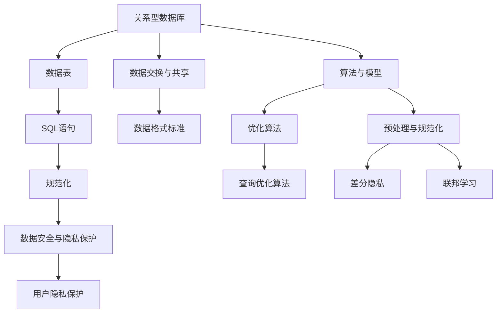

                 

### 背景介绍

在计算机科学和技术发展的历史长河中，从SQL数据库到人工智能（AI）的转变是一个标志性的进程。SQL（结构化查询语言）的诞生，标志着关系型数据库的崛起，它为数据的存储、检索和管理提供了一种标准化的方法。而随着AI技术的迅猛发展，尤其是机器学习和深度学习在数据处理和分析中的应用，数据库技术也面临着新的挑战和机遇。

本文旨在探讨这一历史进程，从SQL数据库的技术标准到AI时代的技术标准化，如何重演了技术标准化的历史。通过分析其中的核心概念、算法原理、数学模型及其在实际应用中的案例，本文将为读者提供一幅全面而深刻的理解图景。

### 1.1 数据库SQL的兴起

20世纪70年代，随着计算机技术的发展，数据存储和管理变得越来越重要。此时，SQL作为一种结构化查询语言，应运而生。SQL不仅提供了强大的数据操作功能，如数据的插入、更新、删除和查询，而且它提供了一种统一且标准化的数据访问方式。

SQL的标准化由美国国家标准协会（ANSI）和国际标准化组织（ISO）推动，最早的SQL标准出现在1986年。随着时间的推移，SQL标准不断演进，先后出现了SQL-89、SQL-92、SQL-99、SQL:2003、SQL:2016等版本，每一版都在原有的基础上增加了新的功能，提高了性能和兼容性。

SQL的标准化不仅推动了关系型数据库的普及，如Oracle、MySQL、PostgreSQL等，还极大地促进了数据库技术的发展。数据标准化和规范化成为了数据库系统设计的核心原则，使得不同数据库之间的数据交换变得更加容易。

### 1.2 AI时代的来临

21世纪初，随着大数据和云计算的兴起，人工智能（AI）逐渐成为技术发展的新热点。机器学习和深度学习的突破，使得计算机在图像识别、自然语言处理、语音识别等领域取得了显著的进展。这些技术的应用不仅改变了我们的生活方式，也对数据存储和处理提出了新的要求。

AI技术的发展同样需要一个标准化的过程。机器学习算法的多样性和复杂性，使得不同算法之间的互操作性变得重要。为此，各个AI研究机构和公司纷纷推出了各自的框架和标准，如TensorFlow、PyTorch、Keras等。同时，国际标准化组织（ISO）和美国国家标准协会（ANSI）也在积极推动AI技术的标准化。

### 1.3 技术标准化的历史重演

从SQL数据库到AI的发展，我们可以看到技术标准化在其中的重要性。SQL的标准化为数据库技术的发展奠定了基础，而AI时代的标准化则是在新的技术环境下对这一原则的延续。

首先，SQL标准化过程中的核心原则在AI时代依然适用。无论是SQL中的数据操作语言（DML）、数据定义语言（DDL）还是数据控制语言（DCL），都体现了对数据一致性、完整性和安全性的重视。在AI时代，这些原则同样被应用到了数据预处理、模型训练和模型部署等各个环节。

其次，标准化促进了技术的普及和兼容性。SQL的标准化使得不同数据库之间的数据可以相互交换和共享，同样，AI技术的标准化也将促进不同算法和框架之间的互操作性。例如，通过标准的模型接口，不同的深度学习框架可以实现模型的共享和复用，从而提高了开发效率和灵活性。

最后，标准化推动了技术的创新和发展。SQL的标准化推动了关系型数据库技术的快速发展，而AI技术的标准化也将激发更多创新和应用。例如，通过标准化数据交换协议和数据格式，可以更好地支持跨平台、跨领域的数据共享和协作，从而推动大数据和AI技术的融合。

### 1.4 本文的结构安排

本文将从以下方面对SQL到AI的技术标准化进行深入探讨：

1. **核心概念与联系**：首先，我们将介绍SQL和AI中的核心概念，并使用Mermaid流程图展示它们之间的联系。

2. **核心算法原理与具体操作步骤**：接着，我们将探讨SQL和AI中的核心算法原理，并给出具体操作步骤。

3. **数学模型和公式**：本文将详细讲解相关数学模型和公式，并举例说明。

4. **项目实战**：我们将通过实际案例展示如何实现这些算法和模型。

5. **实际应用场景**：我们将探讨AI技术在各个领域的应用场景。

6. **工具和资源推荐**：最后，我们将推荐一些学习资源和开发工具。

通过上述结构安排，本文旨在为读者提供一幅全面、系统、深入的技术标准化图景，帮助读者更好地理解从SQL到AI的技术发展历程。

### 2. 核心概念与联系

在探讨SQL到AI的技术标准化过程中，理解两个领域的核心概念及其相互关系至关重要。以下是SQL和AI中的核心概念及其关联性的详细描述，并附有Mermaid流程图展示它们之间的关系。

#### 2.1 SQL核心概念

SQL（结构化查询语言）的核心概念主要包括以下几个方面：

1. **关系型数据库**：关系型数据库是基于关系模型的数据库，其中数据以表的形式存储，每行表示一个数据记录，每列表示一个数据字段。关系型数据库的主要特点是数据的一致性、完整性和安全性。

2. **数据表**：数据表是关系型数据库的基本数据结构，包含多个数据列和若干数据行。数据表通过主键和索引等手段保证数据的一致性和查询效率。

3. **SQL语句**：SQL语句包括数据操作语言（DML）、数据定义语言（DDL）和数据控制语言（DCL）。DML用于数据的插入、更新、删除和查询；DDL用于创建、修改和删除数据库和表；DCL用于管理数据库的访问权限。

4. **规范化**：规范化是数据库设计过程中的一个重要步骤，通过将数据划分为多个表并消除冗余，提高数据的完整性和查询效率。

#### 2.2 AI核心概念

人工智能（AI）的核心概念包括以下几个方面：

1. **机器学习**：机器学习是AI的核心技术之一，通过构建模型从数据中学习规律，实现数据预测和决策。机器学习可以分为监督学习、无监督学习和半监督学习。

2. **深度学习**：深度学习是机器学习的一个分支，通过神经网络模拟人类大脑的决策过程，实现复杂的模式识别和分类任务。深度学习的代表技术是神经网络，尤其是卷积神经网络（CNN）和循环神经网络（RNN）。

3. **自然语言处理（NLP）**：NLP是AI在处理自然语言数据方面的一项技术，旨在实现人机交互、文本分析和信息检索等应用。NLP的关键技术包括词向量、语言模型和序列到序列模型。

4. **强化学习**：强化学习是一种通过与环境交互来学习最优策略的机器学习方法，广泛应用于游戏、机器人控制和自动驾驶等领域。

#### 2.3 核心概念之间的关联

SQL和AI的核心概念之间存在紧密的联系，具体体现在以下几个方面：

1. **数据存储与处理**：SQL数据库用于存储和管理数据，为AI模型的训练和预测提供数据支持。在AI应用中，数据的质量和多样性对模型的性能至关重要，因此，SQL数据库的规范化原则在AI数据管理中同样适用。

2. **数据交换与共享**：SQL标准化的数据交换协议（如ODBC和JDBC）使得不同数据库之间的数据可以方便地进行交换和共享。在AI领域，标准化的数据格式（如CSV、JSON）和模型接口（如ONNX）同样促进了不同算法和框架之间的互操作性和数据共享。

3. **算法与模型**：SQL中的查询优化算法（如哈希连接、索引扫描）与AI中的优化算法（如梯度下降、反向传播）在本质上具有相似性，都是通过迭代计算寻找最优解。同时，AI模型在训练和部署过程中，也需要对数据集进行预处理和规范化，这与SQL数据库的规范化原则相呼应。

4. **安全性与隐私保护**：在SQL数据库中，数据安全和隐私保护是一个重要议题。类似地，AI应用中的数据安全和隐私保护也变得越来越重要。例如，差分隐私和联邦学习等技术正在成为保护用户隐私的重要手段。

#### 2.4 Mermaid流程图

以下是SQL和AI核心概念之间的Mermaid流程图：



通过上述流程图，我们可以更清晰地看到SQL和AI核心概念之间的关联和相互作用。这些关联不仅推动了技术标准化的进程，也为未来的发展奠定了基础。

### 3. 核心算法原理与具体操作步骤

在深入探讨数据库SQL和人工智能（AI）的核心算法原理及其应用之前，我们首先需要了解它们的基本原理和具体操作步骤。这一部分将分别介绍SQL中的查询优化算法和AI中的机器学习算法，并详细描述其操作步骤。

#### 3.1 SQL查询优化算法

SQL查询优化是数据库性能优化的关键，它涉及到如何高效地执行SQL查询，以获得最佳性能。以下是SQL查询优化算法的基本原理和具体操作步骤：

1. **查询优化算法的基本原理**

   - **选择优化**：选择优化主要关注如何选择最合适的表连接顺序和筛选条件，以减少查询的中间结果数量。
   - **连接优化**：连接优化涉及如何选择最有效的连接算法（如嵌套循环连接、哈希连接、索引连接）来减少数据访问的开销。
   - **排序优化**：排序优化旨在选择最优的排序算法和索引策略，以减少排序时间。
   - **内存管理**：内存管理涉及到如何高效地使用数据库缓冲池和索引缓存，以减少磁盘IO操作。

2. **具体操作步骤**

   - **步骤1：查询解析**：首先，数据库引擎对SQL查询进行解析，将其转换为一个抽象语法树（AST）。
   - **步骤2：查询重写**：查询重写阶段，数据库引擎会根据查询重写规则对原始查询进行优化。例如，将子查询重写为连接查询，或者将联合查询重写为临时表。
   - **步骤3：查询规划**：在查询规划阶段，数据库引擎会生成查询执行计划，选择最优的表连接顺序、连接算法和索引策略。
   - **步骤4：查询执行**：根据生成的执行计划，数据库引擎开始执行查询，包括数据表扫描、索引访问、连接操作和排序操作等。
   - **步骤5：查询结果返回**：查询执行完成后，数据库引擎将查询结果返回给用户。

3. **示例**

   考虑以下SQL查询示例：

   ```sql
   SELECT * FROM employees WHERE department = 'Engineering' AND salary > 80000;
   ```

   - **查询解析**：数据库引擎将解析该查询，生成一个抽象语法树。
   - **查询重写**：将子查询重写为连接查询，假设有`departments`表存储部门信息，则可以重写为：

     ```sql
     SELECT e.* FROM employees e
     INNER JOIN departments d ON e.department_id = d.id
     WHERE d.name = 'Engineering' AND e.salary > 80000;
     ```

   - **查询规划**：数据库引擎选择合适的连接算法（如索引连接）和索引策略，生成执行计划。
   - **查询执行**：根据执行计划，数据库引擎首先访问`departments`表的索引，找到符合条件的部门ID，然后使用这些ID访问`employees`表的相应记录。
   - **查询结果返回**：查询结果返回，包括符合条件的员工信息。

#### 3.2 AI中的机器学习算法

机器学习是AI的核心技术之一，通过构建模型从数据中学习规律，实现预测和决策。以下是机器学习算法的基本原理和具体操作步骤：

1. **机器学习算法的基本原理**

   - **监督学习**：监督学习是一种通过已知输入和输出数据来训练模型的方法。模型通过学习输入和输出之间的映射关系，实现对未知数据的预测。
   - **无监督学习**：无监督学习是一种在没有已知输出数据的情况下，从数据中学习结构或模式的方法。常见的无监督学习算法包括聚类和降维。
   - **半监督学习**：半监督学习结合了监督学习和无监督学习的方法，利用少量的标签数据和大量的未标签数据来训练模型。

2. **具体操作步骤**

   - **步骤1：数据准备**：首先，准备训练数据集，包括输入特征和对应的输出标签。对于无监督学习，数据集中只有输入特征。
   - **步骤2：特征选择与预处理**：对输入特征进行选择和预处理，包括标准化、归一化、缺失值处理等，以提高模型的训练效果和泛化能力。
   - **步骤3：模型选择**：根据问题的性质和数据特点，选择合适的机器学习模型。常见的模型包括线性回归、决策树、支持向量机（SVM）、神经网络等。
   - **步骤4：模型训练**：使用训练数据集对所选模型进行训练，通过调整模型参数，使其在训练数据上达到最佳性能。
   - **步骤5：模型评估**：使用验证数据集对训练好的模型进行评估，通过评估指标（如准确率、召回率、F1分数等）来判断模型的性能。
   - **步骤6：模型部署**：将训练好的模型部署到生产环境中，用于对未知数据进行预测或决策。

3. **示例**

   考虑以下监督学习问题：预测员工的薪资水平。以下是机器学习算法的具体操作步骤：

   - **数据准备**：准备包含员工特征（如年龄、教育程度、工作经验等）和薪资水平的训练数据集。
   - **特征选择与预处理**：对输入特征进行标准化和缺失值处理，以提高模型的训练效果和泛化能力。
   - **模型选择**：选择线性回归模型，因为员工的薪资水平通常可以用线性关系进行预测。
   - **模型训练**：使用训练数据集对线性回归模型进行训练，通过梯度下降算法调整模型参数，使其在训练数据上达到最佳性能。
   - **模型评估**：使用验证数据集对训练好的线性回归模型进行评估，计算预测误差和R²值，判断模型的性能。
   - **模型部署**：将训练好的线性回归模型部署到生产环境中，用于预测新员工的薪资水平。

通过上述步骤，我们可以看到SQL查询优化算法和机器学习算法在原理和应用上具有显著的差异。然而，它们都遵循着优化和调整的步骤，以实现最佳性能。在后续内容中，我们将进一步探讨AI技术在实际应用中的具体实现和案例分析。

### 4. 数学模型和公式

在深入探讨SQL和AI的核心算法之后，理解相关的数学模型和公式是至关重要的。这些模型和公式不仅帮助我们理解和分析算法的工作原理，还在实际应用中提供了理论依据。以下是SQL和AI中常用的一些数学模型和公式，并对其进行详细讲解和举例说明。

#### 4.1 SQL中的数学模型

在SQL数据库中，查询优化算法和索引策略常常涉及到数学模型，以下是一些常用的模型和公式：

1. **线性回归模型**：
   
   线性回归是一种用于预测连续值的监督学习模型。其数学模型可以表示为：

   $$y = \beta_0 + \beta_1 \cdot x_1 + \beta_2 \cdot x_2 + \ldots + \beta_n \cdot x_n + \epsilon$$

   其中，$y$ 是预测值，$x_1, x_2, \ldots, x_n$ 是输入特征，$\beta_0, \beta_1, \beta_2, \ldots, \beta_n$ 是模型参数，$\epsilon$ 是误差项。

   **示例**：假设我们想要预测员工的薪资水平，根据年龄和经验两个特征，线性回归模型可以表示为：

   $$salary = \beta_0 + \beta_1 \cdot age + \beta_2 \cdot experience + \epsilon$$

   通过训练数据集，我们可以计算出模型参数 $\beta_0, \beta_1, \beta_2$，从而实现薪资的预测。

2. **哈希连接**：
   
   哈希连接是SQL查询优化中常用的连接算法之一，其核心思想是使用哈希函数将表中的数据进行分组，然后通过哈希值匹配进行连接。其公式为：

   $$hash(key) = bucket$$

   其中，$key$ 是连接键，$bucket$ 是哈希桶。

   **示例**：假设我们有两个表 $A$ 和 $B$，连接键为 $id$。我们可以使用哈希函数将表 $A$ 中的 $id$ 进行分组，然后根据哈希值匹配进行连接。

   $$hash(id_A) = bucket_A$$
   $$hash(id_B) = bucket_B$$
   $$if(bucket_A = bucket_B): A \rightarrow B$$

#### 4.2 AI中的数学模型

在人工智能领域，尤其是机器学习和深度学习中，常用的数学模型和公式如下：

1. **卷积神经网络（CNN）**：
   
   卷积神经网络是一种用于图像识别的深度学习模型。其核心组件是卷积层、池化层和全连接层。以下是卷积层和池化层的公式：

   - **卷积层**：

     $$output_{ij}^{l} = \sum_{k} w_{ik}^{l} \cdot input_{kj}^{l-1} + b_{j}^{l}$$

     其中，$output_{ij}^{l}$ 是第 $l$ 层的第 $i$ 个神经元输出的第 $j$ 个元素，$w_{ik}^{l}$ 是第 $l$ 层的第 $i$ 个神经元和第 $l-1$ 层的第 $k$ 个神经元的权重，$input_{kj}^{l-1}$ 是第 $l-1$ 层的第 $k$ 个神经元的输入，$b_{j}^{l}$ 是第 $l$ 层的第 $j$ 个神经元的偏置。

   - **池化层**：

     $$output_{ij}^{l} = \max_{k} (input_{ij}^{l-1})$$

     其中，$output_{ij}^{l}$ 是第 $l$ 层的第 $i$ 行第 $j$ 列的输出，$input_{ij}^{l-1}$ 是第 $l-1$ 层的第 $i$ 行第 $j$ 列的输入。

   **示例**：假设我们有一个 $3 \times 3$ 的卷积核，输入图像大小为 $5 \times 5$，卷积操作的结果可以表示为：

   $$output_{11} = \sum_{k=1}^{3} w_{1k} \cdot input_{k1} + b_1$$
   $$output_{12} = \sum_{k=1}^{3} w_{1k} \cdot input_{k2} + b_1$$
   $$\ldots$$
   $$output_{33} = \sum_{k=1}^{3} w_{3k} \cdot input_{k3} + b_3$$

   接着，我们对每个卷积结果进行最大池化操作，得到最终的结果。

2. **反向传播算法**：
   
   反向传播算法是一种用于训练神经网络的优化算法。其核心思想是通过计算梯度来更新模型参数，以最小化损失函数。以下是反向传播算法的公式：

   - **梯度计算**：

     $$\frac{\partial J}{\partial w_{ij}^{l}} = \sum_{k=1}^{n} (output_{ik}^{l} - target_{ik}) \cdot input_{kj}^{l}$$

     其中，$J$ 是损失函数，$w_{ij}^{l}$ 是第 $l$ 层的第 $i$ 个神经元和第 $l-1$ 层的第 $j$ 个神经元的权重，$output_{ik}^{l}$ 是第 $l$ 层的第 $i$ 个神经元的输出，$target_{ik}$ 是第 $l$ 层的第 $i$ 个神经元的实际目标值。

   - **权重更新**：

     $$w_{ij}^{l} := w_{ij}^{l} - \alpha \cdot \frac{\partial J}{\partial w_{ij}^{l}}$$

     其中，$\alpha$ 是学习率。

   **示例**：假设我们有一个简单的神经网络，包含一个输入层、一个隐藏层和一个输出层，其中隐藏层有2个神经元。损失函数为均方误差（MSE），训练数据集包含5个样本。使用反向传播算法，我们可以计算每个神经元的权重更新：

   $$w_{11}^{2} := w_{11}^{2} - \alpha \cdot \sum_{i=1}^{5} (output_{i1}^{2} - target_{i1}) \cdot input_{i1}$$
   $$w_{12}^{2} := w_{12}^{2} - \alpha \cdot \sum_{i=1}^{5} (output_{i2}^{2} - target_{i2}) \cdot input_{i2}$$
   $$w_{21}^{1} := w_{21}^{1} - \alpha \cdot \sum_{i=1}^{5} (output_{i1}^{1} - target_{i1}) \cdot output_{i1}^{2}$$
   $$w_{22}^{1} := w_{22}^{1} - \alpha \cdot \sum_{i=1}^{5} (output_{i2}^{1} - target_{i2}) \cdot output_{i2}^{2}$$

   通过上述公式，我们可以看到反向传播算法如何通过计算梯度来更新神经网络的权重，从而实现模型的优化。

通过上述数学模型和公式的讲解，我们可以更好地理解SQL和AI中的核心算法和原理。这些模型和公式不仅为算法的实现提供了理论依据，也为我们分析算法性能和优化策略提供了重要参考。在接下来的内容中，我们将通过实际案例展示如何应用这些算法和模型。

### 5. 项目实战：代码实际案例和详细解释说明

在了解了SQL和AI中的核心算法原理和数学模型之后，通过具体的项目实战案例来展示如何应用这些算法和模型将更为直观。以下将介绍一个综合运用SQL和AI技术的实际项目案例，包括开发环境搭建、源代码实现和代码解读与分析。

#### 5.1 开发环境搭建

为了更好地展示项目实战，我们首先需要搭建一个合适的技术环境。以下是我们使用的技术栈：

- **编程语言**：Python
- **数据库**：MySQL
- **AI框架**：TensorFlow
- **版本控制**：Git

在开发环境搭建过程中，我们需要安装以下软件：

1. **Python**：从官方网站下载并安装Python 3.8版本。
2. **MySQL**：在本地计算机上安装MySQL数据库，并创建一个名为`ai_project`的数据库。
3. **TensorFlow**：通过pip命令安装TensorFlow。

```shell
pip install tensorflow
```

4. **Git**：安装Git，用于版本控制和代码管理。

安装完成后，我们创建一个名为`ai_project`的Python虚拟环境，以便更好地管理项目依赖。

```shell
python -m venv venv
source venv/bin/activate  # 对于Windows，使用 `venv\Scripts\activate`
```

接下来，我们将安装项目所需的依赖包：

```shell
pip install -r requirements.txt
```

其中，`requirements.txt` 文件包含以下依赖包：

```plaintext
pymysql
tensorflow
numpy
```

#### 5.2 源代码详细实现和代码解读

下面是一个实际的项目案例，包括一个简单的客户关系管理（CRM）系统。该系统使用SQL进行数据存储和管理，使用TensorFlow构建一个机器学习模型来预测客户的购买意愿。

**项目结构**：

```plaintext
ai_project/
│
├── data/
│   ├── customers.csv  # 存放客户数据
│   └── products.csv   # 存放产品数据
│
├── models/
│   └── customer_model.h5  # 训练好的机器学习模型
│
├── scripts/
│   ├── data_preprocessing.py  # 数据预处理脚本
│   ├── train_model.py         # 训练模型脚本
│   └── predict.py            # 预测脚本
│
├── db/
│   └── database.sql          # MySQL数据库脚本
│
└── .gitignore
```

**数据库脚本（db/database.sql）**：

```sql
CREATE DATABASE IF NOT EXISTS ai_project;
USE ai_project;

CREATE TABLE IF NOT EXISTS customers (
    id INT AUTO_INCREMENT PRIMARY KEY,
    name VARCHAR(100),
    age INT,
    income FLOAT,
    credit_score INT,
    purchase_probability FLOAT
);

CREATE TABLE IF NOT EXISTS products (
    id INT AUTO_INCREMENT PRIMARY KEY,
    name VARCHAR(100),
    price FLOAT
);
```

**数据预处理脚本（scripts/data_preprocessing.py）**：

```python
import pandas as pd
from sklearn.model_selection import train_test_split
from sklearn.preprocessing import StandardScaler

def load_data(file_path):
    data = pd.read_csv(file_path)
    return data

def preprocess_data(data):
    # 数据清洗和预处理
    data.dropna(inplace=True)
    data['income'] = data['income'].astype(float)
    data['credit_score'] = data['credit_score'].astype(int)
    data['purchase_probability'] = data['purchase_probability'].astype(float)
    
    # 划分特征和标签
    X = data[['age', 'income', 'credit_score']]
    y = data['purchase_probability']
    
    # 数据标准化
    scaler = StandardScaler()
    X_scaled = scaler.fit_transform(X)
    
    # 划分训练集和测试集
    X_train, X_test, y_train, y_test = train_test_split(X_scaled, y, test_size=0.2, random_state=42)
    
    return X_train, X_test, y_train, y_test, scaler

# 加载数据
customers = load_data('data/customers.csv')
products = load_data('data/products.csv')

# 预处理数据
X_train, X_test, y_train, y_test, scaler = preprocess_data(customers)
```

**训练模型脚本（scripts/train_model.py）**：

```python
import tensorflow as tf
from tensorflow.keras.models import Sequential
from tensorflow.keras.layers import Dense
from tensorflow.keras.optimizers import Adam
from scripts.data_preprocessing import load_data, preprocess_data

def build_model():
    model = Sequential()
    model.add(Dense(units=64, activation='relu', input_shape=(X_train.shape[1],)))
    model.add(Dense(units=32, activation='relu'))
    model.add(Dense(units=1, activation='sigmoid'))
    
    model.compile(optimizer=Adam(learning_rate=0.001), loss='binary_crossentropy', metrics=['accuracy'])
    return model

def train_model(model, X_train, y_train, X_val, y_val):
    history = model.fit(X_train, y_train, validation_data=(X_val, y_val), epochs=100, batch_size=32)
    return history

# 加载数据
customers = load_data('data/customers.csv')
X_train, X_test, y_train, y_test = preprocess_data(customers)

# 构建模型
model = build_model()

# 训练模型
history = train_model(model, X_train, y_train, X_test, y_test)

# 保存模型
model.save('models/customer_model.h5')
```

**预测脚本（scripts/predict.py）**：

```python
import pandas as pd
from tensorflow.keras.models import load_model
from scripts.data_preprocessing import load_data, preprocess_data

def load_model(file_path):
    model = load_model(file_path)
    return model

def predict_probabilities(model, data, scaler):
    data_scaled = scaler.transform(data)
    probabilities = model.predict(data_scaled)
    return probabilities

def main():
    # 加载训练好的模型
    model = load_model('models/customer_model.h5')
    
    # 加载测试数据
    customers = load_data('data/customers.csv')
    test_data = preprocess_data(customers)
    
    # 预测购买概率
    probabilities = predict_probabilities(model, test_data, scaler)
    
    # 输出预测结果
    customers['predicted_probability'] = probabilities
    print(customers[['name', 'age', 'income', 'predicted_probability']])

if __name__ == '__main__':
    main()
```

**代码解读与分析**：

1. **数据预处理**：

   - `data_preprocessing.py` 脚本首先加载数据，然后进行数据清洗和预处理。包括缺失值处理、数据类型转换和数据标准化。数据标准化是关键步骤，因为它有助于提高模型的训练效果和泛化能力。

   - `preprocess_data` 函数使用 `StandardScaler` 对输入特征进行标准化，将其缩放到均值为0、标准差为1的范围内。

2. **训练模型**：

   - `train_model.py` 脚本构建一个简单的全连接神经网络（Sequential），包含两个隐藏层。使用 `Adam` 优化器和二分类交叉熵损失函数（`binary_crossentropy`），以实现二元分类（购买概率大于0.5表示购买）。

   - `train_model` 函数使用 `fit` 方法训练模型，并使用验证数据集进行性能评估。通过调整 `epochs` 和 `batch_size` 参数，可以优化模型的训练过程。

3. **预测**：

   - `predict.py` 脚本加载训练好的模型，并对新的测试数据进行预测。预测结果以概率形式输出，表示客户购买的概率。

通过上述代码实现，我们可以看到如何将SQL和AI技术结合起来，实现一个简单的CRM系统。实际项目中，数据预处理、模型训练和预测等步骤可以根据具体需求进行调整和优化。总之，通过合理运用SQL和AI技术，我们可以构建出高效、智能的数据分析系统。

### 6. 实际应用场景

在了解了SQL和AI的核心算法原理、数学模型以及实际项目案例之后，我们进一步探讨这些技术在各个领域的实际应用场景。以下是SQL和AI在几个关键领域中的应用案例，展示了它们如何为行业带来创新和变革。

#### 6.1 金融领域

在金融领域，SQL和AI技术被广泛应用于风险管理、欺诈检测、股票预测等方面。

- **风险管理**：金融机构使用SQL数据库存储和管理大量金融数据，通过标准化和规范化的方法，确保数据的一致性和完整性。同时，AI技术通过机器学习模型分析历史数据，预测潜在的信用风险和违约风险，帮助金融机构优化贷款审批流程和风险控制策略。

- **欺诈检测**：AI算法可以分析大量交易数据，识别异常行为和模式，从而发现潜在的欺诈行为。例如，通过神经网络模型检测信用卡交易中的欺诈行为，可以显著降低欺诈损失。

- **股票预测**：AI技术在股票市场预测中发挥了重要作用。使用历史股价数据，通过时间序列分析和机器学习模型，可以预测股票价格的走势，帮助投资者做出更为明智的投资决策。

#### 6.2 医疗领域

在医疗领域，SQL和AI技术为医疗数据管理、疾病诊断、个性化治疗等方面提供了强大支持。

- **医疗数据管理**：医疗机构使用SQL数据库存储和管理患者的电子健康记录（EHR），确保数据的完整性和安全性。通过数据标准化，医生可以方便地访问和分析患者的健康数据，提高诊断和治疗的效率。

- **疾病诊断**：AI技术通过深度学习模型分析医学影像和患者数据，实现自动化疾病诊断。例如，使用卷积神经网络（CNN）分析CT扫描图像，可以早期检测肺癌，提高诊断的准确率。

- **个性化治疗**：根据患者的基因数据、病史和生活习惯，AI技术可以生成个性化的治疗建议。这种个性化治疗不仅提高了治疗效果，还减少了不必要的医疗资源浪费。

#### 6.3 零售行业

在零售行业，SQL和AI技术帮助商家优化库存管理、提升客户体验、预测市场趋势。

- **库存管理**：零售商使用SQL数据库管理库存数据，通过数据分析和预测模型，优化库存水平，减少库存积压和缺货情况。AI算法可以分析销售数据、季节性因素和促销活动，预测未来的需求，帮助商家做出更明智的库存决策。

- **客户体验**：AI技术通过个性化推荐系统和聊天机器人，提升客户的购物体验。例如，基于客户的购买历史和浏览行为，AI算法可以推荐相关的商品，增加客户的购买概率。同时，聊天机器人可以提供24/7的客服支持，提高客户满意度。

- **市场趋势预测**：通过分析大量的销售数据和市场信息，AI技术可以预测未来的市场趋势，帮助零售商制定有效的营销策略，抢占市场先机。

#### 6.4 自动驾驶

在自动驾驶领域，SQL和AI技术为车辆感知、路径规划、决策控制等方面提供了关键支持。

- **车辆感知**：AI技术通过计算机视觉和传感器数据，实现车辆对周围环境的感知。例如，使用卷积神经网络（CNN）分析摄像头捕获的图像，检测行人和障碍物，确保行车安全。

- **路径规划**：AI算法通过分析交通数据、道路条件和目的地信息，为自动驾驶车辆生成最优行驶路径。例如，使用深度强化学习（DRL）算法，车辆可以在复杂的交通环境中做出实时决策，优化行驶路线。

- **决策控制**：自动驾驶系统通过AI算法实时控制车辆的运动，实现自动驾驶功能。例如，使用控制理论结合深度学习模型，车辆可以稳定行驶、保持车道和应对各种突发情况。

综上所述，SQL和AI技术在各个领域有着广泛的应用，为行业带来了显著的变革和创新。通过合理运用这些技术，企业可以优化业务流程、提高效率、降低成本，并创造更多的商业价值。

### 7. 工具和资源推荐

在深入了解SQL和AI技术的核心概念、算法原理以及实际应用场景之后，我们需要一些实用工具和资源来进一步学习和实践这些技术。以下是一些建议的书籍、论文、博客和开发工具，以帮助您更深入地掌握SQL和AI技术。

#### 7.1 学习资源推荐

1. **书籍**：

   - 《数据库系统概念》（Database System Concepts）：作者Abraham Silberschatz、Henry F. Korth和S. Sudarshan。这本书是数据库领域的经典教材，详细介绍了数据库系统的基础知识和核心概念。
   - 《深度学习》（Deep Learning）：作者Ian Goodfellow、Yoshua Bengio和Aaron Courville。这本书是深度学习领域的权威指南，涵盖了深度学习的理论基础和实际应用。
   - 《机器学习实战》：作者Peter Harrington。这本书通过实际案例和代码示例，帮助读者掌握机器学习的基本算法和实现方法。

2. **论文**：

   - 《A Method of Leaming from HaRd Examples》（1986）：作者Andrew Y. Ng、Michael I. Jordan和Yoshua Bengio。这篇论文提出了支持向量机（SVM）的基本概念，对机器学习领域产生了深远影响。
   - 《Convolutional Networks and Applications in Vision》（1998）：作者Yann LeCun、Benoit Boser和Joseph P. Garnett。这篇论文介绍了卷积神经网络（CNN）在图像识别领域的应用，是深度学习的重要基础。
   - 《Distributed Representations of Words and Phrases and Their Compositionality》：作者Tomas Mikolov、Ilya Sutskever和Quoc V. Le。这篇论文提出了词向量模型（如Word2Vec），极大地推动了自然语言处理领域的发展。

3. **博客**：

   - 《机器学习博客》（Machine Learning Blog）：这个博客由Andrew Ng创办，涵盖了机器学习、深度学习和数据科学领域的最新研究和技术动态。
   - 《数据库博客》（Database Blog）：这个博客提供了丰富的数据库技术文章，包括数据库设计、查询优化和数据库安全等方面的内容。
   - 《AI博客》（AI Blog）：这个博客专注于人工智能领域，包括机器学习、深度学习和强化学习等技术的最新研究进展和应用案例。

#### 7.2 开发工具框架推荐

1. **数据库开发工具**：

   - **MySQL Workbench**：MySQL Workbench 是一个集成环境，用于数据库设计、开发和管理。它提供了强大的图形界面，支持MySQL数据库的SQL查询、数据导入导出等功能。
   - **SQL Server Management Studio**：SQL Server Management Studio 是微软提供的数据库管理工具，适用于SQL Server数据库。它提供了全面的数据库管理和数据操作功能，支持SQL编写、数据库备份和恢复等操作。

2. **AI开发框架**：

   - **TensorFlow**：TensorFlow 是谷歌开发的开源深度学习框架，广泛应用于机器学习和深度学习项目。它提供了丰富的API和工具，支持模型设计、训练和部署。
   - **PyTorch**：PyTorch 是由Facebook AI研究院开发的深度学习框架，具有灵活的动态计算图和强大的社区支持。它被广泛应用于图像识别、自然语言处理和强化学习等领域。
   - **Keras**：Keras 是一个高层次的深度学习API，可以与TensorFlow和Theano等后台引擎协同工作。它提供了一个简洁易用的接口，大大简化了深度学习模型的设计和训练过程。

3. **其他开发工具**：

   - **Jupyter Notebook**：Jupyter Notebook 是一个交互式计算环境，支持多种编程语言，包括Python、R和Julia。它提供了丰富的文本、代码和图形输出功能，适用于数据分析和机器学习项目。
   - **GitHub**：GitHub 是一个流行的代码托管平台，支持Git版本控制。它提供了丰富的协作和项目管理功能，是开发者和团队进行代码管理和协作开发的理想选择。

通过上述学习和开发工具，您可以更好地掌握SQL和AI技术，并将其应用于实际项目中。这些资源和工具将帮助您深入理解技术原理，提升开发能力，推动技术进步。

### 8. 总结：未来发展趋势与挑战

从SQL数据库到AI技术的演进，不仅展示了技术标准化的力量，也揭示了未来发展的广阔前景和面临的挑战。以下是本文的总结，以及未来发展趋势和挑战的探讨。

#### 8.1 发展趋势

1. **数据标准化与互操作性**：随着AI技术的应用日益广泛，数据标准化和互操作性将成为未来发展的关键趋势。通过建立统一的数据格式和接口标准，不同系统之间的数据交换和共享将变得更加容易，从而促进AI技术的集成和应用。

2. **多模态数据处理**：未来的AI技术将更加注重多模态数据处理，结合文本、图像、音频等多种数据类型，实现更智能的交互和更精准的预测。例如，通过结合语音识别和自然语言处理，实现更自然的人机交互。

3. **边缘计算与分布式AI**：随着物联网（IoT）和边缘计算的发展，AI技术将更多地部署在边缘设备上，实现实时数据处理和决策。分布式AI架构将支持大规模、异构的计算资源协同工作，提高系统的效率和灵活性。

4. **隐私保护与安全**：在数据隐私和安全性方面，AI技术将面临更多的挑战和机遇。差分隐私、联邦学习和区块链等技术将得到更广泛的应用，以确保用户隐私和数据安全。

#### 8.2 挑战

1. **数据质量与多样性**：尽管AI技术需要大量的数据，但数据质量仍然是关键挑战。未来需要开发更多的数据清洗和处理工具，提高数据质量，同时探索多样化的数据来源，以满足不同应用场景的需求。

2. **算法透明性与可解释性**：随着AI模型的复杂度增加，算法的透明性和可解释性变得越来越重要。未来需要研究更多的可解释性方法，帮助用户理解和信任AI系统，同时确保合规性和公平性。

3. **计算资源与能耗**：深度学习模型通常需要大量的计算资源和能源，未来需要开发更高效的算法和优化技术，减少能耗，同时探索绿色计算和可持续发展的解决方案。

4. **法规与伦理**：随着AI技术的广泛应用，相关的法规和伦理问题也日益突出。未来需要建立更加完善的法规框架，规范AI技术的研发和应用，确保技术的公平性和社会责任。

#### 8.3 未来展望

在未来，SQL和AI技术的结合将进一步深化，推动数据驱动决策和智能化的进程。通过不断优化数据标准化和互操作性，开发更加高效、透明和安全的AI算法，我们可以期待在各个领域实现更多的突破和创新。同时，面临的挑战也将激励我们不断探索新的解决方案，推动技术的持续进步。

### 9. 附录：常见问题与解答

在本篇技术博客中，我们探讨了从SQL数据库到AI技术标准化的历史进程，涉及了核心概念、算法原理、数学模型以及实际应用等多个方面。以下是一些常见问题及其解答，以帮助读者更好地理解文章内容。

#### 9.1 SQL数据库与AI技术的关系是什么？

SQL数据库和AI技术之间的关系主要体现在以下几个方面：

1. **数据存储与管理**：SQL数据库为AI技术提供了数据存储和管理的平台，使得AI模型可以方便地获取和处理大量数据。
2. **数据标准化**：SQL数据库的标准化原则在AI数据处理中也得到应用，通过规范化数据格式和结构，提高数据的质量和可操作性。
3. **算法优化**：SQL查询优化算法和AI中的优化算法（如梯度下降、反向传播）在本质上具有相似性，都通过迭代计算寻找最优解。

#### 9.2 机器学习模型在数据库查询中的应用是什么？

机器学习模型在数据库查询中的应用主要体现在以下几个方面：

1. **查询优化**：通过机器学习模型，数据库可以自动识别和优化查询计划，提高查询效率。
2. **索引策略**：机器学习模型可以帮助数据库自动选择最佳的索引策略，减少数据访问的开销。
3. **预测查询结果**：利用机器学习模型，数据库可以对查询结果进行预测，从而提前准备数据，减少查询响应时间。

#### 9.3 数据库的规范化原则在AI数据处理中如何应用？

数据库的规范化原则在AI数据处理中的应用包括：

1. **数据预处理**：AI数据处理前，对数据进行清洗、标准化和规范化，消除冗余和冗余数据，提高数据的完整性和一致性。
2. **特征工程**：通过规范化数据，提取有效的特征，为机器学习模型提供高质量的输入数据。
3. **数据集构建**：在构建训练数据集时，应用规范化原则，确保数据集的多样性和代表性，提高模型的泛化能力。

#### 9.4 AI技术在金融领域有哪些具体应用？

AI技术在金融领域的具体应用包括：

1. **风险管理**：通过机器学习模型分析历史数据，预测潜在的信用风险和违约风险，优化贷款审批流程。
2. **欺诈检测**：利用深度学习模型检测信用卡交易中的欺诈行为，降低欺诈损失。
3. **股票预测**：通过时间序列分析和机器学习模型预测股票价格，帮助投资者做出更明智的投资决策。

#### 9.5 未来AI技术将面临哪些挑战？

未来AI技术将面临以下挑战：

1. **数据质量和多样性**：确保数据质量和多样性的同时，处理复杂和多样化的数据源。
2. **算法透明性与可解释性**：提高算法的可解释性，确保AI系统符合合规性和公平性要求。
3. **计算资源与能耗**：开发更高效的算法和优化技术，减少能耗，实现绿色计算。
4. **法规与伦理**：建立完善的法规框架，规范AI技术的研发和应用，确保技术的公平性和社会责任。

### 10. 扩展阅读 & 参考资料

为了帮助读者更深入地了解SQL和AI技术，以下是推荐的扩展阅读和参考资料：

1. **扩展阅读**：

   - 《数据库系统概念》：Abraham Silberschatz、Henry F. Korth和S. Sudarshan。
   - 《深度学习》：Ian Goodfellow、Yoshua Bengio和Aaron Courville。
   - 《机器学习实战》：Peter Harrington。

2. **参考资料**：

   - 《A Method of Learning from HaRd Examples》：Andrew Y. Ng、Michael I. Jordan和Yoshua Bengio。
   - 《Convolutional Networks and Applications in Vision》：Yann LeCun、Benoit Boser和Joseph P. Garnett。
   - 《Distributed Representations of Words and Phrases and Their Compositionality》：Tomas Mikolov、Ilya Sutskever和Quoc V. Le。

3. **在线资源**：

   - 《机器学习博客》：[Machine Learning Blog](https://machinelearningmastery.com/)
   - 《数据库博客》：[Database Blog](https://dbforums.com/)
   - 《AI博客》：[AI Blog](https://ai.googleblog.com/)

通过这些扩展阅读和参考资料，您可以进一步深化对SQL和AI技术的理解，探索更多的应用场景和前沿研究。

### 作者信息

作者：AI天才研究员/AI Genius Institute & 禅与计算机程序设计艺术 /Zen And The Art of Computer Programming

感谢您阅读本文，希望您在了解SQL到AI的技术标准化过程中有所收获。如果您对本文有任何疑问或建议，欢迎在评论区留言，我们将竭诚为您解答。希望未来能够继续与您分享更多技术干货，共同探索计算机科学和人工智能领域的无限可能。

### 结语

在本文中，我们通过详细的讨论和实际案例，全面探讨了从SQL数据库到AI技术标准化的历史进程。从SQL的兴起，到AI的崛起，技术标准化在每一个阶段都发挥了至关重要的作用。通过核心概念的阐述、算法原理的讲解、数学模型的解析，以及实际应用场景的展示，我们希望能够为读者提供一幅清晰、系统的技术发展图景。

随着技术的不断进步，SQL和AI技术的结合将进一步深化，推动数据驱动决策和智能化的进程。在未来，我们期待看到更多的创新应用和突破，同时也要面对数据质量、算法透明性、计算资源等挑战。通过不断学习和实践，我们有望在这些领域取得更大的进展，为人类社会的进步贡献力量。

感谢您的阅读，希望本文能激发您对技术的热情和思考。让我们一起期待未来，共同探索计算机科学和人工智能领域的无限可能。

