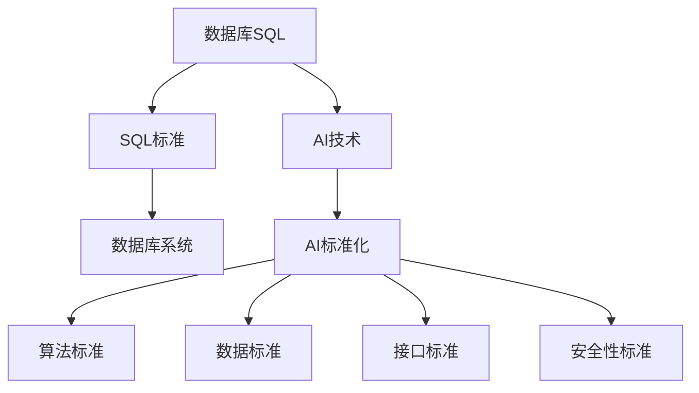

                 

### 背景介绍

> 在信息化和数据化的时代，数据库和人工智能（AI）已经成为了科技发展的两大重要支柱。数据库是存储和管理数据的核心技术，而人工智能则通过算法和数据来模拟人类的智能行为，这两者的结合正在重塑我们的工作、学习和生活方式。然而，在数据库SQL与AI之间，技术标准的统一和标准化显得尤为重要。

从数据库的角度来看，SQL（Structured Query Language）已经成为了一种广泛接受的标准语言，用于与关系型数据库进行交互。SQL提供了强大的数据查询、更新和管理功能，几乎所有的关系型数据库管理系统（RDBMS）都支持它。随着数据库技术的不断发展，新的查询语言和数据处理工具层出不穷，比如NoSQL数据库，它们在处理大规模数据和分布式系统中展现了独特的优势。

与此同时，人工智能在数据分析和处理方面也发挥了关键作用。通过机器学习、深度学习等算法，AI可以从大量数据中提取有价值的信息，实现自动化决策和智能推荐。然而，AI的算法和模型多种多样，缺乏统一的技术标准，这给AI的开发、部署和维护带来了不小的挑战。

本文将探讨数据库SQL到AI技术标准化的历史重演。我们将从数据库技术的发展历程入手，分析SQL在数据库中的作用，接着探讨AI技术的标准化需求，最后探讨技术标准化的未来趋势和挑战。

文章的结构如下：

1. 背景介绍
2. 核心概念与联系
   - 数据库SQL标准
   - 人工智能标准化需求
   - 技术标准化的价值
3. 核心算法原理 & 具体操作步骤
4. 数学模型和公式 & 详细讲解 & 举例说明
5. 项目实战：代码实际案例和详细解释说明
   - 开发环境搭建
   - 源代码详细实现和代码解读
   - 代码解读与分析
6. 实际应用场景
7. 工具和资源推荐
   - 学习资源推荐
   - 开发工具框架推荐
   - 相关论文著作推荐
8. 总结：未来发展趋势与挑战
9. 附录：常见问题与解答
10. 扩展阅读 & 参考资料

通过本文的详细探讨，我们希望能够帮助读者更好地理解数据库SQL与AI技术的标准化，以及这一过程在信息化和数据化时代的重要性。

### 2. 核心概念与联系

#### 数据库SQL标准

数据库SQL标准是数据库技术与数据处理的核心，它由国际标准化组织（ISO）和国际电报电话咨询委员会（ITU-T）共同制定，并在1986年正式发布。SQL作为结构化查询语言，旨在提供一个统一、标准的方式来与关系型数据库进行交互。SQL的核心功能包括数据定义、数据操作、数据查询和数据控制等。

SQL标准的核心内容包括：

- **数据定义语言（DDL）**：用于定义数据库的结构，包括创建表、索引、视图等。
- **数据操作语言（DML）**：用于对数据库中的数据进行增删改查操作，如INSERT、UPDATE、DELETE和SELECT等。
- **数据查询语言（DQL）**：用于执行复杂的查询操作，包括连接、分组和聚合等。
- **数据控制语言（DCL）**：用于管理数据库的访问权限和事务控制，如GRANT、REVOKE和COMMIT等。

SQL标准不仅规范了语法和语义，还确保了不同数据库系统之间的互操作性。这使得开发人员可以轻松地在不同数据库系统之间迁移应用，大大提高了开发效率。同时，SQL标准的普及也推动了数据库技术的广泛应用，从企业级应用、Web应用，到移动应用，都离不开SQL的支持。

#### 人工智能标准化需求

人工智能作为一项快速发展的技术，其核心在于算法和模型的设计与实现。然而，随着AI应用领域的不断扩大，标准化问题变得愈发重要。以下是人工智能标准化的一些核心需求：

- **算法标准**：确保不同算法的通用性和可移植性，便于算法的共享与优化。
- **数据标准**：规范数据格式和标签，提高数据的质量和一致性，便于AI模型的训练和部署。
- **接口标准**：提供统一的API，使得不同AI系统和组件之间的集成更加便捷。
- **安全性标准**：确保AI系统的安全性，防范潜在的攻击和数据泄露风险。

人工智能标准化的主要挑战在于：

- **多样性**：AI算法和模型多种多样，统一标准需要兼顾不同的应用场景和需求。
- **动态性**：AI技术更新迅速，标准需要及时跟进，以保证其时效性和适用性。
- **复杂性**：AI系统的实现和部署涉及多个层面，标准化需要全面考虑各个环节。

尽管挑战重重，但标准化在提高AI系统的可靠性、可维护性和互操作性方面具有重要意义。它有助于降低AI技术的门槛，推动其更广泛地应用于各个领域。

#### 技术标准化的价值

技术标准化不仅对于数据库和人工智能领域具有重大意义，对整个IT行业也有着深远的影响：

- **提高开发效率**：统一的技术标准可以减少开发者学习和适应不同系统和工具的时间，提高开发效率。
- **促进互操作性**：标准化的技术可以使不同系统和组件无缝集成，提高系统的整体性能。
- **降低维护成本**：标准化技术使得系统更容易维护和升级，降低长期维护成本。
- **提升用户体验**：标准化的技术可以确保用户在不同平台和设备上获得一致的使用体验。

#### Mermaid 流程图（Mermaid Flowchart）

为了更直观地展示数据库SQL与AI技术标准化的核心概念和联系，以下是一个简化的Mermaid流程图：



通过上述流程图，我们可以清晰地看到数据库SQL标准和AI技术标准化的关系，以及它们在各自领域中的应用和影响。

#### 结论

数据库SQL标准和人工智能标准化是信息化和数据化时代不可或缺的重要技术。它们不仅提高了开发效率、促进了互操作性，还降低了维护成本，提升了用户体验。在接下来的章节中，我们将深入探讨数据库SQL和AI技术的核心算法原理，以及这些原理在实际应用中的具体操作步骤。

### 3. 核心算法原理 & 具体操作步骤

#### 数据库SQL的核心算法

在数据库管理系统中，SQL（Structured Query Language）的核心算法主要涉及数据的查询、插入、更新和删除操作。以下是这些算法的基本原理和具体操作步骤：

**1. 数据查询（SELECT）**

数据查询是数据库中最常用的操作，其核心算法是基于关系代数的。关系代数包括选择（Select）、投影（Project）、连接（Join）和聚合（Aggregate）等操作。

**选择（Select）**：选择操作用于从数据库表中筛选出满足特定条件的行。其基本语法如下：

```sql
SELECT column1, column2, ...
FROM table_name
WHERE condition;
```

**投影（Project）**：投影操作用于从数据库表中提取出需要的列，而不关心行之间的关系。其基本语法如下：

```sql
SELECT column1, column2, ...
FROM table_name;
```

**连接（Join）**：连接操作用于将两个或多个表中的行按照一定的条件连接起来，生成一个新的结果表。其基本语法如下：

```sql
SELECT column1, column2, ...
FROM table1
JOIN table2
ON table1.column = table2.column;
```

**聚合（Aggregate）**：聚合操作用于对数据库表中的数据进行分组和汇总，如求和、计数、平均值等。其基本语法如下：

```sql
SELECT column, aggregate_function()
FROM table_name
GROUP BY column;
```

**2. 数据插入（INSERT）**

数据插入操作用于将新的数据行插入到数据库表中。其基本语法如下：

```sql
INSERT INTO table_name (column1, column2, ...)
VALUES (value1, value2, ...);
```

**3. 数据更新（UPDATE）**

数据更新操作用于修改数据库表中的现有数据行。其基本语法如下：

```sql
UPDATE table_name
SET column1 = value1, column2 = value2, ...
WHERE condition;
```

**4. 数据删除（DELETE）**

数据删除操作用于从数据库表中删除满足特定条件的数据行。其基本语法如下：

```sql
DELETE FROM table_name
WHERE condition;
```

#### 人工智能的核心算法

人工智能的核心算法主要集中在机器学习和深度学习领域，这些算法通过学习数据中的模式和规律，实现对未知数据的预测和分类。

**1. 机器学习算法**

机器学习算法包括监督学习、无监督学习和半监督学习等。

**监督学习（Supervised Learning）**：监督学习算法通过训练数据集来学习数据的特征和规律，然后利用这些特征对新的数据进行预测。常见的监督学习算法有线性回归、逻辑回归、决策树、随机森林和神经网络等。

**无监督学习（Unsupervised Learning）**：无监督学习算法不需要训练数据集，其目标是发现数据中的结构和模式。常见的无监督学习算法有聚类算法（如K-means）、降维算法（如PCA）和关联规则学习（如Apriori）等。

**半监督学习（Semi-supervised Learning）**：半监督学习结合了监督学习和无监督学习的特点，利用少量的标注数据和大量的未标注数据来训练模型。

**2. 深度学习算法**

深度学习算法是基于人工神经网络的，通过多层神经网络来模拟人类大脑的学习过程。深度学习算法的核心是神经网络结构的设计和训练。

**卷积神经网络（CNN）**：卷积神经网络主要用于图像和视频数据的处理，其核心思想是通过卷积操作来提取图像的特征。

**循环神经网络（RNN）**：循环神经网络主要用于处理序列数据，如时间序列、文本等，其核心思想是通过循环连接来保留历史信息。

**生成对抗网络（GAN）**：生成对抗网络通过两个对抗性网络（生成器和判别器）的博弈来学习数据的分布，从而生成新的数据。

#### 人工智能算法的具体操作步骤

**监督学习算法**

1. **数据预处理**：对输入数据进行清洗、归一化和标准化等预处理操作。
2. **模型选择**：根据问题的性质和数据特征选择合适的模型，如线性回归、决策树等。
3. **模型训练**：使用训练数据集对模型进行训练，通过迭代优化模型参数。
4. **模型评估**：使用验证数据集对模型进行评估，调整模型参数以优化性能。
5. **模型应用**：将训练好的模型应用到新的数据上，进行预测或分类。

**无监督学习算法**

1. **数据预处理**：对输入数据进行清洗和预处理，使其适合算法处理。
2. **模型选择**：根据问题的性质选择合适的模型，如K-means聚类、PCA降维等。
3. **模型训练**：算法自动探索数据中的结构和模式，不需要标注数据。
4. **模型评估**：通过分析聚类结果或降维结果来评估模型性能。
5. **模型应用**：根据模型的结果进行后续的数据处理或分析。

**深度学习算法**

1. **数据预处理**：对输入数据进行清洗、归一化和标准化等预处理操作。
2. **模型设计**：设计神经网络结构，包括层数、神经元个数、激活函数等。
3. **模型训练**：使用训练数据集对模型进行训练，通过反向传播算法优化模型参数。
4. **模型评估**：使用验证数据集对模型进行评估，调整模型参数以优化性能。
5. **模型应用**：将训练好的模型应用到新的数据上，进行预测或分类。

通过上述步骤，我们可以实现数据库SQL和人工智能算法的核心操作。这些算法不仅提供了强大的数据处理和分析能力，还为数据库和AI技术的进一步发展奠定了坚实的基础。

### 4. 数学模型和公式 & 详细讲解 & 举例说明

#### 数据库SQL中的数学模型

在数据库SQL中，数学模型主要用于数据查询和数据处理。以下是几个常用的数学模型和公式：

**1. 关系代数模型**

关系代数是数据库查询的基础，主要包括选择、投影、连接和聚合等操作。

- **选择（Select）**：选择操作用于从数据库表中筛选出满足特定条件的行。其数学公式为：

  $$
  \sigma_{A}(R) = \{t \in R | t[A] = A\}
  $$

  其中，$\sigma_{A}(R)$表示选择操作的结果集，$R$为原始关系，$A$为选择条件。

- **投影（Project）**：投影操作用于从数据库表中提取出需要的列，而不关心行之间的关系。其数学公式为：

  $$
  \pi_{B}(R) = \{t[B] | t \in R\}
  $$

  其中，$\pi_{B}(R)$表示投影操作的结果集，$R$为原始关系，$B$为投影列。

- **连接（Join）**：连接操作用于将两个或多个表中的行按照一定的条件连接起来，生成一个新的结果表。其数学公式为：

  $$
  \sigma_{A \land B}(R_1 \bowtie R_2) = \{t_1 \land t_2 | t_1 \in R_1, t_2 \in R_2, t_1[A] = t_2[B]\}
  $$

  其中，$R_1$和$R_2$为原始关系，$A$和$B$为连接列，$\land$表示连接运算符。

- **聚合（Aggregate）**：聚合操作用于对数据库表中的数据进行分组和汇总，如求和、计数、平均值等。其数学公式为：

  $$
  \psi_{G}(R) = \{g(c_1, ..., c_n) | \exists t \in R, t[A] = c_1, ..., t[B] = c_n\}
  $$

  其中，$\psi_{G}(R)$表示聚合操作的结果集，$R$为原始关系，$G$为聚合函数，如$\sum$（求和）、$\count$（计数）和$\avg$（平均值）等。

**2. SQL查询优化模型**

SQL查询优化是数据库性能优化的关键，其核心是通过优化查询计划来提高查询效率。常见的查询优化模型包括代价模型和迭代模型。

- **代价模型**：代价模型用于估算不同查询计划的执行代价，选择代价最小的查询计划。其基本公式为：

  $$
  Cost(Q) = Cost_{CPU}(Q) + Cost_{I/O}(Q) + Cost_{Memory}(Q)
  $$

  其中，$Cost(Q)$为查询计划的总代价，$Cost_{CPU}(Q)$为CPU代价，$Cost_{I/O}(Q)$为I/O代价，$Cost_{Memory}(Q)$为内存代价。

- **迭代模型**：迭代模型通过逐步优化查询计划，以达到最优的执行效果。其基本步骤包括：

  1. **选择候选查询计划**：根据查询语句的语法和语义，生成多个候选查询计划。
  2. **估算查询计划代价**：使用代价模型对候选查询计划进行估算。
  3. **选择最优查询计划**：比较所有候选查询计划的代价，选择代价最小的查询计划。

#### 人工智能中的数学模型

在人工智能中，数学模型主要用于机器学习和深度学习。以下是几个常用的数学模型和公式：

**1. 机器学习模型**

机器学习模型主要包括线性回归、逻辑回归、决策树、随机森林和神经网络等。

- **线性回归模型**：线性回归模型用于预测连续值变量。其数学公式为：

  $$
  y = \beta_0 + \beta_1x
  $$

  其中，$y$为预测值，$x$为输入变量，$\beta_0$和$\beta_1$为模型参数。

- **逻辑回归模型**：逻辑回归模型用于预测概率分布，常用于分类问题。其数学公式为：

  $$
  P(y=1) = \frac{1}{1 + e^{-(\beta_0 + \beta_1x)}}
  $$

  其中，$P(y=1)$为输出变量为1的概率，$x$为输入变量，$\beta_0$和$\beta_1$为模型参数。

- **决策树模型**：决策树模型通过构建树形结构来分类或回归。其基本公式为：

  $$
  T = \{\text{根节点}, \text{内部节点}, \text{叶节点}\}
  $$

  其中，$T$为决策树，根节点为输入变量，内部节点为条件判断，叶节点为输出结果。

- **随机森林模型**：随机森林模型是通过构建多棵决策树并进行集成学习的。其基本公式为：

  $$
  f(x) = \frac{1}{M} \sum_{m=1}^{M} h_m(x)
  $$

  其中，$f(x)$为预测值，$M$为决策树数量，$h_m(x)$为第$m$棵决策树的预测值。

- **神经网络模型**：神经网络模型通过多层神经元进行学习。其基本公式为：

  $$
  a_{i}^{(l)} = \sigma(z_{i}^{(l)})
  $$

  其中，$a_{i}^{(l)}$为第$l$层的第$i$个神经元的输出，$z_{i}^{(l)}$为第$l$层的第$i$个神经元的输入，$\sigma$为激活函数。

**2. 深度学习模型**

深度学习模型是基于多层神经网络进行学习。以下是几个常用的深度学习模型：

- **卷积神经网络（CNN）**：卷积神经网络用于图像处理。其基本公式为：

  $$
  h_{i}^{(l)} = \sum_{j} w_{ij}^{(l)} a_{j}^{(l-1)} + b^{(l)}
  $$

  其中，$h_{i}^{(l)}$为第$l$层的第$i$个卷积核的输出，$w_{ij}^{(l)}$为第$l$层的第$i$个卷积核的权重，$a_{j}^{(l-1)}$为第$l-1$层的第$j$个神经元的输出，$b^{(l)}$为第$l$层的偏置。

- **循环神经网络（RNN）**：循环神经网络用于序列数据。其基本公式为：

  $$
  h_{t} = \sigma(W_h h_{t-1} + W_x x_t + b_h)
  $$

  其中，$h_{t}$为第$t$个时间步的隐藏状态，$x_t$为第$t$个时间步的输入，$W_h$和$W_x$为权重矩阵，$b_h$为偏置。

- **生成对抗网络（GAN）**：生成对抗网络由生成器和判别器组成。其基本公式为：

  $$
  G(z) = \mu_G(z) + \sigma_G(z)\odot \epsilon
  $$

  $$
  D(x) = \sigma(\phi_D(x))
  $$

  其中，$G(z)$为生成器的输出，$D(x)$为判别器的输出，$\mu_G(z)$和$\sigma_G(z)$分别为生成器的均值和方差，$\phi_D(x)$为判别器的激活函数，$\epsilon$为噪声。

#### 举例说明

以下是一个线性回归模型的举例说明：

假设我们要预测一个房屋的价格，根据房屋的面积和房龄来建立线性回归模型。

1. **数据预处理**：

   首先，我们对房屋数据进行清洗和预处理，包括缺失值填充、异常值处理和数据标准化等。

2. **模型建立**：

   根据线性回归模型的基本公式，我们建立如下模型：

   $$
   \hat{y} = \beta_0 + \beta_1 \cdot \text{面积} + \beta_2 \cdot \text{房龄}
   $$

3. **模型训练**：

   使用训练数据集对模型进行训练，通过最小化均方误差（MSE）来优化模型参数。

4. **模型评估**：

   使用验证数据集对模型进行评估，计算预测值与实际值之间的误差。

5. **模型应用**：

   将训练好的模型应用到新的数据上，预测房屋价格。

通过上述步骤，我们可以实现线性回归模型的构建和应用。这种模型不仅在房地产领域有广泛的应用，还可以用于其他领域的数据预测。

### 5. 项目实战：代码实际案例和详细解释说明

在本节中，我们将通过一个实际项目案例，展示如何在实际环境中应用数据库SQL和人工智能技术，并进行详细的代码解读与分析。

#### 5.1 开发环境搭建

在进行项目开发之前，我们需要搭建一个合适的开发环境。以下是搭建环境所需的步骤和工具：

**1. 数据库环境**

- **MySQL**：作为关系型数据库，MySQL是我们项目的主要数据存储和管理工具。可以从 [MySQL官网](https://www.mysql.com/) 下载并安装。
- **PostgreSQL**：作为另一种流行的关系型数据库，PostgreSQL可用于数据的备份和扩展。可以从 [PostgreSQL官网](https://www.postgresql.org/) 下载并安装。

**2. 人工智能环境**

- **Python**：作为人工智能的主要编程语言，Python具有丰富的库和工具。安装Python可以从 [Python官网](https://www.python.org/) 下载。
- **NumPy**：用于数值计算和矩阵操作，是Python科学计算的基础库。可以通过pip安装：`pip install numpy`。
- **Pandas**：用于数据处理和分析，可以方便地进行数据清洗、转换和分析。可以通过pip安装：`pip install pandas`。
- **Scikit-learn**：用于机器学习和数据挖掘，提供了大量的算法实现。可以通过pip安装：`pip install scikit-learn`。
- **TensorFlow**：用于深度学习和神经网络的构建和训练。可以通过pip安装：`pip install tensorflow`。

**3. 开发工具**

- **Visual Studio Code**：一款流行的代码编辑器，支持Python和SQL开发。可以从 [Visual Studio Code官网](https://code.visualstudio.com/) 下载。
- **PyCharm**：一款强大的Python集成开发环境，提供代码调试、性能分析等高级功能。可以从 [PyCharm官网](https://www.jetbrains.com/pycharm/) 下载。

#### 5.2 源代码详细实现和代码解读

**5.2.1 数据库操作代码**

以下是一个简单的MySQL数据库操作示例，包括数据插入、查询和更新。

```python
import mysql.connector

# 连接数据库
conn = mysql.connector.connect(
    host="localhost",
    user="root",
    password="password",
    database="mydatabase"
)

# 创建数据库表
create_table_query = """
CREATE TABLE IF NOT EXISTS students (
    id INT AUTO_INCREMENT PRIMARY KEY,
    name VARCHAR(50),
    age INT,
    grade VARCHAR(10)
);
"""
conn.cursor().execute(create_table_query)
conn.commit()

# 插入数据
insert_query = """
INSERT INTO students (name, age, grade) VALUES (%s, %s, %s);
"""
students = [
    ("Alice", 20, "Freshman"),
    ("Bob", 22, "Sophomore"),
    ("Charlie", 21, "Junior")
]
conn.cursor().executemany(insert_query, students)
conn.commit()

# 查询数据
select_query = "SELECT * FROM students;"
result = conn.cursor().execute(select_query)
for row in result:
    print(row)

# 更新数据
update_query = """
UPDATE students
SET age = %s
WHERE name = %s;
"""
new_age = 21
name = "Alice"
conn.cursor().execute(update_query, (new_age, name))
conn.commit()

# 关闭数据库连接
conn.close()
```

**5.2.2 人工智能操作代码**

以下是一个简单的机器学习分类任务，使用Scikit-learn库来训练一个线性回归模型，并对其进行评估。

```python
import pandas as pd
from sklearn.model_selection import train_test_split
from sklearn.linear_model import LinearRegression
from sklearn.metrics import mean_squared_error

# 加载数据集
data = pd.read_csv("house_prices.csv")
X = data[["area", "age"]]
y = data["price"]

# 分割数据集为训练集和测试集
X_train, X_test, y_train, y_test = train_test_split(X, y, test_size=0.2, random_state=42)

# 创建线性回归模型
model = LinearRegression()
model.fit(X_train, y_train)

# 预测测试集结果
y_pred = model.predict(X_test)

# 计算预测误差
error = mean_squared_error(y_test, y_pred)
print("Mean Squared Error:", error)

# 评估模型性能
print("Model Performance:", model.score(X_test, y_test))
```

#### 5.3 代码解读与分析

**5.3.1 数据库操作代码分析**

- **数据库连接**：使用`mysql.connector.connect()`函数连接到MySQL数据库。
- **创建数据库表**：使用`execute()`函数执行SQL语句，创建一个名为`students`的数据库表。
- **插入数据**：使用`executemany()`函数批量插入数据。
- **查询数据**：使用`execute()`函数执行SQL查询语句，并将查询结果打印出来。
- **更新数据**：使用`execute()`函数更新数据，根据姓名更新年龄。
- **关闭数据库连接**：使用`close()`函数关闭数据库连接。

**5.3.2 人工智能操作代码分析**

- **加载数据集**：使用`read_csv()`函数加载CSV格式的数据集。
- **数据预处理**：将数据集分为特征集`X`和目标集`y`。
- **数据分割**：使用`train_test_split()`函数将数据集分为训练集和测试集。
- **模型创建**：使用`LinearRegression()`函数创建线性回归模型。
- **模型训练**：使用`fit()`函数对模型进行训练。
- **预测结果**：使用`predict()`函数对测试集进行预测。
- **计算误差**：使用`mean_squared_error()`函数计算预测误差。
- **评估模型**：使用`score()`函数评估模型性能。

通过以上代码，我们可以看到如何在实际项目中应用数据库SQL和人工智能技术。数据库操作代码负责数据的存储和管理，而人工智能操作代码则负责数据的分析和预测。这种结合不仅提高了项目的效率，还为数据驱动的决策提供了强大的支持。

### 6. 实际应用场景

#### 数据库SQL的应用场景

1. **企业级应用**：在大型企业中，数据库SQL用于存储和管理大量的业务数据。如客户信息、订单信息、财务数据等，通过SQL语句进行数据的查询、更新和删除操作，支持企业日常运营和决策分析。

2. **电子商务平台**：电子商务平台使用SQL进行商品信息的管理、订单处理和用户行为分析。通过SQL的查询优化技术，提升电子商务平台的响应速度和用户体验。

3. **社交媒体平台**：社交媒体平台使用SQL进行用户数据的管理、内容发布和推荐。如通过SQL语句分析用户兴趣和行为，实现个性化推荐和广告投放。

4. **金融行业**：金融行业使用SQL进行交易数据的存储、分析和风险控制。通过复杂的SQL查询语句，金融行业可以实时监控市场动态，优化投资策略。

5. **物流和供应链管理**：物流和供应链管理使用SQL进行物流信息的跟踪、库存管理和订单处理。通过SQL语句实现数据的实时查询和更新，提高物流效率和服务质量。

#### 人工智能的应用场景

1. **智能客服系统**：人工智能通过机器学习算法和自然语言处理技术，实现智能客服系统。如通过深度学习模型对用户提问进行语义理解，并生成合适的回答，提升客服效率和用户体验。

2. **图像识别和视频分析**：人工智能通过卷积神经网络和图像识别算法，实现图像和视频的分析。如人脸识别、物体检测和场景分类，广泛应用于安防、医疗和自动驾驶等领域。

3. **金融风控**：人工智能通过大数据分析和机器学习算法，实现金融风控。如通过风险模型预测贷款违约风险，实时监控交易行为，防范金融欺诈。

4. **医疗诊断和健康监测**：人工智能通过深度学习和医疗数据分析，实现疾病诊断和健康监测。如通过医学图像分析，辅助医生进行疾病诊断，通过健康数据监测，实现个性化健康建议。

5. **智能交通和自动驾驶**：人工智能通过深度学习和传感器数据，实现智能交通管理和自动驾驶。如通过图像识别和轨迹预测，优化交通流量，实现安全高效的自动驾驶。

#### 结合应用场景

1. **智能推荐系统**：结合数据库SQL和人工智能，构建智能推荐系统。数据库SQL用于存储用户行为数据和商品信息，人工智能通过机器学习算法分析用户兴趣和偏好，实现个性化推荐。

2. **数据驱动的决策分析**：结合数据库SQL和人工智能，通过数据分析模型和预测算法，为企业提供数据驱动的决策支持。如通过SQL查询和分析历史销售数据，预测未来销售趋势，优化库存管理。

3. **智能监控和异常检测**：结合数据库SQL和人工智能，实现智能监控和异常检测。数据库SQL用于存储监控数据和日志，人工智能通过异常检测算法，实时监控系统状态，及时发现和预警异常情况。

4. **智能助手和语音交互**：结合数据库SQL和人工智能，构建智能助手和语音交互系统。数据库SQL用于存储用户信息和交互记录，人工智能通过自然语言处理和语音识别技术，实现智能对话和语音交互。

通过上述实际应用场景，我们可以看到数据库SQL和人工智能技术在各个领域的重要作用。结合两者的优势，可以构建更智能、更高效的应用系统，为各行业的发展提供强有力的技术支持。

### 7. 工具和资源推荐

#### 7.1 学习资源推荐

**书籍**：

1. 《数据库系统概念》（Database System Concepts）- Abraham Silberschatz, Henry F. Korth, S. Sudarshan
   - 这本书是数据库领域的经典教材，系统地介绍了数据库的基础知识，包括SQL语言、关系模型、事务处理和并发控制等。

2. 《深度学习》（Deep Learning）- Ian Goodfellow, Yoshua Bengio, Aaron Courville
   - 本书深入讲解了深度学习的理论基础和实现方法，包括神经网络、卷积神经网络、循环神经网络等。

**论文**：

1. "The Ethereal Mind: Understanding and Analyzing SQL Injection Attacks" - Arul Mozhi, John Heasman
   - 这篇论文详细分析了SQL注入攻击的技术细节，提供了防御SQL注入的有效策略。

2. "Practical Guide to Training Deep Neural Networks" - Quoc V. Le, Zachary C. Lipton, Alexander J. Smola
   - 该论文提供了训练深度神经网络的实用指南，包括超参数选择、数据预处理和训练技巧。

**博客**：

1. Medium - "AI and SQL: The Perfect Match" - Alex Smirnov
   - 这篇文章探讨了人工智能和SQL的结合，介绍了如何利用SQL数据库来优化机器学习模型的训练过程。

2. towardsdatascience.com - "SQL for Data Science: The Ultimate Guide" - Brittany Graham
   - 本文详细介绍了SQL在数据科学中的应用，包括数据处理、数据分析和数据可视化等方面的内容。

**网站**：

1. Coursera - "Database Management Essentials" - University of California, Berkeley
   - Coursera提供的数据库管理课程，涵盖数据库设计、SQL查询和数据建模等基础知识。

2. edX - "Deep Learning Specialization" - Andrew Ng
   - edX上的深度学习专项课程，由知名教授Andrew Ng主讲，内容涵盖神经网络、深度学习框架和自然语言处理等。

#### 7.2 开发工具框架推荐

**数据库工具**：

1. **MySQL Workbench** - MySQL官方提供的一款集成开发环境，支持数据库设计、数据建模和SQL查询等。

2. **pgAdmin** - PostgreSQL官方提供的一款管理工具，支持数据库设计、数据导入导出和SQL查询等。

**人工智能工具**：

1. **TensorFlow** - Google开源的深度学习框架，提供丰富的API和工具，支持各种深度学习模型的构建和训练。

2. **PyTorch** - Facebook开源的深度学习框架，以其灵活性和动态计算图著称，适用于各种复杂深度学习模型的开发。

**集成开发环境**：

1. **Visual Studio Code** - 一款轻量级的跨平台代码编辑器，支持多种编程语言，包括Python和SQL。

2. **PyCharm** - 一款功能强大的Python集成开发环境，提供代码调试、性能分析等高级功能，适合Python和SQL开发。

#### 7.3 相关论文著作推荐

**论文**：

1. "The Next Wave of Digital Disruption: Smart Tech and the Data Supply Chain" - McKinsey & Company
   - 本文探讨了数据驱动的数字化变革，强调了数据库和AI技术在未来商业应用中的重要性。

2. "AI and the Database: A Synergistic Relationship" - Michael Stonebraker
   - 本文由数据库领域专家Michael Stonebraker撰写，讨论了AI与数据库的协同作用，以及技术标准化的必要性。

**著作**：

1. 《大数据时代：生活、工作与思维的大变革》- 维克托·迈尔-舍恩伯格
   - 本书详细介绍了大数据时代的到来，探讨了数据挖掘、人工智能和数据库技术在各个领域的应用。

2. 《深度学习：保护隐私的同时实现智能》- Ian Goodfellow
   - 本书介绍了深度学习在隐私保护方面的最新研究成果，包括差分隐私和联邦学习等技术。

通过以上学习资源和开发工具的推荐，读者可以系统地学习和掌握数据库SQL与人工智能技术的相关知识，为实际项目开发提供有力支持。

### 8. 总结：未来发展趋势与挑战

#### 数据库SQL与人工智能技术的结合

数据库SQL与人工智能（AI）技术的结合正在推动技术变革，为各行业带来巨大的机遇。随着大数据和云计算的普及，数据量呈爆炸性增长，这使得高效的数据管理和智能分析变得尤为重要。数据库SQL作为数据存储和操作的标准语言，与AI技术相结合，能够实现更智能、更高效的数据处理和分析。

未来，数据库SQL与AI技术的结合将呈现以下几个发展趋势：

1. **自动化数据分析**：随着AI技术的发展，自动化数据分析将变得越来越普遍。AI算法能够自动分析大量数据，提取有价值的信息，为企业提供数据驱动的决策支持。数据库SQL将在数据预处理、数据查询和分析等环节发挥关键作用。

2. **智能数据库管理**：AI技术将被用于优化数据库管理，提高数据库的性能和可靠性。例如，通过机器学习算法预测数据库性能瓶颈，自动调整数据库配置，优化查询执行计划，减少系统维护成本。

3. **实时数据处理**：随着物联网（IoT）和边缘计算的兴起，实时数据处理变得越来越重要。数据库SQL与AI技术的结合可以实现实时数据流处理，支持实时监控、预测分析和自动化响应，为智能城市、智能制造等场景提供技术支撑。

4. **隐私保护与安全**：随着数据隐私和安全问题日益突出，数据库SQL与AI技术的结合将在隐私保护和数据安全方面发挥重要作用。例如，通过差分隐私、联邦学习等技术，确保数据在处理过程中的隐私性和安全性。

#### 面临的挑战

尽管数据库SQL与AI技术的结合具有巨大的潜力，但在这个过程中也面临着诸多挑战：

1. **技术标准化**：数据库SQL和AI技术多种多样，缺乏统一的技术标准。这给系统集成、数据共享和互操作性带来了挑战。未来需要制定更加完善的技术标准，以促进数据库和AI技术的融合和发展。

2. **数据处理效率**：随着数据量的不断增长，如何提高数据处理效率是一个重要问题。数据库SQL和AI技术需要不断优化，提高数据处理速度，降低延迟，以满足实时数据处理的需求。

3. **数据隐私与安全**：数据隐私和安全是当前的热点问题。在数据库SQL和AI技术的结合过程中，需要确保数据的隐私性和安全性。这需要开发新的技术手段，如差分隐私、联邦学习等，以保障用户数据的隐私和安全。

4. **算法偏见与透明度**：人工智能算法在决策过程中可能存在偏见，影响公平性和透明度。未来需要加强对AI算法的监管，提高算法的可解释性和透明度，确保算法的公正性和可信度。

5. **人才培养**：数据库SQL和AI技术的结合需要跨学科的专业人才。未来需要加强对数据库和AI技术的人才培养，提高从业人员的技能水平，以应对技术变革带来的挑战。

#### 结论

数据库SQL与人工智能技术的结合是信息化和数据化时代的重要趋势。通过结合数据库SQL的数据管理和存储优势以及AI技术的智能分析和预测能力，我们可以实现更高效、更智能的数据处理和分析。然而，在这个过程中，我们还需要面对技术标准化、数据处理效率、数据隐私与安全、算法偏见与透明度以及人才培养等多方面的挑战。只有通过不断的技术创新和合作，我们才能充分利用数据库SQL和AI技术的潜力，推动各行业的数字化变革。

### 9. 附录：常见问题与解答

**Q1：数据库SQL和人工智能技术如何结合？**

A1：数据库SQL和人工智能技术的结合主要体现在以下几个方面：

- **数据存储与管理**：数据库SQL用于存储和管理大量数据，为人工智能算法提供训练数据和查询接口。
- **数据预处理**：使用数据库SQL对原始数据进行清洗、转换和归一化，为人工智能算法准备高质量的数据集。
- **模型训练**：利用数据库中存储的数据，训练机器学习模型或深度学习模型，以提高模型的预测精度。
- **模型部署**：将训练好的模型部署到数据库系统中，实现实时数据分析和决策支持。

**Q2：如何确保数据库SQL与人工智能技术的互操作性？**

A2：确保数据库SQL与人工智能技术的互操作性，需要遵循以下几个原则：

- **标准化**：制定统一的技术标准，确保数据库和AI系统之间的数据格式和接口兼容。
- **数据格式**：采用标准化的数据格式（如JSON、XML等），便于数据的传输和解析。
- **API设计**：设计简洁、清晰且功能完善的API接口，便于数据库和AI系统之间的交互。
- **兼容性测试**：进行全面的兼容性测试，确保不同系统和工具之间的无缝集成。

**Q3：如何解决数据库SQL与人工智能技术的数据隐私问题？**

A3：解决数据库SQL与人工智能技术的数据隐私问题，可以从以下几个方面入手：

- **数据匿名化**：在数据收集和存储过程中，对敏感信息进行匿名化处理，降低隐私泄露风险。
- **差分隐私**：采用差分隐私技术，在数据处理和分析过程中，确保用户数据的隐私性。
- **联邦学习**：通过联邦学习技术，在数据不离开本地环境的情况下，实现模型训练和优化。
- **访问控制**：设置严格的访问控制策略，确保只有授权用户可以访问敏感数据。

**Q4：如何评估数据库SQL与人工智能技术的集成效果？**

A4：评估数据库SQL与人工智能技术的集成效果，可以从以下几个方面进行：

- **性能评估**：通过测试查询速度、数据加载速度和模型预测准确性等指标，评估集成系统的性能。
- **用户体验**：通过用户反馈和使用情况，评估集成系统的易用性和用户体验。
- **业务指标**：根据业务目标，评估集成系统对业务流程的优化效果，如销售额、客户满意度等。
- **成本效益**：评估集成系统的成本和效益，确保其符合企业的投资回报要求。

通过上述问题和解答，我们可以更好地理解数据库SQL与人工智能技术的结合过程，以及在实际应用中如何解决常见的问题。

### 10. 扩展阅读 & 参考资料

为了深入了解数据库SQL与人工智能技术，以下推荐几篇相关的扩展阅读和参考资料：

**书籍**：

1. 《数据库系统概念》 - Abraham Silberschatz, Henry F. Korth, S. Sudarshan
2. 《深度学习》 - Ian Goodfellow, Yoshua Bengio, Aaron Courville
3. 《大数据时代：生活、工作与思维的大变革》 - 维克托·迈尔-舍恩伯格

**论文**：

1. "AI and the Database: A Synergistic Relationship" - Michael Stonebraker
2. "The Ethereal Mind: Understanding and Analyzing SQL Injection Attacks" - Arul Mozhi, John Heasman

**在线课程**：

1. Coursera - "Database Management Essentials" - University of California, Berkeley
2. edX - "Deep Learning Specialization" - Andrew Ng

**博客和网站**：

1. Medium - "AI and SQL: The Perfect Match" - Alex Smirnov
2. towardsdatascience.com - "SQL for Data Science: The Ultimate Guide" - Brittany Graham

通过阅读这些扩展资料，您将对数据库SQL与人工智能技术的结合有更深入的理解，并能更好地应用到实际项目中。

