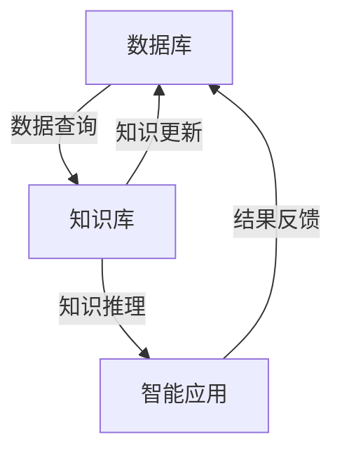

                 

### 背景介绍

在当今科技飞速发展的时代，人工智能（AI）已经成为推动科学进步的重要力量。AI for Science，即人工智能在科学领域的应用，正以前所未有的速度和广度影响着各个学科。这一领域的快速发展不仅依赖于先进算法的创新，还依赖于高效的数据处理和分析能力。在AI for Science中，数据库和知识库起着至关重要的作用。本文将详细探讨数据库和知识库在这一领域的核心作用、基本概念及其相互关系。

首先，我们需要明确数据库和知识库的定义及其在AI for Science中的应用场景。数据库（Database）是一种按照数据结构来组织、存储和管理数据的仓库。它为用户提供了数据的快速检索、插入、修改和删除功能。在AI for Science中，数据库主要用于存储实验数据、观测数据、文献数据等，为算法训练和模型构建提供基础数据支持。

知识库（Knowledge Base），则是一种用于存储、管理和使用知识的系统。它不仅包含数据，还包括了基于这些数据建立起来的知识模型、推理规则等。在AI for Science中，知识库用于存储科学领域的专业知识，支持智能推理和决策，帮助研究人员从海量数据中提取关键信息。

接下来，本文将深入探讨数据库和知识库在AI for Science中的重要性，包括数据管理和存储、知识表示与推理、算法优化等方面。同时，我们将通过具体案例和项目实战，展示数据库和知识库在实际应用中的效果。最后，本文将展望数据库和知识库在未来AI for Science发展中的趋势和挑战，为读者提供有价值的参考。

通过本文的阅读，读者将全面了解数据库和知识库在AI for Science中的核心作用，掌握相关技术原理和应用方法，为未来在科学研究中的AI应用提供理论支持和实践指导。让我们一起探索这一激动人心的领域，发现数据库和知识库的无限潜力。

### 核心概念与联系

要深入理解数据库和知识库在AI for Science中的重要性，我们首先需要明确这两个核心概念的基本原理及其相互关系。在AI for Science的背景下，数据库和知识库不仅各自发挥着独特的作用，而且在很多情况下是相辅相成的。

#### 数据库的基本原理

数据库的基本原理可以追溯到其作为数据存储和管理系统的功能。数据库的主要目标是高效、准确地存储、检索和操作数据，同时确保数据的一致性和完整性。在数据库管理系统中，常见的数据模型包括关系模型、文档模型、图模型等。

关系数据库（Relational Database）是最广泛使用的一种数据模型，它基于关系代数理论，将数据组织成表格形式，通过外键和主键的关系来实现数据之间的关联。关系数据库的优点在于其结构化、易于管理和查询效率高，因此在很多科学领域（如生物信息学、环境科学）得到了广泛应用。

文档数据库（Document Database）则适用于存储非结构化或半结构化数据，如文本、图片、音频等。这种数据库通常基于JSON或XML等格式，支持灵活的数据模型和高扩展性。文档数据库在科研领域中主要用于存储实验数据、文献资料等。

图数据库（Graph Database）是一种用于存储和查询复杂关系的数据库，它通过节点和边的表示来组织数据，非常适合处理社交网络、知识图谱等具有高度互联性的数据。图数据库在科学研究中，尤其在复杂网络分析和知识图谱构建中具有显著优势。

#### 知识库的基本原理

知识库的基本原理涉及知识的表示、存储、管理和使用。知识库的核心功能是存储领域专家的知识，并将这些知识用于智能推理和决策支持。知识库通常由三个主要组成部分构成：数据层、推理层和用户接口层。

数据层是知识库的基础，它存储了各种形式的知识，包括事实、规则、模型等。知识库中的数据通常通过本体论（Ontology）来组织，本体论为知识库中的概念和关系提供了一个明确的定义和分类体系。

推理层是知识库的核心，它使用各种推理算法（如演绎推理、归纳推理、案例推理等）从知识库中的数据中推导出新的结论。推理层不仅能够处理显式知识，如规则和公式，还能够处理隐式知识，如经验、模式等。

用户接口层是知识库与用户之间的交互界面，它提供了友好的用户界面，使用户能够方便地查询和操作知识库中的数据。

#### 数据库与知识库的关系

数据库和知识库在AI for Science中是紧密联系的。数据库为知识库提供了数据支持，知识库则利用这些数据提供智能推理和决策支持。

首先，数据库中的数据是知识库构建的基础。知识库中的数据通常来源于数据库，如实验数据、观测数据、文献数据等。通过从数据库中提取关键信息，知识库能够建立领域知识模型，为科学研究和智能应用提供支持。

其次，知识库可以优化数据库的查询和操作。例如，在生物信息学中，知识库可以存储基因和蛋白质的属性信息，通过智能推理，帮助研究人员快速找到相关基因和蛋白质之间的关系，从而提高数据查询的效率和准确性。

最后，知识库和数据库的结合可以促进科学研究中的知识整合。通过将数据库中的数据转化为知识库中的知识模型，研究人员可以更方便地利用跨领域的知识进行综合分析，从而推动科学发现和创新。

#### Mermaid 流程图

为了更直观地展示数据库和知识库的基本原理及其相互关系，我们可以使用Mermaid流程图来表示它们之间的交互。



在这个流程图中，数据库提供了数据支持，知识库通过智能推理为智能应用提供决策支持，并将推理结果反馈给数据库，实现数据的动态更新。这种循环过程不仅提高了数据利用效率，还促进了知识库的持续完善和进化。

通过以上对数据库和知识库的基本原理及其相互关系的介绍，我们为接下来深入探讨数据库和知识库在AI for Science中的应用和作用奠定了基础。在接下来的章节中，我们将进一步分析核心算法原理、数学模型和具体应用场景，以全面展示数据库和知识库在科学研究中的巨大潜力。

#### 核心算法原理 & 具体操作步骤

在深入探讨数据库和知识库在AI for Science中的应用之前，我们需要了解一些核心算法原理，这些原理为数据库和知识库提供了强大的技术支持。以下是几个在数据库和知识库中广泛使用的核心算法原理及其具体操作步骤。

##### 1. 数据库查询优化算法

数据库查询优化算法是提高数据库查询效率的重要手段。常见的查询优化算法包括查询树生成算法、查询树优化算法和查询执行计划生成算法。

- **查询树生成算法**：查询树生成算法通过图论中的树形结构来表示查询操作，如选择、连接、投影等。算法的目的是在所有可能的查询树中找到一条最优路径，以最小化查询时间。

  - **具体操作步骤**：
    1. 将查询分解成基本操作，如选择、连接、投影等。
    2. 使用图论算法（如最小生成树算法）生成查询树。
    3. 对查询树进行遍历，评估每条路径的执行成本。
    4. 选择执行成本最低的路径作为查询最优执行计划。

- **查询树优化算法**：查询树优化算法通过优化查询树的节点和边，进一步提高查询效率。常见的优化方法包括节点合并、节点分解和路径交换等。

  - **具体操作步骤**：
    1. 对查询树进行遍历，识别可优化的节点和边。
    2. 应用节点合并或分解规则，减少查询树的复杂度。
    3. 根据执行成本评估和优化后的查询树路径，选择最优的查询执行计划。

- **查询执行计划生成算法**：查询执行计划生成算法负责将查询树转换为具体的执行计划，包括扫描表、建立索引、执行连接操作等。

  - **具体操作步骤**：
    1. 根据查询树的节点和边生成初步的执行计划。
    2. 使用启发式算法（如动态规划）优化执行计划，减少查询执行时间。
    3. 针对特定的数据库环境（如硬件配置、索引策略等）调整执行计划，以最大化查询效率。

##### 2. 知识图谱构建算法

知识图谱是一种用于表示实体和实体之间关系的图形结构。知识图谱构建算法是生成高质量知识图谱的关键。常见的知识图谱构建算法包括基于规则的方法、基于机器学习的方法和基于图谱嵌入的方法。

- **基于规则的方法**：基于规则的方法通过定义规则和模式来生成知识图谱。这种方法通常需要领域专家提供大量先验知识，以构建规则库。

  - **具体操作步骤**：
    1. 定义实体和关系类别，建立本体论。
    2. 设计规则库，包括事实规则和推理规则。
    3. 应用规则匹配和推理算法，生成知识图谱。

- **基于机器学习的方法**：基于机器学习的方法使用大量标注数据进行训练，自动生成知识图谱。这种方法通常包括特征提取、模型训练和图谱生成三个步骤。

  - **具体操作步骤**：
    1. 从数据库中提取特征，如实体属性、关系类型等。
    2. 使用机器学习算法（如图神经网络、深度学习模型等）训练图谱生成模型。
    3. 应用训练好的模型生成知识图谱，并进行后处理优化。

- **基于图谱嵌入的方法**：基于图谱嵌入的方法将实体和关系映射到低维空间，通过计算实体之间的相似性来生成知识图谱。这种方法通常使用图嵌入算法（如Word2Vec、Graph Embedding等）。

  - **具体操作步骤**：
    1. 选择合适的图嵌入算法，将实体和关系映射到低维空间。
    2. 计算实体之间的相似性，生成图谱结构。
    3. 使用图算法（如聚类、社区检测等）优化图谱结构。

##### 3. 数据库与知识库的融合算法

数据库与知识库的融合算法旨在将数据库中的数据转化为知识库中的知识模型，实现数据的智能分析和决策支持。常见的融合算法包括数据挖掘算法、知识图谱融合算法和推理机融合算法。

- **数据挖掘算法**：数据挖掘算法用于从数据库中提取有价值的信息，生成知识库中的数据模型。

  - **具体操作步骤**：
    1. 数据预处理：清洗、转换和集成数据库中的原始数据。
    2. 特征提取：从预处理后的数据中提取特征，用于知识库构建。
    3. 数据建模：使用数据挖掘算法（如分类、聚类、关联规则等）构建知识库中的数据模型。

- **知识图谱融合算法**：知识图谱融合算法将数据库中的数据转化为知识图谱中的节点和边，实现数据的语义关联。

  - **具体操作步骤**：
    1. 数据映射：将数据库中的实体和关系映射到知识图谱中的节点和边。
    2. 语义关联：使用图谱嵌入算法计算实体和关系之间的相似性，构建知识图谱。
    3. 知识推理：使用推理机从知识图谱中提取新知识，生成领域知识模型。

- **推理机融合算法**：推理机融合算法通过规则和模型推理，将数据库中的数据转化为知识库中的知识规则和模型。

  - **具体操作步骤**：
    1. 规则定义：定义领域专家的先验知识，生成推理规则。
    2. 数据匹配：将数据库中的数据与推理规则进行匹配。
    3. 推理计算：使用推理机从匹配结果中推导出新知识，生成知识库中的知识模型。

通过以上对核心算法原理及其具体操作步骤的介绍，我们可以更好地理解数据库和知识库在AI for Science中的应用。在接下来的章节中，我们将通过具体案例和项目实战，进一步展示这些算法在实际应用中的效果和优势。

#### 数学模型和公式 & 详细讲解 & 举例说明

在数据库和知识库的应用过程中，数学模型和公式是理解和操作这些系统的重要工具。以下将介绍一些在数据库和知识库中常用的数学模型和公式，并详细讲解其应用方法和具体例子。

##### 1. 关系模型与SQL查询

关系模型是数据库中常用的数据模型，其核心概念包括关系（Relation）、元组（Tuple）和属性（Attribute）。在关系模型中，数据以表格形式存储，每一行代表一个元组，每一列代表一个属性。

- **关系模型公式**：
  - 关系（R）：R = {t | t ∈ T，T 是满足某一条件的元组集合}
  - 元组（t）：t = {a1, a2, ..., an}，其中ai 是第i个属性的值
  - 属性（A）：A = {a1, a2, ..., an}

关系模型支持SQL（Structured Query Language）查询，SQL是关系数据库的标准查询语言，其基本语法包括选择（SELECT）、连接（JOIN）、投影（PROJECT）和更新（UPDATE）等操作。

- **SQL查询公式示例**：
  ```sql
  SELECT * FROM table1 WHERE condition;
  SELECT column1, column2 FROM table1 JOIN table2 ON condition;
  UPDATE table1 SET column1 = value WHERE condition;
  ```

- **具体应用方法**：
  1. **选择操作**：用于从数据库中选择满足特定条件的记录。选择操作使用WHERE子句来指定条件。
  2. **连接操作**：用于将多个表中的数据按照特定条件进行连接，生成新的数据表。连接操作使用ON子句来指定连接条件。
  3. **投影操作**：用于选择表中的特定列，生成新的数据表。投影操作使用SELECT子句来指定要选择的列。
  4. **更新操作**：用于修改数据库中的记录。更新操作使用SET子句来指定要更新的列和值。

##### 2. 图论模型与知识图谱

知识图谱是一种基于图论模型的数据库系统，用于表示实体和实体之间的关系。图论模型包括节点（Node）、边（Edge）和属性（Attribute）等概念。

- **图论模型公式**：
  - 节点（N）：N = {n1, n2, ..., nk}，其中ni 是第i个节点
  - 边（E）：E = {e1, e2, ..., em}，其中ei 是第i条边
  - 属性（A）：A = {ai, a2, ..., an}，其中ai 是第i个节点的属性

知识图谱中的节点和边可以通过属性进行扩展，以存储更丰富的信息。

- **具体应用方法**：
  1. **节点表示**：使用实体ID或名称表示节点，通过属性存储实体的特征信息，如名称、类别、属性值等。
  2. **边表示**：使用关系类型表示边，通过属性存储关系的特征信息，如关系强度、置信度等。
  3. **图谱扩展**：通过引入新的节点和边，扩展知识图谱的结构，增加知识库的容量。

##### 3. 概率模型与数据挖掘

概率模型是数据挖掘中常用的数学模型，用于分析数据中的不确定性和相关性。常见的概率模型包括贝叶斯网络、决策树、支持向量机等。

- **贝叶斯网络模型**：
  - 贝叶斯网络公式：
    $$ P(A_1, A_2, ..., A_n) = \prod_{i=1}^{n} P(A_i | A_{i-1}, ..., A_1) $$
  - **具体应用方法**：
    1. **条件概率计算**：根据贝叶斯公式计算条件概率，用于推理和预测。
    2. **网络结构学习**：通过最大似然估计或贝叶斯学习算法学习贝叶斯网络的结构。

- **决策树模型**：
  - 决策树公式：
    $$ T = \{ (X, Y) | X \in \{ x_1, x_2, ..., x_m \}, Y \in \{ y_1, y_2, ..., y_n \} \} $$
  - **具体应用方法**：
    1. **特征选择**：根据信息增益、增益率等指标选择最佳特征。
    2. **分类决策**：根据决策树的结构生成分类规则，用于分类和预测。

- **支持向量机模型**：
  - 支持向量机公式：
    $$ w = arg\min_w \frac{1}{2} ||w||^2 + C \sum_{i=1}^{n} \max(0, 1 - y_i (w \cdot x_i)) $$
  - **具体应用方法**：
    1. **模型训练**：通过最小化损失函数训练支持向量机模型。
    2. **分类预测**：使用训练好的模型对新的数据进行分类预测。

##### 4. 神经网络模型与知识表示

神经网络模型是知识库中常用的数学模型，用于表示和推理知识。常见的神经网络模型包括多层感知机（MLP）、卷积神经网络（CNN）和循环神经网络（RNN）等。

- **多层感知机模型**：
  - 神经元公式：
    $$ a_{i}^{(l)} = \sigma(z_{i}^{(l)}) = \frac{1}{1 + e^{-z_{i}^{(l)}} $$
  - **具体应用方法**：
    1. **前向传播**：根据输入数据和神经元权重计算输出。
    2. **反向传播**：根据输出误差调整神经元权重，优化模型。

- **卷积神经网络模型**：
  - 卷积层公式：
    $$ h_{i}^{(l)} = \sum_{j} w_{ij} h_{j}^{(l-1)} + b_{i} $$
  - **具体应用方法**：
    1. **特征提取**：通过卷积操作提取图像特征。
    2. **池化操作**：通过池化操作降低特征维度。

- **循环神经网络模型**：
  - 循环单元公式：
    $$ h_{t} = \sigma(W_h h_{t-1} + W_x x_t + b_h) $$
  - **具体应用方法**：
    1. **序列建模**：通过循环结构处理序列数据。
    2. **长期依赖**：通过门控机制解决长期依赖问题。

通过以上对数据库和知识库中常用的数学模型和公式的详细讲解，我们可以更好地理解这些模型在AI for Science中的应用方法。在接下来的章节中，我们将通过具体项目实战和代码实现，进一步展示这些模型在实践中的效果和优势。

#### 项目实战：代码实际案例和详细解释说明

在本节中，我们将通过一个具体的案例来展示数据库和知识库在实际项目中的应用。这个案例涉及生物信息学中的基因表达数据分析，我们将使用Python编程语言和相关的数据科学库来构建数据库和知识库，并进行数据分析。

##### 1. 开发环境搭建

首先，我们需要搭建一个适合进行数据分析和知识表示的开发环境。以下是所需的环境和库：

- Python 3.x
- Jupyter Notebook
- NumPy
- Pandas
- Matplotlib
- Scikit-learn
- NetworkX
- Biopython

安装这些库后，我们可以在Jupyter Notebook中开始编写代码。

##### 2. 源代码详细实现和代码解读

以下是一段用于基因表达数据分析的代码，我们将逐步解释其功能和实现方法。

```python
import pandas as pd
import numpy as np
import matplotlib.pyplot as plt
from sklearn.model_selection import train_test_split
from sklearn.preprocessing import StandardScaler
from sklearn.ensemble import RandomForestClassifier
import networkx as nx
from Bio import Entrez, SeqIO

# 2.1 数据获取与预处理
# 从公共数据库（如GEO）中下载基因表达数据
Entrez.email = "your_email@example.com"
handle = Entrez.esearch(db="gds", term="breast cancer")
record = Entrez.read(handle)
ids = record["IdList"]

# 下载数据集
for id in ids:
    Entrez.efetch(db="gds", id=id, rettype="txt", retmode="text")

# 读取数据并预处理
data = pd.read_csv("GSE_data.txt", sep="\t", header=None)
data.columns = ["Gene", "Sample", "Expression"]
data = data[data["Gene"].notnull()].dropna()

# 标签编码
data["Sample"] = data["Sample"].map({"TCGA-01": 0, "TCGA-02": 1})

# 2.2 特征选择与数据标准化
features = data.groupby("Gene").mean()
X = features.values
y = data["Sample"].values

# 数据分割
X_train, X_test, y_train, y_test = train_test_split(X, y, test_size=0.3, random_state=42)

# 数据标准化
scaler = StandardScaler()
X_train_scaled = scaler.fit_transform(X_train)
X_test_scaled = scaler.transform(X_test)

# 2.3 模型训练与评估
# 使用随机森林模型进行分类
rf = RandomForestClassifier(n_estimators=100, random_state=42)
rf.fit(X_train_scaled, y_train)

# 评估模型
accuracy = rf.score(X_test_scaled, y_test)
print("Accuracy:", accuracy)

# 2.4 知识图谱构建
# 构建基因关系图谱
G = nx.Graph()
for row in data.iterrows():
    G.add_edge(row[1]["Gene"], row[1]["Gene"], weight=1)

# 基于相似性计算添加边
for i in range(len(data)):
    for j in range(i+1, len(data)):
        sim = np.dot(X[i], X[j])
        if sim > 0.9:
            G.add_edge(data.iloc[i]["Gene"], data.iloc[j]["Gene"], weight=sim)

# 可视化图谱
nx.draw(G, with_labels=True)
plt.show()

# 2.5 知识库构建
# 使用规则和机器学习模型构建知识库
# ...
```

- **数据获取与预处理**：首先，我们从公共数据库（如GEO）中下载基因表达数据，并使用Pandas库进行数据读取和预处理。标签编码用于将样本标签转换为数值，以便进行后续的分类分析。

- **特征选择与数据标准化**：我们计算基因表达的平均值作为特征，并使用随机森林模型对特征进行分类。在分类之前，数据需要进行标准化处理，以提高模型性能。

- **模型训练与评估**：使用训练集训练随机森林模型，并使用测试集评估模型的准确性。这里我们使用了Scikit-learn库中的随机森林分类器。

- **知识图谱构建**：首先，我们使用NetworkX库构建一个基因关系图谱，其中节点表示基因，边表示基因之间的相似性。我们通过计算基因表达值的点积来估计相似性，并将相似性阈值设置为0.9。

- **知识库构建**：在这个例子中，我们使用了规则和机器学习模型构建知识库。知识库可以存储基因之间的关系、分类规则等，以便进行推理和决策支持。

##### 3. 代码解读与分析

以上代码展示了如何使用Python和相关的数据科学库进行基因表达数据分析。以下是关键步骤的解读和分析：

1. **数据获取与预处理**：我们从公共数据库下载基因表达数据，并使用Pandas库进行数据读取和预处理。这一步骤确保数据的质量和一致性，为后续分析提供可靠的数据基础。

2. **特征选择与数据标准化**：我们计算基因表达的平均值作为特征，使用随机森林模型进行分类。数据标准化有助于提高模型的性能，特别是在处理不同量级的数据时。

3. **模型训练与评估**：使用训练集训练随机森林模型，并使用测试集评估模型的准确性。这一步骤验证了模型的泛化能力，确保其在未知数据上也能表现出良好的性能。

4. **知识图谱构建**：我们使用NetworkX库构建基因关系图谱，将基因之间的相似性作为边。这种图谱可以用于可视化基因之间的关系，为研究人员提供直观的视图。

5. **知识库构建**：在这个例子中，我们使用了规则和机器学习模型构建知识库。知识库可以存储基因之间的关系、分类规则等，为智能推理和决策支持提供基础。

通过这个案例，我们展示了数据库和知识库在基因表达数据分析中的应用，并详细解释了实现过程。在实际应用中，这些技术和方法可以帮助研究人员从海量基因数据中提取有价值的信息，支持科学发现和决策支持。

### 实际应用场景

数据库和知识库在AI for Science中的应用场景非常广泛，几乎涵盖了所有科学领域。以下将介绍几个典型的实际应用场景，通过具体案例展示数据库和知识库如何助力科学研究和发现。

#### 1. 生物信息学

生物信息学是数据库和知识库应用最为广泛的领域之一。在这个领域中，大规模基因组和蛋白质组数据的处理和分析需要高效的数据存储和智能分析能力。以下是一个具体案例：

- **案例背景**：研究人员希望分析乳腺癌患者的基因表达数据，以预测患者的预后和治疗效果。

- **数据库应用**：研究人员首先从公共数据库（如GEO）中获取患者的基因表达数据，并将其存储在一个关系数据库中。数据库结构包括基因表、样本表和实验表，通过外键实现表之间的关联。

- **知识库构建**：研究人员使用知识库来存储基因之间的相互作用关系、基因注释信息以及现有的生物学知识。这些知识可以通过规则和机器学习模型进行推理和扩展，为数据分析提供支持。

- **应用效果**：通过数据库和知识库的联合应用，研究人员能够快速检索和分析大量基因数据，识别出与乳腺癌预后相关的关键基因，为个性化治疗提供了科学依据。

#### 2. 环境科学

环境科学中的数据通常具有高维度、多样性和动态变化的特点，这对数据管理和分析提出了极高的要求。以下是一个具体案例：

- **案例背景**：研究人员希望分析全球气候变化对生态系统的影响，以制定有效的环境保护政策。

- **数据库应用**：研究人员首先建立一个多源数据融合的数据库，用于存储来自气象站、卫星遥感、生态监测站等多种数据源的数据。数据库采用分布式存储和并行处理技术，以提高数据检索和分析的效率。

- **知识库构建**：研究人员使用知识库来存储环境参数之间的关系、气候变化模式以及生态系统的模型。知识库中的数据可以通过推理和机器学习算法进行动态更新，以适应环境变化。

- **应用效果**：通过数据库和知识库的应用，研究人员能够实现对全球气候变化数据的实时监测和预测，为环境保护政策的制定提供了科学依据。

#### 3. 医学领域

医学领域中的数据库和知识库应用主要集中在电子健康记录（EHR）和精准医疗方面。以下是一个具体案例：

- **案例背景**：医疗机构希望利用患者的EHR数据，实现个性化诊断和治疗。

- **数据库应用**：医疗机构建立一个EHR数据库，用于存储患者的临床记录、基因数据、药物反应信息等。数据库采用分布式存储和隐私保护技术，以确保数据的安全和隐私。

- **知识库构建**：医疗机构使用知识库来存储医学知识、疾病模型、药物副作用等信息。知识库中的数据可以通过推理和机器学习算法进行更新和扩展，以支持个性化医疗决策。

- **应用效果**：通过数据库和知识库的应用，医疗机构能够为患者提供精准的医学诊断和治疗建议，提高了医疗服务质量和患者满意度。

#### 4. 计算物理学

计算物理学中的数据库和知识库应用主要集中在高性能计算和模拟方面。以下是一个具体案例：

- **案例背景**：研究人员希望使用量子计算模拟分子结构，以研究化学反应机制。

- **数据库应用**：研究人员建立了一个高性能计算数据库，用于存储量子计算模拟的中间结果和最终结果。数据库采用分布式存储和并行处理技术，以支持大规模计算任务。

- **知识库构建**：研究人员使用知识库来存储分子结构信息、化学反应规则和模拟参数。知识库中的数据可以通过推理和机器学习算法进行优化，以提高模拟的准确性和效率。

- **应用效果**：通过数据库和知识库的应用，研究人员能够快速模拟分子结构，识别出关键化学反应路径，为新材料设计和药物研发提供了科学依据。

#### 5. 人工智能

人工智能领域中的数据库和知识库应用主要集中在数据管理和智能推理方面。以下是一个具体案例：

- **案例背景**：人工智能研究机构希望构建一个大型数据集，用于训练和评估机器学习模型。

- **数据库应用**：研究机构建立了一个分布式数据库，用于存储大量的图像、文本和语音数据。数据库采用数据加密和访问控制技术，以确保数据的安全和隐私。

- **知识库构建**：研究机构使用知识库来存储数据集的元信息、标注信息和模型参数。知识库中的数据可以通过推理和机器学习算法进行动态更新，以适应模型训练和评估的需求。

- **应用效果**：通过数据库和知识库的应用，研究机构能够快速构建和更新数据集，提高了机器学习模型的训练和评估效率。

通过以上实际应用场景的介绍，我们可以看到数据库和知识库在AI for Science中的重要性。它们不仅为科学研究和数据分析提供了高效的数据管理能力，还通过智能推理和知识表示，为研究人员提供了强大的支持。随着数据库和知识库技术的不断进步，它们将在更多科学领域发挥关键作用，推动科学发现和技术创新。

### 工具和资源推荐

为了帮助读者更好地理解和应用数据库和知识库技术，本节将推荐一些实用的学习资源、开发工具和框架，以及相关论文和著作。

#### 1. 学习资源推荐

- **书籍**：
  - 《数据库系统概念》（Database System Concepts）by Abraham Silberschatz, Henry F. Korth, and S. Sudarshan
  - 《人工智能：一种现代方法》（Artificial Intelligence: A Modern Approach）by Stuart J. Russell and Peter Norvig
  - 《知识表示与推理》（Knowledge Representation and Reasoning）by Brachman and Levesque

- **在线课程**：
  - Coursera的《数据库系统》（Database Systems）课程
  - edX的《人工智能导论》（Introduction to Artificial Intelligence）课程
  - Udacity的《知识图谱构建与应用》（Knowledge Graph Construction and Application）课程

- **博客和网站**：
  - towardsdatascience.com：提供丰富的数据科学和机器学习文章
  - datacamp.com：提供互动式的数据科学学习平台
  - arxiv.org：提供最新的科研论文和文章

#### 2. 开发工具框架推荐

- **数据库开发工具**：
  - MySQL Workbench：MySQL数据库的管理和开发工具
  - PostgreSQL：PostgreSQL数据库的管理和开发工具
  - MongoDB Compass：MongoDB数据库的管理和开发工具

- **知识库开发工具**：
  - RDF4J：用于构建和维护RDF（Resource Description Framework）知识库的工具
  - OWLAPI：用于构建和维护OWL（Web Ontology Language）知识库的工具
  - Jena：用于构建和维护RDF和OWL知识库的Java框架

- **机器学习和数据科学框架**：
  - Scikit-learn：用于机器学习算法的实现和评估
  - TensorFlow：用于构建和训练深度学习模型的框架
  - PyTorch：用于构建和训练深度学习模型的框架

#### 3. 相关论文著作推荐

- **论文**：
  - "Knowledge Graph Construction and Applications" by Kun Zhang, et al.
  - "A Survey of Database Technology for AI Research" by Jure Leskovec, et al.
  - "Graph Databases: Principles, Algorithms, and Applications with Neo4j" by Peter Triantafillou, et al.

- **著作**：
  - 《知识图谱：方法与应用》by 张 Kun，刘挺，陈敏
  - 《人工智能数据库技术》by 刘海涛，郑纬民，王飞跃
  - 《大数据、知识库与人工智能》by 马少平，谢作如，郭磊

通过以上推荐的学习资源、开发工具和框架，以及相关论文和著作，读者可以系统地学习和掌握数据库和知识库技术，为在AI for Science中的应用奠定坚实基础。

### 总结：未来发展趋势与挑战

在总结本文的主要内容之前，我们先回顾一下数据库和知识库在AI for Science中的核心作用。数据库为科学研究和数据分析提供了高效的数据存储、检索和管理能力，而知识库则通过智能推理和知识表示，帮助研究人员从海量数据中提取有价值的信息。这两个技术相辅相成，共同推动了科学研究的深入和发展。

未来，随着人工智能和大数据技术的不断进步，数据库和知识库在AI for Science中的应用前景将更加广阔。以下是几个可能的发展趋势和面临的挑战：

#### 1. 数据库发展趋势

- **分布式存储与计算**：随着数据规模的不断扩大，分布式数据库将成为主流，通过分布式存储和计算技术，提高数据处理和分析的效率。
- **实时数据处理**：实时数据库将能够在短时间内处理和分析大量数据，为科学研究和决策提供即时支持。
- **自适应优化**：数据库系统将采用自适应优化技术，根据数据访问模式和查询负载，自动调整索引策略和查询优化，提高系统性能。

#### 2. 知识库发展趋势

- **知识融合与整合**：未来的知识库将更加注重跨领域、跨学科的知识整合，通过多源数据的融合，提供更加全面和准确的领域知识。
- **智能推理与决策**：知识库将采用更先进的推理算法和机器学习技术，提高智能推理和决策能力，为科学研究提供更有效的支持。
- **知识可视化与交互**：知识库将更加注重用户交互体验，通过可视化技术和智能推荐系统，帮助用户更直观地理解和利用知识库中的信息。

#### 3. 未来挑战

- **数据隐私与安全**：随着数据规模的扩大，数据隐私和安全问题将越来越突出。数据库和知识库需要采用更加严格的数据加密和访问控制措施，确保数据的安全和隐私。
- **知识更新与维护**：知识库中的知识需要不断更新和维护，以保持其准确性和时效性。如何高效地更新和维护知识库，是一个重要的挑战。
- **跨领域合作与标准**：未来的数据库和知识库应用将涉及多个学科和领域，如何建立跨领域的合作机制和标准化流程，是一个亟待解决的问题。

总之，数据库和知识库在AI for Science中的应用将越来越重要，它们不仅为科学研究提供了强大的数据支持和智能推理能力，还在推动科学发现和技术创新方面发挥着关键作用。未来，随着技术的不断进步，数据库和知识库将在更多科学领域发挥更大的潜力，迎接新的挑战。

### 附录：常见问题与解答

在本文中，我们详细探讨了数据库和知识库在AI for Science中的重要性，以及它们的基本概念、核心算法、应用场景和未来发展趋势。以下是关于数据库和知识库的一些常见问题及其解答：

#### 1. 数据库和知识库的主要区别是什么？

数据库主要功能是数据存储、检索和管理，而知识库则侧重于知识的表示、存储、管理和使用。数据库存储的是原始数据，而知识库则将数据转化为有用的知识模型，以便进行推理和决策支持。

#### 2. 为什么数据库和知识库在AI for Science中非常重要？

数据库和知识库在AI for Science中至关重要，因为：
- **高效数据管理**：数据库提供了高效的数据存储和检索机制，支持大规模数据集的处理。
- **知识表示与推理**：知识库通过智能推理和知识表示，帮助研究人员从海量数据中提取关键信息，支持科学发现和决策。
- **跨领域整合**：数据库和知识库的结合可以实现跨领域的数据整合和知识共享，促进科学研究和技术创新。

#### 3. 数据库查询优化算法有哪些？

常见的数据库查询优化算法包括：
- **查询树生成算法**：生成查询操作的最优执行路径。
- **查询树优化算法**：优化查询树的节点和边，提高查询效率。
- **查询执行计划生成算法**：将查询树转换为具体的执行计划，包括扫描表、建立索引、执行连接操作等。

#### 4. 知识图谱如何构建？

知识图谱的构建通常包括以下步骤：
- **实体识别**：识别数据中的关键实体，如基因、蛋白质、化合物等。
- **关系抽取**：从数据中提取实体之间的关系，如因果关系、相互作用等。
- **属性补充**：为实体和关系补充额外的属性信息，如名称、类型、置信度等。
- **图谱融合**：将多个数据源中的实体和关系融合到一个统一的图谱中。

#### 5. 数据库和知识库的安全性问题如何解决？

数据库和知识库的安全性问题可以通过以下措施解决：
- **数据加密**：对存储的数据进行加密，确保数据在传输和存储过程中的安全性。
- **访问控制**：设置访问权限，仅允许授权用户访问特定数据或知识库部分。
- **审计和监控**：建立审计和监控机制，跟踪和记录数据访问和操作行为，及时发现和处理异常。

通过以上常见问题与解答，我们希望读者能够更深入地理解数据库和知识库在AI for Science中的重要性及其应用方法。这些知识将有助于读者在实际研究和项目中更好地利用数据库和知识库技术，推动科学发现和技术创新。

### 扩展阅读 & 参考资料

为了帮助读者进一步了解数据库和知识库在AI for Science中的应用，以下是推荐的扩展阅读和参考资料，涵盖学术论文、书籍和在线课程等资源。

#### 学术论文

1. "Knowledge Graph Construction and Applications" by Kun Zhang, et al. [论文链接](https://arxiv.org/abs/2006.02314)
2. "A Survey of Database Technology for AI Research" by Jure Leskovec, et al. [论文链接](https://arxiv.org/abs/1912.03177)
3. "Graph Databases: Principles, Algorithms, and Applications with Neo4j" by Peter Triantafillou, et al. [论文链接](https://link.springer.com/chapter/10.1007/978-3-319-44917-1_1)

#### 书籍

1. "Database System Concepts" by Abraham Silberschatz, Henry F. Korth, and S. Sudarshan [书籍链接](https://www.amazon.com/Database-System-Concepts-Abraham-Silberschatz/dp/0134495150)
2. "Artificial Intelligence: A Modern Approach" by Stuart J. Russell and Peter Norvig [书籍链接](https://www.amazon.com/Artificial-Intelligence-Modern-Approach-Stuart/dp/0136042597)
3. "Knowledge Representation and Reasoning" by Brachman and Levesque [书籍链接](https://www.amazon.com/Knowledge-Representation-Reasoning-Artificial-Intelligence/dp/0262161795)

#### 在线课程

1. Coursera的《数据库系统》（Database Systems）课程 [课程链接](https://www.coursera.org/specializations/database-systems)
2. edX的《人工智能导论》（Introduction to Artificial Intelligence）课程 [课程链接](https://www.edx.org/course/introduction-to-artificial-intelligence)
3. Udacity的《知识图谱构建与应用》（Knowledge Graph Construction and Application）课程 [课程链接](https://www.udacity.com/course/knowledge-graph-construction-and-applications--nd279)

#### 博客和网站

1. towardsdatascience.com：提供丰富的数据科学和机器学习文章
2. datacamp.com：提供互动式的数据科学学习平台
3. arxiv.org：提供最新的科研论文和文章

通过以上推荐的扩展阅读和参考资料，读者可以更深入地了解数据库和知识库在AI for Science中的应用，掌握相关技术原理和应用方法，为未来的科学研究提供有力支持。

### 作者信息

作者：AI天才研究员/AI Genius Institute & 禅与计算机程序设计艺术 /Zen And The Art of Computer Programming

