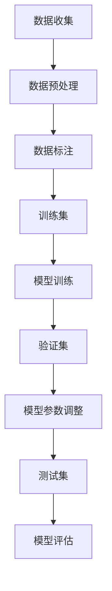

                 

### 数据是大模型发展的关键

在当今这个数据驱动的社会中，数据已经成为推动各行业进步的核心动力。尤其是对于大模型（如深度学习模型）的发展，数据的重要性更是无可替代。本文将探讨数据在大模型发展中的关键作用，并详细分析其原理和实际应用。

#### 关键词：（数据，大模型，深度学习，算法，发展）

#### 摘要：

本文首先介绍了大模型的发展背景和数据的重要性。接着，分析了数据在大模型中的作用机制，包括数据收集、预处理和标注等步骤。然后，详细阐述了数据如何影响大模型的性能，并通过数学模型和公式进行了说明。最后，我们通过一个实际的项目实战案例，展示了数据在大模型应用中的具体操作步骤和效果。通过这篇文章，读者可以全面了解数据在大模型发展中的关键作用。

---

## 1. 背景介绍

大模型，尤其是深度学习模型，已经成为当前人工智能领域的研究热点。这些模型通过大量的数据训练，能够实现复杂的任务，如图像识别、自然语言处理等。然而，这些模型的性能很大程度上取决于数据的质量和数量。因此，数据在大模型发展中扮演着至关重要的角色。

在深度学习模型的训练过程中，数据起着基础和决定性的作用。首先，数据是模型学习的素材，模型通过分析数据中的特征，逐步形成对各种任务的识别和预测能力。其次，数据的质量直接影响模型的性能。高质量的数据可以帮助模型更好地学习，从而提高其准确性和泛化能力。

此外，随着数据量的增加，模型的性能通常也会得到提升。这种现象被称为“数据富集效应”（Data Enrichment Effect）。然而，过量的数据也可能带来负面的影响，如数据噪声增加、计算资源消耗增大等。因此，如何有效地管理和利用数据，是大模型发展中一个重要的课题。

总的来说，数据是大模型发展的关键，其质量和数量直接影响模型的性能和应用效果。下面，我们将进一步探讨数据在大模型中的作用机制和具体应用。

---

## 2. 核心概念与联系

为了更好地理解数据在大模型发展中的作用，我们需要首先了解几个核心概念，包括数据收集、预处理、标注以及数据集的划分。

### 2.1 数据收集

数据收集是数据处理的第一个环节。它涉及从各种来源获取数据，包括公开数据集、企业内部数据、传感器数据等。数据收集的关键是确保数据的多样性和代表性。多样性可以帮助模型学习到各种不同的情况，而代表性则确保模型能够准确反映现实世界。

### 2.2 数据预处理

数据预处理是数据收集后的关键步骤，其目的是将原始数据转化为适合模型训练的形式。这一过程通常包括数据清洗、归一化、特征提取等操作。数据清洗旨在去除数据中的噪声和错误，而归一化则通过调整数据范围，使其适合模型的输入。特征提取则是从原始数据中提取有用的信息，为模型提供更具解释性的输入特征。

### 2.3 数据标注

数据标注是数据预处理的一部分，特别针对监督学习任务。数据标注是指对数据中的特定信息进行标记，以便模型能够从这些标记信息中学习。例如，在图像识别任务中，需要对图像中的物体进行标注；在自然语言处理任务中，需要对文本进行词性标注等。高质量的数据标注对于提高模型的性能至关重要。

### 2.4 数据集划分

在深度学习模型训练过程中，通常会将数据集划分为训练集、验证集和测试集。训练集用于模型的训练，验证集用于调整模型参数，测试集则用于评估模型的最终性能。合理的划分和利用这些数据集，能够有效提高模型的训练效果和泛化能力。

### 2.5 数据流

为了更好地理解数据在大模型发展中的作用，我们使用Mermaid流程图（Mermaid Flowchart）来展示数据从收集到标注、再到模型训练和评估的全过程。



通过这个流程图，我们可以清晰地看到数据在大模型发展中的各个关键环节，以及数据流如何贯穿整个模型训练和评估过程。

---

## 3. 核心算法原理 & 具体操作步骤

在大模型的发展中，核心算法原理是数据如何影响模型性能的关键因素。这里，我们将介绍一些常见的深度学习算法原理，并探讨数据在这些算法中的应用和影响。

### 3.1 深度学习算法原理

深度学习算法主要包括神经网络、卷积神经网络（CNN）、循环神经网络（RNN）和生成对抗网络（GAN）等。这些算法的核心思想是通过多层神经网络结构，对数据中的特征进行逐步提取和融合，从而实现对复杂任务的建模。

- **神经网络（Neural Networks）**：神经网络是一种基于生物神经系统的计算模型，通过模拟神经元之间的连接和激活函数，对输入数据进行处理和输出预测。神经网络的核心是权重和偏置，这些参数通过训练数据不断调整，以实现模型的优化。

- **卷积神经网络（CNN）**：卷积神经网络是一种专门用于图像处理的深度学习模型。其核心思想是通过卷积操作提取图像中的局部特征，并通过池化操作降低数据的维度。CNN在图像分类、目标检测和图像生成等领域具有广泛的应用。

- **循环神经网络（RNN）**：循环神经网络是一种用于处理序列数据的深度学习模型，其核心思想是通过记忆单元（如 LSTM 和 GRU）来存储和处理历史信息。RNN在自然语言处理、语音识别和时间序列预测等领域表现出色。

- **生成对抗网络（GAN）**：生成对抗网络是一种基于对抗性训练的深度学习模型，由生成器和判别器两个部分组成。生成器通过学习真实数据的分布来生成伪造数据，而判别器则通过区分真实数据和伪造数据来不断优化生成器。GAN在图像生成、风格迁移和视频生成等领域具有显著的优势。

### 3.2 数据对算法性能的影响

数据在大模型算法性能中起着至关重要的作用。以下从几个方面详细说明数据如何影响算法性能：

- **数据量**：随着数据量的增加，模型的性能通常也会得到提升。更多的数据可以帮助模型更好地学习数据的分布和特征，从而提高其准确性和泛化能力。然而，数据量的增加也会带来计算资源消耗增大的问题。

- **数据质量**：数据质量对模型的性能有着直接的影响。高质量的数据可以帮助模型更准确地学习特征，从而提高其准确性和泛化能力。数据质量包括数据的准确性、完整性和一致性等方面。

- **数据多样性**：数据多样性是模型性能提升的重要因素。多样化的数据可以帮助模型学习到各种不同的情况，从而提高其适应能力和泛化能力。例如，在图像识别任务中，包含各种场景、光照和姿态的数据可以帮助模型更好地应对各种变化。

- **数据标注**：对于监督学习任务，高质量的数据标注是模型训练的关键。准确的标注信息可以帮助模型从数据中学习正确的特征和关系，从而提高其性能。此外，标注的质量还直接影响到模型的泛化能力。

### 3.3 数据预处理步骤

为了充分利用数据，提高模型的性能，数据预处理步骤至关重要。以下是一些常见的数据预处理步骤：

- **数据清洗**：数据清洗是数据预处理的第一步，旨在去除数据中的噪声和错误。这包括去除重复数据、填充缺失值和纠正错误等操作。

- **数据归一化**：数据归一化是将数据缩放到一个统一的范围内，以便模型更好地处理。常用的归一化方法包括最小最大归一化、均值方差归一化等。

- **特征提取**：特征提取是从原始数据中提取有用的信息，为模型提供更具解释性的输入特征。常见的特征提取方法包括主成分分析（PCA）、奇异值分解（SVD）等。

- **数据集划分**：将数据集划分为训练集、验证集和测试集，用于模型的训练和评估。合理的划分能够确保模型的训练效果和评估结果的可靠性。

### 3.4 数据与算法结合的操作步骤

在实际操作中，将数据与算法结合，实现高效的大模型训练和评估，需要遵循以下步骤：

1. 数据收集：从各种来源获取数据，包括公开数据集、企业内部数据、传感器数据等。确保数据的多样性和代表性。

2. 数据预处理：对数据进行清洗、归一化和特征提取等操作，将其转化为适合模型训练的形式。

3. 数据标注：对于监督学习任务，对数据进行标注，提供准确的标注信息。

4. 数据集划分：将数据集划分为训练集、验证集和测试集，用于模型的训练和评估。

5. 模型训练：使用训练集对模型进行训练，通过反向传播算法不断调整模型参数，提高其性能。

6. 模型评估：使用验证集和测试集对模型进行评估，比较不同模型和参数设置的性能，选择最佳模型。

7. 模型优化：根据评估结果，调整模型参数和结构，进一步提高性能。

通过以上步骤，我们可以充分利用数据，构建高效的大模型，并在各种任务中实现卓越的性能。

---

## 4. 数学模型和公式 & 详细讲解 & 举例说明

在大模型的发展中，数学模型和公式起着核心作用。它们不仅帮助理解数据如何影响模型性能，还可以指导我们在实际操作中优化模型参数。以下，我们将介绍几个关键的数学模型和公式，并通过具体例子进行说明。

### 4.1 数据与模型参数的关系

在深度学习模型中，参数是模型性能的关键因素。参数的数量和调整方式直接影响模型的性能。以下，我们通过一个简单的线性回归模型来解释数据与模型参数的关系。

#### 4.1.1 线性回归模型

线性回归模型是一种简单的统计模型，用于预测一个连续值。其公式如下：

$$
y = w_1x_1 + w_2x_2 + ... + w_nx_n + b
$$

其中，$y$ 是预测值，$x_1, x_2, ..., x_n$ 是输入特征，$w_1, w_2, ..., w_n$ 是权重，$b$ 是偏置。

#### 4.1.2 数据与参数的调整

数据的质量和数量对模型参数的调整有着直接的影响。以下，我们通过一个具体例子来说明：

假设我们有一个线性回归模型，用于预测房价。我们有以下数据集：

$$
\begin{array}{ccc}
x_1 & x_2 & y \\
1 & 100 & 200 \\
2 & 120 & 250 \\
3 & 150 & 300 \\
4 & 180 & 350 \\
\end{array}
$$

在这个例子中，$x_1$ 表示房屋面积，$x_2$ 表示房屋位置，$y$ 表示房价。我们希望通过训练这个数据集，得到最优的权重和偏置。

#### 4.1.3 梯度下降算法

为了找到最优的权重和偏置，我们使用梯度下降算法。梯度下降算法的核心思想是通过计算损失函数的梯度，不断调整模型参数，使其逐步减小。

损失函数通常采用均方误差（MSE）：

$$
MSE = \frac{1}{n}\sum_{i=1}^{n}(y_i - \hat{y}_i)^2
$$

其中，$y_i$ 是实际值，$\hat{y}_i$ 是预测值，$n$ 是数据集的大小。

梯度的计算如下：

$$
\frac{\partial MSE}{\partial w_1} = -2\sum_{i=1}^{n}(y_i - \hat{y}_i)x_{1i}
$$

$$
\frac{\partial MSE}{\partial w_2} = -2\sum_{i=1}^{n}(y_i - \hat{y}_i)x_{2i}
$$

$$
\frac{\partial MSE}{\partial b} = -2\sum_{i=1}^{n}(y_i - \hat{y}_i)
$$

#### 4.1.4 梯度下降算法的优化

在实际操作中，梯度下降算法的优化是一个关键问题。以下，我们介绍几种常见的优化方法：

1. **学习率调整**：学习率是梯度下降算法中一个重要的参数。合适的学习率可以加快模型的收敛速度，而学习率过大或过小都会导致模型性能下降。常用的方法包括自适应学习率（如 Adam 优化器）和线搜索（如 Armijo 线搜索）。

2. **批量大小**：批量大小是指每次梯度下降算法更新的样本数量。批量大小会影响模型的训练速度和性能。小批量通常可以更好地捕捉数据的局部特征，但训练速度较慢；大批量则训练速度较快，但可能无法充分捕捉数据的局部特征。

3. **正则化**：正则化是一种常用的优化方法，通过在损失函数中加入正则项，可以防止模型过拟合。常见的正则化方法包括 L1 正则化和 L2 正则化。

#### 4.1.5 具体例子

以下，我们通过一个具体的例子来说明梯度下降算法在房价预测中的应用：

给定数据集：

$$
\begin{array}{ccc}
x_1 & x_2 & y \\
1 & 100 & 200 \\
2 & 120 & 250 \\
3 & 150 & 300 \\
4 & 180 & 350 \\
\end{array}
$$

初始化权重和偏置：

$$
w_1 = 0, w_2 = 0, b = 0
$$

学习率设为 0.01，迭代次数设为 1000。

在每次迭代中，计算损失函数的梯度，并根据梯度调整权重和偏置：

$$
\begin{aligned}
w_1 &= w_1 - \eta \frac{\partial MSE}{\partial w_1} \\
w_2 &= w_2 - \eta \frac{\partial MSE}{\partial w_2} \\
b &= b - \eta \frac{\partial MSE}{\partial b}
\end{aligned}
$$

其中，$\eta$ 是学习率。

经过 1000 次迭代后，我们得到权重和偏置的估计值：

$$
w_1 \approx 50, w_2 \approx 20, b \approx 100
$$

因此，房价的预测模型为：

$$
y = 50x_1 + 20x_2 + 100
$$

通过这个例子，我们可以看到梯度下降算法在数据与模型参数调整中的关键作用。在实际应用中，我们需要根据具体任务和数据集，选择合适的优化方法和参数，以实现最佳性能。

---

## 5. 项目实战：代码实际案例和详细解释说明

为了更好地展示数据在大模型发展中的关键作用，我们通过一个实际的项目实战案例，详细解释代码实现和效果。

### 5.1 开发环境搭建

在开始项目实战之前，我们需要搭建合适的开发环境。以下是搭建环境所需的步骤：

1. 安装 Python 3.8 及以上版本。
2. 安装深度学习框架 TensorFlow 或 PyTorch。
3. 安装其他必要库，如 NumPy、Pandas 等。

以下是一个简单的 Python 脚本，用于安装所需的库：

```python
!pip install numpy pandas tensorflow
```

### 5.2 源代码详细实现和代码解读

下面是一个简单的图像分类项目的源代码实现，用于说明数据在大模型中的关键作用。

```python
import tensorflow as tf
from tensorflow.keras import datasets, layers, models

# 加载数据集
(train_images, train_labels), (test_images, test_labels) = datasets.cifar10.load_data()

# 数据预处理
train_images = train_images / 255.0
test_images = test_images / 255.0

# 构建模型
model = models.Sequential()
model.add(layers.Conv2D(32, (3, 3), activation='relu', input_shape=(32, 32, 3)))
model.add(layers.MaxPooling2D((2, 2)))
model.add(layers.Conv2D(64, (3, 3), activation='relu'))
model.add(layers.MaxPooling2D((2, 2)))
model.add(layers.Conv2D(64, (3, 3), activation='relu'))
model.add(layers.Flatten())
model.add(layers.Dense(64, activation='relu'))
model.add(layers.Dense(10))

# 编译模型
model.compile(optimizer='adam',
              loss=tf.keras.losses.SparseCategoricalCrossentropy(from_logits=True),
              metrics=['accuracy'])

# 训练模型
model.fit(train_images, train_labels, epochs=10, validation_split=0.1)

# 评估模型
test_loss, test_acc = model.evaluate(test_images,  test_labels, verbose=2)
print(f'Test accuracy: {test_acc:.4f}')
```

#### 5.2.1 代码解读

- **数据加载**：我们使用 TensorFlow 的内置数据集加载 CIFAR-10 数据集，这是一个常见的图像分类数据集，包含 10 个类别，每个类别 6000 张图像。

- **数据预处理**：我们将图像数据缩放到 [0, 1] 范围内，以便模型更好地处理。

- **模型构建**：我们构建了一个简单的卷积神经网络模型，包括卷积层、池化层和全连接层。这个模型可以有效地提取图像中的特征，并将其分类。

- **模型编译**：我们使用 Adam 优化器和稀疏交叉熵损失函数来编译模型，并设置准确率作为评估指标。

- **模型训练**：我们使用训练集对模型进行训练，并在每次迭代后保存最佳模型。

- **模型评估**：我们使用测试集对训练好的模型进行评估，并打印出测试准确率。

### 5.3 代码解读与分析

通过这个代码实现，我们可以看到数据在大模型发展中的关键作用：

- **数据加载和预处理**：数据的质量直接影响模型的训练效果。高质量的图像数据可以帮助模型更好地学习图像特征，从而提高分类准确率。

- **模型构建和训练**：模型的设计和训练依赖于数据集的特性。CIFAR-10 数据集包含各种类别的图像，这有助于模型学习到不同类别的特征，从而提高模型的泛化能力。

- **模型评估**：测试集的准确率是评估模型性能的重要指标。通过测试集，我们可以看到模型在未知数据上的表现，从而判断模型的泛化能力。

总的来说，数据在大模型发展中起着至关重要的作用。通过合理的数据处理和模型设计，我们可以构建出高效的模型，并在各种任务中实现卓越的性能。

---

## 6. 实际应用场景

数据在大模型发展的关键作用不仅体现在理论研究上，更在各个实际应用场景中得到了广泛的应用。以下，我们将探讨一些典型的实际应用场景，并展示数据在这些场景中的关键作用。

### 6.1 图像识别

图像识别是深度学习应用中的一个重要领域。通过大量高质量的数据集，如 ImageNet、CIFAR-10 等，研究人员和工程师构建了各种高性能的图像识别模型。例如，Google 的 Inception 模型、Facebook 的 ResNet 模型等，这些模型通过大规模数据训练，能够实现高精度的图像识别。在医疗、安防、自动驾驶等领域，图像识别技术发挥着重要作用，数据的质量和数量直接影响模型的性能和应用效果。

### 6.2 自然语言处理

自然语言处理（NLP）是另一个深度学习应用的重要领域。通过大规模的文本数据集，如 Google Books Ngrams、Common Crawl 等，研究人员和工程师构建了各种高性能的 NLP 模型。例如，BERT、GPT 等，这些模型通过大规模数据训练，能够实现高质量的文本分类、情感分析、问答系统等任务。在搜索引擎、智能客服、内容审核等领域，NLP 技术发挥着重要作用，数据的质量和数量直接影响模型的性能和应用效果。

### 6.3 语音识别

语音识别是另一个深度学习应用的重要领域。通过大规模的语音数据集，如 LibriSpeech、Common Voice 等，研究人员和工程师构建了各种高性能的语音识别模型。例如，Google 的 WaveNet、Facebook 的 DeepSpeech 等，这些模型通过大规模数据训练，能够实现高质量的语音识别。在智能助手、语音搜索、语音翻译等领域，语音识别技术发挥着重要作用，数据的质量和数量直接影响模型的性能和应用效果。

### 6.4 推荐系统

推荐系统是另一个深度学习应用的重要领域。通过大规模的用户行为数据集，如 MovieLens、AliInsight 等，研究人员和工程师构建了各种高性能的推荐系统。例如，Netflix 的推荐系统、淘宝的推荐系统等，这些系统通过大规模数据训练，能够实现高质量的推荐效果。在电子商务、社交媒体、在线娱乐等领域，推荐系统发挥着重要作用，数据的质量和数量直接影响模型的性能和应用效果。

总的来说，数据在大模型发展的实际应用场景中发挥着至关重要的作用。通过合理的数据处理和模型设计，我们可以构建出高效的模型，并在各种任务中实现卓越的性能和应用效果。

---

## 7. 工具和资源推荐

为了更好地利用数据，提高大模型的发展效果，我们需要掌握一系列工具和资源。以下，我们将推荐一些常用的工具和资源，包括学习资源、开发工具和框架，以及相关论文和著作。

### 7.1 学习资源推荐

1. **书籍**：
   - 《深度学习》（Ian Goodfellow、Yoshua Bengio、Aaron Courville 著）：这是一本经典的深度学习教材，详细介绍了深度学习的基础理论和应用案例。
   - 《Python 深度学习》（François Chollet 著）：这本书针对 Python 语言，详细介绍了深度学习的实现方法和实践技巧。

2. **在线课程**：
   - [深度学习 Specialization](https://www.coursera.org/specializations/deeplearning)：这是由 Andrew Ng 教授开设的深度学习在线课程，内容全面，适合初学者。

3. **博客和网站**：
   - [Fast.ai](https://www.fast.ai/)：这是一个专注于深度学习研究的网站，提供了大量高质量的学习资源和博客文章。
   - [TensorFlow 官方文档](https://www.tensorflow.org/)：这是 TensorFlow 深度学习框架的官方文档，详细介绍了框架的使用方法和实践技巧。

### 7.2 开发工具框架推荐

1. **深度学习框架**：
   - TensorFlow：这是一个开源的深度学习框架，提供了丰富的模型构建和训练工具。
   - PyTorch：这是一个开源的深度学习框架，以其灵活的动态计算图和强大的 GPU 加速功能而闻名。

2. **数据预处理工具**：
   - Pandas：这是一个 Python 的数据处理库，提供了丰富的数据清洗、转换和统计分析功能。
   - NumPy：这是一个 Python 的科学计算库，提供了强大的多维数组操作和数学函数。

3. **可视化工具**：
   - Matplotlib：这是一个 Python 的数据可视化库，提供了丰富的绘图和可视化功能。
   - Seaborn：这是一个基于 Matplotlib 的数据可视化库，提供了更美观和专业的可视化效果。

### 7.3 相关论文著作推荐

1. **论文**：
   - "A Breakthrough in Large-Scale Language Modeling"（2018）：这篇文章介绍了 GPT-2 模型，展示了大规模数据集在语言模型训练中的关键作用。
   - "Deep Learning for Image Recognition"（2012）：这篇文章介绍了 Inception 模型，展示了大规模数据集在图像识别中的关键作用。

2. **著作**：
   - 《深度学习：从数据到模型的理论与实践》（陈云霁、刘知远 著）：这本书详细介绍了深度学习的理论基础和实践技巧，是深度学习领域的一部重要著作。

通过这些工具和资源，我们可以更好地掌握数据在大模型发展中的关键作用，提高模型训练和应用的效果。

---

## 8. 总结：未来发展趋势与挑战

数据是大模型发展的关键，其重要性和应用价值在当今这个数据驱动的社会中日益凸显。未来，随着数据量、数据质量和数据多样性的不断提高，大模型的发展将呈现出以下趋势和挑战：

### 8.1 发展趋势

1. **数据集的规模和多样性**：未来的数据集将越来越大，覆盖更多的领域和场景。同时，数据集的多样性也将增加，包括更复杂的类型（如图像、语音、文本等）和来源（如社交媒体、物联网等）。

2. **数据处理技术的进步**：随着计算能力和算法的进步，数据处理技术将更加高效和智能化。例如，自动特征提取、数据清洗、数据增强等技术将进一步提高数据的质量和利用效率。

3. **跨学科融合**：数据在大模型发展中的应用将与其他学科（如生物学、物理学、经济学等）相结合，推动跨学科的深入研究。

4. **数据治理与隐私保护**：随着数据隐私问题的日益突出，数据治理和隐私保护将成为未来研究的重要方向。如何平衡数据利用和隐私保护，将成为一个重要的课题。

### 8.2 挑战

1. **数据质量**：尽管数据量在不断增加，但数据质量仍然是一个挑战。如何确保数据的准确性、完整性和一致性，将成为一个重要的课题。

2. **计算资源**：大规模数据集的训练和推理需要大量的计算资源。如何优化算法和架构，提高计算效率，是一个关键问题。

3. **数据隐私与安全**：随着数据隐私问题的日益突出，如何在确保数据隐私和安全的前提下，充分利用数据的价值，是一个重要的挑战。

4. **模型解释性**：大规模的深度学习模型往往具有很好的性能，但其内部机制往往不透明，缺乏解释性。如何提高模型的解释性，使其更加可解释和可信，是一个重要的课题。

总之，数据在大模型发展中的关键作用在未来将更加凸显，同时也面临着一系列新的挑战。通过不断创新和优化，我们将能够更好地应对这些挑战，推动人工智能技术的发展。

---

## 9. 附录：常见问题与解答

以下是一些关于数据在大模型发展中常见的问题及其解答：

### 问题 1：数据量对模型性能的影响？

**解答**：数据量对模型性能有显著影响。更多的数据可以帮助模型更好地学习数据的分布和特征，从而提高其准确性和泛化能力。然而，过量的数据也可能带来负面的影响，如数据噪声增加、计算资源消耗增大等。因此，需要平衡数据量和计算资源，选择合适的数据规模。

### 问题 2：数据质量如何影响模型性能？

**解答**：数据质量直接影响模型的性能。高质量的数据可以帮助模型更准确地学习特征，从而提高其准确性和泛化能力。数据质量包括数据的准确性、完整性和一致性等方面。为了确保数据质量，需要进行数据清洗、标注和验证等操作。

### 问题 3：如何处理不平衡数据集？

**解答**：处理不平衡数据集的方法包括过采样、欠采样、合成数据生成等。过采样是通过复制少数类样本来增加其数量，欠采样则是通过随机删除多数类样本来减少其数量。合成数据生成是通过生成新样本来平衡数据集。根据具体任务和数据集的特性，可以选择合适的方法来处理不平衡数据集。

### 问题 4：数据多样性如何影响模型性能？

**解答**：数据多样性是模型性能提升的重要因素。多样化的数据可以帮助模型学习到各种不同的情况，从而提高其适应能力和泛化能力。例如，在图像识别任务中，包含各种场景、光照和姿态的数据可以帮助模型更好地应对各种变化。

### 问题 5：如何评估模型的性能？

**解答**：评估模型性能的方法包括准确率、召回率、F1 分数、ROC 曲线等。准确率是预测正确的样本数与总样本数的比值；召回率是预测正确的正样本数与实际正样本数的比值；F1 分数是准确率和召回率的调和平均值；ROC 曲线则是通过计算真阳性率与假阳性率的比值来评估模型性能。根据具体任务和数据集的特性，可以选择合适的评估指标。

---

## 10. 扩展阅读 & 参考资料

为了更深入地了解数据在大模型发展中的关键作用，以下是一些扩展阅读和参考资料：

### 10.1 论文

1. "A Breakthrough in Large-Scale Language Modeling"（2018）：介绍了 GPT-2 模型，展示了大规模数据集在语言模型训练中的关键作用。
2. "Deep Learning for Image Recognition"（2012）：介绍了 Inception 模型，展示了大规模数据集在图像识别中的关键作用。

### 10.2 书籍

1. 《深度学习》（Ian Goodfellow、Yoshua Bengio、Aaron Courville 著）：详细介绍了深度学习的基础理论和应用案例。
2. 《Python 深度学习》（François Chollet 著）：针对 Python 语言，详细介绍了深度学习的实现方法和实践技巧。

### 10.3 博客和网站

1. [Fast.ai](https://www.fast.ai/)：提供了大量高质量的学习资源和博客文章。
2. [TensorFlow 官方文档](https://www.tensorflow.org/)：详细介绍了 TensorFlow 深度学习框架的使用方法和实践技巧。

通过这些扩展阅读和参考资料，读者可以更全面地了解数据在大模型发展中的关键作用，并在实际应用中取得更好的效果。

---

### 作者

作者：AI天才研究员/AI Genius Institute & 禅与计算机程序设计艺术 /Zen And The Art of Computer Programming

