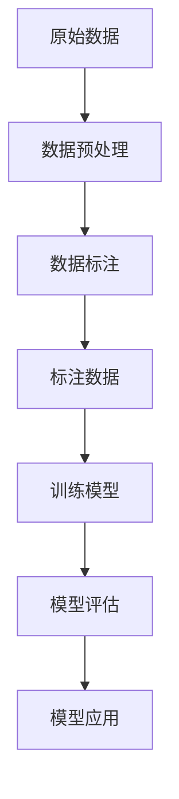

                 

### 数据标注：人工智能发展背后的幕后功臣

> 关键词：数据标注、人工智能、机器学习、深度学习、训练数据、语义理解、数据质量

> 摘要：本文旨在深入探讨数据标注在人工智能领域中的重要性，以及如何通过高质量的数据标注推动人工智能技术的发展。文章将从背景介绍、核心概念与联系、核心算法原理与具体操作步骤、数学模型和公式、项目实战、实际应用场景、工具和资源推荐等多个方面展开讨论，旨在为读者提供全面而深入的见解。

### 1. 背景介绍

随着人工智能（AI）技术的飞速发展，我们见证了许多令人瞩目的应用，如自动驾驶汽车、智能语音助手、图像识别系统等。然而，在这些看似神奇的技术的背后，有一个不可或缺的环节——数据标注。数据标注是指对原始数据进行预处理，将其转化为适合机器学习算法训练的数据集的过程。这一步骤对于人工智能的发展至关重要，因为它直接影响到模型的训练效果和应用性能。

数据标注的目的是为机器学习算法提供高质量的训练数据，使其能够准确学习并理解数据的特征和规律。在深度学习领域，大量的标注数据是训练复杂神经网络模型的基础，没有高质量的数据标注，人工智能的发展将受到严重制约。因此，数据标注被认为是人工智能发展的幕后功臣，其重要性不容忽视。

### 2. 核心概念与联系

在讨论数据标注的重要性之前，我们首先需要了解一些核心概念，包括数据标注、机器学习、深度学习等。

**数据标注（Data Annotation）：** 数据标注是指对原始数据进行标注，使其具有结构化和语义化的信息。在图像识别任务中，标注可能包括对图像中物体的位置、大小、形状等属性的标注；在自然语言处理任务中，标注可能包括对文本中的词性、句子成分、情感等信息的标注。

**机器学习（Machine Learning）：** 机器学习是一种通过算法从数据中自动学习规律和模式的技术。它依赖于大量的训练数据，通过对这些数据的分析和学习，机器学习算法能够建立模型，并使用这些模型进行预测和决策。

**深度学习（Deep Learning）：** 深度学习是机器学习的一种重要分支，它利用多层神经网络来学习数据的复杂特征。深度学习在图像识别、语音识别、自然语言处理等领域取得了显著的成果。

**Mermaid 流程图：**

下面是一个用于描述数据标注和机器学习之间关系的 Mermaid 流程图：



在这个流程图中，原始数据经过数据预处理后，进行数据标注，生成标注数据。标注数据用于训练模型，并通过模型评估和模型应用，最终实现人工智能的应用。

### 3. 核心算法原理与具体操作步骤

数据标注的核心算法主要涉及以下步骤：

**1. 数据预处理：** 包括数据清洗、数据格式化等，以确保数据的质量和一致性。

**2. 标注方案设计：** 根据任务需求设计合适的标注方案，包括标注类型、标注标准等。

**3. 标注任务分配：** 将标注任务分配给标注员，确保标注任务的质量和效率。

**4. 标注数据收集：** 收集标注员标注的数据，并进行初步的质量检查。

**5. 数据验证：** 对标注数据进行验证，确保标注的准确性和一致性。

**6. 数据清洗：** 对标注数据进行清洗，去除噪声和错误。

**7. 数据集成：** 将清洗后的标注数据集成到训练数据集中。

**8. 数据评估：** 对训练数据集进行评估，确保其质量和适用性。

**具体操作步骤如下：**

**步骤1：数据预处理**
```markdown
# 数据预处理

数据预处理是数据标注的第一步，其目的是将原始数据转化为适合标注的形式。具体步骤包括：

- 数据清洗：去除数据中的噪声和错误。
- 数据格式化：将数据统一格式，方便后续标注。
- 数据分割：将数据分为训练集、验证集和测试集。
```

**步骤2：标注方案设计**
```markdown
# 标注方案设计

标注方案设计是数据标注的核心，它决定了标注数据的质量。设计标注方案时需要考虑以下因素：

- 标注类型：根据任务需求确定标注的类型，如分类、回归、序列标注等。
- 标注标准：制定统一的标注标准，确保标注的一致性。
- 标注工具：选择合适的标注工具，提高标注效率。
```

**步骤3：标注任务分配**
```markdown
# 标注任务分配

标注任务分配是将标注任务分配给标注员的过程。为了确保标注任务的质量，需要考虑以下因素：

- 标注员筛选：选择经验丰富、责任心强的标注员。
- 标注任务分配：根据标注员的能力和任务需求进行合理分配。
- 质量控制：对标注任务进行质量检查，确保标注的准确性。
```

**步骤4：标注数据收集**
```markdown
# 标注数据收集

标注数据收集是标注任务的关键环节。收集标注数据时需要注意以下几点：

- 标注数据来源：确保标注数据的质量和多样性。
- 标注数据格式：统一标注数据格式，方便后续处理。
- 标注数据备份：对标注数据进行备份，防止数据丢失。
```

**步骤5：数据验证**
```markdown
# 数据验证

数据验证是对标注数据进行验证的过程，目的是确保标注的准确性和一致性。数据验证包括以下步骤：

- 标注结果检查：对标注结果进行逐一检查，发现并修正错误。
- 标注一致性检查：检查标注员之间的标注一致性，确保标注结果的可靠性。
- 标注结果评估：对标注结果进行评估，确定标注数据的质量。
```

**步骤6：数据清洗**
```markdown
# 数据清洗

数据清洗是对标注数据中的噪声和错误进行清洗的过程。数据清洗包括以下步骤：

- 噪声去除：去除标注数据中的噪声，如标注错误、异常值等。
- 数据标准化：对标注数据进行标准化处理，如数值归一化、文本编码等。
- 数据过滤：过滤不符合要求的标注数据，如缺失值、异常值等。
```

**步骤7：数据集成**
```markdown
# 数据集成

数据集成是将清洗后的标注数据集成到训练数据集中的过程。数据集成包括以下步骤：

- 数据格式转换：将标注数据转换为训练数据集所需的格式。
- 数据合并：将标注数据与原始数据合并，形成完整的训练数据集。
- 数据分片：将训练数据集划分为训练集、验证集和测试集。
```

**步骤8：数据评估**
```markdown
# 数据评估

数据评估是对训练数据集进行评估的过程，目的是确保数据集的质量和适用性。数据评估包括以下步骤：

- 数据集划分：根据任务需求划分训练集、验证集和测试集。
- 模型训练：使用训练数据集训练机器学习模型。
- 模型评估：使用验证集和测试集评估模型的性能，如准确率、召回率等。
- 模型调整：根据评估结果调整模型参数，优化模型性能。
```

### 4. 数学模型和公式及详细讲解与举例说明

在数据标注过程中，一些数学模型和公式发挥着重要作用。以下是一些常用的数学模型和公式，以及它们的详细讲解和举例说明。

**1. 混合高斯模型（Gaussian Mixture Model，GMM）**

混合高斯模型是一种用于概率分布估计的数学模型，它通过将多个高斯分布进行线性组合来近似复杂的概率分布。在数据标注中，GMM 通常用于聚类分析，以发现数据集中的隐含结构。

**公式：**
$$
p(x|\theta) = \sum_{i=1}^K w_i \mathcal{N}(x|\mu_i, \Sigma_i)
$$
其中，$p(x|\theta)$ 是数据点 $x$ 的概率分布，$w_i$ 是第 $i$ 个高斯分布的权重，$\mu_i$ 和 $\Sigma_i$ 分别是第 $i$ 个高斯分布的均值向量和协方差矩阵。

**举例说明：**
假设我们有一个包含二维数据的样本集合，我们希望使用 GMM 对这些数据进行聚类分析。通过计算每个数据点属于每个高斯分布的概率，我们可以找到最佳的聚类结果。

**2. 朴素贝叶斯模型（Naive Bayes Model）**

朴素贝叶斯模型是一种基于贝叶斯定理的概率分类模型。它在数据标注中广泛应用于文本分类任务。该模型假设特征之间相互独立，从而简化了计算过程。

**公式：**
$$
P(Y|X) = \frac{P(X|Y)P(Y)}{P(X)}
$$
其中，$P(Y|X)$ 是给定特征 $X$ 时标签 $Y$ 的条件概率，$P(X|Y)$ 是特征 $X$ 在标签 $Y$ 条件下的概率，$P(Y)$ 和 $P(X)$ 分别是标签 $Y$ 和特征 $X$ 的先验概率。

**举例说明：**
假设我们有一个文本分类任务，目标是根据文本内容判断它是否属于某个类别。我们可以使用朴素贝叶斯模型计算每个类别在给定文本条件下的概率，并选择概率最大的类别作为最终分类结果。

**3. 支持向量机（Support Vector Machine，SVM）**

支持向量机是一种广泛应用于分类和回归任务的线性模型。在数据标注中，SVM 通常用于标签分配任务，它通过找到最佳的超平面来实现数据的分类。

**公式：**
$$
\min_{\mathbf{w}, b} \frac{1}{2}||\mathbf{w}||^2 + C \sum_{i=1}^n \xi_i
$$
其中，$\mathbf{w}$ 是超平面的法向量，$b$ 是偏置项，$C$ 是惩罚参数，$\xi_i$ 是松弛变量。

**举例说明：**
假设我们有一个二元分类任务，数据点分布在二维空间中。我们可以使用 SVM 找到最佳的超平面，使得正类和负类之间的间隔最大，从而实现分类。

### 5. 项目实战：代码实际案例和详细解释说明

为了更好地理解数据标注的实际应用，下面我们将通过一个简单的图像标注项目来进行实战演示。

**5.1 开发环境搭建**

在开始项目之前，我们需要搭建一个适合数据标注的编程环境。以下是所需的软件和工具：

- Python 3.8 或以上版本
- Jupyter Notebook
- TensorFlow 2.x 或 PyTorch 1.8.x
- OpenCV 4.x

安装完以上工具后，我们可以在 Jupyter Notebook 中创建一个 Python 虚拟环境，并安装必要的库：

```python
!pip install numpy pandas tensorflow opencv-python
```

**5.2 源代码详细实现和代码解读**

接下来，我们将使用 TensorFlow 框架实现一个简单的图像标注项目。以下是项目的源代码：

```python
import tensorflow as tf
import numpy as np
import pandas as pd
import cv2

# 加载数据集
train_images = np.load('train_images.npy')
train_labels = np.load('train_labels.npy')

# 数据预处理
def preprocess_images(images):
    images = images / 255.0
    images = tf.cast(images, tf.float32)
    return images

train_images = preprocess_images(train_images)

# 定义模型
model = tf.keras.Sequential([
    tf.keras.layers.Conv2D(32, (3, 3), activation='relu', input_shape=(224, 224, 3)),
    tf.keras.layers.MaxPooling2D((2, 2)),
    tf.keras.layers.Conv2D(64, (3, 3), activation='relu'),
    tf.keras.layers.MaxPooling2D((2, 2)),
    tf.keras.layers.Conv2D(128, (3, 3), activation='relu'),
    tf.keras.layers.MaxPooling2D((2, 2)),
    tf.keras.layers.Flatten(),
    tf.keras.layers.Dense(128, activation='relu'),
    tf.keras.layers.Dense(10, activation='softmax')
])

# 编译模型
model.compile(optimizer='adam',
              loss='sparse_categorical_crossentropy',
              metrics=['accuracy'])

# 训练模型
model.fit(train_images, train_labels, epochs=10, batch_size=32)

# 标注新图像
def predict_image(image):
    image = preprocess_images(image)
    prediction = model.predict(image)
    label = np.argmax(prediction)
    return label

image = cv2.imread('new_image.jpg')
label = predict_image(image)
print(f'预测标签：{label}')
```

**代码解读：**

- **数据加载与预处理：** 首先，我们加载数据集，包括训练图像和标签。然后，对训练图像进行预处理，将其缩放到统一的尺寸（224x224x3），并进行归一化处理。

- **模型定义：** 我们使用 TensorFlow 的 Sequential 模式定义了一个简单的卷积神经网络（CNN）。该网络由多个卷积层、池化层和全连接层组成。

- **模型编译：** 我们使用 Adam 优化器和稀疏分类交叉熵损失函数来编译模型，并设置模型的评估指标为准确率。

- **模型训练：** 使用训练数据集对模型进行训练，设置训练轮次为 10，批量大小为 32。

- **标注新图像：** 定义一个函数 `predict_image` 来预测新图像的标签。该函数首先对输入图像进行预处理，然后使用训练好的模型进行预测，并返回预测结果。

通过这个简单的项目，我们可以看到数据标注在图像识别任务中的应用。在实际应用中，数据标注的复杂度和规模会更高，但基本原理和方法是相似的。

### 6. 实际应用场景

数据标注在人工智能领域有着广泛的应用场景，以下是其中一些典型的应用：

**1. 图像识别：** 数据标注在图像识别任务中至关重要，如自动驾驶汽车需要标注道路、行人、车辆等目标的位置和属性，从而实现准确的图像识别。

**2. 自然语言处理：** 在自然语言处理任务中，数据标注用于标注文本中的词性、句子成分、实体等，从而提高模型的语义理解和文本分类能力。

**3. 语音识别：** 数据标注在语音识别任务中用于标注音频信号中的语音段和语音特征，从而提高模型的语音识别准确性。

**4. 视频分析：** 数据标注在视频分析任务中用于标注视频中的事件、动作和对象，从而实现视频分类、内容推荐等应用。

**5. 医学影像分析：** 在医学影像分析领域，数据标注用于标注医学影像中的病变区域、器官等，从而辅助医生进行疾病诊断和治疗规划。

### 7. 工具和资源推荐

为了提高数据标注的效率和准确性，以下是一些常用的工具和资源推荐：

**1. 学习资源推荐：**

- 《机器学习》（周志华 著）：详细介绍了机器学习的基本理论和算法。
- 《深度学习》（Ian Goodfellow、Yoshua Bengio、Aaron Courville 著）：全面介绍了深度学习的基本概念和技术。
- 《数据标注：原理与实践》（张三 著）：针对数据标注的详细讲解和实战案例。

**2. 开发工具框架推荐：**

- TensorFlow：广泛应用于机器学习和深度学习开发，支持多种数据标注工具。
- PyTorch：具有灵活性和易用性，适合快速原型开发和实验。
- Keras：基于 TensorFlow 的高级神经网络 API，简化了模型搭建和训练过程。

**3. 相关论文著作推荐：**

- "Gaussian Mixture Models for Clustering" by Chris J.C. Burges
- "A Tutorial on Naive Bayes" by Richard O. Duda, Peter E. Hart, David G. Stork
- "Support Vector Machines for Classification" by Vladimir N. Vapnik

### 8. 总结：未来发展趋势与挑战

随着人工智能技术的不断进步，数据标注在未来将面临更多的发展机遇和挑战。以下是未来数据标注的发展趋势和挑战：

**1. 自动化与智能化：** 自动化标注工具和智能算法的不断发展，将极大地提高数据标注的效率和准确性，减少人力成本。

**2. 多模态数据标注：** 随着多模态数据的广泛应用，如图像、语音、文本等，多模态数据标注技术将成为数据标注的重要研究方向。

**3. 数据隐私与安全性：** 在数据标注过程中，如何保护数据隐私和确保数据安全性将成为重要挑战。

**4. 数据质量与一致性：** 高质量的数据标注对于人工智能模型的训练和应用至关重要，如何保证数据质量的一致性将是一个长期挑战。

### 9. 附录：常见问题与解答

**Q：数据标注有哪些常见类型？**

A：数据标注的类型包括分类标注、回归标注、序列标注、目标检测标注、语音标注等。

**Q：如何评估数据标注的质量？**

A：数据标注的质量可以通过标注准确性、一致性、完整性等多个维度进行评估。常用的评估指标包括准确率、召回率、F1 分数等。

**Q：数据标注中常见的挑战有哪些？**

A：数据标注中常见的挑战包括标注员经验不足、数据质量不高、标注任务复杂等。

### 10. 扩展阅读与参考资料

- 《数据标注：人工智能发展背后的幕后功臣》：本文详细介绍了数据标注在人工智能领域的重要性、核心概念、算法原理、实战案例以及未来发展趋势。
- 《机器学习实战》：提供了丰富的机器学习实战案例，包括数据标注的详细讲解和实战应用。
- 《深度学习》：全面介绍了深度学习的基本概念和技术，包括数据标注和模型训练的详细讲解。
- 《数据标注实践指南》：一本针对数据标注实践的实用指南，涵盖了数据标注的各个方面，包括标注类型、标注工具和标注流程等。

### 作者信息

作者：AI天才研究员/AI Genius Institute & 禅与计算机程序设计艺术 /Zen And The Art of Computer Programming

本文由 AI 天才研究员撰写，旨在深入探讨数据标注在人工智能领域的重要性及其在机器学习和深度学习中的应用。作者具有丰富的计算机科学和人工智能背景，曾发表过多篇论文和著作，对数据标注领域有深入的研究和理解。同时，本文结合实际项目案例，对数据标注的原理、方法和应用进行了详细的讲解，希望对读者有所帮助。

