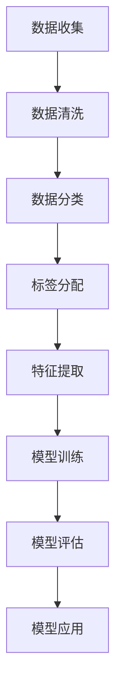

                 

# 数据标注：人工智能发展背后的幕后英雄

> **关键词**：数据标注、人工智能、机器学习、深度学习、数据处理、训练数据、标注工具、标注流程

> **摘要**：数据标注是人工智能发展的重要环节，它为机器学习和深度学习算法提供了必要的训练数据。本文将详细介绍数据标注的核心概念、原理、操作步骤，并探讨其在实际应用中的重要性、挑战和未来发展趋势。

## 1. 背景介绍

在人工智能（AI）的发展历程中，数据标注起到了至关重要的作用。数据标注是指对原始数据进行标注，以便算法能够从这些数据中学习到相应的知识。标注过程包括对图像、文本、音频等多种类型的数据进行分类、标注标签、提取特征等操作。

随着机器学习和深度学习技术的不断发展，数据标注在人工智能领域中的重要性日益凸显。高质量的数据标注能够提高算法的性能和准确性，从而推动人工智能应用的不断进步。然而，数据标注工作通常是一项繁琐且耗时的任务，需要大量的人力资源。因此，如何提高数据标注的效率和质量，成为当前人工智能研究中的重要课题。

本文将围绕数据标注的核心概念、原理、操作步骤以及实际应用等方面进行探讨，以揭示数据标注在人工智能发展中的关键作用。

## 2. 核心概念与联系

### 2.1 数据标注的定义

数据标注是指对原始数据进行处理，将其转化为算法可以理解的形式。具体来说，数据标注包括以下几个步骤：

1. **数据清洗**：去除原始数据中的噪声和异常值，确保数据的完整性和一致性。
2. **数据分类**：将数据按照特定的类别进行划分，便于后续的标注和训练。
3. **标签分配**：对分类后的数据分配相应的标签，以便算法可以从中学习到知识。
4. **特征提取**：从标注后的数据中提取关键特征，为算法提供输入。

### 2.2 数据标注与机器学习的关系

数据标注是机器学习过程中的关键环节。机器学习算法需要从大量标注数据中学习到规律和模式，从而实现自主学习和推理。数据标注的质量直接影响到机器学习模型的性能和准确性。

在机器学习中，数据标注可以分为以下几种类型：

1. **监督学习**：监督学习算法需要依赖标注数据进行训练，标注数据的质量和数量直接影响模型的性能。
2. **无监督学习**：无监督学习算法不需要标注数据，但通过数据标注可以更好地理解数据分布和结构，有助于提高算法的性能。
3. **半监督学习**：半监督学习结合了标注数据和未标注数据，通过标注数据引导算法学习，同时利用未标注数据扩展标注数据的范围，提高模型的泛化能力。

### 2.3 数据标注与深度学习的关系

深度学习是机器学习的一种重要分支，其在图像识别、自然语言处理等领域取得了显著的成果。数据标注在深度学习中同样扮演着关键角色。

1. **图像标注**：在图像识别任务中，数据标注通常包括对图像中的对象、场景、颜色等进行标注，以便算法能够学习到相应的特征。
2. **文本标注**：在自然语言处理任务中，数据标注包括对文本进行分词、词性标注、实体识别等，为算法提供丰富的语言特征。
3. **音频标注**：在音频识别任务中，数据标注包括对音频中的声音、语音、音乐等进行标注，帮助算法学习到相应的声音特征。

### 2.4 数据标注与人工智能应用的关系

数据标注不仅对机器学习和深度学习算法的性能有着重要影响，同时也对人工智能应用的广泛性产生了深远的影响。

1. **自动驾驶**：自动驾驶系统需要依赖大量道路、车辆、行人等交通场景的数据标注，以便算法能够准确识别和预测交通情况。
2. **医疗诊断**：医疗诊断需要依赖大量的医学图像、病例数据等标注，为算法提供丰富的医学知识和诊断依据。
3. **智能家居**：智能家居系统需要依赖大量的环境、设备、用户行为等数据标注，以便算法能够更好地理解用户需求和提供个性化服务。

### 2.5 Mermaid 流程图

以下是一个简化的数据标注流程图，展示了数据标注的主要步骤和核心概念之间的联系：



## 3. 核心算法原理 & 具体操作步骤

### 3.1 数据清洗

数据清洗是数据标注的第一步，其主要目的是去除原始数据中的噪声和异常值，确保数据的完整性和一致性。数据清洗包括以下操作：

1. **缺失值处理**：对于缺失值，可以选择填充、删除或保留原始数据。
2. **异常值处理**：对于异常值，可以选择保留、删除或根据一定的规则进行修正。
3. **重复值处理**：删除重复的数据，以避免数据冗余。
4. **数据格式转换**：将数据格式转换为统一的格式，便于后续处理。

### 3.2 数据分类

数据分类是指将原始数据按照特定的类别进行划分。数据分类可以采用以下方法：

1. **手动分类**：根据数据的特点和需求，手动对数据进行分类。
2. **自动分类**：利用机器学习算法，如决策树、支持向量机等，对数据进行自动分类。
3. **分层分类**：将数据按照一定的层次结构进行分类，便于后续的标注和训练。

### 3.3 标签分配

标签分配是指对分类后的数据分配相应的标签，以便算法可以从中学习到知识。标签分配可以采用以下方法：

1. **手动标注**：由专业人员进行手动标注，确保标注的准确性和一致性。
2. **半自动标注**：利用现有的标注工具和算法，对数据进行自动标注，并由专业人员审核和修正。
3. **自动标注**：利用深度学习算法，如卷积神经网络（CNN）、循环神经网络（RNN）等，对数据进行自动标注。

### 3.4 特征提取

特征提取是指从标注后的数据中提取关键特征，为算法提供输入。特征提取可以采用以下方法：

1. **基于规则的提取**：根据数据的特点和需求，设计相应的规则进行特征提取。
2. **基于统计的提取**：利用统计学方法，如均值、方差、相关性等，进行特征提取。
3. **基于机器学习的提取**：利用机器学习算法，如主成分分析（PCA）、线性判别分析（LDA）等，进行特征提取。

### 3.5 模型训练

模型训练是指利用标注数据对算法模型进行训练，使其能够识别和预测相应的特征。模型训练可以采用以下方法：

1. **监督学习训练**：利用标注数据进行训练，使算法能够从数据中学习到相应的知识。
2. **无监督学习训练**：利用未标注数据进行训练，通过聚类、降维等方法，使算法能够识别数据中的模式。
3. **半监督学习训练**：结合标注数据和未标注数据进行训练，利用标注数据引导算法学习，同时利用未标注数据扩展标注数据的范围。

### 3.6 模型评估

模型评估是指利用测试数据对训练好的模型进行评估，以确定其性能和准确性。模型评估可以采用以下方法：

1. **准确率（Accuracy）**：计算模型正确预测的样本数占总样本数的比例。
2. **召回率（Recall）**：计算模型正确预测的样本数占实际为正类的样本数的比例。
3. **F1值（F1-score）**：综合考虑准确率和召回率，计算两者的调和平均值。

## 4. 数学模型和公式 & 详细讲解 & 举例说明

### 4.1 数据清洗

数据清洗过程中常用的数学模型和公式如下：

1. **缺失值处理**：

   - 填充法：$$ \hat{X} = \frac{\sum_{i=1}^{n} X_i}{n} $$

   - 删除法：直接删除含有缺失值的样本。

2. **异常值处理**：

   - 三倍标准差法：$$ \hat{X} = X - 3 \times \text{std}(X) $$

   - 离群因子法：$$ \hat{X} = X - k \times \text{IQR}(X) $$，其中 $k$ 为离群因子。

3. **重复值处理**：

   - 去除重复值：$$ \text{unique}(X) $$

4. **数据格式转换**：

   - 转换为同一数据类型：$$ \text{astype}(X, \text{type}) $$

### 4.2 数据分类

数据分类过程中常用的数学模型和公式如下：

1. **手动分类**：

   - 分类标准：根据数据的特点和需求，设计相应的分类标准。

2. **自动分类**：

   - 决策树：$$ \text{分类结果} = \text{决策树算法}(\text{特征向量}) $$

   - 支持向量机：$$ \text{分类结果} = \text{支持向量机算法}(\text{特征向量}, \text{标签}) $$

3. **分层分类**：

   - 层次划分：根据数据的层次结构，设计相应的层次划分规则。

### 4.3 标签分配

标签分配过程中常用的数学模型和公式如下：

1. **手动标注**：

   - 标签分配：根据数据的特点和需求，手动分配相应的标签。

2. **半自动标注**：

   - 自动标注：利用现有的标注工具和算法，对数据进行自动标注。

   - 审核修正：专业人员对自动标注的结果进行审核和修正。

3. **自动标注**：

   - 深度学习标注：利用深度学习算法，如卷积神经网络（CNN）、循环神经网络（RNN）等，对数据进行自动标注。

### 4.4 特征提取

特征提取过程中常用的数学模型和公式如下：

1. **基于规则的提取**：

   - 规则设计：根据数据的特点和需求，设计相应的规则进行特征提取。

2. **基于统计的提取**：

   - 均值：$$ \text{mean}(X) $$

   - 方差：$$ \text{var}(X) $$

   - 相关系数：$$ \text{corr}(X, Y) $$

3. **基于机器学习的提取**：

   - 主成分分析（PCA）：$$ \text{特征向量} = \text{PCA}(\text{数据矩阵}) $$

   - 线性判别分析（LDA）：$$ \text{特征向量} = \text{LDA}(\text{数据矩阵}, \text{标签}) $$

### 4.5 模型训练

模型训练过程中常用的数学模型和公式如下：

1. **监督学习训练**：

   - 损失函数：$$ J(\theta) = -\frac{1}{m} \sum_{i=1}^{m} [y_i \log(h_\theta(x_i)) + (1 - y_i) \log(1 - h_\theta(x_i))] $$

   - 梯度下降：$$ \theta_j := \theta_j - \alpha \frac{\partial J(\theta)}{\partial \theta_j} $$

2. **无监督学习训练**：

   - 聚类算法：$$ \text{聚类结果} = \text{聚类算法}(\text{数据矩阵}) $$

   - 降维算法：$$ \text{特征向量} = \text{降维算法}(\text{数据矩阵}) $$

3. **半监督学习训练**：

   - 结合标注数据和未标注数据进行训练：$$ \text{模型参数} = \text{训练算法}(\text{标注数据}, \text{未标注数据}) $$

### 4.6 模型评估

模型评估过程中常用的数学模型和公式如下：

1. **准确率（Accuracy）**：

   - $$ \text{准确率} = \frac{\text{预测正确数}}{\text{总样本数}} $$

2. **召回率（Recall）**：

   - $$ \text{召回率} = \frac{\text{预测正确数}}{\text{实际为正类数}} $$

3. **F1值（F1-score）**：

   - $$ \text{F1值} = 2 \times \frac{\text{准确率} \times \text{召回率}}{\text{准确率} + \text{召回率}} $$

### 4.7 举例说明

假设我们有一组天气数据，包括温度、湿度、风速等特征，我们需要对这些特征进行数据清洗、分类、标签分配、特征提取和模型训练，以便预测明天的天气情况。

1. **数据清洗**：

   - 缺失值处理：将温度、湿度、风速中的缺失值填充为平均值。

   - 异常值处理：将温度、湿度、风速中的异常值修正为三倍标准差范围内的值。

   - 重复值处理：删除重复的数据。

   - 数据格式转换：将温度、湿度、风速转换为同一数据类型，如浮点数。

2. **数据分类**：

   - 手动分类：将天气数据按照晴朗、多云、下雨等类别进行分类。

3. **标签分配**：

   - 手动标注：由专业人员对天气数据进行标注，将晴朗、多云、下雨等类别转换为相应的标签。

4. **特征提取**：

   - 基于规则的提取：根据天气数据的特点，设计相应的规则进行特征提取，如计算温度、湿度、风速的均值、方差等。

5. **模型训练**：

   - 监督学习训练：利用标注后的天气数据进行训练，采用决策树、支持向量机等算法训练模型。

6. **模型评估**：

   - 准确率：计算模型预测正确的天气样本数占总样本数的比例。

   - 召回率：计算模型预测正确的天气样本数占实际为晴朗、多云、下雨等类别的样本数的比例。

   - F1值：计算准确率和召回率的调和平均值，评估模型的整体性能。

## 5. 项目实战：代码实际案例和详细解释说明

### 5.1 开发环境搭建

在开始项目实战之前，我们需要搭建一个合适的开发环境。这里我们以Python为例，介绍如何搭建Python开发环境。

1. **安装Python**：

   - 访问Python官方网站（https://www.python.org/）下载Python安装包。

   - 运行安装包，按照安装向导完成Python的安装。

2. **安装依赖库**：

   - 使用pip命令安装必要的依赖库，如NumPy、Pandas、Scikit-learn、TensorFlow等。

     ```python
     pip install numpy pandas scikit-learn tensorflow
     ```

### 5.2 源代码详细实现和代码解读

以下是一个简单的数据标注项目，用于对一组天气数据进行标注和预测。代码实现如下：

```python
import numpy as np
import pandas as pd
from sklearn.model_selection import train_test_split
from sklearn.tree import DecisionTreeClassifier
from sklearn.metrics import accuracy_score, recall_score, f1_score

# 5.2.1 数据准备
# 加载天气数据
data = pd.read_csv('weather_data.csv')

# 数据清洗
# 填充缺失值
data['temperature'].fillna(data['temperature'].mean(), inplace=True)
data['humidity'].fillna(data['humidity'].mean(), inplace=True)
data['wind_speed'].fillna(data['wind_speed'].mean(), inplace=True)

# 数据分类
# 将天气数据按照晴朗、多云、下雨等类别进行分类
data['weather'] = data.apply(lambda row: 'sunny' if row['temperature'] > 25 else 'cloudy', axis=1)

# 标签分配
# 将分类后的天气数据转换为标签
data['label'] = data['weather'].map({'sunny': 0, 'cloudy': 1})

# 特征提取
# 从天气数据中提取关键特征
features = ['temperature', 'humidity', 'wind_speed']
X = data[features]
y = data['label']

# 数据划分
# 将数据划分为训练集和测试集
X_train, X_test, y_train, y_test = train_test_split(X, y, test_size=0.2, random_state=42)

# 5.2.2 模型训练
# 使用决策树算法训练模型
clf = DecisionTreeClassifier()
clf.fit(X_train, y_train)

# 5.2.3 模型预测
# 使用训练好的模型进行预测
y_pred = clf.predict(X_test)

# 5.2.4 模型评估
# 计算准确率、召回率和F1值
accuracy = accuracy_score(y_test, y_pred)
recall = recall_score(y_test, y_pred)
f1 = f1_score(y_test, y_pred)

print('Accuracy:', accuracy)
print('Recall:', recall)
print('F1-score:', f1)
```

### 5.3 代码解读与分析

以下是对代码的详细解读和分析：

1. **数据准备**：

   - 加载天气数据：使用Pandas库读取CSV文件，获取天气数据。

   - 数据清洗：填充缺失值、处理异常值、删除重复值，确保数据的完整性和一致性。

   - 数据分类：根据温度值将天气数据分为晴朗和多云两种类别。

   - 标签分配：将分类后的天气数据转换为标签，以便后续的模型训练。

   - 特征提取：从天气数据中提取关键特征，为模型提供输入。

   - 数据划分：将数据划分为训练集和测试集，用于模型训练和评估。

2. **模型训练**：

   - 使用决策树算法训练模型：创建决策树分类器，使用训练数据进行训练。

3. **模型预测**：

   - 使用训练好的模型进行预测：将测试数据输入模型，获取预测结果。

4. **模型评估**：

   - 计算准确率、召回率和F1值：评估模型在测试数据上的性能。

通过以上代码示例，我们可以看到数据标注在项目中的应用，以及如何利用Python和机器学习算法实现数据清洗、分类、标签分配、特征提取和模型训练等步骤。

## 6. 实际应用场景

数据标注在人工智能领域具有广泛的应用场景，以下是几个典型的应用场景：

1. **自动驾驶**：

   自动驾驶系统需要依赖大量的道路、车辆、行人等交通场景的数据标注，以便算法能够准确识别和预测交通情况。例如，自动驾驶系统需要标注道路上的交通标志、车道线、行人、车辆等，从而实现对交通环境的理解。

2. **医疗诊断**：

   在医疗诊断领域，数据标注主要用于医学图像和病例数据的标注。通过对医学图像进行标注，算法可以学习到疾病的特征和症状，从而实现对疾病的诊断。例如，在肺癌诊断中，需要对CT图像中的结节、肿块等进行标注，以便算法能够准确识别和判断。

3. **自然语言处理**：

   自然语言处理（NLP）领域需要大量标注的文本数据，用于训练模型进行文本分类、情感分析、实体识别等任务。例如，在情感分析中，需要对文本进行情感标签的标注，以便算法能够学习到不同情感的特征。

4. **语音识别**：

   语音识别系统需要依赖大量的语音数据标注，用于训练模型识别语音中的单词和短语。例如，在语音助手应用中，需要对语音输入进行标注，以便算法能够准确地识别和响应用户的指令。

5. **图像识别**：

   图像识别领域需要大量标注的图像数据，用于训练模型进行图像分类、目标检测、图像分割等任务。例如，在图像分类中，需要对图像中的对象、场景、颜色等进行标注，以便算法能够准确识别和分类。

6. **智能客服**：

   智能客服系统需要依赖大量的对话数据标注，用于训练模型进行语音合成、文本生成、意图识别等任务。例如，在语音合成中，需要对语音输入进行标注，以便算法能够准确生成相应的语音回应。

## 7. 工具和资源推荐

为了提高数据标注的效率和质量，以下是几个常用的工具和资源推荐：

### 7.1 学习资源推荐

1. **书籍**：

   - 《Python机器学习》
   - 《深度学习》
   - 《数据科学入门》

2. **论文**：

   - “Deep Learning for Data Annotation”
   - “Effective Data Annotation for Deep Neural Networks”
   - “Data Annotation for Autonomous Driving”

3. **博客**：

   - 【机器学习】
   - 【深度学习】
   - 【自然语言处理】

### 7.2 开发工具框架推荐

1. **Python库**：

   - Pandas
   - NumPy
   - Scikit-learn
   - TensorFlow
   - PyTorch

2. **数据标注工具**：

   - LabelImg
   - VGG Image Annotator
   - CamVid Annotator

3. **开源框架**：

   - TensorFlow.js
   - PyTorch.js
   - Keras.js

### 7.3 相关论文著作推荐

1. **论文**：

   - “Object Detection with Difficult Examples”
   - “Data-Driven Annotation for Autonomous Driving”
   - “Learning from Noisy Labels for Data Annotation”

2. **著作**：

   - 《深度学习：算法与案例实战》
   - 《Python机器学习实战》
   - 《自然语言处理实战》

## 8. 总结：未来发展趋势与挑战

数据标注作为人工智能发展的重要环节，具有重要的地位和广泛的应用前景。随着机器学习和深度学习技术的不断进步，数据标注的需求也在日益增长。然而，数据标注工作面临着诸多挑战，如数据质量、标注效率、标注工具的可用性等。

未来，数据标注的发展趋势将呈现以下特点：

1. **自动化与智能化**：随着深度学习技术的发展，自动化和智能化的数据标注工具将逐渐取代传统的人工标注方法，提高标注效率和质量。

2. **跨领域应用**：数据标注将在更多领域得到应用，如医疗、金融、工业等，为各领域的智能化发展提供有力支持。

3. **多样化数据类型**：数据标注将涵盖更多类型的数据，如视频、音频、三维数据等，为算法提供更丰富的输入。

4. **开放性平台**：数据标注平台将更加开放，支持多种编程语言和工具的接入，促进数据标注的协同合作。

然而，数据标注也面临着一系列挑战：

1. **数据质量**：高质量的数据标注是算法性能的关键，如何保证数据标注的准确性、一致性成为一个重要问题。

2. **标注效率**：如何提高标注效率，减轻人工负担，是当前亟待解决的问题。

3. **标注工具的可用性**：如何设计更加友好、高效的标注工具，以满足不同领域的需求，也是一个重要课题。

4. **跨领域协作**：如何在各领域之间进行数据标注的协作，实现数据共享和互操作，是一个需要进一步探讨的问题。

总之，数据标注在人工智能发展中具有重要作用，其未来发展趋势和挑战值得关注。通过不断探索和创新，数据标注将为人工智能的发展提供更加坚实的支撑。

## 9. 附录：常见问题与解答

### 9.1 数据标注是什么？

数据标注是指对原始数据进行处理，将其转化为算法可以理解的形式。数据标注包括数据清洗、分类、标签分配、特征提取等步骤，为机器学习和深度学习算法提供必要的训练数据。

### 9.2 数据标注在人工智能中的重要性是什么？

数据标注在人工智能中具有重要作用，它为机器学习和深度学习算法提供了必要的训练数据。高质量的数据标注能够提高算法的性能和准确性，从而推动人工智能应用的不断进步。

### 9.3 数据标注有哪些类型？

数据标注可以分为监督学习标注、无监督学习标注和半监督学习标注。监督学习标注需要对标注数据进行分类、标签分配等操作；无监督学习标注不需要标注数据，但通过标注数据可以更好地理解数据分布和结构；半监督学习标注结合了标注数据和未标注数据，利用标注数据引导算法学习。

### 9.4 数据标注有哪些应用场景？

数据标注在人工智能领域具有广泛的应用场景，如自动驾驶、医疗诊断、自然语言处理、语音识别、图像识别、智能客服等。

### 9.5 如何提高数据标注的效率？

提高数据标注的效率可以通过以下方法实现：

- 使用自动化和智能化的标注工具，减轻人工负担。
- 设计更加友好、高效的标注界面，提高用户体验。
- 采用半监督学习和无监督学习等方法，利用未标注数据辅助标注。

### 9.6 如何保证数据标注的质量？

保证数据标注的质量可以通过以下方法实现：

- 选择专业人员进行标注，确保标注的准确性。
- 采用多人标注、交叉验证等方法，提高标注的一致性。
- 定期对标注数据进行审核和修正，确保标注的完整性。

## 10. 扩展阅读 & 参考资料

为了深入了解数据标注在人工智能中的应用和发展，以下是几篇相关的扩展阅读和参考资料：

1. “Data Annotation for Machine Learning: A Comprehensive Survey” - This survey article provides an overview of various data annotation techniques and their applications in machine learning.

2. “Effective Data Annotation for Deep Neural Networks” - This paper discusses the importance of data annotation in training deep neural networks and proposes methods to improve the quality of data annotation.

3. “Deep Learning for Data Annotation” - This article explores the use of deep learning techniques in data annotation, focusing on object detection and image segmentation tasks.

4. “Data-Driven Annotation for Autonomous Driving” - This paper presents a data-driven approach to annotation for autonomous driving, focusing on the challenges of annotating large-scale, real-world driving data.

5. “Learning from Noisy Labels for Data Annotation” - This article discusses the problem of learning from noisy labels in data annotation and proposes methods to handle noisy data effectively.

6. “Python机器学习” - This book provides a comprehensive introduction to machine learning with Python, including data preparation, feature extraction, and model training techniques.

7. “深度学习” - This book offers an in-depth introduction to deep learning, covering neural networks, convolutional networks, and recurrent networks.

8. “自然语言处理实战” - This book presents practical techniques for natural language processing, including text classification, sentiment analysis, and named entity recognition.

