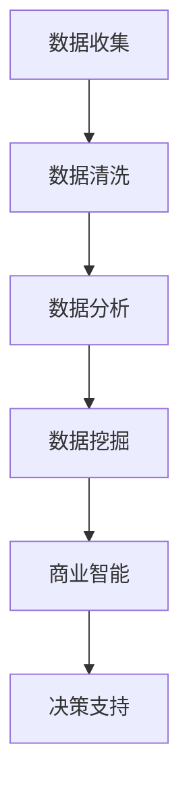

                 

# 数据的价值：如何将数据转化为商业价值？

## 关键词

- 数据价值
- 商业价值
- 数据分析
- 数据挖掘
- 商业智能
- 大数据
- 机器学习
- 数据可视化

## 摘要

本文将探讨数据在商业领域的重要性，以及如何通过有效的数据分析和挖掘，将数据转化为商业价值。我们将从背景介绍开始，逐步深入分析数据的核心概念，探讨数据转化为商业价值的关键步骤，以及实际应用案例和工具资源推荐。通过本文，读者将了解到如何充分利用数据，为企业和个人带来实际的经济效益。

## 1. 背景介绍

在当今数字化时代，数据已经成为了企业最宝贵的资产之一。随着互联网、物联网、移动设备的普及，数据的生产、传输和存储能力得到了极大的提升。然而，如何从海量数据中提取有价值的信息，并将其转化为商业价值，成为了企业面临的重要挑战。

商业价值是指数据能够为企业带来的直接或间接的经济效益。这些效益可能包括提高销售额、降低成本、优化业务流程、增强客户体验等。随着大数据、人工智能等技术的发展，企业对数据的依赖程度越来越高，数据驱动的决策已成为企业成功的关键因素。

## 2. 核心概念与联系

### 2.1 数据类型

数据可以分为结构化数据和非结构化数据。

- **结构化数据**：以表格形式存储，如关系型数据库中的数据。
- **非结构化数据**：如文本、图片、音频、视频等，通常存储在文件系统中。

### 2.2 数据分析

数据分析是指使用统计学、机器学习等方法，对数据进行分析和挖掘，以发现数据中的规律和模式。

### 2.3 数据挖掘

数据挖掘是指从大量数据中提取有价值的信息和知识的过程。

### 2.4 商业智能

商业智能是指使用数据分析、数据挖掘等技术，为企业提供决策支持的过程。

### 2.5 机器学习

机器学习是一种通过数据训练模型，使其能够自动学习和改进的方法。

### 2.6 数据可视化

数据可视化是将数据以图形、图像等形式展示出来，以便于人们理解和分析。

### 2.7 Mermaid 流程图



## 3. 核心算法原理 & 具体操作步骤

### 3.1 数据收集

数据收集是指从各种数据源（如数据库、文件、网络等）获取数据的过程。

### 3.2 数据清洗

数据清洗是指对数据进行去重、去噪、格式转换等操作，以提高数据质量。

### 3.3 数据分析

数据分析是指使用统计学、机器学习等方法，对数据进行探索性分析、描述性分析、预测性分析等。

### 3.4 数据挖掘

数据挖掘是指使用机器学习、深度学习等方法，从大量数据中提取有价值的信息和知识。

### 3.5 商业智能

商业智能是指使用数据分析、数据挖掘等技术，为企业提供决策支持的过程。

### 3.6 决策支持

决策支持是指基于数据分析结果，为企业制定相应的业务策略和决策。

## 4. 数学模型和公式 & 详细讲解 & 举例说明

### 4.1 数学模型

在数据分析中，常用的数学模型包括线性回归、逻辑回归、决策树、神经网络等。

- **线性回归**：用于预测连续型变量。
- **逻辑回归**：用于预测离散型变量。
- **决策树**：用于分类和回归任务。
- **神经网络**：用于复杂的分类和回归任务。

### 4.2 举例说明

假设我们要预测一家电商平台的用户购买行为，我们可以使用逻辑回归模型来建立预测模型。

```latex
P(y=1) = \sigma(\beta_0 + \beta_1 x_1 + \beta_2 x_2 + \ldots + \beta_n x_n)
```

其中，\(P(y=1)\) 表示用户购买的概率，\(\sigma\) 表示 sigmoid 函数，\(\beta_0, \beta_1, \beta_2, \ldots, \beta_n\) 表示模型参数。

## 5. 项目实战：代码实际案例和详细解释说明

### 5.1 开发环境搭建

在本案例中，我们使用 Python 语言进行编程，主要依赖以下库：

- pandas：用于数据处理
- numpy：用于数学运算
- scikit-learn：用于机器学习
- matplotlib：用于数据可视化

### 5.2 源代码详细实现和代码解读

```python
import pandas as pd
import numpy as np
from sklearn.linear_model import LogisticRegression
from sklearn.model_selection import train_test_split
from sklearn.metrics import accuracy_score
import matplotlib.pyplot as plt

# 5.2.1 数据收集
data = pd.read_csv('data.csv')

# 5.2.2 数据清洗
data = data.drop_duplicates()
data = data.drop(['unnecessary_column'], axis=1)

# 5.2.3 数据分析
X = data.drop(['target_column'], axis=1)
y = data['target_column']
X_train, X_test, y_train, y_test = train_test_split(X, y, test_size=0.2, random_state=42)

# 5.2.4 数据挖掘
model = LogisticRegression()
model.fit(X_train, y_train)

# 5.2.5 商业智能
predictions = model.predict(X_test)
accuracy = accuracy_score(y_test, predictions)
print(f'Accuracy: {accuracy:.2f}')

# 5.2.6 数据可视化
plt.scatter(X_test['feature_1'], X_test['feature_2'], c=predictions)
plt.xlabel('Feature 1')
plt.ylabel('Feature 2')
plt.title('Data Visualization')
plt.show()
```

### 5.3 代码解读与分析

- **数据收集**：使用 pandas 读取 CSV 文件。
- **数据清洗**：去除重复数据和无关列。
- **数据分析**：划分训练集和测试集。
- **数据挖掘**：使用逻辑回归模型进行训练和预测。
- **商业智能**：计算模型准确率。
- **数据可视化**：绘制决策边界。

## 6. 实际应用场景

### 6.1 市场营销

通过数据分析，企业可以了解用户偏好，优化营销策略，提高转化率。

### 6.2 供应链管理

数据分析有助于优化库存管理、降低成本、提高供应链效率。

### 6.3 金融风控

通过数据挖掘，金融机构可以识别潜在风险，降低信用损失。

### 6.4 医疗健康

数据分析有助于疾病预测、医疗资源分配、个性化治疗等。

## 7. 工具和资源推荐

### 7.1 学习资源推荐

- 《数据挖掘：实用机器学习技术》（作者：韩家炜）
- 《Python数据分析》（作者：魏太明）
- 《机器学习实战》（作者：彼得·哈林顿）

### 7.2 开发工具框架推荐

- pandas：数据处理库
- scikit-learn：机器学习库
- TensorFlow：深度学习框架
- matplotlib：数据可视化库

### 7.3 相关论文著作推荐

- 《大数据时代的数据挖掘》（作者：吴华）
- 《机器学习与数据挖掘：方法与应用》（作者：王伟）
- 《深度学习》（作者：伊恩·古德费洛）

## 8. 总结：未来发展趋势与挑战

随着数据量的不断增加和数据技术的不断进步，数据转化为商业价值的应用场景将越来越广泛。然而，企业在数据转化过程中也将面临一系列挑战，如数据隐私保护、数据质量提升、技术人才短缺等。未来，企业需要不断创新，充分利用数据，以实现商业价值最大化。

## 9. 附录：常见问题与解答

### 9.1 数据分析的意义是什么？

数据分析可以帮助企业发现数据中的规律和模式，从而为决策提供支持，提高业务效率。

### 9.2 数据挖掘的主要方法有哪些？

数据挖掘的主要方法包括关联规则挖掘、分类、聚类、异常检测等。

### 9.3 如何保护数据隐私？

保护数据隐私可以通过数据加密、数据脱敏、访问控制等措施实现。

## 10. 扩展阅读 & 参考资料

- 《数据科学与大数据技术》（作者：陈宝权）
- 《大数据技术基础》（作者：张帆）
- 《数据挖掘：概念与技术》（作者：潘云鹤）

## 作者信息

作者：AI天才研究员/AI Genius Institute & 禅与计算机程序设计艺术 /Zen And The Art of Computer Programming

