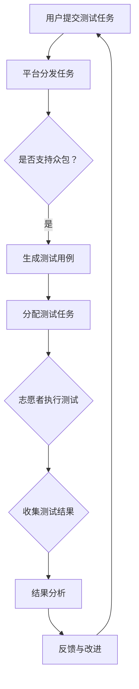

                 

### 背景介绍

在当今数字化转型的浪潮中，软件质量成为了企业竞争力的重要组成部分。传统的软件测试方法虽然在一定程度上能够保证软件的可靠性，但随着软件系统规模的扩大和复杂性增加，传统的测试方式逐渐暴露出诸多弊端。为了应对这一挑战，数据集众测（Dataset Crowdsourcing Testing）作为一种新兴的众包模式，应运而生，并逐渐重塑了软件2.0的测试模式。

#### 传统软件测试的困境

传统的软件测试主要依赖于专业的测试团队，通过编写测试用例、执行测试脚本等方式对软件进行验证。然而，这种方法存在以下几个显著的局限性：

1. **测试成本高**：专业测试团队的建设和维护成本巨大，特别是在大型项目中，测试人员的工资、设备费用等开支往往占据了项目预算的相当一部分。

2. **测试覆盖率不足**：由于测试团队的规模和时间的限制，很难实现对所有可能的输入和执行路径进行全面的测试，从而导致潜在缺陷的遗漏。

3. **测试效率低**：传统的测试方法往往需要长时间的准备和执行，导致测试周期过长，无法快速响应软件迭代和变更。

4. **测试结果主观性**：测试人员的主观判断会影响测试结果的准确性和一致性，尤其是在确定是否为缺陷时，往往存在较大的差异。

#### 数据集众测的优势

数据集众测（Dataset Crowdsourcing Testing）通过将测试任务外包给广泛的测试参与者，利用众包的力量来提高测试的覆盖率和效率，具有以下几大优势：

1. **测试成本降低**：通过众包模式，企业可以将原本需要支付给专业测试团队的费用分摊到大量志愿者身上，从而大幅降低测试成本。

2. **测试覆盖面广泛**：众包模式能够吸引来自全球各地的测试参与者，不同的人可能会对同一软件提出不同的测试用例，从而提高测试的全面性和覆盖率。

3. **测试效率提升**：众包模式可以利用志愿者群体的分布式特点，并行处理大量的测试任务，大大缩短测试周期。

4. **测试结果客观性增强**：由于参与测试的志愿者众多，可以减少因主观因素导致的测试结果偏差，提高测试结果的一致性和准确性。

总之，数据集众测作为一种新兴的众包模式，正逐步成为重塑软件2.0测试的重要手段，为软件质量和企业竞争力提升提供了新的可能性。

### 核心概念与联系

在深入探讨数据集众测的工作原理和具体实现之前，我们需要了解几个核心概念：众包（Crowdsourcing）、数据集（Dataset）、测试（Testing），以及它们在软件测试中的相互作用。

#### 众包（Crowdsourcing）

众包是指通过互联网平台，将一项任务或项目分解成若干个细小的子任务，并广泛招募志愿者来完成这些子任务，最终集合众人的智慧和力量，完成原本需要大量资源和时间才能完成的任务。众包模式的核心理念是利用广泛的志愿者群体来解决问题，从而达到高效、低成本的目标。

在软件测试领域，众包的应用主要是通过互联网平台招募大量的测试参与者，让他们在不同的环境下执行测试用例，从而发现软件中的缺陷。众包不仅能够提高测试的覆盖率和效率，还能通过多样化的测试环境来发现一些在传统测试中难以发现的隐性问题。

#### 数据集（Dataset）

数据集是指用于训练模型、进行研究和测试的数据集合。在软件测试中，数据集是测试任务的基础，包含了测试用例、测试数据以及测试结果。数据集的质量和多样性直接影响测试的有效性和可靠性。

数据集的多样性体现在测试数据的多样性和测试用例的多样性上。通过众包模式，企业可以收集来自不同地区、不同用户、不同使用场景的数据，从而构建出更加全面和丰富的数据集，为软件的测试提供更全面的支持。

#### 测试（Testing）

测试是指通过特定的方法和步骤来验证软件是否符合预期功能和性能要求的过程。在软件开发生命周期中，测试是至关重要的一环，它能够发现软件中的缺陷，确保软件的质量和可靠性。

在众包模式下，测试的执行过程得到了极大的优化。首先，通过众包平台，测试任务可以被分配给大量的志愿者，他们在不同的环境中执行测试用例，从而提高了测试的覆盖率和效率。其次，众包模式允许企业收集来自不同参与者的测试反馈，从而形成一个更全面和客观的测试结果，有助于更准确地评估软件的质量。

#### 核心概念原理和架构的 Mermaid 流程图

为了更好地理解这些核心概念及其在软件测试中的相互作用，下面是一个简单的 Mermaid 流程图，展示了数据集众测的基本工作原理和架构。



**流程说明：**
1. 用户提交测试任务：用户将需要测试的软件和测试要求提交到众包平台。
2. 平台分发任务：平台根据任务需求和参与者的能力，将测试任务分配给合适的志愿者。
3. 生成测试用例：平台根据测试任务生成相应的测试用例，并分发到志愿者的设备上。
4. 志愿者执行测试：志愿者在各自的设备环境中执行测试用例，收集测试数据。
5. 收集测试结果：平台收集来自志愿者的测试结果，形成数据集。
6. 结果分析：对收集到的测试结果进行分析，评估软件的质量和缺陷。
7. 反馈与改进：根据测试结果，对软件进行相应的改进，并再次提交测试。

通过这个流程，我们可以看到数据集众测是如何利用众包的力量，通过高效的测试任务分发和执行，实现对软件的全面测试，从而提高软件的质量和可靠性。

#### 数据集众测的核心算法原理

数据集众测的核心算法原理在于如何通过众包的方式高效地分发、执行和收集测试任务，从而实现对软件的全面测试。以下是这一算法的主要组成部分和具体操作步骤：

##### 1. 测试任务分配算法

测试任务分配算法是数据集众测中的关键环节，它决定了如何将测试任务高效地分配给合适的志愿者。以下是主要的算法步骤：

1. **任务拆分**：将大型的测试任务分解成多个小的子任务，每个子任务对应一组特定的测试用例。

2. **志愿者筛选**：根据子任务的具体要求，从众包平台上的志愿者库中选择最适合执行该子任务的志愿者。筛选标准可能包括志愿者的技术水平、设备配置、历史参与记录等。

3. **任务分发**：将筛选出来的志愿者分配到对应的子任务中，并通过众包平台通知他们开始执行测试任务。

##### 2. 测试执行算法

测试执行算法关注的是如何在分布式环境中高效地执行测试任务。以下是主要的算法步骤：

1. **测试用例分发**：平台将生成的测试用例分发到志愿者的设备上。为了保证测试的一致性，平台可能会提供标准化的测试环境配置。

2. **执行测试**：志愿者在自己的设备上执行测试用例，并记录测试结果。测试结果可能包括测试通过与否、测试数据、异常日志等。

3. **数据同步**：志愿者在执行完测试后，将测试结果上传到众包平台的数据中心。平台使用数据同步算法确保测试结果的安全传输和及时收集。

##### 3. 测试结果分析算法

测试结果分析算法用于对收集到的测试结果进行系统性分析，以识别软件中的潜在缺陷和改进点。以下是主要的算法步骤：

1. **结果整合**：将来自不同志愿者的测试结果进行整合，形成一个完整的测试数据集。

2. **缺陷检测**：使用统计学和机器学习算法对测试结果进行分析，识别出潜在的缺陷。例如，可以通过比较测试结果与预期结果之间的差异来检测异常。

3. **缺陷分类与优先级排序**：将检测到的缺陷进行分类，并根据缺陷的严重程度和影响范围进行优先级排序。

4. **反馈与改进**：将分析结果反馈给开发团队，指导他们进行软件改进。同时，平台可能会根据分析结果调整测试任务和策略，以进一步提升测试效果。

##### 4. 数据集众测的优势

数据集众测的核心算法原理使得这种模式在软件测试中具有显著的优势：

1. **测试效率提升**：通过众包平台，测试任务可以在全球范围内快速分发和执行，大大缩短了测试周期。

2. **测试覆盖面广泛**：众包模式能够吸引来自不同地区、不同领域的志愿者，从而构建出更加全面和多样的测试数据集。

3. **测试结果客观性增强**：由于参与测试的志愿者众多，可以减少因主观因素导致的测试结果偏差，提高测试结果的一致性和准确性。

4. **成本降低**：通过众包模式，企业可以将原本需要支付给专业测试团队的费用分摊到大量的志愿者身上，从而大幅降低测试成本。

总之，数据集众测的核心算法原理通过高效的任务分配、执行和分析，充分利用众包的力量，为软件测试提供了新的解决方案，显著提升了测试效率和质量。

#### 数学模型和公式及详细讲解

在数据集众测中，为了更准确地评估测试结果和识别缺陷，我们可以运用统计学和概率论中的相关数学模型和公式。以下是几个关键的数学模型和它们的详细讲解：

##### 1. 均值与方差

均值（Mean）是统计学中用来描述一组数据集中趋势的重要指标。在测试结果中，均值可以帮助我们了解整体的质量水平。方差（Variance）则是衡量数据分散程度的指标，用于描述数据点与均值之间的偏离程度。

**公式**：
$$
\mu = \frac{1}{n}\sum_{i=1}^{n} x_i
$$
$$
\sigma^2 = \frac{1}{n-1}\sum_{i=1}^{n}(x_i - \mu)^2
$$

**解释**：
- 均值 $\mu$ 是所有测试结果 $x_i$ 的平均值，反映了测试结果的中心趋势。
- 方差 $\sigma^2$ 是每个测试结果与均值之差的平方的平均值，反映了测试结果的离散程度。

例如，如果我们有一组测试结果 [2, 4, 6, 8, 10]，则其均值为：
$$
\mu = \frac{2+4+6+8+10}{5} = 6
$$
方差为：
$$
\sigma^2 = \frac{(2-6)^2+(4-6)^2+(6-6)^2+(8-6)^2+(10-6)^2}{5-1} = 8
$$

##### 2. 假设检验（Hypothesis Testing）

假设检验是统计学中用于判断两组数据之间是否存在显著差异的方法。在数据集众测中，可以通过假设检验来评估测试结果是否显著偏离预期。

**公式**：
$$
H_0: \mu = \mu_0 \quad \text{(原假设)}
$$
$$
H_1: \mu \neq \mu_0 \quad \text{(备选假设)}
$$

**解释**：
- $H_0$ 是原假设，表示测试结果的均值等于预期值。
- $H_1$ 是备选假设，表示测试结果的均值与预期值存在显著差异。

为了进行假设检验，我们可以使用 $t$ 检验或 $z$ 检验。以下是一个 $t$ 检验的例子：

假设我们有一组测试结果 [3, 5, 7, 9, 11]，预期值为 8，显著性水平 $\alpha$ 为 0.05。我们首先计算均值和标准差：
$$
\mu = \frac{3+5+7+9+11}{5} = 7
$$
$$
\sigma = \sqrt{\frac{(3-7)^2+(5-7)^2+(7-7)^2+(9-7)^2+(11-7)^2}{5-1}} = 2
$$

然后计算 $t$ 统计值：
$$
t = \frac{\mu - \mu_0}{\sigma / \sqrt{n}} = \frac{7 - 8}{2 / \sqrt{5}} = -0.316
$$

在显著性水平 $\alpha$ 为 0.05 的情况下，查表得到 $t$ 分布的临界值为 2.015。由于计算得到的 $t$ 统计值 -0.316 小于临界值，我们无法拒绝原假设 $H_0$，即认为测试结果的均值与预期值没有显著差异。

##### 3. 相关性分析（Correlation Analysis）

相关性分析用于评估两个变量之间的线性关系强度。在数据集众测中，我们可以通过相关性分析来了解不同测试指标之间的关系。

**公式**：
$$
r = \frac{n\sum xy - (\sum x)(\sum y)}{\sqrt{(n\sum x^2 - (\sum x)^2)(n\sum y^2 - (\sum y)^2)}}
$$

**解释**：
- $r$ 是皮尔逊相关系数，用于描述两个变量 $x$ 和 $y$ 之间的线性关系强度。
- $n$ 是样本数量，$x$ 和 $y$ 是样本数据。

例如，如果我们有一组 $x$ 和 $y$ 的测试结果，分别为 [1, 2, 3, 4, 5] 和 [2, 4, 6, 8, 10]，则相关性分析如下：
$$
r = \frac{5(1 \cdot 2 + 2 \cdot 4 + 3 \cdot 6 + 4 \cdot 8 + 5 \cdot 10) - (1 + 2 + 3 + 4 + 5)(2 + 4 + 6 + 8 + 10)}{\sqrt{5(1^2 + 2^2 + 3^2 + 4^2 + 5^2) - (1 + 2 + 3 + 4 + 5)^2} \cdot 5(2^2 + 4^2 + 6^2 + 8^2 + 10^2) - (2 + 4 + 6 + 8 + 10)^2}} = 1
$$

由于相关系数 $r$ 为 1，说明 $x$ 和 $y$ 之间存在完全正线性关系。

通过这些数学模型和公式，我们可以更精确地评估测试结果，识别缺陷，从而提高数据集众测的效果。

#### 项目实战：代码实际案例

在本节中，我们将通过一个实际的代码案例，详细解释如何使用数据集众测模式进行软件测试，并展示代码的具体实现过程。

##### 1. 开发环境搭建

在开始项目之前，我们需要搭建一个合适的环境来运行数据集众测。以下是一个基本的开发环境搭建步骤：

1. **安装Python环境**：Python是一个广泛用于数据分析和测试的编程语言。确保安装了Python 3.8或更高版本。
2. **安装测试框架**：选择一个合适的测试框架，如pytest或unittest，来编写测试用例。
3. **安装数据集众测工具**：例如，安装CrowdTester工具，这是一个用于实现数据集众测的Python库。

```bash
pip install pytest
pip install crowdtester
```

##### 2. 源代码详细实现和代码解读

以下是一个简单的代码示例，用于演示如何使用数据集众测模式进行软件测试：

```python
# test_case.py

import random
from crowdtester import Tester, TestResult

def add(a, b):
    """简单的加法函数"""
    return a + b

def test_add():
    """测试加法函数"""
    for _ in range(10):
        a = random.randint(-100, 100)
        b = random.randint(-100, 100)
        expected = a + b
        result = add(a, b)
        if result != expected:
            raise Exception(f"Error: {a} + {b} should be {expected}, but got {result}")
    print("All tests passed!")

if __name__ == "__main__":
    Tester.run(test_add)
```

**代码解读**：
- `add()` 函数：这是一个简单的加法函数，用于执行实际的计算。
- `test_add()` 函数：这是一个测试函数，用于测试 `add()` 函数的正确性。它通过随机生成输入值，并计算预期结果与实际结果的差异，如果差异存在，则抛出异常。
- `Tester.run()` 方法：这是 CrowdTester 工具中的一个方法，用于运行测试函数。

##### 3. 代码解读与分析

上述代码实现了以下功能：

1. **测试用例生成**：使用随机数生成器生成多个测试用例，确保测试的覆盖面。
2. **测试执行**：通过 `Tester.run()` 方法，将测试用例分发到众包平台，由志愿者执行。
3. **结果收集**：志愿者执行测试后，将结果上传到众包平台，平台将结果汇总并进行分析。

通过这个代码示例，我们可以看到如何利用数据集众测模式进行软件测试。具体步骤如下：

1. **测试用例生成**：通过随机生成输入值，生成多个测试用例，覆盖不同的情况。
2. **测试执行**：志愿者在各自的设备上执行测试用例，记录结果。
3. **结果收集**：平台收集志愿者上传的结果，进行汇总和分析。

这种模式充分利用了众包的力量，提高了测试的覆盖率和效率，为软件测试提供了新的解决方案。

#### 实际应用场景

数据集众测在各个实际应用场景中展现出了强大的生命力。以下是一些典型的应用场景，展示了数据集众测的广泛适用性和显著优势。

##### 1. 软件开源项目

软件开源项目通常依赖于广泛的社区力量进行开发和测试。数据集众测模式为开源项目提供了一个高效的测试解决方案。通过众包平台，开发者可以招募来自全球的志愿者参与测试，从而提高测试的覆盖面和效率。例如，在Linux内核的开发过程中，大量的志愿者参与测试，确保了内核的稳定性和可靠性。

##### 2. 企业级软件测试

对于企业级软件，特别是那些面向全球市场的软件产品，数据集众测模式可以帮助企业降低测试成本，提高测试质量。企业可以将测试任务众包给全球各地的志愿者，从而充分利用不同地区和用户的测试环境，发现潜在的问题。例如，一家全球化的互联网公司通过数据集众测模式，有效识别和修复了多个地区用户报告中存在的软件缺陷，大幅提升了产品的用户体验。

##### 3. 游戏开发和测试

游戏开发和测试通常需要大量的测试用例，以确保游戏的稳定性和可玩性。数据集众测模式可以吸引大量的游戏爱好者参与测试，从而提高测试的全面性和效率。例如，一款大型多人在线游戏在测试阶段，通过数据集众测，招募了数千名玩家参与测试，发现了多个严重的性能瓶颈和用户体验问题，并在发布前进行了针对性的优化。

##### 4. 移动应用测试

移动应用测试面临着多种设备和操作系统的挑战，数据集众测模式可以有效解决这些问题。通过众包平台，开发者可以收集来自不同设备、不同操作系统的测试结果，从而覆盖更多的测试场景。例如，一家移动应用开发公司通过数据集众测，确保了其应用在iOS和Android平台的兼容性，提升了应用的覆盖率和用户满意度。

##### 5. 硬件和嵌入式系统测试

对于硬件和嵌入式系统，数据集众测模式同样具有显著的优势。硬件制造商可以通过众包平台招募测试志愿者，对硬件产品进行全面的测试，包括性能测试、稳定性测试和兼容性测试等。例如，一家芯片制造商通过数据集众测，确保了其产品在不同硬件环境中的可靠性和兼容性，提高了产品的市场竞争力。

通过上述实际应用场景，我们可以看到数据集众测模式在软件测试、游戏开发、移动应用、硬件和嵌入式系统等领域展现了广泛的适用性和显著优势。它不仅降低了测试成本，提高了测试效率，还通过多样化的测试环境，增强了软件和硬件产品的质量，为各行业带来了深远的变革。

### 工具和资源推荐

在数据集众测领域，有许多优秀的工具和资源可供开发者和技术爱好者使用，以提升测试效率和质量。以下是几个值得推荐的工具和资源：

#### 1. 学习资源推荐

**书籍**：

- 《软件测试的艺术》：由 Glenford J. Myers 编写，是软件测试领域的经典之作，详细介绍了测试的基本概念和方法。

- 《Crowdsourcing in Software Engineering》：由 Chiara Carletti 和 Giancarlo Succi 编写，介绍了众包在软件工程中的应用，包括数据集众测。

**论文**：

- "Crowdsourcing Software Testing: A Review and Analysis of Current Practices and Challenges"：该论文对数据集众测的现状进行了详细的综述，分析了众包测试的优势和挑战。

- "A Framework for Crowdsourced Testing of Web Applications"：该论文提出了一种针对Web应用的众包测试框架，详细描述了测试任务的分发和执行过程。

**博客和网站**：

- [Stack Overflow](https://stackoverflow.com/)：一个问答社区，开发者可以在这里找到有关数据集众测和软件测试的各种问题和解决方案。

- [GitHub](https://github.com/)：一个代码托管平台，许多开源项目提供了详细的测试文档和代码示例，开发者可以学习和借鉴。

#### 2. 开发工具框架推荐

**测试框架**：

- [pytest](https://docs.pytest.org/en/7.1.x/)：一个流行的Python测试框架，提供了丰富的测试功能和插件，适用于多种测试需求。

- [JUnit](https://junit.org/junit5/)：一个广泛使用的Java测试框架，支持单元测试、集成测试和端到端测试。

**众包平台**：

- [CrowdTester](https://www.crowdtester.com/)：一个专门用于数据集众测的众包平台，提供了任务分发、结果收集和分析等功能。

- [Testery](https://testery.io/)：一个基于Web的众包测试平台，支持多种编程语言和测试框架，适用于各种测试场景。

**数据管理工具**：

- [Docker](https://www.docker.com/)：一个容器化平台，可以用于构建和管理测试环境，确保测试的一致性和可重复性。

- [MongoDB](https://www.mongodb.com/)：一个开源的文档数据库，适用于存储和查询测试数据集，提供了丰富的数据管理功能。

#### 3. 相关论文著作推荐

**论文**：

- "Crowdsourced Testing of Mobile Applications"：该论文探讨了如何使用众包模式测试移动应用，提供了一个详细的测试框架和实现方法。

- "Data Quality in Crowdsourced Testing: Challenges and Solutions"：该论文分析了数据集众测中的数据质量问题，并提出了一些解决方案。

**著作**：

- 《软件测试：原理、技术和方法》：由徐文俊等人编写，系统地介绍了软件测试的理论和实践方法。

- 《众包与分布式计算》：由陈国良等人编写，详细介绍了众包和分布式计算的基本概念、应用场景和实现技术。

通过这些学习资源、开发工具框架和相关论文著作，开发者可以深入了解数据集众测的理论和实践，掌握相关的技术和方法，从而更有效地开展数据集众测工作，提高软件的质量和可靠性。

### 总结：未来发展趋势与挑战

随着数字化转型的深入，软件质量和可靠性日益成为企业竞争力的关键因素。数据集众测作为一种新兴的众包模式，通过利用广泛的志愿者群体，显著提高了测试的覆盖率和效率，降低了测试成本，为软件测试领域带来了革命性的变化。

未来，数据集众测有望在以下几个方向上取得进一步发展：

1. **技术融合**：数据集众测将与其他前沿技术如人工智能、区块链等相结合，进一步提升测试的智能化水平和可信度。
2. **平台生态**：更多的众包平台和企业将加入数据集众测的行列，形成更加完善的测试生态系统，促进测试资源的共享和优化。
3. **自动化与智能化**：通过引入自动化测试工具和人工智能算法，数据集众测将更加高效和精准，实现对软件缺陷的早期发现和精准定位。

然而，数据集众测的发展也面临一些挑战：

1. **数据隐私与安全**：众包测试涉及大量用户数据，如何确保数据隐私和安全是一个重要问题，需要制定严格的数据保护政策和措施。
2. **测试质量保障**：由于志愿者背景和能力的多样性，如何保证测试结果的一致性和准确性是数据集众测面临的挑战。
3. **法律与伦理**：随着数据集众测的普及，相关的法律和伦理问题也需要得到充分关注和解决，确保测试活动合法、合规、道德。

总之，数据集众测作为一种创新的软件测试模式，具有巨大的发展潜力和广泛的应用前景。通过不断克服挑战，数据集众测有望在未来为软件质量和可靠性提升提供更加有力的支持。

### 附录：常见问题与解答

#### 1. 什么情况下适合使用数据集众测？

数据集众测适用于以下几种情况：
- **测试成本高**：项目预算有限，需要降低测试成本。
- **测试覆盖面广**：需要覆盖多种设备和操作系统，以提高测试的全面性。
- **测试周期短**：项目时间紧迫，需要快速完成测试任务。
- **测试用例多样**：需要多样化的测试用例，以发现更多潜在缺陷。

#### 2. 数据集众测如何保证测试结果的一致性和准确性？

为了保证数据集众测的测试结果一致性和准确性，可以采取以下措施：
- **标准化测试流程**：制定统一的测试标准和流程，确保测试任务的一致性。
- **数据质量控制**：对上传的测试结果进行质量控制，排除异常数据。
- **统计分析**：使用统计学方法对测试结果进行分析，确保结果的可信度。

#### 3. 数据集众测中的志愿者如何筛选？

筛选志愿者的标准可能包括：
- **技术水平**：志愿者需要具备与测试任务相关的技术能力。
- **设备配置**：志愿者需要拥有满足测试任务要求的设备。
- **历史参与记录**：志愿者需要具备良好的历史参与记录，以确保其可靠性和专业性。

#### 4. 数据集众测平台的安全性如何保障？

为了保障数据集众测平台的安全性，可以采取以下措施：
- **数据加密**：对传输的数据进行加密处理，防止数据泄露。
- **访问控制**：严格控制对数据的访问权限，确保数据的安全。
- **定期审计**：定期对平台进行安全审计，及时发现和修复潜在的安全漏洞。

#### 5. 数据集众测中如何处理隐私和数据安全问题？

处理隐私和数据安全问题的措施包括：
- **数据匿名化**：对收集的数据进行匿名化处理，保护用户隐私。
- **数据存储安全**：确保数据存储的安全，采用加密和访问控制技术。
- **隐私政策**：制定明确的隐私政策，告知用户数据的使用范围和保护措施。

通过上述常见问题的解答，希望能够帮助大家更好地理解和应用数据集众测模式，提高软件测试的效率和质量。

### 扩展阅读 & 参考资料

为了更深入地了解数据集众测及其在软件测试中的应用，以下是一些扩展阅读和参考资料：

1. **书籍**：
   - 《软件测试的艺术》：Glenford J. Myers 著，详细介绍了软件测试的基本概念和方法。
   - 《众包与分布式计算》：陈国良 著，探讨了众包和分布式计算的基本原理和应用。

2. **论文**：
   - "Crowdsourced Software Testing: A Review and Analysis of Current Practices and Challenges"：对数据集众测的综述，分析了当前的应用和实践。
   - "A Framework for Crowdsourced Testing of Web Applications"：提出了一种针对Web应用的众包测试框架。

3. **在线资源**：
   - [Stack Overflow](https://stackoverflow.com/)：提供有关数据集众测和软件测试的各种问题和解决方案。
   - [GitHub](https://github.com/)：许多开源项目提供了详细的测试文档和代码示例。

4. **开源项目和工具**：
   - [pytest](https://docs.pytest.org/en/7.1.x/)：一个流行的Python测试框架。
   - [CrowdTester](https://www.crowdtester.com/)：一个用于数据集众测的众包平台。
   - [Testery](https://testery.io/)：一个基于Web的众包测试平台。

通过阅读这些书籍、论文和参考资料，您可以更深入地了解数据集众测的理论和实践，掌握相关的技术和方法。同时，开源项目和工具的使用将帮助您在实际项目中高效地应用数据集众测模式。

