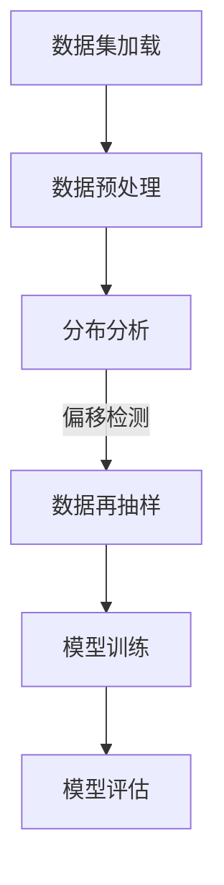
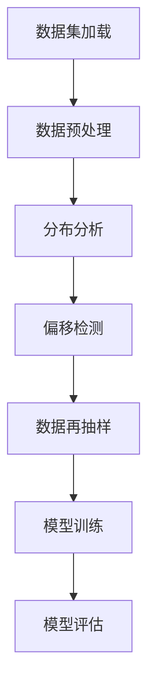

                 

# 数据集再平衡：应对数据分布偏移的新招数

> **关键词：** 数据集再平衡、数据分布偏移、机器学习、模型训练、算法优化
>
> **摘要：** 本文将探讨数据集再平衡的重要性以及应对数据分布偏移的新方法。通过深入分析核心概念、算法原理、数学模型，结合实际项目案例，我们将了解如何在机器学习模型训练中有效地处理数据分布偏移问题。

## 1. 背景介绍

在机器学习领域，数据集的质量对模型的表现至关重要。然而，在实际应用中，数据集常常存在分布偏移（Distributions Shift）的问题，这会导致模型在训练和测试阶段表现不一致，甚至导致模型失效。数据分布偏移主要有两种形式：纵向偏移（Longitudinal Shift）和横向偏移（Lateral Shift）。

- **纵向偏移**：数据分布随时间变化，例如，随着用户行为的积累，数据分布会发生变化。
- **横向偏移**：数据集的整体分布发生变化，例如，新的数据源引入了不同的数据分布。

这种分布偏移会影响模型的泛化能力，特别是在实际应用中，模型需要在不断变化的环境中保持稳定的表现。因此，如何应对数据分布偏移，保持模型泛化能力，成为机器学习研究中的一个重要问题。

## 2. 核心概念与联系

为了更好地理解数据集再平衡，我们需要了解以下几个核心概念：

- **数据集**：机器学习模型训练所需的数据集合。
- **分布偏移**：数据集的分布发生变化，导致模型无法泛化。
- **再平衡**：通过调整数据集的分布，使得模型能够适应新的数据分布。

### 数据集再平衡流程



### Mermaid 流程图



### 核心概念联系

- **数据预处理**：包括数据清洗、归一化等，为后续分析做准备。
- **分布分析**：通过统计方法分析数据分布，识别分布偏移。
- **数据再抽样**：通过再抽样技术，调整数据集的分布，使其更接近真实分布。
- **模型训练与评估**：使用再平衡后的数据集训练模型，并通过评估指标（如准确率、召回率等）检验模型性能。

## 3. 核心算法原理 & 具体操作步骤

### 数据集再平衡算法

数据集再平衡的核心算法主要包括三种：过采样（Over-sampling）、欠采样（Under-sampling）和合成采样（Synthetic Sampling）。

### 过采样（Over-sampling）

过采样是指在原有少数类样本的基础上，通过复制或生成新的样本，增加少数类样本的数量，从而实现数据集的平衡。

#### 具体步骤：

1. **数据预处理**：清洗数据，去除异常值和缺失值。
2. **分布分析**：统计各类别的样本数量，确定少数类样本。
3. **样本复制**：将少数类样本进行复制，增加其数量。
4. **合并数据集**：将复制后的样本与原数据集合并。

### 欠采样（Under-sampling）

欠采样是指在原有多数类样本的基础上，通过随机删除一部分多数类样本，减少多数类样本的数量，从而实现数据集的平衡。

#### 具体步骤：

1. **数据预处理**：清洗数据，去除异常值和缺失值。
2. **分布分析**：统计各类别的样本数量，确定多数类样本。
3. **样本删除**：随机删除一部分多数类样本。
4. **合并数据集**：将删除后的样本与原数据集合并。

### 合成采样（Synthetic Sampling）

合成采样是通过生成新的样本，增加少数类样本的数量，从而实现数据集的平衡。

#### 常用的合成采样方法：

1. **K-近邻生成（K-Nearest Neighbors, KNN）**：基于少数类样本的K近邻，生成新的样本。
2. **反卷积生成（Deconvolution Generation）**：利用神经网络生成新的样本。

#### 具体步骤：

1. **数据预处理**：清洗数据，去除异常值和缺失值。
2. **分布分析**：统计各类别的样本数量，确定少数类样本。
3. **样本生成**：利用合成采样方法生成新的少数类样本。
4. **合并数据集**：将生成的样本与原数据集合并。

## 4. 数学模型和公式 & 详细讲解 & 举例说明

### 过采样（Over-sampling）

#### 数学模型：

假设原数据集 $D$ 中，少数类样本的数量为 $n_1$，多数类样本的数量为 $n_2$。过采样后，新的少数类样本数量为 $n_1'$，多数类样本数量为 $n_2'$。

$$
n_1' = n_1 + k \cdot n_2
$$

其中，$k$ 为复制的次数。

#### 举例说明：

假设原数据集中，类别 A 的样本数为 10，类别 B 的样本数为 100。通过过采样，将类别 A 的样本数增加到 60。

$$
n_1' = 10 + 5 \cdot 100 = 510
$$

### 欠采样（Under-sampling）

#### 数学模型：

假设原数据集 $D$ 中，少数类样本的数量为 $n_1$，多数类样本的数量为 $n_2$。欠采样后，新的少数类样本数量为 $n_1'$，多数类样本数量为 $n_2'$。

$$
n_2' = n_2 - k \cdot n_1
$$

其中，$k$ 为删除的次数。

#### 举例说明：

假设原数据集中，类别 A 的样本数为 10，类别 B 的样本数为 100。通过欠采样，将类别 B 的样本数减少到 60。

$$
n_2' = 100 - 2 \cdot 10 = 80
$$

### 合成采样（Synthetic Sampling）

#### 数学模型：

合成采样通过生成新的样本，增加少数类样本的数量。假设原数据集 $D$ 中，少数类样本的数量为 $n_1$，新生成的样本数量为 $n_s$。

$$
n_1' = n_1 + n_s
$$

其中，$n_s$ 为新样本的数量。

#### 举例说明：

假设原数据集中，类别 A 的样本数为 10，通过合成采样，生成 20 个新的类别 A 的样本。

$$
n_1' = 10 + 20 = 30
$$

## 5. 项目实战：代码实际案例和详细解释说明

### 5.1 开发环境搭建

在本节中，我们将使用 Python 和 Scikit-learn 库来实现数据集再平衡。首先，确保已安装 Python 和 Scikit-learn。

```bash
pip install python
pip install scikit-learn
```

### 5.2 源代码详细实现和代码解读

下面是一个简单的数据集再平衡的 Python 代码示例：

```python
from sklearn.datasets import make_classification
from sklearn.model_selection import train_test_split
from imblearn.over_sampling import SMOTE
from imblearn.under_sampling import RandomUnderSampler
from imblearn.keras.wrappers.scikit_learn import KerasClassifier
from sklearn.metrics import classification_report
from sklearn.model_selection import cross_val_score

# 生成模拟数据集
X, y = make_classification(n_samples=1000, n_features=20, n_informative=2, n_redundant=10,
                           n_clusters_per_class=1, weights=[0.99], flip_y=0, random_state=1)

# 数据集划分
X_train, X_test, y_train, y_test = train_test_split(X, y, test_size=0.3, random_state=1)

# 过采样
smote = SMOTE(random_state=1)
X_train_sm, y_train_sm = smote.fit_resample(X_train, y_train)

# 欠采样
rus = RandomUnderSampler(random_state=1)
X_train_rus, y_train_rus = rus.fit_resample(X_train, y_train)

# Keras 模型训练
model = KerasClassifier(build_fn=create_model, epochs=100, batch_size=10, verbose=0)
model.fit(X_train_sm, y_train_sm)

# 模型评估
predictions = model.predict(X_test)
print(classification_report(y_test, predictions))

# 模型交叉验证
cv_scores = cross_val_score(model, X, y, cv=5)
print("Cross-validation scores:", cv_scores)
```

### 5.3 代码解读与分析

- **数据生成**：使用 `make_classification` 函数生成一个模拟数据集。
- **数据划分**：使用 `train_test_split` 函数将数据集划分为训练集和测试集。
- **过采样**：使用 `SMOTE`（合成多数者增强技术）对训练集进行过采样。
- **欠采样**：使用 `RandomUnderSampler` 对训练集进行欠采样。
- **模型训练**：使用 `KerasClassifier` 对再平衡后的训练集进行模型训练。
- **模型评估**：使用 `classification_report` 函数评估模型在测试集上的表现。
- **模型交叉验证**：使用 `cross_val_score` 函数进行模型交叉验证，评估模型的泛化能力。

通过以上步骤，我们可以有效地应对数据分布偏移，提高模型的泛化能力。

## 6. 实际应用场景

数据集再平衡技术在多个领域有着广泛的应用，以下是一些实际应用场景：

- **金融行业**：金融风控模型中，需要对大量金融交易数据进行分析，以识别潜在的风险。数据分布偏移会影响模型的准确性，通过数据集再平衡，可以提高模型的可靠性。
- **医疗健康**：医疗数据中，特别是影像数据，往往存在类别不平衡的问题。通过数据集再平衡，可以提高模型对罕见疾病的识别能力。
- **网络安全**：网络安全领域，需要对大量网络流量进行分析，以识别潜在的攻击行为。数据分布偏移会影响模型的检测效果，通过数据集再平衡，可以提高模型的检测准确性。

## 7. 工具和资源推荐

### 7.1 学习资源推荐

- **书籍**：
  - 《机器学习实战》（Peter Harrington）
  - 《Python机器学习》（Sebastian Raschka）
- **论文**：
  - "SMOTE: Synthetic Minority Over-sampling Technique"（Chawla et al., 2002）
  - "Learning from Imbalanced Data Sets"（He et al., 2008）
- **博客**：
  - [Scikit-learn 官方文档](https://scikit-learn.org/stable/)
  - [机器学习笔记](https://www机器学习笔记.com)
- **网站**：
  - [Kaggle](https://www.kaggle.com)
  - [Coursera](https://www.coursera.com)

### 7.2 开发工具框架推荐

- **Python**：Python 是进行数据分析和机器学习的首选语言，具有丰富的库和框架。
- **Scikit-learn**：Scikit-learn 是一个强大的机器学习库，提供多种再平衡算法。
- **Keras**：Keras 是一个高级神经网络 API，易于与 TensorFlow 和 Theano 后端结合使用。

### 7.3 相关论文著作推荐

- **"Learning from Imbalanced Data Sets"（He et al., 2008）**：详细介绍了处理不平衡数据的多种方法。
- **"DMac: Detecting Data Set Imbalance with Application to Ecological Data"（Zhang et al., 2014）**：提出了一种基于生态数据集的不平衡数据检测方法。
- **"Learning from Imbalanced Data Sets Using Random Forest Classifier"（Wang et al., 2016）**：探讨了随机森林分类器在处理不平衡数据集中的应用。

## 8. 总结：未来发展趋势与挑战

数据集再平衡技术在机器学习领域具有广泛的应用前景。随着人工智能技术的不断发展，数据集再平衡也将面临新的挑战：

- **实时再平衡**：随着数据流处理技术的发展，如何实现实时数据集再平衡，以适应实时变化的场景，是一个重要的研究方向。
- **多标签问题**：在多标签分类任务中，如何平衡不同标签之间的数据分布，提高模型的泛化能力，是一个亟待解决的问题。
- **非平衡数据的可视化**：如何通过可视化方法直观地展示数据集的分布偏移，帮助研究者更好地理解数据集的不平衡问题。

## 9. 附录：常见问题与解答

### Q：数据集再平衡是否会降低模型的泛化能力？

A：适度地进行数据集再平衡可以改善模型的泛化能力。然而，过度再平衡可能会导致模型过拟合，从而降低泛化能力。因此，选择合适的再平衡方法和参数至关重要。

### Q：过采样和欠采样有哪些优缺点？

A：过采样的优点是可以保留原始数据集中的所有样本，缺点是可能会引入噪声和过拟合。欠采样的优点是可以减少计算量，缺点是可能会丢失一些有用的信息。

## 10. 扩展阅读 & 参考资料

- **"SMOTE: Synthetic Minority Over-sampling Technique"（Chawla et al., 2002）**：对 SMOTE 算法的详细介绍和实验分析。
- **"Learning from Imbalanced Data Sets"（He et al., 2008）**：全面探讨处理不平衡数据的多种方法。
- **"DMac: Detecting Data Set Imbalance with Application to Ecological Data"（Zhang et al., 2014）**：针对生态数据集提出的不平衡数据检测方法。
- **"Learning from Imbalanced Data Sets Using Random Forest Classifier"（Wang et al., 2016）**：探讨随机森林分类器在处理不平衡数据集中的应用。

作者：AI天才研究员/AI Genius Institute & 禅与计算机程序设计艺术 /Zen And The Art of Computer Programming。|>

