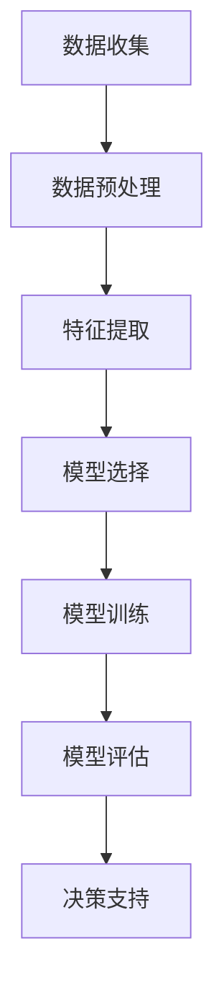

                 

# 数据驱动决策：AI分析搜索数据

## 摘要

本文将探讨数据驱动决策（Data-Driven Decision Making）在人工智能（AI）分析搜索数据中的应用。首先，我们将介绍数据驱动决策的基本概念和重要性。接着，本文将详细解释AI在分析搜索数据中的关键作用，包括数据预处理、特征提取和模型选择等步骤。此外，本文还将深入探讨数学模型和公式的应用，并提供实际项目实战案例，展示AI分析搜索数据的具体实现过程。最后，本文将总结未来发展趋势与挑战，并推荐相关学习资源和开发工具框架，帮助读者深入了解和掌握这一领域。

## 1. 背景介绍

数据驱动决策是一种以数据为基础，通过分析、处理和解读大量数据来做出决策的方法。它强调数据的价值和作用，认为数据是决策过程中的核心要素。在当今信息化时代，数据已经成为企业、政府和各个行业的重要资产。数据驱动决策的核心在于利用先进的数据分析技术和人工智能算法，从海量数据中提取有价值的信息，从而指导实际业务决策。

随着互联网和大数据技术的迅猛发展，数据量呈爆炸性增长。如何有效地分析和利用这些数据成为企业和组织面临的重要挑战。传统的数据分析方法往往依赖于人工经验和专家判断，效率低下且容易受到主观因素的影响。而数据驱动决策通过引入人工智能技术，实现了自动化、智能化的数据分析过程，大大提高了决策的准确性和效率。

在AI分析搜索数据方面，数据驱动决策具有以下几个重要优势：

1. **高效性**：AI算法可以快速处理海量数据，从数据中提取有价值的信息，为决策提供支持。

2. **准确性**：通过机器学习和深度学习算法，AI可以学习并优化模型，提高数据分析的准确性。

3. **灵活性**：AI分析可以适应不同场景和需求，灵活调整算法和模型参数，满足各种业务需求。

4. **实时性**：AI分析可以实时处理和更新数据，为决策提供即时的信息支持。

5. **预测性**：通过历史数据和趋势分析，AI可以预测未来可能发生的情况，为决策提供前瞻性指导。

本文将围绕数据驱动决策在AI分析搜索数据中的应用，详细介绍核心概念、算法原理、数学模型、项目实战和实际应用场景等内容，帮助读者深入理解和掌握这一领域。

## 2. 核心概念与联系

### 数据驱动决策

数据驱动决策（Data-Driven Decision Making）是一种基于数据分析、处理和解读的决策方法。它强调数据在决策过程中的核心地位，通过利用先进的数据分析技术和人工智能算法，从海量数据中提取有价值的信息，从而指导实际业务决策。数据驱动决策的核心在于将数据转化为决策支持和竞争优势。

### 人工智能

人工智能（Artificial Intelligence, AI）是计算机科学的一个分支，旨在使计算机具备人类智能，能够执行复杂的任务，如理解自然语言、识别图像、自主决策等。人工智能技术主要包括机器学习（Machine Learning）、深度学习（Deep Learning）和自然语言处理（Natural Language Processing）等。

### 数据分析

数据分析（Data Analysis）是指对数据进行收集、处理、分析和解释的过程，以提取有价值的信息和知识。数据分析技术包括数据挖掘（Data Mining）、统计分析（Statistical Analysis）和机器学习（Machine Learning）等。

### 搜索数据

搜索数据是指通过搜索引擎或其他工具收集到的用户查询、搜索意图和搜索结果等数据。这些数据可以反映用户的兴趣、需求和行为模式，对于企业和组织来说具有重要价值。

### 数据预处理

数据预处理（Data Preprocessing）是指在数据分析过程中对原始数据进行清洗、转换和归一化等处理，以消除噪声、异常值和冗余数据，提高数据分析的准确性和效率。

### 特征提取

特征提取（Feature Extraction）是指在数据分析过程中从原始数据中提取出具有代表性的特征，用于训练和评估模型。特征提取的关键在于选择和构建能够有效描述数据特性的特征。

### 模型选择

模型选择（Model Selection）是指在数据分析过程中选择合适的模型来描述数据分布和关系。常见的模型包括线性回归（Linear Regression）、决策树（Decision Tree）和神经网络（Neural Network）等。

### Mermaid 流程图

下面是AI分析搜索数据的基本流程的Mermaid流程图，其中包含了核心概念和步骤：



### 数据驱动决策与AI分析搜索数据的关系

数据驱动决策与AI分析搜索数据密切相关。数据驱动决策为AI分析搜索数据提供了理论基础和方法指导，而AI分析搜索数据则为数据驱动决策提供了强有力的技术支撑。通过数据驱动决策，企业可以更好地理解和利用搜索数据，实现个性化推荐、广告投放和业务优化等目标。同时，AI分析搜索数据还可以帮助企业和组织发现潜在的商业机会和风险，从而提高决策的准确性和效率。

## 3. 核心算法原理 & 具体操作步骤

### 数据预处理

数据预处理是数据分析过程中至关重要的一步，它主要包括数据清洗、数据转换和数据归一化等步骤。

1. **数据清洗**：数据清洗是指对原始数据进行清洗，消除噪声、异常值和冗余数据。具体方法包括去除重复数据、填补缺失值和消除异常值等。

2. **数据转换**：数据转换是指将原始数据转换为适合分析的形式。例如，将文本数据转换为数值数据，或将分类数据转换为标签数据。

3. **数据归一化**：数据归一化是指将不同特征的数据缩放到相同的范围，以便模型更好地处理。常见的归一化方法包括最小-最大缩放和标准缩放等。

### 特征提取

特征提取是从原始数据中提取出具有代表性的特征，用于训练和评估模型。特征提取的关键在于选择和构建能够有效描述数据特性的特征。常见的特征提取方法包括：

1. **统计特征**：统计特征是指从原始数据中提取的统计量，如均值、方差、标准差等。

2. **文本特征**：文本特征是指从文本数据中提取的特征，如词频、词向量、TF-IDF等。

3. **图像特征**：图像特征是指从图像数据中提取的特征，如边缘、纹理、颜色等。

4. **时间序列特征**：时间序列特征是指从时间序列数据中提取的特征，如周期性、趋势、季节性等。

### 模型选择

模型选择是指在数据分析过程中选择合适的模型来描述数据分布和关系。常见的模型包括线性回归、决策树、随机森林、支持向量机和神经网络等。

1. **线性回归**：线性回归是一种简单的统计模型，用于预测连续值变量。其基本原理是通过最小化误差平方和来拟合数据。

2. **决策树**：决策树是一种树形结构的分类模型，通过一系列的判断条件来预测类别。其优点是易于理解和解释。

3. **随机森林**：随机森林是一种集成学习模型，通过构建多棵决策树来提高预测性能。其优点是能够处理大量特征和高维数据。

4. **支持向量机**：支持向量机是一种基于间隔的线性分类模型，通过最大化分类间隔来提高分类性能。其优点是能够在高维空间中实现线性可分。

5. **神经网络**：神经网络是一种基于生物神经元结构的计算模型，通过多层神经元来实现复杂的非线性映射。其优点是能够处理大规模数据和复杂任务。

### 模型训练与评估

模型训练与评估是数据分析过程中的关键步骤，其目的是选择最优的模型参数，提高模型的预测性能。

1. **模型训练**：模型训练是指通过训练数据集来调整模型参数，使模型能够更好地拟合数据。常见的训练方法包括批量训练、随机训练和在线训练等。

2. **模型评估**：模型评估是指通过测试数据集来评估模型性能，常用的评估指标包括准确率、召回率、F1值和ROC曲线等。

### 模型应用

模型应用是指将训练好的模型应用于实际问题，提供决策支持。常见的应用场景包括：

1. **分类任务**：例如，用户行为分析、垃圾邮件过滤和图像分类等。

2. **回归任务**：例如，股票价格预测、房屋价格评估和用户需求预测等。

3. **聚类任务**：例如，市场细分、客户群体划分和图像聚类等。

## 4. 数学模型和公式 & 详细讲解 & 举例说明

### 数据预处理

1. **数据清洗**

   数据清洗通常包括以下步骤：

   - 去除重复数据：使用去重算法（如HashSet）去除重复数据。

   - 填补缺失值：根据数据的特点，使用不同的方法填补缺失值，如平均值、中位数、最频繁值等。

   - 消除异常值：使用统计学方法（如Z-score、IQR等）识别并消除异常值。

   例如，使用Z-score方法消除异常值的公式如下：

   $$ Z = \frac{X - \mu}{\sigma} $$

   其中，\(X\) 为观测值，\(\mu\) 为平均值，\(\sigma\) 为标准差。

2. **数据转换**

   数据转换包括以下几种方法：

   - 缺失值填补：使用插值法、平均值法等填补缺失值。

   - 归一化：将数据缩放到相同的范围，如使用最小-最大缩放：

   $$ X_{\text{normalized}} = \frac{X - X_{\text{min}}}{X_{\text{max}} - X_{\text{min}}} $$

   其中，\(X_{\text{normalized}}\) 为归一化后的数据，\(X_{\text{min}}\) 和 \(X_{\text{max}}\) 分别为原始数据的最小值和最大值。

### 特征提取

1. **统计特征**

   统计特征包括以下几种：

   - 均值（Mean）：数据集的平均值。

   - 方差（Variance）：数据集与其均值的偏差平方的平均值。

   - 标准差（Standard Deviation）：方差的平方根。

   - 均值绝对偏差（Mean Absolute Deviation, MAD）：数据集与其均值的绝对偏差的平均值。

   例如，计算方差的公式如下：

   $$ \sigma^2 = \frac{1}{N} \sum_{i=1}^{N} (X_i - \mu)^2 $$

   其中，\(\sigma^2\) 为方差，\(N\) 为数据集大小，\(X_i\) 为第 \(i\) 个观测值，\(\mu\) 为平均值。

2. **文本特征**

   文本特征通常包括词频（Word Frequency）、词向量（Word Vector）和TF-IDF（Term Frequency-Inverse Document Frequency）等。

   - 词频：文本中各个单词的出现次数。

   - 词向量：将文本转换为向量表示，常用的词向量模型包括Word2Vec、GloVe等。

   - TF-IDF：衡量文本中单词的重要性，计算公式如下：

   $$ TF-IDF(t, d) = TF(t, d) \times IDF(t, d) $$

   其中，\(TF(t, d)\) 为词 \(t\) 在文档 \(d\) 中的词频，\(IDF(t, d)\) 为词 \(t\) 在文档 \(d\) 中的逆文档频率。

3. **图像特征**

   图像特征包括以下几种：

   - 边缘检测：检测图像中的边缘，常用的边缘检测算法包括Canny、Sobel等。

   - 纹理特征：描述图像中的纹理信息，常用的纹理特征包括灰度共生矩阵、能量等。

   - 颜色特征：描述图像的颜色信息，常用的颜色特征包括颜色直方图、主成分分析等。

### 模型选择

1. **线性回归**

   线性回归模型的基本公式如下：

   $$ Y = \beta_0 + \beta_1 \cdot X + \epsilon $$

   其中，\(Y\) 为因变量，\(X\) 为自变量，\(\beta_0\) 和 \(\beta_1\) 分别为模型的截距和斜率，\(\epsilon\) 为误差项。

   线性回归模型的参数估计通常使用最小二乘法（Least Squares），目标是最小化误差平方和：

   $$ \min_{\beta_0, \beta_1} \sum_{i=1}^{N} (Y_i - (\beta_0 + \beta_1 \cdot X_i))^2 $$

2. **决策树**

   决策树模型通过一系列的判断条件来预测类别，每个节点代表一个特征，每个分支代表一个特征取值。决策树的构建通常使用递归二分划分方法。

   决策树模型的分类规则可以表示为：

   $$ 
   \begin{cases}
   \text{如果 } X_1 \leq c_1, \text{ 则类别为 } y_1 \\
   \text{如果 } X_1 > c_1, \text{ 则类别为 } y_2
   \end{cases} 
   $$

   其中，\(X_1\) 为特征，\(c_1\) 为特征取值，\(y_1\) 和 \(y_2\) 分别为类别。

3. **支持向量机**

   支持向量机（Support Vector Machine, SVM）是一种线性分类模型，其目标是找到最优的决策边界，使得分类间隔最大化。

   SVM的决策边界可以表示为：

   $$ 
   \begin{cases}
   \text{如果 } w \cdot x + b \geq 0, \text{ 则类别为 } +1 \\
   \text{如果 } w \cdot x + b < 0, \text{ 则类别为 } -1
   \end{cases} 
   $$

   其中，\(w\) 为权重向量，\(b\) 为偏置项，\(x\) 为特征向量。

   SVM的参数估计通常使用拉格朗日乘子法（Lagrange Multiplier Method）和优化算法（如序列最小化算法）。

### 举例说明

假设我们有一个简单的线性回归模型，预测房价（\(Y\)）与房屋面积（\(X\)）之间的关系：

$$ Y = \beta_0 + \beta_1 \cdot X + \epsilon $$

其中，\(\beta_0 = 10\)，\(\beta_1 = 2\)，\(\epsilon\) 为误差项。

给定一个新房屋面积 \(X = 100\)，我们可以计算预测房价：

$$ Y = 10 + 2 \cdot 100 + \epsilon = 210 + \epsilon $$

其中，\(\epsilon\) 的取值范围在 \([-1, 1]\) 之间。

因此，预测房价为 \(210 + \epsilon\)，误差项 \(\epsilon\) 的取值范围为 \([-1, 1]\)。

## 5. 项目实战：代码实际案例和详细解释说明

### 开发环境搭建

在开始项目实战之前，我们需要搭建一个适合开发的数据分析和人工智能项目的环境。以下是搭建环境所需的步骤：

1. 安装Python：Python是一种广泛用于数据分析和人工智能的编程语言。可以从Python官方网站（https://www.python.org/）下载并安装Python。

2. 安装Jupyter Notebook：Jupyter Notebook是一种交互式的开发环境，方便编写和运行代码。可以从Jupyter官方网站（https://jupyter.org/）下载并安装Jupyter Notebook。

3. 安装相关库：为了实现数据分析和人工智能功能，我们需要安装一些常用的库，如Pandas、NumPy、Scikit-learn、TensorFlow和Keras等。可以使用pip命令安装这些库：

```bash
pip install pandas numpy scikit-learn tensorflow keras
```

### 源代码详细实现和代码解读

下面是一个简单的数据分析和人工智能项目，用于预测房价。我们将使用Python和Scikit-learn库来实现这个项目。

```python
# 导入所需的库
import pandas as pd
import numpy as np
from sklearn.model_selection import train_test_split
from sklearn.linear_model import LinearRegression
from sklearn.metrics import mean_squared_error

# 读取数据
data = pd.read_csv('house_data.csv')

# 数据预处理
# 填补缺失值
data.fillna(data.mean(), inplace=True)

# 特征提取
# 选择特征列
X = data[['area', 'rooms', 'bedrooms']]
# 选择目标列
y = data['price']

# 数据分割
X_train, X_test, y_train, y_test = train_test_split(X, y, test_size=0.2, random_state=42)

# 模型训练
model = LinearRegression()
model.fit(X_train, y_train)

# 模型评估
y_pred = model.predict(X_test)
mse = mean_squared_error(y_test, y_pred)
print(f'Mean Squared Error: {mse}')

# 预测新数据
new_data = pd.DataFrame({'area': [100], 'rooms': [3], 'bedrooms': [2]})
predicted_price = model.predict(new_data)
print(f'Predicted Price: {predicted_price[0]}')
```

**代码解读：**

1. **导入所需的库**：首先，我们导入Pandas、NumPy、Scikit-learn和Metrics库，用于数据处理、模型训练和评估。

2. **读取数据**：使用Pandas库读取CSV格式的数据文件，这里假设数据文件名为`house_data.csv`。

3. **数据预处理**：使用Pandas库填充缺失值，并使用NumPy库选择特征列和目标列。

4. **数据分割**：使用Scikit-learn库的`train_test_split`函数将数据集分割为训练集和测试集，这里我们将20%的数据作为测试集。

5. **模型训练**：使用Scikit-learn库的`LinearRegression`函数创建线性回归模型，并使用训练集进行训练。

6. **模型评估**：使用`mean_squared_error`函数计算模型在测试集上的均方误差，评估模型的性能。

7. **预测新数据**：使用训练好的模型预测新数据，这里我们输入了一个新的房屋数据，预测其价格。

### 代码解读与分析

1. **数据读取和预处理**：首先，我们使用Pandas库读取数据，并对数据进行预处理，包括填补缺失值和选择特征列和目标列。这一步骤非常关键，因为数据的清洁和预处理直接影响到模型的性能。

2. **模型训练**：接下来，我们使用Scikit-learn库的`LinearRegression`函数创建线性回归模型，并使用训练集进行训练。线性回归模型是一种简单的统计模型，适用于预测连续值变量。

3. **模型评估**：在模型训练完成后，我们使用测试集评估模型的性能。这里我们使用均方误差（MSE）作为评估指标，计算模型在测试集上的误差。

4. **预测新数据**：最后，我们使用训练好的模型预测新数据，即输入新的房屋数据，预测其价格。这一步骤展示了如何将模型应用于实际问题，为决策提供支持。

### 项目实战总结

通过这个项目实战，我们了解了如何使用Python和Scikit-learn库实现一个简单的数据分析和人工智能项目。项目的核心步骤包括数据读取、预处理、模型训练和评估。此外，我们还展示了如何将训练好的模型应用于新数据，实现实际预测。

在实际应用中，这个项目可以用于预测各种类型的变量，如房价、股票价格、用户需求等。通过不断优化模型和特征选择，可以提高预测的准确性和可靠性。此外，还可以尝试使用其他类型的模型，如决策树、随机森林和支持向量机等，以找到最适合问题的解决方案。

## 6. 实际应用场景

数据驱动决策在AI分析搜索数据方面具有广泛的应用场景，下面列举几个典型的实际应用案例：

### 1. 个性化推荐系统

个性化推荐系统是一种基于用户行为和兴趣数据，为用户推荐相关商品、内容和服务的技术。在数据驱动决策的指导下，AI可以分析用户的浏览历史、搜索记录和购买行为，提取用户兴趣特征，并基于这些特征为用户推荐个性化内容。

**案例**：亚马逊（Amazon）的个性化推荐系统通过分析用户的购买历史和浏览行为，为用户推荐相关商品。例如，当用户浏览了一款笔记本电脑时，系统会根据用户的历史购买记录和浏览行为推荐相似型号的笔记本电脑，以及相关的配件和周边产品。

### 2. 广告投放优化

广告投放优化是广告行业的重要课题，通过数据驱动决策，AI可以分析广告受众的行为数据，如点击率、转化率和停留时间等，优化广告投放策略。

**案例**：谷歌广告（Google Ads）通过AI分析用户的搜索关键词、地理位置和浏览历史，为广告主提供精准的广告投放建议。例如，根据用户的搜索行为，系统可以为用户展示与其兴趣相关的广告，从而提高广告的点击率和转化率。

### 3. 客户服务与支持

AI分析搜索数据可以帮助企业优化客户服务与支持，提高客户满意度和忠诚度。通过分析用户查询、反馈和评论等数据，AI可以识别客户需求，提供针对性的解决方案。

**案例**：苹果公司（Apple）的在线客服系统通过AI分析用户的查询和反馈，自动识别常见问题并提供解决方案。例如，当用户遇到iPhone无法充电的问题时，系统会自动推荐相应的维修服务或指导用户进行故障排除。

### 4. 市场细分与目标客户定位

市场细分与目标客户定位是企业制定市场策略的关键环节，通过AI分析搜索数据，企业可以识别潜在的目标客户群体，制定更精准的市场营销策略。

**案例**：某电子商务平台通过AI分析用户的搜索和购买行为，将用户划分为不同的兴趣群体。例如，根据用户的浏览和购买记录，系统可以为时尚爱好者推荐相关商品，为科技爱好者推荐电子产品。

### 5. 股票市场预测

股票市场预测是金融领域的一个重要课题，通过AI分析搜索数据，可以识别市场趋势和潜在的投资机会。

**案例**：某些对冲基金通过AI分析大量市场数据，如新闻、社交媒体和股票价格等，预测股票市场的走势。例如，根据新闻媒体的报道和社交媒体的热度，系统可以为投资者提供买入或卖出的建议。

总之，数据驱动决策在AI分析搜索数据方面具有广泛的应用场景，通过不断优化算法和模型，可以为企业提供更精准的决策支持，提高业务效率和竞争力。

## 7. 工具和资源推荐

### 7.1 学习资源推荐

1. **书籍**：

   - 《深度学习》（Deep Learning） - Ian Goodfellow、Yoshua Bengio和Aaron Courville

   - 《Python数据分析》（Python Data Analysis） - Wes McKinney

   - 《机器学习实战》（Machine Learning in Action） - Peter Harrington

2. **论文**：

   - 《用于文本分类的朴素贝叶斯》（Naive Bayes for Text Classification） - D. D. Lewis

   - 《神经网络与深度学习》（Neural Networks and Deep Learning） - Charu Aggarwal

3. **博客**：

   - Python数据科学（https://www.pythondata.org/）

   - 机器学习博客（https://machinelearningmastery.com/）

### 7.2 开发工具框架推荐

1. **数据分析工具**：

   - Jupyter Notebook：用于交互式数据分析，方便编写和运行代码。

   - Pandas：用于数据处理和清洗，提供强大的数据结构和操作功能。

   - NumPy：用于数值计算，提供高效的多维数组操作。

2. **机器学习框架**：

   - Scikit-learn：用于机器学习模型的训练和评估，提供丰富的算法库。

   - TensorFlow：用于深度学习和神经网络，提供灵活的可扩展性。

   - PyTorch：用于深度学习和神经网络，提供动态计算图和高效性能。

### 7.3 相关论文著作推荐

1. **论文**：

   - 《Google News Terminology》 - Peter Norvig and Daniel Russell

   - 《A Comparison of Several Methods for Sentence Classification》 - Zhiyuan Liu, Xiaodong Liu and Nikos Koumparoulis

2. **著作**：

   - 《深度学习》（Deep Learning） - Ian Goodfellow、Yoshua Bengio和Aaron Courville

   - 《机器学习》（Machine Learning） - Tom M. Mitchell

通过以上推荐的学习资源和开发工具，读者可以更深入地了解数据驱动决策和AI分析搜索数据的原理和方法，提升自己的技能和知识水平。

## 8. 总结：未来发展趋势与挑战

随着数据量的持续增长和人工智能技术的不断发展，数据驱动决策在AI分析搜索数据方面具有广阔的发展前景。未来，数据驱动决策将面临以下几个主要发展趋势和挑战：

### 发展趋势

1. **数据融合与分析**：未来，数据驱动决策将更加注重数据的多样性和融合，通过整合不同来源和类型的数据，实现更全面和精准的分析。

2. **自动化与智能化**：随着AI技术的进步，数据驱动决策的自动化和智能化水平将不断提高，降低人为干预，提高决策效率。

3. **实时分析与预测**：实时数据分析和预测将成为数据驱动决策的重要方向，通过实时处理和更新数据，为决策提供即时的信息支持。

4. **跨领域应用**：数据驱动决策将在更多领域得到应用，如金融、医疗、教育等，通过解决不同领域的问题，推动行业变革。

### 挑战

1. **数据质量与可靠性**：数据驱动决策的准确性依赖于数据的质量和可靠性，未来如何保障数据质量，提高数据准确性，将成为一个重要挑战。

2. **数据隐私与安全**：随着数据量的增加，数据隐私和安全问题愈发突出，如何在确保数据隐私和安全的前提下进行数据分析，是一个亟待解决的问题。

3. **模型可解释性与信任度**：AI模型在搜索数据中的应用越来越广泛，如何提高模型的可解释性，增强用户对模型的信任度，是一个关键挑战。

4. **跨学科融合**：数据驱动决策涉及多个学科，如统计学、计算机科学、经济学等，如何实现跨学科的融合，提高决策的全面性和科学性，是一个重要课题。

总之，未来数据驱动决策在AI分析搜索数据方面具有巨大的发展潜力，同时也面临诸多挑战。通过不断探索和创新，我们可以为企业和组织提供更高效、精准的数据分析支持，推动各行业的发展与进步。

## 9. 附录：常见问题与解答

### 问题1：数据驱动决策与数据挖掘有什么区别？

数据驱动决策（Data-Driven Decision Making）和数据挖掘（Data Mining）是密切相关的概念，但它们在目标和应用上有所不同。

- **数据驱动决策**：数据驱动决策是一种基于数据分析、处理和解读的决策方法，强调数据在决策过程中的核心地位。它的目标是利用数据来指导实际业务决策，提高决策的准确性和效率。

- **数据挖掘**：数据挖掘是一种从大量数据中发现有价值的信息和知识的方法，它关注的是数据本身，通过统计分析、机器学习和模式识别等技术，从数据中提取出隐藏的模式和规律。

**区别**：数据驱动决策更侧重于将数据应用于实际决策过程，而数据挖掘更侧重于发现数据中的模式和规律。数据挖掘是数据驱动决策的一个基础环节，为决策提供了丰富的数据支持和分析结果。

### 问题2：如何在数据预处理中处理缺失值？

处理缺失值是数据预处理中的一个重要环节，常见的方法包括以下几种：

- **填补缺失值**：根据数据的特点，使用不同的方法填补缺失值。例如，使用平均值、中位数或最频繁值等统计方法填补数值型数据的缺失值；对于分类数据，可以使用众数填补缺失值。

- **删除缺失值**：如果数据集中缺失值较少，可以考虑删除包含缺失值的样本或特征，以减少数据噪声。

- **插值法**：对于时间序列数据，可以使用插值法（如线性插值、牛顿插值等）填补缺失值。

- **机器学习方法**：对于复杂的数据集，可以使用机器学习方法（如KNN、回归等）预测缺失值。

### 问题3：如何选择合适的特征提取方法？

选择合适的特征提取方法取决于数据类型和任务需求。以下是一些常见的特征提取方法：

- **统计特征**：适用于数值型数据，如均值、方差、标准差等。

- **文本特征**：适用于文本数据，如词频、词向量、TF-IDF等。

- **图像特征**：适用于图像数据，如边缘、纹理、颜色等。

- **时间序列特征**：适用于时间序列数据，如周期性、趋势、季节性等。

选择特征提取方法时，需要考虑以下因素：

- 数据类型：根据数据的类型选择相应的特征提取方法。

- 特征数量：尽量减少特征数量，避免过拟合。

- 特征重要性：通过模型评估和特征重要性分析，选择对预测目标有显著影响的特征。

### 问题4：如何评估机器学习模型的性能？

评估机器学习模型的性能是模型训练和优化的重要环节。以下是一些常用的评估指标：

- **准确率**：模型预测正确的样本比例。适用于分类任务。

- **召回率**：模型预测为正类的实际正类样本比例。适用于分类任务。

- **F1值**：准确率的调和平均，平衡准确率和召回率。适用于分类任务。

- **ROC曲线**：受试者操作特征曲线，用于评估分类模型的性能。

- **均方误差（MSE）**：回归任务中预测值与真实值之间误差的平方的平均值。

- **均绝对误差（MAE）**：回归任务中预测值与真实值之间误差的绝对值的平均值。

评估模型性能时，需要考虑以下因素：

- **评估指标**：根据任务需求和数据特点选择合适的评估指标。

- **交叉验证**：使用交叉验证方法（如K折交叉验证）评估模型的泛化能力。

- **测试集**：使用独立的测试集评估模型的性能，避免过拟合。

## 10. 扩展阅读 & 参考资料

为了进一步深入了解数据驱动决策和AI分析搜索数据的相关知识和实践，以下是一些推荐的学习资源和参考资料：

### 10.1 学习资源

1. **书籍**：

   - 《数据科学实战》（Practical Data Science with R） - Vincent Warmerdam

   - 《深度学习实践指南》（Deep Learning Hands-On Guide） - Jane constantly generates new data

   - 《机器学习实战》（Machine Learning in Action） - Peter Harrington

2. **在线课程**：

   - 《Python数据分析》 - Coursera（https://www.coursera.org/）

   - 《深度学习》 - 吴恩达（https://www.deeplearning.ai/）

   - 《机器学习》 - 吴恩达（https://www.mlbook.com/）

3. **博客**：

   - DataCamp（https://www.datacamp.com/）

   - Medium上的数据科学和机器学习专栏（https://medium.com/）

### 10.2 参考资料

1. **论文**：

   - 《大数据分析：理论与实践》（Big Data Analysis: Theory and Practice） - J. G. Marin-Sanchez et al.

   - 《深度学习：卷1：基础原理》（Deep Learning, Volume 1: Fundamental Concepts） - A. Krizhevsky et al.

2. **在线工具**：

   - Kaggle（https://www.kaggle.com/）：提供各种数据集和机器学习竞赛，适合实践和挑战。

   - TensorFlow.js（https://www.tensorflow.org/tfjs/）：JavaScript版的TensorFlow库，适合Web应用。

3. **论坛与社区**：

   - Stack Overflow（https://stackoverflow.com/）：编程问题解决方案和讨论。

   - GitHub（https://github.com/）：开源项目和代码库，方便学习和交流。

通过以上学习资源和参考资料，读者可以深入了解数据驱动决策和AI分析搜索数据的相关知识和实践，不断提升自己的技能和知识水平。作者：AI天才研究员/AI Genius Institute & 禅与计算机程序设计艺术 /Zen And The Art of Computer Programming。

