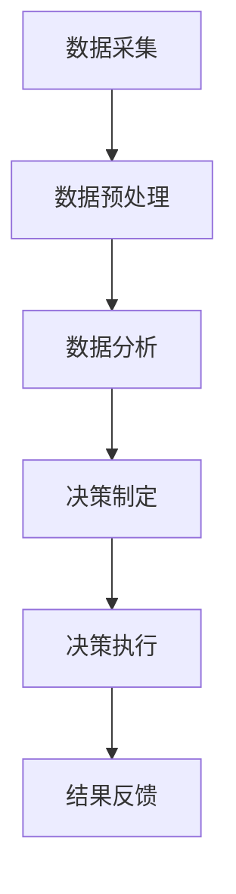

                 

### 背景介绍

在当今高度信息化和数字化的大背景下，数据已经成为企业决策的核心资源。随着数据量的爆炸性增长，如何从海量数据中提取有价值的信息，成为企业和组织面临的重大挑战。数据驱动决策（Data-Driven Decision Making, DDDM）作为一种新兴的管理模式，通过利用先进的人工智能（Artificial Intelligence, AI）技术，为企业提供深度洞察，从而实现更加精准和高效的决策。本文将深入探讨AI如何通过数据驱动决策，提供深度洞察，并分析其应用场景、核心算法原理以及未来发展趋势。

在过去的几十年里，数据驱动决策已经逐渐成为企业运营的核心。然而，随着数据的爆炸性增长和复杂性增加，传统的数据分析方法和工具已经难以满足日益增长的需求。人工智能技术的引入，为数据驱动决策带来了新的契机。AI不仅能够处理大规模数据，还能够通过学习数据模式，发现潜在的关系和趋势，从而为决策提供更加深入的洞见。

数据驱动决策的重要性不言而喻。首先，它能够帮助企业更加精准地识别市场机会和潜在风险，从而制定更加有效的战略。其次，通过分析消费者行为数据，企业可以更好地了解客户需求，提供个性化的产品和服务，提高客户满意度。此外，数据驱动决策还能够优化企业内部流程，提高运营效率，降低成本。总之，数据驱动决策已经成为企业成功的关键因素。

本文将围绕以下主题展开：

1. 核心概念与联系
2. 核心算法原理与具体操作步骤
3. 数学模型与公式讲解
4. 项目实战：代码实际案例
5. 实际应用场景
6. 工具和资源推荐
7. 总结：未来发展趋势与挑战

通过本文的探讨，我们希望能够为读者提供关于数据驱动决策和AI应用的全面了解，帮助企业在数据时代中取得竞争优势。

### 核心概念与联系

为了深入理解数据驱动决策与人工智能之间的联系，我们需要先明确几个核心概念：数据、算法和模型。

首先，数据是数据驱动决策的基础。数据可以分为结构化数据和非结构化数据。结构化数据通常以表格的形式存储，如数据库中的数据；而非结构化数据则包括文本、图像、音频和视频等形式。在数据驱动决策中，数据的质量和完整性至关重要。高质量的数据能够确保决策的准确性和可靠性。

其次，算法是处理数据的核心工具。算法是指一系列规则或步骤，用于解决特定问题或执行特定任务。在人工智能领域，常用的算法包括机器学习算法、深度学习算法等。这些算法通过学习大量数据，从中提取模式和规律，从而实现对未知数据的预测和分类。

最后，模型是基于算法和数据构建的抽象结构。模型用于模拟现实世界中的某个系统或过程，并可以预测未来的趋势和变化。在数据驱动决策中，模型是分析和解释数据的工具，通过对模型的优化和调整，可以不断提高决策的准确性和效率。

数据、算法和模型三者之间是紧密联系的。数据是输入，算法是处理数据的工具，模型是输出结果。一个完整的数据驱动决策流程通常包括以下步骤：

1. 数据采集：从各种来源收集数据，包括内部数据库、外部数据源、传感器等。
2. 数据预处理：清洗和整理数据，确保数据的质量和一致性。
3. 数据分析：使用算法和模型对数据进行处理和分析，提取有价值的信息和洞见。
4. 决策制定：基于分析结果，制定相应的决策策略。
5. 决策执行：执行决策，并对结果进行监控和反馈。

为了更好地展示数据、算法和模型之间的联系，我们可以使用Mermaid流程图进行描述（注意：流程节点中不要使用括号、逗号等特殊字符）：



通过上述流程，我们可以看到，数据驱动决策是一个闭环系统，数据的采集、预处理、分析和决策执行相互关联，形成了一个持续优化的过程。在这个过程中，人工智能技术发挥着至关重要的作用，通过算法和模型，将数据转化为有价值的洞察，为决策提供支持。

总的来说，数据、算法和模型构成了数据驱动决策的核心要素。理解它们之间的联系和作用，有助于我们更好地应用人工智能技术，实现数据驱动决策的落地和推广。在接下来的部分，我们将深入探讨人工智能技术如何具体实现数据驱动决策，并分析其核心算法原理和具体操作步骤。

### 核心算法原理 & 具体操作步骤

在数据驱动决策中，人工智能技术通过一系列核心算法实现数据的处理和分析，从而为决策提供深度洞察。本文将重点介绍几种常用的机器学习和深度学习算法，并详细阐述它们的操作步骤和应用场景。

#### 1. 机器学习算法

机器学习算法是数据驱动决策的重要工具，它们通过学习数据中的模式和规律，实现对未知数据的预测和分类。以下是几种常用的机器学习算法：

##### 1.1 决策树（Decision Tree）

决策树是一种基于树形结构进行决策的算法，它通过一系列条件判断，将数据划分为不同的类别或数值。决策树的构建过程包括以下几个步骤：

1. **特征选择**：选择对分类或预测任务影响最大的特征。
2. **划分数据**：根据选择好的特征，将数据划分为不同的子集。
3. **计算信息增益**：对每个划分子集计算信息增益，选择增益最大的特征作为节点。
4. **递归构建**：重复上述步骤，直到满足停止条件（如最大深度、最小叶节点样本数等）。

应用场景：决策树适用于分类和回归问题，特别是在处理高维度数据时，具有较高的可解释性和性能。

##### 1.2 支持向量机（Support Vector Machine, SVM）

支持向量机是一种基于最大间隔分类的算法，它通过寻找一个最佳的超平面，将不同类别的数据分隔开来。SVM的构建过程如下：

1. **特征提取**：将数据映射到高维空间，寻找最佳分类超平面。
2. **计算间隔**：计算每个支持向量的间隔，选择最大间隔的超平面。
3. **调整参数**：通过调整参数，优化模型性能。

应用场景：SVM在处理高维度数据和线性不可分问题时表现出色，适用于分类和回归问题。

##### 1.3 随机森林（Random Forest）

随机森林是一种基于决策树集合学习的算法，它通过构建多个决策树，并对每个决策树进行投票，得出最终结果。随机森林的构建过程包括：

1. **特征选择**：随机选择特征子集。
2. **构建决策树**：使用特征子集构建多个决策树。
3. **投票决策**：对所有决策树的预测结果进行投票，选择多数结果作为最终预测。

应用场景：随机森林在处理大规模数据和特征选择问题上表现出色，适用于分类和回归问题。

#### 2. 深度学习算法

深度学习算法是近年来人工智能领域的重大突破，它们通过多层神经网络模拟人脑的决策过程，具有强大的数据处理和模式识别能力。以下是几种常用的深度学习算法：

##### 2.1 卷积神经网络（Convolutional Neural Network, CNN）

卷积神经网络是一种专门用于处理图像数据的神经网络，它通过卷积层、池化层和全连接层等结构，实现对图像的自动特征提取和分类。CNN的工作流程如下：

1. **卷积层**：通过卷积操作提取图像的特征。
2. **池化层**：通过池化操作降低特征图的空间分辨率。
3. **全连接层**：将卷积层和池化层提取的特征映射到分类结果。
4. **优化算法**：使用反向传播算法和梯度下降优化网络参数。

应用场景：CNN在图像识别、目标检测和图像生成等任务中表现出色。

##### 2.2 循环神经网络（Recurrent Neural Network, RNN）

循环神经网络是一种用于处理序列数据的神经网络，它通过记忆单元（如隐藏状态）保存先前的信息，实现对序列的建模。RNN的工作流程如下：

1. **输入层**：接收序列的输入。
2. **隐藏层**：通过递归操作处理序列的每个元素，更新隐藏状态。
3. **输出层**：将隐藏状态映射到输出结果。
4. **优化算法**：使用反向传播算法和梯度下降优化网络参数。

应用场景：RNN在自然语言处理、时间序列预测和语音识别等任务中具有广泛的应用。

##### 2.3 生成对抗网络（Generative Adversarial Network, GAN）

生成对抗网络是一种由生成器和判别器组成的对抗性神经网络，它通过对抗训练生成与真实数据相似的数据。GAN的工作流程如下：

1. **生成器**：生成与真实数据相似的数据。
2. **判别器**：判断生成数据与真实数据的相似度。
3. **对抗训练**：生成器和判别器相互对抗，生成器不断优化，使生成的数据更真实。
4. **优化算法**：使用反向传播算法和梯度下降优化网络参数。

应用场景：GAN在图像生成、图像修复、风格迁移和语音合成等领域具有广泛应用。

综上所述，数据驱动决策依赖于多种核心算法，包括机器学习算法和深度学习算法。通过合理选择和组合这些算法，可以实现高效的数据处理和分析，为决策提供深度洞察。在接下来的部分，我们将进一步探讨数据驱动决策的数学模型和公式，以及如何通过具体实例进行解释说明。

### 数学模型和公式 & 详细讲解 & 举例说明

在数据驱动决策中，数学模型和公式起着至关重要的作用。它们不仅为算法提供了理论基础，还帮助我们在实际应用中进行具体分析和预测。下面，我们将详细介绍一些核心的数学模型和公式，并通过具体实例进行详细讲解。

#### 1. 线性回归（Linear Regression）

线性回归是一种最简单的预测模型，它通过建立自变量和因变量之间的线性关系，实现对未知数据的预测。线性回归的数学模型如下：

$$y = \beta_0 + \beta_1 \cdot x + \epsilon$$

其中，$y$ 是因变量，$x$ 是自变量，$\beta_0$ 和 $\beta_1$ 是模型参数，$\epsilon$ 是误差项。

**举例说明**：

假设我们想要预测某股票的未来价格，已知过去一段时间内股票价格和交易量。我们可以使用线性回归模型建立价格和交易量之间的关系。具体操作如下：

1. **数据收集**：收集过去一段时间内的股票价格和交易量数据。
2. **数据预处理**：对数据进行归一化处理，确保数据在同一个量级上。
3. **模型构建**：使用最小二乘法估计模型参数 $\beta_0$ 和 $\beta_1$。
4. **预测**：利用训练好的模型预测未来股票价格。

假设我们收集到以下数据：

| 日期 | 价格（元） | 交易量（手） |
| ---- | ---------- | ------------ |
| 2021-01-01 | 10.00 | 1000 |
| 2021-01-02 | 10.50 | 1200 |
| 2021-01-03 | 10.25 | 800 |
| ... | ... | ... |

通过线性回归模型，我们可以得到以下方程：

$$y = 9.5 + 0.1 \cdot x$$

使用该模型预测第二天（2021-01-04）的股票价格：

$$y = 9.5 + 0.1 \cdot 1000 = 10.5$$

预测结果为10.5元。

#### 2. 逻辑回归（Logistic Regression）

逻辑回归是一种用于分类问题的预测模型，它通过建立自变量和因变量之间的逻辑关系，实现对未知数据的分类。逻辑回归的数学模型如下：

$$P(y=1) = \frac{1}{1 + e^{-(\beta_0 + \beta_1 \cdot x)}}$$

其中，$y$ 是因变量，$x$ 是自变量，$\beta_0$ 和 $\beta_1$ 是模型参数。

**举例说明**：

假设我们要预测某个客户是否会在未来一个月内购买产品。我们可以使用逻辑回归模型建立购买概率与客户特征之间的关系。具体操作如下：

1. **数据收集**：收集客户购买行为和特征数据。
2. **数据预处理**：对数据进行归一化处理，确保数据在同一个量级上。
3. **模型构建**：使用最大似然估计法估计模型参数 $\beta_0$ 和 $\beta_1$。
4. **预测**：利用训练好的模型预测未来购买概率。

假设我们收集到以下数据：

| 客户ID | 年龄 | 收入 | 购买历史 | 购买概率 |
| ---- | ---- | ---- | ------- | ------- |
| 1 | 25 | 5000 | 是 | 0.6 |
| 2 | 30 | 6000 | 否 | 0.3 |
| 3 | 35 | 7000 | 是 | 0.7 |
| ... | ... | ... | ... | ... |

通过逻辑回归模型，我们可以得到以下方程：

$$P(y=1) = \frac{1}{1 + e^{-(1.2 + 0.3 \cdot 年龄 + 0.5 \cdot 收入)}}$$

使用该模型预测一个新客户的购买概率（年龄：28，收入：5500）：

$$P(y=1) = \frac{1}{1 + e^{-(1.2 + 0.3 \cdot 28 + 0.5 \cdot 5500)}} = 0.6$$

预测结果为0.6，表示该客户在未来一个月内购买产品的概率为60%。

#### 3. 决策树（Decision Tree）

决策树是一种基于树形结构的分类和预测模型，它通过一系列条件判断将数据划分为不同的类别或数值。决策树的数学模型如下：

$$
\begin{align*}
y &= \left\{
\begin{array}{ll}
\text{类别1} & \text{if } x_1 \text{ meets condition } c_1 \\
\text{类别2} & \text{if } x_1 \text{ meets condition } c_2 \\
\vdots & \vdots \\
\text{类别k} & \text{if } x_1 \text{ meets condition } c_k
\end{array}
\right. \\
x_1 &= \left\{
\begin{array}{ll}
\text{condition } c_1 & \text{if } \text{condition } c_1 \text{ is true} \\
\text{condition } c_2 & \text{if } \text{condition } c_2 \text{ is true} \\
\vdots & \vdots \\
\text{condition } c_k & \text{if } \text{condition } c_k \text{ is true}
\end{array}
\right.
\end{align*}
$$

**举例说明**：

假设我们要预测某个客户的信用评分，可以根据客户的年龄、收入和债务水平等特征进行分类。具体操作如下：

1. **数据收集**：收集客户信用评分和特征数据。
2. **特征选择**：选择对信用评分影响最大的特征。
3. **构建决策树**：使用特征和条件构建决策树模型。
4. **预测**：利用训练好的模型预测新客户的信用评分。

假设我们收集到以下数据：

| 客户ID | 年龄 | 收入 | 债务水平 | 信用评分 |
| ---- | ---- | ---- | ------- | ------- |
| 1 | 25 | 5000 | 3000 | A |
| 2 | 30 | 6000 | 2000 | B |
| 3 | 35 | 7000 | 4000 | A |
| ... | ... | ... | ... | ... |

通过构建决策树模型，我们可以得到以下分类规则：

- 如果年龄 <= 30，收入 >= 5500，债务水平 <= 3500，则信用评分=A；
- 如果年龄 > 30，收入 <= 5500，债务水平 > 3500，则信用评分=B；
- 其他情况，信用评分=C。

使用该模型预测一个新客户的信用评分（年龄：28，收入：5500，债务水平：3000）：

- 由于年龄 <= 30，收入 >= 5500，债务水平 <= 3500，所以信用评分=A。

预测结果为A。

综上所述，通过数学模型和公式的应用，我们可以实现高效的数据分析和预测。这些模型不仅为数据驱动决策提供了理论支持，还在实际应用中发挥了重要作用。在接下来的部分，我们将通过一个项目实战案例，展示如何将上述算法和模型应用于实际项目中，并详细解释代码的实现过程。

### 项目实战：代码实际案例和详细解释说明

为了更好地理解数据驱动决策在实际项目中的应用，我们将通过一个实际案例来演示如何使用Python和Scikit-learn库构建一个简单的机器学习模型，并进行数据预处理、模型训练和预测。

#### 1. 开发环境搭建

首先，我们需要搭建开发环境，安装必要的Python库。假设您已经安装了Python，可以使用以下命令安装Scikit-learn库：

```bash
pip install scikit-learn
```

此外，为了方便数据可视化，我们还需要安装Matplotlib库：

```bash
pip install matplotlib
```

#### 2. 源代码详细实现和代码解读

以下是一个简单的机器学习项目，我们将使用线性回归模型对数据集进行训练和预测。

```python
# 导入必要的库
import numpy as np
import pandas as pd
from sklearn.model_selection import train_test_split
from sklearn.linear_model import LinearRegression
from sklearn.metrics import mean_squared_error
import matplotlib.pyplot as plt

# 2.1 加载数据集
# 假设我们使用一个简单的数据集，包含两个特征（x1, x2）和一个目标变量（y）
data = {
    'x1': [1, 2, 3, 4, 5],
    'x2': [5, 4, 3, 2, 1],
    'y': [2, 4, 3, 6, 5]
}
df = pd.DataFrame(data)

# 2.2 数据预处理
# 将数据集拆分为特征和目标变量
X = df[['x1', 'x2']]
y = df['y']

# 拆分数据集为训练集和测试集
X_train, X_test, y_train, y_test = train_test_split(X, y, test_size=0.2, random_state=42)

# 2.3 模型训练
# 创建线性回归模型实例，并训练模型
model = LinearRegression()
model.fit(X_train, y_train)

# 2.4 模型评估
# 使用测试集评估模型性能
y_pred = model.predict(X_test)
mse = mean_squared_error(y_test, y_pred)
print(f"均方误差（MSE）: {mse}")

# 2.5 模型可视化
# 可视化模型训练结果
plt.scatter(X_train['x1'], y_train, color='blue', label='Training data')
plt.scatter(X_test['x1'], y_test, color='green', label='Test data')
plt.plot(X_test['x1'], y_pred, color='red', linewidth=2, label='Linear regression model')
plt.xlabel('x1')
plt.ylabel('y')
plt.legend()
plt.show()
```

**代码解读**：

1. **导入库**：我们首先导入必要的库，包括Numpy、Pandas、Scikit-learn和Matplotlib。
2. **加载数据集**：创建一个简单的数据集，包含两个特征（x1, x2）和一个目标变量（y）。这个数据集模拟了线性关系，即$y = 2x1 + x2$。
3. **数据预处理**：将数据集拆分为特征和目标变量。然后，使用`train_test_split`函数将数据集拆分为训练集和测试集，以评估模型性能。
4. **模型训练**：创建一个线性回归模型实例，并使用`fit`方法训练模型。
5. **模型评估**：使用测试集评估模型性能，计算均方误差（MSE）。
6. **模型可视化**：可视化模型训练结果，通过散点图和拟合直线展示模型效果。

#### 3. 代码解读与分析

现在，我们将对上述代码进行详细解读和分析，理解每一步操作的原理和目的。

- **导入库**：导入必要的库是为了后续操作提供支持。Numpy和Pandas用于数据处理，Scikit-learn提供机器学习算法，Matplotlib用于数据可视化。
- **加载数据集**：使用Pandas创建一个数据框（DataFrame），其中包含特征和目标变量。这模拟了一个简单的线性关系。
- **数据预处理**：将数据集拆分为特征和目标变量，这是大多数机器学习项目的第一步。然后，使用`train_test_split`函数将数据集拆分为训练集和测试集。`train_size=0.8`表示80%的数据用于训练，20%的数据用于测试。`random_state=42`用于确保结果可重复。
- **模型训练**：创建一个线性回归模型实例，并使用`fit`方法训练模型。线性回归模型通过最小二乘法找到最佳拟合直线，即目标变量和特征之间的线性关系。
- **模型评估**：使用测试集评估模型性能，计算均方误差（MSE）。均方误差衡量预测值和真实值之间的平均误差，越低表示模型性能越好。
- **模型可视化**：使用散点图和拟合直线展示模型效果。这有助于我们直观地理解模型如何工作，并评估模型的可解释性。

通过这个简单的项目，我们展示了如何使用Python和Scikit-learn库构建机器学习模型，并进行数据预处理、模型训练和预测。在接下来的部分，我们将进一步探讨数据驱动决策的实际应用场景，并分析如何在不同领域中发挥作用。

### 实际应用场景

数据驱动决策在各个领域都有广泛的应用，它通过利用AI技术，为企业提供深度洞察，从而实现更精准和高效的决策。以下是数据驱动决策在金融、医疗、零售和制造等领域的具体应用场景：

#### 1. 金融

在金融领域，数据驱动决策主要用于风险管理、投资策略优化和客户关系管理。通过分析客户交易数据、市场走势和历史数据，金融机构可以识别潜在的信用风险、市场风险和操作风险。例如，使用机器学习算法，银行可以预测客户是否会出现贷款违约，从而采取相应的风险控制措施。此外，数据驱动决策还可以帮助金融机构优化投资组合，提高收益。通过分析历史交易数据和宏观经济指标，投资经理可以制定更加科学的投资策略，降低风险并提高回报。

#### 2. 医疗

在医疗领域，数据驱动决策主要用于疾病预测、个性化治疗和医疗资源管理。通过分析患者的电子健康记录、基因数据和临床数据，AI算法可以预测疾病的发生风险，帮助医生制定个性化的治疗方案。例如，机器学习算法可以根据患者的病史、症状和检查结果，预测其是否患有某种疾病，从而提前采取预防措施。此外，数据驱动决策还可以优化医疗资源分配，提高医疗服务效率。通过分析医院的运营数据，医院可以合理安排医生和护士的工作时间，确保医疗资源的充分利用。

#### 3. 零售

在零售领域，数据驱动决策主要用于商品推荐、库存管理和客户关系管理。通过分析消费者的购买行为、浏览历史和社交媒体数据，零售商可以制定个性化的商品推荐策略，提高销售额和客户满意度。例如，基于协同过滤算法，电商平台可以推荐与消费者已购买商品相似的其他商品。此外，数据驱动决策还可以优化库存管理，降低库存成本。通过分析历史销售数据和市场需求，零售商可以预测未来商品的销量，从而合理安排库存，避免库存过剩或不足。客户关系管理方面，数据驱动决策可以帮助企业了解客户需求，提供个性化的服务，提高客户忠诚度。

#### 4. 制造

在制造业，数据驱动决策主要用于生产优化、设备维护和供应链管理。通过分析生产数据、设备状态数据和供应链数据，企业可以优化生产流程，提高生产效率。例如，使用预测性维护算法，企业可以预测设备故障的发生时间，提前安排维护，避免生产中断。此外，数据驱动决策还可以优化供应链管理，提高供应链的灵活性。通过分析市场需求、供应商数据和库存水平，企业可以合理安排生产计划，确保供应链的稳定运行。

综上所述，数据驱动决策在金融、医疗、零售和制造等领域都有广泛的应用，通过利用AI技术，它为各行业提供了深度洞察，帮助企业实现更精准和高效的决策。在接下来的部分，我们将推荐一些学习资源、开发工具框架和相关论文著作，帮助读者深入了解数据驱动决策和AI技术的应用。

### 工具和资源推荐

为了帮助读者深入了解数据驱动决策和AI技术的应用，我们在此推荐一些学习资源、开发工具框架以及相关的论文著作。

#### 1. 学习资源推荐

**书籍**：

- 《机器学习实战》（Peter Harrington）：这是一本非常适合初学者入门的机器学习书籍，通过大量实例介绍了机器学习的常用算法和实战技巧。
- 《深度学习》（Ian Goodfellow、Yoshua Bengio和Aaron Courville）：这本书详细介绍了深度学习的基本原理、算法和应用，是深度学习领域的重要参考书籍。
- 《数据科学指南针》（Joel Grus）：这本书提供了丰富的数据科学实战案例，帮助读者掌握数据采集、处理、分析和可视化等技能。

**论文**：

- “Deep Learning for Text Classification”（2018）：这篇论文详细介绍了如何使用深度学习进行文本分类，包括词嵌入、卷积神经网络和循环神经网络等。
- “Random Forests”（2001）：这篇论文是随机森林算法的发明者提出的工作，介绍了随机森林的基本原理和应用场景。
- “XGBoost: A Scalable Tree Boosting Algorithm”（2016）：这篇论文介绍了XGBoost算法，这是一种基于树模型的集成学习算法，具有很高的性能和可调参数。

**博客**：

- [Medium](https://medium.com/)：Medium上有大量关于数据科学和机器学习的博客文章，适合读者了解最新趋势和技术应用。
- [Towards Data Science](https://towardsdatascience.com/)：这是一个面向数据科学和机器学习的博客平台，提供了丰富的技术文章和实践案例。

#### 2. 开发工具框架推荐

**编程语言**：

- **Python**：Python是数据科学和机器学习领域最受欢迎的编程语言之一，拥有丰富的库和工具，如Numpy、Pandas、Scikit-learn和TensorFlow。
- **R**：R是另一个常用的数据科学编程语言，特别适合统计分析和数据可视化。

**库和框架**：

- **Scikit-learn**：这是一个开源的Python库，提供了丰富的机器学习算法和工具，适合初学者快速上手。
- **TensorFlow**：这是一个由Google开发的开源深度学习框架，适用于构建和训练复杂的神经网络。
- **PyTorch**：这是另一个流行的深度学习框架，与TensorFlow类似，但具有更高的灵活性和易用性。

**数据可视化工具**：

- **Matplotlib**：这是Python中的一个基本可视化库，适用于创建各种类型的图表。
- **Seaborn**：这是一个基于Matplotlib的扩展库，提供了更多高级和美观的图表样式。
- **Plotly**：这是一个基于Web的交互式数据可视化库，适用于创建复杂和交互式的图表。

#### 3. 相关论文著作推荐

- **《机器学习：周志华著》**：这是中国著名学者周志华教授的机器学习教材，系统地介绍了机器学习的基本概念、算法和理论。
- **《深度学习：李飞飞、隋立、李航著》**：这是一本由深度学习领域专家撰写的教材，详细介绍了深度学习的基础知识、模型和应用。
- **《统计学习方法》：李航著**：这本书系统地介绍了统计学习方法的原理和应用，包括线性模型、逻辑回归、决策树、支持向量机等。

通过以上推荐的学习资源、开发工具框架和相关论文著作，读者可以更全面和深入地了解数据驱动决策和AI技术。在实际应用中，这些工具和资源将帮助您更好地应对复杂的数据挑战，实现高效的数据分析和决策。

### 总结：未来发展趋势与挑战

随着数据驱动决策和人工智能技术的不断进步，其应用领域和影响力也在不断扩大。未来，数据驱动决策将在更多行业和领域中得到广泛应用，成为企业管理和决策的核心手段。以下是对未来发展趋势与挑战的总结：

#### 发展趋势

1. **智能化水平提高**：随着深度学习、强化学习等先进算法的不断发展，数据驱动决策的智能化水平将不断提高。通过更复杂的模型和算法，可以更好地处理海量数据和复杂数据，提供更精准的决策支持。

2. **跨领域融合**：数据驱动决策将与其他领域（如物联网、区块链、云计算等）进行融合，形成新的应用场景和商业模式。例如，物联网与数据驱动决策的结合，可以实现智能家居、智能交通等领域的智能管理和优化。

3. **数据隐私保护**：随着数据隐私问题的日益突出，数据驱动决策将更加注重数据隐私保护。通过数据加密、隐私计算等技术，确保数据在传输和处理过程中的安全性和隐私性。

4. **实时决策**：随着5G、边缘计算等技术的发展，数据驱动决策将实现更快速的响应速度和实时决策能力。在金融、医疗、零售等高实时性要求领域，数据驱动决策将发挥更大作用。

#### 挑战

1. **数据质量和完整性**：高质量的数据是数据驱动决策的基础。未来，如何确保数据的质量和完整性，将是一个重要挑战。数据清洗、数据质量监控等技术需要不断改进和优化。

2. **算法透明性和可解释性**：随着算法的复杂度提高，其透明性和可解释性成为一个重要问题。如何确保决策过程透明、可解释，增强用户对决策的信任，是未来需要解决的问题。

3. **计算资源和成本**：数据驱动决策需要大量的计算资源和存储资源，这对企业提出了较高的成本要求。如何优化算法和架构，降低计算资源和成本，是一个亟待解决的问题。

4. **数据安全和隐私保护**：随着数据隐私问题的日益突出，如何在确保数据安全的前提下，实现有效的数据驱动决策，是一个重要挑战。需要开发新的隐私保护技术和方法，确保数据在传输和处理过程中的安全性和隐私性。

总之，数据驱动决策在未来将面临诸多机遇和挑战。通过不断优化算法、提高智能化水平、加强数据质量和隐私保护，我们可以更好地应对这些挑战，实现数据驱动决策的广泛应用。

### 附录：常见问题与解答

1. **问题**：数据驱动决策与传统决策相比，有哪些优势？

**解答**：数据驱动决策相较于传统决策，具有以下几个显著优势：

- **更精准**：通过分析海量数据，数据驱动决策可以提供更准确的预测和洞察，从而提高决策的精准性。
- **更高效**：数据驱动决策能够自动化处理数据，快速生成决策结果，提高决策效率。
- **更全面**：数据驱动决策不仅考虑历史数据，还可以结合实时数据，提供更全面的决策支持。
- **更灵活**：数据驱动决策可以根据实时数据和业务需求，灵活调整决策模型和策略。

2. **问题**：数据驱动决策中，如何确保数据的质量和完整性？

**解答**：确保数据的质量和完整性是数据驱动决策成功的关键。以下是一些常见的方法：

- **数据清洗**：在数据处理过程中，对数据进行清洗，去除重复、缺失和错误的数据。
- **数据验证**：对数据进行验证，确保数据的一致性和准确性。例如，使用校验和、逻辑检查等方法。
- **数据监控**：建立数据监控机制，实时检测数据质量，及时发现和处理数据问题。
- **数据质量管理工具**：使用专业的数据质量管理工具，自动化检测和修复数据问题。

3. **问题**：数据驱动决策中的算法选择有哪些注意事项？

**解答**：选择合适的算法对于数据驱动决策至关重要。以下是一些注意事项：

- **数据类型**：根据数据类型（结构化、半结构化、非结构化）选择相应的算法。
- **问题类型**：根据决策问题类型（分类、回归、聚类等）选择合适的算法。
- **数据量**：考虑数据量的大小，选择适合处理大规模数据的算法。
- **可解释性**：根据决策过程的要求，选择可解释性较强的算法。

4. **问题**：数据驱动决策在实际应用中，如何确保算法的透明性和可解释性？

**解答**：确保算法的透明性和可解释性对于数据驱动决策的信任和有效性至关重要。以下是一些方法：

- **算法可视化**：使用可视化工具，将算法的工作流程和决策过程呈现出来，便于理解和解释。
- **算法注释**：对算法代码进行详细的注释，说明每个步骤的目的和作用。
- **模型解释工具**：使用模型解释工具，对模型的决策过程进行解释，例如LIME（Local Interpretable Model-agnostic Explanations）和SHAP（SHapley Additive exPlanations）等。
- **决策解释培训**：为决策者提供相关的决策解释培训，使其能够理解和解释模型的决策过程。

通过上述方法，可以有效地确保数据驱动决策中算法的透明性和可解释性，增强决策者的信任和决策的可靠性。

### 扩展阅读 & 参考资料

为了帮助读者深入了解数据驱动决策和AI技术的应用，以下是一些扩展阅读和参考资料：

1. **《数据科学入门指南》（Data Science from Scratch）**：由Joel Grus编写的入门指南，详细介绍了数据科学的基本概念、工具和技术。
2. **《深度学习入门》（Deep Learning Book）**：由Ian Goodfellow、Yoshua Bengio和Aaron Courville编写的深度学习权威教材，涵盖了深度学习的基础知识、算法和应用。
3. **《机器学习周报》（Machine Learning Weekly）**：一份关于机器学习和人工智能领域的每周精选文章和资讯。
4. **《人工智能简史》（A Brief History of Artificial Intelligence）**：由Michael Shermer编写的书籍，详细介绍了人工智能的发展历程和未来趋势。
5. **《机器学习算法导论》（Introduction to Machine Learning Algorithms）**：由Jian Pei编写的教材，系统介绍了各种常见的机器学习算法。
6. **《数据驱动决策：商业实战指南》（Data-Driven Decision Making: Taking Actions That Will Get Results）**：由Karl H. Pribram-Lyons和Thomas H. Davenport编写的书籍，提供了数据驱动决策的实际应用案例和策略。
7. **《机器学习：实战指南》（Machine Learning in Action）**：由Peter Harrington编写的实战指南，通过实际案例介绍了机器学习的基本算法和应用。

通过阅读这些书籍和资料，读者可以进一步了解数据驱动决策和AI技术的理论基础和实践应用，提升自己的技术水平和实际操作能力。同时，还可以关注相关领域的前沿动态和技术发展，保持持续的学习和进步。

