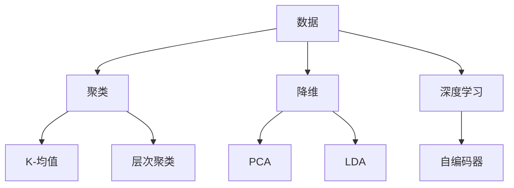

                 

# 无监督学习(Unsupervised Learning) - 原理与代码实例讲解

> 关键词：无监督学习、数据挖掘、聚类算法、降维算法、深度学习、实例讲解

> 摘要：本文将深入探讨无监督学习的基本概念、核心算法原理及其在实际应用中的代码实例，帮助读者全面理解无监督学习在数据挖掘和人工智能领域的应用。

## 1. 背景介绍

在机器学习的领域中，根据监督方式的不同，主要分为监督学习（Supervised Learning）和无监督学习（Unsupervised Learning）两种。监督学习是指学习过程中，训练样本既包含特征也包含对应的标签，模型通过学习这些标签来预测未知数据。而无监督学习则是在没有标签的情况下，通过发现数据中的内在结构来进行学习。

无监督学习在许多实际应用场景中具有重要作用，如数据挖掘、图像识别、社交网络分析等。其核心目标包括：

- **聚类（Clustering）**：将相似的数据分组，形成若干个簇。
- **降维（Dimensionality Reduction）**：减少数据维度，同时保留数据的主要信息。
- **关联规则学习（Association Rule Learning）**：发现数据间的关联规则。
- **异常检测（Anomaly Detection）**：识别数据中的异常或离群点。

## 2. 核心概念与联系

### 2.1 数据分布与聚类

无监督学习中的聚类算法是一种基于数据分布的分组方法。其主要目的是通过聚类使得同一簇中的数据点尽可能相似，而不同簇中的数据点尽可能不同。常见的聚类算法包括K-均值（K-Means）、层次聚类（Hierarchical Clustering）等。

### 2.2 数据维度与降维

降维算法通过减少数据维度，降低计算复杂度，同时保持数据的主要信息。常见的降维算法包括主成分分析（PCA）、线性判别分析（LDA）等。降维不仅可以提高模型的性能，还可以帮助人们更好地理解和解释数据。

### 2.3 深度学习与无监督学习

随着深度学习的兴起，无监督学习在神经网络模型中的应用也越来越广泛。例如，自编码器（Autoencoder）就是一种典型的深度学习模型，用于实现降维和特征提取。

### 2.4 Mermaid 流程图



## 3. 核心算法原理 & 具体操作步骤

### 3.1 K-均值聚类算法

K-均值聚类算法是一种迭代优化算法，其基本步骤如下：

1. **初始化**：随机选择K个数据点作为初始聚类中心。
2. **分配**：计算每个数据点到各个聚类中心的距离，将数据点分配到最近的聚类中心。
3. **更新**：重新计算每个聚类中心的均值，更新聚类中心。
4. **迭代**：重复步骤2和3，直到聚类中心的变化小于某个阈值或达到预设的迭代次数。

### 3.2 主成分分析（PCA）

主成分分析是一种线性降维方法，其基本步骤如下：

1. **数据标准化**：将数据集每个特征缩放到相同的尺度。
2. **计算协方差矩阵**：计算数据集的协方差矩阵。
3. **特征值和特征向量**：计算协方差矩阵的特征值和特征向量。
4. **选择主成分**：选择特征值最大的K个特征向量，构成K个主成分。
5. **数据降维**：将数据映射到K个主成分空间。

### 3.3 自编码器

自编码器是一种基于神经网络的降维方法，其基本结构包括编码器和解码器：

1. **编码器**：将输入数据压缩为一个低维隐层表示。
2. **解码器**：将隐层表示扩展回原始数据维度。
3. **损失函数**：通过损失函数（如均方误差）来优化编码器和解码器的参数。

## 4. 数学模型和公式 & 详细讲解 & 举例说明

### 4.1 K-均值聚类算法

假设有K个聚类中心$c_1, c_2, ..., c_K$，每个数据点$x_i$被分配到最近的聚类中心，即：

$$
\min_{c_1, c_2, ..., c_K} \sum_{i=1}^n \sum_{j=1}^K (x_i - c_j)^2
$$

其中，$n$是数据点的个数，$d$是特征维度。

### 4.2 主成分分析（PCA）

假设数据集$X$的协方差矩阵为$C$，特征值为$\lambda_1, \lambda_2, ..., \lambda_d$，特征向量为$v_1, v_2, ..., v_d$，则有：

$$
C = V\Lambda V^T
$$

其中，$V$是对角矩阵，对角线元素为特征向量，$\Lambda$是对角矩阵，对角线元素为特征值。

选择特征值最大的K个特征向量，组成矩阵$V_K$，则数据集$X$的K个主成分表示为：

$$
Z = XV_K
$$

### 4.3 自编码器

假设自编码器的编码器和解码器的隐层神经元个数为$K$，输入数据维度为$d$，则有：

$$
\text{编码器：} z = \sigma(W_1X)
$$

$$
\text{解码器：} \hat{x} = \sigma(W_2z)
$$

其中，$W_1$和$W_2$是权重矩阵，$\sigma$是激活函数（如Sigmoid函数）。

损失函数（如均方误差）为：

$$
J = \frac{1}{n}\sum_{i=1}^n (\hat{x}_i - x_i)^2
$$

## 5. 项目实战：代码实际案例和详细解释说明

### 5.1 开发环境搭建

本文使用Python和常见的数据科学库，如NumPy、Scikit-Learn、Matplotlib等。

```bash
pip install numpy scikit-learn matplotlib
```

### 5.2 源代码详细实现和代码解读

以下是K-均值聚类算法的Python实现：

```python
import numpy as np
from sklearn.cluster import KMeans
import matplotlib.pyplot as plt

# 数据集
X = np.array([[1, 2], [1, 4], [1, 0],
              [10, 2], [10, 4], [10, 0]])

# K-均值聚类
kmeans = KMeans(n_clusters=2, random_state=0).fit(X)
labels = kmeans.labels_
centroids = kmeans.cluster_centers_

# 绘图
plt.figure(figsize=(8, 6))
plt.scatter(X[:, 0], X[:, 1], c=labels, s=100, cmap='viridis')
plt.scatter(centroids[:, 0], centroids[:, 1], c='red', s=200, alpha=0.75, marker='s')
plt.xlabel('Feature 1')
plt.ylabel('Feature 2')
plt.title('K-Means Clustering')
plt.show()
```

以下是主成分分析（PCA）的Python实现：

```python
from sklearn.decomposition import PCA

# 数据集
X = np.array([[1, 2], [1, 4], [1, 0],
              [10, 2], [10, 4], [10, 0]])

# 主成分分析
pca = PCA(n_components=2).fit(X)
X_pca = pca.transform(X)

# 绘图
plt.figure(figsize=(8, 6))
plt.scatter(X_pca[:, 0], X_pca[:, 1])
plt.xlabel('Principal Component 1')
plt.ylabel('Principal Component 2')
plt.title('PCA')
plt.show()
```

以下是自编码器的Python实现：

```python
from keras.models import Model
from keras.layers import Input, Dense
import numpy as np

# 编码器和解码器模型
input_dim = 2
encoding_dim = 3

input_img = Input(shape=(input_dim,))
encoded = Dense(encoding_dim, activation='relu')(input_img)
decoded = Dense(input_dim, activation='sigmoid')(encoded)

# 自编码器模型
autoencoder = Model(input_img, decoded)
autoencoder.compile(optimizer='adam', loss='binary_crossentropy')

# 训练自编码器
X = np.array([[1, 2], [1, 4], [1, 0],
              [10, 2], [10, 4], [10, 0]])
autoencoder.fit(X, X, epochs=100, batch_size=1, shuffle=False)

# 可视化
encoded_imgs = autoencoder.predict(X)
plt.figure(figsize=(8, 6))
plt.scatter(encoded_imgs[:, 0], encoded_imgs[:, 1])
plt.xlabel('Encoded Feature 1')
plt.ylabel('Encoded Feature 2')
plt.title('Self-Encoder')
plt.show()
```

### 5.3 代码解读与分析

- **K-均值聚类**：通过计算每个数据点到聚类中心的距离，将数据点分配到最近的聚类中心。最终得到聚类中心和数据点的分配结果。
- **主成分分析（PCA）**：通过计算协方差矩阵的特征值和特征向量，将数据映射到主成分空间，实现降维。最后得到降维后的数据。
- **自编码器**：通过编码器将数据压缩为低维隐层表示，解码器将隐层表示扩展回原始数据维度。最终实现数据的降维和特征提取。

## 6. 实际应用场景

无监督学习在数据挖掘和人工智能领域具有广泛的应用，以下列举几个实际应用场景：

- **客户细分（Customer Segmentation）**：通过聚类算法将客户分成不同的群体，以便于精准营销和个性化推荐。
- **图像识别（Image Recognition）**：通过降维算法减少图像数据维度，提高图像识别模型的性能。
- **社交网络分析（Social Network Analysis）**：通过聚类算法发现社交网络中的不同群体，分析群体间的交互关系。
- **异常检测（Anomaly Detection）**：通过无监督学习算法识别数据中的异常或离群点，用于安全监控和风险管理。

## 7. 工具和资源推荐

### 7.1 学习资源推荐

- **书籍**：
  - 《机器学习》（周志华著）
  - 《深度学习》（Ian Goodfellow等著）
- **论文**：
  - “K-Means Clustering Algorithm” by MacQueen et al.
  - “Principal Component Analysis” by Jolliffe
- **博客**：
  - [K-均值聚类算法详解](https://zhuanlan.zhihu.com/p/27214773)
  - [PCA详解与Python实现](https://www.cnblogs.com/pinard/p/7534723.html)
- **网站**：
  - [机器学习中文社区](https://www.mlcsk.com/)
  - [机器学习实战](https://www.mmaction.cn/)

### 7.2 开发工具框架推荐

- **Python数据科学库**：NumPy、Pandas、Scikit-Learn、Matplotlib等
- **深度学习框架**：TensorFlow、PyTorch等
- **在线编程环境**：Google Colab、Jupyter Notebook等

### 7.3 相关论文著作推荐

- “K-Means Clustering Algorithm” by MacQueen et al.
- “Principal Component Analysis” by Jolliffe
- “Autoencoder” by Ranzato et al.
- “Deep Learning” by Ian Goodfellow et al.

## 8. 总结：未来发展趋势与挑战

无监督学习在数据挖掘和人工智能领域具有广泛的应用前景，但仍面临以下挑战：

- **数据质量和可解释性**：无监督学习依赖于数据质量和模型的可解释性，如何在保证数据质量的同时提高模型的可解释性是当前研究的重点。
- **算法复杂度**：随着数据规模的增大，算法的复杂度会显著提高，如何设计高效的无监督学习算法是一个重要问题。
- **跨领域应用**：无监督学习在特定领域的应用已经取得了一定的成果，但如何将其推广到其他领域，实现跨领域的应用是一个具有挑战性的问题。

## 9. 附录：常见问题与解答

### 9.1 什么是无监督学习？

无监督学习是一种机器学习方法，其训练数据不包含标签信息，模型通过发现数据中的内在结构来进行学习。

### 9.2 无监督学习有哪些常见的应用场景？

无监督学习的应用场景包括聚类、降维、关联规则学习、异常检测等。

### 9.3 如何选择合适的无监督学习算法？

选择合适的无监督学习算法需要根据具体问题和数据特点进行，常见的聚类算法包括K-均值、层次聚类等，降维算法包括主成分分析（PCA）等。

### 9.4 无监督学习与深度学习有何区别？

无监督学习和深度学习都是机器学习的方法，但它们的区别在于是否有标签信息。无监督学习没有标签信息，而深度学习通常需要标签信息。

## 10. 扩展阅读 & 参考资料

- [K-均值聚类算法](https://en.wikipedia.org/wiki/K-means_clustering)
- [主成分分析（PCA）](https://en.wikipedia.org/wiki/Principal_component_analysis)
- [自编码器](https://en.wikipedia.org/wiki/Autoencoder)
- [深度学习](https://en.wikipedia.org/wiki/Deep_learning)
- [机器学习](https://en.wikipedia.org/wiki/Machine_learning)

## 作者

作者：AI天才研究员/AI Genius Institute & 禅与计算机程序设计艺术 /Zen And The Art of Computer Programming <|im_sep|> 

