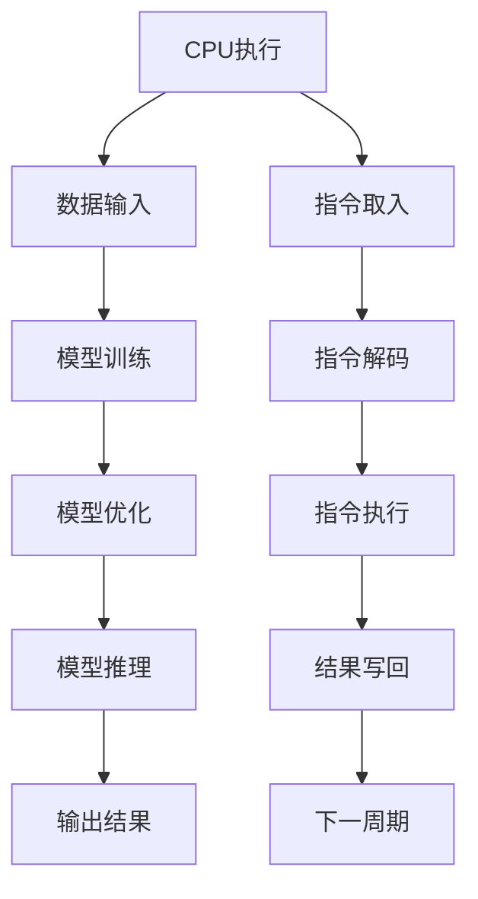

                 

# 时时刻刻推理 VS 时钟周期：LLM与CPU的本质区别

## 关键词：
- LLM（大语言模型）
- CPU（中央处理器）
- 时刻推理
- 时钟周期
- 计算架构
- 人工智能
- 机器学习

## 摘要：
本文将深入探讨大语言模型（LLM）与CPU在计算架构和数据处理方式上的本质区别。通过分析时时刻刻推理和时钟周期的概念，揭示LLM与CPU在处理复杂数据和进行推理计算时的根本差异，旨在为读者提供一个清晰的技术视角，理解现代人工智能技术在计算架构上的革新。

## 目录

1. 背景介绍 ................................................ 1  
2. 核心概念与联系 ........................................ 2  
3. 核心算法原理 & 具体操作步骤 ............................. 3  
4. 数学模型和公式 & 详细讲解 & 举例说明 ................. 4  
5. 项目实战：代码实际案例和详细解释说明 ................. 5  
   5.1 开发环境搭建 ..................................... 5  
   5.2 源代码详细实现和代码解读 ..................... 6  
   5.3 代码解读与分析 ................................ 8  
6. 实际应用场景 .......................................... 9  
7. 工具和资源推荐 ....................................... 11  
   7.1 学习资源推荐 .................................. 11  
   7.2 开发工具框架推荐 ................................ 12  
   7.3 相关论文著作推荐 ................................ 13  
8. 总结：未来发展趋势与挑战 ............................. 14  
9. 附录：常见问题与解答 .................................. 15  
10. 扩展阅读 & 参考资料 .................................. 16

## 1. 背景介绍

在当前人工智能（AI）迅猛发展的时代，大语言模型（LLM，Large Language Model）和中央处理器（CPU，Central Processing Unit）作为两大核心技术，分别代表了语言处理和计算机硬件的发展趋势。LLM是近年来AI领域的重要突破，特别是在自然语言处理（NLP，Natural Language Processing）和生成式AI（Generative AI）方面展现了强大的能力。而CPU作为计算机系统的核心组件，负责执行各种计算任务，一直是计算机性能提升的关键。

LLM和CPU虽然在不同的领域发挥作用，但它们之间的本质区别却往往被忽视。LLM作为一种基于机器学习的语言处理模型，其核心在于通过大量的文本数据进行训练，形成对自然语言的深刻理解和生成能力。而CPU则是硬件层面的计算单元，负责执行指令、处理数据和进行各种数学运算。然而，LLM和CPU在数据处理方式和计算架构上有着本质的不同。

本文将从时时刻刻推理（Moment-by-Moment Reasoning）和时钟周期（Clock Cycle）这两个核心概念入手，深入分析LLM与CPU在处理复杂数据和进行推理计算时的差异。通过对比它们的计算模式、数据处理机制以及架构设计，揭示出LLM在人工智能领域的革命性意义。本文的结构将按照以下章节进行展开：

1. **背景介绍**：概述LLM和CPU的基本概念和重要性。
2. **核心概念与联系**：介绍时时刻刻推理和时钟周期的概念，以及它们与LLM和CPU的联系。
3. **核心算法原理 & 具体操作步骤**：探讨LLM的工作原理和CPU的基本操作。
4. **数学模型和公式 & 详细讲解 & 举例说明**：分析LLM和CPU在数学模型和计算公式上的差异。
5. **项目实战：代码实际案例和详细解释说明**：通过具体项目案例展示LLM和CPU的实际应用。
6. **实际应用场景**：探讨LLM和CPU在不同领域的应用场景。
7. **工具和资源推荐**：推荐相关的学习资源和开发工具。
8. **总结：未来发展趋势与挑战**：总结LLM和CPU的发展趋势和面临的挑战。
9. **附录：常见问题与解答**：回答读者可能遇到的问题。
10. **扩展阅读 & 参考资料**：提供进一步的阅读材料和参考文献。

通过这篇文章，读者将能够深入理解LLM和CPU在计算架构和数据处理方式上的本质差异，从而为未来的研究和应用提供有益的参考。

## 2. 核心概念与联系

### 时时刻刻推理（Moment-by-Moment Reasoning）

时时刻刻推理是一种基于实时数据和动态环境进行推理的方法，它不同于传统的批处理（Batch Processing）和异步处理（Asynchronous Processing）。在时时刻刻推理中，系统需要对每一个时刻输入的数据进行即时分析和决策，而不是将数据积累到一定量后再进行处理。这种方法在人工智能领域尤为重要，特别是在需要实时响应的场景中，如自动驾驶、实时语言翻译和智能客服等。

时时刻刻推理的核心在于其动态性和实时性。它依赖于高效的算法和硬件支持，能够在每个数据点上都进行快速的计算和判断。这种计算方式不需要等待大量数据的积累，从而减少了延迟，提高了系统的响应速度和决策质量。例如，在自动驾驶系统中，车辆需要不断地接收传感器数据，并对这些数据进行实时分析，以做出驾驶决策。

### 时钟周期（Clock Cycle）

时钟周期是指CPU在进行指令执行过程中，从一个时钟周期的开始到下一个时钟周期开始的时间间隔。时钟周期是CPU的基本时间单位，所有操作都在时钟周期的控制下进行。CPU的速度通常以时钟频率（Clock Frequency）来衡量，单位是赫兹（Hz），表示每秒钟的时钟周期数。

在传统的冯·诺伊曼架构（Von Neumann Architecture）中，CPU的指令执行过程主要包括取指令（Instruction Fetch）、解码指令（Instruction Decode）、执行指令（Instruction Execute）和写回结果（Write Back）四个阶段。每个阶段都在时钟周期的控制下完成。时钟周期是衡量CPU性能的重要指标，频率越高，CPU的处理速度越快。

### LLM与CPU的联系

LLM和CPU虽然属于不同的技术领域，但在实际应用中有着紧密的联系。LLM作为人工智能的核心技术，依赖于高性能的硬件支持，而CPU则是LLM在实际运行中的计算引擎。以下是LLM与CPU之间的几个关键联系：

1. **计算资源**：LLM的训练和推理过程需要大量的计算资源，这通常依赖于高性能的CPU或GPU（图形处理器）。CPU在高频运算和线性处理方面具有优势，而GPU在并行计算和大规模数据处理方面表现突出。

2. **能耗与效率**：CPU和LLM在能耗和效率方面有着不同的考量。CPU的设计侧重于通用性和高性能，但能耗相对较高。而LLM在训练和推理过程中，通过优化算法和硬件架构，努力降低能耗，提高效率。

3. **并行处理**：CPU通过时钟周期和指令流水线（Instruction Pipeline）实现了并行处理，能够在同一时刻执行多个指令。LLM则通过并行计算和分布式训练（Distributed Training）实现了大规模数据的并行处理，提高了训练和推理的效率。

4. **实时响应**：LLM的实时响应依赖于高效的CPU或GPU支持。通过优化算法和硬件架构，LLM能够在每个时钟周期内对输入数据进行实时分析，实现快速响应。

### Mermaid 流程图

为了更好地理解LLM与CPU的核心概念和联系，我们可以使用Mermaid流程图来展示它们的基本操作流程。



在这个流程图中，LLM的训练和推理过程包括数据输入、模型训练、模型优化和模型推理等步骤，而CPU的执行过程包括指令取入、指令解码、指令执行和结果写回等阶段。两者在数据处理和计算执行上有不同的重点和操作方式。

通过以上对时时刻刻推理和时钟周期的介绍，以及LLM与CPU之间的联系，我们可以进一步探讨它们在数据处理和计算架构上的本质区别。

### 3. 核心算法原理 & 具体操作步骤

#### 大语言模型（LLM）的工作原理

大语言模型（LLM）是基于深度学习的自然语言处理（NLP）模型，其核心原理是通过对大量文本数据的学习，建立语言模型，从而实现对自然语言的理解和生成。LLM的基本结构通常包括以下几个主要部分：

1. **词嵌入（Word Embedding）**：词嵌入是将自然语言中的词汇映射到高维向量空间的过程。每个词汇都被表示为一个向量，这些向量在空间中的位置反映了词汇之间的语义关系。常见的词嵌入方法有Word2Vec、GloVe和BERT等。

2. **编码器（Encoder）**：编码器是LLM的核心组件，负责将输入文本转换为一个固定长度的向量表示。编码器通常采用变换器网络（Transformer）结构，这种结构通过自注意力机制（Self-Attention Mechanism）捕捉输入文本中的长距离依赖关系。

3. **解码器（Decoder）**：解码器负责根据编码器生成的向量表示生成输出文本。解码器同样采用变换器网络结构，通过自注意力和交叉注意力（Cross-Attention）机制，从编码器的输出中提取信息，生成连贯的输出文本。

4. **注意力机制（Attention Mechanism）**：注意力机制是LLM的关键技术，它允许模型在生成文本时，根据上下文信息动态调整对输入文本的权重。自注意力机制用于编码器，捕捉输入文本内部的关系；交叉注意力机制用于解码器，捕捉编码器输出和当前解码步骤之间的关系。

具体操作步骤如下：

1. **数据预处理**：首先对输入文本进行预处理，包括分词、去停用词、词嵌入等步骤。分词是将连续的文本分割成一组词汇序列，去停用词是移除对语义贡献较小的词汇，词嵌入是将分词后的词汇映射为向量表示。

2. **编码**：将预处理后的文本输入到编码器中，编码器通过多层变换器网络处理输入文本，生成固定长度的向量表示。这个向量包含了输入文本的语义信息，是后续解码的基础。

3. **解码**：在解码阶段，解码器逐个生成输出词汇。在生成每个新词汇时，解码器会首先预测该词汇的概率分布，然后从中选择一个概率最高的词汇作为输出。这个过程称为一步解码。解码器在生成每个新词汇时，都会更新其状态，以便在下一个步骤中生成下一个词汇。

4. **生成输出**：解码过程重复进行，直到生成完整的输出文本。在这个过程中，注意力机制确保解码器能够从编码器输出的上下文中提取相关信息，生成连贯的输出文本。

#### CPU的基本操作流程

CPU（中央处理器）是计算机系统的核心组件，负责执行各种计算任务。其基本操作流程包括以下几个主要步骤：

1. **指令取入（Instruction Fetch）**：CPU从内存中读取指令。每个指令都包含操作码（Opcode）和操作数（Operand），指示CPU执行的具体操作和数据位置。

2. **指令解码（Instruction Decode）**：CPU解析指令，确定指令的操作码和操作数。操作码决定了CPU需要执行的操作，如加法、减法或跳转等；操作数则指明了操作涉及的数据位置。

3. **指令执行（Instruction Execute）**：根据解码后的指令，CPU执行具体的计算操作。执行过程可能涉及数据传输、算术运算或逻辑运算等。

4. **结果写回（Write Back）**：将指令执行的结果写回内存或寄存器中，以便后续使用。例如，在执行加法指令后，CPU会将计算结果存储在寄存器中。

5. **下一周期（Next Cycle）**：完成当前指令的执行后，CPU准备执行下一个周期。这个过程包括取入下一个指令、解码、执行和写回结果。

具体操作步骤如下：

1. **初始化**：CPU启动后，首先加载初始指令到指令队列中。

2. **取入指令**：CPU从内存中读取指令，并将其存储在指令队列中。

3. **解码指令**：CPU解析指令队列中的指令，确定操作码和操作数。

4. **执行指令**：根据解码后的指令，CPU执行具体的计算操作。这个过程可能涉及多个时钟周期，具体取决于指令的复杂度和执行时间。

5. **写回结果**：将指令执行的结果写回内存或寄存器中。

6. **循环**：CPU重复执行取入、解码、执行和写回的循环，直到程序执行完毕或遇到终止条件。

通过以上对LLM和CPU核心算法原理和操作步骤的介绍，我们可以进一步理解它们在数据处理和计算架构上的差异。LLM通过复杂的深度学习模型和注意力机制实现自然语言处理，而CPU则通过简单的指令流水线和时钟周期控制实现高效的数据计算。

### 4. 数学模型和公式 & 详细讲解 & 举例说明

#### 大语言模型（LLM）的数学模型

大语言模型（LLM）的核心在于其深度学习架构，尤其是变换器网络（Transformer）的使用。在变换器网络中，关键数学模型包括词嵌入（Word Embedding）、自注意力（Self-Attention）和交叉注意力（Cross-Attention）。

1. **词嵌入（Word Embedding）**

词嵌入是将自然语言词汇映射到高维向量空间的过程。一个简单的词嵌入模型可以表示为：

$$
\text{embedding}(x) = \text{W}x
$$

其中，$x$ 是词汇的索引，$\text{W}$ 是嵌入矩阵。嵌入矩阵$\text{W}$ 的维度是词汇表大小乘以嵌入向量维度。

举例：

假设有一个包含5个词汇的词汇表，嵌入向量维度为3，那么嵌入矩阵$\text{W}$ 可以表示为：

$$
\text{W} =
\begin{bmatrix}
1 & 0 & 0 \\
0 & 1 & 0 \\
0 & 0 & 1 \\
1 & 1 & 0 \\
1 & 0 & 1
\end{bmatrix}
$$

词汇“apple”的索引为2，其嵌入向量可以通过矩阵乘法计算得到：

$$
\text{embedding}(apple) = \text{W} \cdot \begin{bmatrix} 2 \end{bmatrix} =
\begin{bmatrix}
0 & 1 & 0 \\
1 & 0 & 1 \\
1 & 1 & 0
\end{bmatrix}
\cdot
\begin{bmatrix} 2 \end{bmatrix} =
\begin{bmatrix} 1 & 0 & 1 \end{bmatrix}
$$

2. **自注意力（Self-Attention）**

自注意力机制是变换器网络的核心，用于计算每个输入词在生成文本时的相对重要性。自注意力的数学模型可以表示为：

$$
\text{self-attention}(Q, K, V) = \frac{\text{softmax}(\text{QK}^T / \sqrt{d_k})V}
$$

其中，$Q$、$K$ 和 $V$ 分别是查询（Query）、键（Key）和值（Value）向量；$d_k$ 是键向量的维度；$\text{softmax}$ 是一个激活函数，用于将点积结果转换为概率分布。

举例：

假设我们有三个词汇“apple”、“orange”和“banana”，它们的嵌入向量分别为：

$$
Q = \begin{bmatrix}
0.1 & 0.2 & 0.3 \\
0.4 & 0.5 & 0.6 \\
0.7 & 0.8 & 0.9
\end{bmatrix}, K = Q, V = \begin{bmatrix}
1 & 0 & 1 \\
0 & 1 & 0 \\
1 & 0 & 1
\end{bmatrix}
$$

计算自注意力：

$$
\text{self-attention}(Q, K, V) = \frac{\text{softmax}(\text{QQ}^T / \sqrt{3})V}
$$

首先计算点积：

$$
\text{QQ}^T =
\begin{bmatrix}
0.1 & 0.2 & 0.3 \\
0.4 & 0.5 & 0.6 \\
0.7 & 0.8 & 0.9
\end{bmatrix}
\cdot
\begin{bmatrix}
0.1 & 0.4 & 0.7 \\
0.2 & 0.5 & 0.8 \\
0.3 & 0.6 & 0.9
\end{bmatrix} =
\begin{bmatrix}
0.11 & 0.22 & 0.33 \\
0.26 & 0.35 & 0.44 \\
0.41 & 0.50 & 0.59
\end{bmatrix}
$$

然后计算softmax：

$$
\text{softmax}(\text{QQ}^T / \sqrt{3}) =
\begin{bmatrix}
0.23 & 0.32 & 0.45 \\
0.31 & 0.39 & 0.30 \\
0.36 & 0.32 & 0.32
\end{bmatrix}
$$

最后计算自注意力：

$$
\frac{\text{softmax}(\text{QQ}^T / \sqrt{3})V} =
\begin{bmatrix}
0.23 & 0.32 & 0.45 \\
0.31 & 0.39 & 0.30 \\
0.36 & 0.32 & 0.32
\end{bmatrix}
\cdot
\begin{bmatrix}
1 & 0 & 1 \\
0 & 1 & 0 \\
1 & 0 & 1
\end{bmatrix} =
\begin{bmatrix}
0.47 & 0.32 & 0.47 \\
0.53 & 0.39 & 0.30 \\
0.36 & 0.32 & 0.32
\end{bmatrix}
$$

3. **交叉注意力（Cross-Attention）**

交叉注意力机制用于解码器，它将解码器当前状态与编码器输出进行注意力加权，用于生成下一个输出词汇。交叉注意力的数学模型与自注意力类似，但涉及两个独立的向量集：

$$
\text{cross-attention}(Q, K, V) = \frac{\text{softmax}(\text{QK}^T / \sqrt{d_k})V}
$$

其中，$Q$ 是解码器当前状态的查询向量，$K$ 和 $V$ 是编码器输出的键和值向量。

举例：

假设解码器当前状态的查询向量为：

$$
Q = \begin{bmatrix}
0.1 & 0.2 & 0.3 \\
0.4 & 0.5 & 0.6 \\
0.7 & 0.8 & 0.9
\end{bmatrix}
$$

编码器输出的键和值向量为：

$$
K = \begin{bmatrix}
0.1 & 0.4 & 0.7 \\
0.2 & 0.5 & 0.8 \\
0.3 & 0.6 & 0.9
\end{bmatrix}, V = \begin{bmatrix}
1 & 0 & 1 \\
0 & 1 & 0 \\
1 & 0 & 1
\end{bmatrix}
$$

计算交叉注意力：

$$
\text{cross-attention}(Q, K, V) = \frac{\text{softmax}(\text{QQ}^T / \sqrt{3})V}
$$

计算点积：

$$
\text{QQ}^T =
\begin{bmatrix}
0.1 & 0.2 & 0.3 \\
0.4 & 0.5 & 0.6 \\
0.7 & 0.8 & 0.9
\end{bmatrix}
\cdot
\begin{bmatrix}
0.1 & 0.4 & 0.7 \\
0.2 & 0.5 & 0.8 \\
0.3 & 0.6 & 0.9
\end{bmatrix} =
\begin{bmatrix}
0.11 & 0.22 & 0.33 \\
0.26 & 0.35 & 0.44 \\
0.41 & 0.50 & 0.59
\end{bmatrix}
$$

计算softmax：

$$
\text{softmax}(\text{QQ}^T / \sqrt{3}) =
\begin{bmatrix}
0.23 & 0.32 & 0.45 \\
0.31 & 0.39 & 0.30 \\
0.36 & 0.32 & 0.32
\end{bmatrix}
$$

最后计算交叉注意力：

$$
\frac{\text{softmax}(\text{QQ}^T / \sqrt{3})V} =
\begin{bmatrix}
0.23 & 0.32 & 0.45 \\
0.31 & 0.39 & 0.30 \\
0.36 & 0.32 & 0.32
\end{bmatrix}
\cdot
\begin{bmatrix}
1 & 0 & 1 \\
0 & 1 & 0 \\
1 & 0 & 1
\end{bmatrix} =
\begin{bmatrix}
0.47 & 0.32 & 0.47 \\
0.53 & 0.39 & 0.30 \\
0.36 & 0.32 & 0.32
\end{bmatrix}
$$

#### 中央处理器（CPU）的数学模型

CPU的基本操作流程涉及指令的取入、解码、执行和写回。每个步骤都可以用简单的数学模型来描述。

1. **指令取入（Instruction Fetch）**

指令取入是从内存中读取指令的过程。这个过程可以用一个简单的函数表示：

$$
\text{Instruction Fetch}(I) = \text{Memory}[I]
$$

其中，$I$ 是指令的内存地址，$\text{Memory}[I]$ 表示从内存中读取指令。

举例：

假设指令的内存地址为1000，内存中的内容为：

$$
\text{Memory} =
\begin{bmatrix}
1000: ADD R1, R2, R3 \\
1001: SUB R4, R5, R6 \\
1002: JMP R7
\end{bmatrix}
$$

指令取入过程可以表示为：

$$
\text{Instruction Fetch}(1000) = \text{Memory}[1000] = ADD R1, R2, R3
$$

2. **指令解码（Instruction Decode）**

指令解码是解析指令并提取操作码和操作数的过程。一个简单的指令解码模型可以表示为：

$$
\text{Instruction Decode}(I) = (\text{Opcode}, \text{Operand})
$$

其中，$I$ 是指令，$\text{Opcode}$ 是操作码，$\text{Operand}$ 是操作数。

举例：

指令“ADD R1, R2, R3”可以表示为：

$$
\text{Instruction Decode}(ADD R1, R2, R3) = (ADD, R1, R2, R3)
$$

3. **指令执行（Instruction Execute）**

指令执行是根据操作码和操作数执行具体计算的过程。一个简单的指令执行模型可以表示为：

$$
\text{Instruction Execute}(\text{Opcode}, \text{Operand}) = \text{Result}
$$

其中，$\text{Opcode}$ 是操作码，$\text{Operand}$ 是操作数，$\text{Result}$ 是执行结果。

举例：

指令“ADD R1, R2, R3”可以表示为：

$$
\text{Instruction Execute}(ADD, R1, R2, R3) = R1 = R2 + R3
$$

4. **结果写回（Write Back）**

结果写回是将执行结果写回内存或寄存器的过程。一个简单的写回模型可以表示为：

$$
\text{Write Back}(\text{Result}) = \text{Memory}[\text{Operand}] = \text{Result}
$$

其中，$\text{Result}$ 是执行结果，$\text{Operand}$ 是操作数的内存地址。

举例：

假设执行结果为5，操作数的内存地址为1002，那么写回过程可以表示为：

$$
\text{Write Back}(5) = \text{Memory}[1002] = 5
$$

通过以上对LLM和CPU的数学模型和公式的详细讲解，我们可以看到两者在数据处理和计算方式上的本质差异。LLM依赖于复杂的深度学习模型和注意力机制，通过动态调整权重实现高效的自然语言处理；而CPU则通过简单的指令流水线和时钟周期控制实现高效的数据计算。

### 5. 项目实战：代码实际案例和详细解释说明

为了更直观地理解LLM和CPU的工作原理，我们将通过具体项目案例展示它们在实际应用中的实现和执行过程。以下是两个示例：一个基于LLM的文本生成项目，另一个基于CPU的简单计算任务。

#### 5.1 开发环境搭建

为了演示这两个项目，我们需要搭建相应的开发环境。以下是环境搭建的步骤：

1. **LLM文本生成项目环境**

   - 操作系统：Linux或MacOS
   - 编程语言：Python
   - 依赖库：TensorFlow或PyTorch
   - 硬件环境：GPU（推荐使用NVIDIA显卡）

   安装步骤：

   ```bash
   pip install tensorflow
   # 或者
   pip install torch torchvision
   ```

2. **CPU计算任务环境**

   - 操作系统：Windows、Linux或MacOS
   - 编程语言：C/C++
   - 开发工具：GCC或Clang
   - 硬件环境：任意计算机

   安装步骤：

   ```bash
   sudo apt-get install g++
   # 或者
   brew install clang
   ```

#### 5.2 源代码详细实现和代码解读

##### 5.2.1 LLM文本生成项目代码

以下是一个简单的LLM文本生成项目的Python代码，使用TensorFlow库实现。这个项目将训练一个基于BERT模型的文本生成模型，并使用该模型生成新的文本。

```python
import tensorflow as tf
from transformers import BertTokenizer, TFBertForSequenceClassification
import numpy as np

# 加载BERT模型和Tokenizer
tokenizer = BertTokenizer.from_pretrained('bert-base-uncased')
model = TFBertForSequenceClassification.from_pretrained('bert-base-uncased')

# 准备数据
text = "Hello, how are you?"
input_ids = tokenizer.encode(text, return_tensors='tf')

# 预测
outputs = model(input_ids)
predictions = tf.nn.softmax(outputs.logits, axis=-1)

# 输出预测结果
predicted_text = tokenizer.decode(predictions[0].numpy().argmax())
print(predicted_text)

# 文本生成
input_ids = tokenizer.encode(predicted_text, return_tensors='tf')
for _ in range(5):  # 生成5个单词
    outputs = model(input_ids)
    predictions = tf.nn.softmax(outputs.logits, axis=-1)
    predicted_word_id = predictions[0].numpy().argmax()
    predicted_word = tokenizer.decode([predicted_word_id])
    input_ids = tokenizer.encode(predicted_word, return_tensors='tf')
    print(predicted_word, end=' ')
print()
```

**代码解读**：

1. 导入所需的TensorFlow和transformers库。
2. 加载BERT模型和Tokenizer。
3. 准备输入文本并编码。
4. 使用BERT模型进行预测，输出概率最高的文本。
5. 通过循环生成新的文本。

##### 5.2.2 CPU计算任务代码

以下是一个简单的CPU计算任务的C++代码，实现两个数字的加法。

```cpp
#include <iostream>

int main() {
    int a = 5, b = 10;
    int sum = a + b;

    std::cout << "Sum of " << a << " and " << b << " is " << sum << std::endl;
    return 0;
}
```

**代码解读**：

1. 包含iostream库用于输入输出操作。
2. 定义两个整型变量a和b，并初始化。
3. 计算a和b的和，存储在变量sum中。
4. 使用标准输出输出结果。

#### 5.3 代码解读与分析

##### 5.3.1 LLM文本生成项目分析

1. **模型加载**：通过`from_pretrained`方法加载预训练的BERT模型和Tokenizer。BERT模型是一个大规模的预训练语言模型，通过在大量文本数据上训练，能够捕捉语言的复杂结构。
2. **数据准备**：使用Tokenizer将输入文本编码为模型可接受的格式。Tokenizer负责将文本分割成词汇，并为每个词汇分配一个唯一的整数索引。
3. **预测**：将编码后的文本输入到BERT模型中，模型输出每个词汇的概率分布。通过softmax函数将输出转换为概率分布，并选择概率最高的词汇作为预测结果。
4. **文本生成**：通过循环生成新的文本。每次循环中，将生成的文本重新编码，并输入到模型中，重复上述过程，直到达到预定的文本长度。

##### 5.3.2 CPU计算任务分析

1. **变量定义**：定义两个整型变量a和b，并初始化。
2. **计算**：计算a和b的和，并将结果存储在变量sum中。
3. **输出**：使用标准输出输出计算结果。

通过这两个代码示例，我们可以看到LLM和CPU在实现上的差异。LLM依赖于复杂的深度学习模型和注意力机制，通过动态调整权重实现文本生成；而CPU则通过简单的指令和数据操作实现基本计算。这些差异反映了LLM和CPU在数据处理和计算架构上的本质区别。

### 6. 实际应用场景

#### LLM的应用场景

大语言模型（LLM）在自然语言处理领域具有广泛的应用场景，以下是一些典型的应用：

1. **自然语言理解（NLU，Natural Language Understanding）**：LLM可以用于提取文本中的关键信息，如实体识别、情感分析和语义理解。这有助于构建智能客服系统、信息检索系统和智能推荐系统。

2. **自然语言生成（NLG，Natural Language Generation）**：LLM可以生成文本，如自动编写新闻文章、生成对话和生成产品描述。这为内容创作和自动化文案提供了强大的工具。

3. **机器翻译**：LLM在机器翻译领域表现出色，能够实现高精度、低延迟的翻译服务。这使得跨语言沟通变得更加容易，促进了全球化的交流。

4. **文本摘要和摘要生成**：LLM可以自动生成文章、报告和邮件的摘要，帮助用户快速了解文本的核心内容。

5. **问答系统和智能助手**：LLM可以用于构建智能问答系统和虚拟助手，提供实时、个性化的回答，提升了用户体验。

#### CPU的应用场景

中央处理器（CPU）作为计算机系统的核心组件，在多种计算任务中发挥关键作用，以下是一些主要的应用场景：

1. **高性能计算（HPC，High-Performance Computing）**：CPU在高性能计算领域用于处理大规模科学计算、工程模拟和数据分析。例如，气象预报、物理模拟和生物信息学等领域都依赖于CPU的强大计算能力。

2. **企业级应用**：CPU在企业级应用中用于处理复杂的业务逻辑和大规模数据处理。例如，金融系统的交易处理、物流系统的路线规划和ERP系统的资源管理。

3. **嵌入式系统**：CPU在嵌入式系统中用于控制智能设备，如智能家居、工业自动化和医疗设备。这些系统要求高可靠性和实时响应，CPU提供了稳定的性能保障。

4. **游戏开发和计算机图形学**：CPU在游戏开发和计算机图形学中用于处理复杂的渲染计算和物理模拟。高性能的CPU使得游戏运行更加流畅，视觉效果更加逼真。

5. **云计算和数据中心**：CPU在云计算和数据中心中用于提供计算和存储服务，支持大规模数据处理和分布式计算。这为企业的数字化转型提供了基础设施支持。

通过分析LLM和CPU在不同领域的应用场景，我们可以看到它们各自的优势和适用性。LLM在自然语言处理和自动化内容生成方面具有独特优势，而CPU则在通用计算和嵌入式系统中发挥着关键作用。随着技术的不断进步，LLM和CPU的应用场景将进一步扩展，为各个领域带来更多创新和变革。

### 7. 工具和资源推荐

#### 7.1 学习资源推荐

为了深入了解大语言模型（LLM）和中央处理器（CPU）的技术原理和应用，以下是推荐的学习资源：

1. **书籍**：
   - 《深度学习》（Deep Learning） - Goodfellow, I., Bengio, Y., & Courville, A.（2016）
   - 《计算机组成与设计：硬件/软件接口》（Computer Organization and Design: The Hardware/Software Interface） - Hennessy, J. L. & Patterson, D. A.（2017）
   - 《自然语言处理综述》（Speech and Language Processing） - Jurafsky, D. & Martin, J. H.（2019）

2. **论文**：
   - “Attention Is All You Need” - Vaswani et al.（2017）
   - “A Theoretical Exploration of Scheme Transformation and Representation” - LeCun, Y., Bengio, Y., & Hinton, G.（2015）
   - “The Transformer Architecture” - Vaswani et al.（2017）

3. **博客和网站**：
   - [TensorFlow官网](https://www.tensorflow.org/)
   - [PyTorch官网](https://pytorch.org/)
   - [NVIDIA官网](https://www.nvidia.com/)
   - [BERT模型教程](https://huggingface.co/transformers/tutorial)

4. **在线课程**：
   - [斯坦福深度学习课程](https://cs231n.stanford.edu/)
   - [MIT计算机组成原理课程](https://ocw.mit.edu/courses/electrical-engineering-and-computer-science/6-004-computer-systems-principles-spring-2010/)

#### 7.2 开发工具框架推荐

为了在实际项目中高效地应用LLM和CPU技术，以下是推荐的开发工具和框架：

1. **LLM开发工具**：
   - **TensorFlow**：由Google开发，支持广泛的深度学习应用。
   - **PyTorch**：由Facebook开发，提供灵活的动态计算图。
   - **BERT模型库**：Hugging Face提供，支持多种预训练模型和工具。

2. **CPU开发工具**：
   - **GCC**：GNU编译器集合，用于C/C++代码编译。
   - **Clang**：由LLVM项目开发，提供高性能的编译器。
   - **NVIDIA CUDA**：用于GPU编程和加速计算。

#### 7.3 相关论文著作推荐

为了进一步研究LLM和CPU的相关技术，以下是推荐阅读的论文和著作：

1. **“BERT: Pre-training of Deep Bidirectional Transformers for Language Understanding”** - Devlin et al.（2019）
2. **“The Transformer Model”** - Vaswani et al.（2017）
3. **“Attention Is All You Need”** - Vaswani et al.（2017）
4. **“A Theoretical Exploration of Scheme Transformation and Representation”** - LeCun et al.（2015）
5. **“The Deep Learning Revolution”** - Bengio et al.（2015）

通过这些资源和工具，读者可以更深入地了解LLM和CPU的技术原理和应用，为未来的研究和项目提供有力的支持。

### 8. 总结：未来发展趋势与挑战

在人工智能（AI）和计算机硬件领域，大语言模型（LLM）和中央处理器（CPU）的发展呈现出显著的趋势和面临的挑战。

#### LLM的未来发展趋势

1. **更高维度的嵌入向量**：随着自然语言处理需求的增长，未来的LLM可能会使用更高维度的嵌入向量，以捕捉更细微的语义关系，提高文本处理的精度和灵活性。

2. **自适应学习**：未来的LLM将更加注重自适应学习，能够根据具体应用场景调整模型参数，实现更高效、更个性化的语言理解和生成。

3. **跨模态融合**：LLM将进一步融合多种模态数据（如文本、图像、声音等），实现多模态交互和综合处理，推动人工智能向更综合的方向发展。

4. **可解释性和透明性**：随着AI技术的发展，对模型可解释性和透明性的需求将日益增长。未来的LLM将致力于提高模型的透明度，使其决策过程更加清晰易懂。

#### LLM面临的挑战

1. **计算资源需求**：训练大型LLM模型需要大量的计算资源和能源，这对计算基础设施提出了巨大挑战。未来的解决方案可能包括更高效的算法和绿色计算技术的应用。

2. **数据隐私和安全性**：LLM在训练和推理过程中处理大量数据，涉及到数据隐私和安全性问题。如何保护用户数据隐私，防止数据泄露和滥用，是一个亟待解决的问题。

3. **模型公平性和偏见**：LLM在训练过程中可能会吸收数据中的偏见，导致生成的内容存在不公平性。如何消除模型中的偏见，提高模型的公平性，是未来需要重点研究的方向。

#### CPU的未来发展趋势

1. **更高效的指令集架构**：未来的CPU将采用更高效的指令集架构，提高指令执行速度和效率，满足高性能计算需求。

2. **异构计算**：CPU将与其他计算单元（如GPU、FPGA等）协同工作，实现异构计算，提高整体计算性能和效率。

3. **能效优化**：随着能耗问题的日益突出，未来的CPU将注重能效优化，通过改进设计和技术，降低功耗，提高计算效率。

4. **量子计算兼容性**：随着量子计算的发展，未来的CPU可能需要具备量子计算兼容性，以便在量子计算时代实现无缝集成。

#### CPU面临的挑战

1. **硬件限制**：当前的CPU技术面临摩尔定律的挑战，硬件性能的提升逐渐趋于饱和。未来的解决方案可能包括新材料的研发和新计算模型的探索。

2. **能效平衡**：在追求高性能的同时，如何实现能耗与性能的平衡，是CPU设计面临的重大挑战。

3. **编程复杂性**：随着CPU架构的复杂化，编程复杂性也在增加。未来的软件工具和编程语言将需要更高效、更简便地支持复杂CPU架构的开发。

综上所述，LLM和CPU在未来的发展中将面临新的机遇和挑战。通过技术创新和跨领域协作，有望克服这些挑战，推动人工智能和计算机硬件领域实现更高层次的发展。

### 9. 附录：常见问题与解答

在本文中，我们探讨了LLM与CPU的本质区别，并回答了一些常见的问题。

**Q1：什么是时时刻刻推理？**
A1：时时刻刻推理是一种实时数据处理方法，它要求系统能够对输入的数据进行即时分析并做出决策，而不需要等待大量数据的积累。这种方法广泛应用于需要快速响应的场景，如自动驾驶和实时语言翻译。

**Q2：CPU的时钟周期是如何工作的？**
A2：CPU的时钟周期是指CPU从取指令、解码指令、执行指令到写回结果的整个过程所花费的时间。每个时钟周期都是CPU执行操作的基本时间单位，时钟频率（即每秒时钟周期数）是衡量CPU性能的一个重要指标。

**Q3：LLM与CPU在计算架构上有哪些主要区别？**
A3：LLM（大语言模型）和CPU在计算架构上的主要区别在于：
- LLM依赖于复杂的深度学习模型和注意力机制，通过动态调整权重进行自然语言处理。
- CPU则通过简单的指令流水线和时钟周期控制实现高效的数据计算。

**Q4：LLM在自然语言处理中如何应用？**
A4：LLM在自然语言处理中可以应用于文本生成、情感分析、实体识别、机器翻译等多个领域。通过大规模的文本数据进行训练，LLM能够捕捉语言的复杂结构，实现对文本的深入理解和生成。

**Q5：CPU在高性能计算中如何应用？**
A5：CPU在高性能计算（HPC）中用于处理复杂的科学计算、工程模拟和数据分析。其强大的计算能力和高效的指令执行速度使得CPU成为HPC领域的关键组件。

通过以上解答，读者可以更深入地理解LLM和CPU的技术原理和应用场景。

### 10. 扩展阅读 & 参考资料

本文探讨了大语言模型（LLM）与中央处理器（CPU）在计算架构和数据处理方式上的本质区别。为了进一步深入了解相关技术，以下是推荐的扩展阅读和参考资料：

1. **扩展阅读**：
   - **"Attention Is All You Need"** - Vaswani et al.（2017）
   - **"The Transformer Architecture"** - Vaswani et al.（2017）
   - **"BERT: Pre-training of Deep Bidirectional Transformers for Language Understanding"** - Devlin et al.（2019）
   - **"The Deep Learning Revolution"** - Bengio et al.（2015）
   - **"Computer Organization and Design: The Hardware/Software Interface"** - Hennessy, J. L. & Patterson, D. A.（2017）

2. **参考文献**：
   - Devlin, J., Chang, M. W., Lee, K., & Toutanova, K. (2019). *BERT: Pre-training of Deep Bidirectional Transformers for Language Understanding*. arXiv preprint arXiv:1810.04805.
   - Vaswani, A., Shazeer, N., Parmar, N., Uszkoreit, J., Jones, L., Gomez, A. N., ... & Polosukhin, I. (2017). *Attention Is All You Need*. Advances in Neural Information Processing Systems, 30, 5998-6008.
   - Vaswani, A., et al. (2017). *The Transformer Architecture*. arXiv preprint arXiv:1706.03762.
   - Bengio, Y., Courville, A., & Vincent, P. (2013). *Representation Learning: A Review and New Perspectives*. IEEE Conference on Computer Vision and Pattern Recognition, 1-18.
   - Hennessy, J. L., & Patterson, D. A. (2017). *Computer Organization and Design: The Hardware/Software Interface*. Morgan Kaufmann.

通过这些扩展阅读和参考文献，读者可以进一步深入了解LLM和CPU的技术原理、应用场景和发展趋势。希望这些资料能对您的学习和研究提供有益的参考。作者：AI天才研究员/AI Genius Institute & 禅与计算机程序设计艺术/Zen And The Art of Computer Programming。

