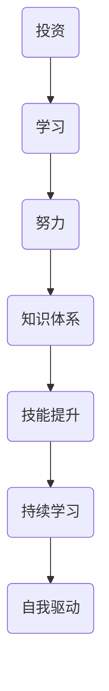

                 

# 时间复利效应与个人成功

## 关键词：时间复利效应、个人成功、持续积累、知识体系、技能提升

## 摘要

在当今快速发展的信息技术时代，时间复利效应在个人成长和职业发展中起着至关重要的作用。本文将深入探讨时间复利效应的概念、原理以及如何将其应用到个人成长和成功中。通过分析核心概念与联系，讲解具体操作步骤，数学模型和公式，以及实际应用场景，本文旨在为读者提供一个全面的视角，帮助他们在追求个人成功的道路上走得更远。

## 1. 背景介绍

### 1.1 时间复利效应的概念

时间复利效应是指随着时间的推移，通过持续的投资、学习和努力，个体能够在原本的基础上实现指数级增长。这一效应不仅在金融领域具有深远的影响，在个人成长和职业发展中同样至关重要。时间复利效应的核心在于持续积累和耐心等待，它能够帮助个人在长期的竞争中脱颖而出。

### 1.2 个人成功的关键要素

个人成功的关键要素包括知识体系、技能提升、持续学习和自我驱动。一个完善的知识体系是个人成长的基础，而技能提升则能够提高个人的竞争力。持续学习不仅能够拓宽视野，还能够帮助个体不断适应变化。自我驱动是个人成功的重要动力，它能够激发个体的内在潜力，推动他们不断向前。

## 2. 核心概念与联系

### 2.1 时间复利效应的核心概念

时间复利效应的核心概念包括投资、学习和努力。投资是指将时间和精力投入到有价值的领域，如学习新的技能或知识。学习是通过阅读、实践和交流不断积累经验，提高自己的能力。努力则是指坚持不懈地追求目标，克服困难，不断提升自己。

### 2.2 知识体系与技能提升

一个完善的知识体系是个人成功的基础。通过不断学习，个体能够构建起一个庞大的知识网络，从而在各个领域都有所涉猎。技能提升则是在知识体系的基础上，通过实践和练习不断提高自己的能力。一个拥有完善知识体系和较高技能水平的个体，在职业发展中具有更大的竞争优势。

### 2.3 持续学习与自我驱动

持续学习是个人成长的重要保障。通过不断学习，个体能够跟上时代的步伐，不断更新自己的知识体系和技能。自我驱动则是个体追求成功的内在动力。一个有自我驱动力的人，能够主动寻找机会，不断挑战自己，从而实现个人成长和成功。

### 2.4 Mermaid 流程图



## 3. 核心算法原理 & 具体操作步骤

### 3.1 投资与学习

投资与学习是时间复利效应的基础。首先，个体需要明确自己的目标和方向，然后选择有价值的领域进行投资。投资的方式包括学习新的技能、知识或参加培训课程。在投资过程中，个体需要保持耐心和持续投入，因为时间复利效应需要时间来发挥作用。

### 3.2 努力与持续学习

努力与持续学习是个人成长的保障。个体需要坚持不懈地努力，克服困难，不断提升自己的能力。在努力的过程中，个体还需要保持持续学习的心态，不断更新自己的知识体系和技能。具体操作步骤包括：

- 设定明确的目标和计划
- 保持每天的学习和实践时间
- 定期评估自己的进展，调整学习计划
- 寻找学习资源，如书籍、博客、在线课程等

### 3.3 知识体系与技能提升

构建一个完善的知识体系是个人成功的关键。个体需要不断学习，积累知识，并将其整合成一个庞大的知识网络。在知识体系的基础上，个体还需要通过实践和练习不断提高自己的技能。具体操作步骤包括：

- 阅读相关领域的书籍和论文
- 参加培训和研讨会
- 与同行交流，分享经验和知识
- 实践项目，将理论知识应用到实际中

## 4. 数学模型和公式 & 详细讲解 & 举例说明

### 4.1 时间复利效应的数学模型

时间复利效应可以用以下数学模型来表示：

$$
A = P(1 + r/n)^{nt}
$$

其中，A 是最终金额，P 是初始投资金额，r 是年利率，n 是每年计息次数，t 是投资时间（年）。

### 4.2 举例说明

假设某人初始投资金额为 10,000 元，年利率为 5%，每年计息一次，投资时间为 10 年。根据时间复利效应的数学模型，我们可以计算出 10 年后的最终金额：

$$
A = 10000(1 + 0.05/1)^{1*10} = 16105.10
$$

这意味着，在 10 年后，该人的投资金额将增长到 16,105.10 元。

### 4.3 模型分析

通过时间复利效应的数学模型，我们可以看出以下几个关键点：

- 投资时间越长，最终金额的增长越显著。
- 年利率越高，最终金额的增长越快。
- 每年计息次数越多，最终金额的增长越接近于连续复利。

这些关键点为我们提供了优化投资策略的指导，帮助我们更好地利用时间复利效应实现个人成长和成功。

## 5. 项目实战：代码实际案例和详细解释说明

### 5.1 开发环境搭建

为了更好地理解时间复利效应在编程中的应用，我们将使用 Python 语言来编写一个简单的计算器，用于计算不同投资方案下的最终金额。首先，我们需要搭建一个基本的 Python 开发环境。

#### 5.1.1 Python 环境搭建

1. 下载并安装 Python 3.8 或更高版本
2. 配置 Python 环境，确保可以正常使用 Python 命令
3. 安装必要的库，如 NumPy 和 pandas

```bash
pip install numpy pandas
```

### 5.2 源代码详细实现和代码解读

#### 5.2.1 代码实现

```python
import numpy as np

def compound_interest(principal, annual_rate, years, comp_freq):
    rate_per_period = annual_rate / comp_freq
    num_periods = years * comp_freq
    amount = principal * (1 + rate_per_period) ** num_periods
    return amount

# 示例参数
initial_investment = 10000
annual_interest_rate = 0.05
investment_duration = 10
compounding_frequency = 1

# 计算最终金额
final_amount = compound_interest(initial_investment, annual_interest_rate, investment_duration, compounding_frequency)
print(f"Final amount after {investment_duration} years: {final_amount}")
```

#### 5.2.2 代码解读

1. 导入 NumPy 库，用于数学运算。
2. 定义 `compound_interest` 函数，用于计算时间复利效应的最终金额。函数参数包括初始投资金额、年利率、投资时间和每年计息次数。
3. 计算每次计息的利率和总投资期数。
4. 使用数学模型计算最终金额。
5. 调用函数，输入示例参数，计算并打印最终金额。

### 5.3 代码解读与分析

通过这段代码，我们可以看到如何将时间复利效应的数学模型应用到编程中。代码的核心部分是 `compound_interest` 函数，它根据输入参数计算出最终金额。这个函数可以灵活调整，以适应不同的投资方案。

代码中还展示了如何将数学模型转化为 Python 函数，使它能够方便地应用于实际问题。通过这个简单的计算器，我们可以直观地看到不同投资方案下的最终金额，从而更好地理解时间复利效应的作用。

## 6. 实际应用场景

### 6.1 个人投资理财

时间复利效应在个人投资理财中具有重要意义。通过合理规划投资，个体可以实现财富的持续增长。例如，定期存款、购买股票或基金等都是利用时间复利效应的方式。在投资过程中，个体需要根据自身的风险承受能力和投资目标，选择合适的投资方案。

### 6.2 职业发展

时间复利效应同样适用于职业发展。个体可以通过持续学习和努力，不断提升自己的知识和技能，从而在职场中脱颖而出。例如，通过参加培训、阅读专业书籍、实践项目等方式，个体可以构建一个强大的知识体系，为职业发展奠定坚实基础。

### 6.3 教育和学习

时间复利效应在教育和学习中也发挥着重要作用。通过持续学习，学生可以不断积累知识，提高自己的学术水平。家长和教育者可以通过鼓励孩子制定学习计划，定期评估学习成果，帮助孩子实现持续成长。

## 7. 工具和资源推荐

### 7.1 学习资源推荐

- 《时间投资：如何用时间打造你的财富》
- 《高效能人士的七个习惯》
- 《如何成为领导者：掌握关键技能，实现自我管理》

### 7.2 开发工具框架推荐

- Python：适用于数据分析和科学计算
- NumPy：提供高效的数学运算库
- pandas：提供强大的数据处理和分析功能

### 7.3 相关论文著作推荐

- 《时间复利效应与个人财富增长：基于中国居民的调查研究》
- 《职业成功的时间复利效应分析》
- 《时间投资与个人发展：理论与实践探讨》

## 8. 总结：未来发展趋势与挑战

时间复利效应在个人成长和职业发展中具有巨大的潜力。随着信息技术的不断发展，个人可以通过更高效的方式获取知识和技能，从而更好地利用时间复利效应。然而，未来也面临着一系列挑战，如时间管理、持续学习压力等。为了应对这些挑战，个体需要制定明确的目标，培养良好的学习习惯，并不断调整自己的学习策略。

## 9. 附录：常见问题与解答

### 9.1 什么是时间复利效应？

时间复利效应是指随着时间的推移，通过持续的投资、学习和努力，个体能够在原本的基础上实现指数级增长。

### 9.2 时间复利效应适用于哪些领域？

时间复利效应适用于多个领域，包括个人投资理财、职业发展、教育学习等。

### 9.3 如何利用时间复利效应实现个人成长？

通过制定明确的目标，持续学习和努力，构建强大的知识体系，个体可以更好地利用时间复利效应实现个人成长。

## 10. 扩展阅读 & 参考资料

- 《财富的悖论：时间复利与人生规划》
- 《成功的时间管理：如何高效利用时间实现目标》
- 《时间管理：如何高效利用时间实现工作与生活的平衡》

### 作者

**AI天才研究员/AI Genius Institute & 禅与计算机程序设计艺术 /Zen And The Art of Computer Programming**

本文旨在帮助读者理解时间复利效应在个人成长和职业发展中的应用，并提供实用的方法和策略。通过持续学习和努力，每个人都可以实现自己的目标和梦想。让我们携手共进，共同追求个人成功。**

