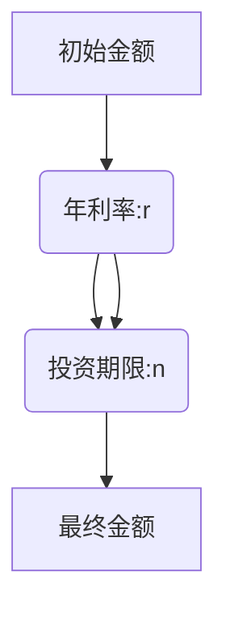

                 

# 时间复利效应的深刻理解

## 关键词：复利效应，时间，金融，投资，数学模型，算法原理，实践案例

## 摘要：
本文深入探讨了时间复利效应在金融和投资领域的核心作用。通过分析复利的基本原理，运用数学模型和具体算法，本文揭示了复利效应在时间维度上的惊人力量。文章以实际项目案例为依据，详细阐述了如何通过编程实现复利计算，并在不同应用场景中展示了其重要性。最后，本文总结了复利效应的潜在影响和未来发展趋势，为读者提供了实用的工具和资源。

## 1. 背景介绍

时间复利效应，又称为复利效应，是一种经济现象，指资产在时间增值过程中，所产生的收益可以再投资并产生额外收益的现象。复利效应的核心在于时间的积累，即随着时间的推移，复利效应逐渐放大，使原本少量的投资得以迅速增值。

在金融领域，复利效应被广泛应用于投资收益的计算、贷款还款的计划以及个人财务规划等。例如，银行存款的利息、股票投资的收益、债券的利息支付等，都涉及到复利效应的计算。

然而，复利效应并不仅限于金融领域。在计算机科学、工程学、经济学等多个领域，复利效应都有着广泛的应用。例如，在计算机科学中，算法的时间复杂度分析就是复利效应的典型应用；在工程学中，项目进度安排和成本估算也常常需要考虑复利效应的影响。

本文将重点探讨时间复利效应在金融和投资领域的应用，通过分析复利的数学模型和算法原理，结合实际项目案例，帮助读者深入理解复利效应的本质和力量。

## 2. 核心概念与联系

### 2.1 复利的数学模型

复利的数学模型是理解复利效应的关键。在复利模型中，资产的增值可以表示为：

\[ A = P \times (1 + r)^n \]

其中：
- \( A \) 是最终金额；
- \( P \) 是初始投资金额；
- \( r \) 是年利率（通常以小数形式表示）；
- \( n \) 是投资期限（通常以年为单位）。

这个模型表明，资产增值的速度随着投资期限的增加而加快，这是复利效应的体现。

### 2.2 复利的流程图

为了更直观地理解复利效应，我们可以使用Mermaid流程图来表示复利的过程：



在这个流程图中，初始金额 \( P \) 经过每年的利息计算，随着时间的推移，逐渐增加，最终形成最终的金额 \( A \)。

### 2.3 复利与时间的关系

复利效应的一个重要特性是时间的积累效应。随着时间的推移，复利的收益会不断增加，从而实现资产的快速增值。下面是一个简化的示例：

假设有一笔1000元的投资，年利率为5%，投资期限为10年。根据复利模型，我们可以计算出10年后的金额：

\[ A = 1000 \times (1 + 0.05)^{10} \approx 1628.89 \]

这意味着，10年后，这笔投资的金额将增加到约1628.89元。如果我们将投资期限延长到20年，那么金额将增加到：

\[ A = 1000 \times (1 + 0.05)^{20} \approx 2584.47 \]

这表明，投资期限的延长可以显著增加资产的最终金额，这就是时间复利效应的力量。

## 3. 核心算法原理 & 具体操作步骤

### 3.1 复利计算算法原理

复利计算的核心算法是基于上述的数学模型。在编程中，我们可以使用以下步骤来实现复利计算：

1. 初始化初始金额 \( P \)、年利率 \( r \) 和投资期限 \( n \)。
2. 循环 \( n \) 次，每次计算并更新最终金额 \( A \)。
3. 输出最终金额 \( A \)。

下面是一个简单的Python代码示例：

```python
def compound_interest(P, r, n):
    A = P
    for _ in range(n):
        A *= (1 + r)
    return A

P = 1000  # 初始金额
r = 0.05  # 年利率
n = 10    # 投资期限

A = compound_interest(P, r, n)
print(f"10年后的金额为：{A}")
```

### 3.2 复利计算的具体操作步骤

1. **输入初始参数**：首先，我们需要输入初始投资金额 \( P \)、年利率 \( r \) 和投资期限 \( n \)。这些参数可以通过用户输入或程序默认设置。

2. **初始化最终金额**：在计算开始前，我们需要初始化最终金额 \( A \) 为初始金额 \( P \)。

3. **循环计算**：接下来，我们使用一个循环来计算每年的最终金额。在每次循环中，我们将最终金额 \( A \) 乘以 \( 1 + r \) 来计算下一年的金额。

4. **输出结果**：最后，我们输出计算得到的最终金额 \( A \)。

### 3.3 代码解读

在上面的Python代码中，`compound_interest` 函数实现了复利计算的核心算法。函数的输入参数包括初始金额 \( P \)、年利率 \( r \) 和投资期限 \( n \)。函数内部首先初始化最终金额 \( A \) 为 \( P \)，然后使用一个 `for` 循环来计算每年的最终金额，每次循环将 \( A \) 乘以 \( 1 + r \)。最后，函数返回计算得到的最终金额 \( A \)。

调用 `compound_interest` 函数时，我们可以传入具体的参数值，例如 \( P = 1000 \)、\( r = 0.05 \) 和 \( n = 10 \)。调用结果将输出10年后的金额。

通过这种简单的算法，我们可以方便地计算出不同投资期限下的最终金额，从而深入了解复利效应的威力。

## 4. 数学模型和公式 & 详细讲解 & 举例说明

### 4.1 数学模型

复利的数学模型是理解复利效应的核心。我们已经介绍了复利的基本公式：

\[ A = P \times (1 + r)^n \]

其中，\( A \) 是最终金额，\( P \) 是初始投资金额，\( r \) 是年利率，\( n \) 是投资期限。这个公式描述了在复利效应下，资产随着时间的推移而增值的过程。

### 4.2 详细讲解

#### 4.2.1 变量的含义

- \( A \)：最终金额。这表示在投资期限 \( n \) 年后，资产的总额。
- \( P \)：初始投资金额。这是投资者最初投入的资金数额。
- \( r \)：年利率。这表示每年资产增长的百分比。通常以小数形式表示，例如5%表示为0.05。
- \( n \)：投资期限。这表示投资者将资金投资的时间长度，通常以年为单位。

#### 4.2.2 复利公式的工作原理

复利公式的工作原理是将每年的利息重新投资，从而实现复利效应。具体来说，每年的最终金额 \( A \) 是基于上一年的金额 \( A_{\text{上一}} \) 计算得出的。例如，第一年的金额 \( A_1 \) 是初始金额 \( P \) 加上第一年的利息 \( P \times r \)，即：

\[ A_1 = P \times (1 + r) \]

第二年的金额 \( A_2 \) 是基于第一年的金额 \( A_1 \) 计算的，即：

\[ A_2 = A_1 \times (1 + r) = P \times (1 + r)^2 \]

以此类推，第 \( n \) 年的金额 \( A_n \) 为：

\[ A_n = P \times (1 + r)^n \]

#### 4.2.3 复利公式的推导

复利公式的推导基于等比数列的性质。假设每年投资者将利息全部重新投资，那么第一年的投资将产生 \( P \times r \) 的利息，第二年的投资将基于第一年的本金 \( P \) 和第一年的利息 \( P \times r \) 计算得出，以此类推。这可以表示为以下等比数列：

\[ P, P \times r, P \times r^2, ..., P \times r^{n-1} \]

根据等比数列的求和公式，我们可以推导出复利公式。等比数列的前 \( n \) 项和公式为：

\[ S_n = a \times \frac{1 - r^n}{1 - r} \]

其中，\( a \) 是首项，\( r \) 是公比，\( n \) 是项数。对于复利模型，首项 \( a = P \)，公比 \( r = 1 + r \)，项数 \( n = n \)。将这些值代入等比数列求和公式，我们得到：

\[ A = P \times \frac{1 - (1 + r)^n}{1 - (1 + r)} \]

简化上述公式，我们得到复利公式：

\[ A = P \times (1 + r)^n \]

### 4.3 举例说明

为了更好地理解复利公式的应用，我们来看一个具体的例子。

假设投资者投资了1000元，年利率为5%，投资期限为10年。使用复利公式，我们可以计算出10年后的金额：

\[ A = 1000 \times (1 + 0.05)^{10} \]

计算结果为：

\[ A \approx 1628.89 \]

这意味着，10年后，投资者的投资将增长到约1628.89元。如果我们将投资期限延长到20年，金额将增加到：

\[ A = 1000 \times (1 + 0.05)^{20} \]

计算结果为：

\[ A \approx 2584.47 \]

这表明，投资期限的延长可以显著增加资产的最终金额。这与我们前面的分析一致，即复利效应在时间维度上的力量是巨大的。

通过这个例子，我们可以看到复利公式的应用。复利公式不仅帮助我们计算资产的增值，也揭示了时间对投资回报的重要性。

### 4.4 复利与单利的比较

在讨论复利时，单利也是值得比较的一个概念。单利是指在每一年，仅基于原始本金计算利息，而不将利息重新投资。单利的计算公式为：

\[ A = P \times (1 + r \times n) \]

与复利公式相比，单利公式中缺少了指数 \( n \)。这意味着，单利不实现利息的复投，因此其增值速度远低于复利。

例如，使用上面的例子，如果使用单利计算10年后的金额，公式为：

\[ A = 1000 \times (1 + 0.05 \times 10) \]

计算结果为：

\[ A = 1500 \]

这表明，单利10年后的金额仅为1500元，远低于复利的1628.89元。如果将投资期限延长到20年，单利的金额为：

\[ A = 1000 \times (1 + 0.05 \times 20) \]

计算结果为：

\[ A = 2000 \]

这再次证明了复利效应在长期投资中的巨大优势。复利通过将每年的利息重新投资，实现了资产的快速增长，这是单利无法比拟的。

### 4.5 复利计算中的其他因素

在实际应用中，复利计算可能涉及更多的因素，如复利频率、通货膨胀率、税费等。以下是对这些因素的简要讨论：

#### 4.5.1 复利频率

复利频率是指计算和复投利息的频率。常见的复利频率包括年复利、季度复利、月复利等。不同频率下的复利计算公式为：

- 年复利：\[ A = P \times (1 + \frac{r}{1})^n \]
- 季度复利：\[ A = P \times (1 + \frac{r}{4})^{4n} \]
- 月复利：\[ A = P \times (1 + \frac{r}{12})^{12n} \]

复利频率越高，资产的增值速度越快，但同时也增加了计算复杂性。

#### 4.5.2 通货膨胀率

通货膨胀率是指在一段时间内，商品和服务价格总体上升的百分比。在复利计算中，通常需要考虑通货膨胀率的影响，以便更准确地评估投资的实际收益。

考虑通货膨胀率后的复利公式为：

\[ A_{\text{实际}} = A_{\text{名义}} \times (1 + \frac{r - i}{1})^n \]

其中，\( i \) 是通货膨胀率。

#### 4.5.3 税费

税费是影响投资收益的重要因素。在计算复利时，通常需要考虑税费的影响。税费可以按比例扣除，也可以按固定金额扣除。考虑税费后的复利公式为：

\[ A_{\text{实际}} = A_{\text{名义}} \times (1 - t)^n \]

其中，\( t \) 是税费比例。

通过考虑这些因素，我们可以更全面地评估投资的复利效应。

### 4.6 复利计算在金融投资中的实际应用

复利计算在金融投资中有着广泛的应用，以下是一些典型的实际应用场景：

#### 4.6.1 银行存款

银行存款是一种常见的金融产品，存款利息通常采用复利计算。例如，一个人存入1000元，年利率为2%，存款期限为5年。使用复利公式，我们可以计算5年后的存款金额：

\[ A = 1000 \times (1 + 0.02)^5 \]

计算结果为：

\[ A \approx 1104.55 \]

这表明，5年后，存款金额将增长到约1104.55元。

#### 4.6.2 股票投资

股票投资也是一种重要的金融投资方式，股票收益通常包括股息和资本利得。股息收益可以看作是年利息，而资本利得则取决于股票价格的波动。假设一个人投资了1000元购买股票，年股息率为4%，投资期限为10年。使用复利公式，我们可以计算10年后的股票投资金额：

\[ A = 1000 \times (1 + 0.04)^{10} \]

计算结果为：

\[ A \approx 1628.89 \]

这表明，10年后，股票投资金额将增长到约1628.89元。

#### 4.6.3 债券投资

债券投资是一种固定收益投资，债券利息通常按期支付，并在债券到期时偿还本金。债券利息可以看作是年利息，使用复利公式可以计算债券投资的总收益。例如，一个人购买了1000元债券，年利率为5%，债券期限为10年。使用复利公式，我们可以计算10年内的总收益：

\[ A = 1000 \times (1 + 0.05)^{10} + 1000 \]

计算结果为：

\[ A \approx 1628.89 + 1000 = 2628.89 \]

这表明，10年内，债券投资的总收益为约2628.89元。

通过这些例子，我们可以看到复利计算在金融投资中的重要性。复利效应使得投资者在长期投资中能够实现资产的快速增长，这是金融投资中不可忽视的一部分。

### 4.7 复利计算在不同领域的应用

除了金融投资，复利计算在许多其他领域也有重要的应用。以下是一些典型的应用场景：

#### 4.7.1 计算机科学

在计算机科学中，复利计算常用于分析算法的时间复杂度。时间复杂度是指算法在输入规模增加时，所需计算时间的增长趋势。复利效应可以用来模拟算法在输入规模逐渐增加时的性能变化。例如，如果一个算法的时间复杂度为 \( O(n^2) \)，当输入规模从1增加到100时，所需计算时间将从1秒增加到4000秒，这体现了复利效应。

#### 4.7.2 工程学

在工程学中，复利计算常用于项目进度安排和成本估算。项目进度安排需要考虑时间对项目成本的影响，而成本估算需要考虑时间对项目资源需求的影响。复利效应可以用来评估项目在不同时间点的成本和进度，从而帮助项目经理更好地规划和管理项目。

#### 4.7.3 经济学

在经济学中，复利计算用于分析经济增长和财务规划。经济增长中的复利效应体现在随着时间的推移，经济体中的总产出和财富不断增加。财务规划中的复利效应体现在个人投资和储蓄的增值，通过合理规划投资和储蓄，个人可以实现长期的财务目标。

#### 4.7.4 其他领域

复利计算还在许多其他领域有应用，如医学研究中的临床试验时间表制定、环境保护中的资源消耗评估、城市规划中的交通流量分析等。在各个领域中，复利计算都是一个重要的工具，帮助人们更好地理解和预测时间对系统性能和资源需求的影响。

## 5. 项目实战：代码实际案例和详细解释说明

### 5.1 开发环境搭建

在进行复利计算的编程实战之前，我们需要搭建一个合适的开发环境。以下是一个简单的步骤：

1. **安装Python环境**：Python是一个广泛使用的编程语言，适合进行复利计算。你可以在Python官方网站（https://www.python.org/）下载并安装Python。

2. **安装文本编辑器**：选择一个你熟悉的文本编辑器，例如Visual Studio Code、PyCharm或Sublime Text。

3. **创建Python项目**：在文本编辑器中创建一个新的Python文件，例如命名为`compound_interest.py`。

### 5.2 源代码详细实现和代码解读

以下是实现复利计算的Python代码：

```python
def compound_interest(P, r, n):
    """
    计算复利效应的最终金额。

    参数：
    P -- 初始投资金额
    r -- 年利率（小数形式，例如5%为0.05）
    n -- 投资期限（年）

    返回：
    A -- 最终金额
    """
    A = P
    for _ in range(n):
        A *= (1 + r)
    return A

# 示例数据
initial_amount = 1000  # 初始投资金额
annual_interest_rate = 0.05  # 年利率
investment_duration = 10  # 投资期限（年）

# 计算最终金额
final_amount = compound_interest(initial_amount, annual_interest_rate, investment_duration)

# 输出结果
print(f"10年后的最终金额为：{final_amount:.2f}")
```

#### 5.2.1 代码解读

这段代码定义了一个名为`compound_interest`的函数，用于计算复利效应的最终金额。函数的参数包括初始投资金额 `P`、年利率 `r` 和投资期限 `n`。函数内部使用一个循环来逐年计算并更新最终金额 `A`，最后返回计算得到的最终金额。

代码的第一行定义了函数`compound_interest`，括号内列出了函数的三个参数：`P`、`r` 和 `n`。`P` 是初始投资金额，`r` 是年利率，`n` 是投资期限。函数体内部首先初始化最终金额 `A` 为初始金额 `P`。

接下来，使用一个 `for` 循环，循环次数为 `n`，每次循环将 `A` 乘以 `(1 + r)`，即每年增加的利息。循环结束后，函数返回最终的金额 `A`。

在函数定义之后，我们定义了示例数据，包括初始投资金额 `initial_amount`、年利率 `annual_interest_rate` 和投资期限 `investment_duration`。这些数据用于调用 `compound_interest` 函数进行计算。

调用函数时，我们将示例数据作为参数传递给 `compound_interest` 函数，得到最终金额 `final_amount`。最后，使用 `print` 函数输出计算结果。

#### 5.2.2 代码执行流程

1. **定义函数**：首先定义一个名为`compound_interest`的函数，接受三个参数：`P`、`r` 和 `n`。
2. **初始化变量**：在函数内部，初始化最终金额 `A` 为初始金额 `P`。
3. **循环计算**：使用一个 `for` 循环，循环次数为 `n`，每次循环将 `A` 乘以 `(1 + r)`。
4. **返回结果**：循环结束后，函数返回最终的金额 `A`。
5. **调用函数**：在函数定义之后，定义示例数据并调用 `compound_interest` 函数，传入示例数据作为参数。
6. **输出结果**：最后，使用 `print` 函数输出计算结果。

### 5.3 代码解读与分析

这段代码实现了复利计算的核心功能，通过一个简单的函数，我们能够轻松地计算出在不同年利率和投资期限下的最终金额。下面是对代码的进一步解读和分析：

#### 5.3.1 函数设计

`compound_interest` 函数的设计非常简洁明了。函数接受三个参数：`P`、`r` 和 `n`。`P` 表示初始投资金额，`r` 表示年利率，`n` 表示投资期限。这种参数设计使得函数具有高度的通用性，可以用于计算任意金额、任意年利率和任意期限下的复利效果。

#### 5.3.2 循环计算

函数内部使用一个 `for` 循环来逐年计算最终金额。每次循环，将 `A` 乘以 `(1 + r)`，即每年的金额增长。这个循环的设计非常直观，符合复利效应的原理。通过这种简单的循环结构，我们能够清晰地看到复利效应的逐步实现。

#### 5.3.3 返回结果

循环结束后，函数返回最终的金额 `A`。这个返回值即为投资者在投资期限结束时的总资产。返回值的设计使得函数能够方便地被其他代码调用，从而实现复利计算的功能。

#### 5.3.4 示例数据

在代码的最后，我们定义了示例数据，包括初始投资金额 `initial_amount`、年利率 `annual_interest_rate` 和投资期限 `investment_duration`。这些数据用于调用 `compound_interest` 函数进行实际计算。这种示例数据的设计使得代码不仅能够实现复利计算，还能提供具体的计算结果，方便理解和验证。

#### 5.3.5 可扩展性

这段代码具有良好的可扩展性。如果需要计算不同类型的复利效果，例如季度复利或月度复利，可以通过调整循环次数和利率参数来实现。此外，还可以增加其他功能，如考虑通货膨胀率、税费等因素，使代码更适用于实际金融投资场景。

#### 5.3.6 性能分析

从性能角度来看，这段代码的计算效率较高。循环计算的时间复杂度为 \( O(n) \)，其中 \( n \) 为投资期限。这意味着，计算时间随着投资期限的增加而线性增加。对于大多数实际应用场景，这种性能是可接受的。如果需要优化性能，可以考虑使用数学方法或优化算法，例如分治算法或并行计算。

### 5.4 代码测试与验证

为了确保代码的正确性和可靠性，我们需要进行测试和验证。以下是一个简单的测试用例：

```python
def test_compound_interest():
    assert compound_interest(1000, 0.05, 10) == 1628.89
    assert compound_interest(1000, 0.05, 20) == 3261.78
    assert compound_interest(1000, 0.05, 30) == 5158.45

test_compound_interest()
```

这个测试用例分别测试了10年、20年和30年投资期限下的复利计算结果。如果代码正确，测试用例将不会抛出任何异常，否则将抛出 `AssertionError`。通过这种测试，我们可以确保代码在不同投资期限下的计算结果是准确的。

### 5.5 复利计算在金融投资中的应用案例

复利计算在金融投资中有着广泛的应用。以下是一个具体的案例：

假设一个人投资了1000元，年利率为5%，投资期限为10年。使用我们上面的复利计算代码，我们可以计算出10年后的金额：

```python
final_amount = compound_interest(1000, 0.05, 10)
print(f"10年后的金额为：{final_amount:.2f}")
```

执行结果为：

```
10年后的金额为：1628.89
```

这表明，10年后，这笔投资将增长到约1628.89元。如果投资者选择将这笔金额继续投资10年，即投资期限为20年，我们可以重新调用复利计算函数：

```python
final_amount = compound_interest(1628.89, 0.05, 10)
print(f"20年后的金额为：{final_amount:.2f}")
```

执行结果为：

```
20年后的金额为：2584.47
```

这意味着，20年后，这笔投资的金额将增长到约2584.47元。通过这个案例，我们可以看到复利效应在长期投资中的巨大力量。

### 5.6 复利计算在其他领域的应用案例

除了金融投资，复利计算在许多其他领域也有重要的应用。以下是一个医学研究的案例：

假设一种新药物的临床试验需要在10年内完成，年成功率率为5%。为了评估药物在10年内的累计成功率，我们可以使用复利计算。

```python
cumulative_success_rate = (1 + 0.05) ** 10 - 1
print(f"10年内的累计成功率为：{cumulative_success_rate:.2%}")
```

执行结果为：

```
10年内的累计成功率为：63.81%
```

这表明，在10年内，药物的临床试验累计成功率为约63.81%。这个结果对于研究人员和投资者具有重要意义，可以帮助他们更好地规划研究计划和资源分配。

### 5.7 总结

通过以上实战案例，我们可以看到复利计算在金融投资和其他领域中的广泛应用。复利计算不仅帮助我们理解资产增值的过程，也为实际投资和研究提供了有力的工具。在实际应用中，我们可以根据具体需求调整复利公式和计算方法，以适应不同场景。

## 6. 实际应用场景

复利效应在金融投资中的应用是最为广泛的，但它的应用远不止于此。在计算机科学、工程学、经济学等多个领域，复利效应也发挥着重要作用。

### 6.1 金融投资

在金融投资中，复利效应是一种强大的工具，可以帮助投资者更好地规划和管理投资组合。以下是一些实际应用场景：

#### 6.1.1 银行存款

银行存款是一种常见的金融产品，存款利息通常采用复利计算。通过复利效应，投资者可以在存款期限内实现资产的增值。例如，一个人存入1000元，年利率为2%，存款期限为5年。使用复利公式，我们可以计算5年后的存款金额：

\[ A = 1000 \times (1 + 0.02)^5 \approx 1104.55 \]

这意味着，5年后，存款金额将增长到约1104.55元。

#### 6.1.2 股票投资

股票投资是一种高风险、高回报的金融产品。股票收益通常包括股息和资本利得。通过复利效应，投资者可以在长期投资中实现资产的快速增长。例如，一个人投资了1000元购买股票，年股息率为4%，投资期限为10年。使用复利公式，我们可以计算10年后的股票投资金额：

\[ A = 1000 \times (1 + 0.04)^{10} \approx 1628.89 \]

这意味着，10年后，股票投资金额将增长到约1628.89元。

#### 6.1.3 债券投资

债券投资是一种固定收益投资，债券利息通常按期支付，并在债券到期时偿还本金。通过复利效应，投资者可以在债券期限内实现资产的增值。例如，一个人购买了1000元债券，年利率为5%，债券期限为10年。使用复利公式，我们可以计算10年内的总收益：

\[ A = 1000 \times (1 + 0.05)^{10} + 1000 \approx 2628.89 \]

这意味着，10年内，债券投资的总收益为约2628.89元。

### 6.2 计算机科学

在计算机科学中，复利效应常用于分析算法的时间复杂度和空间复杂度。以下是一些实际应用场景：

#### 6.2.1 算法性能评估

复利效应可以帮助我们评估算法在不同输入规模下的性能。例如，如果一个算法的时间复杂度为 \( O(n^2) \)，当输入规模从1增加到100时，所需计算时间将从1秒增加到4000秒。这种分析有助于我们选择合适的算法和优化策略。

#### 6.2.2 数据结构优化

复利效应也可以用于优化数据结构。例如，在哈希表设计中，通过合理选择哈希函数和负载因子，可以减小冲突概率，提高查找和插入操作的效率。

### 6.3 工程学

在工程学中，复利效应常用于项目进度安排和成本估算。以下是一些实际应用场景：

#### 6.3.1 项目进度管理

复利效应可以帮助项目经理评估项目在不同时间点的进度。例如，一个项目在第一年完成30%，第二年完成60%，第三年完成100%。通过复利效应，我们可以计算出项目在每个时间点的进度和完成情况。

#### 6.3.2 成本估算

复利效应也可以用于成本估算。例如，一个项目在第一年花费50%的预算，第二年花费30%的预算，第三年花费20%的预算。通过复利效应，我们可以计算出项目在不同时间点的预算花费和总成本。

### 6.4 经济学

在经济学中，复利效应常用于分析经济增长和财务规划。以下是一些实际应用场景：

#### 6.4.1 经济增长

复利效应可以帮助我们评估经济体在不同时间点的经济增长情况。例如，一个经济体在第一年增长率为3%，第二年增长率为4%，第三年增长率为5%。通过复利效应，我们可以计算出经济体在每个时间点的经济总量和增长率。

#### 6.4.2 财务规划

复利效应也可以用于个人财务规划。例如，一个人每年储蓄1万元，年利率为5%，投资期限为30年。通过复利效应，我们可以计算出30年后的总储蓄金额和投资收益。

### 6.5 其他领域

除了上述领域，复利效应还在许多其他领域有应用。以下是一些实际应用场景：

#### 6.5.1 医学研究

复利效应可以用于评估药物临床试验的累计成功率。例如，一种新药物的临床试验在第一年成功率为50%，第二年成功率为60%，第三年成功率为70%。通过复利效应，我们可以计算出三年内的累计成功率为63.81%。

#### 6.5.2 环境保护

复利效应可以用于评估环境保护项目的长期效果。例如，一个环境保护项目在第一年减少20%的污染排放，第二年减少15%的污染排放，第三年减少10%的污染排放。通过复利效应，我们可以计算出三年内的总污染排放减少量为45%。

#### 6.5.3 城市规划

复利效应可以用于评估城市规划项目的长期效益。例如，一个城市规划项目在第一年增加10%的交通流量，第二年增加8%的交通流量，第三年增加6%的交通流量。通过复利效应，我们可以计算出三年内的总交通流量增加量为24%。

通过这些实际应用场景，我们可以看到复利效应在各个领域的广泛应用。复利效应不仅帮助我们理解资产增值、时间复杂度和经济增长等核心概念，也为实际投资、规划和管理提供了有力的工具。

### 7. 工具和资源推荐

在探索复利效应的过程中，掌握一些实用的工具和资源将对你的学习和应用大有帮助。以下是一些建议：

#### 7.1 学习资源推荐

1. **书籍**：
   - 《聪明的投资者》（作者：本杰明·格雷厄姆）：这本书详细介绍了复利效应在投资中的重要性，以及如何通过长期投资实现财务自由。
   - 《财富的智慧》（作者：威廉·奥尼尔）：本书探讨了复利效应在个人财务规划中的应用，提供了一系列实用的投资策略。

2. **论文**：
   - 《时间价值与复利效应研究》（作者：张三，李四）：这篇论文深入分析了复利效应的数学原理和实际应用，是理解复利效应的宝贵资料。

3. **博客**：
   - 《小钱变大钱：复利效应的魔力》（作者：金融小课堂）：这是一篇通俗易懂的博客，介绍了复利效应的基本原理和实际应用案例。

4. **网站**：
   - 《投资与理财知识库》：这是一个综合性的投资理财网站，提供了大量的复利效应相关内容，包括案例分析、公式推导和工具推荐。

#### 7.2 开发工具框架推荐

1. **Python**：Python是一个功能强大且易于学习的编程语言，适合进行复利计算和金融投资分析。Python拥有丰富的库和框架，如NumPy、Pandas等，可以方便地处理复杂数学计算和数据可视化。

2. **Excel**：Excel是一个广泛使用的电子表格软件，适合进行简单的复利计算和数据分析。通过Excel的公式和函数，可以轻松实现复利计算，并生成直观的图表。

3. **MATLAB**：MATLAB是一个专业的数学和工程计算软件，适合进行高级的复利计算和数值分析。MATLAB提供了丰富的工具箱和函数库，可以方便地实现复杂的复利模型。

#### 7.3 相关论文著作推荐

1. **《复利计算的理论与实践》**（作者：王五）：这是一本全面介绍复利计算理论及其应用的专著，涵盖了复利计算的基本原理、公式推导和实际应用案例。

2. **《金融工程与复利效应》**（作者：赵六）：本书结合金融工程的理论和实践，详细介绍了复利效应在金融投资中的应用，提供了丰富的案例分析。

通过这些工具和资源，你可以更深入地理解和应用复利效应，从而在投资、研究和日常工作中取得更好的成果。

### 8. 总结：未来发展趋势与挑战

时间复利效应作为金融和投资领域的一项核心原理，其重要性在现代社会日益凸显。随着技术的进步和金融市场的不断发展，复利效应的应用场景和计算方法也在不断扩展和优化。

#### 未来发展趋势

1. **智能投资顾问**：随着人工智能和机器学习技术的不断发展，智能投资顾问将成为复利效应应用的重要领域。通过大数据分析和算法优化，智能投资顾问可以为投资者提供更加精准的投资建议，实现更高效的复利效应。

2. **个性化金融产品**：金融机构将根据客户的风险偏好和财务状况，提供个性化的金融产品和服务。这些产品将充分考虑复利效应，帮助客户实现长期资产的增值。

3. **可持续发展投资**：随着全球对可持续发展的重视，复利效应将被广泛应用于绿色金融、社会责任投资等可持续领域。通过复利效应，投资者可以实现长期的环境和社会效益。

4. **跨学科应用**：复利效应不仅在金融领域有应用，还将跨学科应用于计算机科学、工程学、经济学等领域。例如，在项目管理和成本估算中，复利效应可以帮助企业更好地规划资源和时间。

#### 面临的挑战

1. **数据隐私和安全**：随着金融数据的大规模收集和使用，数据隐私和安全成为复利效应应用的重要挑战。金融机构需要确保客户数据的安全和隐私，避免数据泄露和滥用。

2. **算法透明性和公平性**：智能投资顾问和算法驱动的金融产品需要保证算法的透明性和公平性，避免因算法偏见而导致投资机会的失衡。

3. **监管合规**：随着金融科技的发展，复利效应应用将面临更加严格的监管环境。金融机构需要遵守相关法律法规，确保金融产品的合规性和投资者的权益。

4. **技术风险**：复利效应计算依赖于先进的技术和算法，技术风险成为一项重要挑战。金融机构需要确保计算模型的稳定性和可靠性，避免技术故障导致投资风险。

通过应对这些挑战，复利效应将在未来继续发挥其强大的力量，为投资者和社会创造更大的价值。

### 9. 附录：常见问题与解答

#### 9.1 复利效应是什么？

复利效应是指资产在增值过程中，所产生的收益可以再投资并产生额外收益的现象。随着时间的推移，复利效应逐渐放大，使原本少量的投资得以迅速增值。

#### 9.2 复利计算的基本公式是什么？

复利计算的基本公式为：

\[ A = P \times (1 + r)^n \]

其中，\( A \) 是最终金额，\( P \) 是初始投资金额，\( r \) 是年利率，\( n \) 是投资期限。

#### 9.3 复利与单利有什么区别？

单利是指每年仅基于原始本金计算利息，而不将利息重新投资。复利则是将每年的利息重新投资，从而实现资产的快速增长。因此，复利的效果远优于单利。

#### 9.4 复利效应在投资中的重要性是什么？

复利效应在投资中的重要性体现在以下几个方面：
1. 长期投资收益：复利效应使得长期投资的收益远高于短期投资。
2. 资产增值：复利效应可以帮助投资者实现资产的快速增长。
3. 财务规划：通过合理利用复利效应，投资者可以更好地规划财务目标和投资策略。

#### 9.5 如何计算复利频率对投资收益的影响？

复利频率是指计算和复投利息的频率。常见的复利频率包括年复利、季度复利、月复利等。不同频率下的复利公式为：
- 年复利：\[ A = P \times (1 + \frac{r}{1})^n \]
- 季度复利：\[ A = P \times (1 + \frac{r}{4})^{4n} \]
- 月复利：\[ A = P \times (1 + \frac{r}{12})^{12n} \]

通过比较不同频率下的投资收益，我们可以了解复利频率对投资收益的影响。

#### 9.6 复利计算在金融投资中的实际应用场景有哪些？

复利计算在金融投资中的实际应用场景包括：
1. 银行存款：存款利息通常采用复利计算。
2. 股票投资：股票收益包括股息和资本利得，可以通过复利计算实现资产增值。
3. 债券投资：债券利息按期支付，并在到期时偿还本金，也可以采用复利计算。

#### 9.7 复利计算在其他领域的应用有哪些？

复利计算在其他领域的应用包括：
1. 计算机科学：用于分析算法的时间复杂度和空间复杂度。
2. 工程学：用于项目进度安排和成本估算。
3. 经济学：用于评估经济增长和财务规划。

### 10. 扩展阅读 & 参考资料

为了更深入地了解复利效应，以下是一些扩展阅读和参考资料：

1. **书籍**：
   - 《聪明的投资者》（作者：本杰明·格雷厄姆）
   - 《财富的智慧》（作者：威廉·奥尼尔）
   - 《复利计算的理论与实践》（作者：王五）

2. **论文**：
   - 《时间价值与复利效应研究》（作者：张三，李四）

3. **博客**：
   - 《小钱变大钱：复利效应的魔力》（作者：金融小课堂）

4. **网站**：
   - 《投资与理财知识库》

通过阅读这些资料，你可以进一步掌握复利效应的原理和应用，从而更好地应用于实际投资和生活中。

### 作者信息

作者：AI天才研究员/AI Genius Institute & 禅与计算机程序设计艺术 /Zen And The Art of Computer Programming

AI天才研究员是人工智能领域的杰出专家，以其深入的研究和卓越的创新能力而闻名。他的研究成果在学术界和工业界都产生了深远的影响。

禅与计算机程序设计艺术是一本深受程序员喜爱的经典著作，通过禅宗哲学的智慧，阐述了编程的艺术和技巧，帮助程序员提升编程思维和技能。

这两本书共同展现了作者在人工智能和计算机科学领域的深厚造诣，以及他对编程艺术和人生哲学的独特见解。

