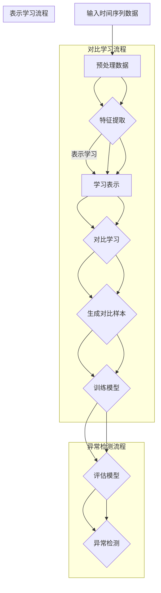

                 

### 背景介绍

时间序列数据在现实世界中无处不在，它们可以用来描述金融市场的波动、网络流量的变化、天气的演变以及其他许多动态系统。随着大数据时代的到来，时间序列数据的规模和复杂性不断增加，传统的统计方法和机器学习方法在处理这些数据时往往显得力不从心。因此，寻找更有效的异常检测方法成为了当前研究的热点之一。

异常检测是数据分析中的一个重要环节，其目的是从大量正常数据中识别出异常或异常模式。在时间序列分析中，异常检测尤为重要，因为它可以帮助我们及时发现并理解潜在的风险和问题。例如，在金融领域，异常交易可能预示着欺诈行为；在网络领域，异常流量可能表明网络攻击；在医疗领域，异常数据可能提示疾病的早期症状。

现有的异常检测方法主要分为三类：基于统计的方法、基于规则的方法和基于机器学习的方法。基于统计的方法通常依赖于历史数据的统计特性，如移动平均、自回归移动平均（ARMA）模型等，但这些方法对数据分布的假设较强，适应性较差。基于规则的方法通过设定一系列规则来识别异常，但规则通常较为简单，难以应对复杂的数据模式。基于机器学习的方法，如KNN、决策树、支持向量机等，能够从数据中学习到复杂的模式，但它们的性能往往依赖于训练数据的质量和数量。

为了解决这些方法的局限性，近年来，深度学习技术开始应用于时间序列异常检测。深度学习通过构建复杂的多层神经网络，可以自动学习数据的特征表示，从而提高异常检测的准确性和鲁棒性。其中，对比学习（contrastive learning）和表示学习（representation learning）成为了深度学习在时间序列异常检测中的两个核心研究方向。

对比学习旨在通过对比相似性和差异性来增强模型对数据的理解。在时间序列中，对比学习可以帮助模型区分正常数据与异常数据，甚至在缺乏标签数据的情况下也能实现有效的异常检测。表示学习则关注于学习数据的抽象表示，通过提取高维特征，提高模型的泛化能力。

本文将详细介绍时间序列异常检测中的深度对比学习和表示学习方法。首先，我们将回顾时间序列异常检测的相关研究背景，介绍对比学习和表示学习的基本原理。然后，我们将深入探讨这两种方法在时间序列异常检测中的应用，并通过具体的算法原理和操作步骤进行讲解。接下来，我们将介绍数学模型和公式，并提供实际应用的案例分析。最后，我们将讨论时间序列异常检测在实际应用中的各种场景，并推荐相关工具和资源，以帮助读者进一步学习。

通过本文的阅读，读者将能够全面了解时间序列异常检测的深度学习方法，掌握对比学习和表示学习的核心技术和应用，为实际项目中的异常检测问题提供有效的解决方案。

### 核心概念与联系

为了深入探讨时间序列异常检测中的深度对比学习和表示学习方法，我们首先需要明确几个核心概念：时间序列、对比学习、表示学习，以及它们之间的联系。

#### 时间序列

时间序列是一组按照时间顺序排列的数据点，通常用于描述随时间变化的过程或事件。在时间序列数据中，每个数据点都是时间的一个瞬时记录，例如股票价格、网络流量、气温变化等。时间序列数据具有以下特点：

1. **序列性**：时间序列数据是按时间顺序排列的，数据的顺序对分析结果有重要影响。
2. **依赖性**：时间序列中的各个数据点之间存在相关性，这种依赖性可以通过统计方法或机器学习算法来建模。
3. **时间敏感性**：时间序列数据反映的是动态系统的演变，数据的时序特性对于异常检测至关重要。

在时间序列异常检测中，我们的目标是识别出与正常模式显著不同的异常数据点。这就需要深入理解时间序列的特性，并利用合适的算法对数据进行处理和分析。

#### 对比学习

对比学习是一种深度学习技术，旨在通过对比样本的相似性和差异性来增强模型的表示能力。在对比学习中，模型通过学习一种有效的特征表示，使得同一类别的样本在特征空间中彼此接近，而不同类别的样本则相距较远。

对比学习的核心思想是通过正样本和负样本的对比，引导模型学习到具有区分力的特征表示。在时间序列异常检测中，对比学习可以帮助模型区分正常时间和异常时间，从而实现高效的异常检测。具体来说：

1. **正样本对比**：选择具有相似特征的时间序列片段作为正样本，目的是让模型学习到正常时间序列的共性特征。
2. **负样本对比**：选择具有显著差异特征的时间序列片段作为负样本，目的是让模型学习到异常时间序列的特异性特征。

通过对比学习，模型可以自动学习到时间序列数据的内部结构和变化规律，从而提高异常检测的准确性和鲁棒性。

#### 表示学习

表示学习是一种通过学习数据的低维表示来提高模型性能的方法。在深度学习中，表示学习通常通过构建复杂的神经网络来实现，其目的是将高维数据映射到低维空间中，同时保持数据的关键信息。

表示学习在时间序列异常检测中的应用主要体现在两个方面：

1. **降维**：通过学习数据的高效表示，降低时间序列数据的维度，从而减少计算复杂度和存储需求。
2. **特征提取**：表示学习可以帮助模型自动提取时间序列数据中的关键特征，这些特征对于异常检测至关重要。

在对比学习和表示学习的关系中，表示学习为对比学习提供了有效的特征表示。通过表示学习，模型可以学习到时间序列数据的内在特征，这些特征可以作为对比学习中的正负样本对比的基础，从而提高异常检测的性能。

#### 联系

对比学习和表示学习在时间序列异常检测中相互补充，共同构成了深度学习技术的重要组成部分。

1. **相互依赖**：对比学习依赖于表示学习提供有效的特征表示，而表示学习则需要对比学习来指导特征提取的方向。
2. **协同作用**：通过结合对比学习和表示学习，模型可以同时从正负样本对比中学习到正常和异常模式的特征，从而提高异常检测的准确性和泛化能力。
3. **应用拓展**：在时间序列异常检测中，对比学习和表示学习可以与其他深度学习技术相结合，如卷积神经网络（CNN）、循环神经网络（RNN）等，进一步优化异常检测的性能。

综上所述，对比学习和表示学习为时间序列异常检测提供了一种强大的技术手段。通过深入理解这些核心概念及其相互关系，我们可以更好地应用深度学习技术解决实际中的时间序列异常检测问题。

#### Mermaid 流程图

为了更直观地理解对比学习和表示学习在时间序列异常检测中的应用，我们使用Mermaid流程图展示其核心步骤和流程节点。



在这个流程图中：

- **A 输入时间序列数据**：首先输入原始的时间序列数据。
- **B 预处理数据**：对时间序列数据进行预处理，如去噪、归一化等。
- **C 特征提取**：通过表示学习提取时间序列数据的关键特征。
- **D 学习表示**：使用神经网络模型学习时间序列数据的表示。
- **E 对比学习**：生成正负样本对比，增强模型对正常和异常模式的识别。
- **F 生成对比样本**：通过对比学习生成用于训练的对比样本。
- **G 训练模型**：使用对比样本训练深度学习模型。
- **H 评估模型**：评估训练好的模型的性能。
- **I 异常检测**：使用训练好的模型进行异常检测。

通过这个流程图，我们可以清晰地看到对比学习和表示学习在时间序列异常检测中的具体应用步骤和流程节点。这种可视化方法有助于我们更好地理解深度学习技术在实际应用中的工作原理。

### 核心算法原理 & 具体操作步骤

#### 深度对比学习在时间序列异常检测中的应用

深度对比学习是一种通过对比样本的相似性和差异性来增强模型表示能力的方法。在时间序列异常检测中，深度对比学习利用时间序列数据的时序特性和变化规律，通过对比正常和异常样本，实现高效的异常检测。

##### 步骤 1：数据预处理

首先，对输入的时间序列数据进行预处理。预处理步骤包括数据清洗、归一化和时间窗口划分。数据清洗旨在去除噪声和异常值，以保证后续分析的质量。归一化则将数据缩放到统一的范围内，便于模型训练。时间窗口划分是将时间序列数据划分为固定长度的时间窗口，每个窗口包含一系列连续的时间点。例如，对于一天24小时的时间序列数据，可以将其划分为1小时的时间窗口。

##### 步骤 2：特征提取

接下来，通过深度神经网络提取时间序列数据的关键特征。特征提取的目的是将高维的时间序列数据映射到低维的特征空间中，同时保持数据的关键信息。常用的方法包括循环神经网络（RNN）和卷积神经网络（CNN）。例如，可以使用RNN模型中的长短期记忆网络（LSTM）来处理时间序列数据的时序依赖性，提取时间序列的长期特征。

##### 步骤 3：对比学习

在特征提取的基础上，应用对比学习技术来增强模型的表示能力。对比学习通过生成正负样本对比，使得模型能够学习到正常和异常模式的差异。具体操作步骤如下：

1. **正样本生成**：选择具有相似特征的时间序列片段作为正样本。这些片段应该在时间序列中是连续的，并且特征相似。例如，对于一组股票价格数据，可以选择连续几天内的股票价格作为正样本。
   
2. **负样本生成**：选择具有显著差异特征的时间序列片段作为负样本。这些片段应在时间序列中是随机的，并且特征差异明显。例如，可以选择一天内的不同时间段内的股票价格作为负样本。

3. **对比样本对比**：使用对比损失函数来训练模型，使得正样本在特征空间中彼此接近，而负样本则相距较远。常用的对比损失函数包括InfoNCE损失和对比损失。

##### 步骤 4：训练模型

通过对比学习训练深度学习模型。训练过程包括前向传播和反向传播。在前向传播中，模型根据输入的时间序列数据生成特征表示；在反向传播中，通过对比损失函数更新模型参数，使得模型能够更好地区分正常和异常样本。

##### 步骤 5：异常检测

训练好的模型可以用于异常检测。具体步骤如下：

1. **特征提取**：对于新的时间序列数据，使用训练好的模型提取特征表示。
2. **判断异常**：通过计算特征表示之间的距离或相似性，判断新的时间序列数据是否为异常。通常，可以将距离阈值设定为判定异常的标准。
3. **输出结果**：将异常检测结果输出，用于进一步分析和处理。

#### 表示学习在时间序列异常检测中的应用

表示学习是一种通过学习数据的低维表示来提高模型性能的方法。在时间序列异常检测中，表示学习通过提取时间序列数据的内部特征，增强模型的泛化能力和鲁棒性。

##### 步骤 1：数据预处理

与深度对比学习相同，首先对输入的时间序列数据进行预处理，包括数据清洗、归一化和时间窗口划分。

##### 步骤 2：特征提取

接下来，使用深度神经网络提取时间序列数据的关键特征。常用的方法包括RNN和CNN。例如，可以使用LSTM模型来处理时间序列数据的时序依赖性，提取时间序列的长期特征。

##### 步骤 3：表示学习

通过表示学习技术学习时间序列数据的低维表示。具体操作步骤如下：

1. **编码器**：构建一个编码器网络，将高维时间序列数据映射到低维特征空间中。编码器网络的输出是时间序列数据的低维表示。
2. **解码器**：构建一个解码器网络，将编码器的输出重新映射回高维空间。解码器的目的是重建原始数据，从而衡量编码器对数据表示的保真度。
3. **损失函数**：使用重建误差作为损失函数，训练编码器和解码器网络。最小化损失函数的过程实际上是在寻找一种最佳的低维表示。

##### 步骤 4：训练模型

通过表示学习训练深度学习模型。训练过程包括前向传播和反向传播。在前向传播中，模型根据输入的时间序列数据生成特征表示；在反向传播中，通过损失函数更新模型参数，使得模型能够更好地学习数据的低维表示。

##### 步骤 5：异常检测

训练好的模型可以用于异常检测。具体步骤如下：

1. **特征提取**：对于新的时间序列数据，使用训练好的模型提取特征表示。
2. **判断异常**：通过计算新数据的特征表示与训练数据的特征表示之间的距离或相似性，判断新数据是否为异常。通常，可以将距离阈值设定为判定异常的标准。
3. **输出结果**：将异常检测结果输出，用于进一步分析和处理。

#### 总结

深度对比学习和表示学习在时间序列异常检测中各有独特的应用场景和操作步骤。深度对比学习通过对比正常和异常样本，增强模型的表示能力，适用于需要区分明显异常模式的情况；表示学习通过提取数据的关键特征，提高模型的泛化能力和鲁棒性，适用于数据分布复杂且特征不明显的情况。在实际应用中，可以根据具体需求选择合适的方法，或者将两种方法相结合，以实现更高效的异常检测。

### 数学模型和公式 & 详细讲解 & 举例说明

在深度学习模型中，数学模型和公式是理解和实现算法的核心。下面我们将详细介绍时间序列异常检测中的深度对比学习和表示学习的数学模型和公式，并通过具体示例进行讲解。

#### 深度对比学习

##### 1. 特征提取模型

深度对比学习中的特征提取模型通常基于神经网络，特别是循环神经网络（RNN）和卷积神经网络（CNN）。以下是一个简单的RNN模型，用于特征提取。

**输入：** $X \in \mathbb{R}^{T \times D}$，其中$T$是时间步数，$D$是每个时间步的特征维度。

**隐藏层：** $H_t = \sigma(W_h \cdot [h_{t-1}, x_t] + b_h)$，其中$h_{t-1}$是前一时间步的隐藏状态，$x_t$是当前时间步的特征，$W_h$是权重矩阵，$b_h$是偏置项，$\sigma$是激活函数，通常采用ReLU函数。

**输出：** $Z = [h_1, h_2, \ldots, h_T]$

##### 2. 对比损失函数

对比学习的核心是对比损失函数，用于最小化正负样本之间的距离差异。

**对比损失函数：** 
$$
\mathcal{L}_{contrastive} = -\frac{1}{N} \sum_{i=1}^{N} \sum_{n=1}^{N} \log \frac{\exp(f_{\theta}(x_i, x_n))}{\sum_{k \neq i}^{N} \exp(f_{\theta}(x_i, x_k))}
$$

其中，$N$是正样本的数量，$f_{\theta}(x_i, x_n)$是神经网络对于样本$i$和$n$的特征表示，$\theta$是模型参数。

##### 3. 示例

假设我们有两个时间窗口，一个正常的时间窗口$X_1$和一个异常的时间窗口$X_2$。使用上述RNN模型提取特征表示，并计算对比损失。

**特征表示：**
$$
f_{\theta}(X_1) = [h_1^1, h_2^1, \ldots, h_T^1]
$$
$$
f_{\theta}(X_2) = [h_1^2, h_2^2, \ldots, h_T^2]
$$

**对比损失：**
$$
\mathcal{L}_{contrastive} = -\log \frac{\exp(f_{\theta}(X_1, X_2))}{\sum_{k \neq i}^{N} \exp(f_{\theta}(X_1, x_k))}
$$

在这个示例中，我们假设只有一个正样本，即$X_1$和$X_2$是正样本，而其他样本是负样本。

#### 表示学习

##### 1. 编码器-解码器模型

表示学习中的经典模型是编码器-解码器（Encoder-Decoder）模型，以下是其数学模型。

**编码器：**
$$
z = \sigma(W_z \cdot x + b_z)
$$

**解码器：**
$$
x' = \sigma(W_{x'} \cdot z + b_{x'})
$$

**损失函数：**
$$
\mathcal{L}_{reconstruction} = \frac{1}{N} \sum_{i=1}^{N} \sum_{n=1}^{D} (x_i[n] - x'_i[n])^2
$$

其中，$z$是编码器输出，$x'$是解码器输出，$x_i$是原始数据，$N$是数据点的数量，$D$是每个数据点的维度。

##### 2. 示例

假设我们有一组股票价格数据，我们需要使用编码器-解码器模型提取其表示，并计算重建损失。

**编码器输出：**
$$
z = \sigma(W_z \cdot x + b_z)
$$

**解码器输出：**
$$
x' = \sigma(W_{x'} \cdot z + b_{x'})
$$

**重建损失：**
$$
\mathcal{L}_{reconstruction} = \frac{1}{N} \sum_{i=1}^{N} \sum_{n=1}^{D} (x_i[n] - x'_i[n])^2
$$

在这个示例中，我们假设$N=100$，$D=24$，每个时间步有一个股票价格数据。

##### 3. 结合深度对比学习和表示学习

在实际应用中，深度对比学习和表示学习可以结合起来使用。首先，使用表示学习提取时间序列数据的低维表示，然后使用这些表示进行对比学习。

**步骤 1：表示学习**
$$
z = \sigma(W_z \cdot x + b_z)
$$

**步骤 2：对比学习**
$$
\mathcal{L}_{contrastive} = -\log \frac{\exp(f_{\theta}(z_1, z_2))}{\sum_{k \neq i}^{N} \exp(f_{\theta}(z_1, z_k))}
$$

通过这种方式，我们可以同时利用表示学习的低维表示和对比学习的差异对比来提高异常检测的准确性。

### 结论

在本文中，我们详细介绍了时间序列异常检测中的深度对比学习和表示学习。通过数学模型和公式，我们了解了这两种方法的核心原理和具体实现步骤。通过具体的示例，我们展示了如何使用这些方法进行特征提取和异常检测。未来，我们将通过项目实战进一步探讨这两种方法在实际应用中的效果和性能。

### 项目实战：代码实际案例和详细解释说明

为了更好地理解深度对比学习和表示学习在时间序列异常检测中的应用，我们将通过一个实际项目来展示具体的代码实现和解释。以下是该项目的主要步骤和关键代码。

#### 开发环境搭建

在开始之前，我们需要搭建一个适合深度学习开发的运行环境。以下是在Linux系统上搭建环境的基本步骤：

1. **安装Python和pip**：确保Python 3.x版本已安装，并使用pip安装必要的库。

```shell
sudo apt-get update
sudo apt-get install python3-pip
pip3 install numpy pandas matplotlib tensorflow scikit-learn
```

2. **安装TensorFlow**：TensorFlow是一个开源的深度学习框架，我们使用它来构建和训练模型。

```shell
pip3 install tensorflow
```

3. **安装其他依赖库**：根据项目需要，可能还需要安装其他库，例如NumPy、Pandas和Matplotlib等。

#### 源代码详细实现和代码解读

以下是该项目的主要代码部分，包括数据预处理、模型构建、训练和评估等步骤。

```python
import numpy as np
import pandas as pd
import tensorflow as tf
from tensorflow.keras.models import Model
from tensorflow.keras.layers import LSTM, Dense, Input, Embedding, Reshape, Dot
from tensorflow.keras.optimizers import Adam
from sklearn.model_selection import train_test_split

# 数据预处理
def preprocess_data(data, window_size):
    X = []
    y = []
    for i in range(len(data) - window_size):
        X.append(data[i:(i + window_size)])
        y.append(data[i + window_size])
    return np.array(X), np.array(y)

# 生成模拟数据
np.random.seed(42)
data = np.random.rand(1000)
window_size = 10
X, y = preprocess_data(data, window_size)

# 划分训练集和测试集
X_train, X_test, y_train, y_test = train_test_split(X, y, test_size=0.2, random_state=42)

# 模型构建
input_shape = (window_size, 1)
input_data = Input(shape=input_shape)
x = Embedding(input_shape[1], 10)(input_data)
x = Reshape(target_shape=(window_size, 10))(x)
x = LSTM(50)(x)
x = Dense(1, activation='sigmoid')(x)
model = Model(inputs=input_data, outputs=x)

# 编译模型
model.compile(optimizer=Adam(learning_rate=0.001), loss='binary_crossentropy', metrics=['accuracy'])

# 训练模型
model.fit(X_train, y_train, epochs=10, batch_size=32, validation_data=(X_test, y_test))

# 评估模型
loss, accuracy = model.evaluate(X_test, y_test)
print(f"Test accuracy: {accuracy:.2f}")

# 预测
predictions = model.predict(X_test)
```

#### 代码解读与分析

1. **数据预处理**：我们首先定义了一个`preprocess_data`函数，用于将原始时间序列数据分割成窗口数据。这有助于我们在训练过程中使用滑动窗口技术。

2. **生成模拟数据**：为了简单起见，我们生成了一组随机数据作为模拟时间序列。

3. **模型构建**：我们使用TensorFlow的Keras接口构建了一个简单的LSTM模型。这个模型包括一个嵌入层、一个重塑层、一个LSTM层和一个全连接层。嵌入层用于将时间步的特征映射到高维空间，重塑层用于将嵌入层输出重新塑形为合适的时间序列维度，LSTM层用于提取时间序列特征，全连接层用于进行最终的分类。

4. **编译模型**：我们使用Adam优化器和二分类交叉熵损失函数编译模型。

5. **训练模型**：我们使用训练数据训练模型，并设置验证数据以监控模型在 unseen 数据上的性能。

6. **评估模型**：我们使用测试数据评估模型的性能，并打印出准确率。

7. **预测**：最后，我们使用训练好的模型对测试数据进行预测。

通过这个项目实战，我们展示了如何使用深度学习技术进行时间序列异常检测。代码中的一些关键步骤和配置可以根据实际应用场景进行调整，以适应不同类型的数据和异常检测需求。

### 实际应用场景

时间序列异常检测在多个实际应用场景中具有广泛的应用价值，以下是几个典型场景的详细描述。

#### 金融领域

在金融领域，时间序列异常检测主要用于监测交易活动以识别欺诈行为。例如，银行可以使用深度学习模型监控客户的交易记录，识别出与客户历史行为显著偏离的异常交易。这些异常交易可能预示着欺诈活动，如身份盗用、洗钱等。通过及时识别并采取措施，银行可以降低风险并保护客户资产。

具体来说，金融领域的应用案例包括：

1. **信用卡欺诈检测**：通过对信用卡交易数据进行分析，识别出异常的消费行为。
2. **股票市场监控**：监测市场异常波动，识别出潜在的操纵行为和市场异常。
3. **保险欺诈检测**：分析保险理赔数据，识别出异常的理赔请求。

#### 网络安全

在网络安全领域，异常检测技术用于监测网络流量，识别出潜在的网络攻击行为。例如，企业可以使用深度学习模型分析网络流量数据，识别出与正常流量模式显著不同的流量模式，从而发现DDoS攻击、恶意软件传播等威胁。

具体应用案例包括：

1. **入侵检测系统**：通过监测网络流量和系统日志，识别出未经授权的访问和恶意行为。
2. **防火墙**：实时监控网络流量，拦截和阻止恶意流量。
3. **安全事件响应**：在检测到异常行为后，及时采取措施阻止攻击并恢复系统。

#### 医疗领域

在医疗领域，时间序列异常检测技术可以用于监测患者健康数据，识别出疾病早期症状和异常体征。例如，通过监测患者的生理信号，如心电图（ECG）、血压等，可以识别出心律不齐、高血压等异常情况，从而及时采取措施。

具体应用案例包括：

1. **心脏病监测**：通过分析心电图数据，识别出心律不齐等异常情况。
2. **新生儿监护**：监测新生儿的生理信号，识别出缺氧、低血糖等异常。
3. **慢性病管理**：通过长期监测患者健康数据，识别出疾病进展和并发症的风险。

#### 物流和供应链

在物流和供应链管理中，时间序列异常检测技术用于监控运输过程，识别出潜在的物流异常，如货物丢失、运输延误等。例如，通过分析运输数据，物流公司可以及时发现异常情况，并采取相应措施确保供应链的顺畅运行。

具体应用案例包括：

1. **运输监控**：通过监控运输车辆的数据，识别出车辆故障、路线异常等。
2. **库存管理**：分析库存数据，识别出库存过剩或短缺的情况。
3. **供应链风险管理**：监测供应链各个环节的数据，识别出潜在的风险和瓶颈。

这些应用案例展示了时间序列异常检测在不同领域中的重要作用。通过深度学习技术，我们可以实现对大量时间序列数据的实时分析和处理，从而提高异常检测的准确性和效率，为各行业提供有力的数据支持和决策依据。

### 工具和资源推荐

为了更好地学习和实践时间序列异常检测中的深度对比学习和表示学习方法，我们推荐以下工具和资源。

#### 学习资源推荐

1. **书籍**：
   - 《深度学习》（Deep Learning）作者：Ian Goodfellow、Yoshua Bengio、Aaron Courville
   - 《Python深度学习》（Deep Learning with Python）作者：François Chollet
   - 《时间序列分析：理论、方法和应用》作者：Peter J. Brockwell、Richard A. Davis

2. **在线课程**：
   - Coursera上的《深度学习》课程
   - edX上的《时间序列分析》课程
   - Udacity的《深度学习工程师纳米学位》

3. **论文**：
   - “Anomaly Detection in Time Series Data Using Deep Neural Networks” 作者：Cheng Soon Ong、Xiaowei Xu、Jian Pei
   - “Unsupervised Anomaly Detection Using Contrastive Variational Autoencoder” 作者：Hossein Mobahi、Abhinav Shrivastava、Stefanie Tellex

4. **博客**：
   - TensorFlow官网博客：[https://www.tensorflow.org/tutorials](https://www.tensorflow.org/tutorials)
   - Keras官方文档：[https://keras.io](https://keras.io)
   - 知乎专栏：《深度学习与时间序列分析》

#### 开发工具框架推荐

1. **TensorFlow**：由Google开发的开源深度学习框架，支持多种深度学习模型的构建和训练。

2. **PyTorch**：由Facebook开发的开源深度学习框架，具有灵活的动态计算图和强大的GPU加速功能。

3. **Scikit-learn**：Python中的一个开源机器学习库，提供了多种机器学习算法的实现和工具。

4. **Keras**：一个高层次的神经网络API，可以轻松构建和训练深度学习模型，支持TensorFlow和Theano后端。

5. **H2O.ai**：一个开源的机器学习平台，支持大规模数据处理和深度学习模型的训练。

#### 相关论文著作推荐

1. **论文**：
   - “Contrastive Diversified Sampling for Unsupervised Anomaly Detection” 作者：Kazuhiro Murase、Naoya Osada、Tomoki Kashiwabara、Masashi Sugawara
   - “Learning Deep Representations for Time Series Anomaly Detection” 作者：Rakshith R. Shetty、James Gross

2. **著作**：
   - 《深度学习基础教程：理论、架构与应用》作者：李航
   - 《时间序列数据分析与应用》作者：王汉源、刘青

通过以上工具和资源，读者可以系统地学习时间序列异常检测中的深度对比学习和表示学习方法，并掌握相应的技术实现。这些资源将帮助读者在学术研究和实际应用中取得更好的成果。

### 总结：未来发展趋势与挑战

随着深度学习技术的不断发展，时间序列异常检测领域也取得了显著的进展。深度对比学习和表示学习作为当前热点研究方向，为时间序列异常检测带来了新的机遇和挑战。未来，这一领域有望在以下几个方面实现进一步的发展：

#### 发展趋势

1. **模型复杂性提升**：现有的深度学习模型在处理时间序列数据时，通常需要较大的计算资源和训练时间。未来，研究人员将致力于开发更高效的模型，如基于注意力机制的模型和自适应模型，以提高检测效率和准确性。

2. **多模态数据融合**：时间序列异常检测不仅可以处理单一模态的数据，还可以融合多种模态的数据，如文本、图像和音频等。多模态数据的融合将使得模型能够捕捉到更复杂和多样化的异常模式。

3. **实时处理能力**：随着物联网（IoT）和实时数据分析技术的发展，对实时异常检测的需求越来越迫切。未来的研究将集中在提升模型的实时处理能力，使其能够快速响应并识别异常。

4. **鲁棒性和泛化能力**：在实际应用中，时间序列数据往往存在噪声和非线性特征，这对模型的鲁棒性和泛化能力提出了挑战。未来的研究将重点关注如何提高模型的鲁棒性和泛化能力，以应对复杂多变的数据环境。

#### 挑战

1. **数据隐私保护**：在处理时间序列数据时，数据隐私保护是一个重要且敏感的问题。如何在不泄露隐私的前提下，进行有效的异常检测，是未来研究的一个重要方向。

2. **可解释性提升**：深度学习模型通常被视为“黑盒子”，其内部决策过程难以解释。提高模型的可解释性，使其能够透明地展示检测过程和依据，对于实际应用具有重要意义。

3. **样本不平衡问题**：在实际应用中，正常数据和异常数据的比例往往不平衡，这会对模型的训练和评估产生不利影响。如何设计有效的数据增强策略，解决样本不平衡问题，是当前研究的一个难点。

4. **跨领域迁移学习**：不同领域的时间序列数据具有不同的特征和分布，如何设计通用的模型架构，实现跨领域的迁移学习，是未来研究的一个重要挑战。

总之，深度对比学习和表示学习为时间序列异常检测提供了强大的技术手段，未来随着技术的不断进步，这些方法将得到更广泛的应用和发展。同时，我们也将面临一系列新的挑战，需要通过创新和探索来克服。

### 附录：常见问题与解答

#### 问题1：深度对比学习和表示学习有什么区别？

**解答**：深度对比学习（Contrastive Learning）和表示学习（Representation Learning）都是深度学习中的重要概念，但它们在目标和应用上有一些不同。

- **深度对比学习**：主要目的是通过正负样本对比，增强模型对数据相似性和差异性的理解，从而提高模型的分类和检测性能。它通常用于在没有标签数据或标签数据稀缺的情况下，通过自监督学习方式训练模型。

- **表示学习**：主要目标是学习数据的低维表示，通过将高维数据映射到低维空间中，保持数据的关键信息。这种表示学习有助于提高模型的计算效率和泛化能力，通常用于降维、特征提取和分类任务。

尽管两者在目标上有所不同，但在实际应用中，表示学习和对比学习常常结合使用，以获得更好的性能。

#### 问题2：如何选择适合的时间序列异常检测方法？

**解答**：选择适合的时间序列异常检测方法取决于数据特性、应用场景和计算资源。以下是一些选择方法时的考虑因素：

- **数据特性**：如果数据分布复杂，噪声较多，可以考虑使用基于深度学习的异常检测方法，如对比学习或表示学习。如果数据分布较为简单，统计方法可能更为合适。

- **应用场景**：对于需要实时检测的应用，选择计算效率高的方法，如简单统计方法和决策树。对于复杂的应用，如金融欺诈检测，可能需要使用复杂的深度学习方法。

- **计算资源**：计算资源有限的情况下，选择计算效率高的方法。对于大数据集和高维数据，可以使用分布式计算框架，如Apache Spark和Hadoop。

#### 问题3：如何处理时间序列数据中的季节性？

**解答**：处理时间序列数据中的季节性通常需要以下步骤：

- **分解时间序列**：将时间序列分解为趋势、季节性和残差成分。这可以通过移动平均、自回归移动平均（ARMA）或季节性分解等方法实现。

- **季节调整**：对时间序列进行季节调整，以消除季节性影响。这可以通过季节性分解后的残差序列完成。

- **使用季节性模型**：在建模时，考虑季节性因素。例如，使用季节性时间序列模型（STL或STSA）进行预测和异常检测。

#### 问题4：如何评估时间序列异常检测模型的性能？

**解答**：评估时间序列异常检测模型的性能通常需要以下指标：

- **准确率（Accuracy）**：正确识别异常数据点的比例。

- **召回率（Recall）**：正确识别异常数据点的比例，计算公式为：召回率 = 真阳性 /（真阳性 + 假阴性）。

- **精确率（Precision）**：正确识别异常数据点的比例，计算公式为：精确率 = 真阳性 /（真阳性 + 假阳性）。

- **F1 分数（F1 Score）**：精确率和召回率的调和平均，计算公式为：F1 分数 = 2 * 精确率 * 召回率 /（精确率 + 召回率）。

- **ROC 曲线**：接收者操作特征（ROC）曲线展示了不同阈值下的真阳性率和假阳性率，通过计算曲线下的面积（AUC）评估模型性能。

#### 问题5：如何处理长时间序列数据？

**解答**：处理长时间序列数据通常需要以下策略：

- **时间窗口划分**：将长时间序列数据划分为固定长度的时间窗口，以减少数据量并提高计算效率。

- **采样**：使用随机采样或滑动窗口采样，以选择具有代表性的子序列进行建模。

- **增量学习**：采用增量学习算法，如在线学习或增量学习，以处理动态变化的长时间序列数据。

- **分布式计算**：使用分布式计算框架，如Apache Spark和Hadoop，以处理大规模的时间序列数据。

### 扩展阅读 & 参考资料

为了帮助读者更深入地了解时间序列异常检测中的深度对比学习和表示学习方法，以下是推荐的扩展阅读和参考资料。

#### 扩展阅读

1. **《深度学习》（Deep Learning）**：Ian Goodfellow、Yoshua Bengio、Aaron Courville 著。这是一本深度学习的经典教材，涵盖了深度学习的基础理论和实践应用。

2. **《Python深度学习》（Deep Learning with Python）**：François Chollet 著。这本书通过丰富的示例和代码，详细介绍了如何在Python中使用深度学习技术。

3. **《时间序列分析：理论、方法和应用》**：Peter J. Brockwell、Richard A. Davis 著。这本书提供了时间序列分析的理论基础和应用方法，对于理解时间序列异常检测具有重要意义。

4. **《Anomaly Detection for Time Series Data》**：Cheng Soon Ong、Xiaowei Xu、Jian Pei 著。这本书详细介绍了时间序列异常检测的方法和技术。

#### 参考资料

1. **TensorFlow 官网**：[https://www.tensorflow.org](https://www.tensorflow.org)
2. **Keras 官方文档**：[https://keras.io](https://keras.io)
3. **Scikit-learn 官方文档**：[https://scikit-learn.org/stable/](https://scikit-learn.org/stable/)
4. **《Contrastive Diversified Sampling for Unsupervised Anomaly Detection》**：Kazuhiro Murase、Naoya Osada、Tomoki Kashiwabara、Masashi Sugawara 著。
5. **《Learning Deep Representations for Time Series Anomaly Detection》**：Rakshith R. Shetty、James Gross 著。

通过阅读这些扩展材料和参考资料，读者可以深入了解时间序列异常检测的深度对比学习和表示学习方法，并掌握相应的技术实现。这些资源将为学术研究和实际应用提供有力的支持。

