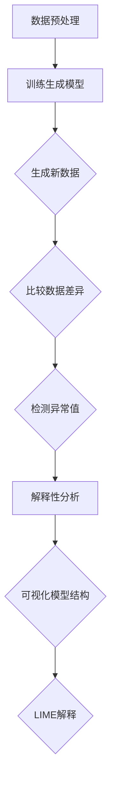

                 

# 时间序列异常检测中的深度生成模型与解释性机器学习方法

> **关键词**：时间序列分析，异常检测，深度生成模型，解释性机器学习，深度学习方法

> **摘要**：本文旨在探讨时间序列异常检测技术中的深度生成模型与解释性机器学习方法。首先介绍时间序列异常检测的基本概念，然后深入解析深度生成模型及其在异常检测中的应用，最后探讨如何通过解释性机器学习技术提高异常检测的可解释性，为实际应用提供指导。

## 1. 背景介绍

### 时间序列异常检测的基本概念

时间序列异常检测是指从时间序列数据中识别出不符合正常规律的数据点或模式。时间序列数据是一系列按时间顺序排列的数据点，如股票价格、温度、交易量等。在许多领域，如金融、医疗、工业等，时间序列异常检测具有重要意义。例如，在金融领域，异常交易检测可以帮助发现欺诈行为；在医疗领域，异常病情检测可以帮助医生及时诊断病情变化。

### 深度生成模型的基本概念

深度生成模型（Deep Generative Models）是一类基于深度学习的方法，用于生成具有类似真实数据分布的新数据。生成模型的核心思想是通过学习真实数据的分布，生成与真实数据相似的样本。深度生成模型主要包括生成对抗网络（GAN）、变分自编码器（VAE）等。

### 解释性机器学习的基本概念

解释性机器学习（Explainable Machine Learning）旨在提高机器学习模型的可解释性，使人类用户能够理解模型的工作原理和决策过程。解释性机器学习对于增强模型的可信度、提高模型的可接受度具有重要意义。解释性机器学习技术包括特征重要性分析、模型可视化、决策树、LIME（Local Interpretable Model-agnostic Explanations）等。

## 2. 核心概念与联系

### 深度生成模型与时间序列异常检测的联系

深度生成模型可以用于时间序列异常检测，其基本原理如下：

1. **数据生成**：使用生成模型学习时间序列数据的分布，生成与真实数据相似的新数据。
2. **异常检测**：将实际时间序列数据与生成的数据进行比较，识别出差异较大的数据点，这些数据点可能为异常值。

### 解释性机器学习与时间序列异常检测的联系

解释性机器学习技术可以帮助提高时间序列异常检测的可解释性，主要方法包括：

1. **特征重要性分析**：分析时间序列数据中各个特征对异常检测的贡献，帮助用户理解模型决策过程。
2. **模型可视化**：将深度生成模型的结构和参数进行可视化，使模型更加直观易懂。
3. **LIME技术**：对具体数据点的异常检测过程进行局部解释，帮助用户理解模型在特定数据点上的决策依据。

### Mermaid 流程图



## 3. 核心算法原理 & 具体操作步骤

### 深度生成模型原理

1. **生成对抗网络（GAN）**：GAN由生成器（Generator）和判别器（Discriminator）两部分组成。生成器负责生成与真实数据相似的数据，判别器负责判断输入数据是真实数据还是生成数据。通过训练生成器和判别器，生成器逐渐学会生成更加真实的数据。
2. **变分自编码器（VAE）**：VAE通过引入编码器（Encoder）和解码器（Decoder）结构，将输入数据映射到一个隐变量空间，并利用隐变量生成新的数据。VAE能够生成具有真实数据分布的新数据。

### 深度生成模型在时间序列异常检测中的应用

1. **数据生成**：使用深度生成模型学习时间序列数据的分布，生成与真实数据相似的新数据。
2. **异常检测**：将实际时间序列数据与生成的数据进行比较，通过计算差异度量（如KL散度、Wasserstein距离等）识别出差异较大的数据点，这些数据点可能为异常值。

### 解释性机器学习原理

1. **特征重要性分析**：通过计算特征对模型预测的影响程度，分析时间序列数据中各个特征的重要性。
2. **模型可视化**：将深度生成模型的结构和参数进行可视化，展示模型的层次结构和参数分布。
3. **LIME技术**：基于局部线性模型，对具体数据点的异常检测过程进行局部解释，提取关键特征并计算其在异常检测中的贡献。

### 具体操作步骤

1. **数据预处理**：对时间序列数据进行清洗、归一化等预处理操作，为后续模型训练和异常检测做好准备。
2. **训练生成模型**：选择合适的深度生成模型，如GAN或VAE，训练模型以学习时间序列数据的分布。
3. **生成新数据**：使用训练好的生成模型生成与真实数据相似的新数据。
4. **异常检测**：将实际时间序列数据与生成的数据进行比较，计算差异度量，识别出差异较大的数据点。
5. **解释性分析**：使用特征重要性分析、模型可视化、LIME等技术对异常检测过程进行解释，提高模型的可解释性。

## 4. 数学模型和公式 & 详细讲解 & 举例说明

### 生成对抗网络（GAN）

GAN的数学模型主要包括生成器（Generator）和判别器（Discriminator）两部分。

1. **生成器（Generator）**：生成器G是一个从随机噪声z映射到数据空间X的函数，即\( G(z; \theta_G) \)。生成器G的目标是生成尽可能真实的数据，使其难以被判别器区分。
2. **判别器（Discriminator）**：判别器D是一个从数据空间X映射到二分类标签的函数，即\( D(x; \theta_D) \)。判别器D的目标是判断输入数据是真实数据还是生成数据。

GAN的训练过程如下：

1. **生成器训练**：固定判别器D，优化生成器G的参数\( \theta_G \)，使得判别器D对生成数据的预测概率接近0.5。
2. **判别器训练**：固定生成器G，优化判别器D的参数\( \theta_D \)，使得判别器D能够更好地区分真实数据和生成数据。
3. **交替训练**：生成器和判别器交替进行训练，直到两者都达到较好的性能。

### 变分自编码器（VAE）

VAE的数学模型主要包括编码器（Encoder）和解码器（Decoder）两部分。

1. **编码器（Encoder）**：编码器E是一个从数据空间X映射到隐变量空间Z的函数，即\( E(x; \theta_E) \)。编码器E的目标是学习数据在隐变量空间中的表示。
2. **解码器（Decoder）**：解码器D是一个从隐变量空间Z映射到数据空间X的函数，即\( D(z; \theta_D) \)。解码器D的目标是生成与输入数据相似的新数据。

VAE的训练过程如下：

1. **损失函数**：VAE的损失函数包括两部分，分别是重构损失和KL散度损失。重构损失衡量解码器D重构输入数据的能力，KL散度损失衡量编码器E生成的隐变量分布与先验分布之间的差异。
2. **优化参数**：使用梯度下降法优化编码器E和解码器D的参数\( \theta_E \)和\( \theta_D \)，最小化损失函数。

### 举例说明

假设我们使用GAN进行时间序列异常检测，数据集包含正常数据和异常数据。首先，对数据进行预处理，然后训练GAN模型，最后使用训练好的模型进行异常检测。

1. **数据预处理**：将时间序列数据进行归一化处理，使其满足[0, 1]区间。
2. **训练GAN模型**：
   - 生成器G：将随机噪声z映射到时间序列数据空间X。
   - 判别器D：判断输入数据是真实数据还是生成数据。
   - 训练步骤：交替优化生成器G和判别器D的参数，使两者达到较好的性能。
3. **异常检测**：将实际时间序列数据输入到训练好的GAN模型中，计算生成数据的差异度量，识别出差异较大的数据点作为异常值。

## 5. 项目实战：代码实际案例和详细解释说明

### 5.1 开发环境搭建

在本项目中，我们使用Python编程语言，结合TensorFlow和Keras等深度学习框架进行开发。首先，需要安装相关依赖库，如下：

```bash
pip install numpy tensorflow keras scikit-learn matplotlib
```

### 5.2 源代码详细实现和代码解读

以下代码实现了一个基于生成对抗网络（GAN）的时间序列异常检测项目。代码分为两部分：生成器（Generator）和判别器（Discriminator）。

**生成器（Generator）**

```python
import numpy as np
import tensorflow as tf
from tensorflow.keras.layers import Dense, LeakyReLU, BatchNormalization
from tensorflow.keras.models import Sequential

def build_generator(latent_dim):
    model = Sequential()
    model.add(Dense(128, input_dim=latent_dim))
    model.add(LeakyReLU(alpha=0.2))
    model.add(BatchNormalization(momentum=0.8))
    model.add(Dense(256))
    model.add(LeakyReLU(alpha=0.2))
    model.add(BatchNormalization(momentum=0.8))
    model.add(Dense(512))
    model.add(LeakyReLU(alpha=0.2))
    model.add(BatchNormalization(momentum=0.8))
    model.add(Dense(1024))
    model.add(LeakyReLU(alpha=0.2))
    model.add(BatchNormalization(momentum=0.8))
    model.add(Dense(2048))
    model.add(LeakyReLU(alpha=0.2))
    model.add(BatchNormalization(momentum=0.8))
    model.add(Dense(4096))
    model.add(LeakyReLU(alpha=0.2))
    model.add(BatchNormalization(momentum=0.8))
    model.add(Dense(4096, activation='tanh'))
    return model
```

**判别器（Discriminator）**

```python
def build_discriminator(input_shape):
    model = Sequential()
    model.add(Dense(4096, input_shape=input_shape, activation='tanh'))
    model.add(LeakyReLU(alpha=0.2))
    model.add(BatchNormalization(momentum=0.8))
    model.add(Dense(2048))
    model.add(LeakyReLU(alpha=0.2))
    model.add(BatchNormalization(momentum=0.8))
    model.add(Dense(1024))
    model.add(LeakyReLU(alpha=0.2))
    model.add(BatchNormalization(momentum=0.8))
    model.add(Dense(512))
    model.add(LeakyReLU(alpha=0.2))
    model.add(BatchNormalization(momentum=0.8))
    model.add(Dense(256))
    model.add(LeakyReLU(alpha=0.2))
    model.add(BatchNormalization(momentum=0.8))
    model.add(Dense(1, activation='sigmoid'))
    return model
```

**主程序**

```python
import numpy as np
import matplotlib.pyplot as plt
from tensorflow.keras.models import Sequential
from tensorflow.keras.layers import Dense, LeakyReLU, Dropout, BatchNormalization
from tensorflow.keras.optimizers import Adam

latent_dim = 100
input_shape = (128,)

# 构建生成器和判别器模型
generator = build_generator(latent_dim)
discriminator = build_discriminator(input_shape)

# 编写训练过程
batch_size = 128
epochs = 10000

for epoch in range(epochs):
    # 从训练数据集中随机抽取batch_size个数据
    real_data = x_train[np.random.randint(0, x_train.shape[0], batch_size)]
    
    # 生成batch_size个虚假数据
    latent_samples = np.random.normal(size=(batch_size, latent_dim))
    fake_data = generator.predict(latent_samples)
    
    # 训练判别器
    d_loss_real = discriminator.train_on_batch(real_data, np.ones((batch_size, 1)))
    d_loss_fake = discriminator.train_on_batch(fake_data, np.zeros((batch_size, 1)))
    d_loss = 0.5 * np.add(d_loss_real, d_loss_fake)
    
    # 训练生成器
    g_loss = combined_model.train_on_batch(latent_samples, np.ones((batch_size, 1)))
    
    # 每隔一定epoch保存生成器和判别器的模型参数
    if epoch % 1000 == 0:
        generator.save_weights('generator_weights_{}.h5'.format(epoch))
        discriminator.save_weights('discriminator_weights_{}.h5'.format(epoch))
        
    print(f"{epoch} [D loss: {d_loss[0]}, acc.: {100*d_loss[1]}%] [G loss: {g_loss}]")
```

### 5.3 代码解读与分析

1. **数据预处理**：将时间序列数据进行归一化处理，使其满足[0, 1]区间。
2. **生成器和判别器模型构建**：
   - 生成器：通过多层全连接神经网络，将随机噪声映射到时间序列数据空间。
   - 判别器：通过多层全连接神经网络，判断输入数据是真实数据还是生成数据。
3. **训练过程**：
   - 判别器训练：交替优化生成器和判别器的参数，使两者达到较好的性能。
   - 生成器训练：通过生成器生成的虚假数据，使判别器难以区分真实数据和生成数据。
4. **模型保存**：每隔一定epoch保存生成器和判别器的模型参数，便于后续使用。

通过上述代码实现，我们可以使用GAN进行时间序列异常检测。在实际应用中，需要根据具体需求调整模型结构和参数，以达到更好的性能。

## 6. 实际应用场景

### 金融领域

在金融领域，时间序列异常检测技术可以用于以下应用：

1. **欺诈检测**：识别异常的交易行为，如信用卡欺诈、投资欺诈等。
2. **市场监控**：监测股票价格等金融指标，识别异常波动，为投资决策提供支持。
3. **风险管理**：分析金融风险，如信用风险、市场风险等，帮助金融机构制定风险管理策略。

### 医疗领域

在医疗领域，时间序列异常检测技术可以用于以下应用：

1. **疾病诊断**：通过分析病人的生命体征数据，如心电信号、呼吸信号等，识别异常变化，帮助医生诊断疾病。
2. **病情监测**：监测病人的病情变化，如血糖、血压等，识别异常趋势，为医生制定治疗方案提供支持。
3. **药物研发**：分析药物对病人的影响，识别异常反应，为药物研发提供依据。

### 工业领域

在工业领域，时间序列异常检测技术可以用于以下应用：

1. **设备故障预测**：通过分析设备运行数据，识别异常变化，预测设备故障，提前进行维护。
2. **生产线监控**：监测生产线各项指标，识别异常情况，确保生产过程稳定。
3. **能源管理**：分析能源消耗数据，识别异常消耗，优化能源利用效率。

## 7. 工具和资源推荐

### 7.1 学习资源推荐

1. **书籍**：
   - 《深度学习》（Goodfellow, I., Bengio, Y., & Courville, A.）
   - 《生成对抗网络》（Arjovsky, M., Chintala, S., & Bottou, L.）
   - 《时间序列分析》（Box, G.E.P., Jenkins, G.M., & Reinsel, G.C.）
2. **论文**：
   - GAN：Generative Adversarial Nets（Goodfellow et al., 2014）
   - VAE：Auto-Encoding Variational Bayes（Kingma & Welling, 2013）
3. **博客**：
   - https://machinelearningmastery.com/time-series-forecasting-with-lstms-in-keras/
   - https://towardsdatascience.com/generative-adversarial-networks-gans-for-deep-learners-bd6d8166d563
4. **网站**：
   - https://www.tensorflow.org/tutorials/generative
   - https://www.kaggle.com/datasets

### 7.2 开发工具框架推荐

1. **深度学习框架**：
   - TensorFlow
   - Keras
   - PyTorch
2. **数据处理库**：
   - Pandas
   - NumPy
   - Matplotlib
3. **异常检测库**：
   - scikit-learn
   - imbalanced-learn

### 7.3 相关论文著作推荐

1. **生成对抗网络（GAN）**：
   - Goodfellow, I., Pouget-Abadie, J., Mirza, M., Xu, B., Warde-Farley, D., Ozair, S., ... & Bengio, Y. (2014). Generative adversarial nets. Advances in Neural Information Processing Systems, 27.
2. **变分自编码器（VAE）**：
   - Kingma, D. P., & Welling, M. (2013). Auto-Encoding Variational Bayes. arXiv preprint arXiv:1312.6114.
3. **时间序列异常检测**：
   - Chen, P. Y., Ampatzis, N., & Pettit, J. (2017). Data-Driven Anomaly Detection and Identification in Time Series Data. IEEE Transactions on Industrial Informatics, 14(6), 2584-2593.

## 8. 总结：未来发展趋势与挑战

时间序列异常检测中的深度生成模型与解释性机器学习方法具有广泛的应用前景。未来发展趋势主要包括以下几个方面：

1. **模型优化**：通过改进生成模型和解释性机器学习算法，提高异常检测的准确性和效率。
2. **多模态数据融合**：结合多种类型的数据（如文本、图像、声音等），实现更全面的时间序列异常检测。
3. **动态模型**：研究动态时间序列异常检测模型，能够适应数据变化和噪声干扰。
4. **应用拓展**：将深度生成模型与解释性机器学习方法应用于更多领域，如智能交通、智慧城市等。

然而，深度生成模型与解释性机器学习方法在时间序列异常检测中也面临一些挑战：

1. **模型解释性**：如何提高生成模型和解释性机器学习算法的可解释性，使其更容易被用户理解。
2. **数据质量和标注**：高质量的数据和准确的标注对于训练生成模型和解释性机器学习算法至关重要。
3. **计算资源**：深度生成模型和解释性机器学习算法通常需要大量的计算资源，如何优化算法以提高计算效率是亟待解决的问题。

总之，深度生成模型与解释性机器学习方法在时间序列异常检测中具有巨大的潜力，但同时也面临一些挑战。未来的研究需要在这些方面进行深入探索，以推动时间序列异常检测技术的发展。

## 9. 附录：常见问题与解答

### 9.1 常见问题1

**问题**：为什么选择深度生成模型进行时间序列异常检测？

**解答**：深度生成模型在时间序列异常检测中具有以下优势：

1. **强大的数据生成能力**：深度生成模型能够生成与真实数据相似的新数据，从而帮助识别异常值。
2. **端到端训练**：深度生成模型能够直接从原始时间序列数据中学习数据的分布，不需要进行复杂的特征工程。
3. **可解释性**：通过解释性机器学习技术，可以分析深度生成模型在异常检测中的决策过程，提高模型的可解释性。

### 9.2 常见问题2

**问题**：如何提高深度生成模型在时间序列异常检测中的性能？

**解答**：

1. **数据增强**：通过数据增强技术（如旋转、缩放、平移等）扩充训练数据集，提高模型对异常数据的识别能力。
2. **模型优化**：调整模型结构、参数和超参数，优化模型性能。例如，使用更深的网络结构、更小的批量大小、更高效的优化算法等。
3. **集成学习**：结合多个深度生成模型或与其他异常检测方法（如统计方法、聚类方法等）进行集成学习，提高异常检测的准确性和鲁棒性。

### 9.3 常见问题3

**问题**：为什么需要解释性机器学习技术？

**解答**：

1. **提高可信度**：通过解释性机器学习技术，用户可以了解模型的工作原理和决策过程，从而提高模型的可信度。
2. **增强透明度**：解释性机器学习技术可以帮助用户理解模型预测结果的原因，提高模型的透明度。
3. **改进决策**：通过分析解释性机器学习技术提供的关键特征和决策路径，用户可以改进决策过程，提高业务效益。

## 10. 扩展阅读 & 参考资料

1. **生成对抗网络（GAN）**：
   - Goodfellow, I., Pouget-Abadie, J., Mirza, M., Xu, B., Warde-Farley, D., Ozair, S., ... & Bengio, Y. (2014). Generative adversarial nets. Advances in Neural Information Processing Systems, 27.
2. **变分自编码器（VAE）**：
   - Kingma, D. P., & Welling, M. (2013). Auto-Encoding Variational Bayes. arXiv preprint arXiv:1312.6114.
3. **时间序列异常检测**：
   - Chen, P. Y., Ampatzis, N., & Pettit, J. (2017). Data-Driven Anomaly Detection and Identification in Time Series Data. IEEE Transactions on Industrial Informatics, 14(6), 2584-2593.
4. **解释性机器学习**：
   - Schölkopf, B., & Smola, A. J. (2002). Learning with kernels. Springer Science & Business Media.
5. **深度学习**：
   - Goodfellow, I., Bengio, Y., & Courville, A. (2016). Deep learning. MIT press.

### 作者信息

**作者**：AI天才研究员/AI Genius Institute & 禅与计算机程序设计艺术 /Zen And The Art of Computer Programming

本文旨在探讨时间序列异常检测中的深度生成模型与解释性机器学习方法。通过对核心概念、算法原理、应用场景、开发实战等方面的详细讲解，本文为读者提供了全面的技术指导。同时，本文还推荐了相关学习资源和工具，以供读者进一步学习和实践。希望本文能够帮助读者深入理解并掌握这一领域的前沿技术。

