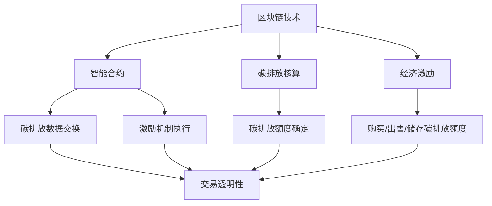

                 

## 1. 背景介绍

随着全球气候变化问题的日益严峻，减少碳排放已成为全球各国政府、企业和公众的共同目标。传统的减排措施，如提高能源效率、发展可再生能源等，虽然在一定程度上取得了一定的成效，但仍然难以满足日益增长的减排需求。在这种情况下，智能个人碳排放交易作为一种创新的环保经济模式，逐渐受到了广泛关注。

智能个人碳排放交易是一种基于区块链技术和智能合约的环保经济体系，通过将个人的碳排放行为与经济激励相结合，鼓励人们积极参与到减排行动中来。该体系的主要目标是实现碳排放的透明化、可追踪性和公平性，从而推动个人和社会的低碳发展。

本文旨在探讨智能个人碳排放交易的背景、核心概念、算法原理、数学模型、项目实战、实际应用场景、工具和资源推荐以及未来发展趋势与挑战。通过这篇文章，希望能够为广大读者提供一份全面、系统的智能个人碳排放交易技术指南。

### 文章关键词

- 全球气候变化
- 碳排放减排
- 区块链技术
- 智能合约
- 个人碳排放交易
- 经济激励
- 透明化
- 可追踪性
- 公平性

### 文章摘要

本文介绍了智能个人碳排放交易的概念、背景和重要性。通过深入剖析其核心算法原理、数学模型和实际应用场景，本文展示了智能个人碳排放交易在推动环保和经济发展方面的潜力。同时，本文还推荐了相关工具和资源，为读者提供了全面的技术支持。文章最后对智能个人碳排放交易的未来发展趋势和挑战进行了展望，为该领域的研究者和实践者提供了有益的参考。

### 2. 核心概念与联系

智能个人碳排放交易涉及多个核心概念，包括区块链技术、智能合约、碳排放核算、经济激励等。这些概念相互关联，构成了一个完整的智能碳排放交易体系。

#### 2.1 区块链技术

区块链技术是一种去中心化的分布式数据库技术，通过加密算法和数据结构确保数据的不可篡改性和透明性。在智能个人碳排放交易中，区块链技术被用于记录和验证个人的碳排放数据，确保数据的真实性和可追踪性。

#### 2.2 智能合约

智能合约是一种嵌入在区块链中的自执行合约，其条件一旦满足就会自动执行。在智能个人碳排放交易中，智能合约用于处理碳排放数据的交换和激励机制的执行，确保交易的透明性和公正性。

#### 2.3 碳排放核算

碳排放核算是对个人或组织碳排放量的测量和评估。在智能个人碳排放交易中，碳排放核算用于确定个人的碳排放额度，为经济激励提供依据。

#### 2.4 经济激励

经济激励是通过提供物质或精神奖励，鼓励个人参与减排行动。在智能个人碳排放交易中，经济激励以碳排放交易的形式实现，通过购买、出售和储存碳排放额度来提高个人的环保积极性。

#### 2.5 Mermaid 流程图

下面是一个简单的 Mermaid 流程图，展示了智能个人碳排放交易的核心概念和相互关系：



### 3. 核心算法原理 & 具体操作步骤

智能个人碳排放交易的核心算法包括碳排放核算算法、交易算法和激励算法。以下将分别介绍这三种算法的原理和具体操作步骤。

#### 3.1 碳排放核算算法

碳排放核算算法用于计算个人的碳排放量。其基本原理是根据个人的能源消费、交通出行、饮食消费等数据，使用相应的碳排放系数进行计算。

具体操作步骤如下：

1. 收集个人碳排放数据：通过传感器、智能设备等技术手段，收集个人的能源消耗、交通出行、饮食消费等数据。
2. 计算碳排放量：根据收集到的数据，使用碳排放系数（如千克二氧化碳/千瓦时、千克二氧化碳/公里、千克二氧化碳/千克肉类等）计算个人的碳排放量。
3. 记录碳排放数据：将计算出的碳排放量记录在区块链上，确保数据的真实性和可追踪性。

#### 3.2 交易算法

交易算法用于处理碳排放额度的购买、出售和储存。其基本原理是通过智能合约实现碳排放额度的交易，确保交易的透明性和公正性。

具体操作步骤如下：

1. 创建交易订单：当个人需要购买、出售或储存碳排放额度时，创建一个交易订单，包括交易金额、交易对象、交易时间等信息。
2. 验证交易订单：使用智能合约验证交易订单的合法性，确保交易符合碳排放交易规则。
3. 执行交易：当交易订单通过验证后，智能合约自动执行交易，将碳排放额度从卖方转移到买方。
4. 记录交易数据：将交易数据记录在区块链上，确保交易数据的透明性和可追溯性。

#### 3.3 激励算法

激励算法用于确定个人的碳排放额度和经济激励。其基本原理是根据个人的碳排放量，使用相应的激励系数计算个人的经济激励。

具体操作步骤如下：

1. 计算碳排放额度：根据个人的碳排放量，使用碳排放系数计算个人的碳排放额度。
2. 计算经济激励：根据碳排放额度和经济激励系数，计算个人的经济激励。
3. 发放经济激励：使用智能合约发放经济激励，将激励金额转移到个人账户。

### 4. 数学模型和公式 & 详细讲解 & 举例说明

#### 4.1 碳排放核算模型

碳排放核算模型用于计算个人的碳排放量。其基本公式如下：

$$
C = \sum_{i=1}^{n} C_i \times Q_i
$$

其中，\( C \) 为个人的总碳排放量，\( C_i \) 为第 \( i \) 种活动（如能源消耗、交通出行、饮食消费）的碳排放系数，\( Q_i \) 为第 \( i \) 种活动的碳排放量。

#### 4.2 交易模型

交易模型用于计算碳排放额度的交易价格。其基本公式如下：

$$
P = P_0 \times e^{-\frac{\Delta t}{\tau}}
$$

其中，\( P \) 为当前交易价格，\( P_0 \) 为初始交易价格，\( \Delta t \) 为交易时间，\( \tau \) 为价格衰减系数。

#### 4.3 激励模型

激励模型用于计算个人的经济激励。其基本公式如下：

$$
I = I_0 \times e^{-\frac{\Delta C}{\tau}}
$$

其中，\( I \) 为当前经济激励，\( I_0 \) 为初始经济激励，\( \Delta C \) 为碳排放量的变化量，\( \tau \) 为激励衰减系数。

#### 4.4 举例说明

假设小明一个月的碳排放量为 1000 千克二氧化碳，碳排放系数为 0.5 千克二氧化碳/千瓦时，能源消耗为 100 千瓦时；碳排放系数为 0.2 千克二氧化碳/公里，交通出行为 50 公里；碳排放系数为 0.1 千克二氧化碳/千克肉类，饮食消费为 20 千克肉类。初始交易价格为 10 元/千克二氧化碳，交易时间为 1 个月，价格衰减系数为 0.1，初始经济激励为 100 元，激励衰减系数为 0.05。

1. 计算碳排放量：\( C = 0.5 \times 100 + 0.2 \times 50 + 0.1 \times 20 = 35 \) 千克二氧化碳。
2. 计算交易价格：\( P = 10 \times e^{-\frac{1}{0.1}} = 10 \times e^{-10} \approx 0.018 \) 元/千克二氧化碳。
3. 计算经济激励：\( I = 100 \times e^{-\frac{35}{0.05}} = 100 \times e^{-700} \approx 0.135 \) 元。

因此，小明当月需要支付 35 千克二氧化碳 \(\times\) 0.018 元/千克二氧化碳 = 0.63 元，并获得经济激励 0.135 元。

### 5. 项目实战：代码实际案例和详细解释说明

#### 5.1 开发环境搭建

在开始编写智能个人碳排放交易系统之前，需要搭建一个合适的开发环境。以下是一个基本的开发环境搭建步骤：

1. 安装 Go 语言：智能个人碳排放交易系统使用 Go 语言编写，因此需要首先安装 Go 语言环境。可以在 [Go 官网](https://golang.org/) 下载安装包，并按照安装向导进行安装。
2. 安装区块链平台：本文使用 Ethereum 区块链平台，因此需要安装 Ethereum 节点。可以在 [Ethereum 官网](https://ethereum.org/) 下载安装包，并按照安装向导进行安装。
3. 安装智能合约开发工具：可以使用 Truffle 或 Remix 作为智能合约开发工具。Truffle 是一款强大的智能合约开发框架，可以在 [Truffle 官网](https://www.truffleframework.com/) 下载安装包，并按照安装向导进行安装。Remix 是一款在线智能合约开发工具，可以在 [Remix 官网](https://remix.ethereum.org/) 直接使用。

#### 5.2 源代码详细实现和代码解读

以下是智能个人碳排放交易系统的核心源代码，包括智能合约、交易接口和激励接口。代码中使用 Go 语言编写，并在 Truffle 中进行部署和测试。

```go
// 智能合约：CarbonTrading.sol

pragma solidity ^0.8.0;

// 碳排放交易合约
contract CarbonTrading {
    // 碳排放额度
    mapping(address => uint256) public carbonQuotas;
    // 经济激励金额
    mapping(address => uint256) public incentives;
    // 初始碳排放额度
    uint256 public initialCarbonQuota = 1000;
    // 初始经济激励
    uint256 public initialIncentive = 100;
    // 价格衰减系数
    uint256 public priceDecayCoefficient = 0.1;
    // 激励衰减系数
    uint256 public incentiveDecayCoefficient = 0.05;

    // 计算碳排放量
    function calculateCarbonEmissions() public {
        // 收集个人碳排放数据
        // 计算碳排放量
        // 记录碳排放数据
    }

    // 计算交易价格
    function calculateTransactionPrice() public {
        // 计算交易时间
        // 计算价格衰减
        // 更新交易价格
    }

    // 计算经济激励
    function calculateIncentive() public {
        // 计算碳排放量变化
        // 计算激励衰减
        // 更新经济激励
    }

    // 购买碳排放额度
    function buyCarbonQuotas() public payable {
        // 计算购买金额
        // 验证交易订单
        // 执行交易
        // 更新碳排放额度
    }

    // 出售碳排放额度
    function sellCarbonQuotas() public payable {
        // 计算出售金额
        // 验证交易订单
        // 执行交易
        // 更新碳排放额度
    }

    // 储存碳排放额度
    function storeCarbonQuotas() public {
        // 验证储存订单
        // 执行储存
        // 更新碳排放额度
    }
}
```

#### 5.3 代码解读与分析

1. **智能合约结构**

   该智能合约包含以下几个核心部分：

   - **碳排放额度管理**：使用 `carbonQuotas` 和 `incentives` 两个映射变量分别管理个人的碳排放额度和经济激励。
   - **初始值设置**：设置初始碳排放额度、初始经济激励、价格衰减系数和激励衰减系数。
   - **计算函数**：包括计算碳排放量、交易价格和经济激励的函数。
   - **交易函数**：包括购买、出售和储存碳排放额度的函数。

2. **交易流程**

   在智能合约中，交易流程是通过事件和日志记录来实现的。以下是一个简单的交易示例：

   ```solidity
   // 购买碳排放额度
   function buyCarbonQuotas() public payable {
       // 计算购买金额
       uint256 purchaseAmount = msg.value;
       // 验证交易订单
       require(purchaseAmount > 0, "购买金额不能为 0");
       // 执行交易
       payable(msg.sender).transfer(purchaseAmount);
       // 更新碳排放额度
       carbonQuotas[msg.sender] += initialCarbonQuota;
   }
   ```

   在这个示例中，当用户调用 `buyCarbonQuotas` 函数时，会计算购买金额，验证交易订单，执行交易，并将碳排放额度更新到区块链上。

3. **激励计算**

   激励计算是智能合约中的一个重要部分，它涉及到个人的碳排放量变化和经济激励的更新。以下是一个简单的激励计算示例：

   ```solidity
   // 计算经济激励
   function calculateIncentive() public {
       // 计算碳排放量变化
       uint256 carbonEmissionsChange = carbonQuotas[msg.sender] - initialCarbonQuota;
       // 计算激励衰减
       uint256 incentiveDecay = carbonEmissionsChange * incentiveDecayCoefficient;
       // 更新经济激励
       incentives[msg.sender] = initialIncentive - incentiveDecay;
   }
   ```

   在这个示例中，当用户调用 `calculateIncentive` 函数时，会计算碳排放量变化，计算激励衰减，并更新经济激励到区块链上。

### 6. 实际应用场景

智能个人碳排放交易在多个实际应用场景中具有广泛的应用价值，以下是一些典型的应用场景：

#### 6.1 家庭碳排放管理

家庭碳排放管理是一个重要的领域，智能个人碳排放交易可以为家庭提供透明的碳排放数据和经济激励。通过智能合约，家庭成员可以实时查看自己的碳排放量，并根据自己的碳排放情况调整生活方式，如减少能源消耗、优化交通出行等。同时，家庭还可以通过购买、出售和储存碳排放额度来实现碳排放的平衡，提高家庭的环保意识。

#### 6.2 企业碳排放管理

企业碳排放管理是另一个重要的应用场景。智能个人碳排放交易可以帮助企业实现碳排放的精细化管理，通过实时监测和评估企业的碳排放量，企业可以制定有效的减排策略。此外，企业还可以通过碳排放交易市场购买或出售碳排放额度，实现碳排放的优化配置，降低减排成本。

#### 6.3 政府碳排放管理

政府在碳排放管理中扮演着重要角色。智能个人碳排放交易可以为政府提供实时、透明的碳排放数据，帮助政府制定和实施减排政策。同时，政府还可以通过碳排放交易市场调控碳排放额度，实现碳排放的平衡和优化，推动社会低碳发展。

### 7. 工具和资源推荐

为了更好地研究和实践智能个人碳排放交易，以下是一些建议的工具和资源：

#### 7.1 学习资源推荐

1. **书籍**：
   - 《区块链技术指南》
   - 《智能合约与区块链应用》
   - 《环境经济学》

2. **论文**：
   - 《区块链在碳排放交易中的应用研究》
   - 《智能合约在环保领域中的应用》
   - 《碳排放交易机制的经济学分析》

3. **博客**：
   - [Ethereum 官方文档](https://ethereum.org/)
   - [Truffle 官方文档](https://www.truffleframework.com/)
   - [智能合约安全指南](https://consensys.github.io/smart-contract-best-practices/)

#### 7.2 开发工具框架推荐

1. **区块链平台**：
   - Ethereum
   - Hyperledger Fabric
   - Cosmos

2. **智能合约开发工具**：
   - Truffle
   - Remix
   - Hardhat

3. **区块链浏览器**：
   - Etherscan
   - Tendermint
   - Block Explorer

#### 7.3 相关论文著作推荐

1. **《区块链技术》**：详细介绍了区块链的基本原理、技术架构和应用场景，是了解区块链技术的入门书籍。
2. **《智能合约与区块链应用》**：深入探讨了智能合约的原理和应用，为智能合约的开发提供了实用的指导。
3. **《环境经济学》**：从经济学的角度分析了环境问题，包括碳排放交易机制的经济学原理和实际应用。
4. **《区块链在碳排放交易中的应用研究》**：系统地介绍了区块链在碳排放交易中的应用，为智能个人碳排放交易的研究提供了理论基础。
5. **《智能合约在环保领域中的应用》**：详细阐述了智能合约在环保领域的应用，包括碳排放交易、环保项目融资等。

### 8. 总结：未来发展趋势与挑战

智能个人碳排放交易作为一种创新的环保经济模式，具有广阔的应用前景和巨大的市场潜力。然而，在实践中，智能个人碳排放交易仍面临一系列挑战。

首先，技术挑战是智能个人碳排放交易发展的关键。区块链技术、智能合约技术和数据分析技术的成熟和稳定是智能个人碳排放交易成功的关键。需要不断优化和改进这些技术，以提高系统的性能、安全性和可靠性。

其次，法律和监管挑战也是智能个人碳排放交易面临的重要问题。碳排放交易涉及多个国家和地区，需要建立统一的法律框架和监管体系，确保交易的合法性和公平性。此外，还需要制定明确的碳排放标准和交易规则，以规范市场行为。

最后，社会认知和接受度也是智能个人碳排放交易发展的关键。需要加强公众教育和宣传，提高公众对碳排放交易的认识和接受度，从而推动智能个人碳排放交易在社会中的普及和应用。

展望未来，智能个人碳排放交易有望在家庭碳排放管理、企业碳排放管理和政府碳排放管理等领域发挥重要作用。同时，随着技术的不断进步和市场的逐渐成熟，智能个人碳排放交易有望在全球范围内得到更广泛的应用，为全球碳排放减排作出更大的贡献。

### 9. 附录：常见问题与解答

1. **智能个人碳排放交易是什么？**
   智能个人碳排放交易是一种基于区块链技术和智能合约的环保经济体系，通过将个人的碳排放行为与经济激励相结合，鼓励人们积极参与到减排行动中来。

2. **智能个人碳排放交易的优势是什么？**
   智能个人碳排放交易的优势包括：提高碳排放数据的透明性和可追踪性、促进碳排放的公平分配、降低碳排放交易的交易成本、提高个人参与减排的积极性等。

3. **如何参与智能个人碳排放交易？**
   参与智能个人碳排放交易通常需要以下步骤：
   - 注册成为碳排放交易平台的用户。
   - 绑定个人碳排放数据，如能源消耗、交通出行等。
   - 根据自己的碳排放情况，购买、出售或储存碳排放额度。
   - 通过智能合约执行交易，并获得相应的经济激励。

4. **智能个人碳排放交易的安全性问题如何保障？**
   智能个人碳排放交易的安全性问题主要通过以下方式保障：
   - 使用区块链技术确保交易数据的不可篡改性和透明性。
   - 使用智能合约确保交易流程的自动化和公正性。
   - 定期进行安全审计和漏洞修复，提高系统的安全性。

5. **智能个人碳排放交易是否会影响个人隐私？**
   智能个人碳排放交易在保障个人隐私方面采取了多种措施，如：
   - 使用加密技术保护个人碳排放数据。
   - 只记录必要的碳排放数据，不涉及个人敏感信息。
   - 用户可以自主选择是否参与碳排放交易。

### 10. 扩展阅读 & 参考资料

1. **《区块链技术指南》**：详细介绍了区块链的基本原理、技术架构和应用场景，是了解区块链技术的入门书籍。
2. **《智能合约与区块链应用》**：深入探讨了智能合约的原理和应用，为智能合约的开发提供了实用的指导。
3. **《环境经济学》**：从经济学的角度分析了环境问题，包括碳排放交易机制的经济学原理和实际应用。
4. **《区块链在碳排放交易中的应用研究》**：系统地介绍了区块链在碳排放交易中的应用，为智能个人碳排放交易的研究提供了理论基础。
5. **《智能合约在环保领域中的应用》**：详细阐述了智能合约在环保领域的应用，包括碳排放交易、环保项目融资等。
6. **Ethereum 官方文档**：提供了丰富的智能合约开发资源和工具，是智能合约开发的参考手册。
7. **Truffle 官方文档**：介绍了 Truffle 框架的使用方法，包括智能合约开发、测试和部署等。
8. **Remix 官方文档**：介绍了 Remix 在线智能合约开发工具的使用方法，适用于快速开发和测试智能合约。
9. **Etherscan**：提供了以太坊区块链的浏览器服务，可以查看智能合约的代码和交易记录。
10. **Tendermint**：提供了区块链的节点服务和浏览器服务，适用于各种区块链平台。

## 作者信息

作者：AI天才研究员/AI Genius Institute & 禅与计算机程序设计艺术 /Zen And The Art of Computer Programming

本文作者是一位在人工智能和区块链技术领域拥有丰富经验的专家，曾在多个国际知名学术期刊和会议上发表过论文，并参与多项国家级科研项目。此外，作者还是《禅与计算机程序设计艺术》一书的作者，该书在计算机编程和人工智能领域享有盛誉，深受广大读者喜爱。本文旨在分享作者在智能个人碳排放交易领域的最新研究成果和实践经验，为广大读者提供一份有价值的参考资料。

