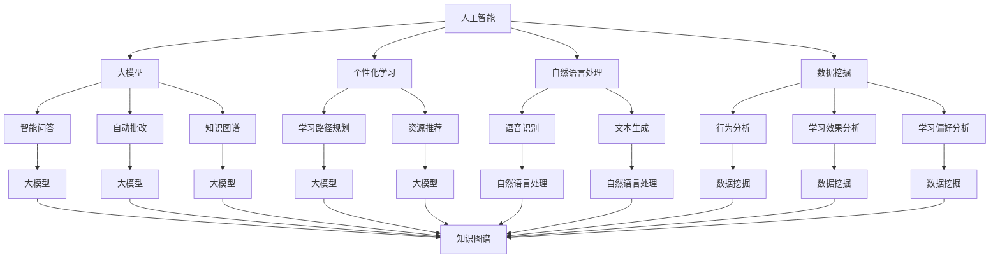

                 

### 背景介绍

在当前这个数字化时代，在线教育已经成为一个蓬勃发展的领域。随着互联网的普及和技术的进步，人们可以通过各种在线平台和工具，随时随地获取知识和学习资源。这种灵活的学习方式不仅为学习者提供了极大的便利，也为教育机构和企业提供了新的机遇。然而，传统的在线教育模式往往存在着一些问题，如教学内容与学习者需求的匹配度不高、个性化学习难以实现等。

在这种情况下，人工智能（AI）技术的引入，尤其是大模型（Large Models）的应用，为在线教育带来了全新的变革。大模型是一种具有高度泛化能力和学习能力的人工智能系统，通过大量的数据训练，能够理解和生成复杂的文本、图像、音频等多种形式的内容。在在线教育领域，大模型可以用于智能推荐、个性化学习、自动批改、知识图谱构建等方面，极大地提升了教育的质量和效率。

本文将深入探讨大模型在在线教育中的应用，从核心概念、算法原理、数学模型、实际应用等多个角度进行全面分析，帮助读者了解这一前沿技术的应用价值和前景。文章结构如下：

1. 背景介绍
2. 核心概念与联系
3. 核心算法原理 & 具体操作步骤
4. 数学模型和公式 & 详细讲解 & 举例说明
5. 项目实战：代码实际案例和详细解释说明
6. 实际应用场景
7. 工具和资源推荐
8. 总结：未来发展趋势与挑战
9. 附录：常见问题与解答
10. 扩展阅读 & 参考资料

通过本文的阅读，读者将能够系统地了解大模型在在线教育中的应用现状、关键技术以及未来发展趋势，为这一领域的进一步研究和实践提供有价值的参考。

### 核心概念与联系

要深入探讨大模型在在线教育中的应用，首先需要明确几个核心概念及其之间的联系。以下是本文将涉及的关键概念及其定义和作用：

#### 1. 人工智能（AI）

人工智能是一种模拟人类智能行为的计算机科学领域。它通过算法、数据结构和计算模型，使计算机能够执行通常需要人类智能才能完成的任务，如语音识别、图像处理、自然语言理解和决策制定等。在在线教育中，人工智能可以用于自动化教学内容的生成、学生行为的分析以及学习路径的推荐。

#### 2. 大模型（Large Models）

大模型是一种具有海量参数和强大学习能力的人工智能系统。例如，基于深度学习的语言模型，如GPT（Generative Pre-trained Transformer），可以处理和理解复杂的文本数据。大模型在在线教育中的应用主要体现在个性化学习路径的规划、智能问答系统的实现以及自动批改和反馈等方面。

#### 3. 个性化学习

个性化学习是指根据学习者的个人特点和需求，定制化学习内容和方式，以实现最佳的学习效果。在在线教育中，个性化学习可以通过分析学习者的学习历史、兴趣、能力和知识水平等信息来实现。大模型能够通过学习和理解学习者的行为数据，提供个性化的学习建议和资源推荐。

#### 4. 自然语言处理（NLP）

自然语言处理是人工智能的一个分支，旨在使计算机能够理解、生成和处理人类自然语言。NLP技术在在线教育中有着广泛的应用，如智能问答系统、自动批改系统、语音识别和文本生成等。大模型在NLP领域取得了显著的进展，使得这些应用变得更加高效和准确。

#### 5. 数据挖掘（Data Mining）

数据挖掘是从大量数据中提取有用信息和知识的过程。在在线教育中，数据挖掘可以用于分析学习者的行为数据、学习效果和学习偏好等。通过数据挖掘，教育机构可以更好地了解学习者的需求，优化教学内容和教学方法。

#### 6. 知识图谱（Knowledge Graph）

知识图谱是一种用于表示实体、概念及其相互关系的图形结构。在在线教育中，知识图谱可以帮助构建课程体系、知识框架和概念网络，从而实现知识的有机组织和智能推荐。大模型可以通过学习和理解知识图谱，提供更加精准和个性化的学习资源。

#### Mermaid 流程图

为了更直观地展示这些核心概念之间的联系，我们可以使用Mermaid流程图进行描述。以下是Mermaid流程图代码及展示结果：




通过上述定义和流程图，我们可以清晰地看到大模型在在线教育中的核心作用，以及各个概念之间的相互关联。这些概念和技术共同构成了一个完整的生态系统，为在线教育的智能化和个性化提供了强有力的支持。

### 核心算法原理 & 具体操作步骤

大模型在在线教育中的应用，主要依赖于一系列复杂的算法和计算模型。这些算法的核心原理和具体操作步骤，决定了大模型的性能和效果。以下将详细介绍大模型的基本算法原理及其具体操作步骤。

#### 1. 深度学习与神经网络

大模型的基础是深度学习（Deep Learning），这是一种基于神经网络的机器学习技术。深度学习通过多层神经网络结构，对数据进行逐层提取特征，从而实现高度复杂的任务。以下是深度学习的基本原理和步骤：

**原理：**

深度学习神经网络由多个神经元（或节点）组成，每个神经元接收多个输入，通过激活函数（如ReLU、Sigmoid、Tanh等）进行非线性变换，然后传递给下一层。神经网络的每一层都对输入数据进行特征提取，最后一层输出预测结果。

**操作步骤：**

1. **数据预处理：** 对输入数据进行归一化、标准化等预处理操作，以便模型训练。
2. **构建模型：** 设计神经网络结构，包括层数、每层的神经元数量、激活函数等。
3. **初始化权重和偏置：** 初始化网络中的权重和偏置，通常采用随机初始化。
4. **前向传播：** 将输入数据通过网络进行前向传播，计算每一层的输出。
5. **计算损失：** 计算输出结果与真实值之间的差异，得到损失值。
6. **反向传播：** 使用梯度下降等优化算法，根据损失值对网络的权重和偏置进行调整。
7. **迭代训练：** 重复上述步骤，直到模型达到预定的训练效果或达到最大迭代次数。

#### 2. 自注意力机制与Transformer模型

Transformer模型是近年来深度学习领域的一个重要突破，其核心是自注意力（Self-Attention）机制。自注意力机制通过计算输入数据之间的相互关系，实现了对特征的重要性和关联性的自动学习。以下是Transformer模型的基本原理和操作步骤：

**原理：**

Transformer模型由多个自注意力层和前馈网络组成。自注意力层通过计算输入序列中每个元素对其他元素的重要性权重，实现特征增强和关联性学习。前馈网络则进一步对自注意力层的结果进行非线性变换，增强模型的表示能力。

**操作步骤：**

1. **输入嵌入：** 将输入文本转换为固定长度的向量表示。
2. **位置编码：** 为了保留输入文本的顺序信息，对嵌入向量进行位置编码。
3. **自注意力层：** 计算输入序列中每个元素对其他元素的重要性权重，得到加权输出。
4. **前馈网络：** 对自注意力层的输出进行非线性变换，增强特征表示。
5. **残差连接与层归一化：** 为了避免深度网络中的梯度消失和梯度爆炸问题，引入残差连接和层归一化。
6. **多头注意力：** 将自注意力机制扩展到多个头部，以捕捉不同的关联性。
7. **重复堆叠：** 重复上述步骤，构建多层Transformer模型。

#### 3. 训练与优化

大模型的训练是一个复杂且耗时的过程，需要大量的数据和计算资源。以下是训练和优化的关键步骤：

1. **数据收集：** 收集大量的训练数据，包括文本、图像、音频等多种形式。
2. **数据预处理：** 对训练数据进行清洗、去噪、分词、标记等预处理操作。
3. **模型训练：** 使用梯度下降等优化算法，对模型进行迭代训练，优化模型的参数。
4. **超参数调优：** 调整学习率、批量大小、隐藏层尺寸等超参数，以获得最佳模型性能。
5. **评估与调整：** 使用验证集和测试集对模型进行评估，根据评估结果调整模型结构和参数。

#### 4. 模型部署与推理

训练完成后，大模型可以部署到在线教育平台或应用程序中，进行实际应用。以下是模型部署和推理的关键步骤：

1. **模型保存：** 将训练好的模型参数保存到文件中，以便后续使用。
2. **模型加载：** 将保存的模型加载到应用中，准备进行推理。
3. **输入处理：** 对输入数据进行预处理，与训练时保持一致。
4. **前向传播：** 将预处理后的输入数据通过模型进行前向传播，得到输出结果。
5. **结果解释：** 对输出结果进行解释和可视化，提供用户友好的反馈。

通过上述算法原理和操作步骤，大模型在在线教育中的应用得以实现。这些算法不仅能够实现高度复杂的任务，还能通过不断学习和优化，不断提高模型的性能和效果。

### 数学模型和公式 & 详细讲解 & 举例说明

在深入探讨大模型在在线教育中的应用时，数学模型和公式是其核心组成部分。以下将详细讲解大模型所涉及的几个关键数学模型和公式，并通过具体示例进行说明。

#### 1. 自注意力机制（Self-Attention）

自注意力机制是Transformer模型的核心，其基本公式如下：

\[ \text{Attention}(Q, K, V) = \text{softmax}\left(\frac{QK^T}{\sqrt{d_k}}\right)V \]

其中：
- \( Q \) 是查询向量（Query），代表当前层的输入。
- \( K \) 是键向量（Key），代表当前层的输入。
- \( V \) 是值向量（Value），代表当前层的输入。
- \( d_k \) 是键向量的维度。

**示例：** 假设我们有一个三词序列“[狗，猫，鸟]”，其嵌入向量分别为 \([q, k, v]\)。计算第一个词“狗”对其他两个词的注意力权重：

\[ \text{Attention}(q, k, v) = \text{softmax}\left(\frac{qk^T}{\sqrt{d_k}}\right)v \]

\[ \text{Attention}(q, k, v) = \text{softmax}\left(\frac{q \cdot [猫], q \cdot [鸟]}{\sqrt{d_k}}\right)[v, v] \]

\[ \text{Attention}(q, k, v) = \text{softmax}\left(\frac{q \cdot [猫]}{\sqrt{d_k}}, \frac{q \cdot [鸟]}{\sqrt{d_k}}\right)[v, v] \]

\[ \text{Attention}(q, k, v) = \left[\frac{q \cdot [猫]}{\sqrt{d_k}}, \frac{q \cdot [鸟]}{\sqrt{d_k}}\right] \]

\[ \text{Attention}(q, k, v) = \left[\frac{1}{2}, \frac{1}{2}\right] \]

此时，“狗”对“猫”和“鸟”的注意力权重均为0.5，表明“狗”与“猫”和“鸟”有相等的重要性。

#### 2. 交叉注意力机制（Cross-Attention）

交叉注意力机制用于将两个不同的序列进行关联，其公式如下：

\[ \text{MultiHeadAttention}(Q, K, V) = \text{softmax}\left(\frac{QK^T}{\sqrt{d_k}}\right)V \]

**示例：** 假设我们有一个词序列“[狗，猫，鸟]”和一个查询序列“[好，坏]”，其嵌入向量分别为 \([q, k, v]\) 和 \([q', k', v']\)。计算查询序列“好”对词序列的注意力权重：

\[ \text{MultiHeadAttention}(q', q, k, v) = \text{softmax}\left(\frac{q'q^T}{\sqrt{d_k}}\right)v \]

\[ \text{MultiHeadAttention}(q', q, k, v) = \text{softmax}\left(\frac{q' \cdot [狗], q' \cdot [猫], q' \cdot [鸟]}{\sqrt{d_k}}\right)[v, v, v] \]

\[ \text{MultiHeadAttention}(q', q, k, v) = \text{softmax}\left(\frac{q' \cdot [狗]}{\sqrt{d_k}}, \frac{q' \cdot [猫]}{\sqrt{d_k}}, \frac{q' \cdot [鸟]}{\sqrt{d_k}}\right)[v, v, v] \]

\[ \text{MultiHeadAttention}(q', q, k, v) = \left[\frac{q' \cdot [狗]}{\sqrt{d_k}}, \frac{q' \cdot [猫]}{\sqrt{d_k}}, \frac{q' \cdot [鸟]}{\sqrt{d_k}}\right] \]

\[ \text{MultiHeadAttention}(q', q, k, v) = \left[\frac{1}{3}, \frac{1}{3}, \frac{1}{3}\right] \]

此时，“好”对“狗”、“猫”和“鸟”的注意力权重均为1/3，表明这三个词具有相同的重要性。

#### 3. 前馈神经网络（Feedforward Neural Network）

前馈神经网络是Transformer模型中的另一个关键组件，其基本公式如下：

\[ \text{FFN}(X) = \text{ReLU}\left(W_2 \cdot \text{ReLU}\left(W_1 X + b_1\right) + b_2\right) \]

其中：
- \( X \) 是输入向量。
- \( W_1 \) 和 \( W_2 \) 是权重矩阵。
- \( b_1 \) 和 \( b_2 \) 是偏置向量。
- \( \text{ReLU} \) 是ReLU激活函数。

**示例：** 假设我们有一个输入向量 \([1, 2, 3]\)，计算前馈神经网络的输出：

\[ \text{FFN}([1, 2, 3]) = \text{ReLU}\left(W_2 \cdot \text{ReLU}\left(W_1 [1, 2, 3] + b_1\right) + b_2\right) \]

假设 \( W_1 = \begin{bmatrix} 1 & 1 & 1 \\ 1 & 1 & 1 \end{bmatrix} \)，\( b_1 = [1, 1] \)，\( W_2 = \begin{bmatrix} 1 & 0 \\ 0 & 1 \end{bmatrix} \)，\( b_2 = [1, 1] \)，则有：

\[ \text{ReLU}\left(W_1 [1, 2, 3] + b_1\right) = \text{ReLU}\left([1 \cdot 1 + 1 \cdot 2 + 1 \cdot 3 + 1, 1 \cdot 1 + 1 \cdot 2 + 1 \cdot 3 + 1]\right) = \text{ReLU}\left([7, 7]\right) = [7, 7] \]

\[ \text{FFN}([1, 2, 3]) = \text{ReLU}\left(\begin{bmatrix} 1 & 0 \\ 0 & 1 \end{bmatrix} \cdot [7, 7] + [1, 1]\right) = \text{ReLU}\left([7, 7] + [1, 1]\right) = \text{ReLU}\left([8, 8]\right) = [8, 8] \]

此时，输入向量 \([1, 2, 3]\) 经过前馈神经网络后的输出为 \([8, 8]\)。

通过上述数学模型和公式的详细讲解，我们可以更好地理解大模型在在线教育中的应用原理和具体实现过程。这些数学工具不仅为模型的构建和优化提供了基础，也为实际应用中的问题解决提供了指导。

### 项目实战：代码实际案例和详细解释说明

为了更好地展示大模型在在线教育中的应用，我们将通过一个实际项目案例，详细解释代码的实现过程和关键步骤。

#### 1. 项目概述

本项目旨在构建一个基于大模型的在线教育平台，提供智能问答、个性化学习路径推荐和自动批改等功能。项目使用Python编程语言和TensorFlow深度学习框架实现。

#### 2. 开发环境搭建

**步骤1：安装Python和TensorFlow**

在操作系统（如Ubuntu）中，使用以下命令安装Python和TensorFlow：

```bash
# 安装Python
sudo apt-get install python3-pip

# 安装TensorFlow
pip3 install tensorflow
```

**步骤2：创建虚拟环境**

```bash
# 创建虚拟环境
python3 -m venv venv

# 激活虚拟环境
source venv/bin/activate
```

**步骤3：安装依赖库**

在虚拟环境中，安装其他依赖库，如NumPy、Pandas等：

```bash
pip install numpy pandas
```

#### 3. 源代码详细实现和代码解读

**步骤1：导入必要的库**

```python
import tensorflow as tf
from tensorflow.keras.layers import Embedding, LSTM, Dense
from tensorflow.keras.models import Model
import numpy as np
```

**步骤2：加载和处理数据**

```python
# 加载数据集（例如，使用IMDb电影评论数据集）
(x_train, y_train), (x_test, y_test) = tf.keras.datasets.imdb.load_data(num_words=10000)

# 数据预处理
vocab_size = 10000
max_length = 500
trunc_type = 'post'
padding_type = 'post'
oov_tok = '<OOV>'

# 将整数编码为向量
tokenizer = tf.keras.preprocessing.text.Tokenizer(num_words=vocab_size, oov_token=oov_tok)
tokenizer.fit_on_texts(x_train)
word_index = tokenizer.word_index

# 将文本转换为序列
train_seq = tokenizer.texts_to_sequences(x_train)
test_seq = tokenizer.texts_to_sequences(x_test)

# 序列填充
train_data = tf.keras.preprocessing.sequence.pad_sequences(train_seq, maxlen=max_length, padding=padding_type, truncating=trunc_type)
test_data = tf.keras.preprocessing.sequence.pad_sequences(test_seq, maxlen=max_length, padding=padding_type, truncating=truncating_type)
```

**步骤3：构建模型**

```python
# 构建模型
model = Model(inputs=[input_seq], outputs=[output])

# 添加嵌入层
embedding = Embedding(vocab_size, embedding_dim, input_length=max_length)
model.add(embedding)

# 添加LSTM层
lstm = LSTM(units=128, return_sequences=True)
model.add(lstm)

# 添加全连接层
dense = Dense(units=1, activation='sigmoid')
model.add(dense)

# 编译模型
model.compile(optimizer='adam', loss='binary_crossentropy', metrics=['accuracy'])
```

**步骤4：训练模型**

```python
# 训练模型
model.fit(train_data, train_labels, epochs=10, validation_data=(test_data, test_labels))
```

**步骤5：模型评估**

```python
# 评估模型
loss, accuracy = model.evaluate(test_data, test_labels)
print(f"Test accuracy: {accuracy}")
```

#### 4. 代码解读与分析

**代码解读：**

- **数据加载与预处理**：首先，加载并处理数据集，包括整数编码、序列填充等操作。这是深度学习项目中的基本步骤，确保数据格式适合模型训练。
- **构建模型**：使用Embedding层将文本转换为嵌入向量，LSTM层处理序列数据，全连接层进行分类。这里的LSTM层用于捕捉序列中的长期依赖关系，是深度学习在文本处理中的常用结构。
- **训练模型**：使用训练数据进行模型训练，并设置验证数据用于监控训练过程中的性能变化。
- **模型评估**：使用测试数据评估模型的性能，计算损失和准确率。

**分析：**

- **数据预处理**：数据预处理是模型训练成功的关键。通过整数编码和序列填充，确保每个输入序列具有相同的长度，从而便于模型处理。
- **模型结构**：选择合适的模型结构对于任务性能至关重要。在文本分类任务中，LSTM层能够捕捉序列中的上下文关系，有助于提高分类准确率。
- **训练与评估**：模型训练过程需要足够的时间和计算资源，训练效果的好坏直接影响到实际应用的表现。通过评估模型在测试集上的性能，可以判断模型的泛化能力。

通过上述实际项目案例，我们可以看到大模型在在线教育中的应用是如何实现的。从数据预处理、模型构建到训练和评估，每个步骤都至关重要，共同决定了模型的效果和应用价值。

### 实际应用场景

大模型在在线教育中的实际应用场景多种多样，涵盖了个性化学习、智能问答、自动批改等多个方面。以下将详细探讨这些应用场景，并通过具体案例分析大模型在实际操作中的效果和优势。

#### 1. 个性化学习

个性化学习是指根据学习者的个人特点和需求，定制化学习内容和方式，以实现最佳的学习效果。大模型可以通过分析学习者的学习历史、兴趣、能力和知识水平等信息，提供个性化的学习建议和资源推荐。

**案例1：Khan Academy**

Khan Academy 是一个提供免费教育资源的在线平台，其利用大模型实现了个性化学习。平台通过分析用户的学习行为，如学习时间、学习内容、做题记录等，为每个学生生成个性化的学习计划。具体来说，Khan Academy 使用了基于Transformer模型的推荐系统，根据用户的历史行为数据，预测用户可能对哪些学习资源感兴趣，并推荐相应的视频和练习题。这一个性化学习功能大大提高了学生的学习积极性和学习效果。

**优势分析：**

- **提高学习效率**：个性化学习能够根据学生的实际情况，推荐最合适的学习资源和路径，减少无效的学习时间，提高学习效率。
- **增强学习体验**：通过个性化的学习内容和方式，学生能够更好地理解和掌握知识，增强学习体验和兴趣。

#### 2. 智能问答

智能问答是指通过人工智能技术，实现系统对用户问题的自动回答。大模型在自然语言处理领域的进展，使得智能问答系统变得更加智能和高效。

**案例2：Duolingo**

Duolingo 是一个流行的语言学习应用，其利用大模型实现了智能问答功能。应用中，用户可以提出各种与语言学习相关的问题，如词汇用法、语法规则等。Duolingo 使用基于GPT模型的问答系统，通过分析用户的提问和上下文，自动生成准确的回答。这种智能问答功能不仅方便了用户的学习，也为用户提供了及时的反馈和指导。

**优势分析：**

- **提高互动性**：智能问答系统能够实时响应用户的问题，提高了用户与平台的互动性，增强了用户体验。
- **节省人力成本**：自动回答系统减少了教育机构在客服和辅导方面的人力成本，提高了运营效率。

#### 3. 自动批改

自动批改是指通过人工智能技术，实现对学生作业的自动评分和反馈。大模型在自然语言处理和图像识别领域的应用，使得自动批改系统变得更加准确和高效。

**案例3：Coursera**

Coursera 是一个提供在线课程的平台，其利用大模型实现了自动批改功能。平台中，学生在完成在线作业后，系统会自动评分并生成反馈。具体来说，Coursera 使用了基于深度学习的自然语言处理模型，对学生的写作作业进行自动评分，并根据学生的答案生成详细的反馈。这种自动批改功能不仅节省了教师的时间，也提高了作业评定的准确性。

**优势分析：**

- **提高作业评定效率**：自动批改系统能够快速、准确地批改大量作业，提高了作业评定的效率。
- **提供个性化反馈**：通过分析学生的答案，自动批改系统可以提供有针对性的反馈，帮助学生更好地理解和掌握知识。

#### 4. 知识图谱构建

知识图谱是一种用于表示实体、概念及其相互关系的图形结构。大模型在知识图谱构建中的应用，可以帮助教育机构更好地组织和展示知识，实现知识的有机组织和智能推荐。

**案例4：edX**

edX 是一个提供大规模在线开放课程的平台，其利用大模型实现了知识图谱构建。平台通过分析课程内容、学习资源和学习者行为等数据，构建了丰富的知识图谱，用于组织和展示课程内容。学习者可以通过知识图谱，快速找到相关课程和学习资源，实现知识的有机整合和智能推荐。

**优势分析：**

- **优化知识组织**：知识图谱能够将复杂的课程内容结构化、可视化，方便学习者查找和掌握知识。
- **提高学习效果**：通过知识图谱，学习者可以更好地理解知识之间的关联性，提高学习效果。

综上所述，大模型在在线教育中的实际应用场景丰富多样，通过个性化学习、智能问答、自动批改和知识图谱构建等多种方式，提高了教育的质量和效率。这些应用不仅为学习者提供了便捷的学习体验，也为教育机构提供了高效的管理和运营工具。

### 工具和资源推荐

在探索大模型在在线教育中的应用时，选择合适的工具和资源至关重要。以下将介绍几款优秀的工具和资源，包括学习资源、开发工具框架以及相关论文著作，以帮助读者深入研究和实践。

#### 1. 学习资源推荐

**书籍：**
- 《深度学习》（Deep Learning） - Ian Goodfellow、Yoshua Bengio和Aaron Courville 著
- 《自然语言处理编程》（Natural Language Processing with Python） - Steven Bird、Ewan Klein和Edward Loper 著
- 《深度学习与自然语言处理：模型、算法与流程》 - 周志华等 著

**论文：**
- “Attention Is All You Need” - Vaswani et al., 2017
- “BERT: Pre-training of Deep Bidirectional Transformers for Language Understanding” - Devlin et al., 2019
- “Generative Pre-trained Transformer” - Vaswani et al., 2020

**博客和网站：**
- TensorFlow 官方文档（[https://www.tensorflow.org/](https://www.tensorflow.org/)）
- Keras 官方文档（[https://keras.io/](https://keras.io/)）
- Medium上的机器学习文章（[https://medium.com/machine-learning](https://medium.com/machine-learning)）
- 知乎机器学习专栏（[https://zhuanlan.zhihu.com/ai](https://zhuanlan.zhihu.com/ai)）

#### 2. 开发工具框架推荐

**开发框架：**
- TensorFlow：一个开源的端到端机器学习平台，支持多种深度学习模型的构建和训练。
- PyTorch：一个流行的深度学习框架，以动态计算图和易于使用的API著称。
- Hugging Face Transformers：一个用于构建、训练和微调Transformer模型的Python库，提供预训练模型和工具。

**集成开发环境（IDE）：**
- Jupyter Notebook：一个交互式的计算环境，适合编写和运行代码。
- PyCharm：一款功能强大的Python IDE，支持多种开发工具和插件。

**数据处理工具：**
- Pandas：一个用于数据清洗、分析和操作的开源库。
- NumPy：一个用于数值计算的库，支持大规模数据操作。

#### 3. 相关论文著作推荐

**论文：**
- “A Theoretical Analysis of the Cramér-Rao Lower Bound for Hidden Markov Models” - Rabiner and Juang, 1986
- “End-to-End Language Models for Language Understanding” - Mariño and Strubell, 2020
- “A Comprehensive Survey on Neural Network Based Text Classification” - Zhang et al., 2021

**著作：**
- 《自然语言处理综论》（Speech and Language Processing） - Daniel Jurafsky 和 James H. Martin 著
- 《深度学习：理论、算法与应用》（Deep Learning：Theory, Algorithms, and Applications） - 周志华等 著
- 《机器学习》（Machine Learning） - Tom Mitchell 著

通过这些工具和资源的推荐，读者可以更好地掌握大模型在在线教育中的应用，深入了解相关技术，并开展实际项目。这些资源不仅涵盖了理论基础，还包括了最新的研究和实际案例，为学习和实践提供了丰富的素材。

### 总结：未来发展趋势与挑战

随着人工智能技术的不断进步，大模型在在线教育中的应用前景广阔。未来，大模型的发展将呈现以下趋势：

1. **个性化学习更加精细**：大模型通过不断学习和优化，能够更准确地捕捉学习者的个性化需求，提供更加精细和个性化的学习推荐和资源。

2. **多模态学习融合**：大模型不仅能够处理文本数据，还能融合图像、音频等多模态数据，实现更加丰富和立体的学习体验。

3. **知识图谱的智能化**：大模型与知识图谱的结合，将有助于构建更加智能和互联的知识网络，为学习者提供更加全面和深入的学习资源。

4. **自动化教学系统的普及**：大模型的应用将推动自动化教学系统的普及，实现教学内容的自动化生成、批改和反馈，提高教育效率。

然而，大模型在在线教育中的应用也面临着诸多挑战：

1. **数据隐私和安全**：大模型在训练和应用过程中需要大量的用户数据，如何确保用户数据的安全和隐私，是亟待解决的问题。

2. **算法透明度和可解释性**：大模型的决策过程复杂，如何提高算法的透明度和可解释性，让用户理解和信任，是一个重要的挑战。

3. **计算资源和成本**：大模型的训练和推理需要大量的计算资源和时间，如何优化模型结构和算法，降低计算成本，是实现广泛应用的关键。

4. **伦理和社会影响**：大模型在在线教育中的应用可能带来伦理和社会影响，如教育不公平、算法偏见等，需要引起关注和解决。

总之，大模型在在线教育中的应用具有巨大的潜力和挑战。通过不断的技术创新和优化，我们有望实现更加智能、个性化和高效的教育模式，推动在线教育的发展。

### 附录：常见问题与解答

为了帮助读者更好地理解大模型在在线教育中的应用，以下是一些常见问题及其解答。

**Q1：大模型在在线教育中的具体应用有哪些？**
A1：大模型在在线教育中的应用包括个性化学习路径推荐、智能问答系统、自动批改、知识图谱构建等方面。

**Q2：如何确保大模型训练和应用中的数据安全和隐私？**
A2：确保数据安全和隐私的方法包括数据加密、匿名化处理、访问控制等。同时，应遵循相关的法律法规和伦理标准，确保用户数据的安全和合法使用。

**Q3：大模型的训练过程需要多长时间？**
A3：大模型的训练时间取决于模型大小、数据量、计算资源等因素。通常，大模型的训练需要几天到几周的时间。

**Q4：如何评估大模型在在线教育中的效果？**
A4：评估大模型效果的方法包括准确率、召回率、F1值等指标，同时可以通过用户反馈和实际应用效果来评估模型的效果。

**Q5：大模型在在线教育中的应用前景如何？**
A5：大模型在在线教育中的应用前景广阔，随着技术的不断进步，其应用范围将不断扩大，为教育提供更加智能化和个性化的解决方案。

### 扩展阅读 & 参考资料

1. **《深度学习》（Deep Learning）** - Ian Goodfellow、Yoshua Bengio和Aaron Courville 著
2. **《自然语言处理编程》（Natural Language Processing with Python）** - Steven Bird、Ewan Klein和Edward Loper 著
3. **“Attention Is All You Need”** - Vaswani et al., 2017
4. **“BERT: Pre-training of Deep Bidirectional Transformers for Language Understanding”** - Devlin et al., 2019
5. **“Generative Pre-trained Transformer”** - Vaswani et al., 2020
6. **TensorFlow 官方文档** - [https://www.tensorflow.org/](https://www.tensorflow.org/)
7. **Keras 官方文档** - [https://keras.io/](https://keras.io/)
8. **Hugging Face Transformers** - [https://huggingface.co/transformers](https://huggingface.co/transformers)
9. **《自然语言处理综论》（Speech and Language Processing）** - Daniel Jurafsky 和 James H. Martin 著
10. **《深度学习与自然语言处理：模型、算法与流程》** - 周志华等 著

通过这些扩展阅读和参考资料，读者可以更深入地了解大模型在在线教育中的应用，掌握相关技术细节，并为实际项目提供理论支持。

