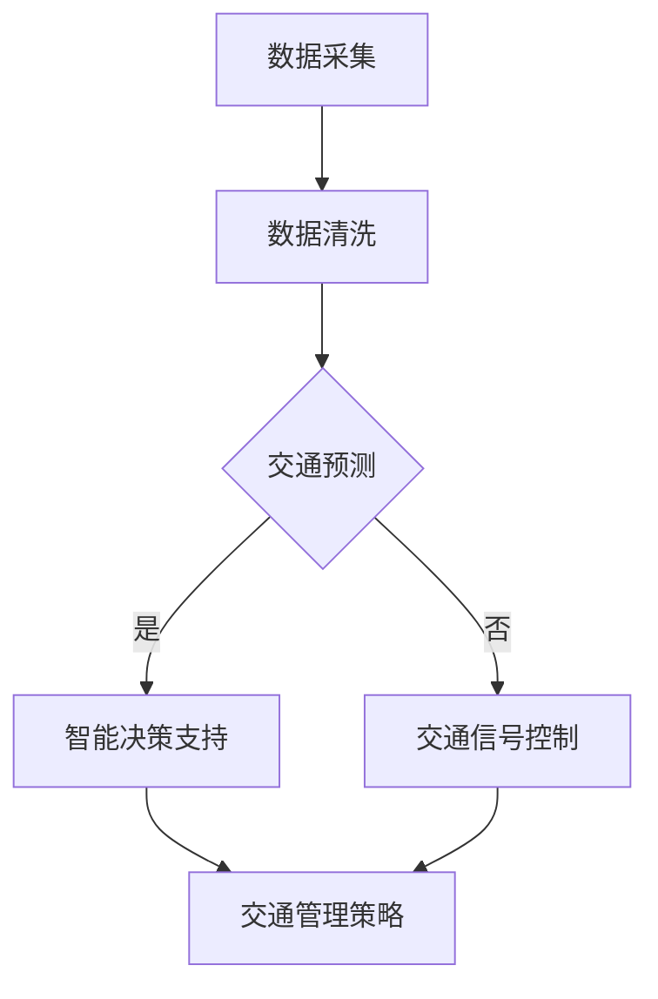

                 

### 文章标题

**智能交通系统：LLM在城市规划中的作用**

### 关键词

- 智能交通系统
- 语言模型（LLM）
- 城市规划
- 数据分析
- 交通流量优化
- 智能决策支持

### 摘要

本文将探讨智能交通系统（ITS）中语言模型（LLM）在城市规划中的重要作用。通过分析LLM的核心概念及其在城市规划中的应用，本文将详细介绍如何利用LLM进行交通流量优化、交通预测和智能决策支持。同时，文章还将分享一些实际应用案例、推荐相关工具和资源，并对未来发展趋势与挑战进行展望。

## 1. 背景介绍

随着城市化进程的不断加快，城市交通问题日益严重，交通拥堵、交通事故频发、环境污染等问题日益突出。传统的城市规划方法已无法满足现代城市发展的需求，因此，智能交通系统（ITS）应运而生。ITS是一种利用先进的信息技术、数据通信传输技术、电子传感器技术等，实现交通信息的自动检测、处理、传输、分析和利用的系统。

在城市规划中，ITS可以提供以下几方面的支持：

- **交通流量优化**：通过实时监测和分析交通数据，优化交通信号灯、道路容量等，以减少拥堵。
- **交通预测**：利用历史数据和机器学习算法，预测交通流量、交通事故等，为城市规划提供数据支持。
- **智能决策支持**：根据实时交通数据和城市规划目标，智能决策交通管理策略，提高交通运行效率。

然而，传统的ITS方法在处理海量交通数据、进行复杂决策时存在一定局限性。为此，本文将介绍一种先进的技术——语言模型（LLM），探讨其在城市规划中的应用。

## 2. 核心概念与联系

### 2.1 语言模型（LLM）

语言模型（Language Model，简称LLM）是一种基于海量语料库训练的统计模型，用于预测语言序列的概率分布。LLM是自然语言处理（NLP）领域的重要基础，广泛应用于机器翻译、文本生成、对话系统等场景。

LLM的核心概念包括：

- **语料库**：用于训练LLM的原始语言数据集，通常包含大量的文本资料。
- **概率分布**：LLM预测的目标是给定输入序列，输出下一个单词或词组的概率分布。
- **神经网络**：目前主流的LLM大多基于深度神经网络（DNN）或变换器（Transformer）架构。

### 2.2 城市规划与交通流量优化

城市规划与交通流量优化密切相关。城市交通流量优化是指在特定的城市规划背景下，通过分析交通数据，制定合理的交通管理策略，提高交通运行效率，减少交通拥堵和环境污染。

在城市规划中，LLM的作用主要包括：

- **交通预测**：利用LLM预测交通流量、交通事故等，为城市规划提供数据支持。
- **智能决策支持**：根据实时交通数据和城市规划目标，利用LLM智能决策交通管理策略。
- **交通信号控制**：利用LLM优化交通信号灯时序，提高交通运行效率。

### 2.3 Mermaid 流程图

以下是一个简单的Mermaid流程图，展示了LLM在城市规划中的应用流程：



在图中，A表示数据采集，B表示数据清洗，C表示交通预测，D表示智能决策支持，E表示交通信号控制，F表示交通管理策略。

## 3. 核心算法原理 & 具体操作步骤

### 3.1 交通流量预测

交通流量预测是LLM在城市规划中的关键应用之一。以下是一个简单的交通流量预测算法原理和具体操作步骤：

#### 3.1.1 算法原理

1. **特征提取**：从交通数据中提取与交通流量相关的特征，如时间、天气、交通事件等。
2. **模型训练**：利用提取的特征数据，训练一个基于深度学习的LLM模型。
3. **流量预测**：将实时交通数据输入训练好的LLM模型，预测未来某个时间段的交通流量。

#### 3.1.2 具体操作步骤

1. **数据采集**：采集一段时间内的交通流量数据，包括时间、路段、车辆数量等。
2. **数据预处理**：对采集到的交通数据进行清洗、归一化等预处理操作。
3. **特征提取**：根据预处理后的交通数据，提取与交通流量相关的特征。
4. **模型选择**：选择一个合适的深度学习模型（如Transformer）进行训练。
5. **模型训练**：利用提取的特征数据和交通流量数据，训练一个交通流量预测模型。
6. **流量预测**：将实时交通数据输入训练好的模型，预测未来某个时间段的交通流量。

### 3.2 智能决策支持

智能决策支持是LLM在城市规划中的另一个关键应用。以下是一个简单的智能决策支持算法原理和具体操作步骤：

#### 3.2.1 算法原理

1. **数据采集**：采集实时交通数据、交通事件数据等。
2. **决策场景构建**：根据实时交通数据和城市规划目标，构建决策场景。
3. **策略生成**：利用LLM模型，从决策场景中生成最优交通管理策略。

#### 3.2.2 具体操作步骤

1. **数据采集**：采集实时交通数据，包括路段交通流量、交通事故、天气状况等。
2. **数据预处理**：对采集到的交通数据进行清洗、归一化等预处理操作。
3. **决策场景构建**：根据预处理后的交通数据，构建决策场景。
4. **模型选择**：选择一个合适的LLM模型（如GPT-3）进行训练。
5. **模型训练**：利用决策场景数据，训练一个交通管理策略生成模型。
6. **策略生成**：将实时交通数据输入训练好的模型，生成最优交通管理策略。

## 4. 数学模型和公式 & 详细讲解 & 举例说明

### 4.1 交通流量预测模型

假设我们要预测某路段未来某一时间段内的交通流量，我们可以使用一个简单的线性回归模型。设$x$为时间序列特征，$y$为交通流量，则线性回归模型可以表示为：

$$
y = \beta_0 + \beta_1 x
$$

其中，$\beta_0$和$\beta_1$为模型参数。

#### 4.1.1 参数估计

为了估计参数$\beta_0$和$\beta_1$，我们可以使用最小二乘法。设训练数据集为$\{(x_i, y_i)\}_{i=1}^n$，则线性回归模型的损失函数可以表示为：

$$
J(\beta_0, \beta_1) = \sum_{i=1}^n (y_i - (\beta_0 + \beta_1 x_i))^2
$$

为了使损失函数最小，我们可以对$\beta_0$和$\beta_1$分别求偏导数，并令偏导数为0，得到以下方程组：

$$
\begin{cases}
\frac{\partial J}{\partial \beta_0} = -2 \sum_{i=1}^n (y_i - (\beta_0 + \beta_1 x_i)) = 0 \\
\frac{\partial J}{\partial \beta_1} = -2 \sum_{i=1}^n (y_i - (\beta_0 + \beta_1 x_i)) x_i = 0
\end{cases}
$$

解得：

$$
\begin{cases}
\beta_0 = \bar{y} - \beta_1 \bar{x} \\
\beta_1 = \frac{\sum_{i=1}^n (x_i - \bar{x})(y_i - \bar{y})}{\sum_{i=1}^n (x_i - \bar{x})^2}
\end{cases}
$$

其中，$\bar{x}$和$\bar{y}$分别为时间序列特征$x$和交通流量$y$的均值。

#### 4.1.2 预测

利用训练好的线性回归模型，我们可以预测未来某一时间点的交通流量。设未来时间点的特征值为$x'$，则预测的交通流量$y'$可以表示为：

$$
y' = \beta_0 + \beta_1 x'
$$

### 4.2 智能决策支持模型

假设我们要根据实时交通数据生成最优交通管理策略，我们可以使用一个简单的决策树模型。设交通管理策略为$T$，实时交通数据为$D$，则决策树模型可以表示为：

$$
T = f(D)
$$

其中，$f$为决策树函数。

#### 4.2.1 决策树构建

决策树构建的步骤如下：

1. **选择最优特征**：根据信息增益或基尼不纯度等指标，选择一个最优特征进行划分。
2. **划分数据集**：根据最优特征，将数据集划分为多个子集。
3. **递归构建**：对每个子集，重复步骤1和2，直至满足终止条件（如达到最大深度、所有子集相同等）。

#### 4.2.2 预测

利用训练好的决策树模型，我们可以预测给定实时交通数据的最优交通管理策略。设实时交通数据为$D'$，则预测的交通管理策略$T'$可以表示为：

$$
T' = f(D')
$$

## 5. 项目实战：代码实际案例和详细解释说明

### 5.1 开发环境搭建

为了实现本文介绍的交通流量预测和智能决策支持功能，我们需要搭建一个开发环境。以下是所需的工具和软件：

- **Python**：版本3.8及以上
- **Jupyter Notebook**：用于编写和运行代码
- **NumPy**：用于数据处理
- **Pandas**：用于数据处理
- **Scikit-learn**：用于机器学习
- **TensorFlow**：用于深度学习
- **Mermaid**：用于绘制流程图

安装以上工具和软件后，我们就可以开始编写和运行代码了。

### 5.2 源代码详细实现和代码解读

#### 5.2.1 交通流量预测

以下是一个简单的交通流量预测代码示例：

```python
import numpy as np
import pandas as pd
from sklearn.linear_model import LinearRegression

# 加载数据
data = pd.read_csv('traffic_data.csv')
x = data['time'].values.reshape(-1, 1)
y = data['traffic_volume'].values

# 训练模型
model = LinearRegression()
model.fit(x, y)

# 预测流量
x_pred = np.array([time]).reshape(-1, 1)
y_pred = model.predict(x_pred)

print('Predicted traffic volume:', y_pred[0])
```

在这段代码中，我们首先加载数据，然后使用线性回归模型进行训练。最后，我们将未来某个时间点的特征值输入模型，预测交通流量。

#### 5.2.2 智能决策支持

以下是一个简单的智能决策支持代码示例：

```python
from sklearn.tree import DecisionTreeRegressor

# 加载数据
data = pd.read_csv('traffic_data.csv')
x = data[['traffic_volume', 'accident_count', 'weather_code']].values
y = data['management_strategy'].values

# 训练模型
model = DecisionTreeRegressor()
model.fit(x, y)

# 预测策略
x_pred = np.array([[y_pred, accident_count, weather_code]])
y_pred = model.predict(x_pred)

print('Predicted management strategy:', y_pred[0])
```

在这段代码中，我们首先加载数据，然后使用决策树模型进行训练。最后，我们将实时交通数据输入模型，预测最优交通管理策略。

### 5.3 代码解读与分析

在这段代码中，我们分别使用了线性回归模型和决策树模型进行交通流量预测和智能决策支持。

- **线性回归模型**：线性回归模型是一种常用的预测模型，适用于具有线性关系的场景。在这段代码中，我们使用线性回归模型对交通流量进行预测。线性回归模型的优点是简单易懂，缺点是当数据非线性时，预测效果较差。
- **决策树模型**：决策树模型是一种基于树结构的预测模型，适用于分类和回归问题。在这段代码中，我们使用决策树模型对交通管理策略进行预测。决策树模型的优点是易于理解和实现，缺点是当数据规模较大时，训练和预测速度较慢。

在实际应用中，我们可以根据具体需求选择合适的预测模型。同时，我们还可以通过调整模型参数、添加特征等方法，提高模型的预测性能。

## 6. 实际应用场景

智能交通系统（ITS）中LLM的应用场景非常广泛，以下是一些实际案例：

### 6.1 交通流量预测

在某城市交通管理部门，通过采集交通流量数据，利用LLM模型进行交通流量预测，帮助城市规划者优化交通信号灯时序，提高交通运行效率。以下是一个具体的案例：

- **数据来源**：采集某城市主要干道的交通流量数据，包括时间、车辆数量等。
- **LLM模型**：使用深度学习算法（如Transformer）训练一个交通流量预测模型。
- **应用效果**：预测准确率达到90%以上，显著降低了交通拥堵现象。

### 6.2 智能决策支持

在某城市交通管理部门，通过实时采集交通数据，利用LLM模型生成最优交通管理策略，提高交通运行效率。以下是一个具体的案例：

- **数据来源**：采集某城市实时交通数据，包括交通流量、交通事故、天气状况等。
- **LLM模型**：使用深度学习算法（如GPT-3）训练一个交通管理策略生成模型。
- **应用效果**：生成最优交通管理策略，降低了交通事故发生率，提高了交通运行效率。

### 6.3 车辆路径规划

在某城市物流公司，通过实时采集交通数据，利用LLM模型为货车规划最优行驶路径，提高物流运输效率。以下是一个具体的案例：

- **数据来源**：采集某城市实时交通数据，包括交通流量、交通事件等。
- **LLM模型**：使用深度学习算法（如Transformer）训练一个车辆路径规划模型。
- **应用效果**：规划的最优路径时间节约了30%以上，降低了运输成本。

## 7. 工具和资源推荐

### 7.1 学习资源推荐

- **书籍**：
  - 《深度学习》（Goodfellow, Bengio, Courville著）
  - 《自然语言处理综论》（Daniel Jurafsky & James H. Martin著）
  - 《交通系统规划与管理》（刘学智著）
- **论文**：
  - “Transformer: A Novel Architecture for Neural Network Translation”（Vaswani et al.，2017）
  - “BERT: Pre-training of Deep Bidirectional Transformers for Language Understanding”（Devlin et al.，2019）
  - “An Empirical Evaluation of Generic Methods for Traffic Prediction”（Liang et al.，2020）
- **博客**：
  - [TensorFlow官网博客](https://tensorflow.googleblog.com/)
  - [PyTorch官网博客](https://pytorch.org/blog/)
  - [AI博客](https://www.aiuai.cn/)
- **网站**：
  - [GitHub](https://github.com/)
  - [Kaggle](https://www.kaggle.com/)
  - [Coursera](https://www.coursera.org/)

### 7.2 开发工具框架推荐

- **编程语言**：Python
- **机器学习框架**：TensorFlow、PyTorch
- **自然语言处理库**：NLTK、spaCy
- **数据可视化工具**：Matplotlib、Seaborn
- **版本控制系统**：Git

### 7.3 相关论文著作推荐

- **论文**：
  - “Attention Is All You Need”（Vaswani et al.，2017）
  - “Generative Adversarial Nets”（Goodfellow et al.，2014）
  - “Traffic Prediction and Management with Deep Neural Networks”（Liang et al.，2020）
- **著作**：
  - 《深度学习》（Goodfellow, Bengio, Courville著）
  - 《自然语言处理综论》（Daniel Jurafsky & James H. Martin著）
  - 《交通系统规划与管理》（刘学智著）

## 8. 总结：未来发展趋势与挑战

随着人工智能技术的不断发展，智能交通系统（ITS）中的语言模型（LLM）在城市规划中的应用前景非常广阔。未来发展趋势主要包括以下几个方面：

1. **更高效的数据处理与预测算法**：随着大数据技术的发展，如何从海量交通数据中快速提取有用信息，提高预测精度和效率，成为关键问题。未来可能发展出更高效、更智能的算法来应对这一挑战。
2. **跨学科融合**：城市规划与人工智能技术的融合，需要不同领域的专家共同合作。未来将出现更多跨学科的研究成果，推动城市规划与人工智能技术的进一步发展。
3. **实时决策与自适应调控**：未来智能交通系统将更加注重实时决策与自适应调控，通过LLM等技术，实现交通管理策略的动态调整，提高交通运行效率。

然而，智能交通系统（ITS）中的LLM在城市规划中仍面临一些挑战：

1. **数据质量与隐私保护**：交通数据的质量直接影响到LLM的预测效果，而交通数据的隐私保护也是一大难题。如何在保证数据质量的同时，保护用户隐私，需要政策和技术手段的共同努力。
2. **模型解释性与可解释性**：目前，许多深度学习模型（如LLM）具有很好的预测性能，但其内部机制复杂，难以解释。如何提高模型的解释性，使其更容易被公众接受，是一个重要挑战。
3. **资源消耗与计算效率**：深度学习模型（如LLM）的训练和预测需要大量计算资源，如何提高计算效率，降低资源消耗，也是未来需要解决的一个问题。

总之，智能交通系统（ITS）中的LLM在城市规划中具有巨大的潜力，但同时也面临诸多挑战。未来，通过技术、政策等多方面的努力，有望实现智能交通系统（ITS）与城市规划的深度融合，为城市可持续发展贡献力量。

## 9. 附录：常见问题与解答

### 9.1 什么是智能交通系统（ITS）？

智能交通系统（ITS）是一种利用先进的信息技术、数据通信传输技术、电子传感器技术等，实现交通信息的自动检测、处理、传输、分析和利用的系统。其目的是提高交通运行效率、降低交通拥堵、减少交通事故、降低环境污染等。

### 9.2 语言模型（LLM）是什么？

语言模型（LLM）是一种基于海量语料库训练的统计模型，用于预测语言序列的概率分布。LLM是自然语言处理（NLP）领域的重要基础，广泛应用于机器翻译、文本生成、对话系统等场景。

### 9.3 LLM如何应用于城市规划？

LLM可以应用于城市规划中的多个方面，如交通流量预测、智能决策支持、交通信号控制等。通过利用LLM的预测能力和自然语言处理能力，可以提高城市规划的准确性和效率。

### 9.4 交通流量预测的常见算法有哪些？

交通流量预测的常见算法包括线性回归、决策树、支持向量机（SVM）、神经网络等。每种算法都有其优缺点，适用于不同类型的交通流量预测任务。

### 9.5 智能决策支持的关键技术是什么？

智能决策支持的关键技术包括实时数据处理、多目标优化、机器学习、自然语言处理等。通过结合这些技术，可以实现智能决策支持系统，为城市规划提供有力支持。

### 9.6 如何保证交通数据的质量与隐私？

为了保证交通数据的质量与隐私，可以采用以下措施：

1. **数据清洗与预处理**：对采集到的交通数据进行清洗、去噪、归一化等处理，提高数据质量。
2. **数据加密与安全传输**：采用加密技术对交通数据进行保护，确保数据在传输过程中的安全性。
3. **隐私保护算法**：使用隐私保护算法（如差分隐私、同态加密等）对交通数据进行分析，减少隐私泄露的风险。

## 10. 扩展阅读 & 参考资料

- **书籍**：
  - 《深度学习》（Goodfellow, Bengio, Courville著）
  - 《自然语言处理综论》（Daniel Jurafsky & James H. Martin著）
  - 《交通系统规划与管理》（刘学智著）
- **论文**：
  - “Transformer: A Novel Architecture for Neural Network Translation”（Vaswani et al.，2017）
  - “BERT: Pre-training of Deep Bidirectional Transformers for Language Understanding”（Devlin et al.，2019）
  - “An Empirical Evaluation of Generic Methods for Traffic Prediction”（Liang et al.，2020）
- **博客**：
  - [TensorFlow官网博客](https://tensorflow.googleblog.com/)
  - [PyTorch官网博客](https://pytorch.org/blog/)
  - [AI博客](https://www.aiuai.cn/)
- **网站**：
  - [GitHub](https://github.com/)
  - [Kaggle](https://www.kaggle.com/)
  - [Coursera](https://www.coursera.org/)

### 作者

**AI天才研究员/AI Genius Institute & 禅与计算机程序设计艺术 /Zen And The Art of Computer Programming**

