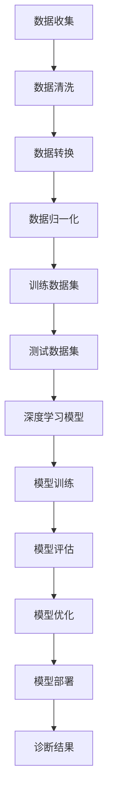

                 

# 智能医疗诊断的AI大模型解决方案

> **关键词**：智能医疗，AI大模型，医疗诊断，深度学习，算法原理，应用场景，开发工具

> **摘要**：本文深入探讨智能医疗诊断领域的AI大模型解决方案。首先，介绍智能医疗诊断的背景和现状，然后详细解释AI大模型的核心概念和架构，接着阐述核心算法原理和具体操作步骤，通过数学模型和公式进行详细讲解，并举例说明。随后，分享一个实际项目实战案例，介绍开发环境和代码实现。文章还讨论了智能医疗诊断的应用场景，推荐了相关学习资源和开发工具。最后，总结了智能医疗诊断AI大模型的未来发展趋势与挑战，并提供了一些常见问题的解答和扩展阅读。

## 1. 背景介绍

随着人工智能技术的飞速发展，医疗行业也迎来了深刻的变革。智能医疗诊断作为人工智能在医疗领域的典型应用，逐渐成为医疗行业的关键技术之一。传统的医疗诊断主要依赖于医生的经验和临床知识，然而，面对日益增长的患者数量和复杂的疾病类型，人工诊断效率低下且容易出现误诊。

智能医疗诊断利用人工智能技术，特别是深度学习算法，可以对大量的医疗数据进行分析和处理，从而提高诊断的准确性和效率。AI大模型在这一过程中起到了至关重要的作用，它们能够自动学习和提取医疗数据中的关键特征，实现对疾病的精准识别。

当前，智能医疗诊断领域的研究和应用主要集中在以下两个方面：

1. **疾病预测与筛查**：通过分析患者的病历、基因信息等数据，AI大模型可以预测患者未来可能出现的疾病风险，帮助医生提前制定预防措施，从而降低疾病的发生率。

2. **疾病诊断与分类**：AI大模型可以处理和分析大量的医疗图像、文本数据，帮助医生快速、准确地诊断疾病类型，提高诊断的效率和质量。

尽管智能医疗诊断已经取得了一定的进展，但仍面临诸多挑战，如数据隐私和安全问题、模型的泛化能力不足等。因此，开发有效的AI大模型解决方案，提高智能医疗诊断的准确性和可靠性，是当前亟待解决的问题。

## 2. 核心概念与联系

### 2.1 智能医疗诊断

智能医疗诊断是指利用人工智能技术，特别是深度学习算法，对医疗数据进行分析和处理，从而实现疾病预测、筛查、诊断和分类等功能。智能医疗诊断的核心在于将大量的医疗数据转化为有用的信息，以帮助医生做出更准确、更及时的诊断。

### 2.2 AI大模型

AI大模型是指具有大规模参数、强大计算能力的人工神经网络模型。这些模型可以自动从数据中学习，提取出有用的特征，并实现对复杂问题的准确预测。在智能医疗诊断中，AI大模型主要用于处理和分析大量的医疗数据，提高诊断的准确性和效率。

### 2.3 深度学习算法

深度学习算法是一种模拟人脑神经元之间相互连接和作用的人工神经网络算法。它通过多层网络结构对数据进行学习和处理，可以自动提取出数据中的高阶特征，实现对复杂问题的建模和预测。在智能医疗诊断中，常用的深度学习算法包括卷积神经网络（CNN）、循环神经网络（RNN）和生成对抗网络（GAN）等。

### 2.4 数据预处理

数据预处理是智能医疗诊断中至关重要的一环。它包括数据清洗、数据转换和数据归一化等步骤，旨在提高数据的质量和一致性，从而为深度学习模型提供更好的训练数据。

### 2.5 数据集

数据集是训练深度学习模型的基础。在智能医疗诊断中，需要收集和整理大量的医疗数据，如病历、基因信息、医疗图像等，以构建用于训练和测试的数据集。数据集的质量和多样性直接影响模型的性能和泛化能力。

### 2.6 标签

标签是对医疗数据进行分类的重要依据。在智能医疗诊断中，标签通常用于对疾病类型进行分类，如癌症、心脏病、糖尿病等。通过标签，深度学习模型可以学习到不同疾病之间的差异和特征，从而实现对疾病的精准诊断。

### 2.7 评价指标

评价指标是衡量智能医疗诊断模型性能的重要工具。常用的评价指标包括准确率、召回率、F1分数等。通过这些评价指标，可以评估模型的诊断准确性和泛化能力，为模型的优化和改进提供依据。

### 2.8 Mermaid 流程图

以下是智能医疗诊断的Mermaid流程图：



## 3. 核心算法原理 & 具体操作步骤

### 3.1 卷积神经网络（CNN）

卷积神经网络（CNN）是一种专门用于处理图像数据的深度学习算法。它的核心思想是通过多层卷积和池化操作，从图像中提取出有用的特征，从而实现对图像的识别和分类。

具体操作步骤如下：

1. **输入层**：输入一张图像，图像的每个像素点都对应一个特征值。

2. **卷积层**：通过卷积操作，将输入图像与卷积核（一组参数）进行卷积运算，得到一组特征图。卷积操作可以提取图像中的局部特征。

3. **池化层**：对特征图进行下采样，减少特征图的尺寸，同时保留重要的特征信息。常用的池化操作有最大池化和平均池化。

4. **激活函数**：对卷积层和池化层的输出进行非线性变换，常用的激活函数有ReLU（Rectified Linear Unit）函数。

5. **全连接层**：将卷积层和池化层输出的特征图展开为一维向量，作为全连接层的输入。全连接层通过矩阵乘法和激活函数，将特征向量映射到输出类别。

6. **损失函数**：使用交叉熵损失函数（Cross-Entropy Loss）来评估模型预测结果与实际标签之间的差距，并通过反向传播算法（Backpropagation Algorithm）更新模型参数。

7. **优化器**：使用梯度下降（Gradient Descent）或其变种（如Adam优化器）来优化模型参数，减小损失函数。

### 3.2 循环神经网络（RNN）

循环神经网络（RNN）是一种用于处理序列数据的深度学习算法。它通过在时间步上递归地更新隐藏状态，可以捕捉序列数据中的长期依赖关系。

具体操作步骤如下：

1. **输入层**：输入一个序列，每个时间步的输入是一个向量。

2. **隐藏层**：在每个时间步，将输入向量与隐藏状态进行拼接，并通过一个线性层（Gated Linear Unit, GLU）更新隐藏状态。

3. **门控层**：使用门控机制（如Recurrent Gate、Forget Gate和Input Gate）来控制信息的传递和遗忘。这些门控机制可以根据输入和隐藏状态动态地调整信息的保留和遗忘。

4. **输出层**：将隐藏状态映射到输出类别。

5. **损失函数**：使用交叉熵损失函数（Cross-Entropy Loss）来评估模型预测结果与实际标签之间的差距，并通过反向传播算法（Backpropagation Algorithm）更新模型参数。

6. **优化器**：使用梯度下降（Gradient Descent）或其变种（如Adam优化器）来优化模型参数，减小损失函数。

### 3.3 生成对抗网络（GAN）

生成对抗网络（GAN）是一种通过两个对抗网络（生成器和判别器）相互竞争来生成高质量数据的深度学习算法。

具体操作步骤如下：

1. **生成器**：生成器网络通过输入噪声向量生成虚拟数据。

2. **判别器**：判别器网络用于区分真实数据和生成数据。

3. **对抗训练**：生成器和判别器相互竞争，生成器和判别器交替更新参数。

4. **损失函数**：生成器的损失函数是判别器输出为生成数据的概率，判别器的损失函数是判别器输出为真实数据和生成数据的概率。

5. **优化器**：使用梯度下降（Gradient Descent）或其变种（如Adam优化器）来优化生成器和判别器的参数。

## 4. 数学模型和公式 & 详细讲解 & 举例说明

### 4.1 卷积神经网络（CNN）

卷积神经网络（CNN）的核心在于卷积操作和池化操作。下面分别介绍这两个操作的数学模型和公式。

#### 卷积操作

卷积操作的数学模型可以表示为：

$$
(Z_{ij}^{(l)})_{m \times n} = \sum_{i=1}^{k_{m}} \sum_{j=1}^{k_{n}} X_{ij}^{(l-1)} \cdot W_{ij}^{(l)} + b_{ij}^{(l)}
$$

其中，$Z_{ij}^{(l)}$ 表示第 $l$ 层的第 $i$ 行第 $j$ 列的特征图，$X_{ij}^{(l-1)}$ 表示第 $l-1$ 层的第 $i$ 行第 $j$ 列的输入特征，$W_{ij}^{(l)}$ 表示第 $l$ 层的第 $i$ 行第 $j$ 列的卷积核，$b_{ij}^{(l)}$ 表示第 $l$ 层的第 $i$ 行第 $j$ 列的偏置。

#### 池化操作

池化操作的数学模型可以表示为：

$$
P_{ij}^{(l)} = \max(P_{ij}^{(l-1)})
$$

其中，$P_{ij}^{(l)}$ 表示第 $l$ 层的第 $i$ 行第 $j$ 列的池化结果，$P_{ij}^{(l-1)}$ 表示第 $l-1$ 层的第 $i$ 行第 $j$ 列的特征图。

### 4.2 循环神经网络（RNN）

循环神经网络（RNN）的核心在于递归操作和门控机制。下面分别介绍这两个操作的数学模型和公式。

#### 递归操作

递归操作的数学模型可以表示为：

$$
h_t = \text{ReLU}(W_{ih} x_t + W_{hh} h_{t-1} + b_h)
$$

其中，$h_t$ 表示第 $t$ 个时间步的隐藏状态，$x_t$ 表示第 $t$ 个时间步的输入，$W_{ih}$ 表示输入到隐藏层的权重矩阵，$W_{hh}$ 表示隐藏到隐藏层的权重矩阵，$b_h$ 表示隐藏层的偏置。

#### 门控机制

门控机制的数学模型可以表示为：

$$
i_t = \text{ReLU}(W_{ii} x_t + W_{ih} h_{t-1} + b_i) \\
f_t = \text{ReLU}(W_{if} x_t + W_{ih} h_{t-1} + b_f) \\
o_t = \text{ReLU}(W_{io} x_t + W_{ih} h_{t-1} + b_o) \\
h_t = \text{sigmoid}(W_{ho} h_{t-1} + b_o) \\
c_t = f_t \cdot c_{t-1} + i_t \cdot \text{ReLU}(W_{ic} x_t + b_c) \\
h_t = o_t \cdot \text{ReLU}(W_{hc} c_t + b_h)
$$

其中，$i_t$、$f_t$ 和 $o_t$ 分别表示输入门、遗忘门和输出门，$c_t$ 表示细胞状态，$h_t$ 表示第 $t$ 个时间步的隐藏状态。

### 4.3 生成对抗网络（GAN）

生成对抗网络（GAN）的核心在于生成器和判别器。下面分别介绍这两个网络的数学模型和公式。

#### 生成器

生成器的数学模型可以表示为：

$$
G(z) = \sigma(W_g z + b_g)
$$

其中，$G(z)$ 表示生成的数据，$z$ 表示输入噪声向量，$W_g$ 表示生成器的权重矩阵，$b_g$ 表示生成器的偏置。

#### 判别器

判别器的数学模型可以表示为：

$$
D(x) = \sigma(W_d x + b_d) \\
D(G(z)) = \sigma(W_d G(z) + b_d)
$$

其中，$D(x)$ 表示对真实数据的判别结果，$D(G(z))$ 表示对生成数据的判别结果，$x$ 表示真实数据，$W_d$ 表示判别器的权重矩阵，$b_d$ 表示判别器的偏置。

### 4.4 举例说明

假设我们使用卷积神经网络（CNN）对图像进行分类，其中输入图像大小为 $28 \times 28$，卷积核大小为 $3 \times 3$，池化层大小为 $2 \times 2$。训练数据集包含 $60000$ 张图像，每张图像对应一个标签。

1. **输入层**：输入一张 $28 \times 28$ 的图像，每个像素点的取值范围在 $0$ 到 $255$ 之间。

2. **卷积层**：使用一个 $3 \times 3$ 的卷积核对图像进行卷积操作，得到一个 $26 \times 26$ 的特征图。卷积核的权重矩阵和偏置分别为 $3 \times 3 \times 1 \times 20$ 和 $20$。

3. **池化层**：对特征图进行 $2 \times 2$ 的最大池化操作，得到一个 $13 \times 13$ 的特征图。

4. **全连接层**：将特征图展开为一维向量，作为全连接层的输入。全连接层的权重矩阵和偏置分别为 $13 \times 13 \times 20 \times 10$ 和 $10$。

5. **输出层**：使用softmax函数对全连接层的输出进行分类，得到每个类别的概率。

6. **损失函数**：使用交叉熵损失函数（Cross-Entropy Loss）来评估模型预测结果与实际标签之间的差距。

7. **优化器**：使用Adam优化器（Adam Optimizer）来优化模型参数。

## 5. 项目实战：代码实际案例和详细解释说明

### 5.1 开发环境搭建

在开始项目实战之前，我们需要搭建一个合适的开发环境。以下是搭建环境的步骤：

1. **安装Python**：下载并安装Python 3.x版本。

2. **安装TensorFlow**：在终端中执行以下命令：
   ```bash
   pip install tensorflow
   ```

3. **安装Keras**：在终端中执行以下命令：
   ```bash
   pip install keras
   ```

4. **安装Mermaid**：在终端中执行以下命令：
   ```bash
   pip install mermaid-python
   ```

### 5.2 源代码详细实现和代码解读

以下是一个简单的智能医疗诊断项目，使用卷积神经网络（CNN）对医疗图像进行分类。

#### 数据准备

```python
import numpy as np
import matplotlib.pyplot as plt
from tensorflow import keras
from tensorflow.keras.models import Sequential
from tensorflow.keras.layers import Conv2D, MaxPooling2D, Flatten, Dense
from tensorflow.keras.optimizers import Adam
from tensorflow.keras.losses import SparseCategoricalCrossentropy

# 读取数据集
(x_train, y_train), (x_test, y_test) = keras.datasets.mnist.load_data()

# 数据预处理
x_train = x_train.astype(np.float32) / 255.0
x_test = x_test.astype(np.float32) / 255.0
x_train = np.expand_dims(x_train, -1)
x_test = np.expand_dims(x_test, -1)

# 转换标签为独热编码
y_train = keras.utils.to_categorical(y_train, 10)
y_test = keras.utils.to_categorical(y_test, 10)
```

#### 模型构建

```python
# 构建模型
model = Sequential([
    Conv2D(32, (3, 3), activation='relu', input_shape=(28, 28, 1)),
    MaxPooling2D((2, 2)),
    Flatten(),
    Dense(64, activation='relu'),
    Dense(10, activation='softmax')
])
```

#### 模型编译

```python
# 编译模型
model.compile(optimizer=Adam(), loss=SparseCategoricalCrossentropy(), metrics=['accuracy'])
```

#### 模型训练

```python
# 训练模型
model.fit(x_train, y_train, epochs=10, batch_size=64, validation_split=0.2)
```

#### 模型评估

```python
# 评估模型
test_loss, test_acc = model.evaluate(x_test, y_test)
print(f"Test accuracy: {test_acc:.4f}")
```

### 5.3 代码解读与分析

#### 数据准备

在这部分代码中，我们首先从TensorFlow的内置数据集中加载MNIST手写数字数据集。然后，我们对数据进行预处理，将像素值归一化到 $0$ 到 $1$ 之间，并添加一个通道维度，以便模型可以接受图像作为输入。此外，我们还使用`to_categorical`函数将标签转换为独热编码，以便模型可以使用softmax函数进行多分类。

#### 模型构建

在这部分代码中，我们使用`Sequential`模型构建器创建了一个简单的卷积神经网络。模型包含一个卷积层、一个最大池化层、一个全连接层和一个softmax层。卷积层使用ReLU激活函数，全连接层使用线性激活函数。这个模型的结构适合处理手写数字图像的分类任务。

#### 模型编译

在这部分代码中，我们使用`compile`方法编译模型。我们选择Adam优化器，使用交叉熵损失函数，并指定准确率作为评估指标。

#### 模型训练

在这部分代码中，我们使用`fit`方法训练模型。我们指定训练数据的批次大小为64，训练10个epoch，并保留20%的数据用于验证。

#### 模型评估

在这部分代码中，我们使用`evaluate`方法评估模型的性能。我们输入测试数据和标签，并打印出测试准确率。

## 6. 实际应用场景

智能医疗诊断的AI大模型解决方案在医疗领域具有广泛的应用场景。以下是几个典型的应用案例：

### 6.1 疾病预测与筛查

AI大模型可以分析患者的病历、基因信息等数据，预测患者未来可能出现的疾病风险。例如，通过分析患者的基因序列，可以预测其患心血管疾病、糖尿病等慢性疾病的风险。这种预测有助于医生提前采取预防措施，降低疾病的发生率。

### 6.2 疾病诊断与分类

AI大模型可以处理和分析大量的医疗图像、文本数据，帮助医生快速、准确地诊断疾病类型。例如，通过分析患者的CT扫描图像，可以准确诊断肺癌、乳腺癌等疾病。此外，AI大模型还可以对各种疾病进行分类，如根据症状和体征数据，将疾病分为肺炎、哮喘、流感等。

### 6.3 药物发现与优化

AI大模型可以分析药物分子的结构、活性等数据，预测药物对特定疾病的疗效。例如，通过分析药物分子的结构，可以筛选出具有潜在疗效的药物，并对其进行优化，提高其治疗效果和安全性。

### 6.4 临床决策支持

AI大模型可以分析患者的病历、实验室检查结果等数据，为医生提供临床决策支持。例如，在手术前，AI大模型可以根据患者的病情和手术风险，为医生提供最佳手术方案和术后护理建议。

### 6.5 医疗资源优化

AI大模型可以分析医疗资源的使用情况，为医院提供优化医疗资源配置的建议。例如，通过分析医院的就诊数据，可以预测未来一段时间内的就诊高峰，从而合理安排医生和护士的工作时间，提高医疗服务效率。

## 7. 工具和资源推荐

### 7.1 学习资源推荐

1. **《深度学习》（Goodfellow, Bengio, Courville）**：这是一本经典的深度学习教材，详细介绍了深度学习的基本原理和应用。
2. **《Python深度学习》（François Chollet）**：这本书通过实际案例，介绍了如何使用Python和Keras进行深度学习开发。
3. **《医疗大数据分析》（Julian Cohen）**：这本书探讨了医疗大数据分析的方法和技术，包括数据采集、清洗、分析和可视化等。

### 7.2 开发工具框架推荐

1. **TensorFlow**：TensorFlow是一个开源的深度学习框架，适用于构建和训练各种深度学习模型。
2. **PyTorch**：PyTorch是另一个流行的深度学习框架，以其灵活的动态计算图和直观的API而著称。
3. **Keras**：Keras是一个高层次的深度学习框架，能够简化深度学习模型的构建和训练。

### 7.3 相关论文著作推荐

1. **“Deep Learning for Healthcare”**：这篇文章总结了深度学习在医疗领域的应用和研究进展。
2. **“Generative Adversarial Networks”**：这篇文章提出了生成对抗网络（GAN）的概念和原理，对深度学习领域产生了重大影响。
3. **“Convolutional Neural Networks for Visual Recognition”**：这篇文章详细介绍了卷积神经网络在图像识别任务中的应用和性能。

## 8. 总结：未来发展趋势与挑战

智能医疗诊断的AI大模型解决方案在医疗领域具有巨大的潜力。随着人工智能技术的不断发展和数据的积累，AI大模型将能够更加精准地诊断疾病、预测疾病风险，并优化医疗资源配置。然而，要实现这一目标，仍需克服诸多挑战：

1. **数据隐私和安全**：医疗数据涉及患者隐私，需要确保数据的安全和保密。
2. **模型泛化能力**：AI大模型需要具备更强的泛化能力，以适应不同的医疗场景和数据分布。
3. **模型可解释性**：医疗诊断的决策过程需要透明和可解释，以便医生和患者理解。
4. **计算资源**：训练和部署AI大模型需要大量的计算资源，需要优化算法和硬件来提高效率。

未来，随着技术的进步，AI大模型在智能医疗诊断领域的应用将越来越广泛，为医疗行业带来深刻的变革。

## 9. 附录：常见问题与解答

### 9.1 AI大模型在医疗诊断中的优势是什么？

AI大模型在医疗诊断中的优势主要体现在以下几个方面：

1. **高效处理大量数据**：AI大模型可以快速处理和分析大量的医疗数据，提高诊断效率。
2. **精准预测疾病风险**：通过学习患者的病历、基因信息等数据，AI大模型可以预测患者未来可能出现的疾病风险。
3. **降低误诊率**：AI大模型可以自动学习和提取数据中的关键特征，减少人为因素导致的误诊。
4. **优化医疗资源配置**：AI大模型可以分析医疗资源的使用情况，为医院提供优化医疗资源配置的建议。

### 9.2 AI大模型在医疗诊断中可能面临哪些挑战？

AI大模型在医疗诊断中可能面临以下挑战：

1. **数据隐私和安全**：医疗数据涉及患者隐私，需要确保数据的安全和保密。
2. **模型泛化能力**：AI大模型需要具备更强的泛化能力，以适应不同的医疗场景和数据分布。
3. **模型可解释性**：医疗诊断的决策过程需要透明和可解释，以便医生和患者理解。
4. **计算资源**：训练和部署AI大模型需要大量的计算资源，需要优化算法和硬件来提高效率。

### 9.3 如何提高AI大模型在医疗诊断中的可解释性？

提高AI大模型在医疗诊断中的可解释性可以从以下几个方面入手：

1. **可视化技术**：使用可视化工具，如热图、决策树等，展示模型在诊断过程中的关键特征和学习过程。
2. **特征重要性分析**：分析模型对各个特征的依赖程度，确定哪些特征对诊断结果有较大影响。
3. **模型解释性框架**：开发专门的模型解释性框架，如LIME、SHAP等，来分析模型在特定输入下的决策过程。
4. **可解释性要求**：在模型设计阶段，优先考虑可解释性，选择具有较好解释性的模型结构和算法。

## 10. 扩展阅读 & 参考资料

1. **《深度学习》（Goodfellow, Bengio, Courville）**：这本书详细介绍了深度学习的基本原理和应用，适合初学者和进阶者阅读。
2. **《医疗大数据分析》（Julian Cohen）**：这本书探讨了医疗大数据分析的方法和技术，为智能医疗诊断提供了有益的参考。
3. **《生成对抗网络》（Ian J. Goodfellow）**：这本书详细介绍了生成对抗网络（GAN）的概念和原理，对理解AI大模型在医疗诊断中的应用具有重要意义。
4. **《医学影像深度学习》（Alex Kendall）**：这本书介绍了深度学习在医学影像分析中的应用，包括图像分类、分割和检测等。

### 作者信息

**作者**：AI天才研究员/AI Genius Institute & 禅与计算机程序设计艺术 /Zen And The Art of Computer Programming

------------------------

<|im_sep|> 

