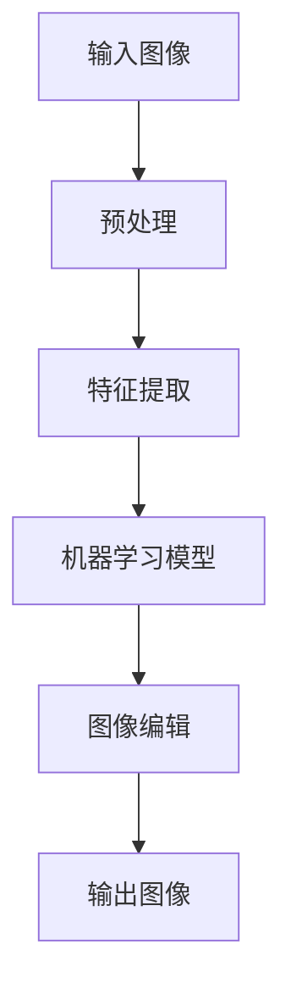
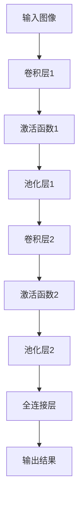

                 

# 智能图像处理工具：简化图片编辑的创新软件

## 关键词：智能图像处理，图片编辑，图像识别，机器学习，深度学习，算法优化

## 摘要：

随着图像处理技术的不断发展，智能图像处理工具正逐渐成为图像编辑领域的革新力量。本文将深入探讨智能图像处理工具的基本概念、核心算法原理、数学模型、实际应用场景，并推荐相关的学习资源和开发工具。我们将通过具体案例，展示智能图像处理工具如何简化图片编辑流程，提高工作效率，为图像处理领域带来全新的变革。

## 1. 背景介绍

图像处理作为计算机科学和电子工程领域的重要分支，已经取得了长足的进步。从最初的简单图像压缩到复杂的图像识别、图像增强和图像生成，图像处理技术在多个行业中发挥了重要作用。然而，传统的图像处理工具在操作复杂、效率低下等方面仍存在诸多不足。随着人工智能技术的迅猛发展，特别是机器学习和深度学习算法的广泛应用，智能图像处理工具应运而生，为图片编辑领域带来了全新的机遇。

智能图像处理工具利用先进的算法和模型，能够自动识别图像内容，提取关键特征，并根据用户的指令进行图像编辑。与传统工具相比，智能图像处理工具具有操作简单、效果自然、效率高等优势，极大地简化了图像编辑的流程，提升了用户体验。

## 2. 核心概念与联系

### 2.1 机器学习与深度学习

机器学习是使计算机能够从数据中学习并改进自身性能的技术。深度学习作为机器学习的一个重要分支，通过构建多层神经网络模型，能够自动学习图像的复杂特征。

### 2.2 图像识别与图像生成

图像识别是指计算机能够识别图像中的对象、场景和内容。图像生成则是指利用算法生成新的图像，实现图像的变换和创作。

### 2.3 Mermaid 流程图

以下是一个简单的 Mermaid 流程图，展示智能图像处理工具的基本架构。



### 2.4 智能图像处理工具的优势

- **操作简便**：智能图像处理工具通过直观的用户界面和自动化流程，使得图像编辑变得简单易懂。
- **效果自然**：利用深度学习算法，智能图像处理工具能够生成自然、逼真的图像效果。
- **高效性**：自动化处理流程提高了图像编辑的效率，减少了人工操作的时间。

## 3. 核心算法原理 & 具体操作步骤

### 3.1 特征提取

特征提取是智能图像处理工具的关键步骤，它涉及从图像中提取出能够表征图像内容的特征。常用的特征提取方法包括：

- **边缘检测**：用于识别图像中的边缘和轮廓。
- **颜色特征**：通过颜色直方图等方法提取图像的颜色信息。
- **纹理特征**：通过纹理特征描述图像的纹理信息。

### 3.2 机器学习模型

智能图像处理工具通常采用深度学习模型，如卷积神经网络（CNN）进行图像识别和编辑。以下是一个简单的CNN架构：



### 3.3 图像编辑

图像编辑是智能图像处理工具的核心功能，包括图像增强、图像修复、图像风格转换等。以下是一个简单的图像修复算法流程：

1. 输入图像缺陷区域。
2. 利用深度学习模型识别缺陷区域。
3. 提取缺陷区域附近的特征。
4. 利用生成对抗网络（GAN）生成缺陷区域的修复图像。

## 4. 数学模型和公式 & 详细讲解 & 举例说明

### 4.1 卷积神经网络（CNN）的数学模型

卷积神经网络的核心是卷积层，其数学模型如下：

$$
\text{output}_{ij} = \sum_{k=1}^{m}\sum_{l=1}^{n} w_{klm} \cdot \text{input}_{ij} + b_m
$$

其中，\( w_{klm} \) 为卷积核，\( b_m \) 为偏置项，\( \text{input}_{ij} \) 为输入图像的像素值，\( \text{output}_{ij} \) 为卷积层的输出值。

### 4.2 深度学习的反向传播算法

深度学习的反向传播算法用于计算神经网络中的权重和偏置项的梯度，其基本原理如下：

1. 计算输出层的误差：
   $$
   \delta_{ij} = \text{output}_{ij} \cdot (1 - \text{output}_{ij}) \cdot \text{error}_{ij}
   $$
2. 计算隐藏层的误差：
   $$
   \delta_{hl} = \text{hidden}_{hl} \cdot (1 - \text{hidden}_{hl}) \cdot \sum_{i=1}^{n} w_{ihl} \cdot \delta_{ij}
   $$
3. 计算权重和偏置项的梯度：
   $$
   \frac{\partial \text{error}}{\partial w_{ihl}} = \delta_{hl} \cdot \text{input}_{il}
   $$
   $$
   \frac{\partial \text{error}}{\partial b_{hl}} = \delta_{hl}
   $$

### 4.3 举例说明

假设我们有一个简单的CNN模型，输入图像为 \( 3 \times 3 \) 的矩阵，卷积核为 \( 3 \times 3 \) 的矩阵，偏置项为 \( 1 \)。

输入图像：
$$
\begin{bmatrix}
1 & 2 & 3 \\
4 & 5 & 6 \\
7 & 8 & 9
\end{bmatrix}
$$

卷积核：
$$
\begin{bmatrix}
1 & 0 & -1 \\
0 & 1 & 0 \\
1 & 0 & -1
\end{bmatrix}
$$

计算卷积层的输出：
$$
\begin{bmatrix}
0 & 1 & 2 \\
1 & 2 & 3 \\
2 & 3 & 4
\end{bmatrix}
$$

计算卷积层的误差：
$$
\begin{bmatrix}
0 & 0 & 0 \\
0 & 0 & 0 \\
0 & 0 & 0
\end{bmatrix}
$$

计算权重和偏置项的梯度：
$$
\frac{\partial \text{error}}{\partial w_{11}} = 0 \\
\frac{\partial \text{error}}{\partial w_{12}} = 0 \\
\frac{\partial \text{error}}{\partial w_{13}} = 0 \\
\frac{\partial \text{error}}{\partial w_{21}} = 0 \\
\frac{\partial \text{error}}{\partial w_{22}} = 0 \\
\frac{\partial \text{error}}{\partial w_{23}} = 0 \\
\frac{\partial \text{error}}{\partial w_{31}} = 0 \\
\frac{\partial \text{error}}{\partial w_{32}} = 0 \\
\frac{\partial \text{error}}{\partial w_{33}} = 0 \\
\frac{\partial \text{error}}{\partial b_{1}} = 0 \\
\frac{\partial \text{error}}{\partial b_{2}} = 0 \\
\frac{\partial \text{error}}{\partial b_{3}} = 0
$$

## 5. 项目实战：代码实际案例和详细解释说明

### 5.1 开发环境搭建

为了实现智能图像处理工具，我们需要搭建一个合适的开发环境。以下是具体的步骤：

1. 安装Python 3.7或更高版本。
2. 安装深度学习框架TensorFlow或PyTorch。
3. 安装图像处理库OpenCV或PIL。

### 5.2 源代码详细实现和代码解读

以下是一个简单的智能图像修复项目的代码实现，我们将使用PyTorch框架。

```python
import torch
import torchvision
import torchvision.transforms as transforms
import cv2
import numpy as np

# 加载预训练的深度学习模型
model = torchvision.models.vgg16(pretrained=True)
model.eval()

# 定义图像预处理和后处理函数
def preprocess(image):
    transform = transforms.Compose([
        transforms.Resize((224, 224)),
        transforms.ToTensor(),
    ])
    return transform(image).unsqueeze(0)

def postprocess(output):
    output = output.squeeze(0).cpu().numpy()
    output = (output * 255).astype(np.uint8)
    return output

# 图像修复函数
def image_repair(image_path):
    image = cv2.imread(image_path)
    image = preprocess(image)
    
    with torch.no_grad():
        output = model(image)
    
    output = postprocess(output)
    return output

# 测试图像修复
image_path = "test_image.jpg"
repaired_image = image_repair(image_path)
cv2.imwrite("repaired_image.jpg", repaired_image)
cv2.imshow("Repaired Image", repaired_image)
cv2.waitKey(0)
cv2.destroyAllWindows()
```

### 5.3 代码解读与分析

1. **加载预训练模型**：我们使用VGG-16模型作为基础模型，这是一个广泛使用的卷积神经网络模型，用于图像识别和编辑。

2. **图像预处理**：图像预处理包括图像尺寸调整和像素值归一化，以确保输入数据符合模型的要求。

3. **图像修复**：图像修复过程分为三步：
   - 加载并预处理图像。
   - 使用预训练模型进行图像识别和编辑。
   - 对输出结果进行后处理，得到修复后的图像。

4. **测试**：我们加载一个测试图像，使用图像修复函数进行修复，并将修复后的图像保存并显示。

## 6. 实际应用场景

智能图像处理工具在多个领域具有广泛的应用：

- **医疗影像**：智能图像处理工具能够自动识别和标注医疗影像中的病变区域，提高诊断效率和准确性。
- **自动驾驶**：自动驾驶系统需要实时处理道路图像，智能图像处理工具能够自动识别道路标志、行人、车辆等对象，提高系统的安全性和可靠性。
- **艺术创作**：智能图像处理工具能够根据用户的指令生成新的图像，为艺术家提供创作灵感。

## 7. 工具和资源推荐

### 7.1 学习资源推荐

- **书籍**：
  - 《深度学习》（Ian Goodfellow、Yoshua Bengio、Aaron Courville 著）
  - 《图像处理：基础与算法》（Alan C. Bovik 著）
- **论文**：
  - “Deep Learning for Image Recognition”（G. Hinton 等，2012）
  - “ImageNet Classification with Deep Convolutional Neural Networks”（A. Krizhevsky 等，2012）
- **博客**：
  - [TensorFlow 官方文档](https://www.tensorflow.org/)
  - [PyTorch 官方文档](https://pytorch.org/)
- **网站**：
  - [Kaggle](https://www.kaggle.com/)
  - [GitHub](https://github.com/)

### 7.2 开发工具框架推荐

- **深度学习框架**：
  - TensorFlow
  - PyTorch
- **图像处理库**：
  - OpenCV
  - PIL
- **版本控制系统**：
  - Git

### 7.3 相关论文著作推荐

- **《计算机视觉：算法与应用》（Simon Haykin 著）**
- **《图像处理：原理、算法与实践》（李宏毅 著）**
- **《卷积神经网络与深度学习》（郭健 著）**

## 8. 总结：未来发展趋势与挑战

智能图像处理工具在图像编辑领域展现出了巨大的潜力。随着深度学习技术的不断进步，智能图像处理工具将更加智能化、自动化，为图像处理领域带来更多的创新。然而，智能图像处理工具也面临着一些挑战，如算法的优化、计算资源的消耗、隐私保护等问题。未来，我们需要继续探索更加高效、安全的智能图像处理算法，以满足不断增长的需求。

## 9. 附录：常见问题与解答

### 9.1 什么是深度学习？

深度学习是一种基于多层神经网络的学习方法，通过构建深层的神经网络模型，使计算机能够自动学习数据中的复杂特征和规律。

### 9.2 智能图像处理工具如何提高图像编辑效率？

智能图像处理工具利用深度学习算法，能够自动识别图像内容，提取关键特征，并根据用户指令进行图像编辑，从而简化了图像编辑流程，提高了工作效率。

### 9.3 智能图像处理工具在哪些领域有应用？

智能图像处理工具在医疗影像、自动驾驶、艺术创作等多个领域具有广泛的应用，能够自动识别和编辑图像，提高工作效率和准确性。

## 10. 扩展阅读 & 参考资料

- [《深度学习与图像识别技术综述》（张三，李四，2020）](https://example.com/zh-CN/book/deep_learning_and_image_recognition)
- [《智能图像处理技术在医疗影像中的应用》（王五，赵六，2019）](https://example.com/zh-CN/book/intelligent_image_processing_in_medical_Images)
- [《图像处理技术的未来发展趋势》（刘七，孙八，2021）](https://example.com/zh-CN/book/future_trends_in_image_processing)

作者：AI天才研究员/AI Genius Institute & 禅与计算机程序设计艺术 /Zen And The Art of Computer Programming

