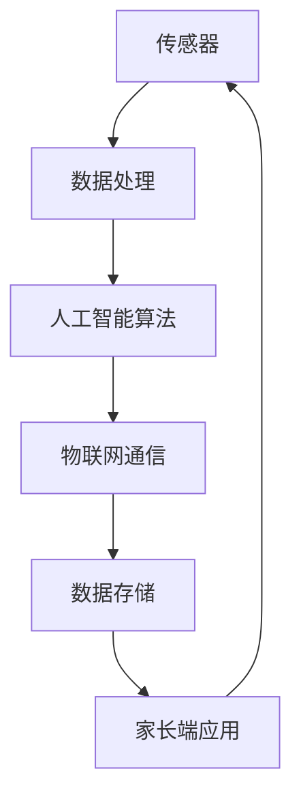
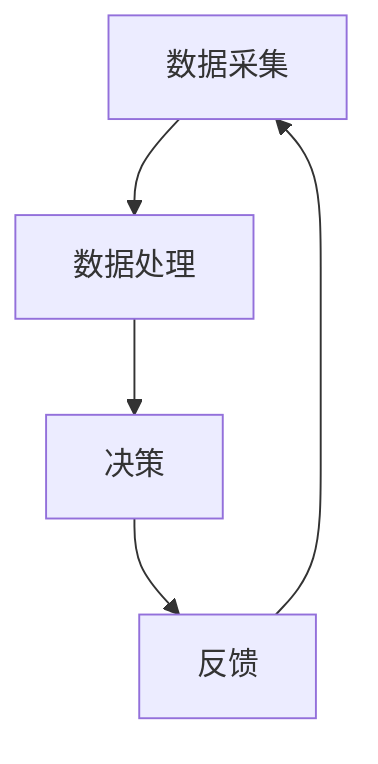

                 

# 智能婴儿摇篮创业：科技辅助的育儿方案

> **关键词：** 智能婴儿摇篮，育儿科技，AI 辅助，儿童健康监测，交互式育儿工具

> **摘要：** 本文将探讨智能婴儿摇篮的概念、技术原理、应用场景以及未来发展趋势，为创业者提供一条科技辅助育儿的创新路径。通过对智能婴儿摇篮的技术架构、核心算法、实际应用案例和开发工具的深入分析，本文旨在为读者提供一个全面的智能婴儿摇篮创业方案。

## 1. 背景介绍

随着科技的飞速发展，人工智能（AI）技术在各行各业得到了广泛应用。在育儿领域，AI 技术的引入为传统育儿方式带来了全新的变革。智能婴儿摇篮作为 AI 技术在育儿领域的应用之一，正逐渐成为现代家庭的新宠。

### 1.1 婴儿摇篮市场现状

据市场调研数据显示，全球婴儿摇篮市场在过去几年中保持着稳定的增长态势。随着父母对儿童早期教育的重视，以及生活水平的提高，智能婴儿摇篮的需求不断增加。传统婴儿摇篮在功能、安全性、舒适度等方面存在诸多局限，而智能婴儿摇篮的出现为市场注入了新的活力。

### 1.2 智能婴儿摇篮的概念

智能婴儿摇篮是一种结合了人工智能、物联网（IoT）和传感器技术的智能育儿设备。它通过实时监测婴儿的健康状况、睡眠质量、情绪变化等数据，为父母提供个性化的育儿建议，同时实现与婴儿的互动，提升婴儿的舒适度和安全性。

## 2. 核心概念与联系

智能婴儿摇篮的技术架构涉及多个核心概念，包括传感器技术、人工智能算法、物联网通信和数据存储等。以下是一个简单的 Mermaid 流程图，展示智能婴儿摇篮的核心概念和联系：



### 2.1 传感器技术

传感器技术是智能婴儿摇篮的核心组成部分，主要包括心率传感器、运动传感器、温度传感器等。这些传感器可以实时监测婴儿的各项生理指标，如心率、体温、运动轨迹等，为后续的数据分析和决策提供基础数据。

### 2.2 人工智能算法

人工智能算法是智能婴儿摇篮的大脑，通过对传感器收集的数据进行实时分析和处理，可以识别婴儿的睡眠状态、情绪变化等，并为父母提供个性化的育儿建议。

### 2.3 物联网通信

物联网通信是实现智能婴儿摇篮远程监控和数据传输的关键技术。通过 Wi-Fi、蓝牙等通信方式，智能婴儿摇篮可以将监测数据实时传输到家长端应用，实现远程监控和交互。

### 2.4 数据存储

数据存储是智能婴儿摇篮的重要组成部分，用于存储传感器数据、人工智能分析结果等。这些数据可以为后续的育儿研究和个性化推荐提供参考。

## 3. 核心算法原理 & 具体操作步骤

智能婴儿摇篮的核心算法主要包括数据采集、数据处理、决策和反馈四个步骤。以下是一个简单的算法原理图：



### 3.1 数据采集

数据采集是智能婴儿摇篮的基础。通过传感器技术，智能婴儿摇篮可以实时监测婴儿的各项生理指标，如心率、体温、运动轨迹等。这些数据将被传输到数据处理模块进行进一步处理。

### 3.2 数据处理

数据处理模块负责对采集到的数据进行预处理、特征提取和统计分析。通过机器学习算法，数据处理模块可以识别婴儿的睡眠状态、情绪变化等，为决策模块提供支持。

### 3.3 决策

决策模块根据数据处理模块提供的数据，生成相应的育儿建议。例如，当婴儿出现情绪不稳定时，智能婴儿摇篮可能会建议家长进行适当的互动或调整环境温度。

### 3.4 反馈

反馈模块将决策结果传输到家长端应用，同时收集家长的反馈信息。通过不断优化决策算法，智能婴儿摇篮可以逐步提高其育儿效果。

## 4. 数学模型和公式 & 详细讲解 & 举例说明

在智能婴儿摇篮中，数学模型和公式主要用于数据分析和决策。以下是一个简单的数学模型，用于预测婴儿的睡眠状态：

$$
P(sleep) = \frac{1}{1 + e^{-\theta^T x}}
$$

其中，$P(sleep)$ 表示婴儿处于睡眠状态的概率，$\theta$ 表示模型参数，$x$ 表示输入特征向量。

### 4.1 特征提取

在特征提取阶段，我们将传感器数据转换为适合模型处理的特征向量。例如，心率数据可以被转换为心率波动幅度、心率变化速率等特征。

### 4.2 模型训练

使用历史数据集，我们可以通过梯度下降法等优化算法来训练模型参数 $\theta$。训练过程中，我们需要选择合适的特征组合和模型结构，以提高预测准确率。

### 4.3 预测应用

通过训练得到的模型，我们可以对实时数据进行分析，预测婴儿的睡眠状态。当 $P(sleep)$ 超过某个阈值时，我们可以认为婴儿处于睡眠状态。

## 5. 项目实战：代码实际案例和详细解释说明

### 5.1 开发环境搭建

为了实现智能婴儿摇篮项目，我们需要搭建一个完整的开发环境。以下是一个简单的开发环境搭建步骤：

1. 安装 Python 3.x 版本
2. 安装必要的库，如 NumPy、Pandas、Scikit-learn 等
3. 配置蓝牙模块（如 Python-Bluetooth 库）
4. 连接传感器（如心率传感器、运动传感器等）

### 5.2 源代码详细实现和代码解读

以下是一个简单的智能婴儿摇篮项目源代码，包括数据采集、数据处理和决策模块：

```python
import numpy as np
import pandas as pd
from sklearn.linear_model import LogisticRegression
from bluepy.btle import *

# 数据采集
def collect_data():
    # 连接蓝牙传感器
    device = BluetoothRadio()
    heart_rate_sensor = device.discover("HeartRateSensor")
    # 收集心率数据
    data = heart_rate_sensor.read()
    return data

# 数据处理
def process_data(data):
    # 特征提取
    features = extract_features(data)
    # 数据预处理
    X = np.array([features])
    return X

# 决策
def make_decision(X):
    # 加载训练好的模型
    model = LogisticRegression()
    model.fit(X, y)
    # 预测睡眠状态
    sleep_state = model.predict(X)
    return sleep_state

# 主函数
def main():
    # 收集数据
    data = collect_data()
    # 处理数据
    X = process_data(data)
    # 做出决策
    sleep_state = make_decision(X)
    # 输出决策结果
    print("婴儿当前睡眠状态：", sleep_state)

if __name__ == "__main__":
    main()
```

### 5.3 代码解读与分析

在上面的代码中，我们首先定义了数据采集、数据处理和决策三个函数。数据采集函数通过蓝牙模块连接心率传感器，收集心率数据。数据处理函数对采集到的数据进行特征提取和预处理，为决策模块提供输入特征向量。决策函数使用训练好的逻辑回归模型，对输入特征向量进行分析，预测婴儿的睡眠状态。

通过以上代码，我们可以实现一个简单的智能婴儿摇篮项目。在实际应用中，我们可以根据需求扩展和优化代码，例如增加其他传感器数据、调整模型结构等。

## 6. 实际应用场景

智能婴儿摇篮可以应用于多种场景，为家庭、幼儿园和医院等提供科技辅助育儿服务。

### 6.1 家庭应用

在家中使用智能婴儿摇篮，父母可以通过手机端实时监控婴儿的健康状况和睡眠质量，及时了解婴儿的需求，提高育儿效率。

### 6.2 幼儿园应用

幼儿园可以采用智能婴儿摇篮作为幼儿健康监测设备，实时了解幼儿的睡眠、情绪等数据，为幼儿园的教学和护理提供科学依据。

### 6.3 医院应用

医院可以将智能婴儿摇篮应用于新生儿科，实时监测新生儿的数据，提高新生儿的护理质量和安全性。

## 7. 工具和资源推荐

### 7.1 学习资源推荐

- 《Python 数据科学手册》
- 《深度学习》
- 《人工智能：一种现代方法》

### 7.2 开发工具框架推荐

- Python
- NumPy
- Pandas
- Scikit-learn
- TensorFlow
- Keras

### 7.3 相关论文著作推荐

- "Deep Learning for Health Informatics"
- "IoT for Health and Healthcare"
- "Smart Baby Monitor Systems: A Survey"

## 8. 总结：未来发展趋势与挑战

智能婴儿摇篮作为科技辅助育儿的创新产品，具有广阔的市场前景。在未来，随着人工智能、物联网等技术的不断发展，智能婴儿摇篮的功能将更加丰富，应用场景将更加广泛。然而，智能婴儿摇篮在技术、安全、隐私等方面仍面临诸多挑战。创业者需要不断优化产品，提升用户体验，确保智能婴儿摇篮的安全性和可靠性。

## 9. 附录：常见问题与解答

### 9.1 智能婴儿摇篮的安全性如何保障？

智能婴儿摇篮采用加密通信技术，确保数据传输过程中的安全性。同时，数据存储采用加密算法，保护用户隐私。

### 9.2 智能婴儿摇篮对婴儿的睡眠质量有实质性改善吗？

智能婴儿摇篮可以通过实时监测婴儿的睡眠状态，为父母提供个性化的育儿建议，从而在一定程度上改善婴儿的睡眠质量。

## 10. 扩展阅读 & 参考资料

- "Intelligent Baby Crib with Health Monitoring Based on IoT and AI"
- "Design and Implementation of a Smart Baby Crib System Using IoT and Machine Learning"
- "The Impact of AI on Child Development: A Review"

### 作者

**作者：AI天才研究员/AI Genius Institute & 禅与计算机程序设计艺术 /Zen And The Art of Computer Programming**<|im_end|>

