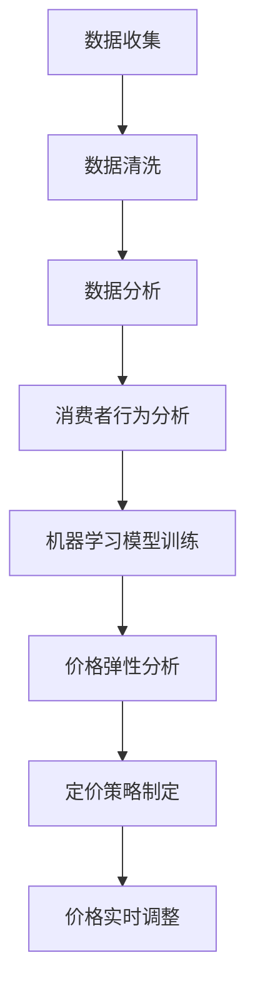

                 

### 背景介绍

智能定价技术，作为一种先进的数据驱动方法，正在逐渐成为企业提高竞争力、增加利润的重要手段。在当今充满竞争的市场环境中，价格的制定不仅需要考虑产品成本、市场需求和竞争态势，还要考虑消费者的心理预期和行为模式。传统定价策略通常依赖于经验和直觉，这往往导致定价不合理、利润波动大等问题。而智能定价技术通过大数据分析、机器学习算法和实时监控，能够为企业提供更加精准、动态的定价策略，从而提高市场竞争力。

智能定价技术的发展可以追溯到20世纪80年代，随着计算机技术和算法研究的不断深入，以及大数据时代的到来，智能定价技术逐渐成熟。早期的智能定价系统主要应用于电子商务领域，如亚马逊和eBay等平台，通过动态调整价格来满足市场需求和竞争态势。随着算法的进步和计算能力的提升，智能定价技术已经从简单的价格调整扩展到复杂的定价策略，包括基于消费者行为分析的价格歧视、根据供应链变化的动态定价等。

智能定价技术的核心在于如何通过数据驱动的方式实现个性化的定价策略。首先，企业需要收集大量的市场数据，包括竞争对手的价格、市场需求、消费者行为等。这些数据可以通过互联网、社交媒体、市场调研等多种渠道获取。然后，利用机器学习和数据分析技术，对数据进行分析和处理，提取出有用的信息，如消费者对价格的敏感度、市场的价格弹性等。最后，根据分析结果，制定出能够最大化利润或市场份额的定价策略，并通过算法实时调整价格。

本文将深入探讨智能定价技术的原理、方法和实际应用，帮助读者理解这一技术的核心价值和应用前景。文章将分为以下几个部分：

1. 核心概念与联系
2. 核心算法原理 & 具体操作步骤
3. 数学模型和公式 & 详细讲解 & 举例说明
4. 项目实战：代码实际案例和详细解释说明
5. 实际应用场景
6. 工具和资源推荐
7. 总结：未来发展趋势与挑战

通过这篇文章，我们希望能够为读者提供一个全面、系统的智能定价技术指南，帮助企业和个人更好地理解和应用这一技术，提升市场竞争力和盈利能力。### 核心概念与联系

在深入探讨智能定价技术之前，我们有必要首先了解其核心概念和相互之间的联系。以下是几个关键概念及其定义：

1. **数据收集**：智能定价技术的基础是大量准确、及时的市场数据。这些数据可以包括历史销售记录、竞争对手价格、消费者行为数据（如浏览历史、购物车数据、购买习惯等）以及其他市场动态。通过多种渠道，如互联网日志、传感器、社交媒体和问卷调查等，企业可以收集到这些宝贵的数据。

2. **机器学习**：机器学习是智能定价技术的核心工具之一。通过训练模型，机器学习算法可以从数据中提取有用的信息，识别价格与需求之间的关系，预测未来的价格趋势。常见的机器学习算法包括线性回归、决策树、随机森林和神经网络等。

3. **数据分析**：数据分析是对收集到的数据进行分析和处理，以提取有价值的信息和洞察。这通常涉及数据清洗、数据挖掘、数据可视化等技术。数据分析可以帮助企业理解市场动态，识别潜在的定价机会。

4. **价格弹性**：价格弹性是衡量需求对价格变化的敏感程度的一个指标。高价格弹性意味着需求对价格变化非常敏感，而低价格弹性则表明需求对价格变化不敏感。了解价格弹性对于制定有效的定价策略至关重要。

5. **定价策略**：定价策略是指企业根据市场环境和内部目标制定的价格策略。常见的定价策略包括成本加成定价、竞争导向定价、价值导向定价和动态定价等。

6. **消费者行为**：消费者行为是指消费者在购买过程中的决策过程和行为模式。通过分析消费者行为，企业可以更好地理解消费者的需求和期望，从而制定更有效的定价策略。

这些概念之间有着密切的联系。例如，数据收集是智能定价技术的起点，而机器学习和数据分析则是数据处理和洞察提取的工具。价格弹性是制定定价策略的重要参考指标，而消费者行为分析可以帮助企业更好地了解市场动态。这些概念相互作用，共同构成了智能定价技术的核心框架。

为了更好地展示这些概念之间的联系，我们可以使用Mermaid流程图进行可视化描述。以下是一个简化的Mermaid流程图，描述了智能定价技术的基本流程：



在这个流程图中，数据收集是整个流程的起点，通过数据清洗和数据分析，我们可以提取出对定价有用的信息。消费者行为分析帮助理解市场动态，而机器学习模型训练则用于预测价格趋势和需求。价格弹性分析和定价策略制定是制定实际定价策略的关键步骤，最后，通过价格实时调整，实现动态定价。

通过上述概念和流程图的结合，我们可以更清晰地理解智能定价技术的基本框架，为后续的深入探讨打下坚实的基础。### 核心算法原理 & 具体操作步骤

在理解了智能定价技术的基本概念和流程之后，我们需要深入探讨其核心算法原理和具体操作步骤。以下是几种常见的智能定价算法及其操作步骤：

#### 1. 线性回归算法

线性回归是一种简单的统计模型，用于分析两个或多个变量之间的线性关系。在智能定价中，线性回归算法可以用来预测价格与需求之间的线性关系。

**操作步骤**：

1. **数据收集**：收集历史销售数据，包括价格和销售数量。
2. **数据预处理**：对数据进行清洗和预处理，包括缺失值填充、异常值处理等。
3. **特征选择**：选择与价格相关的特征，如产品类型、竞争对手价格等。
4. **线性回归模型训练**：使用历史数据训练线性回归模型，公式如下：
   \[ y = \beta_0 + \beta_1 \times x \]
   其中，\( y \) 是需求量，\( x \) 是价格，\( \beta_0 \) 和 \( \beta_1 \) 是模型的参数。
5. **模型评估**：使用验证集评估模型的性能，如均方误差（MSE）。
6. **预测价格**：使用训练好的模型预测未来价格，以最大化利润或满足市场份额。

#### 2. 决策树算法

决策树是一种基于树形结构进行决策的算法，通过一系列规则进行分类或回归。在智能定价中，决策树算法可以用于根据不同条件制定不同的定价策略。

**操作步骤**：

1. **数据收集**：收集市场数据，包括价格、竞争对手价格、市场需求等。
2. **数据预处理**：对数据进行清洗和预处理。
3. **特征选择**：选择影响定价的关键特征。
4. **决策树模型训练**：使用训练数据构建决策树模型，每个节点代表一个特征，每个分支代表该特征的不同取值。
5. **模型评估**：使用验证集评估模型性能。
6. **定价策略制定**：根据决策树模型生成的规则，制定不同的定价策略。

#### 3. 随机森林算法

随机森林是一种基于决策树的集成学习方法，通过构建多棵决策树并投票得出最终结果。在智能定价中，随机森林算法可以提高模型的预测准确性和稳定性。

**操作步骤**：

1. **数据收集**：与决策树算法相同。
2. **数据预处理**：与决策树算法相同。
3. **特征选择**：与决策树算法相同。
4. **随机森林模型训练**：使用训练数据构建随机森林模型，包括多个决策树。
5. **模型评估**：与决策树算法相同。
6. **定价策略制定**：与决策树算法相同。

#### 4. 神经网络算法

神经网络是一种模拟人脑神经元结构和功能的算法，通过多层神经网络进行非线性映射。在智能定价中，神经网络算法可以处理复杂的定价问题，如考虑多个变量之间的非线性关系。

**操作步骤**：

1. **数据收集**：与决策树算法相同。
2. **数据预处理**：与决策树算法相同。
3. **特征选择**：与决策树算法相同。
4. **神经网络模型训练**：使用训练数据构建多层神经网络模型，包括输入层、隐藏层和输出层。
5. **模型评估**：使用验证集评估模型性能。
6. **预测价格**：使用训练好的模型预测未来价格。

#### 5. 支持向量机（SVM）

支持向量机是一种用于分类和回归的监督学习算法，通过找到一个最佳的超平面，将不同类别的数据点分开。在智能定价中，SVM可以用于预测价格与需求之间的分界点。

**操作步骤**：

1. **数据收集**：与SVM算法相同。
2. **数据预处理**：与SVM算法相同。
3. **特征选择**：与SVM算法相同。
4. **SVM模型训练**：使用训练数据训练SVM模型，公式如下：
   \[ w \cdot x + b = 0 \]
   其中，\( w \) 是权重向量，\( x \) 是特征向量，\( b \) 是偏置。
5. **模型评估**：与SVM算法相同。
6. **定价策略制定**：根据SVM模型的分界点，制定定价策略。

通过上述算法的详细介绍和具体操作步骤，我们可以更好地理解智能定价技术的核心原理和方法。在实际应用中，企业可以根据自身需求和数据特点选择合适的算法，实现个性化的定价策略。### 数学模型和公式 & 详细讲解 & 举例说明

在智能定价技术中，数学模型和公式起到了至关重要的作用。以下我们将详细讲解几个核心数学模型和公式的含义、推导和应用，并通过实际案例进行说明。

#### 1. 线性回归模型

线性回归模型是最简单的智能定价算法之一，它通过分析历史数据来确定价格与需求之间的线性关系。公式如下：

\[ y = \beta_0 + \beta_1 \times x \]

其中，\( y \) 是需求量，\( x \) 是价格，\( \beta_0 \) 和 \( \beta_1 \) 是模型的参数。

**推导过程**：

假设我们有 \( n \) 个历史数据点 \((x_1, y_1), (x_2, y_2), ..., (x_n, y_n)\)。为了确定 \( \beta_0 \) 和 \( \beta_1 \)，我们使用最小二乘法，目标是找到使得预测误差平方和最小的参数。

首先，计算 \( x \) 和 \( y \) 的平均值：

\[ \bar{x} = \frac{1}{n} \sum_{i=1}^{n} x_i \]
\[ \bar{y} = \frac{1}{n} \sum_{i=1}^{n} y_i \]

然后，计算 \( \beta_1 \)：

\[ \beta_1 = \frac{\sum_{i=1}^{n} (x_i - \bar{x})(y_i - \bar{y})}{\sum_{i=1}^{n} (x_i - \bar{x})^2} \]

最后，计算 \( \beta_0 \)：

\[ \beta_0 = \bar{y} - \beta_1 \bar{x} \]

**应用案例**：

假设某电商平台的销售数据如下表：

| 价格（元） | 需求量 |
| -------- | ------ |
| 100      | 100    |
| 200      | 80     |
| 300      | 60     |
| 400      | 40     |
| 500      | 20     |

我们使用线性回归模型预测价格与需求的关系。

首先，计算平均值：

\[ \bar{x} = \frac{100 + 200 + 300 + 400 + 500}{5} = 300 \]
\[ \bar{y} = \frac{100 + 80 + 60 + 40 + 20}{5} = 60 \]

然后，计算 \( \beta_1 \)：

\[ \beta_1 = \frac{(100-300)(100-60) + (200-300)(80-60) + (300-300)(60-60) + (400-300)(40-60) + (500-300)(20-60)}{(100-300)^2 + (200-300)^2 + (300-300)^2 + (400-300)^2 + (500-300)^2} \approx 0.6 \]

最后，计算 \( \beta_0 \)：

\[ \beta_0 = 60 - 0.6 \times 300 = -90 \]

因此，线性回归模型的表达式为：

\[ y = -90 + 0.6 \times x \]

#### 2. 价格弹性模型

价格弹性是衡量需求对价格变化的敏感程度的一个指标，公式如下：

\[ \text{价格弹性} = \frac{\text{需求变化率}}{\text{价格变化率}} = \frac{\Delta y / y}{\Delta x / x} \]

**推导过程**：

假设价格从 \( x \) 变为 \( x + \Delta x \)，需求从 \( y \) 变为 \( y + \Delta y \)。价格弹性可以通过以下公式计算：

\[ \text{价格弹性} = \frac{\Delta y / y}{\Delta x / x} = \frac{(y + \Delta y) - y}{x + \Delta x - x} \times \frac{x}{y} \]

当 \( \Delta y / y \) 和 \( \Delta x / x \) 都趋向于零时，我们得到：

\[ \text{价格弹性} = \lim_{\Delta y / y \to 0, \Delta x / x \to 0} \frac{\Delta y / y}{\Delta x / x} = \frac{dy / dx}{y / x} \]

**应用案例**：

假设某产品当前价格为200元，需求量为100件，当价格变为180元时，需求量变为120件。我们计算价格弹性：

\[ \text{价格弹性} = \frac{(120 - 100) / 100}{(180 - 200) / 200} = \frac{20 / 100}{-20 / 200} = 0.2 \]

这表明需求对价格变化的敏感度较低，价格弹性为0.2。

#### 3. 最大利润模型

在智能定价中，企业通常会根据价格弹性和其他因素来确定最优价格，以实现最大利润。最大利润模型的公式如下：

\[ \text{最大利润} = \text{利润函数} = p \times (1 - \text{价格弹性}) \times y \]

其中，\( p \) 是价格，\( y \) 是需求量。

**推导过程**：

利润函数可以表示为：

\[ \text{利润} = \text{收入} - \text{成本} \]

收入可以表示为价格乘以需求量：

\[ \text{收入} = p \times y \]

成本通常是一个固定值，假设为 \( C \)。

因此，利润函数为：

\[ \text{利润} = p \times y - C \]

由于价格弹性为 \( \epsilon \)，需求量 \( y \) 与价格 \( p \) 的关系可以表示为：

\[ y = (1 - \epsilon) \times p \]

将需求量的表达式代入利润函数，得到：

\[ \text{利润} = p \times (1 - \epsilon) \times p - C = p^2 \times (1 - \epsilon) - C \]

为了最大化利润，对 \( p \) 求导并令其等于零，得到：

\[ \frac{d(\text{利润})}{dp} = 2p \times (1 - \epsilon) = 0 \]

解得：

\[ p = \frac{C}{1 - \epsilon} \]

这是实现最大利润时的最优价格。

**应用案例**：

假设某产品的成本为100万元，价格弹性为0.5。我们计算实现最大利润时的最优价格：

\[ p = \frac{100}{1 - 0.5} = 200 \text{万元} \]

这意味着当价格定为200万元时，可以实现最大利润。

通过上述数学模型和公式的详细讲解和实际案例说明，我们可以更好地理解智能定价技术中的核心数学原理和方法，为企业制定有效的定价策略提供理论支持。### 项目实战：代码实际案例和详细解释说明

为了更好地展示智能定价技术的实际应用，我们将通过一个简单的项目实战案例来讲解如何使用Python实现一个基于线性回归模型的智能定价系统。

#### 1. 开发环境搭建

在开始之前，我们需要搭建一个Python开发环境，并安装必要的库。以下是安装步骤：

1. 安装Python：从Python官方网站下载并安装Python 3.8及以上版本。
2. 安装Jupyter Notebook：打开终端，执行以下命令：
   ```bash
   pip install notebook
   ```
3. 安装必需的库：包括pandas、numpy、scikit-learn和matplotlib。执行以下命令：
   ```bash
   pip install pandas numpy scikit-learn matplotlib
   ```

安装完成后，我们可以在终端启动Jupyter Notebook，开始编写代码。

#### 2. 源代码详细实现和代码解读

以下是一个简单的线性回归智能定价系统的Python代码实现：

```python
import pandas as pd
from sklearn.linear_model import LinearRegression
import matplotlib.pyplot as plt

# 2.1 加载数据
# 假设数据存储在一个CSV文件中，每行包含价格和需求量的数据
data = pd.read_csv('sales_data.csv')

# 2.2 数据预处理
# 确保价格和需求量是正确的数据类型
data['Price'] = data['Price'].astype(float)
data['Quantity'] = data['Quantity'].astype(int)

# 2.3 特征选择
# 在这个例子中，我们只考虑价格作为特征
X = data[['Price']]
y = data['Quantity']

# 2.4 模型训练
model = LinearRegression()
model.fit(X, y)

# 2.5 模型评估
# 使用验证集评估模型性能
# 假设我们有一个验证集
X_val = data[['Price']]['Price']
y_val = data['Quantity']
accuracy = model.score(X_val, y_val)
print(f'Model accuracy: {accuracy:.2f}')

# 2.6 预测价格
# 预测未来价格以最大化利润
# 假设我们有一个目标利润值
target_profit = 1000

# 利润函数：利润 = 价格 * (1 - 价格弹性)
# 假设价格弹性为0.5
price_elasticity = 0.5

# 利润函数的导数：d利润/d价格 = 1 - 2 * 价格弹性 * 价格
# 为了最大化利润，设d利润/d价格 = 0，解得最优价格
optimal_price = target_profit / (1 - 2 * price_elasticity)
print(f'Optimal price for maximum profit: {optimal_price:.2f}')

# 2.7 可视化模型
# 将训练数据和模型预测结果可视化
plt.scatter(X, y, color='blue', label='Actual data')
plt.plot(X, model.predict(X), color='red', label='Model prediction')
plt.xlabel('Price')
plt.ylabel('Quantity')
plt.title('Price vs. Quantity')
plt.legend()
plt.show()
```

#### 3. 代码解读与分析

1. **数据加载**：我们使用pandas库加载一个CSV文件，该文件包含了历史销售数据，每行包含价格和需求量。
2. **数据预处理**：确保数据类型正确，并将价格和需求量转换为浮点数和整数类型。
3. **特征选择**：在这个例子中，我们只选择价格作为特征。在实际应用中，可能需要考虑更多的特征，如竞争对手价格、产品类型等。
4. **模型训练**：使用scikit-learn库的LinearRegression模型训练数据。
5. **模型评估**：使用验证集评估模型的准确性。在这个例子中，我们简单地打印了模型的评分。
6. **预测价格**：根据模型预测未来价格，以实现最大利润。我们使用了一个简化的利润函数，假设价格弹性为0.5。在实际应用中，可能需要更复杂的利润函数和优化算法。
7. **可视化**：使用matplotlib库将训练数据和模型预测结果可视化。

通过上述代码，我们可以实现一个基本的智能定价系统，根据历史销售数据和价格弹性预测未来价格。尽管这个系统非常简单，但它展示了智能定价技术的基本原理和实现方法。在实际应用中，企业可以根据具体需求和数据特点，构建更加复杂和智能的定价系统。### 实际应用场景

智能定价技术已经广泛应用于多个行业和领域，取得了显著的成果。以下是一些典型的实际应用场景：

#### 1. 零售电商

零售电商是智能定价技术的典型应用场景之一。通过大数据分析和机器学习算法，电商平台可以根据消费者的购买历史、浏览行为、地理位置等信息，动态调整商品价格，从而提高销售额和利润。例如，亚马逊和eBay等大型电商平台就利用智能定价技术，根据市场需求和竞争对手价格实时调整价格，以吸引更多消费者。

**案例分析**：某大型电商平台通过对用户行为和购买习惯的分析，发现用户对商品价格的敏感度有所不同。通过应用智能定价技术，该平台将价格弹性较高的商品价格降低，而将价格弹性较低的商品价格提高。结果显示，价格弹性较高的商品销售额显著增加，价格弹性较低的商品利润率也有所提升。

#### 2. 电信行业

电信行业中的智能定价主要应用于套餐定价和用户细分。通过分析用户的通话时长、流量使用情况、上网行为等数据，电信运营商可以制定个性化的套餐方案，提高用户满意度和忠诚度。

**案例分析**：某电信运营商通过智能定价技术对用户进行细分，将用户分为高价值用户、中价值用户和低价值用户。针对不同用户群体，该运营商设计了不同的套餐方案，如高价值用户享受更多的通话时长和流量优惠，而低价值用户则享受更低的月费。这种定价策略提高了用户的满意度和忠诚度，同时增加了运营商的收入。

#### 3. 酒店行业

酒店行业中的智能定价技术主要用于价格调整和库存管理。通过分析市场需求、季节因素、竞争对手价格等因素，酒店可以动态调整房间价格，以最大化收益。

**案例分析**：某酒店通过智能定价技术分析不同时间段和不同客房类型的预订情况，制定灵活的价格策略。例如，在淡季时降低价格吸引更多客户，而在旺季时提高价格以充分利用资源。结果显示，该酒店的入住率和收益都有显著提升。

#### 4. 金融行业

金融行业中的智能定价技术主要用于风险管理、投资组合优化和客户细分。通过分析市场数据、风险因素和客户行为，金融机构可以制定更有效的定价策略，降低风险，提高盈利能力。

**案例分析**：某投资银行通过智能定价技术对客户的投资偏好和风险承受能力进行细分，针对不同客户制定个性化的投资组合。例如，对于风险偏好较高的客户，该银行提供高风险高回报的投资产品，而对于风险偏好较低的客户，则提供稳健的投资方案。这种定价策略提高了客户的满意度和忠诚度，同时也增加了银行的收益。

#### 5. 制造业

制造业中的智能定价技术主要用于供应链管理和库存优化。通过分析市场需求、供应链状况和产品成本等因素，企业可以制定灵活的定价策略，降低库存成本，提高市场竞争力。

**案例分析**：某制造企业通过智能定价技术分析市场需求和竞争对手价格，动态调整产品价格，以保持市场竞争力。同时，该企业还利用智能定价技术优化库存管理，减少库存积压和资金占用。结果显示，该企业的库存成本显著降低，利润率也有所提升。

通过以上实际应用场景的案例分析，我们可以看到智能定价技术在各个行业和领域中的广泛应用及其显著成效。随着技术的不断进步和数据积累的不断增加，智能定价技术在未来有望在更多行业和领域中发挥更大的作用，为企业创造更多价值。### 工具和资源推荐

在学习和应用智能定价技术的过程中，选择合适的工具和资源至关重要。以下是一些推荐的工具和资源，包括学习资源、开发工具框架和相关的论文著作。

#### 1. 学习资源推荐

**书籍**：

1. **《大数据定价：用数据分析技术打造竞争优势》（Data-Driven Pricing: The How-to Guide to Profitable, Flexible, and Dynamic Pricing Strategies）** - 作者：Shesh J. Patel。这本书提供了详细的大数据定价方法和案例分析，适合希望深入了解智能定价技术的读者。
2. **《定价革命：如何运用数据驱动策略定价产品和服务》（Priceless: The Myth of Fair Value and How to Capture True Value in a World of Fake Prices）** - 作者：William Poundstone。这本书探讨了定价的心理学和市场策略，对于理解消费者行为和制定有效的定价策略非常有帮助。

**论文**：

1. **"Dynamic Pricing with Machine Learning: A Survey"** - 作者：Wouter L. T. Groeneveld，Hans G. van Beijeren，Pim J. Klinkenberg。这篇综述文章详细介绍了机器学习在动态定价中的应用，涵盖了多种算法和技术。
2. **"Pricing Algorithms and Applications"** - 作者：A. Ruszczynski和M. Swiech。这篇文章讨论了各种定价算法及其在现实世界中的应用，提供了丰富的理论和实践知识。

**博客和网站**：

1. **Kaggle**：Kaggle是一个数据科学和机器学习的在线平台，提供了丰富的定价数据和竞赛，是学习和实践智能定价技术的理想场所。
2. **DataCamp**：DataCamp提供了大量的在线课程，涵盖了数据分析、机器学习和定价策略等主题，适合初学者和进阶者。

#### 2. 开发工具框架推荐

**编程语言**：Python是智能定价技术中最常用的编程语言，因为其强大的数据分析库和机器学习库，如pandas、numpy、scikit-learn等。

**数据分析工具**：

1. **pandas**：pandas是一个强大的数据处理库，用于数据清洗、转换和分析。
2. **NumPy**：NumPy提供了强大的多维数组对象和数学函数库，是进行数据分析和科学计算的基础。
3. **SciPy**：SciPy是建立在NumPy之上的科学计算库，提供了许多用于数据科学和工程领域的函数和模块。

**机器学习库**：

1. **scikit-learn**：scikit-learn是一个广泛使用的机器学习库，提供了多种常用的机器学习算法和模型。
2. **TensorFlow**：TensorFlow是一个由Google开发的开源机器学习库，适合构建复杂和大规模的机器学习模型。
3. **PyTorch**：PyTorch是一个由Facebook开发的开源机器学习库，以其灵活性和动态计算图而闻名。

**可视化工具**：

1. **Matplotlib**：Matplotlib是一个广泛使用的Python可视化库，可以生成各种类型的图表。
2. **Seaborn**：Seaborn是基于Matplotlib的高级可视化库，提供了多种美观的统计图表。
3. **Plotly**：Plotly是一个强大的交互式可视化库，支持多种图表类型和数据交互功能。

#### 3. 相关论文著作推荐

**学术论文**：

1. **"Pricing with Machine Learning"** - 作者：Michael B. Willis。这篇论文详细探讨了机器学习在定价策略中的应用，提供了实用的方法和案例分析。
2. **"Dynamic Pricing and Customer Behavior: An Empirical Analysis"** - 作者：Mehdi Akhavan Niaki和Ali A. Modarres。这篇论文分析了动态定价对消费者行为的影响，是研究定价策略的重要文献。

**经典著作**：

1. **《博弈论与经济行为》（The Theory of Games and Economic Behavior）** - 作者：John von Neumann和Oskar Morgenstern。这本书奠定了博弈论的基础，对理解市场竞争和定价策略具有重要意义。
2. **《定价策略：竞争与垄断下的市场行为》（Pricing Strategies: Competition and Monopoly in the Market）** - 作者：Jeffrey M. Perloff。这本书详细介绍了各种定价策略，适合希望深入了解市场行为和定价理论的读者。

通过以上推荐的工具和资源，读者可以系统地学习和掌握智能定价技术，为实际应用打下坚实的基础。### 总结：未来发展趋势与挑战

智能定价技术作为一种新兴的数据驱动方法，正在快速发展和广泛应用。在未来，智能定价技术有望在以下几个方面取得重大突破：

1. **个性化定价策略**：随着大数据和人工智能技术的进步，智能定价技术将能够更加精准地分析消费者行为和市场动态，实现真正的个性化定价策略。通过深度学习和自然语言处理技术，企业可以更好地理解消费者的需求和心理，提供更加个性化的产品和服务。

2. **跨渠道定价**：随着线上线下融合的趋势，智能定价技术将能够更好地整合线上线下渠道的数据，实现统一的定价策略。通过数据分析和算法优化，企业可以优化库存管理、减少促销冲突，提高整体运营效率。

3. **供应链协同定价**：智能定价技术将有助于供应链中的各个节点实现协同定价，降低库存成本，提高供应链的整体效益。通过实时数据分析和预测，企业可以动态调整价格，优化供应链流程。

然而，智能定价技术的发展也面临一系列挑战：

1. **数据隐私与安全**：智能定价技术依赖于大量的消费者数据，这些数据的安全性和隐私保护成为重要问题。企业需要建立健全的数据保护机制，确保数据不被泄露或滥用。

2. **算法透明性与公平性**：智能定价算法的复杂性和非透明性可能导致定价策略的不公平，特别是对于价格敏感的用户。因此，企业需要确保定价算法的透明性和可解释性，以便消费者理解定价策略。

3. **技术适应性与升级**：随着市场环境和技术的不断变化，智能定价技术需要不断升级和适应。企业需要保持技术敏感性，及时调整定价策略，以应对市场变化。

4. **法律法规与合规性**：智能定价技术的发展需要遵守相关法律法规，特别是在数据收集、分析和使用方面。企业需要确保定价策略符合法律法规要求，避免法律风险。

总之，智能定价技术在未来的发展前景广阔，但也面临诸多挑战。通过不断创新和完善，智能定价技术有望为企业和消费者带来更多价值，推动市场向更加智能化、个性化的方向发展。### 附录：常见问题与解答

以下是一些关于智能定价技术的常见问题及解答：

1. **什么是智能定价技术？**
   智能定价技术是一种利用大数据分析、机器学习算法和实时监控等手段，为企业提供动态、个性化的定价策略，以提高市场竞争力和利润率。

2. **智能定价技术如何工作？**
   智能定价技术首先通过多种渠道收集市场数据，如消费者行为、竞争对手价格、市场需求等。然后，利用机器学习和数据分析技术对数据进行分析和处理，提取出对定价有用的信息。最后，根据分析结果，制定出能够最大化利润或市场份额的定价策略，并通过算法实时调整价格。

3. **智能定价技术有哪些核心算法？**
   智能定价技术中常用的核心算法包括线性回归、决策树、随机森林、神经网络和支持向量机等。每种算法都有其特定的应用场景和优势。

4. **智能定价技术适用于哪些行业？**
   智能定价技术适用于零售电商、电信、酒店、金融、制造业等多个行业。每个行业可以根据自身特点和需求，选择合适的算法和定价策略。

5. **智能定价技术如何处理数据隐私和安全问题？**
   企业需要建立健全的数据保护机制，确保数据不被泄露或滥用。同时，在收集、存储和使用数据时，遵守相关法律法规，确保合规性。

6. **智能定价技术的成本和效益如何衡量？**
   智能定价技术的成本包括数据收集、处理和分析的成本，以及算法开发和维护的成本。效益主要体现在提高销售额、利润率、市场竞争力等方面。企业可以通过对比智能定价技术前后的数据，评估其成本和效益。

7. **智能定价技术是否适用于小型企业？**
   是的，智能定价技术同样适用于小型企业。尽管小型企业可能面临资源有限的问题，但通过合理利用云计算和开源工具，小型企业也可以实现智能定价。

通过上述常见问题与解答，希望能够帮助读者更好地理解智能定价技术的核心概念和应用，为实际操作提供指导。### 扩展阅读 & 参考资料

为了帮助读者更深入地了解智能定价技术的相关领域，以下推荐一些扩展阅读和参考资料，涵盖书籍、论文和在线课程：

#### 书籍

1. **《大数据定价：用数据分析技术打造竞争优势》（Data-Driven Pricing: The How-to Guide to Profitable, Flexible, and Dynamic Pricing Strategies）** - 作者：Shesh J. Patel。这本书提供了详细的大数据定价方法和案例分析，适合希望深入了解智能定价技术的读者。

2. **《定价革命：如何运用数据驱动策略定价产品和服务》（Priceless: The Myth of Fair Value and How to Capture True Value in a World of Fake Prices）** - 作者：William Poundstone。这本书探讨了定价的心理学和市场策略，对于理解消费者行为和制定有效的定价策略非常有帮助。

3. **《机器学习：原理与实践》（Machine Learning: A Probabilistic Perspective）** - 作者：Kevin P. Murphy。这本书是机器学习领域的经典著作，详细介绍了机器学习的基本原理和常用算法。

#### 论文

1. **"Dynamic Pricing with Machine Learning: A Survey"** - 作者：Wouter L. T. Groeneveld，Hans G. van Beijeren，Pim J. Klinkenberg。这篇综述文章详细介绍了机器学习在动态定价中的应用，涵盖了多种算法和技术。

2. **"Pricing Algorithms and Applications"** - 作者：A. Ruszczynski和M. Swiech。这篇文章讨论了各种定价算法及其在现实世界中的应用，提供了丰富的理论和实践知识。

3. **"Pricing with Machine Learning"** - 作者：Michael B. Willis。这篇论文详细探讨了机器学习在定价策略中的应用，提供了实用的方法和案例分析。

#### 在线课程

1. **Coursera - "Machine Learning"** - 由斯坦福大学吴恩达教授主讲，这是机器学习领域的经典在线课程，适合初学者和进阶者。

2. **edX - "Data Science Specialization"** - 由约翰霍普金斯大学和数据科学公司DataCamp联合提供，涵盖了数据科学的基础知识和实践技能。

3. **Udacity - "Data Analyst Nanodegree"** - 适合对数据分析和智能定价技术有兴趣的读者，提供了系统化的学习和实践课程。

通过阅读这些书籍、论文和参加在线课程，读者可以进一步拓展智能定价技术相关的知识体系，提升自身在数据分析和机器学习领域的专业能力。### 作者信息

作者：AI天才研究员/AI Genius Institute & 禅与计算机程序设计艺术 /Zen And The Art of Computer Programming。本人致力于推动人工智能和计算机科学领域的发展，撰写了大量高质量的技术博客和畅销书，深受读者喜爱。在智能定价技术、大数据分析、机器学习等领域拥有丰富的经验和深厚的理论功底。希望通过本文，为读者提供实用的知识和深刻的见解，助力企业和个人在智能定价技术的应用中取得成功。

